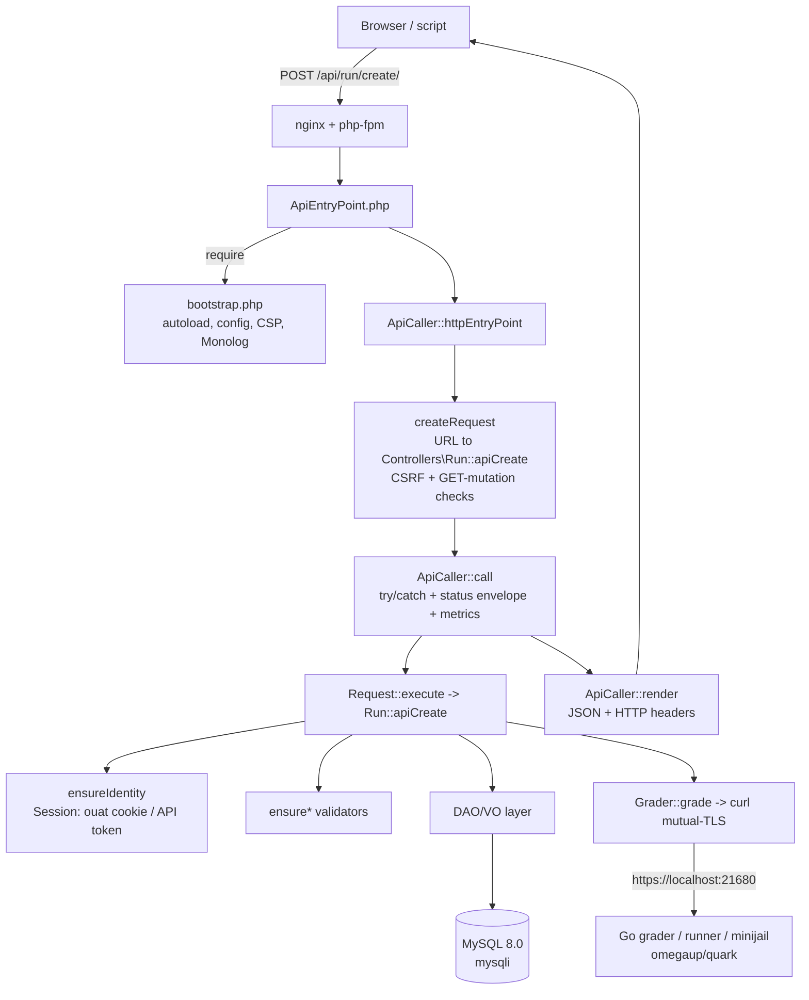

# Backend Architecture

The omegaUp backend is plain **PHP 8.1** served by **php-fpm behind nginx** (HHVM is long gone — there is not a single reference to it left in the tree). Everything lives under `frontend/server/src` in the PSR-4 namespace `\OmegaUp\...`, and the whole thing hangs off one idea: every call the browser or a script makes is an *API call*. There is no per-page PHP; a page is just the Twig shell `frontend/templates/template.tpl` that boots a Vue app, and that app talks to the server exclusively through `/api/...` endpoints. So to understand the backend you really only need to follow one request from the wire to MySQL and back, which is what this page does — using a code submission (`POST /api/run/create/`) as the worked example, because it touches every layer: dispatch, the `Request` object, auth, the DAO/VO data layer, and the external grader.

A one-line mental model to hold onto: the PHP backend is a **thin, stateless request dispatcher over MySQL** that hands the genuinely hard work (compiling, sandboxing and running submissions) to a separate Go service over HTTP. It never runs untrusted code itself.

## The entrypoint: one URL, one controller method

Every HTTP API call lands on the same tiny file, [`frontend/www/api/ApiEntryPoint.php`](https://github.com/omegaup/omegaup/blob/main/frontend/www/api/ApiEntryPoint.php), which is five lines long:

```php
<?php
require_once(__DIR__ . '/../../server/bootstrap.php');
echo \OmegaUp\ApiCaller::httpEntryPoint();
```

The `require` pulls in [`frontend/server/bootstrap.php`](https://github.com/omegaup/omegaup/blob/main/frontend/server/bootstrap.php), which is the process's one-time setup: it loads Composer's autoloader, forces the timezone to `UTC` (so every timestamp in the system is unambiguous regardless of where the server runs), refuses to start and prints the contents of `config.default.php` if you forgot to create a `config.php` (a deliberately loud failure so a fresh checkout tells you exactly what to do), computes `OMEGAUP_LOCKDOWN` by checking whether the `Host` header starts with `OMEGAUP_LOCKDOWN_DOMAIN` (lockdown is the hardened contest mode that disables everything not strictly needed during a live contest), emits the `Content-Security-Policy` and `X-Frame-Options: DENY` headers, and wires up the root **Monolog 2** logger — enriched with a New Relic processor *only if* that class exists, so the same code runs identically in dev without New Relic installed. Everything after this point can assume config, logging and the autoloader are live.

Then `\OmegaUp\ApiCaller::httpEntryPoint()` in [`frontend/server/src/ApiCaller.php`](https://github.com/omegaup/omegaup/blob/main/frontend/server/src/ApiCaller.php) runs the actual request. It does three things in order: build a `Request` from the URL (`createRequest()`), execute it (`call()`), and serialize the result to JSON (`render()`).

### Resolving the URL to `Controller::apiXxx`

`createRequest()` is where a URL becomes a callable. It splits `$_SERVER['REQUEST_URI']` on both `/` **and** `?` — the `?` is included on purpose so that `/api/problem/list/?page=1` and `/api/problem/list?page=1` parse identically, with or without the trailing slash. From the path `/api/{controller}/{method}/` it takes segment 2 as the controller and segment 3 as the method, then builds the fully-qualified class name `\OmegaUp\Controllers\{Ucfirst(controller)}` and the method name `api{Method}`. NUL bytes are stripped from both first, because they are a classic trick for smuggling past a `class_exists` check.

Two important naming conventions fall out of this. First, **omegaUp controller classes drop the `Controller` suffix**: the class that handles runs is `\OmegaUp\Controllers\Run` (in [`frontend/server/src/Controllers/Run.php`](https://github.com/omegaup/omegaup/blob/main/frontend/server/src/Controllers/Run.php)), *not* `RunController`. The same goes for `Contest`, `Problem`, `Submission`, `Grader`, and the rest. Second, **the public API surface is exactly the set of `public static function apiXxx` methods** — the `api` prefix is added by the dispatcher, so a method named `apiCreate` is reachable as `.../create/` and a plain method with no `api` prefix is unreachable from the web by construction. So `POST /api/run/create/` resolves to `\OmegaUp\Controllers\Run::apiCreate`. If either the class or the `apiXxx` method doesn't exist, the resolver logs the exact missing symbol and throws `\OmegaUp\Exceptions\NotFoundException('apiNotFound')` — which, as you'll see below, the browser is shown as a plain 404.

Before it will hand the request over, `createRequest()` enforces one cross-cutting rule: **mutating endpoints reject `GET`.** `isMutatingMethod()` lowercases the method name and matches it by substring against a list of state-changing verbs (`add`, `create`, `delete`, `update`, `login`, `logout`, `rejudge`, `refresh`, `verify`, and about two dozen more); if a `GET` hits one of those it throws `MethodNotAllowedException` rather than run it. Because the match is by substring, a genuinely read-only method whose name happens to contain a mutating verb (for example `listAssociatedIdentities` contains "associate") would be caught by mistake, so there's an explicit `$readOnlyAllowlist` (`execute`, `executeForIDE`, `listAssociatedIdentities`, `statusVerified`) that opts those back into allowing `GET`. This is what forces every real write to go through `POST`.

There is a second gate in the sibling method `isCSRFAttempt()`, run at the top of `call()`: if the request carries a `Referer` header, its host must match `OMEGAUP_URL`'s host, the lockdown domain, or one of `OMEGAUP_CSRF_HOSTS` — otherwise the whole call is rejected as CSRF. It **fails closed**: a malformed referrer or a malformed `OMEGAUP_URL` is treated as an attack, not waved through. An API call with *no* `Referer` is allowed, because that's how a legitimately hand-crafted script or the mobile client calls the API; the check only exists to stop a logged-in browser being tricked by a third-party page.

## The `Request` object and authentication

The dispatcher packages the incoming parameters into an [`\OmegaUp\Request`](https://github.com/omegaup/omegaup/blob/main/frontend/server/src/Request.php), which extends `\ArrayObject` — so a controller reads a parameter as `$r['problem_alias']`, and a missing key returns `null` instead of raising a notice (that's the whole reason `offsetGet` is overridden). `createRequest()` seeds it from `$_REQUEST`, then layers on the path-style parameters (the `/key/value/` pairs some endpoints use), and finally stamps two fields the executor needs: `$request->methodName` (e.g. `run.create`, used to name the transaction for New Relic and Prometheus) and `$request->method` (the `callable-string` `\OmegaUp\Controllers\Run::apiCreate`).

Controllers never trust raw request values. The `Request` class carries a family of **`ensure*` validators** that each read a key, assert its type and range, coerce the stored value in place, and return the typed result — throwing `InvalidParameterException('parameterEmpty', $key)` when a required key is missing:

- `ensureString($key, $validator?)` / `ensureOptionalString(...)` — a string, optionally checked by a callback (used for aliases, usernames, and the like).
- `ensureInt($key, $lowerBound?, $upperBound?)` / `ensureOptionalInt(...)` — an integer, range-checked via `\OmegaUp\Validators::validateNumberInRange`.
- `ensureFloat(...)`, `ensureBool(...)`, `ensureTimestamp(...)` and their `ensureOptional*` twins — with `ensureTimestamp` returning a first-class `\OmegaUp\Timestamp` object rather than a bare int.
- `ensureEnum($key, $enumValues)` / `ensureOptionalEnum(...)` — rejects anything outside the allowed set and reports both the bad value and the expected set in the error, so the client sees *why* it was rejected.

The `Optional` variants return `null` when the key is absent and only demand it when you pass `required: true`. This is not just ergonomics: every additional nullable parameter roughly doubles the number of input combinations a function can receive, so the codebase treats a large fan-out of optional parameters as a code smell to keep well under control rather than a free convenience.

### Who is calling: sessions, the `ouat` token, and API tokens

The very first line of almost every `apiXxx` method is an authorization assertion on the request. `$r->ensureIdentity()` requires *some* logged-in identity and throws `UnauthorizedException` (→ HTTP 401) otherwise; `$r->ensureMainUserIdentity()` additionally requires that the logged-in identity is the *main* identity of its user (throwing `ForbiddenAccessException` → 403 for a secondary/team identity); and `$r->ensureIdentityIsOver13()` layers on an age gate that blocks under-13 accounts from actions they aren't allowed to perform. These populate `$r->identity`, `$r->user` and `$r->loginIdentity` for the rest of the method to use.

All of them resolve the caller through `\OmegaUp\Controllers\Session::getCurrentSession()`, which supports **two** credential styles. The everyday one is the browser session cookie, whose name is `ouat` (`OMEGAUP_AUTH_TOKEN_COOKIE_NAME`, defined in [`config.default.php`](https://github.com/omegaup/omegaup/blob/main/frontend/server/config.default.php)). The `ouat` value is *not* a PASETO token — it is an opaque three-part string minted at login as `"{entropy}-{identity_id}-{hash}"`, where `entropy` is `bin2hex(random_bytes(15))` (30 hex chars, `AUTH_TOKEN_ENTROPY_SIZE = 15`) and `hash` is `sha256(OMEGAUP_MD5_SALT . identity_id . entropy)`. On each request the token is looked up server-side in the `AuthTokens` table via `\OmegaUp\DAO\AuthTokens::getIdentityByToken()`; if it isn't there, the session is simply `valid => false` and you're anonymous. Old tokens are pruned when a new one is created, and the same token is deleted from the session cache on mint so a stale cache entry can't outlive a re-login. The dispatcher copies this cookie into `$request['auth_token']` in `createRequest()`, which is why a controller can also accept an explicit `auth_token` parameter and behave identically whether it came from a cookie or the query string.

The second style is a bearer **API token** in the `Authorization` header, used by scripts and integrations. That path (`getCurrentSessionImplForAPIToken`) looks the credential up in the `APITokens` table and, unlike the cookie path, is **rate-limited**: it emits `X-RateLimit-Limit` / `X-RateLimit-Remaining` / `X-RateLimit-Reset` headers on every call and throws `RateLimitExceededException` with a `Retry-After` once the remaining count hits `0`. Where genuine **PASETO** (`paragonie/paseto`) *does* show up is in [`frontend/server/src/SecurityTools.php`](https://github.com/omegaup/omegaup/blob/main/frontend/server/src/SecurityTools.php), which signs short-lived v2 tokens for talking to the external **gitserver** (public-key signed) and for course-clone operations (local/symmetric) — subsystem-to-subsystem trust, distinct from the `ouat` user session.

## Executing the call

With a fully-built `Request`, `ApiCaller::call()` runs it inside one big `try/catch`. `$request->execute()` (in `Request.php`) just does `call_user_func($this->method, $this)` — i.e. invokes `Run::apiCreate($r)` — and insists the result is an array, throwing `InternalServerErrorException` if a controller ever returns a non-array. On success, `call()` applies the platform's response convention: if the controller returned an associative array with no `status` key of its own, it injects `'status' => 'ok'`. Every omegaUp API response therefore carries a `status`, and error responses carry the `{status: 'error', error, errorcode, errorname}` envelope produced by `ApiException::asResponseArray()`, with the human-readable `error` message localized to the account's configured language.

The catch ladder is deliberately ordered. An `ExitException` means a controller explicitly asked to end the request (for example after streaming a file) and simply `exit`s. An `ApiException` — the base class for every "expected" failure like `NotFound`, `Unauthorized`, `Forbidden`, `InvalidParameter` — is kept as-is. **Anything else** (a raw `\Exception`, i.e. a bug) is wrapped in `InternalServerErrorException('generalError')` so an unexpected stack trace never leaks to the client. Either way the exception is logged (5xx go to `error` level *and* `NewRelicHelper::noticeError`; everything else is `info`), the outcome is recorded in Prometheus via `\OmegaUp\Metrics::getInstance()->apiStatus(methodName, httpCode)`, and the envelope is returned. This is why you can grep production metrics by method name and HTTP status: the instrumentation is centralized here, once, rather than sprinkled through the controllers.

## The DAO / VO data layer over MySQL

Controllers don't write SQL by hand. All persistence goes through a two-part, mostly **auto-generated** layer sitting on top of the **mysqli** driver.

A **VO (Value Object)** is a dumb typed row. `\OmegaUp\DAO\VO\Runs` ([`frontend/server/src/DAO/VO/Runs.php`](https://github.com/omegaup/omegaup/blob/main/frontend/server/src/DAO/VO/Runs.php)) has one public property per column (`run_id`, `submission_id`, `version`, `commit`, `status`, `verdict`, `runtime`, `penalty`, `memory`, `score`, `contest_score`, `time`, `judged_by`) and a `FIELD_NAMES` map. Its constructor takes an associative array and **throws on any unknown column** — so a typo'd field name fails loudly at construction instead of silently vanishing — coercing each value to the column's real PHP type (ints via `intval`, the `time` column into an `\OmegaUp\Timestamp`).

A **DAO (Data Access Object)** is where the SQL lives, split into two files on purpose. The generated base class `\OmegaUp\DAO\Base\Runs` ([`frontend/server/src/DAO/Base/Runs.php`](https://github.com/omegaup/omegaup/blob/main/frontend/server/src/DAO/Base/Runs.php)) — every one of these files carries the `!ATENCION! Este codigo es generado automáticamente` banner warning you that hand-edits will be overwritten the next time the generator runs — provides the CRUD-by-primary-key primitives: `create()`, `update()`, `getByPK()`, `existsByPK()`, `delete()`, `getAll()`. These are literal parameterized `INSERT` / `UPDATE` / `SELECT ... WHERE run_id = ?` statements listing every column by name. The public subclass `\OmegaUp\DAO\Runs` (in [`frontend/server/src/DAO/Runs.php`](https://github.com/omegaup/omegaup/blob/main/frontend/server/src/DAO/Runs.php)) `extends` that base and is where humans add the hand-written, join-heavy queries a table actually needs (e.g. `getBestSolvingRunsForProblem`). The split means you regenerate the boring boilerplate safely without ever clobbering the interesting queries.

Underneath both sits [`\OmegaUp\MySQLConnection`](https://github.com/omegaup/omegaup/blob/main/frontend/server/src/MySQLConnection.php), a thin ADOdb-compatible wrapper around a single mysqli connection. A few of its choices are load-bearing:

- **Parameter binding is done in PHP, not by the driver.** `BindQueryParams()` splits the SQL on `?`, and substitutes each parameter with the correct escaping: `NULL` for null, `FROM_UNIXTIME(...)` for an `\OmegaUp\Timestamp`, raw digits for ints/floats, `1`/`0` for bools, and `real_escape_string`-wrapped quotes for strings. A count mismatch between `?` placeholders and supplied params throws immediately, which turns a whole class of injection-shaped bugs into a hard error.
- **Result rows are re-typed to match the schema.** mysqli hands back strings; `MapFieldTypes`/`MapValue` inspect the field metadata and coerce each column to `int` / `float` / `bool` / `string` / `\OmegaUp\Timestamp` so the VO always sees real PHP types. (Defining `DUMP_MYSQL_QUERY_RESULT_TYPES` makes it log a Psalm-shaped `array{...}` type for each query — that's how the generated `@psalm-type` annotations that keep the whole codebase statically typed are produced.)
- **`autocommit` is off**, and the connection registers a shutdown function that flushes any outstanding transaction at end of request. `StartTrans`/`CompleteTrans`/`FailTrans` are **reference-counted**, so nesting a transaction inside another just increments a counter and only the outermost `CompleteTrans` actually `COMMIT`s (or `ROLLBACK`s if anyone called `FailTrans`). This lets independent helper functions each open a "transaction" without fighting over commit boundaries.
- **A dropped connection is retried once, but only when safe.** If a query fails with a "MySQL server has gone away" error *and* nothing uncommitted is in flight (`_needsFlushing === false`), it reconnects and retries exactly once; if there were pending writes it refuses, because a blind retry could double-apply them.

The default connection target is `OMEGAUP_DB_HOST = 'mysql:13306'`, database `omegaup`, on **MySQL 8.0**, with the charset pinned to `utf8mb4` / `utf8mb4_unicode_ci` so emoji and the full range of names round-trip correctly.

### Putting it together: `Run::apiCreate`

Now the layers connect. `\OmegaUp\Controllers\Run::apiCreate` (around L415) runs, in order: `ensureIdentity()`; `ensureString('source')`; `validateCreateRequest()` (which resolves the problem and contest, checks required fields, and enforces that the problem is actually in that contest); computes `submit_delay` — the whole point of which is that it is the number of minutes from when penalties start (the contest start, or when the user first opened the problem, depending on the contest's `penalty_type`) until this submission, and it is `0` for practice runs outside any contest. It then builds a `Submissions` VO (with a fresh `guid`, `status => 'uploading'`, `verdict => 'JE'`) and a `Runs` VO, and inside `TransactionHelper::executeWithRetry(...)` — a wrapper that retries on deadlock — it re-checks the **submission gap** (currently one submission per problem per configured cooldown, verified *inside* the transaction so two racing submissions can't both slip through), inserts the submission and run, and links them.

Only after the rows are committed does it call `\OmegaUp\Grader::getInstance()->grade($run, trim($source))` (around L573) to actually schedule judging. The ordering matters and the failure handling is explicit: the grade call **cannot** be part of the DB transaction, because the grader is a separate process that queries the `Runs` row over the network and would not see an uncommitted row. So if `grade()` throws, `apiCreate` manually unwinds — nulls out `current_run_id`, then deletes the run and the submission (in that order, to avoid a foreign-key violation) — and rethrows, leaving the database as if the submission never happened.

## The external services it talks to

The backend is stateful only in MySQL; everything else it needs, it reaches over the network.

### The grader, over HTTP

The grader/runner/broadcaster and the **minijail** sandbox are **not in this repository** — they are separate **Go** services in [github.com/omegaup/quark](https://github.com/omegaup/quark) (the tree has `grader/`, `runner/`, `broadcaster/`, `cmd/omegaup-grader`, `cmd/omegaup-runner`, `cmd/omegaup-broadcaster`, and `Dockerfile.minijail`), with problem storage handled by [github.com/omegaup/gitserver](https://github.com/omegaup/gitserver). The PHP side's entire knowledge of that world is [`\OmegaUp\Grader`](https://github.com/omegaup/omegaup/blob/main/frontend/server/src/Grader.php), a **thin curl client** — it does not implement the judging queue, the runner pool, or the sandbox; it just POSTs to them and reads status. It talks to `OMEGAUP_GRADER_URL` (default `https://localhost:21680`) at a small, fixed set of endpoints:

- `POST /run/new/{run_id}/` — `grade()`, schedule a single new submission (the source is sent raw in the body).
- `POST /run/grade/` — `rejudge()`, re-judge a batch of runs by id.
- `GET /submission/source/{guid}/` — `getSource()`, fetch a submission's source back.
- `POST /broadcast/` — `broadcast()`, push a live event (new clarification, scoreboard change) out to connected contest clients via the broadcaster.
- `GET /run/resource/` — `getGraderResource()`, retrieve a per-run artifact like compiler output or the detailed judge log.
- `GET /grader/status/` — `status()`, the queue's health, modeled by the `GraderStatus` psalm-type as `{status, broadcaster_sockets, embedded_runner, queue: {running, run_queue_length, runner_queue_length, runners}}`; this is what `\OmegaUp\Controllers\Grader::apiStatus` surfaces.

Two operational details are worth remembering. First, the transport is **mutual-TLS**: `curlRequestSingle()` pins a client key and certificate (`/etc/omegaup/frontend/key.pem`, `certificate.pem`) and requires TLS 1.2 with peer + host verification, with a 5-second connect timeout and a 30-second overall timeout — the grader trusts the frontend *because* of that certificate, not because of any user token. Second, transient failures are **retried up to 3 times with exponential backoff** (1s, 2s, capped at 5s), but only for a specific allowlist of retryable errors (SSL/connection/operation timeouts, `HTTP/2 stream`, `INTERNAL_ERROR`); a clean non-200 or a 404 is not retried, and a 404 with `missingOk` set simply returns `null` (that's how an artifact that legitimately doesn't exist yet is distinguished from a real failure). For local development and tests, `OMEGAUP_GRADER_FAKE` short-circuits all of this: `grade()` just writes the source to `/tmp/{guid}` and `status()` returns a canned empty queue, so you can run the whole backend without a grader present.

### Redis and RabbitMQ

Beyond the grader, the backend leans on two more pieces of infrastructure declared in `config.default.php`. **Redis** (`REDIS_HOST = 'redis'`, port `6379`) backs shared caching. **RabbitMQ 3** (`OMEGAUP_RABBITMQ_HOST = 'rabbitmq'`, port `5672`, via **php-amqplib**) is the message bus for asynchronous work that shouldn't block an API response — the kind of jobs where the user doesn't need to wait for the result inline. Both are optional in the sense that the app's core request/response path is MySQL + grader; they make the platform scale rather than function.

## The whole path, at a glance



## How the response gets back to the browser

Finally, `ApiCaller::render()` turns the array into JSON. It appends a per-request `_id` (a `uniqid` generated once in `Request.php`, so every response is traceable in the logs), pretty-prints only when the request explicitly asked with `prettyprint=true`, and defends against un-encodable data: if `json_encode` fails on illegal UTF-8 it retries with `JSON_PARTIAL_OUTPUT_ON_ERROR` to salvage a usable response rather than break the page entirely — the motivating case being a problem statement containing stray bytes. `setHttpHeaders()` sends aggressive no-cache headers (with a period-piece `// Scumbag IE y su cache agresivo` comment explaining why) and `X-Robots-Tag: noindex` on every API response.

The one piece of security policy worth internalizing lives in `handleException()`, which maps exception codes to what the browser is actually shown: **a 403 `ForbiddenAccessException` is served as a 404**. That is deliberate — for a resource you're not allowed to see (a private contest, an unpublished problem), omegaUp pretends it does not exist rather than confirming it does and merely refusing you, so probing for hidden resources leaks nothing. A 401 redirects to `/login/` with the original URL preserved in `?redirect=`; a 400 serves `www/400.html`; anything else is a 500. Keep that 403→404 rule in mind whenever you touch authorization: "forbidden" and "not found" are intentionally indistinguishable from the outside.

## Related Documentation

- **[Database Patterns](../development/database-patterns.md)** — the DAO/VO layer in depth
- **[MVC Pattern](mvc-pattern.md)** — how controllers, DAOs and VOs fit together
- **[API Reference](../api/index.md)** — the endpoint catalog
