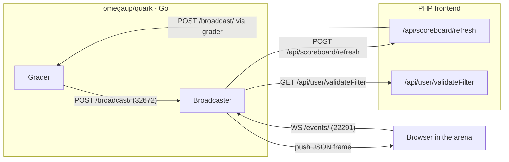
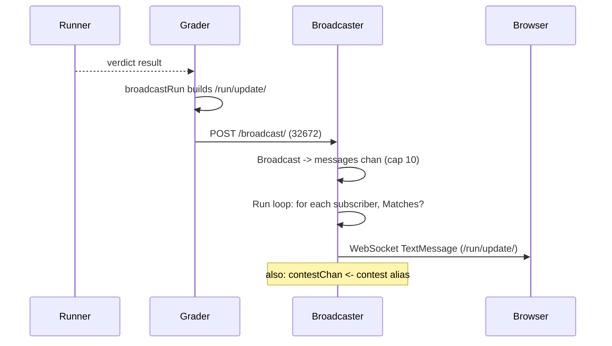
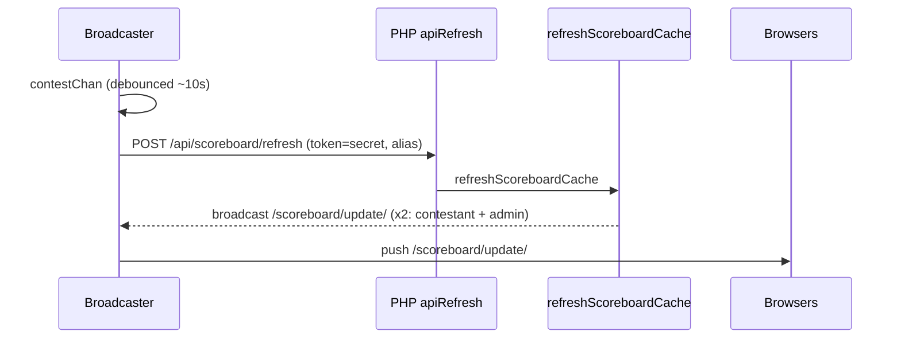

# Broadcaster Architecture {#broadcaster-architecture}

The broadcaster is the small Go service that makes the arena feel alive. When you are sitting in a contest and your submission flips from "judging" to a green **AC**, or the scoreboard reshuffles because a rival just solved problem C, that update did not arrive because your browser polled for it — it was *pushed* to you over a WebSocket that the broadcaster has been holding open since you opened the page. Its entire job is to keep one long-lived connection per participant and fan out near-realtime events (verdicts, scoreboard changes, clarifications) to exactly the people allowed to see them.

It lives in the separate [`omegaup/quark`](https://github.com/omegaup/quark) Go repository (**not** in the PHP monorepo), alongside the grader and the runner. The PHP frontend never speaks WebSocket itself; it only ever POSTs plain JSON to the grader, and the grader forwards it here. A useful one-line mental model: **the broadcaster is a stateless in-memory pub/sub fabric whose subscriptions are authorized by the PHP frontend and whose events are published by the grader.** It holds no database, caches nothing, and if it crashes and restarts, every client simply reconnects and the world is whole again — the only thing lost is a few seconds of "live-ness".

## Situating it: who talks to whom {#situating-it-who-talks-to-whom}

The broadcaster exposes **two** HTTP servers on two different ports, because it has two completely different audiences with two completely different trust levels.

- The **events server** (`EventsPort`, currently **22291**) is the public-facing one that browsers connect to at `/events/`. It speaks WebSocket (subprotocol `com.omegaup.events`) or, as a fallback, Server-Sent Events. This is where subscribers live.
- The **internal API server** (`Port`, currently **32672**) exposes `/broadcast/` and `/deauthenticate/`. This is the private back door that only the grader is supposed to reach, used to *inject* messages and to forcibly evict a user's connections.

A third mux serves Prometheus `/metrics` on `Metrics.Port` — which lives in the sibling `MetricsConfig` struct, *not* `BroadcasterConfig`, because metrics are a cross-service concern shared with the grader and runner. The two broadcaster ports' defaults (`EventsPort` and `Port`) live in [`common/context.go`](https://github.com/omegaup/quark/blob/main/common/context.go) in the `BroadcasterConfig` struct, and `docker-compose.yml` in the frontend repo exposes exactly `32672` and `22291` for the `broadcaster` service.

## A subscriber connects, and PHP decides what it may hear {#a-subscriber-connects-and-php-decides-what-it-may-hear}

Everything starts when a browser opens the arena. The frontend's [`events_socket.ts`](https://github.com/omegaup/omegaup/blob/main/frontend/www/js/omegaup/arena/events_socket.ts) builds a URL like `wss://omegaup.com/events/?filter=/problemset/1234`, appending the scoreboard token when the page was opened via a public-scoreboard link (`.../problemset/1234/<token>`), and calls `new WebSocket(this.uri, 'com.omegaup.events')`. The `filter` query parameter is the heart of the protocol: it is a comma-separated list of resource paths the client claims to be interested in.

The events mux in [`cmd/omegaup-broadcaster/main.go`](https://github.com/omegaup/quark/blob/main/cmd/omegaup-broadcaster/main.go) handles that request. First it extracts the caller's identity from wherever it can find it, in a deliberate order: the `ouat` cookie (a normal logged-in session), then an `Authorization: token <APIToken>` header, then an `api_token` cookie. That last fallback exists for a very specific reason spelled out in a comment in the code — *WebSockets don't allow the client to set arbitrary request headers*, so an API token has to be smuggled in through a cookie instead of the header a normal REST call would use.

Then comes the crucial handoff: the broadcaster **does not decide for itself** whether you may subscribe to `/problemset/1234`. It cannot — it has no database and no notion of who is a contest admin. Instead, `NewSubscriber` in [`broadcaster/subscriber.go`](https://github.com/omegaup/quark/blob/main/broadcaster/subscriber.go) makes a server-to-server HTTP `GET` back to the PHP frontend at `FrontendURL + api/user/validateFilter/`, forwarding your cookie or token and your requested filter string. The PHP side, `\OmegaUp\Controllers\User::apiValidateFilter` in [`User.php`](https://github.com/omegaup/omegaup/blob/main/frontend/server/src/Controllers/User.php), walks each filter token and throws `ForbiddenAccessException` the moment you ask for something you have no right to — a `/user/<name>` filter that isn't your own username (unless you're an admin), an `/all-events` filter when you're not an admin, a `/contest/<alias>` you can't see. Note that this endpoint *deliberately does not require authentication*: an anonymous visitor holding a valid scoreboard token can still track a public contest, which is exactly why the token rides along in the filter path.

If the frontend answers `200`, its JSON body — modeled by `ValidateFilterResponse` — tells the broadcaster who you turned out to be: your `user`, whether you're a global `admin`, and the lists of `problem_admin`, `contest_admin`, and `problemset_admin` resources you administer. The broadcaster stashes these in per-subscriber maps and will consult them on every single message. If the frontend answers anything else, `NewSubscriber` returns an `UpstreamError` carrying the frontend's status code and body, and the broadcaster relays that exact status straight back to the browser — so a `403` from PHP becomes a `403` on the WebSocket upgrade, and the client never joins. This is the single authorization gate; there is no re-check later, which is *why* the broadcaster can afford to be a dumb, fast fan-out loop afterward.

## Filters: how one message finds its audience {#filters-how-one-message-finds-its-audience}

A subscriber isn't subscribed to "channels" in any stateful sense — it carries a list of `Filter` predicates parsed from that comma-separated string by `NewFilter` in [`broadcaster/filter.go`](https://github.com/omegaup/quark/blob/main/broadcaster/filter.go). When a message arrives, the broadcaster asks every subscriber "does any of your filters match this?" and delivers only if the answer is yes. There are currently five filter shapes, each a leading-slash path:

- **`/all-events`** — matches every message, but *only* if `subscriber.admin` is true. This is the firehose, reserved for site admins.
- **`/user/<username>`** — matches a message whose `User` field equals the subscriber's own resolved username. This is how your personal verdict updates reach you and nobody else.
- **`/problem/<alias>`** — matches messages tagged with that problem, gated so a message is delivered only if the subscriber is an admin, or the message is `Public`, or the message is about the subscriber's own activity, or the subscriber is in that problem's admin map.
- **`/problemset/<id>[/<token>]`** — the same idea keyed on a numeric problemset id (a contest's problemset), with an optional scoreboard token appended.
- **`/contest/<alias>[/<token>]`** — the same, keyed on a contest alias.

The gating logic is worth reading literally, because it is the reason a contestant never sees another contestant's private run. `ContestFilter.Matches` returns true only when `msg.Contest == f.contest` **and** at least one of: `subscriber.admin`, `msg.Public`, `subscriber.user != "" && msg.User == subscriber.user`, or the contest is in the subscriber's `contestAdminMap`. So a non-admin sitting in a contest gets the *public* scoreboard broadcasts and *their own* run updates, but a private per-user event addressed to someone else fails every clause and is silently skipped. The frontend's browser filter is deliberately coarse (`/problemset/<id>`); the broadcaster's per-message check is what makes the delivery precise.

## The real path: a run is graded and the verdict lands in your browser {#the-real-path-a-run-is-graded-and-the-verdict-lands-in-your-browser}

Now trace one submission all the way through. Suppose you submit to problem C in contest `pizza-2024`, the runner executes it, and the grader finishes with a verdict of `AC`.

**1. The grader publishes a `/run/update/`.** In [`cmd/omegaup-grader/frontend_handler.go`](https://github.com/omegaup/quark/blob/main/cmd/omegaup-grader/frontend_handler.go), the `RunPostProcessor` notifies a listener for every finished `RunInfo`, which (when `Grader.V1.SendBroadcast` is on) calls `broadcastRun`. That function builds a `broadcaster.Message` whose top-level fields are the *routing* metadata — `Problem`, `Contest`, `Problemset`, `Public: false` — and whose `Message` field is a JSON *string* of the actual payload: `{"message":"/run/update/","run":{...}}`. That inner `run` object is the wire contract the browser consumes: `username`, `contest_alias`, `alias`, `guid`, `runtime`, `memory`, `score`, `contest_score`, `status:"ready"`, `verdict`, `language`, and so on. One edge case is baked in right here: if the problem's score mode is `all_or_nothing` and the score isn't a perfect `1`, the grader rewrites `score` and `contest_score` to `0` and the `verdict` to `WA` before sending, so partial credit never leaks into an all-or-nothing display.

**2. It POSTs to `/broadcast/`.** `broadcast` (same file) marshals the `Message` and `client.Post`s it to `Grader.BroadcasterURL` — the broadcaster's internal API on port **32672**. (When the *PHP* side wants to broadcast, it instead POSTs to `OMEGAUP_GRADER_URL + /broadcast/`, and the grader's own `/broadcast/` handler simply forwards it here with the same `broadcast()` function — so there is exactly one code path into the broadcaster, and the grader is always the last hop.)

**3. The broadcaster enqueues it.** The `/broadcast/` handler in `main.go` decodes the JSON into a `broadcaster.Message` and calls `b.Broadcast(&message)`. `Broadcast` wraps it in a `QueuedMessage` (stamping `time.Now()` so latency can be measured later) and does a *non-blocking* send onto the buffered `messages` channel. If that channel is full — its capacity is `ChannelLength`, currently only **10** — the message is dropped on the floor: it logs `"Dropped broadcast message"`, bumps the `channel_drop_total` counter, and `Broadcast` returns `false`, which makes the handler answer `503 Service Unavailable`. This is a deliberate load-shedding choice: a realtime update that can't be delivered promptly is worthless, so the broadcaster would rather drop it than block the grader.

**4. The main loop fans it out.** `Broadcaster.Run` in `subscriber.go` is a single goroutine `select`ing over four channels — `subscribe`, `unsubscribe`, `deauth`, and `messages` — which means all subscriber bookkeeping happens on one goroutine and needs no locks. When a message pops off `messages`, it loops over every subscriber, skips the ones where `s.Matches(m.message)` is false, and does *another* non-blocking send onto that subscriber's personal `send` channel. Here the failure handling is more aggressive: if an individual subscriber's `send` buffer is full (again `ChannelLength`), that subscriber is presumed too slow or dead, so it's logged, counted, and **removed entirely** — a wedged client can't back up the whole fan-out. After the loop it calls `m.Processed()`, recording the process-latency metric.

**5. The subscriber writes the frame.** Each `Subscriber.Run` goroutine `select`s on its own `send` channel and hands the message to its `Transport.Send`. For a WebSocket that's a `TextMessage` carrying the raw `Message.Message` JSON string; the browser's `socket.onmessage` in `events_socket.ts` parses it, sees `data.message == '/run/update/'`, and commits the updated run into the Vuex store — and your submission row turns green. That same `Subscriber.Run` loop also fires a `Ping` every `PingPeriod` (currently **30s**) to keep the socket from being reaped for inactivity, and returns the instant the connection's read side closes.

## The scoreboard loop: why one verdict triggers a second round-trip {#the-scoreboard-loop-why-one-verdict-triggers-a-second-round-trip}

A verdict updating your own row is only half the story. That same `AC` might change the *scoreboard*, and the scoreboard is computed in PHP, not in Go. The broadcaster bridges this with a clever second step hiding in the `/broadcast/` handler.

Right after enqueuing the message, the handler checks: `if len(message.Contest) > 0 && strings.Contains(message.Message, "\"message\":\"/run/update/\"")`, then push `message.Contest` onto an internal `contestChan`. (There's an honest `TODO(lhchavez)` in the code admitting that string-matching the payload is a hack.) In other words: *a run update inside a contest is the trigger to ask the frontend to recompute that contest's scoreboard.*

`contestChan` feeds `updateScoreboardLoop`, and this is where the design earns its keep, because a naive implementation would hammer the frontend during the last frantic minutes of a contest. Instead it runs a **leading-plus-trailing debounce** keyed per contest, using a min-heap of deadlines and an `eventSet` map. The first update for a contest fires an immediate refresh *and* schedules a trailing one `ScoreboardUpdateTimeout` (currently **10s**) later; any further updates for that same contest inside the window just flip `eventSet[alias] = true` so that exactly one coalesced trailing refresh fires when the timer expires. The result: a busy contest gets its scoreboard refreshed at most about once every 10 seconds instead of once per submission, no matter how many runs land in that window.

`updateScoreboardForContest` then POSTs a form to `FrontendURL + api/scoreboard/refresh/`, sending `token` = `ScoreboardUpdateSecret` and `alias` = the contest. On the PHP side, `\OmegaUp\Controllers\Scoreboard::apiRefresh` in [`Scoreboard.php`](https://github.com/omegaup/omegaup/blob/main/frontend/server/src/Controllers/Scoreboard.php) opens with the guard `if ($r['token'] !== OMEGAUP_GRADER_SECRET) throw new ForbiddenAccessException()`. The comment there explains the whole trust model: *this is never called by end users, only by the grader service; regular sessions can't be used because they expire, so a pre-shared secret grants admin-level privilege just for this one call.* It then recomputes both the contestant and admin scoreboards via `\OmegaUp\Scoreboard::refreshScoreboardCache`.

And here the snake eats its tail. At the end of `refreshScoreboardCache` in [`Scoreboard.php`](https://github.com/omegaup/omegaup/blob/main/frontend/server/src/Scoreboard.php), PHP calls `\OmegaUp\Grader::getInstance()->broadcast(...)` **twice** — once with a `{"message":"/scoreboard/update/","scoreboard_type":"contestant",...}` payload sent `public: true`, and once with `scoreboard_type: "admin"` sent `public: false`. Those go back out to `OMEGAUP_GRADER_URL/broadcast/`, through the grader, into the broadcaster, through the exact same fan-out loop, and land in every connected browser whose filter matches. The client's `onmessage` sees `/scoreboard/update/` and re-renders the ranking. So a single graded run produces two waves: an immediate personal `/run/update/`, and a slightly-later, debounced, public `/scoreboard/update/` that made a full round-trip out to PHP and back.

## Two transports: WebSocket and the SSE fallback {#two-transports-websocket-and-the-sse-fallback}

The `Transport` interface in [`broadcaster/transport.go`](https://github.com/omegaup/quark/blob/main/broadcaster/transport.go) abstracts *how* a frame reaches a subscriber, and there are two implementations. The default is `WebSocketTransport`, chosen by upgrading the HTTP connection with the `com.omegaup.events` subprotocol; its `Send` writes a `TextMessage` under a write deadline of `WriteDeadline` (currently **5s**), and its `ReadLoop` reads and *discards* everything the client sends — the protocol is one-directional, the client never talks back except to keep the pipe warm. `Ping` sends a WebSocket control ping.

The second is `SSETransport`, selected when the request's `Accept` header asks for `text/event-stream`. It writes `data: <json>\n\n` frames and sets `X-Accel-Buffering: no` so nginx won't buffer the stream. Because a browser can't send anything over SSE, its `ReadLoop` just blocks until the connection's close is notified, and its `Ping` writes a bare `:\n` comment line to keep the connection open. Both transports funnel into the same `Subscriber`, so the rest of the broadcaster is blissfully unaware which one you're using.

The frontend prefers the WebSocket and treats failure gracefully. In `events_socket.ts`, if the socket never opens or later drops, `connect()` catches it, reports an `events-socket / fallback` telemetry event, and starts **polling** the REST API on a timer (`setupPolls` hits `api.Problemset.scoreboard` and the clarifications endpoint) so the arena keeps updating — just less promptly. If the socket later reconnects, those polling intervals are cleared. This is the graceful-degradation story: a participant behind a proxy that murders WebSockets still sees a working, if slightly laggier, scoreboard rather than a frozen page.

## Deauthentication: kicking a user off {#deauthentication-kicking-a-user-off}

The internal API's other endpoint, `/deauthenticate/<user>/`, exists for the moment a user logs out or has their session revoked: the frontend can tell the broadcaster to drop *all* of that user's live connections immediately, rather than waiting for them to notice. It pushes the username onto the `deauth` channel; the main `Run` loop then iterates the subscribers and calls `remove` on every one whose `user` matches, which closes their `send` channel and lets their `Subscriber.Run` goroutine unwind and close the socket. Without this, a revoked session could keep receiving private contest events until its WebSocket happened to drop on its own.

## Configuration {#configuration}

The full `BroadcasterConfig` and its defaults live in [`common/context.go`](https://github.com/omegaup/quark/blob/main/common/context.go). The values that matter operationally, all current defaults:

| Key | Default | What it controls |
|-----|---------|------------------|
| `EventsPort` | `22291` | Public WebSocket/SSE port browsers connect to at `/events/` |
| `Port` | `32672` | Private API port for `/broadcast/` and `/deauthenticate/` |
| `FrontendURL` | `https://omegaup.com` | Base URL for the `validateFilter` and `scoreboard/refresh` callbacks |
| `ChannelLength` | `10` | Buffer size of both the global message queue and each subscriber's send queue; overflow means the message (or the slow subscriber) is dropped |
| `PingPeriod` | `30s` | How often each subscriber is pinged to keep the connection alive |
| `WriteDeadline` | `5s` | Per-frame WebSocket write timeout |
| `ScoreboardUpdateTimeout` | `10s` | Debounce window that coalesces a burst of run updates into one scoreboard refresh |
| `ScoreboardUpdateSecret` | `"secret"` | Pre-shared token sent as `token` to `/api/scoreboard/refresh`; must equal the frontend's `OMEGAUP_GRADER_SECRET` |
| `Proxied` | `true` | When true, TLS is terminated upstream (by nginx) and the events server runs plain HTTP behind it; when false it serves its own `TLS` cert/key |

The `--insecure` flag disables TLS on the internal API server entirely and, as a side effect, adds permissive CORS headers on `/broadcast/` — handy for local development, but as with the grader's `--insecure` curl flag, it's a known wart you never want in production.

## Metrics and observability {#metrics-and-observability}

The broadcaster registers Prometheus metrics in [`cmd/omegaup-broadcaster/metrics.go`](https://github.com/omegaup/quark/blob/main/cmd/omegaup-broadcaster/metrics.go), served at `/metrics`. The ones worth watching, all prefixed `broadcaster_`:

- **`websockets_count`** / **`sse_count`** — gauges of currently open connections of each transport; these are your live-audience size, and the same numbers surface in the grader status API's `broadcaster_sockets` field.
- **`messages_total`** — counter of messages that made it into the fan-out loop.
- **`channel_drop_total`** — counter incremented on *every* drop, whether the global queue was full, a subscriber's queue was full, or a subscribe/unsubscribe request was shed. A rising `channel_drop_total` is the canonical symptom that `ChannelLength` is too small or a downstream is too slow — realtime updates are being silently discarded.
- **`process_latency_seconds`** / **`dispatch_latency_seconds`** — summaries measuring, respectively, how long a message waited before the fan-out loop enqueued it to all subscribers, and how long until it was actually written to the wire. These are timed off the `QueuedMessage.time` stamp set at ingestion. The binary also mounts `net/http/pprof`, so live goroutine and heap profiles are available when a connection leak is suspected.

## Source Code {#source-code}

Everything above lives in [`omegaup/quark`](https://github.com/omegaup/quark):

- [`cmd/omegaup-broadcaster/main.go`](https://github.com/omegaup/quark/blob/main/cmd/omegaup-broadcaster/main.go) — the two HTTP servers, the `/broadcast/` and `/deauthenticate/` handlers, and the `updateScoreboardLoop` debouncer.
- [`broadcaster/subscriber.go`](https://github.com/omegaup/quark/blob/main/broadcaster/subscriber.go) — the `Broadcaster` fan-out loop and the `Subscriber` (including the `validateFilter` authorization call).
- [`broadcaster/filter.go`](https://github.com/omegaup/quark/blob/main/broadcaster/filter.go) — the five filter types and their per-message matching rules.
- [`broadcaster/transport.go`](https://github.com/omegaup/quark/blob/main/broadcaster/transport.go) — the WebSocket and SSE transports.

## Related Documentation {#related-documentation}

- **[Grader Internals](grader-internals.md)** — where `/run/update/` events are born.
- **[Infrastructure](infrastructure.md)** — how the service is deployed and proxied.
