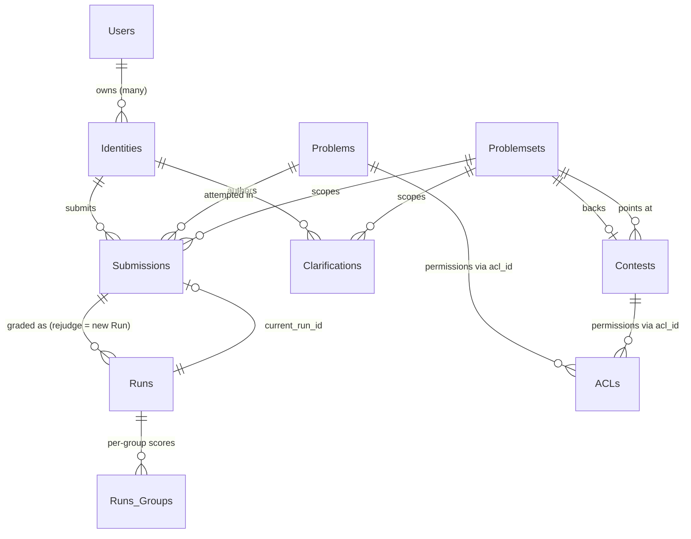

# Database Schema

Almost everything omegaUp remembers between requests lives in a single MySQL 8.0 database, reached through the `mysqli` driver in [`frontend/server/src/MySQLConnection.php`](https://github.com/omegaup/omegaup/blob/main/frontend/server/src/MySQLConnection.php). In development the connection defaults to host `mysql:13306`, database `omegaup`, user `omegaup` with an empty password — see `OMEGAUP_DB_HOST` / `OMEGAUP_DB_NAME` in [`frontend/server/config.default.php`](https://github.com/omegaup/omegaup/blob/main/frontend/server/config.default.php#L39). The port is `13306` rather than the usual `3306` on purpose, so a containerized MySQL never collides with one you may already run on the host.

The schema currently holds **85 tables** (all `ENGINE=InnoDB`, `CHARSET=utf8mb4 COLLATE=utf8mb4_0900_ai_ci`, so string comparisons are Unicode-aware and accent- and case-insensitive by default). You should almost never touch these tables through raw SQL. Instead, every table has a matching pair of PHP classes — a **DAO** (Data Access Object) and a **VO** (Value Object) — and *those classes are generated from the schema by a script*, not written by hand. That generation step is the real subject of this page: understand it once and the other 84 tables stop being mysterious.

## Where the schema actually comes from

The tables are not defined in one big `CREATE TABLE` file that you edit. They are the *replay* of an append-only stack of migrations under [`frontend/database/`](https://github.com/omegaup/omegaup/tree/main/frontend/database), each named `NNNNN_description.sql` — `00001_initial_schema.sql`, `00002_timezone.sql`, `00003_roles.sql`, and so on up to `00270_*` (currently ~270 files, and the number only ever grows). [`stuff/db-migrate.py`](https://github.com/omegaup/omegaup/blob/main/stuff/db-migrate.py) is the runner: `_scripts()` scans that directory, keeps only files whose first `_`-delimited part is exactly 5 digits, sorts them by revision number, and `migrate` applies every revision newer than what the database has already seen.

What it has "already seen" is tracked out-of-band in a separate metadata database, `_omegaup_metadata`, in a table called `Revision` — `id INTEGER PRIMARY KEY, applied TIMESTAMP DEFAULT CURRENT_TIMESTAMP, comment VARCHAR(50)` (created by `ensure()` at [db-migrate.py#L381](https://github.com/omegaup/omegaup/blob/main/stuff/db-migrate.py#L381)). The `comment` column is a small piece of institutional memory worth knowing about: it is `migrate` for a normally-applied revision, `skipped` for one deliberately not run outside a development environment, and `manual reset` when someone forced the revision pointer with the `reset` command to recover a botched migration. Because the metadata lives in its own database, blowing away and recreating `omegaup` for tests never loses the record of which migrations are "applied."

So how does the flat [`frontend/database/schema.sql`](https://github.com/omegaup/omegaup/blob/main/frontend/database/schema.sql) — the 1,468-line file this page keeps quoting — stay honest? It is *generated*, never edited. `db-migrate.py schema` spins up a throwaway database `_omegaup_schema`, `purge`s it, replays every migration into it with `update_metadata=False`, `mysqldump`s the result to stdout, and drops the scratch database (see [db-migrate.py#L451](https://github.com/omegaup/omegaup/blob/main/stuff/db-migrate.py#L451)). `schema.sql` is therefore a faithful snapshot of "all migrations applied in order," which is exactly why it is safe to read it as the source of truth for column definitions even though nobody types those `CREATE TABLE` statements by hand.

## From a `CREATE TABLE` to a pair of PHP classes

Here is the chain that turns a table into code. [`stuff/update-dao.sh`](https://github.com/omegaup/omegaup/blob/main/stuff/update-dao.sh) copies `schema.sql` to `dao_schema.sql` (the copy is what the linter diffs against, so a stale copy can't silently mask drift) and runs [`stuff/update-dao.py`](https://github.com/omegaup/omegaup/blob/main/stuff/update-dao.py), which reads the schema and, for every table, calls `dao_utils.generate_dao()` in [`stuff/dao_utils.py`](https://github.com/omegaup/omegaup/blob/main/stuff/dao_utils.py). That function does three things in order: it *parses* the SQL with a hand-written `pyparsing` grammar, wraps each parsed table in a Python `Table` object, and renders two Jinja2 templates against it.

The parser is not a regex — it is a real grammar (`_parse()` at [dao_utils.py#L92](https://github.com/omegaup/omegaup/blob/main/stuff/dao_utils.py#L92)) that understands `CREATE TABLE`, backtick-quoted identifiers, column types with optional `(size)` and `UNSIGNED`, `NULL`/`NOT NULL`/`AUTO_INCREMENT`/`DEFAULT`/`COMMENT` clauses, and the full constraint zoo (`PRIMARY KEY`, `UNIQUE KEY`, `FULLTEXT KEY`, `KEY`, and `CONSTRAINT ... FOREIGN KEY ... REFERENCES ... ON DELETE/ON UPDATE`). Each column becomes a `Column` object that decides its PHP type from the MySQL type, and this mapping is the single most load-bearing rule in the whole pipeline:

| MySQL type | PHP primitive | Why it matters |
|---|---|---|
| `tinyint` | `bool` | A `tinyint(1)` like `verified` round-trips as a real PHP `bool`, not `0`/`1`. |
| `timestamp`, `datetime` | `\OmegaUp\Timestamp` | Never a raw string — an `\OmegaUp\Timestamp` object, converted via `DAO::fromMySQLTimestamp` / `toMySQLTimestamp` so all time is UTC-safe. |
| `int` | `int` | e.g. `submit_delay`, `runtime`, `memory`. |
| `double` | `float` | e.g. `score`, `points_decay_factor`, `difficulty`. |
| anything else | `string` | `varchar`, `char`, `text`, `enum`, `set` all land here. |

There is a second, subtler rule on top of that (`Column.php_type`, [dao_utils.py#L42](https://github.com/omegaup/omegaup/blob/main/stuff/dao_utils.py#L42)): a column's PHP type gets a nullable `?` prefix **unless** it has a `DEFAULT` or is `AUTO_INCREMENT`. The reasoning is that a column the database will fill in for you — an auto-increment primary key, or a column with a default — is one your PHP code can legitimately leave unset, so the generated VO gives it a concrete initial value instead of `null`. This is why `run_id` generates as `public $run_id = 0;` while a defaultless nullable column generates as `public $whatever = null;`.

The table's *class name* is just its SQL name with underscores stripped (`Table.class_name = tbl_name.replace('_', '')`), so `Problem_Of_The_Week` becomes `ProblemOfTheWeek` and the oddly-named `Groups_` table becomes `Groups`. Finally `generate_dao()` renders [`stuff/dao_templates/vo.php`](https://github.com/omegaup/omegaup/blob/main/stuff/dao_templates/vo.php) and [`stuff/dao_templates/dao.php`](https://github.com/omegaup/omegaup/blob/main/stuff/dao_templates/dao.php) once per table, writing the results to `frontend/server/src/DAO/VO/{Class}.php` and `frontend/server/src/DAO/Base/{Class}.php` respectively. Both generated files open with a loud `!ATENCION!` banner: *"Este codigo es generado automáticamente. Si lo modificas, tus cambios serán reemplazados"* — edit them and your changes vanish the next time anyone regenerates.

### The VO: a typed row

A **Value Object** is one row, nothing more. For the `Runs` table the generator emits [`frontend/server/src/DAO/VO/Runs.php`](https://github.com/omegaup/omegaup/blob/main/frontend/server/src/DAO/VO/Runs.php): a `Runs` class extending `\OmegaUp\DAO\VO\VO`, with a `const FIELD_NAMES` array (`'run_id' => true, 'submission_id' => true, ...`) and one typed public property per column. Its constructor takes an optional `array $data`, and the very first thing it does is `array_diff_key($data, self::FIELD_NAMES)` and **throw** `'Unknown columns: ...'` if you hand it a key that isn't a real column — so a typo like `new Runs(['verdcit' => 'AC'])` blows up immediately instead of silently doing nothing. Per column it coerces the incoming value through exactly the mapping above (`intval` for ints, `boolval` for tinyints, `DAO::fromMySQLTimestamp` for timestamps), and for a `CURRENT_TIMESTAMP` default it fills the field with `new \OmegaUp\Timestamp(\OmegaUp\Time::get())` when you don't supply one.

### The DAO Base: the CRUD you never write

The **DAO Base** is the query layer, and it is deliberately abstract. [`frontend/server/src/DAO/Base/Runs.php`](https://github.com/omegaup/omegaup/blob/main/frontend/server/src/DAO/Base/Runs.php) is an `abstract class Runs` whose methods are all `final public static`, every one of them building a parameterized SQL string and running it through `\OmegaUp\MySQLConnection::getInstance()` — never string-concatenating a value into SQL, which is how the generated layer is injection-safe by construction. Which methods you get depends on the table's shape, and the template branches on that:

- **`getByPK(...)`** and **`existsByPK(...)`** are emitted whenever the table has a primary key. `existsByPK` runs a `SELECT COUNT(*)` and is documented as the cheaper choice "when you don't need the fields" — reach for it when you only care whether a row is there.
- **`update(...)`** is emitted only when there is a primary key *and* at least one non-key column (there's nothing to `SET` otherwise).
- **`replace(...)`** is emitted only for tables that have a primary key, have non-key columns, and are *not* auto-increment — i.e. tables where you own the key, so a `REPLACE INTO` can meaningfully mean "insert or overwrite this exact row."
- **`create(...)`**, **`delete(...)`**, **`getAll(...)`**, and **`countAll()`** round out the set. `create()` runs the `INSERT` and, for an auto-increment table, writes the fresh `Insert_ID()` back onto the VO's key field inside the same call, so after `Runs::create($run)` the object's `run_id` is populated. `getAll()` ships with a blunt warning in its own docblock — it "consumes memory proportional to the number of rows, so only use it when the table is small or you pass paging parameters" — and it hardens its `ORDER BY` by running the column name through `escape()` and validating the direction against the literal enum `['ASC', 'DESC']`.

### The public DAO: where hand-written queries go

If everything were generated there'd be nowhere to put a real query. That's the third file: [`frontend/server/src/DAO/Runs.php`](https://github.com/omegaup/omegaup/blob/main/frontend/server/src/DAO/Runs.php) (no `Base`), a `class Runs extends \OmegaUp\DAO\Base\Runs`. It inherits all the generated CRUD and *adds* the bespoke, joined, application-specific queries a schema generator could never guess — for example a `WITH ssff AS (...)` CTE that aggregates submission-feedback counts across `Submissions` and `Submission_Feedback`. The split is the whole point: regenerating the schema rewrites `Base/Runs.php` and `VO/Runs.php` wholesale and **never** touches your hand-written `Runs.php`, so generated CRUD and hand-tuned reporting queries can evolve independently. Currently this is 85 `DAO/Base/` classes, 86 `DAO/VO/` files (the 85 tables plus the shared `VO.php` base class), and 77 public `DAO/` wrappers.

### Keeping generated and committed code in sync

Nothing stops someone from hand-editing a generated file, or from adding a migration and forgetting to regenerate — except the linter. [`stuff/dao_linter.py`](https://github.com/omegaup/omegaup/blob/main/stuff/dao_linter.py) re-imports `dao_utils`, regenerates every DAO/VO in memory from `frontend/database/dao_schema.sql`, and diffs the result against what's committed on disk. If they differ, the lint fails — which is why the practical rule after any schema change is: run `./stuff/db-migrate.py schema > frontend/database/schema.sql`, then `./stuff/update-dao.sh`, then commit the migration, the schema, and the regenerated DAOs together. If you don't, CI will notice.

## The core tables

Reading the schema top to bottom is overwhelming; reading the handful of tables a submission actually touches is not. These are the load-bearing ones.

### Users and Identities — why there are two

The single most surprising thing about the schema is that **a login is not a user**. There are two tables. `Users` ([schema.sql#L1397](https://github.com/omegaup/omegaup/blob/main/frontend/database/schema.sql#L1397), commented *"Usuarios registrados"*) is the person: `user_id` (PK), `main_identity_id`, `main_email_id`, `facebook_user_id`, a `git_token` (varchar(128), Argon2i-hashed, used for git access to problem repos), `verified`, `birth_date`, a `preferred_language` enum listing every supported compiler, and — reflecting real product requirements — a cluster of parental-verification columns (`parental_verification_token`, `parent_email_verification_deadline`) that exist specifically to handle registrants under 13.

But the *credentials* live on `Identities` ([schema.sql#L551](https://github.com/omegaup/omegaup/blob/main/frontend/database/schema.sql#L551)): `identity_id` (PK), `username` (`UNIQUE`), `password` (varchar(128), commented as Argon2i or Blowfish), `name`, `country_id`, `state_id`, `gender`, `current_identity_school_id`, and a nullable `user_id` pointing back at `Users`. The two tables reference each other — `Users.main_identity_id → Identities` and `Identities.user_id → Users` — which is deliberate: one human `Users` row can own several `Identities`. That's what makes group/course "identities" possible, where a teacher provisions login accounts that are Identities without being full standalone Users. The practical consequence you'll feel everywhere downstream: submissions, clarifications, and scoreboards key off `identity_id`, **not** `user_id`, because the thing that submits code is an identity. There's even a `FULLTEXT KEY ft_user_username (username, name)` on `Identities` so user search hits an index rather than scanning.

### Problems — metadata here, content in git

`Problems` ([schema.sql#L755](https://github.com/omegaup/omegaup/blob/main/frontend/database/schema.sql#L755)) is a good example of the database deliberately *not* storing the interesting data. The row holds `problem_id` (PK), `acl_id` (the access-control list — permissions are factored out into the shared `ACLs` table rather than duplicated per problem), `title`, a URL-safe `alias` (`varchar(32)`, `UNIQUE`), a `visibility` int whose meaning is spelled out inline in the schema comment — **`-1` banned, `0` private, `1` public, `2` recommended** — plus denormalized counters (`visits`, `submissions`, `accepted`) and quality/difficulty doubles used for ranking. What it does *not* hold is the problem statement, test cases, or validators. Those live in a git repository (served by the separate gitserver, [github.com/omegaup/gitserver](https://github.com/omegaup/gitserver)), and the table stores only two 40-char SHA-1 pointers into it: `commit` (the published commit on the problem's `master` branch, default `'published'`) and `current_version` (the tree hash of the `private` branch). This is why a submission has to record *which* version of the problem it ran against — the problem's content can move forward independently of the metadata row.

### Contests and Problemsets — the polymorphic container

A `Contests` row ([schema.sql#L242](https://github.com/omegaup/omegaup/blob/main/frontend/database/schema.sql#L242)) carries all the knobs that make contest scoring what it is, and the schema comments document each one so you don't have to guess: `start_time`/`finish_time`; `window_length` (minutes a contestant gets once they enter — `NULL` means "the whole contest"); `admission_mode enum('private','registration','public')`; `scoreboard` (an int 0–100, the *percentage of contest time* the scoreboard stays visible); `points_decay_factor` (a `double`, "default 0 = no decay; TopCoder is 0.7"); `submissions_gap` (default `60` — the minimum seconds between two submissions to the same problem); `penalty_type enum('contest_start','problem_open','runtime','none')`; `penalty_calc_policy enum('sum','max')`; and a `score_mode enum('partial','all_or_nothing','max_per_group')`.

Crucially, a Contest does **not** own its problem list directly. It points at a `problemset_id`, and `Problemsets` ([schema.sql#L928](https://github.com/omegaup/omegaup/blob/main/frontend/database/schema.sql#L928)) is the shared, polymorphic bag of problems that a contest, a course assignment, or an interview all reuse. Its `type enum('Contest','Assignment','Interview')` plus three nullable back-pointers (`contest_id`, `assignment_id`, `interview_id`) say which kind it is, and a `CHECK` constraint enforces that *at most one* of those three is set (`cast(... is not null) + ... <= 1`). This is the piece that ties the model together: because submissions and clarifications reference `problemset_id` rather than `contest_id`, the exact same grading and Q&A machinery works whether the problem was attempted inside a contest, a class assignment, or a job interview — no special-casing per surface.

### Submissions and Runs — the act versus the evaluation

This is the second split worth internalizing, and it mirrors the Users/Identities one. A **`Submissions`** row ([schema.sql#L1195](https://github.com/omegaup/omegaup/blob/main/frontend/database/schema.sql#L1195)) is the *act* of submitting: `submission_id` (PK), a `guid` (`char(32)`, `UNIQUE` — the public-facing run token), `identity_id`, `problem_id`, a nullable `problemset_id`, the `language` it was written in, `submit_delay` (documented as the minutes from when the problem was opened to when it was sent — the raw material for penalty scoring), a `type enum('normal','test','disqualified')`, and a `current_run_id` pointing at whichever evaluation currently counts. The submitted source code and the act itself are immutable.

A **`Runs`** row ([schema.sql#L1049](https://github.com/omegaup/omegaup/blob/main/frontend/database/schema.sql#L1049)) is one *evaluation* of a submission: `run_id` (PK), `submission_id` (FK), the `version` and `commit` hashes of the problem it was graded against, a `status`, a `verdict`, and the measured results — `runtime` and `memory` (ints), `penalty`, `score` and `contest_score` (doubles), and `judged_by`. A `UNIQUE KEY runs_versions (submission_id, version)` is what makes the one-to-many meaningful: **rejudging** a submission against a new problem version produces a *new* `Runs` row rather than overwriting the old one, and `Submissions.current_run_id` swings to point at the latest. That's how omegaUp can re-grade an entire old contest after fixing a broken test case without losing the original verdicts. Per-test-group breakdowns of a run live in `Runs_Groups` (`run_id`, `group_name`, `score`, `verdict`), one row per test group.

Two enums recur across both tables and are worth spelling out in full. The lifecycle **`status`** moves through: `new`, `waiting`, `compiling`, `running`, `ready`, `uploading`. The **`verdict`** is one of: `AC` (accepted), `PA` (partially accepted), `PE` (presentation error), `WA` (wrong answer), `TLE` (time limit exceeded), `OLE` (output limit exceeded), `MLE` (memory limit exceeded), `RTE` (runtime error), `RFE` (restricted function error), `CE` (compile error), `JE` (judge error), and `VE` (validator error). A freshly created run starts life as `verdict = 'JE'`, `status = 'uploading'` — a pessimistic placeholder that only becomes a real verdict once the grader reports back.

### Clarifications

`Clarifications` ([schema.sql#L159](https://github.com/omegaup/omegaup/blob/main/frontend/database/schema.sql#L159)) is the contest Q&A channel: `clarification_id` (PK), `author_id` and a nullable `receiver_id` (both FKs to `Identities`, again keyed on identity not user), the `message` and an optional `answer`, a `problem_id` (nullable — a clarification can be about the contest in general rather than one problem; the schema comment notes it should ideally route to the problem's setter, or the contest owner when unattached), the `problemset_id` it belongs to, and a `public` flag that defaults to `0`. That flag encodes a real rule: *"only clarifications the problemsetter marks as publishable appear in the list everyone can see"* — so a private answer to one contestant stays private unless explicitly promoted.

## A submission, end to end, in DAO calls

To see the layer doing its job, follow one real path: [`\OmegaUp\Controllers\Run::apiCreate`](https://github.com/omegaup/omegaup/blob/main/frontend/server/src/Controllers/Run.php#L415) (the class is `Run`, not `RunController` — omegaUp drops the `Controller` suffix). After it has validated the request, it constructs the two VOs by hand — `new \OmegaUp\DAO\VO\Submissions([...])` and `new \OmegaUp\DAO\VO\Runs([... 'status' => 'uploading', 'verdict' => 'JE'])` ([Run.php#L533](https://github.com/omegaup/omegaup/blob/main/frontend/server/src/Controllers/Run.php#L533)) — and then, *inside* `\OmegaUp\TransactionHelper::executeWithRetry` (which retries on deadlock), it does exactly four generated-DAO calls in order ([Run.php#L564](https://github.com/omegaup/omegaup/blob/main/frontend/server/src/Controllers/Run.php#L564)):

```php
\OmegaUp\DAO\Submissions::create($submission);      // INSERT, back-fills $submission->submission_id
$run->submission_id = $submission->submission_id;   // wire the run to its submission
\OmegaUp\DAO\Runs::create($run);                     // INSERT, back-fills $run->run_id
$submission->current_run_id = $run->run_id;          // point the submission at its live evaluation
\OmegaUp\DAO\Submissions::update($submission);       // UPDATE to persist current_run_id
```

Every method there is a `final public static` generated in `DAO/Base/`, running a parameterized `INSERT`/`UPDATE`. Only *after* this transaction commits does the controller hand the run to the external Go grader with `\OmegaUp\Grader::getInstance()->grade($run, trim($source))` ([Run.php#L573](https://github.com/omegaup/omegaup/blob/main/frontend/server/src/Controllers/Run.php#L573)) — the row exists and is durable before any grading is attempted, so a grader hiccup can never lose a submission. The `verdict` stays `JE` and `status` stays `uploading` in the database until the grader reports back and the run is updated in place.

## Relationships at a glance



## Related Documentation

- **[Database Patterns](../development/database-patterns.md)** — how controllers actually use the DAO/VO layer day to day
- **[Backend Architecture](backend.md)** — where the DAO layer sits in the request lifecycle
- **[Useful Commands](../development/useful-commands.md)** — the `db-migrate.py` and `update-dao.sh` invocations in one place
