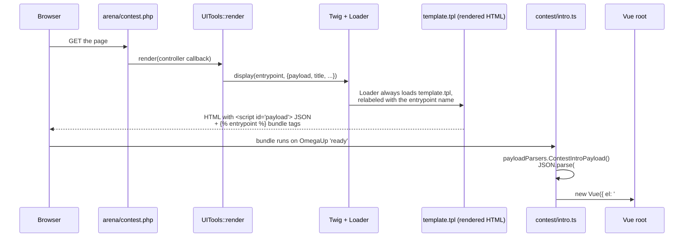

# Frontend Architecture

Every omegaUp page you have ever loaded is, under the hood, the exact same HTML file. There is precisely **one** server-rendered template in the whole application — `frontend/templates/template.tpl` — and it renders for the contest arena, the problem editor, the scoreboard, the admin panels, everything. What changes from page to page is not the HTML shell but two things the shell carries: a blob of JSON baked into a `<script>` tag, and which compiled Vue bundle the page pulls in. That shell hands off to Vue, Vue reads the JSON, and from that point on the page is a single-page application. This is the whole architecture in one sentence, and the rest of this page is why it works that way and how a real request flows through it.

If you have read older notes that describe a Smarty-to-Vue migration in progress, delete that mental model: that migration is **done**. The codebase currently holds 257 `.vue` single-file components and 414 `.ts` files against exactly one application `.tpl` — page rendering is essentially 100% Vue. The one migration still genuinely in flight is **Vue 2 → Vue 3**; the app runs on Vue 2.7.16 today, and the root-level `vue-upgrade-tool/` and `vue-js-tutorial/` directories are the scaffolding for that eventual jump.

## Technology Stack

We deliberately pin every one of these; treat the versions as current-but-mutable and check `package.json` before assuming.

| Layer | Technology | Version (currently) | Why it's here |
|-------|-----------|--------------------|--------------|
| Server shell templating | Twig | 3 (`twig/twig ^3.0`) | Renders the single HTML shell and injects the JSON payload + entrypoint tags. **Not** Smarty — Smarty is gone. |
| UI framework | Vue.js | 2.7.16 | Single-file components, Options API via `vue-property-decorator` / `vuex-class`. |
| Language | TypeScript | 4.4.4 | `strict` mode over all `.ts` and `.vue` sources. |
| State management | Vuex | 3 | Per-feature stores (e.g. the arena run list, the grader IDE). |
| CSS framework | Bootstrap + bootstrap-vue | 4.6.0 + 2.21.2 | **Bootstrap 4**, not 5 — `bootstrap-vue` only ever supported Bootstrap 4. |
| Build tool | Webpack | 5 | One bundle per page entrypoint, plus a shared `omegaup` runtime chunk. |
| Charts / editors | Highcharts, CodeMirror, Monaco | — | Scoreboards and the code editor. |
| Unit tests | Jest (ts-jest) | 26 | Component and helper tests with `shallowMount`. |
| E2E tests | Cypress | 15.7 | 10 spec files under `cypress/e2e/*.cy.ts`. |
| Component workshop | Storybook | 7.6 | `storybook dev -p 6006`; coverage is thin (currently ~10 stories for 257 components). |

## Where the code lives

Every first-party `.vue` file lives under `frontend/www/js/omegaup/`, and 248 of the 257 of them sit specifically in [`frontend/www/js/omegaup/components/`](https://github.com/omegaup/omegaup/tree/main/frontend/www/js/omegaup/components) organized by feature (`components/contest/`, `components/problem/`, `components/course/`, and so on). There is **no** `frontend/www/js/components` directory — if you go looking for components one level up, you won't find them.

Alongside the components sit the **entrypoint** modules: small `.ts` files like [`frontend/www/js/omegaup/contest/intro.ts`](https://github.com/omegaup/omegaup/blob/main/frontend/www/js/omegaup/contest/intro.ts) or `arena/contest_contestant.ts` whose only job is to bootstrap one page — read the payload, wire up event handlers, mount a root Vue instance. These are the glue between the server's JSON and the component tree, and each one is registered as a named Webpack `entry` in [`webpack.config-frontend.js`](https://github.com/omegaup/omegaup/blob/main/webpack.config-frontend.js) (`arena_contest_contestant`, `contest_intro`, `badge_details`, …, currently well over a hundred of them).

Two more files in that directory are special because **you must never edit them by hand**:

- [`frontend/www/js/omegaup/api_types.ts`](https://github.com/omegaup/omegaup/blob/main/frontend/www/js/omegaup/api_types.ts) (~232 KB) — every DAO shape, every request/response message type, and the `payloadParsers` that decode server payloads.
- [`frontend/www/js/omegaup/api.ts`](https://github.com/omegaup/omegaup/blob/main/frontend/www/js/omegaup/api.ts) (~77 KB) — a typed function for every API endpoint.

Both open with the line `// generated by frontend/server/cmd/APITool.php. DO NOT EDIT.` — they are regenerated from the PHP controllers, and we'll come back to why that matters at the end.

## One request, end to end

Let's trace an actual page — the contest intro screen a user sees before they enter a contest — from the URL to a mounted Vue component. Every step names the real symbol that performs it.



### 1. The page PHP file is a three-line stub

The browser hits a physical PHP file, but it does almost nothing. Here is [`frontend/www/arena/contest.php`](https://github.com/omegaup/omegaup/blob/main/frontend/www/arena/contest.php) in its entirety:

```php
<?php
namespace OmegaUp;
require_once(dirname(__DIR__, 2) . '/server/bootstrap.php');

\OmegaUp\UITools::render(
    fn (\OmegaUp\Request $r) => \OmegaUp\Controllers\Contest::getContestDetailsForTypeScript($r)
);
```

It pulls in `bootstrap.php` (the same bootstrap the API layer uses) and then calls `\OmegaUp\UITools::render()`, handing it a closure that runs a controller method. That method — `getContestDetailsForTypeScript` — is the one that does the real work: it validates the user, hits the database through the DAOs, and returns a `RenderCallbackPayload` array. That array has two load-bearing keys: `entrypoint` (a string like `"arena_contest_contestant"`) and `templateProperties.payload` (the `array<string, mixed>` of data the page needs). The naming convention `...ForTypeScript` is the tell: these controller methods exist specifically to feed the TypeScript front end.

### 2. `UITools::render` builds Twig and injects the payload

Inside [`frontend/server/src/UITools.php`](https://github.com/omegaup/omegaup/blob/main/frontend/server/src/UITools.php), `render()` constructs a `\Twig\Environment` backed by our custom `\OmegaUp\Template\Loader`, pulls the `entrypoint` and `payload` out of the controller's return value, folds the payload together with a shared `headerPayload` (the navbar/login state every page needs), formats the localized page `title`, and finally calls `$twig->display($entrypoint, $twigContext)`. The crucial move: it passes the **entrypoint name** as the template name to display.

### 3. The Loader is a deliberate bait-and-switch

You'd expect `$twig->display('arena_contest_contestant', ...)` to look for a file called `arena_contest_contestant`. It doesn't, and this is the clever pivot of the whole design. Our [`frontend/server/src/Template/Loader.php`](https://github.com/omegaup/omegaup/blob/main/frontend/server/src/Template/Loader.php) implements `LoaderInterface` so that **no matter what name is requested, it always reads the physical file `templates/template.tpl`** — but it re-labels the returned `\Twig\Source` with the requested name:

```php
public function getSourceContext(string $name): \Twig\Source {
    $originalSource = $this->_loader->getSourceContext('template.tpl');
    return new \Twig\Source(
        $originalSource->getCode(),
        $name,                        // relabel with the entrypoint name
        $originalSource->getPath(),
    );
}
```

So every page renders the same shell, and the *only* thing the shell learns about "which page am I" is that relabeled name. That's why there is one `.tpl` and not two hundred. (`isFresh()` also returns `false` whenever `OMEGAUP_ENVIRONMENT === 'development'`, so the template cache never gets in your way while you're hacking — you'll see your changes on refresh without clearing anything.)

### 4. The shell serializes the payload and emits the bundle tags

Now [`frontend/templates/template.tpl`](https://github.com/omegaup/omegaup/blob/main/frontend/templates/template.tpl) renders. Two lines in its `<main>` are the entire handoff to the browser:

```twig
<script type="text/json" id="payload">{{ payload|json_encode|raw }}</script>

<div id="main-container"></div>
```

The first line is the bridge from PHP to JavaScript: the controller's `payload` array is `json_encode`d and dropped verbatim into a `<script type="text/json" id="payload">` tag. It is *data*, not code — the browser doesn't execute it, it just parks it in the DOM for Vue to pick up. (The header/navbar state gets the same treatment one level up in the `<body>`, as `<script id="header-payload">`.)

The second line, ``, is one of our three custom Twig tags. Its compiler, [`EntrypointNode`](https://github.com/omegaup/omegaup/blob/main/frontend/server/src/Template/EntrypointNode.php), calls `$sourceContext->getName()` to recover that relabeled entrypoint name and emits the `<script src=...>` tags for the matching Webpack bundle (reading the dependency list Webpack wrote to `www/js/dist/{entrypoint}.deps.json`). This is why the relabel in step 3 was load-bearing: it's the only channel telling the shell which JavaScript to load. Finally, the empty `<div id="main-container">` is the mount point Vue will take over.

The other two custom tags in the same shell are worth knowing because they solve caching. `` pulls in the shared runtime chunk, and `` appends a cache-busting query string: [`VersionHashNode`](https://github.com/omegaup/omegaup/blob/main/frontend/server/src/Template/VersionHashNode.php) computes `substr(sha1(file_get_contents($path)), 0, 6)` and rewrites the URL to `/css/dist/omegaup_styles.css?ver=abc123`. The `?ver=` changes only when the file's contents change, so browsers cache aggressively but never serve a stale bundle after a deploy.

### 5. The entrypoint reads the payload and mounts Vue

The bundle lands, and now [`contest/intro.ts`](https://github.com/omegaup/omegaup/blob/main/frontend/www/js/omegaup/contest/intro.ts) runs. It waits for `OmegaUp.on('ready', …)` (fired once the legacy runtime has initialized), decodes the JSON the shell embedded, and mounts a root Vue instance whose sole child is the page's top-level component:

```ts
OmegaUp.on('ready', () => {
  const payload = types.payloadParsers.ContestIntroPayload();
  const headerPayload = types.payloadParsers.CommonPayload();

  new Vue({
    el: '#main-container',
    components: { 'omegaup-contest-intro': contest_Intro },
    render: (createElement) =>
      createElement('omegaup-contest-intro', {
        props: { contest: payload.contest, isLoggedIn: headerPayload.isLoggedIn, /* … */ },
        on: {
          'open-contest': (request) =>
            api.Contest.open(request).then(() => window.location.reload()).catch(ui.apiError),
        },
      }),
  });
});
```

`types.payloadParsers.ContestIntroPayload()` is the decoder half of the bridge, generated into `api_types.ts`. It does `JSON.parse(document.getElementById('payload').innerText)` and then — critically — walks the parsed object fixing up types the wire can't carry: every timestamp arrives as a Unix integer, so the parser rehydrates it with `new Date(x * 1000)`. This is why the raw `JSON.parse` is never called directly in page code; the generated parser guarantees a `contest.start_time` is a real `Date`, not a number. (`intro.ts` even re-adjusts `start_time` through `time.remoteDate(...)` afterward, so a user whose laptop clock is skewed still sees the correct countdown.)

From here it is an ordinary SPA: the `<omegaup-contest-intro>` component renders, and when the user clicks "enter", the `open-contest` handler calls `api.Contest.open(...)` — a typed wrapper from `api.ts` — and reloads. No more full-page navigations happen inside a given feature; Vue owns the DOM under `#main-container`.

## The generated API client: why you never write `fetch`

Look again at `api.Contest.open(...)`. You will not find hand-written `fetch` calls or hand-typed response shapes anywhere in first-party page code, and that is on purpose. Both `api.ts` and `api_types.ts` are generated by [`frontend/server/cmd/APITool.php`](https://github.com/omegaup/omegaup/blob/main/frontend/server/cmd/APITool.php), which reads the PHP controllers and their Psalm `@psalm-type` annotations and emits matching TypeScript. Every endpoint becomes a call like:

```ts
export const Admin = {
  setMaintenanceMode: apiCall<
    messages.AdminSetMaintenanceModeRequest,
    messages.AdminSetMaintenanceModeResponse
  >('/api/admin/setMaintenanceMode/'),
};
```

The `apiCall<Request, Response>(url)` helper returns a function that POSTs the params, unwraps the `status`/`error` envelope, and rejects with the server's error (routed through `addError` / `ui.apiError`) on failure. The payoff of generating instead of hand-writing: the PHP controller signatures are the single source of truth. Change a controller's return type in PHP, regenerate, and the TypeScript compiler will immediately flag every `.vue` and `.ts` file that now reads a field that no longer exists — a whole class of front-end/back-end drift bugs turns into a compile error before it can ship. That is also exactly why the `DO NOT EDIT` banner is there: any hand-edit is silently reverted the next time someone runs `APITool.php`.

## The build

Webpack 5 turns all of this into shippable assets. Each named entry in [`webpack.config-frontend.js`](https://github.com/omegaup/omegaup/blob/main/webpack.config-frontend.js) becomes one output bundle, with the shared `omegaup` runtime (core-js polyfills, `regenerator-runtime`, the legacy `omegaup-legacy.js`) split out so pages don't each re-ship it. `vue-loader` compiles the `.vue` single-file components, `ts-loader` handles TypeScript, and `fork-ts-checker-webpack-plugin` type-checks in a parallel process so a type error fails the build without blocking the bundling. The npm scripts you'll actually run are `yarn dev` / `yarn dev:watch` while developing and `yarn build` for a production bundle; the `.deps.json` files Webpack writes per entry are what the `` Twig tag later reads to know which `<script>` tags to emit for that page.

State that outlives a single component lives in **Vuex 3** stores kept close to their feature — for example [`frontend/www/js/omegaup/arena/runsStore.ts`](https://github.com/omegaup/omegaup/blob/main/frontend/www/js/omegaup/arena/runsStore.ts) and `arena/problemStore.ts` back the contest arena, and the grader IDE has its own `grader/GraderStore.ts`. There is no single global store; each feature owns its state and mutations, which keeps the Vue 2 → Vue 3 migration tractable one feature at a time.

## Testing and component development

Three layers guard the front end, each with a different reach. **Jest 26** (via `ts-jest`) runs fast unit tests, typically mounting a single component with `shallowMount` and asserting on its rendered output or emitted events. **Cypress 15.7** drives a real Chrome against a running stack for end-to-end flows — the 10 specs under `cypress/e2e/` cover the load-bearing journeys (`contest`, `course`, `ide`, `problem_creator`, `navigation`, and friends) rather than every screen. **Storybook 7.6** (`storybook dev -p 6006`) is where you develop a component in isolation, though be warned that coverage is currently sparse — roughly 10 `.stories` files for 257 components — so most components have no story yet, and adding one for anything you touch is a welcome contribution.

## Related Documentation

- **[omegaUp Internals](internals.md)** — the full server-side journey a submission takes after the front end POSTs it.
- **[Backend Architecture](backend.md)** — the PHP controllers, `ApiCaller`, and DAO/VO layer that produce the payloads and API responses this page consumes.
- **[Components Guide](../development/components.md)** — how to build and structure Vue single-file components.
- **[Coding Guidelines](../development/coding-guidelines.md)** — the TypeScript, Vue, and style rules we hold the front end to (including "Don't use jQuery!").
