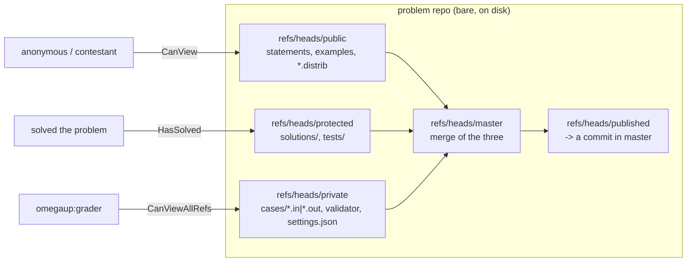
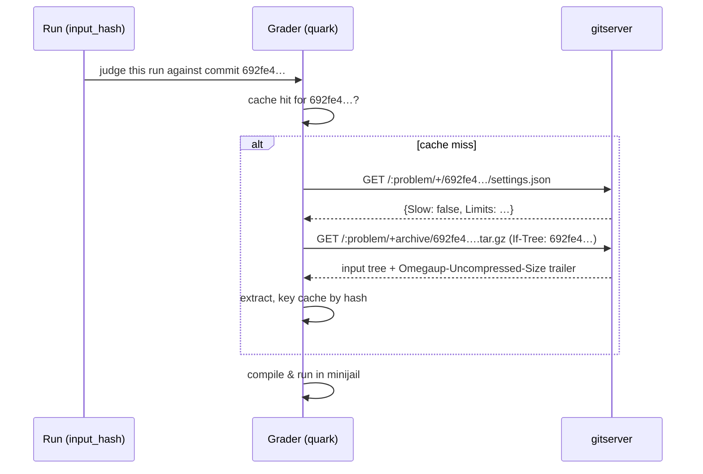

# GitServer Architecture

Every problem on omegaUp is a git repository. Not "backed by git," not "versioned with something git-like" — an actual bare libgit2 repository sitting on disk under `/var/lib/omegaup/problems.git/<alias>`, with commits, refs, trees, and blobs. `gitserver` is the small Go service ([github.com/omegaup/gitserver](https://github.com/omegaup/gitserver)) that owns those repositories and hands their contents out over HTTP, one revision at a time. The PHP frontend never touches the `.git` directories directly and neither does the grader; both go through gitserver, because gitserver is the only process that knows how to enforce the problem's branch layout, validate an upload, and decide who is allowed to see the secret test cases.

The one-line mental model: **gitserver is a permission-aware HTTP front-end for a pile of bare git repos, one repo per problem.** It speaks the git smart-HTTP protocol (so you can literally `git clone` a problem if you have a token) via [omegaup/githttp](https://github.com/omegaup/githttp), plus two conveniences layered on top — a "pretty" read API under `/+/…` for fetching a single blob or tree by revision, and a `.zip`-upload API under `/git-upload-zip` that turns a problem archive into a well-formed commit.

## Why git at all

The reason omegaUp stores problems in git rather than in MySQL rows or a blob store comes down to three properties that a judge needs and that git gives away for free.

**Immutability and content-addressing.** A problem "version" is a git commit hash — a 40-hex SHA-1 like `692fe483a2d61bff54cd52b9f9c959d977b1abe9`. That hash is derived from the exact bytes of every test case, statement, validator, and `settings.json` at that moment. Two problems with identical contents produce the identical hash; changing a single byte of a single `.out` file produces a completely different hash. This is what makes the grader's cache correct: the grader keys its on-disk input cache by that hash (see [`grader/input.go`](https://github.com/omegaup/quark/blob/main/grader/input.go)), so it can trust that `692fe4…` always means the same test data forever, and never has to ask "is my cached copy stale?"

**A full, auditable history for free.** Because each edit is a commit, the entire evolution of a problem — every statement fix, every added test case, every retuned time limit — is a walkable git log. Reverting a bad edit is just pointing a ref back at an older commit; there is no "undo table" to maintain.

**Rejudge-on-change becomes a hash comparison.** When a submission is judged, omegaUp records *which* commit it was judged against — the `commit` and `version` columns on the `Runs` row, set from `$problem->commit` / `$problem->current_version` in [`Run.php`](https://github.com/omegaup/omegaup/blob/main/frontend/server/src/Controllers/Run.php) around L534. If a problem author later fixes a broken test case, the published hash changes, and omegaUp can rejudge exactly the runs whose stored hash no longer matches the current one. Without content-addressed versions you would have to rejudge everything, or guess.

## The branch layout is the security model

Here is the part the old wiki never made obvious and the part you must internalize before anything else makes sense: a problem repo is **not** one tree with everything in it. The problem's files are deliberately split across several branches by sensitivity, and the split is enforced by a hard-coded table of path regexps, `DefaultCommitDescriptions`, in [`handler.go`](https://github.com/omegaup/gitserver/blob/main/handler.go#L122). When you upload a problem zip, gitserver routes each file to a branch according to what it is:

- **`refs/heads/public`** — everything a contestant is allowed to see: `statements/…` (the `.md`/`.markdown` plus images), `examples/`, the *distributable* interactive stubs (`interactive/Main.distrib.*`), `validator.distrib.*`, and `settings.distrib.json`. This is the branch anonymous users read.
- **`refs/heads/protected`** — `solutions/…` and the `tests/` directory. Visible to someone who has *solved* the problem, but not to a contestant mid-contest.
- **`refs/heads/private`** — the secret sauce: `cases/*.in` and `cases/*.out` (the real judge data), the real `interactive/Main.*` and `.idl`, the real `validator.*`, and the authoritative `settings.json`. Only the grader and admins ever read this.
- **`refs/heads/master`** — the merge of the three above; the canonical "current state of the problem" that review approves.
- **`refs/heads/published`** — a pointer at the specific `master` commit that is currently live. gitserver refuses to move `published` to anything that isn't already a commit reachable in `master` (`ErrPublishedNotFromMaster`, "published-must-point-to-commit-in-master", [`handler.go#L52`](https://github.com/omegaup/gitserver/blob/main/handler.go#L52)). This is the "draft vs. live" boundary: you can push new commits to `master` all day and nothing changes for contestants until `published` is advanced.

Two more ref namespaces round it out: **`refs/meta/config`** holds a single `config.json` describing publishing behavior (`mirror` vs. `subdirectory`, [`handler.go#L1099`](https://github.com/omegaup/gitserver/blob/main/handler.go#L1099)), **`refs/meta/review`** holds code-review data (comments, iterations, the ledger), and pending edits under review live under **`refs/changes/*`**. Any push whose target ref is none of these is rejected outright by the validation in [`handler.go#L1529`](https://github.com/omegaup/gitserver/blob/main/handler.go#L1529) — you cannot invent a branch.

The payoff of this design is that access control reduces to *"which refs can this caller see?"*, and that decision lives in one function, `referenceDiscovery` in [`cmd/omegaup-gitserver/main.go`](https://github.com/omegaup/gitserver/blob/main/cmd/omegaup-gitserver/main.go): a caller who `CanViewAllRefs` sees everything; a caller who merely `HasSolved` additionally gets `refs/heads/protected`; a caller who `CanView` (a public problem) gets `refs/heads/public`; everyone else sees nothing. A contestant literally cannot fetch `cases/1.out` because the branch it lives on is invisible to them during reference discovery — not filtered after the fact, just never advertised.



## Reading a problem by revision: the frontend path

When the frontend needs a file out of a problem — say the Spanish statement to render, or `settings.json` to show the limits — it does **not** open the repo. It constructs an `\OmegaUp\ProblemArtifacts` and asks for a path. The class is in [`ProblemArtifacts.php`](https://github.com/omegaup/omegaup/blob/main/frontend/server/src/ProblemArtifacts.php), and its constructor takes the two things that fully identify a byte range in this whole system: the problem alias and a revision, which **defaults to the string `'published'`** so that ordinary reads always see the live version:

```php
$artifacts = new \OmegaUp\ProblemArtifacts($alias, /* revision */ 'published');
$statement = $artifacts->get('statements/es.markdown');
```

Under the hood, `ProblemArtifacts::get()` builds a `GitServerBrowser` and hits the pretty-read URL, whose shape is worth memorizing because everything reads through it:

```
GET  {OMEGAUP_GITSERVER_URL}/{alias}/+/{revision}/{path}
```

built by `GitServerBrowser::buildShowURL()` as `OMEGAUP_GITSERVER_URL . "/{$alias}/+/{$revision}/{$path}"`. `OMEGAUP_GITSERVER_URL` defaults to `http://localhost:33861` (port `OMEGAUP_GITSERVER_PORT`, currently `33861`, from [`config.default.php#L62`](https://github.com/omegaup/omegaup/blob/main/frontend/server/config.default.php)). The revision can be the literal `published`, a branch name, or a concrete commit hash — the grader path below uses the hash form. Companion builders exist for the other read shapes: `/{alias}/+archive/{revision}.zip` for a whole-tree download, and `/{alias}/+log/{revision}` for history.

The error handling is inline and deliberate: `get()` reads the cURL HTTP status, and anything other than `200`, `403`, or `404` raises a `ServiceUnavailableException` (gitserver is probably down), while a `403`/`404` becomes a `NotFoundException('resourceNotFound')`. That is the 403-vs-404 discipline you see across omegaUp — a private ref answers as "not found" rather than "forbidden," so the very existence of a hidden file is not leaked. The browser sets tight timeouts (`CURLOPT_CONNECTTIMEOUT => 5`, `CURLOPT_TIMEOUT => 30`) so a wedged gitserver can't hang a page render.

## Reading a problem by revision: the grader path

The grader is the other reader, and it is the reason the whole content-addressing scheme exists. Every run carries an `input_hash` — the problem commit the submission is being judged against (see `common.Run` in [`common/run.go#L30`](https://github.com/omegaup/quark/blob/main/common/run.go)). Before it can run code, the grader needs that exact revision's test data, and it fetches it straight from gitserver by hash. Two requests do the job, both in [`grader/input.go`](https://github.com/omegaup/quark/blob/main/grader/input.go):

```
GET {gitserverURL}/{problemName}/+/{inputHash}/settings.json      # is this problem "slow"?
GET {gitserverURL}/{problemName}/+archive/{inputHash}.tar.gz       # the whole input tree
```

`IsProblemSlow()` pulls just `settings.json` at that hash and reads the `Slow` boolean to decide which queue the run belongs in; the result is memoized in a global cache keyed by `problemName:inputHash`, so a hot problem is asked at most once per version. `CreateArchiveFromGit()` then streams `+archive/{inputHash}.tar.gz` to a local file, and crucially sends an `If-Tree: {inputHash}` header so gitserver can short-circuit if the grader already has that tree. The response even carries the uncompressed size in an `Omegaup-Uncompressed-Size` trailer so the grader can preflight disk space. Because the fetch is by immutable hash, the grader can — and does — cache the extracted input keyed by that hash and reuse it across every submission to that problem version, only re-fetching when a submission arrives for a hash it has never seen.



## Writing a problem: git-upload-zip and merge strategies

Authors don't push raw git — the frontend does, on their behalf, through the zip-upload endpoint. `ProblemDeployer::commit()` in [`ProblemDeployer.php`](https://github.com/omegaup/omegaup/blob/main/frontend/server/src/ProblemDeployer.php) POSTs the problem archive to:

```
POST {OMEGAUP_GITSERVER_URL}/{alias}/git-upload-zip?message=…&acceptsSubmissions=…&updatePublished=…&mergeStrategy=…[&create=true][&settings=…]
```

with `Content-Type: application/zip` and the zip body streamed via `CURLOPT_INFILE`. gitserver's `ZipHandler` ([`ziphandler.go`](https://github.com/omegaup/gitserver/blob/main/ziphandler.go)) unpacks the archive, routes each file to its branch via the `DefaultCommitDescriptions` table above, builds the split commits, and — if `updatePublished=true` — advances `published` to the new `master`. The frontend enforces a `ZIP_MAX_SIZE` of `100 * 1024 * 1024` (100 MiB) *before* sending ([`ProblemDeployer.php#L13`](https://github.com/omegaup/omegaup/blob/main/frontend/server/src/ProblemDeployer.php)), and sets `CURLOPT_TIMEOUT => 120`, matched on the server by a `writeTimeout` of `2 * time.Minute` in [`main.go`](https://github.com/omegaup/gitserver/blob/main/cmd/omegaup-gitserver/main.go) (with the comment "Frontend has a 120s second timeout") — the two sides are deliberately kept in sync so neither gives up while the other is still working.

The `mergeStrategy` query parameter picks how the uploaded tree combines with what's already there, and it maps to the four `ZipMergeStrategy` values in [`ziphandler.go#L47`](https://github.com/omegaup/gitserver/blob/main/ziphandler.go):

- **`ours`** — keep the parent commit's tree as-is; ignore the zip's version of the files. Used when you're only touching a subset.
- **`theirs`** — take the zip's tree wholesale; the opposite of `ours` (and, as the code notes, something plain git has no direct equivalent for).
- **`statements-ours`** — take the zip everywhere *except* `statements/`, which is preserved from the parent (so re-uploading test data doesn't clobber translated statements).
- **`recursive-theirs`** — merge the zip's files into the existing tree recursively, zip wins on conflicts.

`ProblemDeployer::commit()` chooses among these based on what kind of edit is happening. One inline guard worth knowing: a `theirs` upload that arrives with no statements, or without the default Spanish statement, is rejected (`ErrNoStatements` / `ErrNoEsStatement`, [`handler.go#L104`](https://github.com/omegaup/gitserver/blob/main/handler.go#L104)) — every problem must ship at least an `es` statement.

## Authentication: three schemes, one problem-scoped decision

Every request to gitserver is authenticated and then authorized *per problem*, in `authorize()` in [`cmd/omegaup-gitserver/auth.go`](https://github.com/omegaup/gitserver/blob/main/cmd/omegaup-gitserver/auth.go). There are three ways to prove who you are, tried in order:

1. **Bearer PASETO token** (the normal path). The frontend mints a v2 public PASETO with `SecurityTools::getGitserverAuthorizationHeader()` → `getGitserverAuthorizationToken()` in [`SecurityTools.php`](https://github.com/omegaup/omegaup/blob/main/frontend/server/src/SecurityTools.php): issuer `omegaUp frontend`, subject = the username, a `problem` claim naming the single problem it's good for, and an expiry of **5 minutes** (`PT5M`). gitserver verifies it with the frontend's ed25519 `PublicKey` from config and reads back the username and problem (`parseBearerToken`). Short-lived and problem-scoped so a leaked token is nearly useless.
2. **`OmegaUpSharedSecret` token** — a pre-shared secret, only honored when `AllowSecretTokenAuthentication` is on. The header is `Authorization: OmegaUpSharedSecret {token} {username}`. This is how the grader authenticates as the special user `omegaup:grader`, and how the frontend can authenticate as `omegaup:system` without PKI.
3. **HTTP Basic** with a user's personal **git token** — this is what lets a human `git clone` a problem. The password is checked against the `git_token` argon2id hash stored on the `Users` row (`verifyArgon2idHash`, querying `Users`/`Identities` by username). If the Basic username doesn't match the token's subject, auth fails hard.

Whichever scheme wins, the resulting `username` is then mapped to privileges. The special identities are hard-coded and are the ones to remember: **`omegaup:system`** is the frontend and is trusted completely (`IsSystem`, `IsAdmin`, can view all refs and edit); **`omegaup:grader`** gets read-only access to *all* refs of every problem (so it can always reach `private`); **`omegaup:health`** is a localhost-only identity used by the readiness probe against the `:testproblem` repo. Everyone else — a real logged-in user — triggers a callback: gitserver POSTs to the frontend's `FrontendAuthorizationProblemRequestURL` (default `https://omegaup.com/api/authorization/problem/`) with the username and problem alias, and the frontend answers with the `has_solved` / `is_admin` / `can_view` / `can_edit` booleans that drive `referenceDiscovery`. gitserver, in other words, delegates the "does this user have rights on this problem?" question right back to the PHP monorepo, because that's where the ACLs, contest membership, and course enrollment actually live. A mismatch between the token's `problem` claim and the repository being addressed is a `403` ("Mismatched problem name") — a token for one problem can never read another.

## Slow problems and the hard wall-time limit

gitserver doesn't just store problems, it also decides at *commit time* whether a problem is "slow," and it enforces an absolute ceiling. Two constants in [`ziphandler.go#L35`](https://github.com/omegaup/gitserver/blob/main/ziphandler.go) govern this: `slowQueueThresholdDuration = 30s` and `OverallWallTimeHardLimit = 60s`. When a commit is built, `isSlow()` in [`handler.go#L281`](https://github.com/omegaup/gitserver/blob/main/handler.go) estimates the worst-case total runtime — number of cases times (`TimeLimit + ExtraWallTime`, plus the validator's own limits if it's a custom validator) — and flags the problem `Slow` in its `settings.json` if that estimate reaches the 30-second threshold; that boolean is exactly what the grader reads to route the run to a slow queue. And if a problem's configured `OverallWallTimeLimit` exceeds the 60-second hard limit *and* the estimated max runtime would too, the upload is rejected outright with `ErrSlowRejected` ("slow-rejected") — you cannot commit a problem that could monopolize a runner indefinitely, because the limit is baked into the artifact rather than trusted at judge time. There's also a flat `objectLimit = 10000` ([`handler.go#L34`](https://github.com/omegaup/gitserver/blob/main/handler.go)) / `ErrTooManyObjects` guard so a pathological packfile can't blow up the server.

## Operational surface

**Routing.** The `muxGitHandler.ServeHTTP` in [`main.go`](https://github.com/omegaup/gitserver/blob/main/cmd/omegaup-gitserver/main.go) is a hand-rolled dispatcher on the URL path: `/health/*` → health handler, `/metrics` → Prometheus, anything ending in `git-upload-zip` or `rename-repository` → the `ZipHandler`, everything else → the git smart-HTTP handler (which serves both the `/+/…` pretty reads and the raw `git-upload-pack`/`git-receive-pack` protocol).

**Ports & storage.** The server listens on `Port` (default `33861`) and, if `PprofPort` (default `33862`) is set, exposes Go's `net/http/pprof` on localhost only — that second port is a profiling endpoint, **not** a separate git protocol port. `RootPath` defaults to `/var/lib/omegaup/problems.git` and must be non-empty or the process exits at startup. See the defaults in [`cmd/omegaup-gitserver/config.go`](https://github.com/omegaup/gitserver/blob/main/cmd/omegaup-gitserver/config.go).

```json
{
  "Gitserver": {
    "RootPath": "/var/lib/omegaup/problems.git",
    "PublicKey": "gKEg5JlIOA1BsIxETZYhjd+ZGchY/rZeQM0GheAWvXw=",
    "Port": 33861,
    "PprofPort": 33862,
    "LibinteractivePath": "/usr/share/java/libinteractive.jar",
    "AllowDirectPushToMaster": false,
    "FrontendAuthorizationProblemRequestURL": "https://omegaup.com/api/authorization/problem/",
    "UseS3": false
  }
}
```

**Durability via S3 (optional).** When `UseS3` is true, gitserver registers a `PostUpdateCallback` that, after any ref or packfile changes, mirrors the updated files up to the `omegaup-problems` S3 bucket ([`main.go`](https://github.com/omegaup/gitserver/blob/main/cmd/omegaup-gitserver/main.go)). It deliberately skips repos whose path contains `temp.` — those are pre-committed working repos that get uploaded only once they're finalized.

**Health check.** The readiness probe (`/health/ready`, [`health.go`](https://github.com/omegaup/gitserver/blob/main/health.go)) is a genuine end-to-end exercise, not a ping: if the special `:testproblem` repo doesn't exist yet it creates it by POSTing an embedded `testproblem.zip` via `git-upload-zip`, then does a real `GET /:testproblem/+/private/settings.json` as `omegaup:health` and only reports healthy on a `200`. So a green readiness check means the whole read *and* write path actually works, disk and libgit2 included.

**libinteractive.** For interactive problems, gitserver shells out to `libinteractive.jar` (path from `LibinteractivePath`) at commit time to compile the `.idl` into per-language stubs — see [`libinteractive.go`](https://github.com/omegaup/gitserver/blob/main/libinteractive.go). That's why the Docker image installs a JRE.

## Source map

The service is small enough to hold in your head. Reading [github.com/omegaup/gitserver](https://github.com/omegaup/gitserver):

- [`cmd/omegaup-gitserver/main.go`](https://github.com/omegaup/gitserver/blob/main/cmd/omegaup-gitserver/main.go) — process entry, HTTP muxing, `referenceDiscovery`, S3 post-update, graceful shutdown.
- [`cmd/omegaup-gitserver/auth.go`](https://github.com/omegaup/gitserver/blob/main/cmd/omegaup-gitserver/auth.go) — the three auth schemes, PASETO/argon2 verification, the special identities, and the frontend authorization callback.
- [`cmd/omegaup-gitserver/config.go`](https://github.com/omegaup/gitserver/blob/main/cmd/omegaup-gitserver/config.go) — config struct and defaults.
- [`handler.go`](https://github.com/omegaup/gitserver/blob/main/handler.go) — the branch layout (`DefaultCommitDescriptions`), commit validation, `settings.json` generation, slow-problem detection, review/ledger structures.
- [`ziphandler.go`](https://github.com/omegaup/gitserver/blob/main/ziphandler.go) — zip upload, the four merge strategies, publishing.
- [`health.go`](https://github.com/omegaup/gitserver/blob/main/health.go), [`metrics.go`](https://github.com/omegaup/gitserver/blob/main/metrics.go), [`libinteractive.go`](https://github.com/omegaup/gitserver/blob/main/libinteractive.go), [`normalizer.go`](https://github.com/omegaup/gitserver/blob/main/normalizer.go) — the supporting pieces.

And on the callers' side: [`ProblemArtifacts.php`](https://github.com/omegaup/omegaup/blob/main/frontend/server/src/ProblemArtifacts.php) + [`SecurityTools.php`](https://github.com/omegaup/omegaup/blob/main/frontend/server/src/SecurityTools.php) + [`ProblemDeployer.php`](https://github.com/omegaup/omegaup/blob/main/frontend/server/src/ProblemDeployer.php) in the PHP monorepo, and [`grader/input.go`](https://github.com/omegaup/quark/blob/main/grader/input.go) in quark.

## Related Documentation

- **[Grader Internals](grader-internals.md)** — how the grader consumes revisions and caches inputs by hash.
- **[Problems API](../reference/api.md)** — the problem-management endpoints that ultimately drive `ProblemDeployer`.
- **[Problem Versioning](../features/problem-versioning.md)** — the author-facing view of drafts, publishing, and history.
