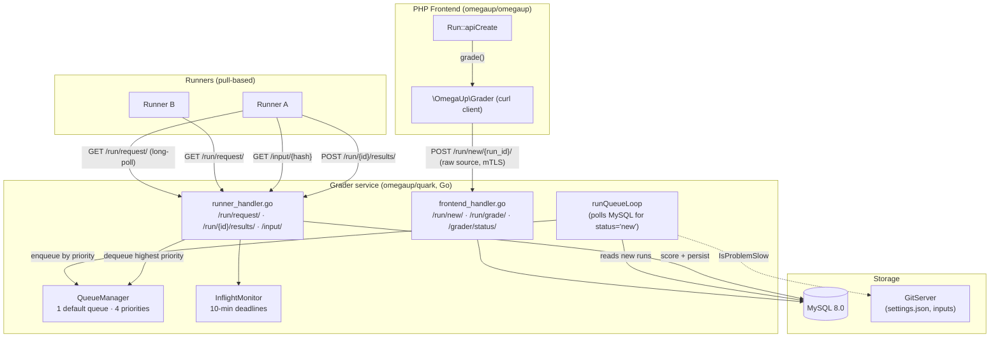

# Grader Internals

The Grader is the piece that turns "the user pressed Submit" into a verdict and a
score. It is **not** part of the PHP monorepo: it is a standalone service written
in Go that lives in the [`omegaup/quark`](https://github.com/omegaup/quark)
repository, under [`cmd/omegaup-grader/`](https://github.com/omegaup/quark/tree/main/cmd/omegaup-grader)
(the HTTP service) and [`grader/`](https://github.com/omegaup/quark/tree/main/grader)
(the queue and scoring core). Everything the PHP backend knows about it fits in a
single thin HTTP client, [`\OmegaUp\Grader`](https://github.com/omegaup/omegaup/blob/main/frontend/server/src/Grader.php),
which does nothing but `curl` JSON and raw bytes over to the Go service and read
the answers back. If you are looking for the queue, the dispatcher, the
validators, or the sandbox in the PHP code, you will not find them — they are all
on the Go side. This page traces one real submission from the moment PHP hands it
off, through the queue, out to a Runner, and back into a score, naming the exact
functions and constants that do each step.

The one-line mental model: **the Grader is a priority queue with a mutual-TLS
front door, a pull-based dispatcher for Runners, and a token/score reducer that
turns per-case outputs into a final grade.** The heavy lifting of actually
compiling and running code belongs to the [Runner](runner-internals.md); the
Grader orchestrates, and it "washes its hands" of a run the instant it is safely
queued.

## The trust boundary: mutual TLS over HTTPS

Every byte between PHP and the Grader crosses an encrypted, mutually-authenticated
channel, and this is deliberate rather than decorative — in an early programming
contest someone sat on the wire and sniffed submission traffic, so the rule became
that *all* communication with omegaUp's subsystems is encrypted. The PHP client in
[`Grader::curlRequestSingle`](https://github.com/omegaup/omegaup/blob/main/frontend/server/src/Grader.php)
presents a client certificate (`/etc/omegaup/frontend/certificate.pem` with key
`/etc/omegaup/frontend/key.pem`), pins `CURLOPT_SSL_VERIFYPEER => true` and
`CURLOPT_SSL_VERIFYHOST => 2`, forces `CURL_SSLVERSION_TLSv1_2`, and talks to
`OMEGAUP_GRADER_URL` — which defaults to `https://localhost:21680`
([config.default.php L61](https://github.com/omegaup/omegaup/blob/main/frontend/server/config.default.php)).
On the Go side the grader's runner-facing listener sets
`ClientAuth: tls.RequireAndVerifyClientCert`, so a Runner (or the frontend) that
cannot present a valid certificate is refused at the TLS handshake, before any
handler runs. The connect timeout is 5 seconds and the overall request timeout is
30 seconds; a small set of transient failures (`SSL connection timeout`,
`Connection timed out`, `HTTP/2 stream`, `INTERNAL_ERROR`, …) are retried up to
3 times with exponential backoff (1s, 2s, 4s capped at 5s), because a momentarily
busy grader should not fail a submission outright.

!!! note "Historical wart: `--insecure`"
    The original console recipe for poking the grader by hand used
    `curl --url https://localhost:21680/grade/ -d '{"id": 12345}' -E frontend/omegaup.pem --cacert ssl/omegaup-ca.crt --insecure`.
    The `--insecure` was there only because the grader's certificate did not carry
    its hostname in the CN; give it `localhost` as the CN and the flag disappears.
    The production PHP client does not use it — it verifies the peer strictly.

## Architecture Overview



## Receiving a run

The journey begins in the PHP controller. When a contestant submits, the request
lands in [`\OmegaUp\Controllers\Run::apiCreate`](https://github.com/omegaup/omegaup/blob/main/frontend/server/src/Controllers/Run.php)
(the class is `Run`, not `RunController` — omegaUp drops the `Controller` suffix),
around line 415. `apiCreate` does all the guarding that must happen while we still
have the user's session: it validates the required fields, checks contest
membership and the time limit, enforces the submission rate limit, inserts a
`Runs` row, and only then — around line 573 — hands off with a single call:

```php
\OmegaUp\Grader::getInstance()->grade($run, trim($source));
```

`grade()` is almost anticlimactic. It POSTs the **raw source code** (not JSON —
`REQUEST_MODE_RAW`, `Content-Type: application/octet-stream`) to
`OMEGAUP_GRADER_URL . "/run/new/{$run->run_id}/"`. Notice what it does *not* send:
no problem settings, no test cases, no language metadata in the body. The run's
integer `run_id` in the URL path is the entire handoff. Everything else, the
Grader will look up for itself. This is the "grader washes its hands" moment for
the frontend — once this curl returns 200, PHP is done and the contestant's page
falls back to polling for the verdict.

On the Go side, the [`/run/new/` handler](https://github.com/omegaup/quark/blob/main/cmd/omegaup-grader/frontend_handler.go)
parses the `run_id` out of the path and calls `newRunInfoFromID`, which is where
the Grader reaches straight into MySQL itself (it holds its own
`go-sql-driver/mysql` connection — the Grader is a first-class database client,
not merely a consumer of PHP's tables). That one query joins `Runs → Submissions →
Problems`, and left-joins `Problemset_Problems → Contests`, to assemble a
`RunInfo`: the submission `guid`, the contest alias, the problemset id, the
`penalty_type`, the `score_mode`, the language, the problem alias, the awardable
points, and the problem's input `version` hash. If the contest has no `score_mode`
the Grader defaults it to `"partial"`; if there are no contest points it sets a
`MaxScore` of `1/1`. The handler then writes the raw source into the artifact
store via `artifacts.Submissions.PutSource(...)`, marks the run `status = 'new'`
in the database, and pokes a Go channel:

```go
select {
case newRuns <- struct{}{}:
default:
}
```

That non-blocking send is the whole notification mechanism: it nudges the
background loop awake without ever blocking the HTTP handler, and if the loop is
already scheduled to run, the `default` branch drops the redundant nudge on the
floor. The handler returns `200 OK` and the submission is now the queue loop's
problem.

### Rejudges take a different door

Re-grading an existing set of runs does not go through `/run/new/`. The PHP side
calls [`Grader::rejudge`](https://github.com/omegaup/omegaup/blob/main/frontend/server/src/Grader.php),
which POSTs JSON — `{"run_ids": [...], "rejudge": true, "debug": false}` — to
`/run/grade/`. That handler is even thinner: it logs the request and fires the
same `newRuns` channel nudge, because the frontend has already flipped those runs'
`status` back to `'new'` in MySQL. The `debug` flag is hard-wired to `false` with
a `TODO(lhchavez): Re-enable with ACLs` — debug rejudges (which enable
AddressSanitizer in C/C++ and need a relaxed sandbox profile) are gated off until
proper access control lands.

## The queue model

Here is where the current implementation diverges sharply from the old wiki, and
from anything that still talks about "eight queues." **The modern Go grader has a
single queue named `default` with four priority levels — not eight named
queues.** The four priorities are defined in
[`grader/queue.go`](https://github.com/omegaup/quark/blob/main/grader/queue.go)
as `QueueCount = 4`:

- **`QueuePriorityHigh`** (0) — reserved for *requeues*. When a run has to be
  retried (a Runner went silent, or returned a transient error), it jumps back in
  at the front so it does not sit behind a fresh backlog it has already waited
  through once.
- **`QueuePriorityNormal`** (1) — the default for a freshly-submitted run on a
  normal-speed problem.
- **`QueuePriorityLow`** (2) — used for *slow* problems and for *rejudges*, so
  that a mass rejudge or a pathologically slow problem cannot monopolize the
  Runners and starve live contestants.
- **`QueuePriorityEphemeral`** (3) — the lowest priority, for the "run this code"
  playground (the ephemeral run-through). These runs are also special in that
  their results are **not** persisted to the filesystem; they live in a
  fixed-size, last-in-first-out cache (`EphemeralRunManager`) that evicts the
  oldest run once it exceeds its size limit.

!!! info "Where the 'eight queues' went"
    The classic omegaUp architecture (backend v1) really did model this as eight
    named queues — `urgente`, `urgente lento`, `concurso`, `concurso lento`,
    `normal`, `normal lento`, `rejudge`, `rejudge lento` — where the "lento"
    (slow) queues held problems that in the worst case take more than 30 seconds
    to return a TLE, and only a fraction of Runners (at one point 50%) could serve
    them so they wouldn't hog capacity. The current grader collapses that whole
    scheme into these four priority levels plus a per-problem `slow` boolean.
    There is **no** 50%-of-Runners cap in the code today; "slow" simply demotes a
    run from Normal to Low priority. If you find yourself needing the old
    fine-grained fairness, that is where it lived and what it did.

!!! info "Historical: remote evaluators and their tiny wait-lists"
    In backend v1 the Grader did not only dispatch to local Runners — after
    examining a run's database record it could redirect it to the queue of the
    *appropriate evaluator* (`local`, `uva`, `pku`, `tju`, `livearchive`, `spoj`),
    forwarding the submission to an external online judge and flipping its status to
    "waiting" before it "washed its hands" and went back to waiting for the next
    notification. Those remote evaluators had deliberately small wait-lists: **UVa
    allowed ~10 concurrent slots and every other judge only one, because none of
    them ever anticipated that automated consumers of their information would
    exist** — so omegaUp throttled itself hard to avoid abusing them. Once a remote
    judge answered with a verdict, that evaluator was responsible for updating the
    run's record and setting the corresponding fields. The modern Go grader in
    [`omegaup/quark`](https://github.com/omegaup/quark) is built around local
    Runners; if you are wondering where the remote-judge routing lived and why its
    concurrency was capped so aggressively, this is it — and the cap was an external,
    non-negotiable constraint, not an omegaUp choice to optimize away.

### What makes a problem "slow"

The demotion to Low priority is driven by `IsProblemSlow` in
[`grader/input.go`](https://github.com/omegaup/quark/blob/main/grader/input.go).
It fetches `settings.json` for the problem at its exact input hash from the
GitServer (`GET {gitserver}/{problem}/+/{hash}/settings.json`, with a 15-second
timeout) and reads the `Slow bool` field. Because asking the GitServer per
submission would be wasteful, the answer is memoized in a 4 MiB LRU cache
(`slowProblemCache`) keyed by `problemName:inputHash` — the hash is in the key on
purpose, so that editing a problem (which produces a new input hash) correctly
invalidates the cached slow/fast decision.

### The run loop and how priority is actually assigned

The background worker is `runQueueLoop`
([frontend_handler.go](https://github.com/omegaup/quark/blob/main/cmd/omegaup-grader/frontend_handler.go)).
The first thing it does on startup is a crash-recovery `UPDATE`: any run whose
`status != 'ready'` is reset to `'new'`, so that runs caught in flight by a grader
restart are simply re-queued rather than lost. It then records the current maximum
`submission_id` and blocks on the `newRuns` channel.

Each time it wakes, it drains *all* pending work: it repeatedly `SELECT`s runs with
`status = 'new'` in batches of `LIMIT 128` until nothing new remains. The query is
a deliberate `UNION` of two halves — new submissions (`submission_id > max`) and
old ones (`submission_id <= max`) — both ordered by `submission_id ASC, run_id
ASC`. This ordering is the fairness policy in action:

```go
priority := grader.QueuePriorityNormal
if maxSubmissionID >= dbRun.submissionID {
    priority = grader.QueuePriorityLow   // an old submission => rejudge => Low
} else {
    maxSubmissionID = dbRun.submissionID // a genuinely new submission
}
```

A submission whose id is at or below the recorded maximum can only be a rejudge of
something that already existed, so it is pushed to **Low** priority; a truly new
submission stays at **Normal** (or gets bumped to Low earlier by `IsProblemSlow`).
The run's source is then read back from the artifact store and the `RunContext` is
enqueued via `injectRun`. Enqueuing is a blocking operation for normal runs
(`enqueueBlocking`) — the loop will wait if the queue channel is momentarily full,
so backpressure is real and nothing is silently dropped; ephemeral runs, by
contrast, use the non-blocking `enqueue` and are given up immediately if their
channel is full.

## Reading queue health: `/grader/status/`

The one window PHP has into all of this is the `/grader/status/` endpoint, which
the [`\OmegaUp\Controllers\Grader::apiStatus`](https://github.com/omegaup/omegaup/blob/main/frontend/server/src/Controllers/Grader.php)
method surfaces by calling `\OmegaUp\Grader::getInstance()->status()`. The PHP
client models the response with a Psalm type that is the authoritative contract
for the five fields you care about:

```php
/** @psalm-type GraderStatus=array{
 *   status: string,
 *   broadcaster_sockets: int,
 *   embedded_runner: bool,
 *   queue: array{
 *     running: list<array{name: string, id: int}>,
 *     run_queue_length: int,
 *     runner_queue_length: int,
 *     runners: list<string>
 *   }
 * } */
```

Reading each field against what the Go handler actually computes:

- **`status`** — `"ok"` when the grader is healthy. The PHP client treats anything
  else as a hard error and throws, so a non-`ok` status never reaches a caller as
  data.
- **`broadcaster_sockets`** (int) — how many WebSocket clients are currently
  connected to the [Broadcaster](broadcaster.md) and therefore listening for live
  verdict updates. This is your gauge of how many people are watching a scoreboard
  right now.
- **`embedded_runner`** (bool) — whether this grader process is also running an
  in-process Runner. In small or development deployments the grader can host its
  own Runner so you don't need to stand up a separate one; in production this is
  typically `false` and Runners are separate machines.
- **`queue.run_queue_length`** (int) — the total backlog: the Go handler sums the
  lengths of all four priority levels across every queue
  (`GetQueueInfo`) into this one number. This is the single most useful "is the
  grader behind?" metric.
- **`queue.running`** (list) — the in-flight runs, each as `{name, id}` where
  `name` is the Runner that holds it and `id` is the run id. This comes straight
  from the `InflightMonitor`'s live map, so it is exactly the set of runs that
  have been dispatched but have not yet reported back.
- **`queue.runner_queue_length`** (int) and **`queue.runners`** (list) — the
  idle-Runner side of the picture: how many Runners are parked waiting for work
  and their names.

!!! warning "Read the status fields against the running build"
    The status endpoint is a reporting surface, and which fields a given grader
    build fully populates can drift — in the current handler
    ([frontend_handler.go](https://github.com/omegaup/quark/blob/main/cmd/omegaup-grader/frontend_handler.go))
    `run_queue_length` and `running` are always filled, while `runners` is emitted
    as an empty list. Treat the Psalm type as the stable contract and the handler
    as the source of truth for what is live right now; if you are building
    alerting on top of these, confirm against the deployed grader rather than
    assuming every field is non-empty.

## Dispatching to Runners

A crucial thing to internalize: **the Grader does not push work to Runners; the
Runners pull.** Each Runner long-polls `GET /run/request/`
([runner_handler.go](https://github.com/omegaup/quark/blob/main/cmd/omegaup-grader/runner_handler.go)),
and the handler calls `runs.GetRun(runnerName, InflightMonitor, closeNotifier)`,
which **blocks** until a run is available. This is why there is no dispatch
affinity to speak of — whichever Runner asks next gets the next run, which is
round-robin by construction. (Affinity existed at some earlier point in omegaUp's
history and it would not be complicated to add back, but the pull model makes the
simple thing the default.)

When a run is available, `GetRun` scans the four priority channels **in order,
highest first** (`for i := range queue.runs`), so a High-priority requeue always
overtakes Normal work, which overtakes Low, which overtakes Ephemeral. It dequeues
the `RunContext`, registers it with the `InflightMonitor` via `monitor.Add`, and
streams `runCtx.RunInfo.Run` back to the Runner as JSON — the language, the problem
name, and the input hash the Runner needs to fetch. The Runner's identity comes
from `peerName`, which reads the CN off its client TLS certificate (or a header in
insecure/dev mode), and the grader also records the Runner's public IP
(`OmegaUp-Runner-PublicIP` header, port 6060) so Prometheus can scrape it.

The Runner then fetches the test inputs it doesn't already have cached from
`GET /input/{problemName}/{hash}` — a 40-hex-character SHA-1 of the input `.zip` —
and posts results back to `POST /run/{attemptID}/results/`.

### The 10-minute deadline and requeue logic

The moment a run is handed out, the `InflightMonitor`
([grader/queue.go](https://github.com/omegaup/quark/blob/main/grader/queue.go))
starts watching it, because a Runner can crash, lose its network, or wedge, and a
lost run must not silently vanish. `NewInflightMonitor` sets both a
`connectTimeout` and a `readyTimeout` of **10 minutes**. A goroutine enforces them
in two stages: first the Runner has 10 minutes to *connect* (to actually come back
and start fetching input / hitting the results endpoint), then another 10 minutes
to reach *ready* (post its results). If either timer fires before the corresponding
signal, `monitor.timeout` presumes the Runner dead and calls `runCtx.Requeue(false)`.

`Requeue` is where the retry budget lives. Every `RunContext` starts with
`attemptsLeft = MaxGradeRetries`, which defaults to **3**
([common/context.go](https://github.com/omegaup/quark/blob/main/common/context.go)).
Each requeue decrements it, and:

- If attempts remain, the run is re-enqueued at **`QueuePriorityHigh`** so it
  jumps the line — it has already waited once and should not be punished twice.
- If `attemptsLeft` hits 0, the run is *abandoned*: a `QueueEventTypeAbandoned`
  event is recorded and the context is closed. It errored out too many times, so
  the grader gives up rather than looping forever.
- If even the high-priority queue is full, the grader has run out of options and
  also gives up — better to abandon one run loudly than to wedge the whole queue.

There is one subtle special case. When a Runner *successfully* returns a `JE`
(Judge Error) verdict — as opposed to going silent — the failure *might* be
transient, so `Requeue` is called with `lastAttempt = true`, which pins
`attemptsLeft = 1`: the run is retried at most once more and no further. The
distinction matters: a runner that reported "I tried and it broke" is treated more
conservatively than a runner that simply disappeared. The results endpoint itself
is wrapped in an `http.TimeoutHandler` with a **5-minute** timeout, so a single
result upload that hangs cannot occupy a handler indefinitely.

## Validators: turning output into a per-case score

Once a Runner has run the contestant's program on a test case, some component has
to decide whether the output is *right*. That decision is the validator's job, and
omegaUp offers five validator types, chosen per problem via the `Validator.Name`
field in `settings.json`
([common/problemsettings.go](https://github.com/omegaup/quark/blob/main/common/problemsettings.go)):

- **`token`** — the default. Both the expected and contestant outputs are split
  into whitespace-separated tokens and compared **exactly**, token by token
  (`a == b`). A trailing newline or an extra space between tokens does not matter
  because whitespace is the delimiter, but `Hello` and `hello` are different and
  `42` and `42.0` are different.
- **`token-caseless`** — identical to `token` but the per-token comparison uses
  `strings.EqualFold`, so `YES`, `Yes`, and `yes` all match. Use it when the
  problem statement is case-insensitive about the answer.
- **`token-numeric`** — tokens are compared as floating-point numbers within a
  tolerance, which is what you want for problems whose answer is a real number and
  where `3.0000001` should count as `3`. The default tolerance
  (`DefaultValidatorTolerance`) is **1e-6**, overridable per problem. The
  comparison in `tokenNumericEquals` accepts a pair if they are exactly equal, or
  the absolute difference is `<= 1.5 * tolerance`, or the *relative* difference is
  `<= tolerance` — with a dedicated near-zero branch (using the smallest normal
  double, `2.2250738585072014e-308`) so that comparisons against 0 don't blow up.
  If exactly one of the two tokens fails to parse as a float, they are unequal; if
  *both* fail to parse, they are treated as equal (two pieces of non-numeric noise
  in the same position are not a discriminating difference).
- **`custom`** — for problems where correctness can't be reduced to token
  matching (multiple valid answers, special judging, partial credit by a formula).
  A validator program you ship with the problem is compiled and run **in the
  sandbox, once per case**, fed the contestant's output plus the original input
  and expected output; whatever floating-point number it prints to stdout becomes
  that case's score, clamped to the range `[0, 1]`. If the original `.out` file is
  missing, the grader substitutes `/dev/null` rather than failing; if the
  validator program itself errors, the case verdict becomes `VE` (Validator Error).
- **`literal`** — a special-purpose validator (used mainly by the ephemeral
  run-through and literal-input problems) that reads the contestant's first token
  directly as the score in `[0, 1]`, no comparison performed.

The comparison engine is `CalculateScore` in
[runner/validator.go](https://github.com/omegaup/quark/blob/main/runner/validator.go).
For the token validators it walks both outputs in lockstep with a tokenizer
(scanning non-whitespace tokens, or numeric tokens for `token-numeric`): at the
first position where the two disagree — including where one output runs out of
tokens before the other — it produces a `TokenMismatch` recording the expected and
contestant tokens, and the case scores **0**. If both streams reach the end with no
mismatch, the case scores **1** (`big.NewRat(1, 1)`). Scores are kept as exact
rationals (`math/big.Rat`) throughout, not floats, so weight arithmetic never
accumulates rounding error.

## Scoring and grouping

A per-case score of 0 or 1 (or a fraction, for custom validators) is only the raw
material. The final grade comes from aggregating cases into **groups** and combining
group scores with weights, in `runner.go`'s validation loop
([runner/validator aggregation](https://github.com/omegaup/quark/blob/main/runner/runner.go)).

**Group membership is derived from the case name: the group is everything before
the first `.`.** This is literally `strings.SplitN(caseName, ".", 2)[0]` in
`CaseWeightMapping.AddCaseName`
([common/problemsettings.go](https://github.com/omegaup/quark/blob/main/common/problemsettings.go)),
so a case named `group1.case2` belongs to group `group1`, and `sample.0`,
`sample.1` both belong to `sample`. No separate mapping file is required — the
naming convention *is* the grouping.

**Weights are normalized to sum to 1.** Each case carries a `Weight` (a `big.Rat`);
the loop first computes `totalWeightFactor = 1 / Σ(weights)`, and if the weights
sum to zero it falls back to a factor of 1. Every case's contribution is then
`weight * totalWeightFactor`, so the whole problem's cases always sum to 1
regardless of the absolute weights you wrote. A `/testplan`-style layout can assign
explicit per-group and per-case weights; absent one, every case defaults to a
weight of 1, which makes the normalization degenerate to the familiar `1/N` for N
equally-weighted cases.

Within a group the scoring is governed by a **`GroupScorePolicy`**:

- **`sum-if-not-zero`** (the default, also written as the empty string) — the group
  score is the weighted **sum** of its cases' scores. Partial credit accrues case
  by case.
- **`min`** — the group score is the **minimum** case score times the group weight;
  the weakest case defines the whole group. This is the "all-or-nothing within a
  group" policy for problems where solving 9 of 10 sub-cases shouldn't earn 90% of
  the group.

There is a hard gate on top of the policy: a group only earns points if **every
case in it actually ran cleanly.** The loop tracks a `correct` flag that is
initialized to `true` and flipped to `false` the moment any case in the group has a
sandbox verdict other than `OK` (a TLE, an RTE, a crash — anything that means the
program didn't produce a comparable output). If `correct` is false at the end of
the group, that group contributes **0**, no matter how the other cases scored.

Per-case verdicts fall out of the score: a case that scored a full 1 becomes `AC`,
a case that scored 0 becomes `WA`, and anything in between becomes `PA` (partial).
The run's overall verdict is the **worst** verdict across all its cases, where
"worse" is defined by position in `VerdictList`
([common/problemsettings.go](https://github.com/omegaup/quark/blob/main/common/problemsettings.go)):

```
JE, CE, RFE, VE, MLE, RTE, TLE, OLE, WA, PA, AC, OK
```

`worseVerdict(a, b)` simply returns whichever appears earlier in that list, so a
single `TLE` case drags the whole run's verdict to `TLE` even if every other case
was `AC`. At the very end, a run that came out `OK` everywhere is promoted to `AC`
with score exactly 1, and a run that was heading for `PA` but ended up with a zero
total score is corrected down to `WA`. The final numeric grade is
`ContestScore = MaxScore * Score`, where `MaxScore` is the problem's point value in
that contest (or 1 outside a contest) and `Score` is the normalized `[0, 1]`
aggregate.

Whether a run can even earn partial credit at the contest level is set by the
contest's `score_mode`, which the grader read back in `newRunInfoFromID` and
defaults to `"partial"` — a contest configured for all-or-nothing scoring changes
how these per-group partials roll up into what the contestant is finally awarded.

## Returning the verdict and broadcasting

When a Runner posts to `/run/{attemptID}/results/` and the result is final (not a
retry), the grader closes the `RunContext` (`runCtx.Close()`), which serializes the
`RunResult` to `details.json`, gzips the run's logs to `logs.txt.gz` in the
artifact store, removes the run from the `InflightMonitor`, and fires the
post-processor. The post-processor updates the run's row in MySQL to `status =
'ready'` with the verdict and score, and the [Broadcaster](broadcaster.md) pushes
the fresh verdict out to every connected WebSocket client — which is precisely the
population counted by `broadcaster_sockets` in the status endpoint. PHP, which has
been polling since `apiCreate` returned, sees the `ready` row and shows the
contestant their result.

## Configuration

The Grader is configured through the JSON config baked into the
[`omegaup/quark`](https://github.com/omegaup/quark) service (surfaced in
development through the `omegaup/backend` Docker image). The settings you will most
often touch:

| Setting | Meaning |
|---------|---------|
| `Grader.BroadcasterURL` | Where finished verdicts are pushed for live updates. |
| `Grader.GitserverURL` | The GitServer the grader reads `settings.json` and inputs from. |
| `Grader.GitserverAuthorization` | The shared-secret `Authorization` header for GitServer requests. |
| `Grader.MaxGradeRetries` | Requeue budget per run before abandoning (default **3**). |
| `Runner.PreserveFiles` | Keep per-run scratch files after grading — for debugging only. |

On the PHP side the only knobs are `OMEGAUP_GRADER_URL` (default
`https://localhost:21680`) and `OMEGAUP_GRADER_FAKE`
([config.default.php](https://github.com/omegaup/omegaup/blob/main/frontend/server/config.default.php)),
the latter short-circuiting `\OmegaUp\Grader` to write sources to `/tmp` and return
canned status so the frontend test suite can run without a live grader.

## Source Code

The Grader lives in the [`omegaup/quark`](https://github.com/omegaup/quark)
repository:

- [`cmd/omegaup-grader/`](https://github.com/omegaup/quark/tree/main/cmd/omegaup-grader) — the HTTP service: the frontend-facing handler (`/run/new/`, `/run/grade/`, `/grader/status/`), the runner-facing handler (`/run/request/`, `/run/{id}/results/`, `/input/`), and the `runQueueLoop` that polls MySQL.
- [`grader/`](https://github.com/omegaup/quark/tree/main/grader) — the queue core: `QueueManager`, the four-priority `Queue`, the `InflightMonitor` and its 10-minute deadlines, `IsProblemSlow`.
- [`runner/`](https://github.com/omegaup/quark/tree/main/runner) — `CalculateScore` and the validator implementations.
- [`common/`](https://github.com/omegaup/quark/tree/main/common) — the validator names, `VerdictList`, and `GroupScorePolicy` definitions.

The PHP client is a single file,
[`frontend/server/src/Grader.php`](https://github.com/omegaup/omegaup/blob/main/frontend/server/src/Grader.php).

## Related Documentation

- **[Runner Internals](runner-internals.md)** — how a Runner compiles, sandboxes, and executes the code the Grader dispatches.
- **[Broadcaster](broadcaster.md)** — the WebSocket fan-out counted by `broadcaster_sockets`.
- **[GitServer](gitserver.md)** — where `settings.json`, weights, and test inputs come from.
- **[System Internals](internals.md)** — the full `apiCreate → Grader → Runner → Broadcaster` request flow.
- **[Database Schema](database-schema.md)** — the `Runs` and `Submissions` tables the grader reads and writes directly.
