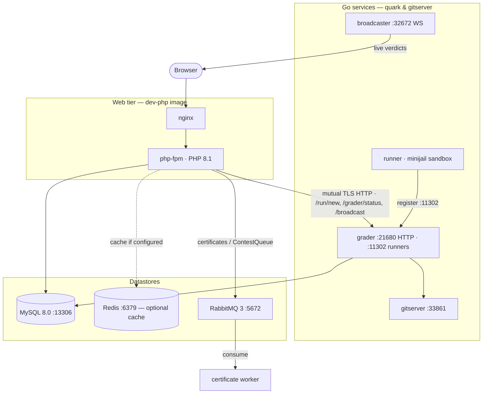

# Infrastructure & Deployment Topology

omegaUp is not one program. It is a PHP web application that talks to a small
constellation of Go services over the network, backed by MySQL, Redis and
RabbitMQ, and glued together by Docker Compose. This page walks the whole
topology the way a request actually experiences it: which container serves the
HTML and the API, which datastores that PHP process reaches into, and — the part
that surprises newcomers — how the judging half of the system lives in an
entirely separate set of repositories that the frontend only ever reaches by
HTTP. If you remember one thing, remember this: **the grader, the runners, the
broadcaster and the sandbox are not in the PHP monorepo at all.** They are Go
binaries from [`omegaup/quark`](https://github.com/omegaup/quark) and
[`omegaup/gitserver`](https://github.com/omegaup/gitserver), and the PHP side
knows them only as URLs.

## The two compose files, and why there are two

Everything you run locally comes up from
[`docker-compose.yml`](https://github.com/omegaup/omegaup/blob/main/docker-compose.yml).
That file is the development topology: one image per subsystem, source bind-mounted
live from your working tree into `/opt/omegaup`, ports published to your host so you
can poke at them. Production is described separately by
[`docker-compose.k8s.yml`](https://github.com/omegaup/omegaup/blob/main/docker-compose.k8s.yml),
and the two look almost nothing alike **because they answer different questions.**
The dev file's job is "let a contributor edit PHP and see it immediately"; the k8s
file's job is "produce the immutable images Kubernetes will schedule." So the k8s
file doesn't run MySQL or Redis or the graders at all — those are managed elsewhere
in the cluster — it only *builds* the frontend images: `omegaup/frontend`,
`omegaup/php`, `omegaup/nginx`, `omegaup/frontend-sidecar` and
`omegaup/ai-editorial-worker`, each a separate `target` stage of a single
`Dockerfile.frontend`. The split into distinct `php` and `nginx` images is the
tell that in production nginx and php-fpm are separate containers; in dev they are
fused into one image for convenience.

## nginx + php-fpm: what actually serves a page

The dev frontend runs the image `omegaup/dev-php:20231008`, built from
[`stuff/docker/Dockerfile.dev-php`](https://github.com/omegaup/omegaup/blob/main/stuff/docker/Dockerfile.dev-php),
which is a plain `ubuntu:jammy` that installs `nginx` and `php8.1-fpm` (plus
`php8.1-opcache` and `php8.1-apcu`) side by side. That is the whole runtime story
for the web tier: **standard PHP 8.1 behind php-fpm behind nginx.** There is no
HHVM anywhere — it was removed years ago, and `grep -ri hhvm` over the repo returns
nothing. When a browser hits `/api/run/create/`, nginx routes it to php-fpm, which
runs [`frontend/www/api/ApiEntryPoint.php`](https://github.com/omegaup/omegaup/blob/main/frontend/www/api/ApiEntryPoint.php);
that file does `require_once('../../server/bootstrap.php')` and then
`echo \OmegaUp\ApiCaller::httpEntryPoint()`, which dispatches to the matching
controller method (for submissions, `\OmegaUp\Controllers\Run::apiCreate`, which
lives at [`Run.php` around L415](https://github.com/omegaup/omegaup/blob/main/frontend/server/src/Controllers/Run.php)).
The container `EXPOSE`s port `8001`, and its startup `CMD` is a `wait-for-it` gate
on `grader:36663`, `gitserver:33861`, `broadcaster:22291` and `mysql:13306` — the
frontend deliberately refuses to come up until its dependencies answer, so you
never get the confusing half-booted state where the site loads but every judge
call times out.

The server-rendered shell those requests emit is one Twig 3 template,
`frontend/templates/template.tpl`, expanded by the custom Twig extensions in
[`frontend/server/src/Template/`](https://github.com/omegaup/omegaup/tree/main/frontend/server/src/Template)
(`EntrypointNode`, `JsIncludeNode`, `VersionHashNode`). That shell injects a JSON
payload and hands the page over to Vue 2.7; Smarty is gone. Templating is a
frontend concern rather than an infrastructure one, so it is only mentioned here
to close the "what renders the HTML" question — the deep treatment lives in the
frontend architecture page.

## The datastores the PHP process reaches

**MySQL 8.0** (`mysql:8.0.34`, pinned to `linux/amd64` because the frontend image
assumes an amd64 mysqld) is the source of truth. In dev it listens on the
non-standard port `13306` — not the usual `3306` — which is why the frontend's
environment sets `MYSQL_TCP_PORT: 13306` and every service's `wait-for-it` targets
`mysql:13306`; the offset exists so a MySQL you already run on your host doesn't
collide with the container. The container is started with
`--max_execution_time=30000 --lock_wait_timeout=10 --wait_timeout=20`, meaning any
single statement is killed after 30 s, a transaction waits at most 10 s for a row
lock before giving up, and an idle connection is dropped after 20 s — guard rails
so one pathological query can't wedge the whole database. It also requests
`cap_add: SYS_NICE` so mysqld can set thread priorities. The PHP side speaks to it
through the raw `mysqli` driver in
[`frontend/server/src/MySQLConnection.php`](https://github.com/omegaup/omegaup/blob/main/frontend/server/src/MySQLConnection.php),
and all table access goes through the auto-generated DAO/VO layer under
`frontend/server/src/DAO/`.

**Redis** (`redis`, `redis-server /etc/redis/redis.conf`, port `6379`) is the
optional shared cache. "Optional" is the load-bearing word: the cache
implementation is chosen by `OMEGAUP_CACHE_IMPLEMENTATION` in
[`config.default.php`](https://github.com/omegaup/omegaup/blob/main/frontend/server/config.default.php),
and it defaults to **`'apcu'`**, not `'redis'`. So on a single box the cache lives
in the php-fpm process's own APCu shared memory and Redis is idle; you switch to
`'redis'` only when you have more than one frontend and they need to share a cache
and session store. When Redis *is* used, the connection parameters are the
`REDIS_HOST` / `REDIS_PORT` / `REDIS_PASS` defines (in dev, `redis`, `6379`, and
the password `redis`, matching the `REDIS_PASSWORD: "redis"` the frontend container
is handed).

**RabbitMQ 3** (`rabbitmq:3-management-alpine`, AMQP on `5672`, the management UI
on `15672`) carries exactly one kind of message today, and it is worth being
precise because the queue map is small and easy to over-imagine. The only producer
in the PHP codebase is
[`Certificate.php`](https://github.com/omegaup/omegaup/blob/main/frontend/server/src/Controllers/Certificate.php),
which, when an admin asks omegaUp to generate a contest's completion certificates,
publishes a single JSON message to the exchange **`certificates`** with routing key
**`ContestQueue`**:

```php
// frontend/server/src/Controllers/Certificate.php (~L640)
$routingKey = 'ContestQueue';
$exchange   = 'certificates';
$channel = \OmegaUp\RabbitMQConnection::getInstance()->channel();
// ... build $messageArray = certificate_cutoff, alias, scoreboard_url,
//     contest_id, ranking ...
$message = new \PhpAmqpLib\Message\AMQPMessage($messageJSON);
$channel->basic_publish($message, $exchange, $routingKey);
$channel->close();
$contest->certificates_status = 'queued';
```

The PHP process publishes and immediately marks `certificates_status = 'queued'`;
an external worker consumes the message and does the slow PDF generation out of
band, so the admin's request returns instantly instead of blocking on rendering
hundreds of certificates. The connection itself is a lazily-created singleton in
[`RabbitMQConnection.php`](https://github.com/omegaup/omegaup/blob/main/frontend/server/src/RabbitMQConnection.php)
that opens an `AMQPStreamConnection` to `OMEGAUP_RABBITMQ_HOST` (default `rabbitmq`)
and — a nice detail — registers a `register_shutdown_function` to close the socket
when the script ends, so a php-fpm request never leaks an AMQP connection. **Note
that the grader does *not* consume from RabbitMQ.** Submissions reach the judge over
HTTP, described next; RabbitMQ is only for the certificate side-channel.

## Crossing the boundary: PHP to the grader over HTTP

Here is the seam that defines the whole architecture. When
`Run::apiCreate` has validated a submission it calls
`\OmegaUp\Grader::getInstance()->grade($run, $source)` (around
[`Run.php` L573](https://github.com/omegaup/omegaup/blob/main/frontend/server/src/Controllers/Run.php)),
and [`Grader.php`](https://github.com/omegaup/omegaup/blob/main/frontend/server/src/Grader.php)
is nothing more than a cURL client. It is *not* the queue, it does *not* run code,
it does not know what minijail is — it just POSTs to `OMEGAUP_GRADER_URL` (default
`https://localhost:21680`). Each method maps to one endpoint on the Go grader:

- `grade()` → `POST /run/new/{run_id}/` with the raw source as the body — the normal
  "please judge this submission" call.
- `rejudge()` → `POST /run/grade/` with a list of run ids — used for mass rejudges.
- `status()` → `GET /grader/status/` — returns the live `GraderStatus`:
  `run_queue_length`, `runner_queue_length`, the list of connected `runners`,
  `broadcaster_sockets`, and `embedded_runner`. This is what
  `\OmegaUp\Controllers\Grader::apiStatus` surfaces to the admin dashboard.
- `broadcast()` → `POST /broadcast/` — asks the grader to push a live event (a new
  verdict, a clarification) out to subscribed browsers.
- `getSource()` / `getGraderResource()` → `/submission/source/{guid}/` and
  `/run/resource/` — pull back the stored source or per-run artifacts (logs, the
  compiled binary) on demand.

The transport is deliberately hardened, because a contest's integrity depends on it.
Every call in
[`curlRequestSingle`](https://github.com/omegaup/omegaup/blob/main/frontend/server/src/Grader.php)
presents a client certificate and verifies the server's:

```php
CURLOPT_SSLKEY       => '/etc/omegaup/frontend/key.pem',
CURLOPT_SSLCERT      => '/etc/omegaup/frontend/certificate.pem',
CURLOPT_CAINFO       => '/etc/omegaup/frontend/certificate.pem',
CURLOPT_SSL_VERIFYPEER => true,
CURLOPT_SSL_VERIFYHOST => 2,
CURLOPT_SSLVERSION   => CURL_SSLVERSION_TLSv1_2,
CURLOPT_CONNECTTIMEOUT => 5,   // give up connecting after 5s
CURLOPT_TIMEOUT        => 30,  // give up on the whole call after 30s
```

That is **mutual TLS**: the frontend proves who it is with `key.pem`, and it
refuses to talk to a grader whose certificate doesn't chain to the CA in
`certificate.pem` (`VERIFYPEER` on, `VERIFYHOST` set to `2`), over TLS 1.2 only.
Around that single call sits a retry loop — `curlRequest` will retry up to **3
times** with exponential backoff (`1s`, `2s`, then capped at `5s`), but *only* for
errors it classifies as retryable (`'Connection timed out'`, `'SSL connection
timeout'`, `'HTTP/2 stream'`, `'Operation timed out'`, and a few siblings). A
non-retryable error — say the grader returned a 400 — is re-thrown immediately, so
a genuine bug doesn't get papered over by three pointless retries.

## The Go services the grader fans out to

The URL `https://localhost:21680` resolves, in the dev compose, to the `grader`
container: image `omegaup/backend:v1.9.35`, entrypoint `/usr/bin/omegaup-grader`.
That binary is built from the [`grader/`](https://github.com/omegaup/quark/tree/main/grader)
package of `omegaup/quark`, and *it* owns everything the PHP wiki of old wrongly
attributed to the backend: the priority queue
([`grader/queue.go`](https://github.com/omegaup/quark/blob/main/grader/queue.go)),
the runner pool, and the dispatch logic. The grader listens on two ports for two
different audiences — **`21680`** is the HTTPS endpoint the PHP frontend calls, and
**`11302`** is where runners connect to register themselves — which is why the
`runner` service's entrypoint is `wait-for-it grader:11302 -- /usr/bin/omegaup-runner`:
a runner can't join the pool until the grader's registration port is up.

The `runner` container (image `omegaup/runner:v1.9.35`) is the thing that actually
compiles and executes a submission. Its sandbox lives in
[`runner/sandbox.go`](https://github.com/omegaup/quark/blob/main/runner/sandbox.go);
in production that sandbox is minijail, but notice the dev compose starts the runner
with the `-noop-sandbox` flag — because minijail needs kernel privileges that a
throwaway dev container shouldn't hold, dev judging runs *without* real isolation
([`runner/noop_sandbox.go`](https://github.com/omegaup/quark/blob/main/runner/noop_sandbox.go)).
That is a fine trade-off for "does my problem's testdata parse," and a terrible one
for anything you'd trust a real contest to, which is exactly why it is a flag and
not the default in production.

The `broadcaster` (also `omegaup/backend:v1.9.35`, entrypoint
`/usr/bin/omegaup-broadcaster`, source in
[`broadcaster/`](https://github.com/omegaup/quark/tree/main/broadcaster)) is the
live-update fan-out. When the PHP `broadcast()` call reaches the grader, the
broadcaster relays the event over WebSockets (it exposes `32672` and `22291`) to
every browser subscribed to that contest, which is how a scoreboard updates the
instant a verdict lands instead of on the next poll. The count of those open
sockets is the `broadcaster_sockets` field you saw in `GraderStatus`.

Finally, `gitserver` (image `omegaup/gitserver:v1.9.13`, entrypoint
`wait-for-it mysql:13306 -- /usr/bin/omegaup-gitserver`, source in
[`omegaup/gitserver`](https://github.com/omegaup/gitserver)) is where problems
physically live. Each problem is a **git repository** — statements, testcases,
validators, settings — served over port `33861`, with the repositories stored in
the shared `omegaupdata` volume mounted at `/var/lib/omegaup` (the
`init-omegaupdata` one-shot Alpine container exists purely to `mkdir -p
/var/lib/omegaup/problems.git` and `chown` it before anything else starts). Both
the frontend and the grader mount that same volume, so when the grader needs a
problem's input set it reads it straight from the git-backed store.

One shared convention across all four Go services: they each `expose` port
**`6060`**, Go's standard `net/http/pprof` debug endpoint, so a maintainer can
attach a profiler to a live grader or runner without redeploying it.

## Observability: metrics and logs

Two independent channels answer "is it healthy?" and "what happened?".

For **metrics**, omegaUp uses the
[`promphp/prometheus_client_php`](https://github.com/PromPHP/prometheus_client_php)
library (pinned `^2.4` in
[`composer.json`](https://github.com/omegaup/omegaup/blob/main/composer.json)),
wrapped by [`Metrics.php`](https://github.com/omegaup/omegaup/blob/main/frontend/server/src/Metrics.php).
The wrapper picks its storage backend at construction time: if APCu is available it
uses `\Prometheus\Storage\APC`, otherwise `\Prometheus\Storage\InMemory` — the APC
path is what lets counters survive *across* php-fpm requests within a worker, since
a plain PHP request is otherwise stateless and would forget every metric the moment
it ends. The counters registered today are `frontend_api_request_status_count`
(labelled by `api` and `status`) and `frontend_api_request_total` (labelled by
`api`), incremented on every dispatched API call. They are scraped at
[`frontend/www/metrics.php`](https://github.com/omegaup/omegaup/blob/main/frontend/www/metrics.php),
a four-line endpoint that boots the bootstrap and calls
`\OmegaUp\Metrics::getInstance()->render()`, emitting the Prometheus text
exposition format.

For **logs**, [`bootstrap.php`](https://github.com/omegaup/omegaup/blob/main/frontend/server/bootstrap.php)
configures Monolog 2 (`monolog/monolog ^2.3`) once, at the very start of every
request. It builds a `\Monolog\Logger('omegaup')` writing through a `StreamHandler`
to `OMEGAUP_LOG_FILE` (default `/var/log/omegaup/omegaup.log`) at the level in
`OMEGAUP_LOG_LEVEL` (default `info`), pushes a `WebProcessor` so each line carries
the request URL and method, and then registers it globally with
`\Monolog\Registry::addLogger` and `\Monolog\ErrorHandler::register` — the latter
routing uncaught PHP errors and exceptions into the same log. The New Relic
integration is entirely conditional, and reading how it degrades is instructive:

```php
if (class_exists('\NewRelic\Monolog\Enricher\Formatter')) {
    $logFormatter = new \NewRelic\Monolog\Enricher\Formatter();
} else {
    $logFormatter = new \Monolog\Formatter\LineFormatter();
}
// ...
if (class_exists('\NewRelic\Monolog\Enricher\Processor')) {
    $rootLogger->pushProcessor(new \NewRelic\Monolog\Enricher\Processor());
}
```

When the `newrelic/monolog-enricher` package (`^2.0`) is installed, log records get
the New Relic formatter and a processor that stamps each line with the current
trace/entity linkage, so a log line can be pivoted to its APM trace; when it's
*not* installed — as on a plain local checkout — everything falls back to the human
`LineFormatter` and nothing breaks. That `class_exists` guard is deliberate: New
Relic is a production luxury, and a contributor must never need a New Relic license
to run the site. The browser-side New Relic agent is loaded separately, only when
the `NEW_RELIC_SCRIPT` / `NEW_RELIC_SCRIPT_HASH` config values are set.

## System overview



## Related Documentation

- **[Docker Setup](../operations/docker-setup.md)** — the full local bring-up
- **[Deployment](../operations/deployment.md)** — production deployment
- **[Monitoring](../operations/monitoring.md)** — dashboards and alerting
- **[Security](security.md)** — mutual TLS, PASETO tokens, OAuth2
