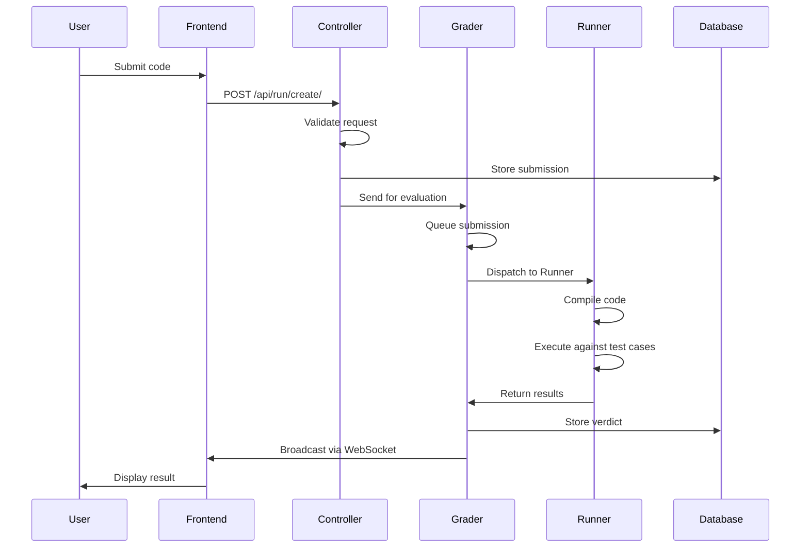

# System Internals

Everything you ever wanted to know about how omegaUp runs your code, and were afraid to ask. This page follows a single submission the whole way down — from the moment you hit "Send" in the arena, through the PHP frontend, across the wire to the Go grader, into a sandboxed runner, and back out to the scoreboard everyone else is watching. We narrate it in execution order and name the exact symbol that performs each step, because the *why* behind each hop is the part you can't reconstruct from reading any one file in isolation.

Two things worth knowing before we start. First, the frontend (the PHP monorepo, [`omegaup/omegaup`](https://github.com/omegaup/omegaup)) and the backend evaluation stack (the Go grader, runner, and broadcaster, all in [`omegaup/quark`](https://github.com/omegaup/quark), plus [`omegaup/gitserver`](https://github.com/omegaup/gitserver)) are *separate repositories and separate processes*. The frontend never compiles or runs anyone's code itself — it hands the job off over HTTP and waits for the verdict to come back asynchronously. Second, that hand-off is deliberately the only coupling point: the frontend talks to the grader through exactly one thin client, [`\OmegaUp\Grader`](https://github.com/omegaup/omegaup/blob/main/frontend/server/src/Grader.php), and nothing else in the PHP code knows the grader exists.

## The trip in one picture

The diagram flattens two things the prose below will unflatten: the grader is *re-entered* twice (once to enqueue and dispatch, once more after the runner reports back, to score), and the last two arrows are actually a separate service — the broadcaster — calling *back* into the frontend to rebuild the scoreboard before it pushes anything over a socket.

## Frontend: the POST leaves your browser

When you submit, the first thing that happens is your code — together with the problem alias, the contest alias (or `problemset_id`), and the language — is POSTed to the API endpoint `/api/run/create/`. In the current Vue 2.7 + TypeScript arena, this goes through the generated API client: an arena entrypoint such as [`frontend/www/js/omegaup/arena/contest_contestant.ts`](https://github.com/omegaup/omegaup/blob/main/frontend/www/js/omegaup/arena/contest_contestant.ts) calls `api.Run.create({...})`, and `api.Run.create` is a typed wrapper defined in [`frontend/www/js/omegaup/api.ts`](https://github.com/omegaup/omegaup/blob/main/frontend/www/js/omegaup/api.ts) that POSTs to `/api/run/create/`. That file is machine-generated (it opens with a `// generated by frontend/server/cmd/APITool.php. DO NOT EDIT.` banner), which is why the TypeScript types on the request and the PHP types on the controller can never drift apart — they come from the same source of truth. (If you go spelunking for the old `OmegaUp.submit` in `frontend/www/js/omegaup.js`, don't: that file is gone. The migration to single-file Vue components is complete — the server now renders only a thin HTML shell (a Twig 3 template) that boots the Vue app, and the whole arena is driven by `api.ts` now.)

Once the request reaches the server, nginx forwards it to PHP (php-fpm, running plain PHP 8.1). The entrypoint is [`frontend/www/api/ApiEntryPoint.php`](https://github.com/omegaup/omegaup/blob/main/frontend/www/api/ApiEntryPoint.php), which does `require_once('../../server/bootstrap.php')` and then `echo \OmegaUp\ApiCaller::httpEntryPoint()`. [`frontend/server/bootstrap.php`](https://github.com/omegaup/omegaup/blob/main/frontend/server/bootstrap.php) is the thing that has to run first: it loads configuration, pulls in the autoloaded modules, and initializes the MySQL connection, so that by the time any controller runs, the world is already set up.

`ApiCaller` then builds a `\OmegaUp\Request` object — the in-memory representation of every parameter of the request, including the authentication cookie — and tokenizes the URL path. It strips the leading `/api` and splits `/api/run/create/` into `['run', 'create']`. The first token is the controller, the second is the method. In [`frontend/server/src/ApiCaller.php`](https://github.com/omegaup/omegaup/blob/main/frontend/server/src/ApiCaller.php) you can watch it happen: `$controllerName = ucfirst($args[2])` yields `Run`, `$apiMethodName = "api{$methodName}"` yields `apiCreate`, and `$controllerFqdn = "\\OmegaUp\\Controllers\\{$controllerName}"` resolves to `\OmegaUp\Controllers\Run`. Note the class is `Run`, **not** `RunController` — omegaUp controllers deliberately drop the `Controller` suffix (you'll find `Contest`, `Problem`, `Grader`, `Submission`, and friends under the same rule). Every path token *after* the controller and method is treated as a run of variable-name/value pairs and folded into the `Request`.

## `\OmegaUp\Controllers\Run::apiCreate`: the permission gauntlet

Now [`\OmegaUp\Controllers\Run::apiCreate`](https://github.com/omegaup/omegaup/blob/main/frontend/server/src/Controllers/Run.php) (around L415 of `Run.php`) takes over, and this is where a submission earns the right to exist. The very first line, `$r->ensureIdentity()`, validates the authentication token that was set at login — normally stored as a cookie, but the API will also accept it as a POST parameter — and resolves the identity making the request.

Then it validates that this user actually has permission to make *this* submission, and it's worth spelling out every gate in order rather than collapsing it to "validates permissions," because anyone touching auth needs to know all of them. Inside `validateCreateRequest` it checks that all the required elements are present (problem alias, contest/problemset, language, and source); that the problem exists and isn't `deprecated`; that you didn't set both `problemset_id` *and* `contest_alias` at once (they're mutually exclusive — a submission belongs to exactly one container); that the problem is actually part of the contest and both are valid; and, for a public or practice submission with no contest, that the problem is visible and the practice deadline (if any) hasn't passed. There's even one hard-coded refusal that's pure institutional memory: the identity named `omi` is forbidden outright (`throw new \OmegaUp\Exceptions\ForbiddenAccessException()`), a guard added for [issue #739](https://github.com/omegaup/omegaup/issues/739).

Two of those gates carry constants you should not genericize. The rate limit is **one submission per problem per 60 seconds** — `Run::$defaultSubmissionGap = 60` (seconds), enforced by `validateWithinSubmissionGap` via `\OmegaUp\DAO\Submissions::isInsideSubmissionGap`, and it throws `NotAllowedToSubmitException('runWaitGap')` if you're too eager (system and contest admins are exempt, so they can spam test submissions during setup). And when the platform is in **Lockdown** mode, extra checks kick in — for now the only one is that the run isn't being made in practice mode, enforced by `\OmegaUp\Controllers\Controller::ensureNotInLockdown()` on the practice path — so that during a locked-down contest window nobody sneaks a submission in through the practice door.

If all gates pass, `apiCreate` computes the **penalty** according to the contest's `penalty_type`. This is a real branch, not a formality: `contest_start` measures `submit_delay` in minutes from the contest's `start_time`; `problem_open` measures it from the moment the user first opened the problem (looked up in `ProblemsetProblemOpened` — and if there's no open record, it means you're submitting to a problem you never opened, which throws `runNotEvenOpened`); and `none`/`runtime` skip the penalty entirely (`submit_delay = 0`). The delay is stored as whole minutes: `intval((\OmegaUp\Time::get() - $start->time) / 60)`.

Then it mints a random **GUID** — `md5(uniqid(strval(rand()), true))` — which is the identifier the code file will be stored under and the handle every later stage uses to refer to this run. It writes the rows: a `Submissions` row and a `Runs` row, both created inside a `\OmegaUp\TransactionHelper::executeWithRetry(...)` block (the retry wrapper exists because concurrent submissions can deadlock in MySQL, and re-running the closure is cheaper than failing the user). Both rows start life as `status = 'uploading'` with a placeholder `verdict = 'JE'` (Judge Error) — a run that never makes it past this point *stays* `JE`, which is your signal that the grader was never successfully told about it. Crucially, `validateWithinSubmissionGap` is re-checked *inside* the transaction, because only there is the gap check race-free against a second in-flight submission.

Finally, the frontend hands the run to the grader and washes its hands of the rest. `apiCreate` calls `\OmegaUp\Grader::getInstance()->grade($run, trim($source))` (around L573). Under the hood that's a single `curl` POST to `OMEGAUP_GRADER_URL . "/run/new/{$run->run_id}/"` with the source as the raw request body — note it passes the **run id**, not the code-by-value, because the grader will re-read everything it needs from the database itself. `OMEGAUP_GRADER_URL` defaults to `https://localhost:21680` ([`config.default.php`](https://github.com/omegaup/omegaup/blob/main/frontend/server/config.default.php) around L61). That call is mutually authenticated with TLS client certificates (`CURLOPT_SSLKEY`/`CURLOPT_SSLCERT` pointing at `/etc/omegaup/frontend/*.pem`, `CURLOPT_SSL_VERIFYPEER => true`, `CURLOPT_SSLVERSION => CURL_SSLVERSION_TLSv1_2`), because *all* communication between omegaUp subsystems is encrypted — this is a lesson learned the hard way after someone sat and sniffed traffic at an actual programming contest. If the grade call throws, `apiCreate` doesn't leave a dangling row: it can't roll back a real transaction (the grader process would never see an uncommitted `Runs` row), so it unlinks and hand-deletes the `Runs` and `Submissions` rows before re-raising. If everything succeeds, the GUID is returned to the browser as JSON, along with a `nextSubmissionTimestamp` (so the UI knows when the 60-second gap lifts) and a `submission_deadline`, and your browser starts polling for the verdict.

## Grader, part 1: queues and dispatch

The grader is a Go service ([`omegaup/quark`](https://github.com/omegaup/quark)) with an embedded HTTPS server that listens for four kinds of request: evaluate a submission (`/run/new/`, `/run/grade/`), register a new runner, deregister one, and broadcast information to every WebSocket-connected client. When the `/run/new/<run_id>/` request lands, the grader looks the run up by id in the database and *rehydrates* everything it needs — the submission, problem, contest, and user metadata — because, again, the frontend sent it an id, not a payload. It wraps all of that in a **`RunContext`** (defined in [`grader/queue.go`](https://github.com/omegaup/quark/blob/main/grader/queue.go)), which carries the run's metadata plus tracing fields used to measure how long every downstream stage takes, and hands it to the queue router.

There are **8 default queues**, and they're worth naming in full because the routing rules key off them:

- `urgente` (urgent)
- `urgente lento` (urgent, slow)
- `concurso` (contest)
- `concurso lento` (contest, slow)
- `normal`
- `normal lento` (normal, slow)
- `rejudge`
- `rejudge lento` (rejudge, slow)

By default nothing is routed to the urgent queues; you opt specific contests in (say, the OMI or CONACUP national olympiads) through the grader's config so their submissions always jump the line. Otherwise the rule is simple: a non-practice submission goes to `concurso`, a practice one goes to `normal`, and `rejudge` is used *only* when someone hits the "rejudge" button in the frontend or the test cases of a problem changed. The **slow** variants are the interesting ones: a queue is "slow" if its problems would, in the worst case, take **more than 30 seconds to return a TLE**. Queues are processed left-to-right (urgent before contest before normal before rejudge), but only a certain percentage of runners may serve slow queues simultaneously — **currently 50%** — specifically to keep slow problems from monopolizing the whole fleet while a fast contest is live.

Once a `RunContext` lands in its queue, it waits there until a runner is free. When there's at least one run ready *and* at least one idle runner, the grader pulls the highest-priority run it can from across all the queues, notes the timestamp at which it left the queue (that timestamp is how it will later detect a dead runner), and dispatches the grade task to the runner over HTTPS. The connection to the runner runs under a **10-minute deadline** — you can see it in [`grader/queue.go`](https://github.com/omegaup/quark/blob/main/grader/queue.go)'s `InflightMonitor`, whose `connectTimeout` and `readyTimeout` are both `10 * time.Minute`. If that deadline is exceeded, or the runner throws during processing, the grader presumes the runner is **dead**; and if the failure wasn't grave, it *re-queues* the run (`RunContext.Requeue`) on the theory that it was a transient network blip and someone healthy will pick it up next time.

## Runner: compile and execute under Minijail

Runners live in the cloud on virtual machines. Each one, when it boots, sends a registration request to the grader, which adds it to the pool of available runners; dispatch across the pool is **round-robin** with no affinity — though affinity existed at some point in the past and wouldn't be hard to add back, if you ever need a run to stick to the runner that already has its inputs cached. After every minute of inactivity a runner re-sends its registration as a liveness heartbeat, so that if the grader restarted or lost track of it, it re-appears in the pool. Each runner also has its own embedded HTTPS server, and even though the grader's queue already guarantees a runner handles at most one run at a time, the runner keeps its own mutex too — because network weirdness happens, and one-run-at-a-time is a property you want enforced on both ends.

The mental model to hold onto: the runner **knows how to compile, execute, and feed input to whatever the user submitted, and to check whether the output is right.** It is basically a pretty, distributed frontend for **Minijail** — the sandbox. (Minijail itself descends from Moeval, the sandbox used at the IOI, and lives in the runner repo alongside its own [`Dockerfile.minijail`](https://github.com/omegaup/quark/blob/main/Dockerfile.minijail); the PHP frontend has zero knowledge of it.)

Everything starts with `compile` in [`runner/runner.go`](https://github.com/omegaup/quark/blob/main/runner/runner.go), which uses Minijail to wrap the messy business of handing the right flags to both the compiler and the sandbox. Depending on which fields the compile request carried, it may compile one file or several (interactive problems ship a `Main` plus one or more interface files). There is no explicit build configuration — the convention *is* the config: the main class is called `Main`, and the produced executable is `Main` (or `Main.class` in Java, or the equivalent elsewhere). On success the runner returns a **token** to the grader — the filesystem path where the compiled artifacts are cached — which the grader must include in every later request to refer to this same build. If compilation fails, the runner deletes all the temporary files and returns the compiler's `stderr` as the compile error (which is exactly what surfaces to you as a `CE` verdict). If the problem has a validator, it rides along in the same message and is compiled here too.

To actually run the program against a fixed input set, the grader sends the compile token together with the **SHA-1 hash of the input cases** (the `.zip` of `.in` files, identified by hash so the runner can tell whether it already has them). The runner checks whether that input set is cached on its local filesystem; if it isn't, it returns an error so that the grader re-sends the `.zip` in a follow-up request — this is the "missing input" round-trip, and it's why the first run of a fresh problem on a fresh runner costs an extra hop. Once the inputs are confirmed present, the runner executes the compiled program against each `.in` file. The execution message can *also* carry standalone cases inline as plain text (used for ephemeral/quick-run submissions), and those are graded exactly as if they'd arrived in the `.zip`. For every case, the runner saves the `.out` plus metadata, compresses them with **bzip2**, and streams them back to the grader *immediately* — it doesn't wait for the whole set to finish. If a validator is present, it's run against the user's `.out` and the original `.in`, and its results (again `.out` + metadata) are sent back too. Everything else — `stderr` and the like — is only sent when you use debug-rejudge in the frontend, to keep normal traffic small. When the last case is done, the runner deletes its temporary files and moves on to the next message.

## Grader, part 2: validators and scoring

Once the grader has all the outputs for a run, it releases the runner back into the pool (where it can pick up the next run immediately) and, in parallel, scores the results. This is where the different validator types live. **All validators tokenize the output stream on whitespace**, then differ in how they compare tokens (see [`runner/validator.go`](https://github.com/omegaup/quark/blob/main/runner/validator.go) and the `ValidatorName` constants in [`common/problemsettings.go`](https://github.com/omegaup/quark/blob/main/common/problemsettings.go)):

- **`token`** — compare tokens one by one, giving up at the first difference (or the moment one stream runs out of tokens while the other still has some).
- **`token-caseless`** — the same, but case-insensitive.
- **`token-numeric`** — ignore every non-numeric token, parse the rest as floats, and compare with a tolerance (`DefaultValidatorTolerance`, overridable per problem). This is the one to reach for when the answer is a real number and you don't want a `0.999999` vs `1.0` to be a wrong answer.
- **`custom`** (literal) — a user-supplied validator program decides.

That produces a **verdict per case**, drawn from the fixed set `AC`, `PA`, `PE`, `WA`, `TLE`, `OLE`, `MLE`, `RTE`, `RFE`, `CE`, `JE`. Once every case has a verdict, the grader assigns weights. If the problem ships a `/testplan` file, that file is parsed and its weights are **normalized so they sum to exactly 1**; otherwise every case is worth `1 / number-of-cases`. With weights in hand, cases are grouped: the **group name is everything before the first `.`** in the case's filename — meaning that if a case has no explicit group, everything before the `.in` becomes its implicit group name. A **group awards its points only if every case in it earned `AC` or `PA`** — a single `WA` or `TLE` anywhere in the group zeroes the whole group, which is exactly the all-or-nothing subtask scoring competitive problems rely on. Finally the grader sums the group scores and multiplies by the point value that problem is worth *for that contest* (or 100% in practice mode), writes the final verdict to the database, and enqueues the `RunContext` for the broadcaster.

## Broadcaster: rebuild the scoreboard, then push

The broadcaster ([`broadcaster/`](https://github.com/omegaup/quark/tree/main/broadcaster) in quark) maintains contest scoreboards and notifies, in near-real-time, every contestant who has WebSockets enabled. For each run that lands in its queue and belongs to a contest, it calls back into the frontend at **`/api/scoreboard/refresh`**, which recomputes the scoreboard according to that contest's policies (frozen scoreboards, penalty rules, and so on). Only *after* the scoreboard has been rebuilt and cached on the server does the broadcaster notify subscribers — it pushes the scoreboard-changed event to every participant of that contest, and the verdict itself to the run's author. Which contestants get which message is decided by the filters in [`broadcaster/filter.go`](https://github.com/omegaup/quark/blob/main/broadcaster/filter.go) (`UserFilter`, `ContestFilter`, `ProblemsetFilter`, and so on), so a private contest's scoreboard only ever reaches people inside it. When that's done, the `RunContext` records how long the run spent in each queue and how long the runner took to answer — plus a little more debugging metadata — and is destroyed. That timing data is the raw material behind the grader's Prometheus metrics, and it's the reason the tracing fields were threaded through the `RunContext` all the way back at the start.

And that's the whole trip: your keystroke became an HTTP POST, a row in MySQL, a JSON job on a queue, a sandboxed process on a VM in the cloud, a per-case verdict, a group score, and finally a number on a scoreboard that everyone else in the contest just watched change.

## Related Documentation

- **[Architecture Overview](index.md)** — how the frontend, grader, runner, broadcaster, and gitserver fit together.
- **[Grader](grader-internals.md)** — the queue router and dispatch loop in depth.
- **[Runner](runner-internals.md)** — the sandbox, compilation conventions, and Minijail.
