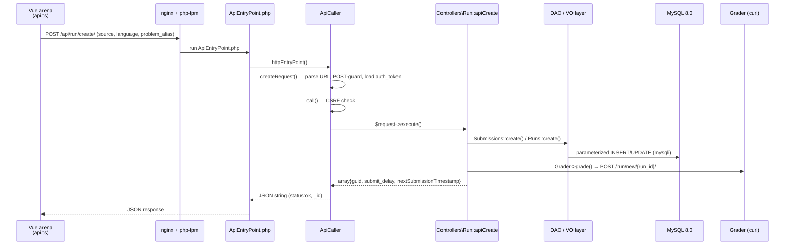

# MVC Pattern in omegaUp

omegaUp is built on the [Model-View-Controller](https://en.wikipedia.org/wiki/Model%E2%80%93view%E2%80%93controller) pattern, but the interesting part is not the three-letter acronym — it is *how* a request actually flows through the real code. The Model is an auto-generated DAO + Value Object layer that speaks `mysqli` to MySQL 8.0 and never leaks a hand-written `SELECT` into a controller; the Controller is a plain PHP 8.1 class under `\OmegaUp\Controllers` whose `apiXxx` methods return associative arrays and never echo HTML; and the View is a two-part beast — a single server-rendered Twig 3 shell that boots the page, and a Vue 2.7 single-page app that owns every pixel after that. Everything below traces one real submission — a student clicking **Submit** on a problem — end to end, naming the exact file, method, and constant at each hop, because knowing that "the controller talks to the model" teaches you nothing you can act on, whereas knowing that `\OmegaUp\Controllers\Run::apiCreate` calls `\OmegaUp\DAO\Submissions::create($submission)` inside a `TransactionHelper::executeWithRetry` closure tells you exactly where to put a breakpoint.

## The one-line mental model

The web app is a thin JSON API with a Vue front end bolted on top. Nothing renders HTML except one Twig template; every other byte the browser gets is either a `.js` bundle or a JSON blob. A controller's whole job is: authenticate, validate, mutate the model through DAOs, and hand back an array. If you internalize just that, the rest of this page is detail.

## Request pipeline: following a submission from the browser to the grader

When the student submits, the Vue arena does not POST a form to a page — it calls the generated API client, which `fetch`es `POST /api/run/create/` with the source code, language, and `problem_alias` in the body. That URL is the entire routing table: omegaUp has no route config file, because the URL path *is* the dispatch instruction.

### nginx → php-fpm → the entrypoint

Every `/api/*` request is served by nginx handing off to php-fpm, which executes exactly one four-line file, [`frontend/www/api/ApiEntryPoint.php`](https://github.com/omegaup/omegaup/blob/main/frontend/www/api/ApiEntryPoint.php). It `require_once`s [`frontend/server/bootstrap.php`](https://github.com/omegaup/omegaup/blob/main/frontend/server/bootstrap.php) (which wires up the autoloader, config, logging, and DB connection) and then does the whole job in one statement:

```php
require_once(__DIR__ . '/../../server/bootstrap.php');

echo \OmegaUp\ApiCaller::httpEntryPoint();
```

The API lives under `/api/` rather than being mixed into normal page URLs on purpose: it is the one surface that must be callable by non-browser clients (CLI tools, integration scripts, the mobile-shaped future), so it is deliberately kept free of any HTML-rendering concern. `httpEntryPoint` returns a *string of JSON*, and `ApiEntryPoint.php` just echoes it.

### ApiCaller turns a URL into a controller method

[`\OmegaUp\ApiCaller::httpEntryPoint()`](https://github.com/omegaup/omegaup/blob/main/frontend/server/src/ApiCaller.php) is where a URL becomes a method call. It calls `createRequest()`, which parses `$_SERVER['REQUEST_URI']` with `preg_split('/[\/?]/', $apiAsUrl)` — splitting on both `/` *and* `?` so that `/api/run/create/?foo=1` and `/api/run/create?foo=1` parse identically. It demands at least four segments (`['', 'api', 'run', 'create']`); anything shorter throws a `NotFoundException('apiNotFound')`, which is why a malformed API URL comes back as a clean 404 rather than a PHP fatal.

From those segments it builds the target by convention, not configuration: `$controllerName = ucfirst($args[2])` gives `Run`, the fully-qualified class is `"\\OmegaUp\\Controllers\\{$controllerName}"` → `\OmegaUp\Controllers\Run`, and the method is `"api{$methodName}"` → `apiCreate`. Note the naming law here — the class is **`Run`, not `RunController`**; omegaUp drops the `Controller` suffix everywhere (`Contest`, `Problem`, `Submission`, `Grader`…), so grepping for `RunController` will find nothing. If `class_exists` or `method_exists` fails, you get `apiNotFound` again, so a typo in the URL and a typo in a method name surface as the same 404.

Two cross-cutting guards live here, once, so no individual controller has to repeat them:

- **Mutation requires POST.** `createRequest()` runs the method name through `isMutatingMethod()`, which lowercases it and substring-matches against a list of state-changing verbs (`add`, `create`, `delete`, `login`, `rejudge`, `update`, `verify`, and ~25 more). If a `GET` hits a mutating endpoint like `create`, it throws `MethodNotAllowedException`. Because the match is by substring, genuinely read-only methods whose names happen to contain a mutating word (for example `listAssociatedIdentities` contains "associate") are rescued by an explicit `$readOnlyAllowlist` so they keep accepting `GET`.
- **Auth comes from the cookie.** `createRequest()` calls `\OmegaUp\Controllers\Session::getCurrentSession()` and, if a session `auth_token` exists, injects it into the request. Auth tokens are PASETO tokens (via `paragonie/paseto`), so the identity of the caller is established before the controller ever runs.

`httpEntryPoint` then hands the built `\OmegaUp\Request` to `ApiCaller::call()`, which is the try/catch heart of the API. Before executing anything it runs `isCSRFAttempt()`: if the request carries an HTTP `Referer`, its host must match `OMEGAUP_URL`'s host (or the lockdown domain, or an allow-listed CSRF host), and a missing or malformed referrer *fails closed* — the check errs toward rejecting rather than allowing, because a false negative here is a cross-site write. A referer-less call (an explicit API client with no browser origin) is allowed through, since it cannot be a CSRF ride on someone's cookies.

If the CSRF check passes, `call()` invokes `$request->execute()` — which finally dispatches to `\OmegaUp\Controllers\Run::apiCreate($r)` — and then normalizes the result: if the controller returned an associative array without a `status` key, it stamps `'status' => 'ok'`. Every exception is funneled into one shape. An `\OmegaUp\Exceptions\ApiException` (the base for all the domain exceptions like `NotFoundException`, `ForbiddenAccessException`, `InvalidParameterException`) is rendered via `asResponseArray()`; any *other* `\Exception` is wrapped as an `InternalServerErrorException('generalError', $e)` so an unexpected bug still returns a well-formed error envelope instead of a stack trace. There is also a deliberate escape hatch: an `ExitException` means the controller explicitly wanted to end the response (e.g. a redirect), so `call()` just `exit`s. Along the way it records the outcome to Prometheus via `\OmegaUp\Metrics::getInstance()->apiStatus($methodName, $httpCode)`, which is how the team watches per-endpoint success and error rates.

Finally `render()` serializes the array to JSON. It appends an `_id` (the request id, for correlating logs) to associative responses only — flat/list responses are left as pure arrays so their JSON type stays correct — and honors `?prettyprint=true` with `JSON_PRETTY_PRINT` for humans poking at the API in a browser. If `json_encode` chokes on invalid UTF-8 (`JSON_ERROR_UTF8` — think a submission or problem statement carrying illegal codepoints), it retries with `JSON_PARTIAL_OUTPUT_ON_ERROR` to salvage a usable response rather than 500ing the whole page, and only if *that* also fails does it fall back to a generic internal-error envelope.



## The Controller: `apiCreate` does business logic and nothing else

[`\OmegaUp\Controllers\Run::apiCreate`](https://github.com/omegaup/omegaup/blob/main/frontend/server/src/Controllers/Run.php) (around L415 of `frontend/server/src/Controllers/Run.php`) is a textbook controller: it authenticates, validates, mutates the model through DAOs, and returns an array. It never writes SQL and never emits HTML.

It opens with `$r->ensureIdentity()` — you must be logged in to submit — then `$source = $r->ensureString('source')` and a single call to `validateCreateRequest($r)`, which is where the real gatekeeping happens. In one pass that validator: confirms the requested `language` is in the intersection of the platform's `SUPPORTED_LANGUAGES()` and the problem's own allowed `languages` list (and re-intersects with the contest's and problemset's language restrictions if present, so a contest can forbid a language the problem otherwise permits); rejects `problemset_id` and `contest_alias` being set together with `incompatibleArgs`, since a run belongs to exactly one container; and enforces visibility. That last check has a deliberate security shape: a banned problem (`VISIBILITY_PUBLIC_BANNED` / `VISIBILITY_PRIVATE_BANNED`) throws `NotFoundException('problemNotFound')` — a **404, not a 403** — because the platform refuses to confirm the existence of a resource you are not allowed to see. If there is no contest and no problemset, the run is treated as *practice*, allowed only if the problem is visible to you, you are its admin, or its practice deadline has passed.

With validation done, the controller computes `submit_delay` — the penalty minutes recorded against the submission — by switching on the contest's `penalty_type`: `contest_start` measures from `contest->start_time`; `problem_open` measures from when you first opened the problem (looked up via `\OmegaUp\DAO\ProblemsetProblemOpened::getByPK`, and if you never opened it the code catches you red-handed with `NotAllowedToSubmitException('runNotEvenOpened')` — you cannot submit a problem you never opened); `none` and `runtime` don't care about a start time. The delay is then `intval((\OmegaUp\Time::get() - $start->time) / 60)`, i.e. whole minutes since the clock started, or `0` outside any contest.

Now it builds two Value Objects — a `\OmegaUp\DAO\VO\Submissions` and a `\OmegaUp\DAO\VO\Runs` — both created with `status => 'uploading'` and `verdict => 'JE'` (Judge Error), the honest "not graded yet" placeholder that will be overwritten once the grader reports back. The `guid` is `md5(uniqid(strval(rand()), true))`, the opaque handle the front end will poll on.

The two rows are persisted together inside [`\OmegaUp\TransactionHelper::executeWithRetry`](https://github.com/omegaup/omegaup/blob/main/frontend/server/src/Controllers/Run.php), which retries the closure on deadlock — submission bursts are exactly the workload that produces InnoDB deadlocks, so the write is wrapped rather than hoped-over. *Inside* the transaction, and only there, it calls `validateWithinSubmissionGap(...)`: the anti-spam rule. The gap is `Run::$defaultSubmissionGap = 60` seconds (one submission per problem per 60 seconds; admins are exempt), and it is checked inside the transaction on purpose, so two racing submissions can't both pass a check made before either has committed. Then `\OmegaUp\DAO\Submissions::create($submission)`, `\OmegaUp\DAO\Runs::create($run)`, and an `update` to link `submission.current_run_id` back to the freshly-inserted run.

Only after the rows are safely committed does the controller cross the process boundary to the judge: `\OmegaUp\Grader::getInstance()->grade($run, trim($source))` (around L573). This ordering matters and the code comments say why — the grader runs in a *separate process* and reads the run straight from MySQL, so the row must be visible there before the grader is told about it. That also means it cannot be a real DB transaction spanning the grade call, so failure handling is done by hand: if `grade()` throws, the `catch` unlinks `current_run_id`, then deletes the run and the submission (in that order, to avoid a foreign-key violation), logs the failure, and rethrows. The student sees an error instead of a phantom run stuck in `uploading` forever.

On success `apiCreate` returns a small array — `guid`, `submit_delay`, `submission_deadline`, and `nextSubmissionTimestamp` (computed from `\OmegaUp\DAO\Runs::nextSubmissionTimestamp`, so the UI knows exactly when the 60-second gate reopens). That array is what `ApiCaller::render()` turns into the JSON the browser receives.

### The Grader is a thin HTTP client, not the judge

A crucial thing to hold onto: [`\OmegaUp\Grader`](https://github.com/omegaup/omegaup/blob/main/frontend/server/src/Grader.php) in this PHP repo is **only a curl client**. The real grader, the runners, the broadcaster, and the Minijail sandbox are separate Go services that live in [github.com/omegaup/quark](https://github.com/omegaup/quark) — there is not a single line of Go, and zero references to `minijail`, `quark`, or the run queue, anywhere in the PHP monorepo. The same "the interesting part lives elsewhere" story applies to problem storage: the problems themselves — statements, settings, and the test-case `.zip`s — are not rows in MySQL, they are **git repositories** served by yet another external Go service, [github.com/omegaup/gitserver](https://github.com/omegaup/gitserver), and the controllers reach it over HTTP the same way they reach the grader. That is the `Controllers → GitServer` edge in the high-level architecture diagram: MySQL holds the relational data (users, runs, submissions, contests), gitserver holds the versioned problem content, and the `version`/`commit` columns on a `Runs` row are exactly the SHA-1 handles that tie a graded run back to the problem tree it ran against. `grade()` simply POSTs the source to `OMEGAUP_GRADER_URL . "/run/new/{$run->run_id}/"` (default `https://localhost:21680`, configured in `frontend/server/config.default.php`). Sibling methods hit the same service: `rejudge()` POSTs run ids to `/run/grade/`, `getSource()` reads `/submission/source/{guid}/`, and `status()` reads `/grader/status/` to expose the queue's health (`run_queue_length`, `runner_queue_length`, `runners`, `broadcaster_sockets`, `embedded_runner`) — which is what the `\OmegaUp\Controllers\Grader::apiStatus` endpoint surfaces. For local development there is an `OMEGAUP_GRADER_FAKE` mode where `grade()` just writes the source to `/tmp/{guid}` and returns, so you can run the front end without standing up the Go grader at all.

## The Model: an auto-generated DAO + VO data-access layer

omegaUp's Model is code-generated, and both halves carry the same warning banner in Spanish at the top — *"Este código es generado automáticamente. Si lo modificas, tus cambios serán reemplazados"* — so the golden rule is: **never hand-edit these files; change the schema and regenerate.**

The two halves split cleanly. A **Value Object (VO)** is a dumb, typed struct that maps one-to-one to a table. [`\OmegaUp\DAO\VO\Runs`](https://github.com/omegaup/omegaup/blob/main/frontend/server/src/DAO/VO/Runs.php) declares a `const FIELD_NAMES` allow-list of every column (`run_id`, `submission_id`, `version`, `commit`, `status`, `verdict`, `runtime`, `penalty`, `memory`, `score`, `contest_score`, `time`, `judged_by`) and a typed public property for each, and its constructor `array_diff_key`s the incoming data against `FIELD_NAMES` — pass a column that doesn't exist and it throws `'Unknown columns: ...'` immediately, so a typo in a field name fails loud at construction rather than silently vanishing. Each field is coerced to its declared type (`intval` for `run_id`, `floatval` for `score`, `\OmegaUp\DAO\DAO::fromMySQLTimestamp` for `time`), and the generated PHPDoc even preserves the schema's own column comments (`version` is documented as "el hash SHA1 del árbol de la rama private"), which is where a lot of the tribal knowledge about the schema actually lives.

The **DAO** is the persistence logic. The generator emits an abstract base under `frontend/server/src/DAO/Base/` holding the SQL, and a public wrapper under `frontend/server/src/DAO/` that extends it (`\OmegaUp\DAO\Runs`) — the split exists so hand-written query methods can live in the public class without ever being clobbered when the base is regenerated. [`\OmegaUp\DAO\Base\Runs`](https://github.com/omegaup/omegaup/blob/main/frontend/server/src/DAO/Base/Runs.php) is where `create`, `update`, `getByPK`, and friends live, and every one of them uses parameterized SQL — never string interpolation — executed through `mysqli`:

```php
$sql = 'UPDATE `Runs` SET `submission_id` = ?, ... `judged_by` = ? WHERE (`run_id` = ?);';
$params = [ /* one entry per ?, coerced to the right type */ ];
\OmegaUp\MySQLConnection::getInstance()->Execute($sql, $params);
return \OmegaUp\MySQLConnection::getInstance()->Affected_Rows();
```

This is why controllers are forbidden from writing SQL: the `?`-placeholder discipline that makes the platform injection-resistant lives entirely in generated DAO code, and a hand-rolled `$conn->query("... WHERE email = '$email'")` in a controller would route around it. The rule of thumb, worked out:

```php
// Good — go through the DAO, which parameterizes for you
$run = \OmegaUp\DAO\Runs::getByPK($runId);

// Bad — raw SQL in a controller: bypasses the generated safety and will be rejected in review
$run = $conn->query("SELECT * FROM Runs WHERE run_id = $runId");
```

The single database connection is `\OmegaUp\MySQLConnection`, a `mysqli`-based singleton (`\mysqli_init()`, `real_connect()`, `MYSQLI_*` options) — MySQL 8.0, reached on the dev port with the app's connection settings from config.

## The View: a Twig shell that hands the page to Vue

The View is genuinely two layers, and confusing them is the most common wrong mental model. **HHVM and Smarty are both gone** — do not look for either; the server no longer runs HipHop and there is not one Smarty template left. What remains server-side is a *single* Twig 3 template that renders the outer HTML skeleton and then gets out of the way.

That template is [`frontend/templates/template.tpl`](https://github.com/omegaup/omegaup/blob/main/frontend/templates/template.tpl) — the only application `.tpl` in the whole front end (the 20-odd other `.tpl` files in the repo are third-party vendor artifacts, PHPUnit and pandas templates, not omegaUp's). Despite the `.tpl` extension it is Twig syntax (`{{ }}`, ``), rendered by a `\Twig\Environment` assembled in [`\OmegaUp\UITools::getTwigInstance`](https://github.com/omegaup/omegaup/blob/main/frontend/server/src/UITools.php), which registers three custom token parsers whose node classes live in `frontend/server/src/Template/`:

- `` ([`EntrypointNode`](https://github.com/omegaup/omegaup/blob/main/frontend/server/src/Template/EntrypointNode.php)) emits the `<script>` tags for the current page's Webpack entry bundle.
- `` (`JsIncludeNode`) pulls in a named shared bundle (the base `omegaup` runtime, the navbar, the footer).
- `` (`VersionHashNode`) appends a content hash to a static asset URL for cache-busting, so a deploy invalidates changed files but nothing else.

The shell loads Bootstrap 4 (`third_party/bootstrap-4.5.0`), not Bootstrap 5, plus jQuery and the compiled `omegaup_styles.css`, and — critically — it injects the server's data into the page as JSON, not as rendered markup:

```twig
<script type="text/json" id="payload">{{ payload|json_encode|raw }}</script>

<div id="main-container"></div>
```

That `#payload` blob and the empty `#main-container` are the handshake between the two layers. From here, everything is Vue 2.7.16 with TypeScript 4.4 — the Smarty→Vue migration is *complete* (257 `.vue` single-file components against that one Twig shell; the only migration still in flight is Vue 2 → Vue 3). Every component lives under `frontend/www/js/omegaup/`, the overwhelming majority in `.../components/`, and state that must be shared is held in Vuex 3.

A page's TypeScript entrypoint reads the server payload and mounts a component into `#main-container`. Here is the real pattern, from [`frontend/www/js/omegaup/arena/contest_list.ts`](https://github.com/omegaup/omegaup/blob/main/frontend/www/js/omegaup/arena/contest_list.ts):

```ts
OmegaUp.on('ready', () => {
  const payload = types.payloadParsers.ContestListv2Payload();  // reads & type-checks #payload
  contestStore.commit('updateAll', payload.contests);           // seed Vuex from the server data
  new Vue({
    el: '#main-container',
    components: { 'omegaup-arena-contestlist': arena_ContestList },
    render: (h) => h('omegaup-arena-contestlist', { props: { /* ... */ } }),
  });
});
```

So the round trip is: the controller returned a `payload` array → Twig JSON-encoded it into `#payload` → the entrypoint's generated `payloadParsers` read and type-check it → Vue renders it, no round-trip needed for the initial paint. After that, the SPA talks to the server the same way the submission did — through the generated typed API client.

### The generated API client closes the loop

The bridge between the TypeScript View and the PHP Controllers is itself generated. [`frontend/www/js/omegaup/api.ts`](https://github.com/omegaup/omegaup/blob/main/frontend/www/js/omegaup/api.ts) and [`api_types.ts`](https://github.com/omegaup/omegaup/blob/main/frontend/www/js/omegaup/api_types.ts) both begin with `// generated by frontend/server/cmd/APITool.php. DO NOT EDIT.` — the same never-hand-edit discipline as the DAOs, one source of truth. `APITool.php` reads the controllers' `@omegaup-request-param` annotations and return types and emits, for each endpoint, a strongly-typed wrapper:

```ts
export const Identity = {
  create: apiCall<messages.IdentityCreateRequest, messages.IdentityCreateResponse>(
    '/api/identity/create/',
  ),
  // ...
};
```

`apiCall<Req, Res>` returns a function that `fetch`es the endpoint with `method: 'POST'`, drops `null`/`undefined` params, and resolves to the typed response — so when the arena calls the run-create endpoint, the request and response shapes are checked at compile time against the very PHP controller signature that will handle them. Change a controller's params or return type, regenerate, and any front-end call that no longer matches fails the TypeScript build instead of at runtime in a user's browser. That generation step is the reason the "V" and the "C" cannot silently drift apart.

## Why the separation is worth the ceremony

- **The Model is generated, so it is uniform and safe.** Every table gets the same VO/DAO shape, every query is parameterized `mysqli`, and the column comments travel with the code. The cost is that you edit the schema and regenerate rather than tweaking a file — which is the point.
- **The Controller returns arrays, so it has no idea who is calling.** The same `apiCreate` serves the Vue arena, a script, and anything else that can POST JSON, because it never renders a page. Testing it means asserting on an array, not scraping HTML.
- **The View is JSON-in, Vue-out.** The server ships data as a `#payload` blob and lets a typed Vue app render it, so the initial page needs no extra API round trip, and the generated `api.ts` keeps every subsequent call type-locked to the controller it targets.

## Related documentation

- **[Backend Architecture](backend.md)** — the controller, DAO, and grader-client layers in depth.
- **[Frontend Architecture](frontend.md)** — the Vue 2.7 + TypeScript + Webpack view layer.
- **[Database Schema](database-schema.md)** — the tables the VO/DAO layer is generated from.
