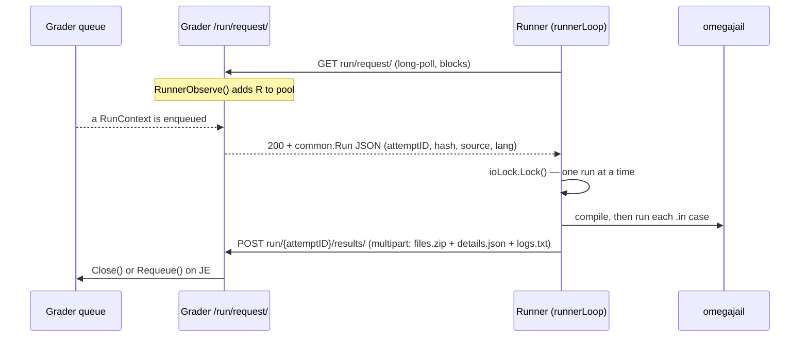

# Runner Internals

The Runner is the service that actually compiles and runs the code a contestant submits, feeds it every `.in` case, and decides whether the output is right. It is one of the Go services that live in [`github.com/omegaup/quark`](https://github.com/omegaup/quark) — the same repo as the Grader and the Broadcaster — and it is *not* part of the PHP monorepo. The PHP side (`\OmegaUp\Grader` in [`frontend/server/src/Grader.php`](https://github.com/omegaup/omegaup/blob/main/frontend/server/src/Grader.php)) only ever hands a submission to the Grader over HTTP; from there on, everything on this page happens inside quark. If you keep one mental model in your head, keep this one: the Runner **knows how to compile, execute, and pipe the input to the programs the user submits, and how to check whether they are right or not. It is basically a pretty distributed frontend for [omegajail](https://github.com/omegaup/omegajail)** (omegaUp's minijail-based sandbox). Everything below is that sentence, unpacked.

## The Runner as a service: it dials the Grader, not the other way around

The first thing to unlearn from any diagram that draws an arrow labeled "Grader → Runner" is the direction. A Runner is a client. When it boots ([`cmd/omegaup-runner/main.go`](https://github.com/omegaup/quark/blob/main/cmd/omegaup-runner/main.go)), it does *not* open a port and wait to be called; it starts a goroutine `runnerLoop` ([`cmd/omegaup-runner/service.go`](https://github.com/omegaup/quark/blob/main/cmd/omegaup-runner/service.go)) that spends its whole life long-polling the Grader. Each iteration issues a plain `GET run/request/` against `Config.Runner.GraderURL` (default `https://omegaup.com:11302`), carrying two headers that identify it: `OmegaUp-Runner-Name` (its hostname) and `OmegaUp-Runner-PublicIP` — the latter discovered at startup by calling `https://ifconfig.me/ip`, because the Grader needs a routable address to scrape the Runner's Prometheus metrics on port `:6060`.

That poll *is* the registration. On the Grader side, the `/run/request/` handler ([`cmd/omegaup-grader/runner_handler.go`](https://github.com/omegaup/quark/blob/main/cmd/omegaup-grader/runner_handler.go)) does two things with an incoming poll: it calls `m.RunnerObserve(runnerName, remoteAddr+":6060")` to add the caller to the live pool of known runners, and then it calls `runs.GetRun(runnerName, ctx.InflightMonitor, …)`, which **blocks until there is actually a run to hand out**. So a fresh Runner appears in the pool the moment it asks for work, and it stays parked inside a single HTTP request until the Grader has something for it. There is no separate "hello, I exist" call to get out of sync with reality.



### Round-robin dispatch across the pool

Dispatch is not clever, and that is deliberate. Every Runner in the pool is blocked inside its own `GetRun` call on the same shared `default` queue (`DefaultQueueName`, [`grader/queue.go`](https://github.com/omegaup/quark/blob/main/grader/queue.go)). When a submission lands, exactly one of those parked goroutines wakes up, receives the run, and returns it to its Runner as a `common.Run` JSON body. Whichever Runner happens to be waiting gets the next run — effectively round-robin across the idle pool, with no stickiness. There is **no affinity** between a Runner and the problems it has already cached; there was affinity at some point in the past, and it would not be complicated to add it back, but today a Runner may be handed a submission for a problem it has never seen (in which case it fetches the input set, see below).

The queue itself is priority-ordered rather than a single FIFO: `GetRun` scans the `QueueCount = 4` priority bands left to right — `QueuePriorityHigh` (0), `QueuePriorityNormal` (1), `QueuePriorityLow` (2), and `QueuePriorityEphemeral` (3, used for the ephemeral/"try it now" grader) — and returns the first run it finds, so a high-priority rejudge never waits behind a backlog of normal submissions.

Once a run is handed out, it is tracked by the `InflightMonitor`. This is the safety net for a Runner that picks up work and then dies mid-grade: the monitor arms a `connectTimeout` and a `readyTimeout`, both currently `10 * time.Minute`. If the Runner does not connect back or does not finish within those windows, the run is presumed abandoned and requeued. Requeuing is also how transient failures recover — the results handler at `/run/{attemptID}/results/` requeues on a `JE` (Judge Error) verdict, and a run only gets `Config.Grader.MaxGradeRetries` (currently `3`) attempts before it is given up. The whole `/run/` handler is itself wrapped in a `http.TimeoutHandler(…, 5*time.Minute, "Request timed out")`, so a single stuck upload cannot pin a Grader goroutine forever.

### The per-run mutex: one run at a time, no I/O overlap

A single Runner process grades exactly **one submission at a time**. This is enforced by a process-global `sync.Mutex` called `ioLock` ([`cmd/omegaup-runner/service.go`](https://github.com/omegaup/quark/blob/main/cmd/omegaup-runner/service.go)). The moment `gradeRun` begins, it does `ioLock.Lock()` with the comment *"Make sure no other I/O is being made while we grade this run."* The reason is measurement fidelity, not thread-safety: the Runner also runs a `benchmarkLoop` in the background (every minute, unless the no-op sandbox is in use) to report how fast this host currently is, and the CPU-time and wall-time numbers a grade produces are only trustworthy if nothing else on the box is competing for I/O and cycles while the sandboxed program runs. Concurrency across the fleet comes from running *many* Runner processes/hosts, not from parallelism inside one. To scale, add Runners.

## What arrives: the `common.Run` and its input set

The JSON that comes back from `run/request/` is a `common.Run`: an `AttemptID`, the `Language`, the `Source`, a `MaxScore`, the `ProblemName`, and — crucially — an `InputHash`. That hash is the **SHA-1 of the problem's input `.zip`, a 40-hex-character string** like `d41d8cd98f00b204e9800998ecf8427e…`; the Grader's `/input/` route even validates it with the regex `[a-f0-9]{40}`. The Runner never trusts that it has the cases; it asks its `InputManager` for that hash via `runner.NewInputFactory(...)`, and only if the local cache misses does it stream the input set down from the Grader.

That download is compressed on the wire and on disk. `persistFromTarStream` ([`runner/input.go`](https://github.com/omegaup/quark/blob/main/runner/input.go)) accepts a tar stream in one of three shapes — `gzip`, `bzip2`, or uncompressed — decompresses it through a `common.NewHashReader(r, sha1.New())`, and refuses the whole thing if the recomputed SHA-1 does not match the expected `streamHash` (`"hash mismatch: expected %s got %s"`). As it unpacks, it writes a companion `.sha1` manifest so each individual case file can be integrity-checked later. Historically the Grader shipped these sets as bzip2 tarballs, which is why `compress/bzip2` is still wired in; the Grader's own `/input/` transmitter currently serves them `Content-Type: application/x-gzip`. Either way, once the set is local, the same hash makes it reusable for every future submission to that problem, so the expensive fetch happens once per Runner per problem version.

If the Runner is asked to grade against an input set it does not have and cannot fetch, it does not guess — it returns an error so the Grader knows to (re)send the set. This is the same "assume the Runner has it, recover if it doesn't" contract the old Runner API documented for its `/run/` call, preserved intact.

## Compilation: the `Main` convention and flags through omegajail

Grading begins in `runner.Grade` ([`runner/runner.go`](https://github.com/omegaup/quark/blob/main/runner/runner.go)), and the very first thing it checks is `sandbox.Supported()` — if omegajail is not installed (no `bin/omegajail` under `OmegajailRoot`, default `/var/lib/omegajail`), the whole run comes back `JE` immediately, because there is no safe way to run untrusted code. Assuming the sandbox is present, `Grade` lays out a run directory at `RuntimePath/grade/{AttemptID}` and, unless `PreserveFiles` is set, `defer os.RemoveAll(runRoot)` guarantees every temporary artifact — source, binary, outputs, metadata — is deleted the instant grading returns, win or lose.

The submitted code is written to a fixed, name-independent location: `runRoot/Main/bin/Main.<ext>` (e.g. `Main.cpp`, `Main.py`, `Main.java`), and the compile target is literally the string `Main`. This is the **Main convention**, and it exists to make the sandbox's life simple: nothing is allowed to depend on the *user's* choice of filename. In Java specifically this is why your class must be `Main` and outside any package — if omegajail compiles cleanly but no `Main.class` is produced, the Runner rewrites the verdict to `CE` with the message *"Class \`Main\` not found. Make sure your class is named \`Main\` and outside all packages."* Interactive problems and custom validators follow the same shape, each getting its own `bin/` subtree, but the contestant's program is always `Main`.

Compilation is itself sandboxed. `OmegajailSandbox.Compile` ([`runner/sandbox.go`](https://github.com/omegaup/quark/blob/main/runner/sandbox.go)) does not shell out to `g++` directly — it builds an argument vector for the `omegajail` binary and lets minijail wrap the compiler. The invocation looks like:

```
omegajail
  --homedir <binPath> --homedir-writable
  -1 compile.out   # compiler stdout
  -2 compile.err   # compiler stderr
  -M compile.meta  # time/memory/exit metadata
  -t 30000         # CompileTimeLimit: 30s, in ms
  -O 10485760      # CompileOutputLimit: 10 MiB, in bytes
  --root /var/lib/omegajail
  --compile <lang> --compile-target Main
  --compile-source Main.<ext>
  [ -- <extraFlags> ]
```

The language-specific flags live *inside* omegajail's profiles keyed by `<lang>`, which is how one `--compile cpp17` differs from `--compile c11`; the Runner only appends `extraFlags` after a `--` separator for the cases it needs to influence directly. The sharpest example is **debug/AddressSanitizer runs**: when `run.Debug` is set on a C/C++ submission, the Runner appends `-static-libasan -fsanitize=address` (static because the ASan dynamic library is not shipped in the sandbox), then *because ASan eats memory and time* it disables the memory limit (`MemoryLimit = -1`), doubles the time limit and adds a second (`TimeLimit*2 + 1s`), and bumps the output limit by 16 KiB so the sanitizer's report can actually be emitted. That is the WHY-with-every-WHAT rule made literal: each flag change is paired with the resource consequence that forces it.

If compilation fails — a non-`OK` verdict from `compile.meta` — `Grade` sets the run verdict to `CE`, reads back the compiler's own error text (from `compile.err`, except for Pascal/Lazarus and C#/dotnet which write it to `compile.out`), prefixes it with the binary name, and returns it as `CompileError`. The temp tree is still cleaned by the deferred `RemoveAll`. The contestant sees the real compiler diagnostics, not a generic "compilation error."

### Supported languages

The languages omegajail knows how to compile and run, as they appear in the profiles and the Grade path:

| Language | Notes |
|----------|-------|
| C / C++ (`c`, `cpp`, `cpp11`, `cpp17`, `cpp20`) | GCC toolchain; `cpp` is auto-upgraded to `cpp11` for validators and interactive parents so problemsetters aren't forced onto old standards |
| Java (`java`) | Class must be `Main`, outside all packages; run gets an extra `1000ms` because JVM startup is slow |
| Python (`py`, `py2`, `py3`) | The `_entry` target-name suffix applies to interpreted languages |
| Ruby (`rb`), Pascal (`pas`), C# (`cs`), Lua (`lua`), Haskell (`hs`) | C# needs a `Main.runtimeconfig.json` symlinked next to the target before compiling |
| Karel (`kj`, `kp`) | Exit status `1` (the `INSTRUCTION` failure mode) is mapped to `TLE` |
| `cat` | Output-only "problems" where the "source" is a data URL of `.out` files; no compilation, the files are unpacked and checked directly |

## Execution: feeding every `.in` case through the sandbox

With binaries compiled, `Grade` walks the problem's groups and cases in order. For each case it runs the contestant binary against `input.Path()/cases/<name>.in`, capturing stdout to `<name>.out`, stderr to `<name>.err`, and sandbox metadata to `<name>.meta`. The per-case call is `OmegajailSandbox.Run`, and its omegajail argument vector is where the actual resource limits bite:

```
omegajail
  -0 <name>.in     # stdin = the test case input
  -1 <name>.out    # stdout capture
  -2 <name>.err    # stderr capture
  -M <name>.meta   # metadata
  -m <hardLimit>   # min(HardMemoryLimit=640MiB, problem MemoryLimit), in bytes
  -t <timeLimit>   # problem time limit (+1000ms for java), in ms
  -w <extraWallTime>
  -O <outputLimit> # problem output limit, in bytes
  --root /var/lib/omegajail
  --run <lang> --run-target Main
```

Two small realities worth knowing. First, the memory ceiling handed to the kernel is `min(HardMemoryLimit, problem.MemoryLimit)` — a global `640 MiB` cap the code comments cheerfully justify as *"640MB should be enough for anybody"* — so a problem can ask for less but never for more than the host is willing to give. Second, the Runner never passes the *real* `/dev/null` into the jail; when a binary should receive no input it is handed `omegajailRoot/root/dev/null` instead, an ordinary empty file inside the chroot, because the real device node isn't reachable from inside the namespace.

Before each execution the Runner warms the page cache with an `inputPreloader` ([`runner/sandbox.go`](https://github.com/omegaup/quark/blob/main/runner/sandbox.go)): it `mmap`s the `.in` file `PROT_READ`/`MAP_SHARED` and touches one byte per page (falling back to a plain full read if `mmap` fails), so the contestant's program spends its measured time computing, not blocking on disk. Interactive problems get more machinery — `libinteractive` sets up named FIFOs (`syscall.Mkfifo`) between a problemsetter "Main" parent and the contestant child, both jailed, and a `mergeVerdict` step decides fault when one side dies (a `SIGPIPE` or one of exit statuses 239–242 means the *peer* misbehaved, which becomes `VE`, the validator's fault, so the problemsetter gets told to fix it rather than the contestant being penalized).

### The sandbox itself: from ptrace syscall-mangling to seccomp SIGSYS

omegajail descends from a long line of competitive-programming sandboxes. The lineage matters because the *technique* changed. The original omegaUp Sandbox was a heavily modified fork of **Moeval, the sandbox used at the IOI, written by Martin Mareš**, and it isolated programs with `ptrace`: it would intercept a forbidden syscall and **replace it with something harmless — for example, swap `setrlimit` for `getuid`, which is utterly inert — and then make the process believe the original call had failed. That is exactly how the absence of a network was faked: every call to `socket` was made to return `-1`, so a program trying to phone home simply saw errors everywhere and gave up.** It worked, but ptrace is slow and fiddly.

The modern omegajail replaces that with the kernel doing the work. It is built on **minijail**, Google's Chrome OS process-isolation tool (the `Dockerfile.minijail` in quark literally `ADD`s the `minijail-xenial-distrib` tarball), and it stacks PID/network/mount namespaces, a chroot, rlimits, and — the heart of it — a **seccomp-BPF** syscall filter. Instead of quietly mangling a bad syscall, the filter has the kernel raise `SIGSYS` the instant the program makes a call outside the allowed set. The Runner reads that back out of the `.meta` file and turns it into the `RFE` verdict (*Restricted Function Error*). This is why network isolation "just works" now: there is no `socket` to fake because the syscall is fatal at the kernel boundary. On older pre-5.13 kernels omegajail can fall back to an older SIGSYS detector via `--allow-sigsys-fallback`, and there is a `--disable-sandboxing` mode used only when running inside Docker for CI, where bind-mounts are swapped for symlinks.

### From `.meta` to a verdict

The bridge between "the program stopped" and "the verdict is X" is `parseMetaFile` ([`runner/sandbox.go`](https://github.com/omegaup/quark/blob/main/runner/sandbox.go)), which reads the key:value lines omegajail writes (`status`, `time`, `time-wall`, `mem`, `signal`, `syscall`, …) and maps the terminating signal to a verdict:

| Signal from omegajail | Verdict | Meaning |
|-----------------------|---------|---------|
| `SIGSYS` | `RFE` | Program made a forbidden syscall — the seccomp filter killed it |
| `SIGALRM`, `SIGXCPU` | `TLE` | Ran out of CPU/wall time |
| `SIGXFSZ` | `OLE` | Wrote more than the output limit |
| `SIGSEGV`, `SIGABRT`, `SIGFPE`, `SIGKILL`, `SIGILL`, `SIGBUS`, `SIGPIPE` | `RTE` | Runtime error / crash |
| none, exit status `0` | `OK` | Clean exit (pending output check) |
| none, non-zero exit | `RTE` | Non-zero exit (except `c`, where a non-zero exit is tolerated) |

There is a memory post-check on top of the signal: if measured `mem` exceeds the problem's `MemoryLimit` — or, for Java, if the exit was non-zero *and* the stderr contains `java.lang.OutOfMemoryError` — the verdict is rewritten to `MLE`. Verdicts are combined across cases with `worseVerdict`, which indexes into a single canonical order from worst to best: **`JE, CE, RFE, VE, MLE, RTE, TLE, OLE, WA, PA, AC, OK`**. A group is only as good as its worst case, and the whole run is only as good as its worst group.

## Output validation: comparing what the program printed to what was expected

A verdict of `OK` from execution means the program *ran*; it does not mean it was *right*. Correctness is decided in the validate phase, which for every `OK` case compares the contestant's `<name>.out` against the expected `cases/<name>.out` using one of five validator types (`common.ValidatorName`, [`common/problemsettings.go`](https://github.com/omegaup/quark/blob/main/common/problemsettings.go)):

- **`token`** — split both outputs into whitespace-separated tokens and require exact, case-sensitive equality token for token. This is the workhorse default.
- **`token-caseless`** — same, but compared with `strings.EqualFold`, so `YES` and `yes` match.
- **`token-numeric`** — tokenize on numeric characters only and compare each pair of numbers within a tolerance (default tolerance if the problem doesn't set one), using a relative-or-absolute epsilon so floating-point answers aren't rejected for the last bit.
- **`literal`** — don't compare at all; parse the contestant's output as a single number in `[0.0, 1.0]` and *use it as the score*. Mostly for interactive problems where the interactor prints the score.
- **`custom`** — run the problemsetter's own validator program (compiled as its own sandboxed binary) with the contestant output, the original `data.in`, the expected `data.out`, and the run metadata bind-mounted in; it prints a number in `[0.0, 1.0]` that becomes the score.

The token comparison lives in `CalculateScore` and `Tokenizer` ([`runner/validator.go`](https://github.com/omegaup/quark/blob/main/runner/validator.go), [`runner/tokenizer.go`](https://github.com/omegaup/quark/blob/main/runner/tokenizer.go)). The tokenizer is deliberately careful about what counts as whitespace: it treats not just Unicode spaces as separators but also the four Java-whitespace-but-not-Unicode-whitespace control characters `U+001C`–`U+001F` (FILE/GROUP/RECORD/UNIT SEPARATOR), so a Java `Scanner` and the judge agree on token boundaries. A single token is capped at `MaxTokenLength = 4 MiB`; anything longer is treated as EOF. Mismatches carry line and column information back for diagnostics.

The custom-validator path has its own failure handling woven in. If the validator itself doesn't exit cleanly, the Runner assumes an empty contestant output (`/dev/null`) rather than crediting a broken validator. And there is a nice touch for negative test cases: if a case fails to score full marks and the problem ships a `<name>.expected-failure` file, the Runner checks that the validator's stderr *contains* that expected string — if it doesn't, the case is marked `VE` (validator error), because the validator failed in a way the problemsetter didn't anticipate.

Scoring is exact rational arithmetic (`math/big.Rat`, never float) so that partial credit sums correctly. Case weights are normalized so that the sum of all weights equals `1` (or `1/number-of-cases` if the weights are unset/non-positive), each case's score is `MaxScore × weight × runScore`, and a group under the `min` score policy takes its worst case's fraction rather than the sum. A group only contributes score if *every* case in it is correct; one `WA` case zeroes the group.

## Sending results back

When grading finishes, the Runner does not return a tidy JSON blob over the request it was serving — it *uploads* to a second endpoint, `POST run/{AttemptID}/results/`, as a `multipart` body streamed while grading is still in flight. Three kinds of part go up: the artifact bundle `files.zip` (a Zip of every `compile.out/err/meta`, every `<case>.out/err/meta`, and every validator output — this is where the raw run outputs and metadata are compressed for storage), a `details.json` with the structured `RunResult` (verdict, score, per-group/per-case breakdown, time, wall time, peak memory), and an uncompressed `logs.txt`.

Because a slow compile or a long-running case could leave the connection silent long enough to trip a `60s` idle timeout, the upload writer (`filesZipWriter`, [`cmd/omegaup-runner/service.go`](https://github.com/omegaup/quark/blob/main/cmd/omegaup-runner/service.go)) emits an empty `.keepalive` part every `15 seconds` until the first real byte of `files.zip` is ready. The Grader's results handler ignores `.keepalive` parts, decodes `details.json` into the run, stamps `JudgedBy` with the Runner's name, and either `Close()`s the run (finished) or `Requeue()`s it (on `JE`, up to `MaxGradeRetries`). Once the response is sent, the Runner's deferred `RemoveAll` wipes `runRoot`, and its `runnerLoop` immediately goes back to `GET run/request/` to ask for the next one.

## Configuration

Runner behavior is driven by the `Runner` block of its config file (defaults in [`common/context.go`](https://github.com/omegaup/quark/blob/main/common/context.go)); the load-bearing keys, with their current defaults:

| Key | Default | Purpose |
|-----|---------|---------|
| `GraderURL` | `https://omegaup.com:11302` | Where `runnerLoop` polls for work and fetches input sets |
| `RuntimePath` | `/var/lib/omegaup/runner` | Root for `input/` cache and `grade/{AttemptID}` scratch dirs |
| `OmegajailRoot` | `/var/lib/omegajail` | Where `bin/omegajail` and the chroot `root/` live |
| `CompileTimeLimit` | `30s` | Hard wall on compilation |
| `CompileOutputLimit` | `10 MiB` | Cap on compiler output |
| `HardMemoryLimit` | `640 MiB` | Absolute ceiling; a problem can ask for less, never more |
| `OverallOutputLimit` | `100 MiB` | Total output across all cases before the rest are short-circuited to `OLE` |
| `PreserveFiles` | `false` | Keep `runRoot` for debugging instead of deleting it |

Two flags are worth knowing for local work: `-insecure` drops the mutual-TLS client-certificate auth the Runner normally uses to talk to the Grader (`tls.RequireAndVerifyClientCert`), and `-noop-sandbox` swaps in the `NoopSandbox` ([`runner/noop_sandbox.go`](https://github.com/omegaup/quark/blob/main/runner/noop_sandbox.go)), which compiles nothing and grades everything `AC` — handy for exercising the queue and dispatch plumbing on a machine that doesn't have omegajail installed. There is also a `-oneshot=run` mode that grades a single problem checkout from the command line without ever touching the Grader, which is the fastest way to reproduce a grading bug in isolation.

## Related Documentation

- **[Grader Internals](grader-internals.md)** — the queue, priorities, and how a submission gets dispatched here
- **[Sandbox Feature](../features/sandbox.md)** — omegajail/minijail overview
- **[Verdicts](../features/verdicts.md)** — the full verdict enum and what each one means
