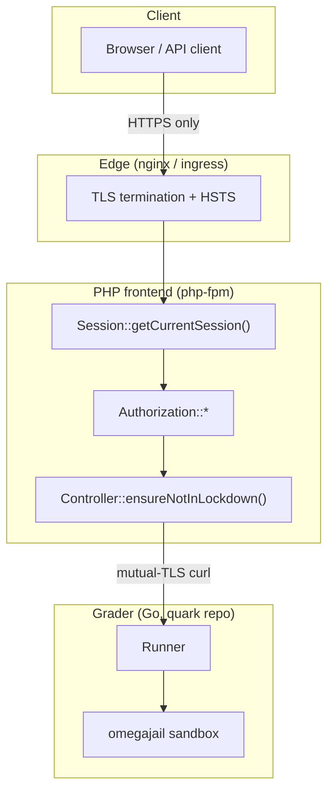

# Security Architecture

omegaUp is, at its heart, a place where strangers upload code and we run it on our
machines, during contests where the incentive to cheat is real. That single fact
shapes almost every security decision on this page: we assume the network is being
sniffed, we assume the submission is hostile, and we assume that at least one person
in every big contest is trying to see somebody else's traffic. (This is not
paranoia — at one programming contest someone actually sat down and sniffed the LAN,
and with tools like Firesheep making session hijacking a point-and-click affair, the
cheap defense is to encrypt everything and trust nothing that came over the wire.)

This page walks the request from the browser inward: TLS at the edge, the `ouat`
session cookie and how it is minted, API tokens and OAuth for the programmatic and
third-party paths, how passwords are stored, what "lockdown" does during an onsite
contest, and finally the omegajail sandbox that keeps a contestant's `system("rm -rf /")`
from ever reaching a real filesystem. The sandbox lives in a **separate Go repo**
([omegaup/quark](https://github.com/omegaup/quark)), not in this PHP monorepo, and the
distinction matters — the frontend never touches minijail; it only speaks HTTP to the
grader, which owns the sandbox.



## Everything travels over HTTPS

The whole platform is HTTPS-only, and the reason is the contest-cheating threat model
above: if any request could go out in plaintext, a session token or a problem statement
could be read off the wire. TLS is terminated at the edge (nginx / the k8s ingress),
and the app is written so that a token literally cannot be sent over an unencrypted
connection. That guarantee is enforced concretely in
[`SessionManager::setCookie`](https://github.com/omegaup/omegaup/blob/main/frontend/server/src/SessionManager.php):
the cookie's `secure` flag is set to `!empty(\OmegaUp\Request::getServerVar('HTTPS'))`,
so the `ouat` session cookie is only ever emitted with the `Secure` attribute when the
request arrived over TLS — a browser will then refuse to send it back over plain HTTP.
The same call marks every session cookie `httponly => true` (JavaScript can't read it,
which blunts XSS-based token theft) and `samesite => 'Lax'` (it won't ride along on a
cross-site POST, which is the CSRF defense for the cookie itself).

The frontend's own configured origin, `OMEGAUP_URL`, is an `https://` URL in
production, and the grader link `OMEGAUP_GRADER_URL` defaults to
`https://localhost:21680` — even the internal backend hop is TLS. That internal hop is
not just encrypted but **mutually authenticated**: in
[`Grader.php`](https://github.com/omegaup/omegaup/blob/main/frontend/server/src/Grader.php)
the curl handle is pinned with a client key and certificate
(`CURLOPT_SSLKEY => '/etc/omegaup/frontend/key.pem'`,
`CURLOPT_SSLCERT => '/etc/omegaup/frontend/certificate.pem'`), verifies the peer
(`CURLOPT_SSL_VERIFYPEER => true`, `CURLOPT_SSL_VERIFYHOST => 2`) against
`/etc/omegaup/frontend/certificate.pem` as its CA, and forces
`CURLOPT_SSLVERSION => CURL_SSLVERSION_TLSv1_2`. So the grader will only accept runs
from a frontend holding the right certificate, and the frontend will only submit to a
grader presenting a certificate it trusts — neither end talks to a stranger.

### Content-Security-Policy and framing

Before any controller runs,
[`bootstrap.php`](https://github.com/omegaup/omegaup/blob/main/frontend/server/bootstrap.php)
emits a `Content-Security-Policy` header assembled from an explicit allowlist
(`connect-src`, `img-src`, `script-src`, `frame-src`) plus a `report-uri` of
`/cspreport.php`, and follows it with `X-Frame-Options: DENY`. The `img-src` list is
deliberately permissive (`*`) with a comment explaining why — problem statements can
embed images from anywhere on the internet, so we can't lock image origins down without
breaking legitimate problems — but `script-src` is tight, enumerating exactly the
handful of third parties we load JS from (Google/analytics, Facebook, Twitter,
New Relic's agent). Violations POST themselves back to `/cspreport.php`, so a novel
injection attempt shows up in our logs rather than silently executing.

## The `ouat` session cookie

When a human logs in through a browser, their session is carried by a cookie named
`ouat` — short for **omegaUp Auth Token**, defined as
`OMEGAUP_AUTH_TOKEN_COOKIE_NAME` in
[`config.default.php`](https://github.com/omegaup/omegaup/blob/main/frontend/server/config.default.php)
(line 9). The value in that cookie is **not** a JWT or a PASETO token — it's an opaque,
database-backed handle. Minting it is the job of `Session::registerSession()` in
[`Session.php`](https://github.com/omegaup/omegaup/blob/main/frontend/server/src/Controllers/Session.php),
and it's worth reading in execution order because every step is a security decision.

First it writes an `IdentityLoginLog` row recording the identity id and the client IP
(`ip2long(REMOTE_ADDR)`), so there is an audit trail of who logged in from where.
Then — and this is the anti-cheat move — it calls
`\OmegaUp\DAO\AuthTokens::expireAuthTokens($identity->identity_id)`, which in the
[AuthTokens DAO](https://github.com/omegaup/omegaup/blob/main/frontend/server/src/DAO/AuthTokens.php)
is a flat `DELETE FROM Auth_Tokens WHERE identity_id = ?`. In other words, **logging in
destroys every previous session for that identity**. This gives omegaUp an effectively
single-active-session model: a contestant can't quietly hand their credentials to a
teammate and both stay logged in, because the second login silently logs the first one
out. It is a deliberately blunt instrument, and it is the reason a user who logs in on
their phone finds themselves logged out on their laptop.

Only then is the new token built:

```php
// Session::registerSession(), Session.php
$entropy = bin2hex(random_bytes(self::AUTH_TOKEN_ENTROPY_SIZE)); // 15 bytes -> 30 hex chars
$hash = hash(
    'sha256',
    OMEGAUP_MD5_SALT . $identity->identity_id . $entropy
);
$token = "{$entropy}-{$identity->identity_id}-{$hash}";
```

So the cookie value has three dash-separated parts — `{entropy}-{identity_id}-{hash}`:

- **entropy** — `AUTH_TOKEN_ENTROPY_SIZE` (currently 15) random bytes from
  `random_bytes()`, hex-encoded to 30 characters. This is the unguessable part.
- **identity_id** — the numeric identity the token belongs to, carried in the clear so
  the row can be found and so multi-identity users (a "login identity" acting as an
  "acting identity") can be resolved.
- **hash** — `sha256(OMEGAUP_MD5_SALT + identity_id + entropy)`, which binds the entropy
  and identity together under a server-side salt so a token can't be assembled by anyone
  who doesn't know the salt.

The token is then persisted with `AuthTokens::replace(...)` and handed to
`SessionManager::setCookie(OMEGAUP_AUTH_TOKEN_COOKIE_NAME, $token, 0, '/')` — expiry `0`
means a session cookie that dies when the browser closes, `Secure`/`HttpOnly`/`SameSite=Lax`
as described above.

```mermaid
sequenceDiagram
    participant U as Browser
    participant S as Session::nativeLogin
    participant D as MySQL (Auth_Tokens)
    U->>S: usernameOrEmail + password
    S->>S: testPassword (Argon2id verify)
    S->>D: expireAuthTokens(identity_id)  %% kill old sessions
    S->>D: replace(new token row)
    S-->>U: Set-Cookie: ouat={entropy}-{id}-{sha256}; Secure; HttpOnly; SameSite=Lax
```

### How a token becomes a session on every request

On each API call, `Session::getCurrentSession()` pulls the token — from the
`auth_token` request parameter if present, otherwise from the `ouat` cookie via
`getAuthToken()` — and resolves it with
`\OmegaUp\DAO\AuthTokens::getIdentityByToken($authToken)`. That query is more subtle
than a plain lookup: it joins `Auth_Tokens` to `Identities` on
`i.identity_id IN (aut.identity_id, aut.acting_identity_id)`, which is how omegaUp
supports one login acting as another identity (a coach's account operating a team
identity, for example) — the row carries both the **login identity** and the **acting
identity**, and `ORDER BY is_main_identity DESC` sorts them so the caller can tell which
is which. If the token doesn't resolve, the session comes back with `valid => false`,
`identity => null`, and the classname `user-rank-unranked`; the user is simply treated
as anonymous rather than being handed an error. Logging out
(`Session::unregisterSession()`) deletes the token row and overwrites the cookie with
`setcookie(OMEGAUP_AUTH_TOKEN_COOKIE_NAME, 'deleted', 1, '/')`.

## API tokens for programmatic access

Humans get the `ouat` cookie; scripts and bots get **API tokens**, which arrive in an
`Authorization` header rather than a cookie so they never depend on browser state.
`SessionManager::getTokenAuthorization()` looks for the `token ` prefix and strips it,
and `Session::getAPIToken()` accepts two shapes:

```
Authorization: token {api_token}
Authorization: token Credential={api_token},Username={identity}
```

The second form exists because a user with several associated identities needs to say
*which* identity the token should act as; without a `Username`, the token maps to its
single owning identity. Any malformed pair (something that isn't `key=value`, or a
`Credential`/`Username` that's missing) throws `UnauthorizedException` immediately —
there's no partial-credit parsing of an auth header.

API tokens are rate-limited, and unlike the browser session this limit is enforced in
the PHP layer on every request. `getCurrentSession()` calls
`\OmegaUp\DAO\APITokens::updateUsage(...)`, then stamps the response with three headers
so a well-behaved client can back off before it gets blocked:

| Header | Meaning |
|--------|---------|
| `X-RateLimit-Limit` | the ceiling — `OMEGAUP_SESSION_API_HOURLY_LIMIT`, currently **1000 requests/hour** |
| `X-RateLimit-Remaining` | how many calls are left in the current window |
| `X-RateLimit-Reset` | the timestamp when the window resets |

When `remaining` hits `0`, omegaUp additionally sets a `Retry-After` header (the seconds
until reset) and throws `RateLimitExceededException` — so the client is told not just
that it was throttled but exactly how long to wait. Sessions are cached under
`Cache::SESSION_PREFIX` keyed by the token, so resolving a token doesn't hit MySQL on
every single call.

## OAuth2 and third-party login

Not everyone registers with a password. omegaUp federates login to Google, Facebook, and
GitHub, and all three funnel into the same private helper,
`Session::thirdPartyLogin($provider, $email, $name)`: it looks the email up with
`Identities::findByEmail()`, and if nobody matches it creates a brand-new user on the
spot (`User::createUser(..., ignorePassword: true, forceVerification: true)` — no
password, and pre-verified because the identity provider already vouched for the email),
then calls the very same `registerSession()` that native login uses. So no matter how
you authenticate, you leave with an ordinary `ouat` cookie.

The Facebook and GitHub flows use the standard **league/oauth2-client** library, wrapped
in two tiny RAII classes at the top of `Session.php`:

- **Facebook** — `ScopedFacebook` constructs a
  `\League\OAuth2\Client\Provider\Facebook` with `OMEGAUP_FB_APPID` / `OMEGAUP_FB_SECRET`,
  `graphApiVersion 'v2.5'`, a redirect back to `OMEGAUP_URL . '/login?fb'`, and requests
  only the `email` scope. `loginViaFacebook()` exchanges the `?code` for an access token,
  fetches the resource owner, and refuses to proceed if the profile has no email
  (`loginFacebookEmptyEmailError`) — an account with no email can't be reconciled with an
  omegaUp identity.
- **GitHub** — `ScopedGitHub` builds a `\League\OAuth2\Client\Provider\Github` with
  `OMEGAUP_GITHUB_CLIENT_ID` / `OMEGAUP_GITHUB_CLIENT_SECRET` and a redirect of
  `OMEGAUP_URL . '/login?third_party_login=github'`. `loginViaGithub($code, $state, ...)`
  first checks CSRF: it compares the `state` returned by GitHub against the value stashed
  in the `github_oauth_state` cookie and throws `loginGitHubInvalidCSRFToken` on a
  mismatch — this is the standard OAuth `state` defense against a forged callback. It then
  exchanges the code, reads the profile, and pulls the user's **verified, primary** email
  from `https://api.github.com/user/emails` (a GitHub account can have several emails; only
  a `verified && primary` one is trusted).

Google is handled slightly differently because it uses Google Identity Services rather
than a redirect code exchange. `loginViaGoogle($idToken, $gCsrfToken, ...)` implements
Google's **double-submit-cookie** CSRF check by hand: it reads the `g_csrf_token` cookie
and requires the posted `gCsrfToken` to match it exactly (logging and rejecting with
`loginGoogleInvalidCSRFToken` otherwise), then verifies the ID token server-side with
`(new \Google_Client(['client_id' => OMEGAUP_GOOGLE_CLIENTID]))->verifyIdToken($idToken)`.
Only after Google's own signature check passes do we trust the `email` in the payload and
hand it to `thirdPartyLogin('Google', ...)`.

> GitHub OAuth is optional in production but commonly configured for **local dev**. Set
> `OMEGAUP_GITHUB_CLIENT_ID` / `OMEGAUP_GITHUB_CLIENT_SECRET` in
> `frontend/server/config.php` — see the GitHub OAuth section in
> [Development setup](../getting-started/development-setup.md).

## Password storage

Passwords that *are* stored belong to native accounts, and they're hashed with
**Argon2id**, the memory-hard winner of the Password Hashing Competition, in
[`SecurityTools.php`](https://github.com/omegaup/omegaup/blob/main/frontend/server/src/SecurityTools.php).
`hashString()` prefers PHP's native `password_hash($string, PASSWORD_ARGON2ID, ...)` with
a tuned option set — `memory_cost` of `ARGON2ID_MEMORY_COST` (currently **1024 KiB**),
`time_cost` of `SODIUM_CRYPTO_PWHASH_OPSLIMIT_MODERATE`, and `threads => 1` — and falls
back to libsodium's `sodium_crypto_pwhash_str()` (with the memory expressed in bytes,
i.e. `1024 * 1024`) on builds where `PASSWORD_ARGON2ID` isn't defined. The two paths are
tuned to produce compatible `$argon2id$...` hashes, which is why `compareHashedStrings()`
checks the `$argon2id$` prefix and routes to `sodium_crypto_pwhash_str_verify()` when the
native constant is missing, otherwise `password_verify()`.

Password length is bounded on both ends for a reason. `testStrongPassword()` requires
**8 to 72 characters** — 8 as a floor for entropy, and 72 as a ceiling because Argon2/bcrypt
hashing is intentionally expensive, so an attacker who could POST a multi-megabyte
"password" on every login attempt would turn our own KDF into a denial-of-service amplifier.
Capping the input keeps each hash cheap enough to be safe under load.

Old accounts predate Argon2id — they were hashed with Blowfish — and omegaUp upgrades
them transparently. `isOldHash()` reports whether a stored hash needs rehashing (anything
not starting with `$argon2id$`, or that `password_needs_rehash` flags), and on a
successful `nativeLogin()` the controller notices this, re-hashes the just-verified
plaintext with `SecurityTools::hashString()`, and writes it back with
`Identities::update()`. So a legacy password silently becomes an Argon2id password the
next time its owner logs in, with no password reset required.

## PASETO tokens for services

There is a second, entirely separate token system, and it's easy to conflate with the
`ouat` cookie, so to be precise: the browser session token is the opaque
`{entropy}-{identity_id}-{sha256}` handle above, while **PASETO** (via
[`paragonie/paseto`](https://github.com/paragonie/paseto)) is used for short-lived,
*stateless* service-to-service authorization that never touches the session table. Both
live in `SecurityTools.php`.

When the frontend needs to authorize a user against **omegaup-gitserver** (problem data
is stored as git repositories in the separate
[omegaup/gitserver](https://github.com/omegaup/gitserver) service),
`getGitserverAuthorizationToken($problem, $username)` mints a **PASETO v2 `public`**
token — asymmetric, signed with `OMEGAUP_GITSERVER_SECRET_KEY` so gitserver can verify it
with only the public half — that expires in **5 minutes** (`new \DateInterval('PT5M')`),
carries `issuer 'omegaUp frontend'`, `subject` the username, and a single custom claim
naming the `problem`. The tight scope is intentional: a leaked gitserver token is good for
exactly one problem, for five minutes, and can't be used to log into the site. (There's
also a simpler `OmegaUpSharedSecret` fallback when `OMEGAUP_GITSERVER_SECRET_TOKEN` is
configured.)

Course cloning uses a **PASETO v2 `local`** token instead —
`getCourseCloneAuthorizationToken()` — which is *symmetric* (encrypted with
`OMEGAUP_COURSE_CLONE_SECRET_KEY`, so the payload is opaque to the bearer) and valid for
**7 days** (`P7D`). On the way back in, `getDecodedCloneCourseToken()` doesn't just decode
it; it enforces the claims with `\OmegaUp\ClaimRule`, requiring `permissions == 'clone'`
and `course == $courseAlias`, and separately checks `ValidAt` for expiry — throwing
`TokenValidateException('token_invalid')` or `('token_expired')` respectively. A token
minted to clone course A therefore cannot be replayed to clone course B, even before it
expires.

## Lockdown mode for onsite contests

omegaUp runs official onsite contests (think ICPC-style rooms full of contestants on a
locked-down LAN), and "lockdown mode" is how the same codebase serves both the open
internet and a sealed competition venue. The switch is a hostname, not a config edit:
[`bootstrap.php`](https://github.com/omegaup/omegaup/blob/main/frontend/server/bootstrap.php)
computes

```php
define(
    'OMEGAUP_LOCKDOWN',
    isset($_SERVER['HTTP_HOST']) &&
    strpos($_SERVER['HTTP_HOST'], OMEGAUP_LOCKDOWN_DOMAIN) === 0
);
```

so `OMEGAUP_LOCKDOWN` is `true` whenever the request's `Host` header starts with
`OMEGAUP_LOCKDOWN_DOMAIN` (default `localhost-lockdown`). Serve the venue from the
lockdown hostname and the whole site enters a hardened mode; serve the public site from
its normal hostname and nothing changes.

What lockdown actually *does* is gate the dangerous operations. `Controller::ensureNotInLockdown()`
in
[`Controller.php`](https://github.com/omegaup/omegaup/blob/main/frontend/server/src/Controllers/Controller.php)
is a one-liner —

```php
public static function ensureNotInLockdown(): void {
    if (OMEGAUP_LOCKDOWN) {
        throw new \OmegaUp\Exceptions\ForbiddenAccessException('lockdown');
    }
}
```

— and it is sprinkled through the controllers that could either leak information out of
the venue or let a contestant reach the outside world: it's called throughout
`Contest`, `Problem`, `Course`, `User`, `Admin`, `Certificate`, `QualityNomination`, and
`Run`. During a locked-down contest, the endpoints that would let you, say, edit your
profile, browse unrelated problems, or exfiltrate data simply throw `forbidden` while the
core "read this contest's problems and submit to them" path keeps working. The check is
placed inline at each guarded operation rather than as a single global gate, precisely so
that the safe operations remain available while the risky ones don't.

## The omegajail sandbox

Everything above protects the *frontend*. The last line of defense protects the
*machines that run contestant code*, and it lives entirely in the Go grader
([omegaup/quark](https://github.com/omegaup/quark)) — the PHP monorepo has zero references
to minijail or the sandbox, because it never runs untrusted code itself. It hands the
submission to the grader over the mutual-TLS channel described earlier
(`\OmegaUp\Grader::grade()` → `/run/new`, `/run/grade/`), and the grader's **runner**
does the actual compiling and executing inside the sandbox. If you want the one-line
mental model: the runner is basically a pretty, distributed frontend for the sandbox.

The sandbox is **omegajail**
([omegaup/omegajail](https://github.com/omegaup/omegajail)), omegaUp's descendant of
Google's **minijail** — a Rust program (`RUST_LOG=debug`, `RUST_BACKTRACE=1` in its
environment) invoked as a subprocess. The runner still ships a legacy `Dockerfile.minijail`
in quark, but the running system uses omegajail (currently v3.10.4, unpacked to
`/var/lib/omegajail`, the default `OmegajailRoot` in
[`common/context.go`](https://github.com/omegaup/quark/blob/main/common/context.go)). The
integration is in
[`runner/sandbox.go`](https://github.com/omegaup/quark/blob/main/runner/sandbox.go):
`OmegajailSandbox` builds a `bin/omegajail` command line and shells out to it via
`invokeOmegajail()`.

### What omegajail restricts

omegajail wraps the untrusted process in a **chroot** (`--root /var/lib/omegajail`) with
its own minimal `/dev` (a real `mknod`'d `/dev/null` — the sandbox even substitutes an
empty file for `/dev/null` rather than exposing the host's), runs it inside Linux
namespaces so it can't see host processes or the network, and confines all writes to a
per-run home directory (`--homedir <chdir>`, made writable only during compilation with
`--homedir-writable`). Files the run legitimately needs — the test input as `data.in`,
extra data — are copied or bind-mounted (`--bind source:target`) into that jail; when
sandboxing is disabled for local development (`--disable-sandboxing`), bind mounts aren't
possible so the code falls back to symlinking the targets instead.

System-call filtering is enforced with **seccomp-BPF**: omegajail installs a policy that
kills the process on a disallowed syscall, and detects those kills via a `SIGSYS`
handler. On kernels older than 5.13 that detector needs an alternate implementation, which
is why the sandbox exposes `--allow-sigsys-fallback` (surfaced as
`OmegajailSandbox.AllowSigsysFallback`). The practical effect of the policy is the one that
matters for a judge: a submission that tries to open a socket, fork a swarm of processes,
or `execve` a shell is stopped at the kernel boundary, never inside our code.

### Resource limits, and the verdicts they produce

Limits are passed to omegajail as explicit flags and enforced by the sandbox, not by the
Go process politely asking. From `OmegajailSandbox.Run()`:

| Flag | Meaning |
|------|---------|
| `-m <bytes>` | memory ceiling — `min(HardMemoryLimit, problem limit)`; the hard cap is **640 MiB** (the source comment reads *"640MB should be enough for anybody"*) |
| `-t <ms>` | CPU time limit (Java gets **+1000 ms** added, because JVM startup is not the contestant's fault) |
| `-w <ms>` | extra wall-clock time on top of the CPU limit, to catch a program that sleeps or blocks |
| `-O <bytes>` | output size limit, so a program can't fill the disk by printing forever |
| `-M <file>` | the metadata file omegajail writes with the outcome |

Compilation runs under its own budget via `OmegajailSandbox.Compile()` —
`CompileTimeLimit` of **30 seconds** and `CompileOutputLimit` of **10 MiB** (both from
`common/context.go`). After each invocation the runner reads the meta file with
`parseMetaFile()` and turns the raw exit state into a verdict: `OK`, `CE` (compile error),
`JE` (judge error — for example, a source file that resolves outside the chroot is rejected
before it ever runs, with `"file %q is not within the chroot"`), and the runtime verdicts
the sandbox derives from the limits it just enforced. There's even language-specific
handling woven in — after a Java compile, the runner checks that the expected
`<target>.class` actually exists and rewrites an otherwise-`OK` result into a `CE` with a
helpful message (*"Make sure your class is named `<target>` and outside all packages"*),
because a Java file that compiles but produces the wrong class name would otherwise fail
mysteriously at run time.

## Related documentation

- **[Runner internals](runner-internals.md)** — the grading pipeline that drives the sandbox
- **[Authentication API](../reference/api.md)** — the login, token, and OAuth endpoints
- **[Error codes](../reference/api.md)** — including `lockdown`, `loginRequired`, and the CSRF errors above
