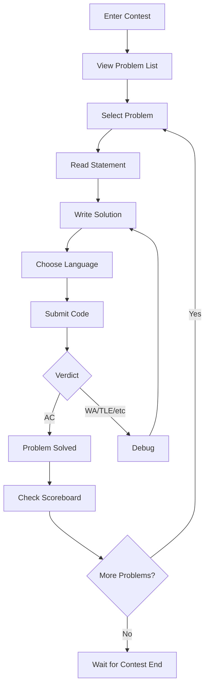

# Arena

Arena is the web service that Frontend has to call for everything contest-related — and for a little bit of contest administration too, like editing the problems attached to a contest. Historically it was planned as its own component: part of Frontend during v1, then split out as a standalone service starting in v2. In practice, what lives on omegaUp today is the v1 shape — the Arena is the set of Vue single-file components under `frontend/www/js/omegaup/components/arena/` (`Arena.vue`, `Contest.vue`, `ContestPractice.vue`, `Scoreboard.vue`, `Runs.vue`, `RunSubmitPopup.vue`, `Clarification.vue`, `Summary.vue`, `NavbarMiniranking.vue`, and friends), all talking to the same PHP API endpoints described below. The old v2-standalone split never happened, but the API contract the Arena speaks is exactly the one drawn up for it, so this page documents that contract as the thing you actually build against.

The whole point of the Arena is to be the face contestants stare at for the entire contest. Its job, in the words of the original UX spec, is to show the contest environment; display, submit, and review problem submissions; show clarifications; render a mini-ranking; render the full scoreboard; and draw the score-progress chart (points over time). A deliberate design decision from day one was that this layer would be written 100% in HTML/JavaScript so the same UI could be driven by both _Arena_ and _Frontend_ — which is exactly why the migration to Vue single-file components landed so cleanly: the presentation layer was always meant to be a thin client over the API.

## Arena layout

```
┌─────────────────────────────────────────────────────────────┐
│  Contest Title                              Timer: 01:30:00 │
├─────────┬───────────────────────────────────────────────────┤
│         │                                                   │
│ Problem │              Problem Statement                    │
│  List   │                                                   │
│         │  - Description                                    │
│  [A]    │  - Input/Output format                           │
│  [B]    │  - Constraints                                   │
│  [C]    │  - Examples                                      │
│         │                                                   │
│─────────┼───────────────────────────────────────────────────│
│         │                                                   │
│ Submit  │              Code Editor                          │
│ History │                                                   │
│         │  [Language: C++17 ▼]  [Submit]                   │
│         │                                                   │
├─────────┴───────────────────────────────────────────────────┤
│                    Scoreboard / Clarifications              │
└─────────────────────────────────────────────────────────────┘
```

The left rail is the problem list (`NavbarProblems.vue`) plus the current user's submission history for the selected problem (`Runs.vue`); the center pane switches between the rendered statement and the code editor (`CodeView.vue` / `RunSubmitPopup.vue`); the bottom drawer flips between the scoreboard (`Scoreboard.vue`) and clarifications (`ClarificationList.vue`). The mini-ranking (`NavbarMiniranking.vue`) rides along in the navbar so you always see the top of the standings without leaving the problem you're on.

## The submission loop



## How every API call is shaped

Before any individual endpoint, four conventions hold everywhere and are assumed for the rest of this page.

Every call lives under `https://omegaup.com/api/` — under `/api/` and not the site root — because SSL only exists on `omegaup.com`, and everything that touches a contest has to be encrypted (there was a real programming contest where somebody sat down and sniffed the traffic; between that and Firesheep-style attacks, encrypting everything is the only sane default).

Most calls need an `auth_token`, which you get by calling `/api/user/login/` or by logging in through the normal page. Session handling goes over `POST`, but cookies work too, so `GET` calls can carry authentication without threading the token through the query string. Parameters travel as JSON, and any call that requires authentication must carry a valid `auth_token`.

Every response carries a `status` field. On success it is the literal string `ok`. On failure it is `error`, and the body also carries a human-readable `error` description **in whatever language the account is configured for**, plus an `errorcode` (numeric) and an `errorname` (text) so code can branch on the failure without parsing prose.

On top of that envelope, the server sets the HTTP status to match. The two rows that matter most are the 403/404 split, because it encodes a real security decision:

| Code | Response | What it means |
| ---- | -------- | ------------- |
| 200 | OK | The request succeeded. |
| 400 | BAD REQUEST | The request (including the JSON body) is malformed. |
| 401 | AUTHENTICATION REQUIRED | The request is missing `auth_token`, whether via cookie or via the JSON body. |
| 403 | FORBIDDEN | The resource was **found**, but you lack the privileges to read or modify it — a user trying to read someone else's runs, or open a contest's admin panel. |
| 404 | NOT FOUND | The resource wasn't found (a user, problem, contest, run…), **or** it was found but is deliberately hidden — as with private contests. |
| 505 | INTERNAL SERVER ERROR | The request ended unexpectedly. The body may even be empty, or the description ambiguous. Hopefully the logs have more to say about it. |

!!! warning "The 403-vs-404 rule is intentional, not sloppy"
    A private contest you're not invited to returns **404, not 403** — on purpose. A 403 would leak that the contest exists; 404 keeps a private contest invisible to anyone who wasn't explicitly added. If you're touching visibility code, don't "fix" this into a 403.

## Getting into the Arena

Three routes return HTML rather than JSON — the actual arena shell:

- `GET /arena/` — the arena landing. If you're not logged in, it shows the list of current public contests; if you are, it shows the list of contests you belong to.
- `GET /arena/:contest_alias` — the contest intro. Logged out, you get the contest details plus a *Log in* button; logged in, the same details but the button becomes *Start the contest*. That distinction matters because starting the contest is what stamps your personal clock when `window_length` is in play (see below).
- `GET /arena/:contest_alias/scoreboard` — if you're allowed to see it, the HTML that lays out the contents of `/api/problemset/scoreboard/` graphically.

## Listing contests — `GET /api/contest/list`

Returns, by default, the last 20 contests the user "can see." You narrow the list with four filters, each an enum: `active` (`ACTIVE`, `FUTURE`, `PAST`), `recommended` (`RECOMMENDED`, `NOT_RECOMMENDED`), `participating` (`YES`, `NO`), and `public` (`YES`, `NO` — public contests versus ones you were registered into).

Each result carries the usual identity fields (`contest_id`, `problemset_id`, `alias` — the alias is what you need to actually reach the contest — `title`, `description`), the schedule as Unix timestamps (`start_time`, `finish_time`, `last_updated`), and three fields worth calling out:

- `admission_mode` is `enum['public', 'private', 'registration']` — public, private, or "requires the user to register first."
- `duration` is the wall-clock span the contest is open (just `finish_time - start_time`).
- `window_length` is how long each user gets *once they personally open the contest* — and it **returns `null` if the contest wasn't configured with that feature**, meaning everyone shares the same global window from `start_time` to `finish_time` instead.

## Creating a contest — `POST /api/contest/create`

If the caller has a valid `auth_token`, this creates a new contest with no problems attached yet. It takes the title/description/`start_time`/`finish_time`, an `alias` of up to 32 characters, and a pile of scoring knobs. The ones that carry real semantics:

- `window_length` (int) — optional; set it if every user should get the same amount of time regardless of *when* they enter.
- `points_decay_factor` (double in the range `(0,1)`) — how fast a problem's points decay over the contest. **The default is 0 (points don't decay). For reference, TopCoder uses 0.7** — that's the anchor for what a "high decay" contest feels like.
- `submissions_gap` (int, in the range `(0, finish_time - start_time)`) — the minimum number of seconds a user must wait after one submission before making another.
- `penalty` (int, `(0, INF)`) — minutes added as a penalty per non-accepted verdict.
- `penalty_type` (`none`, `problem_open`, `contest_start`, `runtime`) — *how* the per-submission penalty is computed, i.e. what moment the clock starts from.
- `scoreboard` (int `(0,100)`) — the percentage of the contest duration during which the scoreboard stays visible. `show_scoreboard_after` (bool) then decides whether the full scoreboard is revealed once the contest ends.
- `public` (bool) — defaults to **private**, and a contest **cannot be made public until it has problems**, which is why you create it empty and flip this later.
- `languages` — the set of allowed languages (`kp`, `kj`, `c11-gcc`, `c11-clang`, …), comma-separated for more than one.
- `basic_information` (bool) — whether users must have filled in their basic info (Country, State, School) before they can join.
- `requests_user_information` (`no`, `optional`, `required`) — whether the organizer asks permission to view contestants' personal information.

## Public contest details — `GET /api/contest/publicdetails/`

If the user is allowed to see it, this shows the details of contest `:contest_alias` — minimal problem info, time remaining, mini-ranking. In the original author's words it's *"a nice little query, charismatic and cacheable."* That "cacheable" is a design signal, not a throwaway: this endpoint is meant to be cheap and served from cache, so treat it as your fast path for anything a public, logged-out visitor sees.

The payload echoes the schedule and the same scoring knobs as create, with the same edge behavior: `window_length` (int) is the time the user has to submit, and **if it's `NULL` the window is the entire contest**; `scoreboard` is the 0–100 visibility percentage; `points_decay_factor` again defaults to **0 (no decay), TopCoder is 0.7**; `partial_score` (bool) is true if the user earns partial points for problems not solved on every case; `penalty_calc_policy` is `enum('sum', 'max')`; and `penalty_time_start` says whether penalty time starts counting from when the contest opens or from when the problem is opened.

## The scoreboard — `GET /api/problemset/scoreboard/`

If the user has the right permissions, this returns the full ranking for the contest with that `problemset_id` (`auth_token` is optional here — a public scoreboard is readable without one). It comes back as a `problems` array (each entry an `order` for sorting and an `alias`) plus a `ranking` array. Each ranking row is a contestant: `username`, display `name`, `country`, and `classname` — the rank/tier the user has earned from their trajectory on the platform, which is what drives the colored username styling. One flag is easy to miss: `is_invited` (bool) distinguishes a user who was **explicitly invited** from one who simply walked into a public contest. Each row then carries a `total` of `points` and `penalty`, and a per-problem breakdown (`alias`, `points`, `penalty`, `percent`, and `runs` — the number of submissions this user made on that problem in this contest).

### Score-progress events — `GET /api/problemset/scoreboardevents/`

Same permission gate, but instead of the current standings it returns **every event that caused someone's score to change** — this is what the score-progress chart is drawn from. Each event has the contestant (`username`, `name`, `country`, `classname`, `is_invited`), a `delta` (the number of seconds *from the start of the contest* at which the event happened), the running `total` (`points`, `penalty`), and the `problem` that triggered it (`alias`, `points`, `penalty`). Plot `total.points` against `delta` per user and you get the classic rising-staircase graph.

## Reading a problem — `GET /api/problem/details/`

With the right permissions, this returns the problem's content plus references to the solutions the caller has already submitted to it. Alongside the statement itself (`statement.markdown`, `statement.language`, and any `statement.images`), you get the metadata that defines the judging contract: `time_limit` and `memory_limit`, `input_limit`, and the `validator` — `enum('remote','literal','token','token-caseless','token-numeric')`, which decides how output is compared (exact literal, token-by-token, case-insensitive tokens, or numeric tokens within a tolerance). The `settings` block spells out the real limits the grader enforces — `TimeLimit`, `OverallWallTimeLimit`, `ExtraWallTime`, `MemoryLimit`, `OutputLimit` — plus the `cases`, where each sample case carries its `in`, `out`, and `weight`.

The `runs` array is the caller's own submission history for this problem, and it's where the two enums you'll pattern-match against live. `status` walks `'new' → 'waiting' → 'compiling' → 'running' → 'ready'` — the lifecycle of a submission from queued to judged. `veredict` (yes, the field is spelled that way) is the final answer, one of `'AC'` (accepted), `'PA'` (partial), `'PE'` (presentation error), `'WA'` (wrong answer), `'TLE'` (time limit exceeded), `'OLE'` (output limit exceeded), `'MLE'` (memory limit exceeded), `'RTE'` (runtime error), `'RFE'` (restricted function error), `'CE'` (compile error), or `'JE'` (judge error). Each run also reports `runtime`, `memory`, `score`, `contest_score`, and `submit_delay` — **the number of minutes from when the user opened the problem to when they submitted**, which is what penalty calculation keys off of.

## Submitting a solution — `POST /api/run/create/`

This is the endpoint the whole Arena orbits around. When you hit *Submit*, the JavaScript posts `{ auth_token, problem_alias, language, source, contest_alias? }` — `contest_alias` optional, present only when the problem belongs to a contest's problemset. The request rides the standard chain: `frontend/www/api/ApiEntryPoint.php` requires `frontend/server/bootstrap.php`, which hands off to `\OmegaUp\ApiCaller::httpEntryPoint()`, which routes `run/create` to `\OmegaUp\Controllers\Run::apiCreate` (note the class is `Run`, not `RunController` — omegaUp controllers drop the `Controller` suffix). You can read it at `frontend/server/src/Controllers/Run.php` (`apiCreate` starts at line 415).

`apiCreate` first authenticates the identity, then validates: all required fields are present (`source`, language, problem, and contest if any), the problem is actually in the contest and both are valid, the contest's time limit hasn't expired, the user isn't exceeding the submission rate, and the contest is either public or the user was explicitly added to it. The rate limit is the `submissions_gap`, which defaults to **60 seconds** — `Run::$defaultSubmissionGap = 60` at `Run.php:26` — i.e. one submission per problem per minute unless the contest overrides it. Only after all of that does it write the `Submissions` and `Runs` rows to MySQL and then call `\OmegaUp\Grader::getInstance()->grade($run, trim($source))` at `Run.php:573`.

!!! note "The grader is a separate service, reached over HTTP"
    `\OmegaUp\Grader` is a thin curl client, not the grader itself. It POSTs the run to `OMEGAUP_GRADER_URL` (default `https://localhost:21680`), and the real grading — the queue, the runners, the minijail sandbox — lives in the separate Go [`omegaup/quark`](https://github.com/omegaup/quark) repo. This PHP endpoint never touches minijail; it just hands the run over the wire. If `grade()` throws, `apiCreate` can't roll back inside a transaction (the Grader process wouldn't see the row), so it unlinks and deletes the `Run`/`Submission` rows by hand.

The response is small but each field has an edge case baked in:

- `guid` — the submission's identifier, which you'll use to poll for the verdict.
- `submission_deadline` (Timestamp) — the deadline for making submissions. **It's 0 when you're not inside a contest** (`Run.php:617`/`635`); inside a contest it's the problemset's `end_time`, or `start_time + window_length` when a per-user window applies.
- `nextSubmissionTimestamp` (Timestamp) — the earliest moment the user may submit this problem again, i.e. now plus the `submissions_gap`. This is what the Submit button counts down against.

## Watching the result come back

A submission is judged asynchronously, so the Arena polls. `GET /api/problem/runs/` returns references to the caller's most recent solutions to a problem with their `status` and verdict; `GET /api/run/details/` (keyed by `run_alias`) returns the full picture for one run — the `source`, an `admin` flag, and a `details` block with the `verdict`, per-phase `compile_meta` (`time`, `sys_time`, `wall_time`, `memory`), the `score`/`contest_score`/`max_score`, execution `time`, `wall_time`, `memory`, and `judged_by` (which runner handled it). While a run is in `new`/`waiting`/`compiling`/`running`, the UI shows a spinner; once `run/details` reports `ready` with a verdict, it stops polling and paints the result.

!!! tip "Verdicts, at a glance"
    `AC` all cases passed · `PA` partial (some cases, when the contest's `score_mode` allows partial credit) · `WA` wrong answer · `TLE` over the time limit · `MLE` over the memory limit · `OLE` over the output limit · `RTE` runtime error · `RFE` restricted-function error (a banned syscall) · `PE` presentation error · `CE` compile error (check `compile_meta`) · `JE` judge error (our fault, not yours).

## Clarifications

During a contest, a stuck contestant asks the problem author a question. `POST /api/clarification/create/` takes `{ auth_token, problem_alias, contest_alias?, message }` (contest optional if the problem isn't in a contest) and returns a `clarification_id` to track it by. To read them, `GET /api/problem/clarifications/` and `GET /api/contest/clarifications/` return **all** the clarifications the user is allowed to see — which is exactly the ones they personally sent, plus every clarification marked public — paginated with `offset` (default 0) and `rowcount` (default 20). Each entry carries `author`, `message`, `answer` (`null` until answered), `time`, and the `public` flag; the contest variant also carries `receiver` (`null` for a broadcast to everyone). Only the problem's or contest's creator can answer, via `POST /api/clarification/update/` with `{ auth_token, clarification_id, answer, public }` — flip `public` to true and the answer becomes visible to the whole contest instead of just the asker.

## Contest modes

The same components render three modes, gated by where "now" falls relative to the contest window.

**Practice mode** (`ContestPractice.vue`) runs *outside* contest hours: no timer, full verdict details visible, unlimited submissions, and nothing touches the scoreboard. It's the "come back and actually learn the problem" mode.

**Contest mode** (`Contest.vue`) runs *during* the window: the timer counts down against `submission_deadline`, verdict detail may be restricted per the contest's `feedback` setting, the live scoreboard is visible for the configured `scoreboard` percentage of the duration, and the `submissions_gap` rate limit is enforced.

**Virtual contest** replays a past contest against its original problems and time limits, but on a personal clock, so you can measure yourself against the original standings after the fact.

## Contest admin view

A contest director sees the same Arena plus the administrative surface: every participant's submissions (not just their own — that's the 403 gate lifting for the owner), the ability to rejudge specific submissions, broadcast announcements to all contestants, answer clarifications, and extend the contest time. These reuse the same endpoints; the difference is entirely in the permission checks the controllers run, not a separate UI.

## Related documentation

- **[Contests](contests/index.md)** — contest management and configuration
- **[Problems](problems/index.md)** — problem creation and the judging settings referenced above
- **[Real-time updates](realtime.md)** — how verdicts and scoreboards refresh
- **[Verdicts](verdicts.md)** — the full verdict enum explained
- **[Contests API](../reference/api.md)** — the endpoint reference
