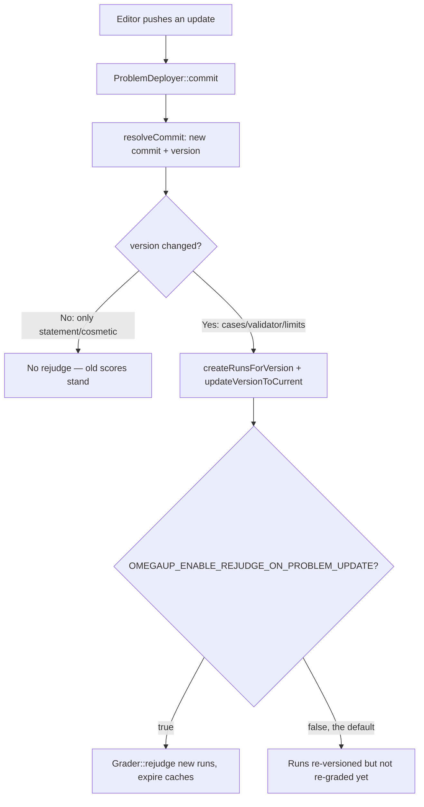

# Problem Versioning

Every problem on omegaUp is a real git repository. Not "version-controlled" in some metaphorical sense — an actual bare repo, one per problem, physically stored and served by **gitserver**, a small Go service (`github.com/omegaup/gitserver`, shipped as the `omegaup/gitserver` Docker image, currently `v1.9.13`) built on top of libgit2 (`git2go/v33`) and the `githttp/v2` smart-HTTP transport. The PHP frontend never touches those repos directly; it talks to gitserver over plain HTTP at `OMEGAUP_GITSERVER_URL` (default `http://localhost:33861`, where `33861` is `OMEGAUP_GITSERVER_PORT` in `frontend/server/config.default.php`).

We do it this way because a competitive-programming problem is not one document — it's a bundle of statements, test cases, validators, solutions, and grading settings that get edited independently by different people at different times, and where a single wrong `.out` file discovered mid-contest must be fixable *without* silently rescoring everybody who already submitted. Git already solves history, atomic updates, diffing, and "give me exactly the bytes that were live at commit `abc123`." Rather than reinvent that in MySQL, omegaUp leans on git and spends its own code on the two things git *doesn't* know about: **who is allowed to see which files**, and **which changes are cosmetic versus grading-relevant**.

## The branch layout: content split by visibility

The naïve mental model — one `master` for the published version, one `private` for the draft — is wrong, and the difference matters the moment you try to reason about who can see a hidden test case. gitserver splits a problem's contents across several branches *by sensitivity*, and it does the splitting for you: you push one commit with all your files, and gitserver routes each file to the right branch using the path regexps in `DefaultCommitDescriptions` (`handler.go`).

| Ref | Holds | Who may read it |
|-----|-------|-----------------|
| `refs/heads/public` | `.gitattributes`, `.gitignore`, `statements/`, `examples/`, `interactive/Main.distrib.*`, `interactive/examples/`, `validator.distrib.*`, `settings.distrib.json` | Anyone who can see the problem |
| `refs/heads/protected` | `solutions/`, `tests/` | Problem editors, and users who have already solved it |
| `refs/heads/private` | `cases/*.in` + `cases/*.out`, `interactive/Main.*`, `*.idl`, `validator.*`, `settings.json` | Problem editors only |
| `refs/heads/master` | The merge commit tying `public` + `protected` + `private` (+ the review) together | Editors |
| `refs/heads/published` | A pointer to one commit inside `master` — the version that is *live* | — |
| `refs/meta/config` | `config.json` (publishing / mirror config) | Admins only |
| `refs/meta/review` | The code-review ledger and comment threads | Editors and solvers |
| `refs/changes/*` | Pending review commits awaiting merge into `master` | — |

The reason the *real* test data (`cases/`, the actual `validator.*`, `settings.json`) lives on `private` and the sample data (`examples/`, `settings.distrib.json`, `validator.distrib.*`) lives on `public` is exactly so that "show the contestant the sample cases" and "let the grader read the secret cases" are two different git reads against two different branches with two different permission checks — you cannot accidentally leak a hidden case by rendering a statement, because the statement branch physically does not contain it.

`public`, `protected`, and `private` are **read-only refs**: any attempt to push them directly is rejected with `ErrReadOnlyRef` (see `validateUpdate` in `handler.go`). They only ever move *implicitly*, when a change is merged. `refs/meta/config` requires admin (`IsAdmin`); `refs/meta/review` and `refs/changes/*` accept a push from anyone who `CanEdit` **or** `HasSolved` the problem — that `HasSolved` clause is deliberate, so that someone who solved a problem can leave review comments on it without being a full editor. And deleting any ref is flatly disallowed (`ErrDeleteDisallowed`) — problem history is append-only by design; there is no "force-delete a bad commit."

## A commit, a version, and why they are not the same thing

This is the single most important distinction on the page, and the one a flattened summary always destroys. omegaUp tracks **two** identifiers for "which version of the problem," and they answer different questions:

- **`commit`** — the SHA-1 of the merge commit on `refs/heads/master`. A master commit always has **3 or 4 parents** (its `public`, `protected`, `private` sub-commits, plus optionally the review). If you ever see a commit in the master log with fewer than 3 parents, it's one of the merged branch tips, not a real problem version — the code skips those explicitly (`if (count($logEntry['parents']) < 3) { continue; }` in `Problem::getVersions`).
- **`version`** — the *tree* hash of the `private` branch at that commit. Because the private branch is **always the last parent** of the master commit, `Problem::resolveCommit` (`frontend/server/src/Controllers/Problem.php`) reads that last parent, takes its tree, and returns the pair `[masterCommit, privateTree]`.

Why carry both? Because they let omegaUp answer *"did the graded content actually change?"* in one comparison. Suppose you fix a typo in the English statement. That produces a brand-new `master` commit (new `commit`), but the `private` tree — the cases, the validator, `settings.json` — is byte-for-byte identical, so the `version` is unchanged. A change to a test case, a time limit, or the validator changes the `private` tree, so the `version` changes too. Every run records both (`Run::apiCreate` stores `'version' => $problem->current_version, 'commit' => $problem->commit`), so the frontend can show "this submission was judged against commit X" while reserving expensive rejudges for the cases where the *version* moved.

## Uploading and updating: how a push becomes a commit

When you create or edit a problem through the UI, the PHP side is `\OmegaUp\ProblemDeployer` (`frontend/server/src/ProblemDeployer.php`). It does **not** speak the git wire protocol case-by-case; it POSTs your whole `.zip` to gitserver at `OMEGAUP_GITSERVER_URL/{alias}/git-upload-zip`, and gitserver's `ziphandler.go` unpacks it, splits it across the content branches, and builds the merge commit.

The interesting part is the **merge strategy**, because "apply this zip on top of what's already there" means different things for different edits. `ProblemDeployer::commit` picks one based on the operation:

| Operation (`ProblemDeployer` constant) | Merge strategy sent to gitserver | Meaning |
|---|---|---|
| `CREATE` (3) | `theirs` | Take the zip's tree wholesale — there's nothing to merge against |
| `UPDATE_CASES` (1) | `theirs` | Replace the test data with what's in the zip |
| `UPDATE_STATEMENTS` (2) | `recursive-theirs` | Real 3-way merge, but the zip wins conflicts |
| `UPDATE_SETTINGS` (0) | `ours` | Keep the existing tree untouched (settings are applied out-of-band, not from the zip) |

Those names are gitserver's `ZipMergeStrategy` enum (`ziphandler.go`): `ours` uses the parent tree as-is (exactly `git merge -s ours`), `theirs` uses the zip's tree and discards the parent (which git has *no* built-in equivalent for), `recursive-theirs` is `git merge -s recursive -X theirs`, and there's a fourth, `statement-ours`, that keeps only the `statements/` subtree from the parent while taking everything else from the zip.

When gitserver finishes, it replies with JSON listing `updated_refs` and `updated_files`, and `ProblemDeployer::processResult` mines two facts out of it: the `to_tree` of `refs/heads/private` becomes `privateTreeHash` (that's your new **version**), and the `to` of `refs/heads/published` becomes `publishedCommit` (your new **commit**). It also scans `updated_files` for paths matching `statements/([a-z]{2})\.markdown` or `solutions/([a-z]{2})\.markdown` so it knows which statement languages changed — that list later drives cache invalidation and the libinteractive template regeneration.

### The review gate and the "slow" rejection

Two of gitserver's guardrails fire at commit time, before a version ever becomes real, and both are the kind of thing you'll bang your head on if you don't know they exist.

First, **`master` cannot be pushed directly from an arbitrary commit** — it must come from a `refs/changes/*` review ref. `validateUpdateMaster` iterates every `refs/changes/*` ref looking for one whose tip equals the commit you're merging; if it finds none *and* the server wasn't started with `allowDirectPushToMaster`, it returns `ErrNotAReview` (`"not-a-review"`). Likewise `published` must point at a commit that actually exists in `master`, or you get `ErrPublishedNotFromMaster` (`"published-must-point-to-commit-in-master"`).

Second, and more surprising: a problem can be **rejected for being too slow to judge**. gitserver's `isSlow` (`handler.go`) computes a worst-case runtime as `ceil(TimeLimit + ExtraWallTime) × (number of cases)` — plus the custom validator's own limits if `Validator.Name` is the custom validator — and compares it against a hard ceiling (`hardOverallWallTimeLimit`, a server config). If the problem's `OverallWallTimeLimit` exceeds that ceiling *and* the computed worst case also exceeds it, the push is refused with `ErrSlowRejected` (`"slow-rejected"`) and the commit never lands. Below that hard ceiling, a problem whose worst case is at least **30 seconds** (`slowQueueThresholdDuration = 30 * time.Second` in `ziphandler.go`) is merely *flagged* `Slow`, which later routes its submissions to the grader's slow queues rather than rejecting them. So "30s" is the line between the fast and slow queues, and the configurable hard limit is the line between "allowed" and "you must split this problem up." (Packfiles are also capped at `objectLimit = 10000` objects, returning `ErrTooManyObjects` — a guard against someone pushing a pathologically huge repo.)

One small but load-bearing detail: gitserver writes `cases/* -diff -delta -merge -text -crlf` into the repo's `.gitattributes` (`GitAttributesContents`). That tells git to treat everything under `cases/` as opaque binary — no line-ending normalization, no delta compression, no merge attempts — because a test case is exact bytes and git "helpfully" rewriting a trailing newline would corrupt grading.

## What triggers a rejudge

A rejudge is expensive — it re-runs every existing submission against the new test data — so omegaUp is deliberately stingy about triggering one. The decision lives in `Problem::apiUpdate`:



Concretely: after `ProblemDeployer::commit` returns a `publishedCommit`, the controller calls `resolveCommit` to get the new `[commit, version]`, then sets `rejudged = ($oldVersion != $problem->current_version)`. The comparison is on **version**, not commit — this is where the two-identifier design pays off. A pure statement edit leaves `version` untouched, `rejudged` stays `false`, and nobody's score moves. Only when the private tree changed does `needsUpdate` become true, at which point it runs `Runs::createRunsForVersion` and `Runs::updateVersionToCurrent` to attach the existing submissions to the new version, and `ProblemsetProblems::updateVersionToCurrent` to advance contests (subject to the `update_published` scope, below).

The actual re-grading is then gated on `OMEGAUP_ENABLE_REJUDGE_ON_PROBLEM_UPDATE`, which **defaults to `false`** (`config.default.php`). When it's on, the controller fetches the affected runs with `Runs::getNewRunsForVersion` and hands them to `\OmegaUp\Grader::getInstance()->rejudge($runs, false)` — best-effort, wrapped in a try/catch, so a grader hiccup logs an error but doesn't fail the whole problem update — and then expires the `RUN_ADMIN_DETAILS` and `PROBLEM_STATS` caches so the UI reflects the new verdicts.

### Reverting: jumping `published` backwards

Reverting isn't a git revert commit — it's moving the `published` pointer to an *older* master commit, which is why gitserver special-cases `published` as the one branch where **non-fast-forward pushes are allowed** (`validateUpdate` skips the fast-forward check only for `refs/heads/published`). The endpoint is `Problem::apiSelectVersion`: you hand it a `commit` (validated as a 1–40 character hex string), it re-runs `resolveCommit` against the master log to confirm that commit is a real version, and then calls `ProblemDeployer::updatePublished`, which pushes the moved `published` ref to gitserver via `git-receive-pack`. From there it re-versions runs exactly like an update does. So "revert to v2" and "publish v5" are the same operation pointed at different commits.

## `update_published`: how far a new version propagates

Publishing a new version raises an awkward question: should it disturb contests and courses that are *currently using* the problem? omegaUp answers it with the `update_published` parameter, whose four values are the `UPDATE_PUBLISHED_*` constants on `\OmegaUp\ProblemParams`:

- **`none`** — commit the change to the repo but *don't* move `published` at all. Your edit stays a draft on `master`; the live version is unchanged. This is how you stage work.
- **`non-problemset`** — move the problem's own `published` pointer, but touch **no** problemset. Contests and courses keep their pinned version; only the standalone problem page shows the new one.
- **`owned-problemsets`** — additionally advance the problemsets *you own* to the new version.
- **`editable-problemsets`** — additionally advance *every* problemset you're allowed to edit. This is the default for `apiSelectVersion`.

The escalation is deliberate and the reason it exists is contest integrity: bumping a problem's version must never silently change the problem out from under a running contest you don't control, so the propagation is opt-in and scoped to what you own or can edit.

## Version pinning in contests

A contest doesn't reference a problem "by name and hope it doesn't change." When a problem is added to a contest, the exact version is **frozen into the join row**. `ProblemsetProblems` carries `commit`, `version`, and `points` columns, and `Contest::apiAddProblem` populates them like this:

```php
[$masterCommit, $currentVersion] = \OmegaUp\Controllers\Problem::resolveCommit(
    $problem,
    $r->ensureOptionalString('commit', required: false, /* 1–40 chars */)
);
\OmegaUp\Controllers\Problemset::addProblem(
    $contest->problemset_id, $problem, $masterCommit, $currentVersion, ...
);
```

If the organizer supplies a `commit`, that specific master version is pinned; if they omit it, `resolveCommit` falls back to the problem's current `published` head. Either way the resolved `{commit, version}` pair lands in `ProblemsetProblems`, and from that moment the contest is looking at a snapshot.

That snapshot wins everywhere the problem is served in a problemset context. In `Problem::getProblemDetails`, the code starts with the problem's own live `commit`/`current_version` and then, if there's a problemset, **overwrites** them from the join row:

```php
$commit  = $problem->commit;
$version = strval($problem->current_version);
if (!empty($problemset)) {
    $problemsetProblem = \OmegaUp\DAO\ProblemsetProblems::getByPK(...);
    $commit  = $problemsetProblem->commit;      // the pinned commit
    $version = strval($problemsetProblem->version);
}
```

So a contestant opening the problem, the grader fetching test cases, and the scoreboard computing scores all resolve to the pinned commit — not whatever the problem author pushed five minutes ago. When the same problem is submitted inside the contest, the run's `version` and `commit` are the pinned ones, which is what lets an author keep improving the public problem while the contest stays reproducible.

Changing a pin *after* submissions exist is handled, not forbidden: `Problemset::updateProblemsetProblem` compares the old and new `version`, and if they differ it calls `ProblemsetProblems::updateProblemsetProblemSubmissions` to re-point existing submissions at the new version; if only `points` changed it calls `Runs::recalculateScore` instead. And `MAX_PROBLEMS_IN_CONTEST` caps how many problems (and therefore pins) a single contest can hold.

## Inspecting versions from the API

`GET /api/problem/versions/?problem_alias=...` (`Problem::apiVersions` → `getVersions`) returns the published commit plus the full master log, but only to someone who `canEditProblem` or `canEditProblemset` — version history exposes the private-tree hashes, so it's gated. Its shape is the `ProblemVersion` psalm type:

```text
published: string                    // the commit hash currently live
log: list<{
  commit:    string,                 // master merge commit (3–4 parents)
  version:   string,                 // the private tree hash for this commit
  author:    Signature,              // { name, email, time }
  committer: Signature,
  message:   string,
  parents:   list<string>,           // last parent is always the private branch
  tree:      array<string, string>   // path -> blob id, from lsTreeRecursive
}>
```

Under the hood `getVersions` walks two logs from `\OmegaUp\ProblemArtifacts` — the `private` log to build a `commit → tree` map, and the `master` log to enumerate real versions (again skipping any entry with `< 3` parents) — and stitches each master commit's `version` from its private parent's tree. `ProblemArtifacts` is itself just a thin HTTP client over gitserver's read endpoints: `OMEGAUP_GITSERVER_URL/{alias}/+log/{rev}` for history, `/+/{rev}` for a single commit or path, `/+archive/{rev}.zip` to pull a whole tree.

## Related Documentation

- **[GitServer Architecture](../architecture/gitserver.md)** — the Go service itself
- **[Problems API](../reference/api.md)** — full endpoint reference
- **[Creating Problems](problems/creating-problems.md)** — the authoring workflow
