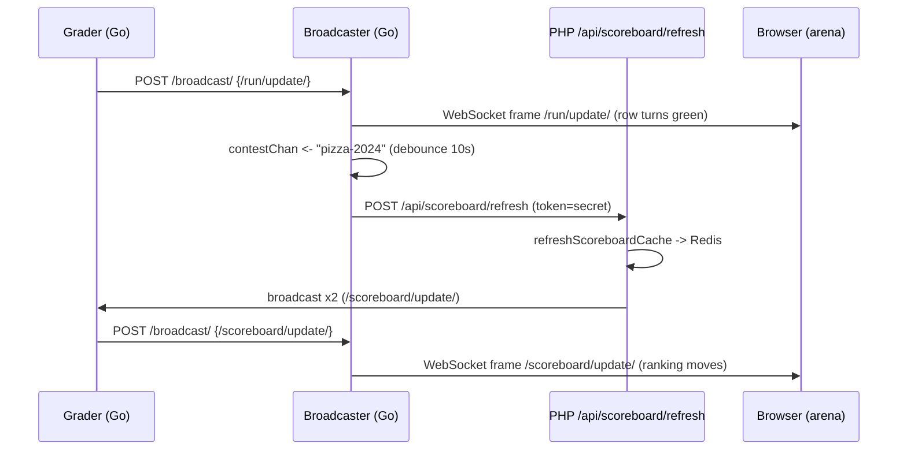

# Real-time Updates

When you are sitting in the arena and your submission flips from a spinning "judging" to a green **AC**, or the scoreboard reshuffles the instant a rival solves problem C, none of that arrived because your browser asked for it. It was *pushed* to you over a WebSocket that has been held open since you opened the contest page. That is what "real-time updates" means at omegaUp: the arena is a live view onto three streams of events — **run verdicts** (`/run/update/`), **scoreboard changes** (`/scoreboard/update/`), and **clarifications** (`/clarification/update/`) — delivered as they happen instead of on a polling clock.

The machinery behind this is the **broadcaster**, a small Go service in the separate [`omegaup/quark`](https://github.com/omegaup/quark) repo (the same repo as the grader and runner — *not* the PHP monorepo). This page is the feature-and-contract view: what the events look like on the wire, how the browser client behaves, and how a single graded run turns into pixels moving on every participant's screen. For the guts of the fan-out loop, the filter-matching, and the two-port trust model, see [Broadcaster Architecture](../architecture/broadcaster.md) — this page deliberately stays at the level of "what do I get, and how do I consume it."

## The one-sentence mental model

A graded run in a contest produces **two** waves of updates, and it helps to hold both in your head from the start:

1. An **immediate `/run/update/`** that the grader publishes the moment it finishes judging — this is what turns *your own* submission row green.
2. A **slightly-later, debounced `/scoreboard/update/`** that only exists because that verdict may have changed the *ranking* — and the ranking is computed in PHP, not in Go, so it takes a full round-trip out to the frontend and back before it reaches everyone's browser.

The whole flow is `grader → /broadcast/ → (scoreboard? → /api/scoreboard/refresh → recompute → /broadcast/ again) → clients`. Everything below fills in that arc.

## The events, as they actually arrive

The browser opens exactly one WebSocket and receives every kind of event down it, distinguished by an inner `message` field. The frame the socket delivers is a JSON string; the client's handler in [`events_socket.ts`](https://github.com/omegaup/omegaup/blob/main/frontend/www/js/omegaup/arena/events_socket.ts) `JSON.parse`s it and branches on `data.message`. There are currently three shapes it knows how to handle, and anything else is silently ignored.

### `/run/update/` — a verdict changed

Born in the grader ([`cmd/omegaup-grader/frontend_handler.go`](https://github.com/omegaup/quark/blob/main/cmd/omegaup-grader/frontend_handler.go), `broadcastRun`) the instant a run finishes judging. The payload's `run` object is the wire contract the arena consumes:

```json
{
  "message": "/run/update/",
  "run": {
    "username": "contestant1",
    "contest_alias": "pizza-2024",
    "problemset": 1234,
    "alias": "problem-c",       // the problem alias, NOT "problem_alias"
    "guid": "d41d8cd98f00b204e9800998ecf8427e",
    "status": "ready",           // always "ready" here; grading is finished
    "verdict": "AC",             // AC, PA, WA, TLE, OLE, MLE, RTE, RFE, CE, JE
    "score": 1.0,                // (0,1) fraction of cases passed
    "contest_score": 100.0,      // score scaled to the problem's contest points
    "runtime": 0.045,            // seconds
    "memory": 2048,              // bytes
    "penalty": -1,               // filled from the DB before sending
    "submit_delay": -1,          // minutes from problem-open to submit
    "language": "cpp17-gcc",
    "score_by_group": {}         // per-group scores, for group scoring modes
  }
}
```

One edge case is baked in at the source and worth knowing before you trust `score`: if the problem's score mode is `all_or_nothing` and the score is anything less than a perfect `1`, the grader rewrites `score` and `contest_score` to `0` and the `verdict` to `WA` *before* broadcasting — so partial credit never leaks into an all-or-nothing display. The client, on seeing `/run/update/`, converts `run.time` from a Unix second-count to local time and commits the run into the Vuex store via `updateRun`; that store binding is what repaints the row.

### `/scoreboard/update/` — the ranking moved

This one does *not* come straight from the grader. It is emitted by PHP at the tail of `\OmegaUp\Scoreboard::refreshScoreboardCache` ([`Scoreboard.php`](https://github.com/omegaup/omegaup/blob/main/frontend/server/src/Scoreboard.php)) after it recomputes the ranking, and it is sent **twice** — once for contestants, once for admins — because the two audiences see different data:

```json
{
  "message": "/scoreboard/update/",
  "scoreboard_type": "contestant",  // or "admin"
  "scoreboard": { /* the full types.Scoreboard object */ }
}
```

The `contestant` copy is broadcast `public: true` so every participant in the contest receives it; the `admin` copy is broadcast `public: false` so only admins do (the broadcaster's per-message filter is what enforces that split — see the architecture page). On receipt, the client runs `processRankings`, re-derives the ranking, and — because the scoreboard payload doesn't carry the historical points-over-time series — fires a follow-up `api.Problemset.scoreboardEvents` call to rebuild the ranking chart. So `/scoreboard/update/` is a *nudge that carries the new standings but not the chart*; the chart is refetched lazily.

### `/clarification/update/` — a new question or answer

Delivered when a clarification is created or answered. The client stamps `clarification.time` into local time and commits it into the clarifications store, which surfaces it in the arena's clarification list:

```json
{
  "message": "/clarification/update/",
  "clarification": { /* the clarification object */ }
}
```

## The browser client: `EventsSocket`

Everything on the client side lives in one class, `EventsSocket` in [`events_socket.ts`](https://github.com/omegaup/omegaup/blob/main/frontend/www/js/omegaup/arena/events_socket.ts). It is Vue 2.7 + TypeScript (there is no `useEventStream` composition-API hook — the app runs on Vue 2.7.16, and the Vue 3 migration is still in progress). Understanding its four behaviors is understanding the whole feature from the consumer's side.

**How it connects.** The URL is built from the page's own protocol and host, plus the *filter* that says what you want to hear about:

```ts
const protocol = locationProtocol === 'https:' ? 'wss:' : 'ws:';
this.uri = `${protocol}//${host}/events/?filter=/problemset/${problemsetId}`;
if (this.scoreboardToken) {
  this.uri = this.uri.concat('/', this.scoreboardToken);  // public-scoreboard link
}
// ...
const socket = new WebSocket(this.uri, 'com.omegaup.events');
```

Two things to notice. The subprotocol is always `com.omegaup.events` — the broadcaster's `websocket.Upgrader` advertises exactly that string, so a mismatch means no upgrade. And the "subscription" is *not* a message you send after connecting; it is the `filter` query parameter, resolved once at connection time. A logged-in contestant filters on `/problemset/<id>`; someone following a public scoreboard link appends the token as `/problemset/<id>/<token>`, which is what lets an anonymous visitor track a contest without a session. There is no `{type:'auth', token}` handshake and no per-channel `subscribe`/`unsubscribe` protocol — authentication rides on the `ouat` session cookie (or an API token) already attached to the connection, and authorization is decided once, up front, by PHP.

**How it stays alive.** Once open, the client sends a literal `"ping"` string every `intervalInMilliseconds` (default **5 minutes**, `5 * 60 * 1000`) as a keepalive. The broadcaster, for its part, *discards* everything the client sends — its read loop exists only to notice when the socket closes — and independently sends its own WebSocket Ping control frame every `PingPeriod` (currently **30s**) to keep the connection from being reaped for inactivity. So both ends are poking the socket on their own timers, for the same reason: idle WebSockets get killed by proxies.

**How it recovers.** If the socket closes while the client still wants it (`shouldRetry`), it retries up to `retries` times (default **10**), each attempt jittered by up to `intervalInMilliseconds / 2` so a mass reconnection after a broadcaster restart doesn't arrive as a thundering herd. The status is surfaced to the UI as one of three glyphs from the `SocketStatus` enum — `↻` Waiting, `•` Connected, `✗` Failed — which is that tiny live/dead indicator you may have seen in the arena header.

**How it degrades.** This is the load-bearing fallback, and it is why the arena never simply *stops* updating. If the socket can't be established at all, `connect()`'s promise rejects and the client calls `setupPolls()`, which switches to plain HTTP polling: it periodically calls `api.Problemset.scoreboard` and `api.Problemset.scoreboardEvents` for the ranking and `refreshContestClarifications` for clarifications, all on that same `intervalInMilliseconds` clock. When a real socket later reconnects, `onopen` clears those polling intervals so you aren't doing both. Two cases skip sockets entirely and go straight to this quieter mode: when `disableSockets` is set, and when `problemsetAlias === 'admin'` — the admin arena is deliberately not socket-driven.

## The subscription model is *filters*, not channels

It is tempting to think of `/problemset/1234` as a channel you join. It isn't — there is no server-side channel state. Your connection carries a list of **filter predicates**, and for every message the broadcaster asks "does any of your filters match this one?" The five filter shapes are all leading-slash paths: `/all-events` (admins only — the firehose), `/user/<username>` (your personal events), `/problem/<alias>`, `/problemset/<id>[/<token>]`, and `/contest/<alias>[/<token>]`.

The reason the browser's filter can be coarse (`/problemset/<id>`) while you still never see another contestant's private run is that matching is gated per-message on the server. A contest message reaches you only if it's `Public`, or it's addressed to *your* username, or you're an admin of that resource. So a contestant sitting in `/problemset/1234` receives the public `/scoreboard/update/` broadcasts and their own `/run/update/`, but a private event addressed to someone else fails every clause and is skipped. The exact matching predicates live in the [architecture page](../architecture/broadcaster.md#filters-how-one-message-finds-its-audience); what matters here is that the filter you send is a *request*, and PHP decides whether you're allowed it.

!!! note "Authorization is delegated to the frontend, on purpose"
    The broadcaster has no database and no notion of who is a contest admin, so it can't decide for itself what you may hear. When you connect, `NewSubscriber` in the broadcaster makes a server-to-server call back to `/api/user/validateFilter/` (`\OmegaUp\Controllers\User::apiValidateFilter`), forwarding your cookie/token and your requested filter. PHP either returns who you are — your `user`, whether you're `admin`, and your `problem_admin` / `contest_admin` / `problemset_admin` scopes — or throws `ForbiddenAccessException`, which the broadcaster relays as the *same* HTTP status on the upgrade so the socket never opens. That endpoint intentionally does **not** require authentication, which is exactly what lets an anonymous scoreboard-token holder follow along.

## Tracing one graded run, end to end

Suppose you submit to problem C in contest `pizza-2024`, the runner executes it, and the grader finishes with `AC`. Here is the whole journey, naming the real hops:

1. **The grader publishes a `/run/update/`.** `broadcastRun` builds a `broadcaster.Message` whose top-level fields (`Contest`, `Problemset`, `User`, `Public`) are routing metadata, and whose `Message` field is the JSON *string* payload shown above. It POSTs that to the broadcaster's internal `/broadcast/` endpoint (port **32672**). When the *PHP* side wants to broadcast, it instead POSTs to `OMEGAUP_GRADER_URL + /broadcast/` (default `https://localhost:21680/broadcast/`) and the grader forwards it on — so the grader is always the last hop into the broadcaster, and there's exactly one ingress.

2. **The broadcaster fans it out.** The `/broadcast/` handler enqueues the message onto a buffered channel (capacity `ChannelLength`, currently only **10** — if it's full, the message is *dropped* and the caller gets `503`, because a stale realtime update is worthless), and the single `Broadcaster.Run` loop delivers it to every subscriber whose filter matches. Your browser's `onmessage` parses `/run/update/` and repaints your row. Done — for the personal update.

3. **The scoreboard side-effect fires.** Right after enqueuing, the handler notices this was a `/run/update/` for a contest and pushes the contest alias onto an internal `contestChan`. That feeds a **leading-plus-trailing debounce** keyed per contest: the first update fires an immediate refresh *and* schedules one trailing refresh `ScoreboardUpdateTimeout` (currently **10s**) later; any further runs in that window coalesce into that single trailing refresh. So a frantic final minute of a contest refreshes the scoreboard at most about once every 10 seconds, not once per submission.

4. **The frontend recomputes.** The debounced loop POSTs to `FrontendURL + api/scoreboard/refresh/` with `token = ScoreboardUpdateSecret` and `alias`. On the PHP side, `\OmegaUp\Controllers\Scoreboard::apiRefresh` ([`Scoreboard.php`](https://github.com/omegaup/omegaup/blob/main/frontend/server/src/Controllers/Scoreboard.php)) guards the very first line: `if ($r['token'] !== OMEGAUP_GRADER_SECRET) throw new ForbiddenAccessException()`. The comment there is the whole trust story: *this is never called by end users, only by the grader service; regular sessions can't be used because they expire, so a pre-shared secret grants admin-level privilege just for this one call.* It handles both contests (`ScoreboardParams::fromContest`) and course assignments (`fromAssignment`), then calls `refreshScoreboardCache`.

5. **The cache is rebuilt, and the loop closes.** `refreshScoreboardCache` recomputes both the contestant and admin scoreboards (plus their events series) and stores them in Redis via `\OmegaUp\Cache`, keyed by `problemset_id`, with a timeout that expires when the contest ends (`0` = kept forever once the contest is over). Then it calls `\OmegaUp\Grader::getInstance()->broadcast(...)` twice — the `/scoreboard/update/` payloads described earlier — which travel back out through `OMEGAUP_GRADER_URL/broadcast/`, through the grader, into the *same* broadcaster fan-out, and land in every matching browser. The snake eats its tail: a run update triggered a scoreboard recompute that produced a scoreboard broadcast.



!!! tip "If the broadcaster crashes, nothing is lost but liveness"
    The broadcaster holds no database and caches nothing — it is a stateless in-memory fan-out. If it restarts, every `EventsSocket` simply reconnects (with jittered backoff) and the arena is whole again. The only casualty is a few seconds of push updates, and the polling fallback covers even that. This is *why* the design can afford to drop messages under load rather than block: correctness lives in MySQL and the Redis scoreboard cache, and the socket is only ever an accelerator over the HTTP APIs.

## Related Documentation

- **[Broadcaster Architecture](../architecture/broadcaster.md)** — the two-port trust model, the filter-matching predicates, and the fan-out loop internals.
- **[Grader Internals](../architecture/grader-internals.md)** — where `/run/update/` events are born.
- **[The Arena](arena.md)** — the contest UI that consumes these streams, and the verdict enum.
- **[Notifications](../development/notifications.md)** — the separate, persisted notification system (not the same as these ephemeral socket events).
