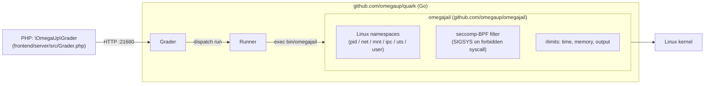

# Sandbox

When a contestant submits code, omegaUp has to compile it and run it against every test case on its own machines — someone else's untrusted C, C++, Python, Java, C#, Rust, or Karel program, executed at full native speed. The sandbox is the thing that makes that safe: it is the layer that lets the Runner run a stranger's `system("rm -rf /")` and have it do nothing at all.

The one fact to fix in your head before anything else: **none of this lives in the PHP monorepo.** Grep [`github.com/omegaup/omegaup`](https://github.com/omegaup/omegaup) for `minijail`, `sandbox`, or `quark` and you get zero hits. The PHP side (`\OmegaUp\Grader` in [`frontend/server/src/Grader.php`](https://github.com/omegaup/omegaup/blob/main/frontend/server/src/Grader.php)) only ever POSTs a submission to the Grader over HTTP at `OMEGAUP_GRADER_URL` (default `https://localhost:21680`) and then washes its hands. The sandbox is invoked by the **Runner**, one of the Go services in [`github.com/omegaup/quark`](https://github.com/omegaup/quark), and the Runner is — to reuse the mental model from the [Runner internals](../architecture/runner-internals.md) page — **basically a pretty, distributed frontend for Minijail.** Everything below is the sandboxing half of that sentence, unpacked.

## Where the sandbox came from: Moeval, Martin Mareš, and ptrace

The original omegaUp sandbox was *a very heavily modified version of Moeval* — the sandbox used at the [IOI](https://ioinformatics.org/), written by Martin Mareš. In its first incarnation the sandbox was, in essence, **a debugger**: it used Linux's `ptrace` system call to stop the contestant's process every single time it attempted a syscall, inspect that syscall to decide whether it was harmless or dangerous, and then do one of three things.

1. **Allow** the syscall to proceed normally — the common case for `read`, `write`, `mmap`, and the rest of the boring machinery a program needs to do useful work.
2. **Replace** the syscall with a harmless one and then make the process *believe the call failed*. The canonical trick is swapping the requested syscall for `getuid` (which is completely inert) and returning an error to the caller. This is exactly how the sandbox fakes the absence of a network: **every call to `socket` returns `-1`**, so the program is told, plausibly, that it simply has no networking — rather than being killed and leaking the fact that it was being watched.
3. **Kill** the process outright, if the syscall is *MUY evil* — something with no legitimate reason to appear in a contestant's program.

The modifications that turned Moeval into omegaUp's Sandbox — the ones that were *not* upstream — are worth preserving as institutional memory, because each was a real requirement someone hit:

- **Syscall mangling** (the replace-and-fake-an-error behavior above).
- **Multi-thread support**, so multi-threaded submissions could be traced correctly.
- **A verbose mode** for examining exactly which syscalls a program made — indispensable when a new language's runtime trips the filter and you need to see what it actually asked the kernel for.
- **Path normalization**, so the sandbox could say, for example, that `./` is also writable, instead of only recognizing a single canonical spelling of a path.
- **Reading parameters from a file**, so you could build a *profile per compiler / interpreter* rather than hard-coding limits in the sandbox itself. This is the ancestor of today's per-language configuration.
- Many, many, *many* small improvements.
- A version of Moeval **that does not use `ptrace`** — genuinely cross-platform, but far weaker on security, and therefore only ever a fallback.

!!! note "Why keep the ptrace story if the mechanism has moved on?"
    The `ptrace`-interposition design is the *lineage*, not the current hot path (see below). It is documented here on purpose: the `setrlimit`-by-`getuid` mangling trick and the "sockets return `-1`" behavior are the clearest possible explanation of *what a syscall sandbox is actually doing*, and the modern implementation solves the same problems by different means. If you strip this to "it intercepts syscalls," you have deleted the only paragraph that tells a new maintainer what the sandbox is *for*.

## What runs today: omegajail on top of minijail

The current sandbox is [**omegajail**](https://github.com/omegaup/omegajail), omegaUp's own wrapper around Google's [minijail](https://google.github.io/minijail/) — the same minijail that was built to sandbox processes on Chrome OS. Instead of single-stepping the process with `ptrace`, omegajail leans on the kernel's own isolation primitives: Linux **namespaces** (a private PID, network, mount, IPC, UTS, and user namespace, so the program can't see other processes, has no network interface, and gets a stripped-down filesystem view) plus a **seccomp-BPF** filter that the kernel enforces directly, with no tracer in the loop. That is why the whole thing is fast enough to run thousands of submissions.

The Runner never talks to minijail directly. It shells out to the `omegajail` binary, which is packaged with a self-contained root filesystem and shipped as its own artifact — see [`Dockerfile.minijail`](https://github.com/omegaup/quark/blob/de2cea4456201a264060761acda4694cc79b45ca/Dockerfile.minijail), which is literally `FROM scratch` plus `ADD bin/minijail-xenial-distrib-x86_64.tar.bz2 /`. On the Go side, the contract every sandbox must satisfy is the `Sandbox` interface in [`runner/sandbox.go`](https://github.com/omegaup/quark/blob/de2cea4456201a264060761acda4694cc79b45ca/runner/sandbox.go#L108-L133) — three methods, `Supported()`, `Compile(...)`, and `Run(...)` — and the production implementation is `OmegajailSandbox` ([sandbox.go#L135](https://github.com/omegaup/quark/blob/de2cea4456201a264060761acda4694cc79b45ca/runner/sandbox.go#L135)).

`OmegajailSandbox.Supported()` is a one-liner that just checks whether `bin/omegajail` exists under the *omegajail root* — which defaults to `/var/lib/omegajail` ([`common/context.go#L210`](https://github.com/omegaup/quark/blob/de2cea4456201a264060761acda4694cc79b45ca/common/context.go#L210)) and is turned into an absolute path and handed to `NewOmegajailSandbox(omegajailRoot)` when the Runner boots ([`cmd/omegaup-runner/main.go#L753`](https://github.com/omegaup/quark/blob/de2cea4456201a264060761acda4694cc79b45ca/cmd/omegaup-runner/main.go#L753)). If omegajail isn't installed, `Supported()` returns false and the Runner falls back to the no-op sandbox described at the end of this page.



## How the Runner invokes omegajail

Both `Compile` and `Run` build an argument vector and hand it to the private `invokeOmegajail` helper ([sandbox.go#L413](https://github.com/omegaup/quark/blob/de2cea4456201a264060761acda4694cc79b45ca/runner/sandbox.go#L413)), which prepends the path to `bin/omegajail`, sets `RUST_BACKTRACE=1` and `RUST_LOG=debug` in the child's environment (omegajail itself is written in Rust), and captures the sandbox's own stderr into a sidecar file named `<errorFile>.omegajail` so a crash *in the jailer* can be told apart from a crash *in the contestant's code*.

For a **run**, the flags are assembled in [`Run`](https://github.com/omegaup/quark/blob/de2cea4456201a264060761acda4694cc79b45ca/runner/sandbox.go#L321-L334) and read almost like a résumé of the sandbox's job:

```text
--homedir <chdir>            # the jailed working directory
-0 <inputFile>               # stdin  ← the test case's .in
-1 <outputFile>              # stdout → what we'll compare against .out
-2 <errorFile>               # stderr
-M <metaFile>                # where omegajail writes the .meta result (see below)
-m <bytes>                   # hard memory limit, in bytes
-t <ms>                      # CPU time limit, in milliseconds
-w <ms>                      # extra wall-clock time on top of the CPU limit
-O <bytes>                   # output limit, in bytes
--root <omegajailRoot>       # /var/lib/omegajail
--run <lang>                 # the language profile to load
--run-target <target>        # the compiled artifact to execute
```

A few of these carry non-obvious rules that live in the code, not in the flag names:

- **The memory limit passed to omegajail is not the problem's memory limit.** It is `base.Min(ctx.Config.Runner.HardMemoryLimit, limits.MemoryLimit)` ([sandbox.go#L319](https://github.com/omegaup/quark/blob/de2cea4456201a264060761acda4694cc79b45ca/runner/sandbox.go#L319)) — the hard limit is currently **640 MiB** ([context.go#L208](https://github.com/omegaup/quark/blob/de2cea4456201a264060761acda4694cc79b45ca/common/context.go#L208), commented in the source as *"640MB should be enough for anybody"*). The sandbox enforces the smaller of the two, so a problem author can't accidentally grant a submission more RAM than the machine is willing to hand out.
- **Java gets a grace period.** Before computing the time limit, `Run` does `if lang == "java" { timeLimit += 1000 }` — a flat **+1000 ms** to absorb JVM startup, because otherwise every Java submission would eat its entire budget getting the interpreter off the ground.
- **`/dev/null` is quietly swapped out.** If the input file would be the real `/dev/null`, the Runner substitutes an empty file under the omegajail root (`root/dev/null`) instead, because the jailed process has no business touching the host's device nodes.
- **Extra mount points become `--bind source:target`** — unless sandboxing is disabled, in which case they become symlinks, because you can't bind-mount without the sandbox (that branch is the `DisableSandboxing` handling at [sandbox.go#L335-L381](https://github.com/omegaup/quark/blob/de2cea4456201a264060761acda4694cc79b45ca/runner/sandbox.go#L335)).

Just before invoking omegajail, `Run` warms the page cache with an **input preloader** ([sandbox.go#L23](https://github.com/omegaup/quark/blob/de2cea4456201a264060761acda4694cc79b45ca/runner/sandbox.go#L23)): it `mmap`s the input file and walks it a page at a time, so the contestant's program spends less of its precious time limit blocked on disk reads for input it's guaranteed to touch. This is a pure latency optimization — if the `mmap` fails, it falls back to reading the whole file into `/dev/null` and moves on.

**Compilation** uses the same machinery with a different verb: `Compile` ([sandbox.go#L162](https://github.com/omegaup/quark/blob/de2cea4456201a264060761acda4694cc79b45ca/runner/sandbox.go#L162)) passes `--compile <lang>`, `--compile-target`, and one `--compile-source` per input file, with the working directory made writable via `--homedir-writable`, and it uses the *compile* budget rather than the *run* budget: **30 s** `CompileTimeLimit` and a **10 MiB** `CompileOutputLimit` ([context.go#L206-L207](https://github.com/omegaup/quark/blob/de2cea4456201a264060761acda4694cc79b45ca/common/context.go#L206)). Two language-specific warts are handled inline here rather than in a separate error pass: C# needs a `*.runtimeconfig.json` symlinked next to the source before it will compile, and for Java, if compilation "succeeds" but no `<Target>.class` file appears, the Runner rewrites the verdict to `CE` and appends the human-readable hint *"Make sure your class is named `X` and outside all packages"* — because the single most common Java mistake is a misnamed or packaged class.

## The `.meta` file: how a signal becomes a verdict

omegajail does not return a verdict. It runs the program, enforces the limits, and writes a small colon-delimited **`.meta` file** that the Runner parses back in `parseMetaFile` ([sandbox.go#L504](https://github.com/omegaup/quark/blob/de2cea4456201a264060761acda4694cc79b45ca/runner/sandbox.go#L504)). The recognized fields are `status` (exit code), `time`, `time-sys`, `time-wall` (all in microseconds, divided by `1e6` into seconds on the way in), `mem` (bytes), and — the interesting ones — `signal` / `signal_number` and `syscall` / `syscall_number`.

Translating that raw metadata into one of omegaUp's [verdicts](verdicts.md) is where the sandbox's whole security model surfaces as something a contestant sees:

| What omegajail reported | Verdict | Meaning |
|---|---|---|
| `signal: SIGSYS` | **RFE** | *Restricted Function Error* — the program made a forbidden syscall and seccomp shot it down. This is the modern equivalent of the old ptrace "kill" path. |
| `SIGILL`, `SIGABRT`, `SIGFPE`, `SIGKILL`, `SIGPIPE`, `SIGBUS`, `SIGSEGV` | **RTE** | Runtime error — crashed, aborted, divided by zero, segfaulted. |
| `SIGALRM`, `SIGXCPU` | **TLE** | Time limit exceeded — the CPU-time alarm or wall-clock alarm fired. |
| `SIGXFSZ` | **OLE** | Output limit exceeded — the program blew past `-O`. |
| no signal, `status == 0` | **OK** | Ran to completion cleanly (still has to produce the right answer to become AC). |
| no signal, non-zero status | **RTE** | Exited with a failure code. |

On top of the signal mapping, `parseMetaFile` applies two corrections that a bare table would hide. If the reported memory exceeds the problem's `MemoryLimit`, the verdict is overridden to **MLE** and the reported memory is clamped to the limit — and for Java specifically, a non-zero exit whose stderr contains `java.lang.OutOfMemoryError` is *also* treated as MLE (`isJavaMLE`, [sandbox.go#L611](https://github.com/omegaup/quark/blob/de2cea4456201a264060761acda4694cc79b45ca/runner/sandbox.go#L611)), because the JVM catches the allocation failure itself and exits gracefully instead of getting `SIGKILL`ed, so the signal-based path would miss it. And Karel programs (`kj` / `kp`) map exit status `1` (the interpreter's `INSTRUCTION` failure mode) to **TLE**, since a Karel program hitting its instruction cap is morally a timeout.

## Resource limits: the numbers, and where they default

The limits omegajail enforces are the problem's `LimitsSettings`, clamped by the Runner's hard ceilings. The currently-shipped defaults (all mutable per-problem, so treat these as *defaults*, not laws):

| Limit | Default | Source |
|---|---|---|
| CPU time per case | **1000 ms** | [`problemsettings.go#L191`](https://github.com/omegaup/quark/blob/de2cea4456201a264060761acda4694cc79b45ca/common/problemsettings.go#L191) |
| Memory | **256 MiB** | [`problemsettings.go#L188`](https://github.com/omegaup/quark/blob/de2cea4456201a264060761acda4694cc79b45ca/common/problemsettings.go#L188) |
| Output | **10 KiB** | [`problemsettings.go#L189`](https://github.com/omegaup/quark/blob/de2cea4456201a264060761acda4694cc79b45ca/common/problemsettings.go#L189) |
| Overall wall time | **5 s** | [`problemsettings.go#L190`](https://github.com/omegaup/quark/blob/de2cea4456201a264060761acda4694cc79b45ca/common/problemsettings.go#L190) |
| Extra wall time | **0** | [`problemsettings.go#L187`](https://github.com/omegaup/quark/blob/de2cea4456201a264060761acda4694cc79b45ca/common/problemsettings.go#L187) |
| Hard memory ceiling | **640 MiB** | [`context.go#L208`](https://github.com/omegaup/quark/blob/de2cea4456201a264060761acda4694cc79b45ca/common/context.go#L208) |
| Compile time | **30 s** | [`context.go#L206`](https://github.com/omegaup/quark/blob/de2cea4456201a264060761acda4694cc79b45ca/common/context.go#L206) |
| Compile output | **10 MiB** | [`context.go#L206`](https://github.com/omegaup/quark/blob/de2cea4456201a264060761acda4694cc79b45ca/common/context.go#L206) |
| Overall output | **100 MiB** | [`context.go#L209`](https://github.com/omegaup/quark/blob/de2cea4456201a264060761acda4694cc79b45ca/common/context.go#L209) |

The Runner-level defaults (`common/context.go`, around [L186](https://github.com/omegaup/quark/blob/de2cea4456201a264060761acda4694cc79b45ca/common/context.go#L186)) are looser — a **10 s** case time limit and a **1 GiB** memory limit — because they are the outer envelope; the per-problem settings are what actually reach omegajail, always taking the *minimum* of the two so no problem can escalate past the machine's ceiling.

## Kernel version matters: the SIGSYS fallback

omegajail's forbidden-syscall detection relies on a kernel feature that only became reliable in **Linux 5.13**. For older kernels, `OmegajailSandbox` carries an `AllowSigsysFallback` flag ([sandbox.go#L140-L142](https://github.com/omegaup/quark/blob/de2cea4456201a264060761acda4694cc79b45ca/runner/sandbox.go#L140)) that, when set, appends `--allow-sigsys-fallback` to the invocation so omegajail drops back to *the previous implementation of the sigsys detector*. If you are running the Runner on a pre-5.13 host and forbidden-syscall submissions are being mis-verdicted, this is the switch to reach for — but the fallback exists precisely because it is *worse* than the current mechanism, so the right long-term fix is a newer kernel, not the flag.

## Running without a sandbox: CI, dev boxes, and the no-op

You cannot always sandbox. Continuous integration containers, developer laptops, and anywhere unprivileged user namespaces are locked down simply can't run minijail. omegaUp handles this with two escape hatches, and it is worth understanding the difference:

- **`DisableSandboxing`** keeps the *real* `OmegajailSandbox` — you still compile and execute the contestant's code and get honest verdicts — but tells omegajail to run without the jail (`--disable-sandboxing`) and swaps bind-mounts for symlinks, since bind-mounting needs the sandbox. This is for when you want real grading but the host can't isolate.
- **`NoopSandbox`** ([`runner/noop_sandbox.go`](https://github.com/omegaup/quark/blob/de2cea4456201a264060761acda4694cc79b45ca/runner/noop_sandbox.go)) does *nothing at all*: it creates empty output / error / meta files and returns `Verdict: "OK"`, and `NoopSandboxFixupResult` then rewrites the whole run to **AC** with a full score. This is strictly for testing the plumbing *around* execution (queueing, dispatch, result reporting) without executing anything — never point it at real submissions, because it grades everyone as perfect.

## Related documentation

- [Runner Internals](../architecture/runner-internals.md) — how a submission reaches the sandbox, and the compile/run/validate loop around it.
- [Grader Internals](../architecture/grader-internals.md) — the queue and dispatch that feed the Runner.
- [Verdicts](verdicts.md) — the full verdict enum the `.meta` mapping produces (AC, PA, WA, TLE, MLE, OLE, RTE, RFE, CE, JE, …).
- [Security](../architecture/security.md) — where the sandbox sits in omegaUp's overall defense in depth.
