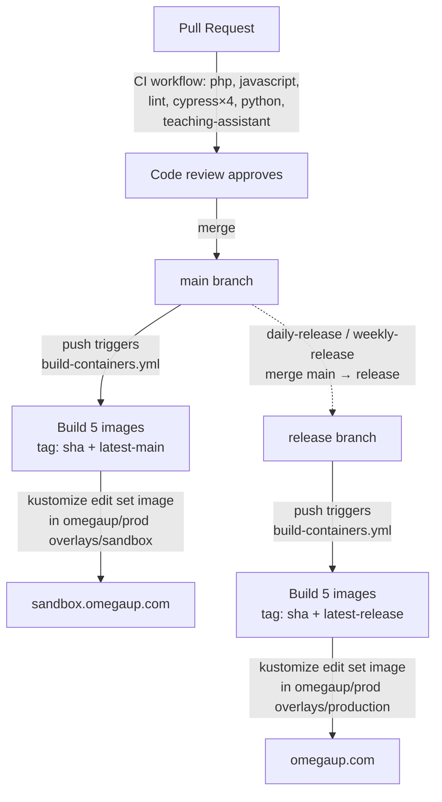

# Release and Deployment {#release-and-deployment}

This page traces the exact path a change takes from a merged pull request to running on [omegaup.com](https://omegaup.com): the GitHub Actions workflows that gate and build it, the five Docker images we ship, the two long-lived branches (`main` and `release`) that stand in for our two environments, and the GitOps hand-off that finally rolls the new images onto the Kubernetes cluster. Everything here lives in [`.github/workflows/`](https://github.com/omegaup/omegaup/tree/main/.github/workflows) and [`stuff/docker/`](https://github.com/omegaup/omegaup/tree/main/stuff/docker) in the [`omegaup/omegaup`](https://github.com/omegaup/omegaup) repo — when in doubt, read the YAML, because that is the source of truth and this page is just the map.

!!! abstract "The one-paragraph mental model"
    Two branches, two environments. Merging a PR into `main` builds fresh images and pushes them to **sandbox** ([sandbox.omegaup.com](https://sandbox.omegaup.com)). A scheduled job then fast-forwards those same commits from `main` into `release`, which builds the identical images again and pushes them to **production**. Nothing deploys by copying files onto a server — a workflow rewrites an image tag in the private [`omegaup/prod`](https://github.com/omegaup/prod) manifests repo, and the cluster reconciles itself to match. So "deploying" is really "committing a new image tag," and a rollback is "committing the old tag back."

## Two branches are the two environments {#two-branches-are-the-two-environments}

We don't tag semantic versions of the frontend and hand them to an ops team. Instead, two branches in the repo *are* the deployment surface, and their whole job is to mirror what is currently live:

- **`main`** holds the latest changes the review team has approved. Every merged PR lands here, and every landing rebuilds and redeploys **sandbox**. Sandbox is deliberately a lap ahead of production so that a bad change gets caught by us on `sandbox.omegaup.com` before real users on `omegaup.com` ever see it — the wiki's phrasing is that sandbox "gives us a buffer in case of errors in the latest changes," and that buffer is precisely the window in which we can revert a commit on `main` before it is ever promoted.
- **`release`** mirrors what is running in **production**. You never merge a PR into `release` by hand; a scheduled workflow merges `main` into it for you (see [Scheduled promotion](#scheduled-promotion-to-production) below). Because `release` only ever moves forward by absorbing already-reviewed, already-on-sandbox commits from `main`, production is by construction a strict subset of what sandbox has already survived.

This is why you should never commit directly to `release`, and why the promotion job uses a merge rather than a force-push: `release` must always be a real ancestor-plus of `main`, never a divergent history.

## The whole path, end to end {#the-whole-path-end-to-end}

Here is the full journey of a commit, which the rest of the page unpacks stage by stage:

## Stage 1 — CI must pass before merge {#stage-1-ci-must-pass-before-merge}

Before a PR can merge into `main`, it must be green on the [`CI`](https://github.com/omegaup/omegaup/blob/main/.github/workflows/ci.yml) workflow, which runs on every `pull_request` and on every `push` to `main` (and is also exposed as a reusable `workflow_call`). A `concurrency` group keyed on the PR number cancels any in-flight run when you push a new commit — `cancel-in-progress: true` — so you never burn runners double-testing a stale revision.

CI is not one check but a fan-out of jobs, and the gate before all of them is `verify-action-hashes`: it runs [`./hack/gha-reversemap.sh verify-mapusage`](https://github.com/omegaup/omegaup/blob/main/hack/gha-reversemap.sh) to confirm that every third-party GitHub Action is pinned to a full commit SHA rather than a mutable tag like `@v4`. That is a supply-chain defense — a tag can be re-pointed at malicious code under you, a 40-character SHA cannot — and it is why you'll see `actions/checkout@34e114876b0b11c390a56381ad16ebd13914f8d5` everywhere instead of `@v4` in our workflows.

The real test jobs then run in parallel:

| Job | What it actually does | Notable pins & timeouts |
|-----|-----------------------|--------------------------|
| **php** | PHPUnit controller/lib tests via [`./stuff/mysql_types.sh`](https://github.com/omegaup/omegaup/blob/main/stuff/mysql_types.sh), then Psalm static analysis, then Codecov upload | Spins up service containers `mysql:8.0.34` on port **13306**, `redis`, and `rabbitmq:3-management-alpine`; runs on **PHP 8.1** with APCu and XDebug coverage enabled; `timeout-minutes: 20` |
| **javascript** | `yarn test:coverage` (Jest unit tests over the Vue/TS components), then Codecov upload | **Node 20** with a yarn cache; `timeout-minutes: 10` |
| **lint** | `./stuff/lint.sh validate --all` inside the `omegaup/hook_tools:v1.0.9` container, plus Psalm over the PHP tree, plus `./stuff/unused_translation_strings.py`, plus a check that `APITool.php --file api.py` still emits valid Python | Reuses the pinned hook_tools image so local and CI linting agree byte-for-byte |
| **cypress** | End-to-end browser tests, `cypress run --browser chrome`, sharded across a 4-way matrix | `timeout-minutes: 25`; waits on `grader:21680` before starting (see below) |
| **python** | `pytest` over `stuff/` (the cronjobs, migration tooling, and helper scripts) inside the `frontend` container | `--timeout=20` per test |
| **teaching-assistant** | Exercises the AI editorial worker end-to-end in course-mode and submission-mode | Runs the real `teaching_assistant.py` against a seeded course |

Two details in the **php** job are worth internalizing because they are exactly what breaks when a PR touches the schema. First, before any test runs, CI downloads the **Go gitserver** binary — `omegaup-gitserver.tar.xz` from [`omegaup/gitserver` release `v1.9.13`](https://github.com/omegaup/gitserver/releases/tag/v1.9.13) — plus `libinteractive.jar` `v2.0.27`, because the PHP tests need a live gitserver to store problem git repositories against. This is a concrete reminder that the grader stack lives in *other* repos ([`omegaup/quark`](https://github.com/omegaup/quark) for the grader/runner/broadcaster, [`omegaup/gitserver`](https://github.com/omegaup/gitserver) for problem storage) and is consumed here as pinned release artifacts, never built from this monorepo.

Second, CI validates the database migrations *as migrations*, not just by running them: [`stuff/db-migrate.py validate`](https://github.com/omegaup/omegaup/blob/main/stuff/db-migrate.py) checks the scripts under [`frontend/database/`](https://github.com/omegaup/omegaup/tree/main/frontend/database), then `db-migrate.py migrate --databases=omegaup-test` applies them to a fresh MySQL, and finally `stuff/policy-tool.py validate` and `stuff/database_schema.py validate` assert the resulting schema matches the checked-in policy. If you add a column but forget to regenerate the schema, this is the job that fails you — long before production.

!!! note "Why Cypress waits on `grader:21680`"
    The e2e step runs `wait-for-it -t 30 grader:21680` before launching Chrome. Port **21680** is the grader's HTTP endpoint (the same `OMEGAUP_GRADER_URL` default of `https://localhost:21680` that the PHP `\OmegaUp\Grader` client dials in production). A submission-flow test that starts before the grader is listening would flake, so the whole Cypress shard blocks on that port coming up.

### Cypress runs in four shards {#cypress-runs-in-four-shards}

The Cypress suite is deliberately split into a `fail-fast: false` matrix of four shards so the ~25-minute wall-clock cost is paid in parallel instead of serially, and so one flaky spec doesn't cancel the others:

| Shard | Name | Specs |
|-------|------|-------|
| 1 | `contest-group` | `contest.cy.ts`, `problem_collection.cy.ts`, `group.cy.ts` |
| 2 | `courses` | `course_2Part.cy.ts`, `course.cy.ts`, `certificate.cy.ts`, `navigation.cy.ts` |
| 3 | `ide-basics` | `ide.cy.ts`, `basic_commands.cy.ts` |
| 4 | `problem-creator` | `problem_creator.cy.ts` |

On failure, every shard uploads its screenshots and videos as run artifacts (guarded by `if: always() && hashFiles(...)`), and dumps `docker logs` for every running container into `frontend/tests/runfiles/containers/` — so when a run goes red, the evidence is already attached to the workflow run and you don't have to reproduce locally to see what the browser saw.

## Stage 2 — merge to `main` builds and deploys sandbox {#stage-2-merge-to-main-builds-and-deploys-sandbox}

The moment your reviewed PR merges, the push to `main` fires [`build-containers.yml`](https://github.com/omegaup/omegaup/blob/main/.github/workflows/build-containers.yml). This is the workflow that turns source into shippable artifacts. It triggers on pushes to **both** `main` and `release`, and the branch it fires on decides which environment it targets — same build steps, different deploy target at the end.

### The five images we build {#the-five-images-we-build}

The build step runs `docker compose --file=docker-compose.k8s.yml build` with `DOCKER_BUILDKIT=1` and `TAG=${{ github.sha }}`, building five services declared in [`docker-compose.k8s.yml`](https://github.com/omegaup/omegaup/blob/main/docker-compose.k8s.yml). Four of them are stage targets of a single multi-stage [`Dockerfile.frontend`](https://github.com/omegaup/omegaup/blob/main/stuff/docker/Dockerfile.frontend); the fifth has its own Dockerfile:

| Image | Build target | What's inside and why |
|-------|--------------|------------------------|
| **`omegaup/php`** | `php` stage, `ubuntu:jammy` | The application runtime: `php8.1-fpm` plus `php8.1-{apcu,curl,gmp,mbstring,mysql,opcache,redis,xml,zip}`, the New Relic PHP agent, `openjdk-18-jre-headless` and `libinteractive.jar` (needed for interactive problems). Runs `php-fpm8.1 --nodaemonize --force-stderr` on port **9001**; `STOPSIGNAL SIGQUIT` so php-fpm drains gracefully instead of dropping in-flight requests |
| **`omegaup/nginx`** | `nginx` stage, `ubuntu:jammy` | The web server that terminates HTTP on port **8001** and hands PHP requests to the php-fpm container |
| **`omegaup/frontend`** | `frontend` stage, `alpine:latest` | Not a running service — a thin data image that carries the *built* `/opt/omegaup` (compiled webpack bundles, `composer install --no-dev`'d vendor tree, precompiled Twig templates) and `rsync`s it into place for the others to serve |
| **`omegaup/frontend-sidecar`** | `frontend-sidecar` stage, `ubuntu:jammy` | Ships `mysql-client-core-8.0`, `git`, and the Python requirements — this is the pod that runs database migrations and housekeeping alongside the app |
| **`omegaup/ai-editorial-worker`** | [`Dockerfile.ai-editorial-worker`](https://github.com/omegaup/omegaup/blob/main/stuff/docker/Dockerfile.ai-editorial-worker) | The Python worker that generates AI editorials/feedback (the same code the `teaching-assistant` CI job exercises) |

The heavy lifting happens in the shared `build` stage. It clones the repo at `--branch=${BRANCH}` (default `release`, overridden per-run by the `--build-arg BRANCH=<branch>` the workflow passes), then: builds the reKarel bundle (`npm install && npx gulp && npm run build` under `frontend/www/rekarel`), runs `yarn build` to produce the Webpack 5 assets, runs `composer install --no-dev --classmap-authoritative` for an optimized autoloader, writes a production `config.php` (`OMEGAUP_ENVIRONMENT = 'production'`, cache implementation `none`, `TEMPLATE_CACHE_DIR = /var/lib/omegaup/templates`), and finally runs [`CompileTemplatesCmd.php`](https://github.com/omegaup/omegaup/blob/main/frontend/server/cmd/CompileTemplatesCmd.php) to pre-compile the Twig templates into `/var/lib/omegaup/templates`. Compiling templates at build time is why production never pays the Twig-compile cost on the first request after a deploy.

### Every image is tagged twice, pushed to two registries {#every-image-is-tagged-twice-pushed-to-two-registries}

After the build, the workflow logs into **both** registries and pushes each of the five images under **two** tags:

- **`${{ github.sha }}`** — the immutable, exact-commit tag. This is the one deployments actually pin to, so a given production rollout is traceable to one specific commit and can never silently drift.
- **`latest-<branch>`** — a moving pointer (`latest-main` or `latest-release`) for humans and tooling that just want "the newest sandbox/prod build."

Both tag sets go to GitHub Container Registry (`ghcr.io/omegaup/...`, authenticated with the run's `github.token`) *and* to Docker Hub (`omegaup/...`, authenticated with the `DOCKER_USERNAME` / `DOCKER_PASSWORD` secrets). Publishing to two registries is redundancy on purpose: if one is down or rate-limiting during a deploy, the cluster can still pull from the other.

### GitOps: the deploy is a commit to `omegaup/prod` {#gitops-the-deploy-is-a-commit-to-omegaupprod}

Here is the step that surprises people the first time: nothing in this workflow SSHes into a server or restarts a service. Instead, on a `main` push the final step (guarded by `if: github.ref == 'refs/heads/main'`) clones the private [`omegaup/prod`](https://github.com/omegaup/prod) manifests repo, `cd`s into `k8s/omegaup/overlays/sandbox/frontend`, and runs `kustomize edit set image` to rewrite all five image references to the new `${{ github.sha }}` tag, patches the `app.kubernetes.io/version` label to the same SHA, then `git commit` + `git push` as `omegaup-bot`.

That commit is the deploy. A GitOps reconciler watching `omegaup/prod` notices the manifest changed and rolls the sandbox Deployment to the new images. To ship to production instead, the *identical* step runs behind `if: github.ref == 'refs/heads/release'` and edits `overlays/production/frontend` instead of `overlays/sandbox/frontend`. Same five `kustomize edit set image` lines, same SHA-pinning, different overlay directory — that single conditional is the entire difference between "deploy to sandbox" and "deploy to production."

## Scheduled promotion to production {#scheduled-promotion-to-production}

Production isn't deployed by a human clicking a button. Two scheduled workflows promote `main` into `release`, and once `release` moves, [Stage 2](#stage-2-merge-to-main-builds-and-deploys-sandbox) does the rest automatically:

- [`daily-release.yml`](https://github.com/omegaup/omegaup/blob/main/.github/workflows/daily-release.yml) — `cron: '0 3 * * 0'`, i.e. **Sundays at 03:00 UTC (20:00 PT)**. Despite the name it currently runs weekly, not daily; the file even carries a `TODO(#1624): Make this daily once we have better coverage of the frontend`, which is a candid note that we don't yet trust the automated suite enough to promote every day.
- [`weekly-release.yml`](https://github.com/omegaup/omegaup/blob/main/.github/workflows/weekly-release.yml) — `cron: '0 3 * * 1'`, i.e. **Mondays at 03:00 UTC (Sunday 20:00 PT)**.

Both do the same core thing: they `POST` to the GitHub `/repos/omegaup/omegaup/merges` API with `{"base":"release","head":"main"}`, authenticated with the `OMEGAUPBOT_RELEASE_TOKEN` secret, to merge `main` into `release`. They parse the JSON response and hard-fail if it lacks a commit `sha` or comes back `merged: false`, so a silently failed promotion can't masquerade as success. Both can also be kicked off out-of-band via a `repository_dispatch` of type `daily-release` / `weekly-release` when someone needs to cut a release off-schedule.

The two workflows differ in exactly one guardrail, and it's an important one.

!!! warning "The daily release refuses to ship schema changes"
    Before merging, `daily-release.yml` runs `git diff --quiet origin/release:frontend/database origin/main:frontend/database` and **aborts the release** if there is any difference. In plain terms: the fast, frequent release path will not carry a database migration to production on its own. Schema changes are held for the `weekly-release` path (which has no such check), so that a migration lands on production on a predictable cadence with humans watching, rather than sliding out on an automated daily cron. This is the deployment-side reason your schema-touching PR may sit on sandbox for several days before reaching `omegaup.com`.

!!! note "Pausing all releases with `.pause-release`"
    Both workflows first check `git cat-file -e origin/main:.pause-release` and skip the release if that file exists on `main`. So the kill-switch for "do not promote anything to production right now" — during an incident, a freeze, or a known-bad window — is simply to commit a file named [`.pause-release`](https://github.com/omegaup/omegaup) at the repo root. Delete it to resume. No workflow edits, no secret rotation, just one file whose mere presence stops the cron.

## Backend services release on their own cadence {#backend-services-release-on-their-own-cadence}

Everything above ships the **frontend** (the PHP/nginx/Vue app). The grader stack is separate code with separate versioning, and you can read its current pinned versions straight out of [`docker-compose.yml`](https://github.com/omegaup/omegaup/blob/main/docker-compose.yml):

| Service | Image (currently) | Source repo |
|---------|-------------------|-------------|
| Grader | `omegaup/backend:v1.9.35` | [`omegaup/quark`](https://github.com/omegaup/quark) |
| Broadcaster | `omegaup/backend:v1.9.35` | [`omegaup/quark`](https://github.com/omegaup/quark) |
| Runner | `omegaup/runner:v1.9.35` | [`omegaup/quark`](https://github.com/omegaup/quark) |
| Gitserver | `omegaup/gitserver:v1.9.13` | [`omegaup/gitserver`](https://github.com/omegaup/gitserver) |

These are pinned semantic-version tags, bumped deliberately when a new grader/runner release is cut in `omegaup/quark` — not rebuilt on every frontend merge the way the five app images are. The frontend reaches the grader over HTTP at `OMEGAUP_GRADER_URL` (default `https://localhost:21680`), so a frontend deploy and a grader deploy are genuinely independent events. When you're diagnosing a production issue, this separation matters: a broken submission verdict is very likely a `v1.9.35` backend concern in `omegaup/quark`, while a broken page render is a frontend-image concern in this repo.

## Rolling back {#rolling-back}

Because a deploy is just a commit that pins an image SHA in `omegaup/prod`, a rollback is the same move in reverse: point the manifest back at the previous known-good `${{ github.sha }}` tag and let the cluster reconcile. Every historical build is still in both registries under its immutable commit SHA, so there is always a concrete tag to roll back *to* — you are never rebuilding to recover, only re-pinning.

This is exactly what the sandbox "buffer" buys us in practice. Because `main`/sandbox always run ahead of `release`/production, a regression usually surfaces on `sandbox.omegaup.com` first, and reverting the offending commit on `main` (which rebuilds sandbox) keeps it from ever being promoted into `release` at the next scheduled window. The cheapest rollback is the one where the bad change never reaches production because sandbox caught it and `.pause-release` bought time.

!!! danger "Database migrations are the one thing you can't trivially revert"
    Image rollbacks are cheap and total; schema changes are not. This is the whole reason `daily-release.yml` walls off `frontend/database` diffs from the automated path. Write migrations to be backward compatible — the previous image must be able to run against the new schema — so that rolling the *image* back does not require rolling the *schema* back. If you ever need to reverse a migration, that is a deliberate, human-run operation against the database, not something a manifest revert does for you.

## Related Documentation {#related-documentation}

- **[Monitoring](monitoring.md)** — New Relic, Prometheus, and the metrics to watch after a deploy
- **[Troubleshooting](troubleshooting.md)** — common failures and how to read the logs
- **[Docker Setup](docker-setup.md)** — the local `docker-compose.yml` stack these images mirror
- **[Testing](../development/testing.md)** — the test suites that gate every merge in Stage 1
