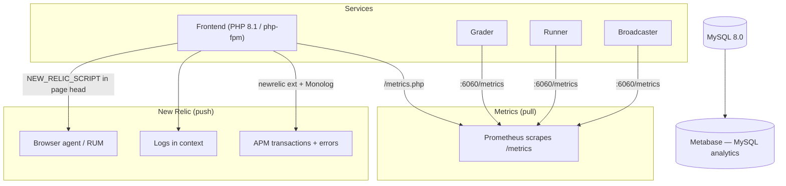

# Monitoring

omegaUp is not one program but a fleet of them: the PHP frontend behind nginx, the Go grader, its runners, the broadcaster, and gitserver, all talking to MySQL, Redis, and RabbitMQ. When a contest is live and a few thousand people are all hammering the same three problems, "is the site okay?" stops being a yes/no question and becomes "is the queue draining, are the runners alive, and is any single API method suddenly throwing 500s?" That is the question the observability stack exists to answer, and it answers it with a small, deliberately boring set of tools: **Prometheus** for the numbers, **New Relic** for traces, errors, and logs-in-context, and **Metabase** for after-the-fact product and data analysis. Deployments themselves are watched by **Argo CD**, which reconciles what is actually running in the Kubernetes cluster against what Git says should be running.

Nothing here is exotic on purpose. Every service publishes plain Prometheus text on a `/metrics` endpoint, every PHP request enriches a New Relic transaction if the agent is present and silently does nothing if it isn't, and the whole thing degrades to "still works, just blind" in a dev container where none of the agents are installed.

## Overview

The important split to keep in your head: **Prometheus pulls, New Relic pushes.** Prometheus reaches out and scrapes an endpoint you expose; New Relic's PHP agent and Monolog enricher ship data outward from inside the request. That is why a firewalled or agent-less box still produces Prometheus metrics (as long as the scraper can reach it) but produces no New Relic data at all.

## Prometheus: the numbers

### The PHP frontend

The frontend's Prometheus integration is a single small wrapper, `\OmegaUp\Metrics` in `frontend/server/src/Metrics.php`, built on the `promphp/prometheus_client_php` client (currently pinned to `^v2.4.0` in `composer.json`). On construction it picks a storage adapter based on whether APCu is available: `\Prometheus\Storage\APC` in production (so counters survive across requests in the php-fpm worker pool's shared memory) and `\Prometheus\Storage\InMemory` as the fallback, which resets every request and is really only useful in tests. That choice matters — if APCu is missing, your counters silently reset on every request and your rates look like noise.

There is exactly one place that writes application metrics today, and it is the request funnel itself. `\OmegaUp\ApiCaller::call()` (`frontend/server/src/ApiCaller.php`) calls `\OmegaUp\Metrics::getInstance()->apiStatus($methodName, $status)` twice: once on the success path with status `200`, and once on the failure path with the actual API exception's HTTP code. Each call bumps two counters:

- `frontend_api_request_status_count{api, status}` — a counter keyed by the API method name (e.g. `/api/run/create/` shows up as the method) **and** the resulting status code, so you can ask "how many 401s did `run.create` throw in the last five minutes" with a single `rate()`.
- `frontend_api_request_total{api}` — the same thing without the status label, i.e. total calls per method, which is the denominator when you want an error *ratio* rather than an error *count*.

Those two are enough to compute the two signals that actually predict an outage: request rate per endpoint and the fraction of them that aren't `200`. There is no per-endpoint latency histogram on the PHP side today — latency lives in New Relic (see below), because that is where you also get the flame graph to explain *why* a call was slow, which a bare Prometheus number can't give you.

Prometheus scrapes the frontend at `frontend/www/metrics.php`, which is about as thin as a page gets: it requires `bootstrap.php` and calls `\OmegaUp\Metrics::getInstance()->render()`. `render()` sets `Content-type: text/plain` (via `\Prometheus\RenderTextFormat::MIME_TYPE`) and echoes the exposition format. Point a scrape job at that path and you're done.

### The grader

The grader is the component you actually stare at during a contest, and it is the most heavily instrumented. Its metrics live in the Go `omegaup/quark` repo at `cmd/omegaup-grader/metrics.go`, served by `promhttp.Handler()` on a dedicated port — `Metrics.Port`, which defaults to `6060` (see `MetricsConfig` in `common/context.go`). Everything is namespaced `quark` with subsystem `grader`, so the wire names read `quark_grader_*`.

The queue gauges are the heart of it, and there is one per priority tier because the grader keeps separate queues rather than one big one:

| Metric | What it tells you |
|--------|-------------------|
| `quark_grader_queue_total_length` | Everything waiting, across all queues. The single number to alert on. |
| `quark_grader_queue_high_length` | High-priority backlog — interactive/contest submissions that people are staring at. |
| `quark_grader_queue_normal_length` | Normal-priority backlog. |
| `quark_grader_queue_low_length` | Low-priority backlog (rejudges and other bulk work that must not starve the live queues). |
| `quark_grader_queue_ephemeral_length` | The ephemeral queue, used by the "run this in the arena" scratch executions that never touch the database. |

Paired with each queue is a summary, `quark_grader_queue_delay_seconds` (and the per-tier `quark_grader_queue_{high,normal,low,ephemeral}_delay_seconds`), which measures how long a run sat in a queue before a runner picked it up. These are exported with quantile objectives `0.5`, `0.9`, and `0.99` (the `{0.5: 0.05, 0.9: 0.01, 0.99: 0.001}` targets in the code), so `quark_grader_queue_delay_seconds{quantile="0.99"}` is your p99 wait — the honest "how bad is it for the unluckiest submitter right now" number, which is exactly the one that matters when a queue length looks fine on average but a few submissions are stuck behind a slow problem.

Throughput and health come from counters and a gauge-vector:

- `quark_grader_runs_total` — every graded run. Its `rate()` is your submissions-per-second.
- `quark_grader_ephemeral_runs_total`, `quark_grader_ci_jobs_total` — the scratch-run and problem-CI variants, counted separately so bulk CI activity doesn't masquerade as contest load.
- `quark_grader_runs_retry`, `quark_grader_runs_abandoned` — a run gets retried when its runner disappears mid-grade; it gets *abandoned* when retrying doesn't help. A rising `runs_abandoned` is the metric that says "runs are being silently dropped," which is far worse than a slow queue.
- `quark_grader_runs_je` — runs that ended in a `JE` (Judge Error) verdict. This should be flat at zero; any slope means the grader itself is broken, not the submitted code.
- `quark_grader_runner_up{runner_hostname, runner_public_ip}` — a gauge set to `1` for every runner the grader has heard from recently. The grader considers a runner alive only if it has checked in within the last 3 minutes (the `-3 * time.Minute` cutoff in `gaugesUpdate`); once a runner goes stale, the whole vector is `Reset()` and repopulated, so a runner that dies simply vanishes from the series. Summing this gauge gives you the live runner count, and watching it drop is how you catch a runner host falling over before the queue visibly backs up.

The grader also exports host vitals as `os_cpu_load1` / `os_cpu_load5` / `os_cpu_load15`, `os_mem_total` / `os_mem_used`, and `os_disk_total` / `os_disk_used`, refreshed once a minute by a ticker in `gaugesUpdate()` (via `gopsutil`'s `load`, `mem`, and `disk` helpers). `disk_used` climbing toward `disk_total` is the classic silent grader killer — the box fills up with problem inputs and grading stops — so it earns its own gauge.

One extra endpoint worth knowing: alongside `/metrics`, the grader serves `/metrics/runners`, which returns a JSON list of the currently-alive runners in Prometheus **file service-discovery** shape (`targets` + `labels`, again using the 3-minute freshness cutoff). That is how Prometheus learns which runner boxes to scrape without anyone hand-editing a target list every time the runner fleet scales up or down.

### The runner and the broadcaster

Each runner exposes its own `/metrics` (same `quark` namespace, subsystem `runner`). The load-bearing series are `quark_runner_validator_errors` (a rising count here means custom validators are crashing, which silently turns correct submissions into wrong verdicts) plus a family of `quark_benchmark_*` gauges — `io_time`, `cpu_time`, `memory_time` and their `_wall_time` / `_memory` companions — that record how the box performs against a known benchmark, so you can tell a genuinely overloaded runner from one that was just handed a heavy problem. It also reports the same `os_*` host vitals as the grader.

The broadcaster — the service that fans contest events out to browsers over SSE and WebSockets — exports (subsystem `broadcaster`): `broadcaster_websockets_count` and `broadcaster_sse_count` (currently-open connections of each kind), `broadcaster_messages_total` (messages sent), and `broadcaster_channel_drop_total`. That last one is the alarm: a dropped channel write means a client was too slow to keep up and got cut off, so `channel_drop_total` climbing during a contest means people are missing live scoreboard updates. Dispatch and processing latency come from the `broadcaster_dispatch_latency_seconds` and `broadcaster_process_latency_seconds` summaries.

Every Go service also emits a `build_info` counter carrying `version` and `go_version` const labels, which exists purely so you can confirm from Prometheus which binary version is actually running on each host after a deploy — useful when a rollout is half-applied and half the runners are on the old version.

## The application-facing queue status

Prometheus is the operator's view. There is a second, separate status path meant for the app itself. `\OmegaUp\Grader::status()` in `frontend/server/src/Grader.php` issues a `curl` request to `OMEGAUP_GRADER_URL . '/grader/status/'` (with `OMEGAUP_GRADER_URL` defaulting to `https://localhost:21680`) and gets back a small JSON blob — `run_queue_length`, `runner_queue_length`, `runners`, `broadcaster_sockets`, and `embedded_runner` — surfaced through `\OmegaUp\Controllers\Grader::apiStatus()`. This is what renders the little queue indicator inside the site, not what Prometheus scrapes. In a dev environment where `OMEGAUP_GRADER_FAKE` is set, `status()` short-circuits and returns an all-zeros structure so the UI doesn't error out when there is no real grader behind it. Don't reach for this to build dashboards — it's a point-in-time snapshot with no history; that's what the `/metrics` scrape is for.

## New Relic: traces, errors, and logs in context

Where Prometheus tells you *that* something is slow or failing, New Relic tells you *which line* and *for whom*. The integration has three prongs, and all three are written to be no-ops when the agent isn't installed, because the dev containers don't ship the `newrelic` PHP extension and nobody wants the app to break there.

**Transaction naming.** `\OmegaUp\Request` calls `\OmegaUp\NewRelicHelper::nameTransaction("/api/{$this->methodName}")` so that every API call shows up in New Relic under its own name — `run.create`, `contest.details`, and so on — instead of everything collapsing into one anonymous `index.php` transaction. Without this, APM latency is useless because you can't tell which endpoint is the slow one.

**Error reporting.** When `ApiCaller::call()` catches an exception it hasn't otherwise handled, it routes it through `\OmegaUp\NewRelicHelper::noticeError()`, which forwards to `newrelic_notice_error()` — but only after `isAvailable()` confirms the extension is loaded and the functions exist. `NewRelicHelper` (`frontend/server/src/NewRelicHelper.php`) is the whole seam: `noticeError`, `nameTransaction`, `addCustomAttribute`, and a `getStatus()` you can call to debug whether the agent is even wired up. Every method guards on `extension_loaded('newrelic')` first, which is exactly why the same code runs fine on a laptop with no agent.

**Logs in context.** The root logger is configured once in `frontend/server/bootstrap.php`. It builds a Monolog `Logger` named `omegaup` writing to `OMEGAUP_LOG_FILE` (default `/var/log/omegaup/omegaup.log`) at level `OMEGAUP_LOG_LEVEL` (default `info`), and here is the clever part: if `\NewRelic\Monolog\Enricher\Formatter` exists (from the `newrelic/monolog-enricher` package), it uses that formatter and pushes a `\NewRelic\Monolog\Enricher\Processor` onto the logger; otherwise it falls back to a plain `\Monolog\Formatter\LineFormatter`. The enricher stamps each log line with the New Relic trace/entity IDs, which is what lets you jump from a slow transaction straight to the exact log lines that request emitted. A `\Monolog\Processor\WebProcessor` is always added (request URL, method, IP), and `\Monolog\ErrorHandler::register()` wires PHP's own errors into the same logger so a fatal doesn't escape unlogged.

**Browser agent (RUM).** The frontend can also inject New Relic's browser script into the page head. The Twig shell `frontend/templates/template.tpl` emits `{{ NEW_RELIC_SCRIPT|raw }}` inside ``, so real-user monitoring only turns on when the `NEW_RELIC_SCRIPT` config value is set (it defaults to `null`, i.e. off, in `config.default.php`, alongside `NEW_RELIC_SCRIPT_HASH`, which exists so the inline script can be allow-listed in the Content-Security-Policy without weakening it). This is what captures actual page-load timing from real browsers rather than server-side timing alone.

## Metabase and Argo CD

Two more tools round out the picture, and both are named in omegaUp's operational notes rather than in the codebase, because they observe the system from the outside.

**Metabase** is the data-analysis and reporting layer. It connects to the production MySQL and lets people build queries and dashboards without hand-writing SQL — the questions it answers are product questions ("how many users solved at least one problem this month") rather than operational ones ("is the queue draining"). It has historically been the flaky one of the bunch; if it's showing a connection error, that's Metabase's link to the database being down, not the site itself, and the site is entirely fine without it.

**Argo CD** watches deployments rather than traffic. It is the continuous-delivery controller for the Kubernetes cluster, and it treats Git as the single source of truth: it continuously compares the desired state declared in the deployment repo against what is actually running in the cluster and flags (or reconciles) any drift. When you want to know "did my change actually roll out, and is every replica on the new version," Argo CD's sync status is the first place to look — and it pairs naturally with the `build_info` metric above, which confirms the same thing from the running binary's own mouth.

## A worked example: "submissions feel slow"

The whole point of having these tools is that a vague report resolves into a specific cause in a couple of queries. When someone says submissions are slow during a contest, walk the chain in dependency order:

1. **Is the queue actually backed up?** Look at `quark_grader_queue_total_length` and the per-tier `quark_grader_queue_high_length`. If total is flat and low, the grader is keeping up and the problem is elsewhere (frontend, network). If it's climbing, keep going.
2. **Are runners disappearing?** Sum `quark_grader_runner_up`. A drop here — a runner host that stopped checking in within its 3-minute window — means less grading capacity, and the queue will grow no matter how healthy the grader is. Cross-check with Argo CD to see if a bad rollout took runners down.
3. **Is a single problem the culprit?** Check `quark_grader_queue_delay_seconds{quantile="0.99"}` against the median. A huge p99 with a normal p50 means most runs are fine but a few are stuck behind one expensive problem, not a general capacity shortage.
4. **Is the grader itself erroring rather than just slow?** Watch `quark_grader_runs_retry` and especially `quark_grader_runs_abandoned` and `quark_grader_runs_je`. Any slope on abandoned or JE means runs are being dropped or the judge is broken — a correctness incident, not a performance one.
5. **Or is it the frontend, not the grader at all?** Back on the PHP side, `rate(frontend_api_request_status_count{api="run.create", status!="200"}[5m])` over `rate(frontend_api_request_total{api="run.create"}[5m])` gives the error ratio for submissions, and New Relic's `run.create` transaction (named for exactly this reason) shows whether the time is going into MySQL, the grader HTTP call, or PHP itself — with the enriched log lines from that request one click away.

## A note on hostnames

The dashboards, the New Relic account, the Metabase instance, and the Argo CD console all live behind private, authenticated URLs that aren't published here on purpose. If you need access, that's a credentials-and-permissions conversation with the maintainer team, not a link you paste into a browser.

## Related Documentation

- **[Troubleshooting](troubleshooting.md)** — turning a symptom into a fix
- **[Infrastructure](../architecture/infrastructure.md)** — how the services fit together
- **[Deployment](deployment.md)** — what Argo CD is reconciling against
