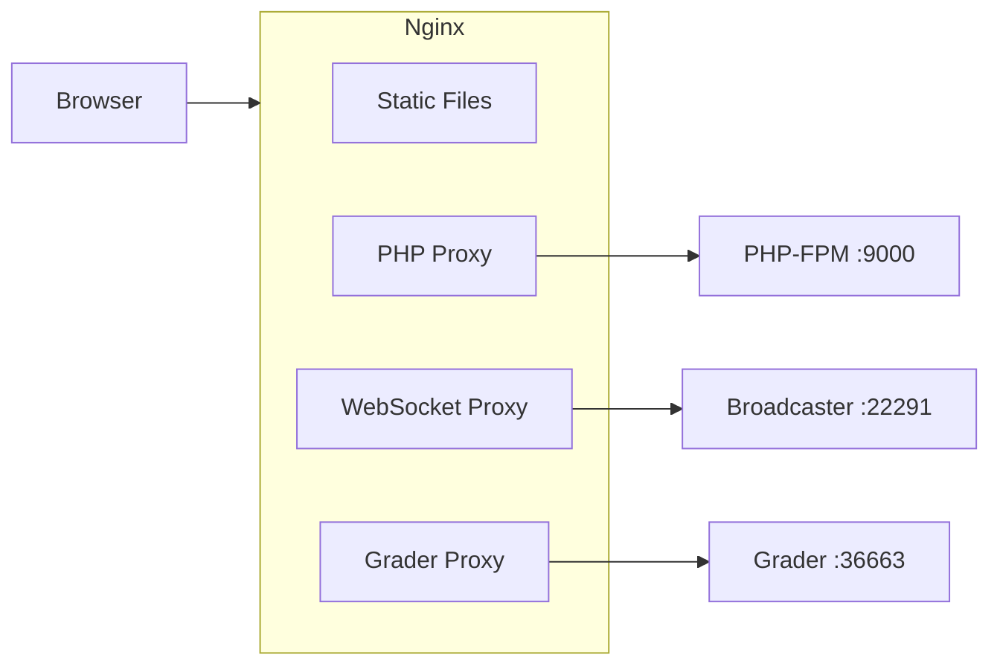

# Nginx Configuration

nginx is the single front door to omegaUp. Every request a browser makes — a page
load, an `/api/` call, a WebSocket for live scoreboard events, a problem image — arrives
at nginx first, and nginx decides one of three things: serve the file straight off disk,
hand it to php-fpm over FastCGI, or reverse-proxy it to one of the backend Go services.
There is no application logic here; nginx is deliberately dumb. Its whole job is routing
and caching, and the interesting part is _why each route exists_, because most of them
encode a decision made years ago that is easy to break if you don't know the reason.

The two files that matter are `stuff/docker/etc/nginx/nginx.conf` (the server block, the
php-fpm upstream, the two proxies) and `frontend/server/nginx.rewrites` (the `/api/`
funnel, every pretty URL, and the cache headers). The `.conf` `include`s the `.rewrites`
file at the very bottom of the `server` block, so read them as one document.

## The three kinds of traffic



Static files (the Webpack bundles under `/dist/`, `/third_party/`, `/css`, `/js/`,
images) never touch PHP — nginx reads them off `/opt/omegaup/frontend/www` and returns
them directly, which is the whole point of putting nginx in front of an interpreted
language. Anything ending in `.php`, and everything under `/api/` (which gets _rewritten_
to a `.php` file, see below), goes to php-fpm on `127.0.0.1:9000`. The two long-lived,
stateful things — the WebSocket stream at `/events/` and the grader's ephemeral web
interface at `/grader/` — get proxied to the separate Go backend services, because PHP
behind FastCGI has no business holding a socket open for the length of a contest.

## The development server block

The dev configuration lives at `stuff/docker/etc/nginx/nginx.conf` and is what runs
inside the `frontend` container. It is intentionally minimal — one worker, logs to
stderr so `docker-compose logs` picks them up, and everything scoped to a single
`server` block:

```nginx
daemon off;
pid /tmp/nginx.pid;
worker_processes 1;

error_log /dev/stderr error;

events {
  worker_connections 1024;
}

http {
  client_body_temp_path /tmp/client_body;
  fastcgi_temp_path /tmp/fastcgi_temp;
  proxy_temp_path /tmp/proxy_temp;
  scgi_temp_path /tmp/scgi_temp;
  uwsgi_temp_path /tmp/uwsgi_temp;
  access_log /dev/stderr;

  proxy_busy_buffers_size 512k;
  proxy_buffers 4 512k;
  proxy_buffer_size 256k;

  include /etc/nginx/mime.types;

  upstream php {
    server 127.0.0.1:9000;
  }

  server {
    listen 8001 default_server;
    listen [::]:8001 default_server ipv6only=on;
    port_in_redirect off;
    absolute_redirect off;

    root /opt/omegaup/frontend/www;
    index index.php index.html;
    # ...
  }
}
```

A few of these lines look like boilerplate but are load-bearing. Every temp path is
pointed at `/tmp` (`client_body_temp_path`, `fastcgi_temp_path`, `proxy_temp_path`,
and the scgi/uwsgi ones nginx insists on creating even though we never use them) because
the container runs nginx as a **non-root** user who cannot write to nginx's default
`/var/lib/nginx` spool. If you drop these lines, nginx fails to start the first time it
needs to buffer a large upload or a large FastCGI response — not at config-parse time,
but at request time, which makes it a confusing failure to debug.

`port_in_redirect off` and `absolute_redirect off` exist because the dev server listens
on **8001**, not 80. Without them, when nginx issues a redirect (say, adding a trailing
slash to a pretty URL) it would emit an absolute `Location: http://host:8001/...` that
leaks the internal port and breaks once the request has been forwarded through the
outer port mapping. Turning both off makes nginx send **relative** redirects and never
name the port, so the browser stays on whatever host and scheme it came in on.

## Handing PHP to php-fpm

The `php` upstream is `127.0.0.1:9000` — php-fpm listening on a TCP port inside the same
container. Everything with a `.php` in the path matches this location and gets passed
across FastCGI:

```nginx
location ~* "\.php(/|$)" {
  fastcgi_index index.php;
  fastcgi_keep_conn on;

  fastcgi_buffer_size 64k;
  fastcgi_buffers 16 32k;
  fastcgi_busy_buffers_size 64k;

  fastcgi_param SCRIPT_FILENAME $request_filename;
  fastcgi_param SCRIPT_NAME $fastcgi_script_name;
  fastcgi_param REQUEST_URI $request_uri;
  # ... QUERY_STRING, REQUEST_METHOD, CONTENT_TYPE, CONTENT_LENGTH,
  #     DOCUMENT_URI, DOCUMENT_ROOT, SERVER_PROTOCOL, REMOTE_ADDR, etc.
  fastcgi_param HTTPS $https;
  fastcgi_param REDIRECT_STATUS 200;

  fastcgi_pass 127.0.0.1:9000;
}
```

The regex is `\.php(/|$)` rather than the more common `\.php$` on purpose: it matches
both `index.php` and path-info style URLs like `foo.php/extra`, so a script name
followed by a slash still routes to PHP instead of 404ing. `SCRIPT_FILENAME` is set to
`$request_filename` (the resolved on-disk path) — this is the single parameter php-fpm
uses to decide _which file to execute_, so getting it wrong is how you end up serving the
wrong script or a blank page. `fastcgi_param HTTPS $https` forwards whether the original
request was encrypted, which PHP reads to build correct absolute URLs and secure-cookie
flags; behind a TLS-terminating proxy in production, this is how the app knows it's on
HTTPS even though the FastCGI hop itself is plaintext.

The FastCGI buffers (`fastcgi_buffers 16 32k`, i.e. up to 512k) and the larger proxy
buffers up in the `http` block (`proxy_buffers 4 512k`) are sized for omegaUp's reality:
API responses like a full scoreboard or a problem list are large JSON documents, and if
the response doesn't fit in nginx's buffers it gets spilled to those `/tmp` temp files,
which is slower and, again, needs the non-root temp paths to work.

## Why the API lives under `/api/`

Everything under `/api/` is funneled into one PHP file. This is the first rule in
`frontend/server/nginx.rewrites`:

```nginx
location /api/ {
	rewrite ^/api/(.*)$ /api/ApiEntryPoint.php last;
}
```

So `/api/run/create/`, `/api/contest/list/`, `/api/user/login/` — every endpoint the
frontend calls — is internally rewritten to `/api/ApiEntryPoint.php`, and the original
path (`run/create`) survives in `REQUEST_URI` for PHP to parse. That single entry point,
`frontend/www/api/ApiEntryPoint.php`, is four lines: it `require_once`s
`frontend/server/bootstrap.php` and then `echo`s `\OmegaUp\ApiCaller::httpEntryPoint()`,
which is the code that reads the path, dispatches to the matching controller method
(for a submission, `\OmegaUp\Controllers\Run::apiCreate`), and serializes the result as
JSON. Nginx doesn't know about any of the hundreds of endpoints; it only knows "anything
under `/api/` is that one PHP file."

The reason the API is namespaced under a `/api/` path on the main site — rather than
sitting on its own host like `api.omegaup.com` — is a piece of institutional memory worth
preserving: **we only have an SSL certificate for `omegaup.com`.** Because all
communication with omegaUp must be encrypted (this rule was written after someone
literally sat sniffing traffic at a programming contest, and in the Firesheep era doing
so was trivial), the API has to be served over TLS too. Rather than pay for and manage a
second certificate for an API subdomain, the API was folded under `omegaup.com/api/` so
it reuses the one certificate the site already has. It's a cost/operational decision
frozen into the URL layout, not an aesthetic one — which is exactly why you shouldn't
"clean it up" by moving the API to a subdomain without first solving the certificate
question.

## Pretty URLs: the rewrite layer

The bulk of `nginx.rewrites` is a long list of `rewrite ... last;` rules that turn the
clean URLs users see into the actual `.php` scripts under `frontend/www`, passing the
captured path segments as query-string parameters. A representative slice:

```nginx
rewrite ^/arena/([a-zA-Z0-9_+-]+)/?$ /arena/contest.php?contest_alias=$1 last;
rewrite ^/arena/([a-zA-Z0-9_+-]+)/scoreboard/([a-zA-Z0-9]+)/?$ /arena/scoreboard.php?contest_alias=$1&scoreboard_token=$2 last;
rewrite ^/problem/([a-zA-Z0-9_+-]+)/edit/?$ /problems/edit.php?problem=$1 last;
rewrite ^/course/([a-zA-Z0-9_+-]+)/assignment/([a-zA-Z0-9_+-]+)/?$ /course/assignment.php?course_alias=$1&assignment_alias=$2 last;
rewrite ^/profile/([a-zA-Z0-9_+.-]+)/?$ /profile/index.php?username=$1 last;
```

The character classes in each pattern are the URL-safety contract for aliases: a contest
or problem alias matches `[a-zA-Z0-9_+-]+`, a username additionally allows `.`
(`[a-zA-Z0-9_+.-]+`), a group alias also allows `:` (`[a-zA-Z0-9_+:-]+` — that's how
team-group scoped aliases like `group:subgroup` route), and a scoreboard token is
restricted to `[a-zA-Z0-9]+` because it's an opaque secret with no punctuation. The
trailing `/?$` makes the trailing slash optional so `/profile/foo` and `/profile/foo/`
both resolve.

A handful of rewrites are `permanent` (HTTP 301) rather than internal — for example
`rewrite ^/contest/([a-zA-Z0-9_+-]+)/?$ /arena/$1/ permanent;` and
`rewrite ^/schools/?$ /course/ permanent;`. These are visible redirects that move the
browser to the canonical URL, used when a URL scheme was renamed (contests now live under
`/arena/`) and old links must keep working. The `last` rewrites, by contrast, are
invisible: the browser's address bar keeps the pretty URL while nginx serves the `.php`
underneath.

## Content-addressed problem assets

Problem statements, their images, and their input files are stored in git (by the
separate `gitserver` service), so they are addressed by content hash rather than by a
mutable path. Three `location` blocks handle these, each keyed on a 40-hex SHA-1:

```nginx
# libinteractive templates
location ~ '^/templates/([a-zA-Z0-9_-]+)/([0-9a-f]{40})/([a-zA-Z0-9_.-]+)$' {
  try_files $uri /problems/template.php?problem_alias=$1&commit=$2&filename=$3;
}

# output-only inputs.
location ~ '^/probleminput/([a-zA-Z0-9_-]+)/([0-9a-f]{40})/([a-zA-Z0-9_.-]+)$' {
  try_files $uri /problems/input.php?problem_alias=$1&commit=$2&filename=$3;
}

# problem images
location ~ '^/img/([a-zA-Z0-9_-]+)/([0-9a-f]{40})\.([a-zA-Z0-9._-]+)$' {
  add_header  Cache-Control "max-age=31557600";
  try_files $uri /problems/image.php?problem_alias=$1&object_id=$2&extension=$3;
}
```

The `[0-9a-f]{40}` in each pattern is the git commit (or object) hash — every URL names
a specific immutable version of the asset. The `try_files $uri ...` pattern says: if the
file already exists on disk (it was extracted and cached from git), serve it directly and
skip PHP entirely; only if it's missing does the request fall through to the PHP script,
which fetches the blob at that commit out of the git repository and materializes it. This
is why the image location carries `Cache-Control "max-age=31557600"` (365.25 days, i.e. a
year in seconds) — because the hash is baked into the URL, a given URL's bytes can never
change, so it's safe to cache effectively forever.

## Static asset caching

The very last rule in `nginx.rewrites` is a catch-all for the build output and vendored
assets, and the comment on it (`# This should go last.`) is a real ordering constraint:

```nginx
# Cache control. This should go last.
location ~ (/dist/|^/third_party/|^/media/|^/css|^/js/|^/img/) {
  add_header  Cache-Control "max-age=31557600";
}
```

Everything under `/dist/` is Webpack 5 output, and Webpack writes **content-hashed**
filenames (the bundle name changes whenever its contents change), so the same immutable
argument as problem images applies: a year-long cache is safe because a changed file is a
different URL. It has to go last so that the more specific rewrites above it — which turn
`/problem/...` into a script — get first crack; if this broad regex ran earlier it would
swallow paths it shouldn't. If you find yourself adding new rewrites, add them _above_
this block, not below.

## WebSockets: live contest events

Real-time updates during a contest (new clarifications, scoreboard changes) come over a
WebSocket, and WebSockets can't go through FastCGI — they need a connection held open.
That traffic is proxied straight to the backend broadcaster service:

```nginx
# Backendv2 WebSockets endpoint.
location ^~ /events/ {
   rewrite ^/events/(.*) /$1 break;
   proxy_pass            http://broadcaster:22291;
   proxy_read_timeout    90;
   proxy_connect_timeout 90;
   proxy_redirect        off;
   proxy_set_header      Upgrade $http_upgrade;
   proxy_set_header      Connection "upgrade";
   proxy_set_header      Host $host;
   proxy_http_version 1.1;
}
```

The broadcaster is a Go service (part of the `omegaup/quark` project, running from the
`omegaup/backend` image) listening on port **22291**. The `Upgrade`/`Connection "upgrade"`
headers plus `proxy_http_version 1.1` are the mandatory incantation that lets nginx pass
the HTTP-to-WebSocket handshake through instead of treating it as a normal request — drop
any one of them and the connection opens as plain HTTP and then dies. The `^~` prefix on
the location makes nginx prefer it over any regex location, so `/events/` traffic never
accidentally falls into the `.php` handler. The 90-second `proxy_read_timeout` is
generous by design: a WebSocket with no chatter for a while should not be reaped as dead.

## The grader web interface

The grader also exposes a small web UI (the ephemeral runner / problem-testing console),
proxied similarly but through a **named location** so it can fall back:

```nginx
# Backendv2 grader web interface.
location /grader/ {
  try_files $uri $uri/ @grader;
}
location @grader {
   rewrite    ^/grader/(.*) /$1 break;
   proxy_pass http://grader:36663;
}
```

`try_files $uri $uri/ @grader` first checks for a real file or directory on disk and only
proxies to the grader (on port **36663**) if there isn't one, so static assets belonging
to that interface get served locally.

Don't confuse this proxy with the **grading API** the PHP backend uses. When
`\OmegaUp\Controllers\Run::apiCreate` accepts a submission, it hands it to
`\OmegaUp\Grader` (`frontend/server/src/Grader.php`), which makes an HTTP call **directly**
to `OMEGAUP_GRADER_URL` — default `https://localhost:21680` per
`frontend/server/config.default.php` — not through nginx at all. Nginx's `/grader/` proxy
(port 36663) is only the human-facing web interface; the machine-to-machine grading path
(port 21680) bypasses nginx entirely. They are two different ports on the same service and
it's easy to mistake one for the other.

## Production and HTTPS

In production the same `server` block logic sits behind TLS termination for
`omegaup.com`. The single certificate covering `omegaup.com` (the same one the `/api/`
namespacing decision was built around) terminates HTTPS, and inside that the identical
rewrite and FastCGI rules apply — `fastcgi_param HTTPS $https` is what carries the "this
was a secure request" bit down to PHP after the TLS hop. Plain HTTP is redirected up to
HTTPS, and HSTS (`Strict-Transport-Security`) is sent so browsers refuse to downgrade on
subsequent visits. The rate limiting people often expect to see in nginx is **not** here:
omegaUp enforces its submission limit (currently 1 submission per problem per 60 seconds)
inside `\OmegaUp\Controllers\Run::apiCreate` in PHP, where it has the user and problem
context nginx doesn't, so don't go looking for a `limit_req_zone` to explain it.

## Troubleshooting

**502 Bad Gateway** means nginx reached its upstream and the upstream died or wasn't
there. For a `.php` request that's php-fpm on `127.0.0.1:9000`; for `/events/` or
`/grader/` it's the broadcaster or grader container. Check that php-fpm is actually up
inside the frontend container:

```bash
docker-compose logs frontend | grep -i fpm
```

**504 Gateway Timeout** on a normal page means PHP took longer than nginx's FastCGI read
timeout — usually a slow query rather than a config problem, so look at the PHP/MySQL
side first before raising `fastcgi_read_timeout`.

**WebSocket connection failed / falls back to polling** almost always means the upgrade
headers didn't survive. Confirm the request actually matched `location ^~ /events/` and
that `Upgrade`, `Connection "upgrade"`, and `proxy_http_version 1.1` are all present; if a
reverse proxy or load balancer sits in front of nginx, it has to forward those headers
too.

**nginx won't start, complaining it can't write a temp file** means one of the
`*_temp_path` overrides is missing or pointing somewhere the non-root nginx user can't
write. All of them must live under `/tmp` (or another writable dir) in the container.

After any change, validate before reloading — a syntax error on reload takes the site
down:

```bash
nginx -t          # parse and test the config
nginx -s reload   # apply it only if -t passed
```

## Related Documentation

- **[Docker Setup](docker-setup.md)** — how the `frontend`, `grader`, and `broadcaster` containers fit together
- **[Deployment](deployment.md)** — production deployment
- **[Security](../architecture/security.md)** — the encrypt-everything rule and why it exists
- **[Infrastructure](../architecture/infrastructure.md)** — the backend Go services nginx proxies to
