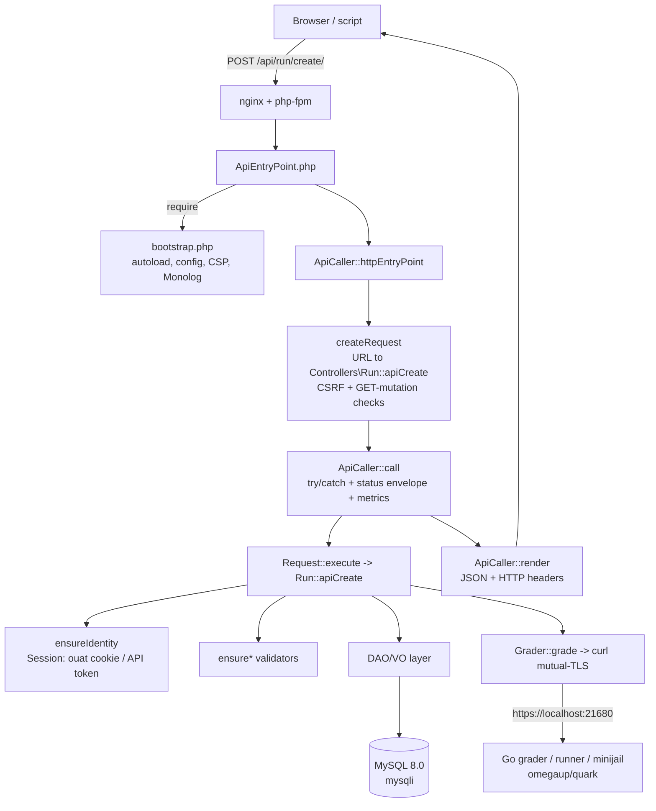

# Arquitectura de back-end

El backend de omegaUp es simple **PHP 8.1** servido por **php-fpm detrás de nginx** (HHVM desapareció hace mucho tiempo; no queda ni una sola referencia en el árbol). Todo reside bajo `frontend/server/src` en el espacio de nombres PSR-4 `\OmegaUp\...`, y todo depende de una idea: cada llamada que hace el navegador o un script es una *llamada API*. No hay PHP por página; una página es solo el Twig shell `frontend/templates/template.tpl` que inicia una aplicación Vue, y esa aplicación se comunica con el servidor exclusivamente a través de puntos finales `/api/...`. Entonces, para comprender el backend, en realidad solo necesita seguir una solicitud desde el cable a MySQL y viceversa, que es lo que hace esta página: usando un envío de código (`POST /api/run/create/`) como ejemplo trabajado, porque toca cada capa: envío, el objeto `Request`, autenticación, la capa de datos DAO/VO y el clasificador externo.

Un modelo mental de una sola línea al que aferrarse: el backend de PHP es un **dispensador de solicitudes delgado y sin estado a través de MySQL** que entrega el trabajo realmente duro (compilar, aislar y ejecutar envíos) a un servicio Go separado a través de HTTP. Nunca ejecuta código que no sea de confianza.

## El punto de entrada: una URL, un método de controlador

Cada llamada HTTP API aterriza en el mismo archivo pequeño, [`frontend/www/api/ApiEntryPoint.php`](https://github.com/omegaup/omegaup/blob/main/frontend/www/api/ApiEntryPoint.php), que tiene cinco líneas de largo:

```php
<?php
require_once(__DIR__ . '/../../server/bootstrap.php');
echo \OmegaUp\ApiCaller::httpEntryPoint();
```
El `require` ingresa [`frontend/server/bootstrap.php`](https://github.com/omegaup/omegaup/blob/main/frontend/server/bootstrap.php), que es la configuración única del proceso: carga el cargador automático de Composer, fuerza la zona horaria a `UTC` (por lo que cada marca de tiempo en el sistema es inequívoca independientemente de dónde se ejecute el servidor), se niega a iniciarse e imprime el contenido de `config.default.php` si olvidó crear un `config.php`. (una falla deliberadamente ruidosa, por lo que una nueva verificación le indica exactamente qué hacer), calcula `OMEGAUP_LOCKDOWN` verificando si el encabezado `Host` comienza con `OMEGAUP_LOCKDOWN_DOMAIN` (el bloqueo es el modo de competencia reforzado que desactiva todo lo que no es estrictamente necesario durante un concurso en vivo), emite los encabezados `Content-Security-Policy` y `X-Frame-Options: DENY` y conecta el registrador raíz **Monolog 2**, enriquecido con un procesador New Relic *solo si* esa clase existe, por lo que el mismo código se ejecuta de manera idéntica en desarrollo sin New Relic instalado. Todo lo posterior a este punto puede asumir que la configuración, el registro y el cargador automático están activos.

Luego, `\OmegaUp\ApiCaller::httpEntryPoint()` en [`frontend/server/src/ApiCaller.php`](https://github.com/omegaup/omegaup/blob/main/frontend/server/src/ApiCaller.php) ejecuta la solicitud real. Hace tres cosas en orden: compila un `Request` a partir de la URL (`createRequest()`), lo ejecuta (`call()`) y serializa el resultado en JSON (`render()`).

### Resolviendo la URL a `Controller::apiXxx`

`createRequest()` es donde una URL se convierte en invocable. Divide `$_SERVER['REQUEST_URI']` en `/` ** y ** `?`; el `?` se incluye a propósito para que `/api/problem/list/?page=1` y `/api/problem/list?page=1` analicen de manera idéntica, con o sin la barra diagonal. Desde la ruta `/api/{controller}/{method}/`, toma el segmento 2 como controlador y el segmento 3 como método, luego construye el nombre de clase completo `\OmegaUp\Controllers\{Ucfirst(controller)}` y el nombre de método `api{Method}`. Los bytes NUL se eliminan de ambos primero, porque son un truco clásico para pasar de contrabando una verificación `class_exists`.

De esto se desprenden dos importantes convenciones de nomenclatura. Primero, **las clases de controlador omegaUp eliminan el sufijo `Controller`**: la clase que maneja las ejecuciones es `\OmegaUp\Controllers\Run` (en [`frontend/server/src/Controllers/Run.php`](https://github.com/omegaup/omegaup/blob/main/frontend/server/src/Controllers/Run.php)), *no* `RunController`. Lo mismo ocurre con `Contest`, `Problem`, `Submission`, `Grader` y el resto. En segundo lugar, **la superficie API pública es exactamente el conjunto de métodos `public static function apiXxx`**: el prefijo `api` lo agrega el despachador, por lo que se puede acceder a un método llamado `apiCreate` como `.../create/` y a un método simple sin prefijo `api` no se puede acceder desde la web por construcción. Entonces `POST /api/run/create/` se resuelve en `\OmegaUp\Controllers\Run::apiCreate`. Si la clase o el método `apiXxx` no existe, el solucionador registra el símbolo exacto que falta y lanza `\OmegaUp\Exceptions\NotFoundException('apiNotFound')`, que, como verá a continuación, el navegador se muestra como un 404 simple.

Antes de entregar la solicitud, `createRequest()` aplica una regla transversal: **los puntos finales mutantes rechazan `GET`.** `isMutatingMethod()` pone en minúsculas el nombre del método y lo compara por subcadena con una lista de verbos que cambian de estado (`add`, `create`, `delete`, `update`, `login`, `logout`, `rejudge`, `refresh`, `verify` y alrededor de dos docenas más); si un `GET` golpea uno de ellos, lanza `MethodNotAllowedException` en lugar de ejecutarlo. Debido a que la coincidencia es por subcadena, un método genuinamente de solo lectura cuyo nombre contenga un verbo mutante (por ejemplo, `listAssociatedIdentities` contiene "asociar") sería detectado por error, por lo que hay un `$readOnlyAllowlist` explícito (`execute`, `executeForIDE`, `listAssociatedIdentities`, `statusVerified`) que los habilita nuevamente para permitir `GET`. Esto es lo que obliga a que cada escritura real pase por `POST`.

Hay una segunda puerta en el método hermano `isCSRFAttempt()`, que se ejecuta en la parte superior de `call()`: si la solicitud lleva un encabezado `Referer`, su host debe coincidir con el host de `OMEGAUP_URL`, el dominio de bloqueo o uno de `OMEGAUP_CSRF_HOSTS`; de lo contrario, toda la llamada se rechaza como CSRF. **Falla en el cierre**: un referente con formato incorrecto o un `OMEGAUP_URL` con formato incorrecto se trata como un ataque, no como un saludo. Se permite una llamada API con *no* `Referer`, porque así es como un script legítimamente creado a mano o el cliente móvil llama a la API; la verificación solo existe para evitar que una página de terceros engañe a un navegador que ha iniciado sesión.

## El objeto `Request` y la autenticación

El despachador empaqueta los parámetros entrantes en un [`\OmegaUp\Request`](https://github.com/omegaup/omegaup/blob/main/frontend/server/src/Request.php), que extiende `\ArrayObject`, por lo que un controlador lee un parámetro como `$r['problem_alias']` y una clave faltante devuelve `null` en lugar de generar un aviso (esa es la razón por la que se anula `offsetGet`). `createRequest()` lo siembra desde `$_REQUEST`, luego aplica capas en los parámetros de estilo de ruta (el `/key/value/` empareja algunos puntos finales) y finalmente estampa dos campos que el ejecutor necesita: `$request->methodName` (por ejemplo, `run.create`, usado para nombrar la transacción para New Relic y Prometheus) y `$request->method` (el `callable-string` `\OmegaUp\Controllers\Run::apiCreate`).

Los controladores nunca confían en los valores de solicitud sin procesar. La clase `Request` incluye una familia de **validadores `ensure*`**, cada uno de los cuales lee una clave, afirma su tipo y rango, coacciona el valor almacenado en su lugar y devuelve el resultado escrito, lanzando `InvalidParameterException('parameterEmpty', $key)` cuando falta una clave requerida:

- `ensureString($key, $validator?)` / `ensureOptionalString(...)`: una cadena, opcionalmente verificada mediante una devolución de llamada (utilizada para alias, nombres de usuario y similares).
- `ensureInt($key, $lowerBound?, $upperBound?)` / `ensureOptionalInt(...)`: un número entero, con rango verificado mediante `\OmegaUp\Validators::validateNumberInRange`.
- `ensureFloat(...)`, `ensureBool(...)`, `ensureTimestamp(...)` y sus gemelos `ensureOptional*`, con `ensureTimestamp` devolviendo un objeto `\OmegaUp\Timestamp` de primera clase en lugar de un entero simple.
- `ensureEnum($key, $enumValues)` / `ensureOptionalEnum(...)`: rechaza cualquier cosa fuera del conjunto permitido e informa tanto el valor incorrecto como el conjunto esperado en el error, para que el cliente vea *por qué* fue rechazado.

Las variantes de `Optional` devuelven `null` cuando la clave está ausente y solo la exigen cuando pasa `required: true`. Esto no es solo ergonomía: cada parámetro adicional anulable aproximadamente duplica el número de combinaciones de entrada que una función puede recibir, por lo que el código base trata una gran distribución de parámetros opcionales como un olor a código que debe mantenerse bajo control en lugar de una conveniencia gratuita.

### Quién llama: sesiones, token `ouat` y tokens API

La primera línea de casi todos los métodos `apiXxx` es una afirmación de autorización en la solicitud. `$r->ensureIdentity()` requiere *alguna* identidad de inicio de sesión y, de lo contrario, arroja `UnauthorizedException` (→ HTTP 401); `$r->ensureMainUserIdentity()` requiere además que la identidad de inicio de sesión sea la identidad *principal* de su usuario (arrojando `ForbiddenAccessException` → 403 para una identidad secundaria/de equipo); y `$r->ensureIdentityIsOver13()` capas en una puerta de edad que bloquea las cuentas menores de 13 años de acciones que no pueden realizar. Estos completan `$r->identity`, `$r->user` y `$r->loginIdentity` para el resto del método a utilizar.

Todos resuelven la persona que llama a través de `\OmegaUp\Controllers\Session::getCurrentSession()`, que admite **dos** estilos de credenciales. La habitual es la cookie de sesión del navegador, cuyo nombre es `ouat` (`OMEGAUP_AUTH_TOKEN_COOKIE_NAME`, definida en [`config.default.php`](https://github.com/omegaup/omegaup/blob/main/frontend/server/config.default.php)). El valor `ouat` *no* es un token PASETO: es una cadena opaca de tres partes creada al iniciar sesión como `"{entropy}-{identity_id}-{hash}"`, donde `entropy` es `bin2hex(random_bytes(15))` (30 caracteres hexadecimales, `AUTH_TOKEN_ENTROPY_SIZE = 15`) y `hash` es `sha256(OMEGAUP_MD5_SALT . identity_id . entropy)`. En cada solicitud, el token se busca en el lado del servidor en la tabla `AuthTokens` a través de `\OmegaUp\DAO\AuthTokens::getIdentityByToken()`; si no está allí, la sesión es simplemente `valid => false` y usted es anónimo. Los tokens antiguos se eliminan cuando se crea uno nuevo, y el mismo token se elimina del caché de la sesión en Mint, por lo que una entrada de caché obsoleta no puede sobrevivir a un nuevo inicio de sesión. El despachador copia esta cookie en `$request['auth_token']` en `createRequest()`, razón por la cual un controlador también puede aceptar un parámetro `auth_token` explícito y comportarse de manera idéntica ya sea que provenga de una cookie o de la cadena de consulta.

El segundo estilo es un **token de API** portador en el encabezado `Authorization`, utilizado por scripts e integraciones. Esa ruta (`getCurrentSessionImplForAPIToken`) busca la credencial en la tabla `APITokens` y, a diferencia de la ruta de cookies, tiene **velocidad limitada**: emite encabezados `X-RateLimit-Limit` / `X-RateLimit-Remaining` / `X-RateLimit-Reset` en cada llamada y arroja `RateLimitExceededException` con un `Retry-After` una vez que el conteo restante llega a `0`. Donde *se* aparece *PASETO** (`paragonie/paseto`) genuino es en [`frontend/server/src/SecurityTools.php`](https://github.com/omegaup/omegaup/blob/main/frontend/server/src/SecurityTools.php), que firma tokens v2 de corta duración para hablar con el **gitserver** externo (clave pública firmada) y para operaciones de clonación de curso (local/simétrica): confianza de subsistema a subsistema, distinta de la sesión de usuario de `ouat`.

## Ejecutando la llamada

Con una `Request` completamente construida, la `ApiCaller::call()` la ejecuta dentro de una `try/catch` grande. `$request->execute()` (en `Request.php`) simplemente hace `call_user_func($this->method, $this)`, es decir, invoca a `Run::apiCreate($r)`, e insiste en que el resultado es una matriz, lanzando `InternalServerErrorException` si un controlador alguna vez devuelve algo que no es una matriz. En caso de éxito, `call()` aplica la convención de respuesta de la plataforma: si el controlador devolvió una matriz asociativa sin clave `status` propia, inyecta `'status' => 'ok'`. Por lo tanto, cada respuesta de la API omegaUp lleva un `status`, y las respuestas de error llevan el sobre `{status: 'error', error, errorcode, errorname}` producido por `ApiException::asResponseArray()`, con el mensaje `error` legible por humanos localizado en el idioma configurado de la cuenta.La escalera de acceso está deliberadamente ordenada. Un `ExitException` significa que un controlador solicitó explícitamente finalizar la solicitud (por ejemplo, después de transmitir un archivo) y simplemente `exit`. Un `ApiException` (la clase base para cada falla "esperada" como `NotFound`, `Unauthorized`, `Forbidden`, `InvalidParameter`) se mantiene tal como está. **Cualquier otra cosa** (un `\Exception` sin formato, es decir, un error) está incluido en `InternalServerErrorException('generalError')` para que un seguimiento de pila inesperado nunca se filtre al cliente. De cualquier manera, se registra la excepción (5xx va al nivel `error` *y* `NewRelicHelper::noticeError`; todo lo demás es `info`), el resultado se registra en Prometheus a través de `\OmegaUp\Metrics::getInstance()->apiStatus(methodName, httpCode)` y se devuelve el sobre. Es por eso que puede obtener métricas de producción por nombre de método y estado HTTP: la instrumentación está centralizada aquí, una vez, en lugar de distribuirse entre los controladores.

## La capa de datos DAO/VO sobre MySQL

Los controladores no escriben SQL a mano. Toda la persistencia pasa por una capa de dos partes, en su mayoría **generada automáticamente**, que se encuentra encima del controlador **mysqli**.

Un **VO (Objeto de valor)** es una fila escrita tonta. `\OmegaUp\DAO\VO\Runs` ([`frontend/server/src/DAO/VO/Runs.php`](https://github.com/omegaup/omegaup/blob/main/frontend/server/src/DAO/VO/Runs.php)) tiene una propiedad pública por columna (`run_id`, `submission_id`, `version`, `commit`, `status`, `verdict`, `runtime`, `penalty`, `memory`, `score`, `contest_score`, `time`, `judged_by`) y un mapa `FIELD_NAMES`. Su constructor toma una matriz asociativa y **arroja cualquier columna desconocida**, por lo que un nombre de campo escrito falla estrepitosamente en la construcción en lugar de desaparecer silenciosamente, obligando a cada valor al tipo PHP real de la columna (ints a través de `intval`, la columna `time` en un `\OmegaUp\Timestamp`).

Un **DAO (Objeto de acceso a datos)** es donde reside el SQL, dividido en dos archivos a propósito. La clase base generada `\OmegaUp\DAO\Base\Runs` ([`frontend/server/src/DAO/Base/Runs.php`](https://github.com/omegaup/omegaup/blob/main/frontend/server/src/DAO/Base/Runs.php)) (cada uno de estos archivos lleva el banner `!ATENCION! Este codigo es generado automáticamente` que le advierte que las ediciones manuales se sobrescribirán la próxima vez que se ejecute el generador) proporciona las primitivas CRUD por clave principal: `create()`, `update()`, `getByPK()`, `existsByPK()`, `delete()`, `getAll()`. Estas son declaraciones `INSERT` / `UPDATE` / `SELECT ... WHERE run_id = ?` con parámetros literales que enumeran cada columna por nombre. La subclase pública `\OmegaUp\DAO\Runs` (en [`frontend/server/src/DAO/Runs.php`](https://github.com/omegaup/omegaup/blob/main/frontend/server/src/DAO/Runs.php)) `extends` es la base y es donde los humanos agregan las consultas escritas a mano y con muchas uniones que una tabla realmente necesita (por ejemplo, `getBestSolvingRunsForProblem`). La división significa que regeneras el aburrido texto repetitivo de forma segura sin siquiera bloquear las consultas interesantes.

Debajo de ambos se encuentra [`\OmegaUp\MySQLConnection`](https://github.com/omegaup/omegaup/blob/main/frontend/server/src/MySQLConnection.php), un contenedor delgado compatible con ADOdb alrededor de una única conexión mysqli. Algunas de sus opciones soportan carga:

- **La vinculación de parámetros se realiza en PHP, no mediante el controlador.** `BindQueryParams()` divide el SQL en `?` y sustituye cada parámetro con el escape correcto: `NULL` para nulo, `FROM_UNIXTIME(...)` para un `\OmegaUp\Timestamp`, dígitos sin formato para ints/floats, `1`/`0` para bools y Cotizaciones ajustadas en `real_escape_string` para cadenas. Se produce inmediatamente una discrepancia en el recuento entre los marcadores de posición `?` y los parámetros proporcionados, lo que convierte toda una clase de errores en forma de inyección en un error grave.
- **Las filas de resultados se vuelven a escribir para que coincidan con el esquema.** mysqli devuelve las cadenas; `MapFieldTypes`/`MapValue` inspecciona los metadatos del campo y obliga a cada columna a `int` / `float` / `bool` / `string` / `\OmegaUp\Timestamp` para que el VO siempre vea tipos PHP reales. (La definición de `DUMP_MYSQL_QUERY_RESULT_TYPES` hace que se registre un tipo `array{...}` en forma de Salmo para cada consulta; así es como se producen las anotaciones `@psalm-type` generadas que mantienen todo el código base con tipos estáticos).
- **`autocommit` está desactivado** y la conexión registra una función de apagado que elimina cualquier transacción pendiente al final de la solicitud. Los `StartTrans`/`CompleteTrans`/`FailTrans` se **cuentan por referencia**, por lo que anidar una transacción dentro de otra simplemente incrementa un contador y solo los `CompleteTrans` más externos en realidad son `COMMIT` (o `ROLLBACK` si alguien llamó a `FailTrans`). Esto permite que las funciones auxiliares independientes abran una "transacción" sin pelear por los límites de compromiso.
- **Una conexión interrumpida se reintenta una vez, pero solo cuando es segura.** Si una consulta falla con el error "El servidor MySQL ha desaparecido" *y* no hay nada no confirmado en vuelo (`_needsFlushing === false`), se vuelve a conectar y vuelve a intentar exactamente una vez; si había escrituras pendientes, se rechaza, porque un reintento ciego podría aplicarlas dos veces.

El destino de conexión predeterminado es `OMEGAUP_DB_HOST = 'mysql:13306'`, base de datos `omegaup`, en **MySQL 8.0**, con el juego de caracteres anclado a `utf8mb4` / `utf8mb4_unicode_ci` para que los emoji y la gama completa de nombres viajen de ida y vuelta correctamente.

### Armando todo: `Run::apiCreate`

Ahora las capas se conectan. `\OmegaUp\Controllers\Run::apiCreate` (alrededor de L415) se ejecuta, en orden: `ensureIdentity()`; `ensureString('source')`; `validateCreateRequest()` (que resuelve el problema y el concurso, verifica los campos obligatorios y garantiza que el problema esté realmente en ese concurso); calcula `submit_delay`, cuyo objetivo es que es la cantidad de minutos desde que comienzan las penalizaciones (el inicio del concurso o cuando el usuario abrió el problema por primera vez, dependiendo del `penalty_type` del concurso) hasta este envío, y es `0` para prácticas fuera de cualquier concurso. Luego construye un `Submissions` VO (con un `guid`, `status => 'uploading'`, `verdict => 'JE'` nuevo) y un `Runs` VO, y dentro de `TransactionHelper::executeWithRetry(...)`, un contenedor que reintenta en punto muerto, vuelve a verificar la **brecha de envío** (actualmente un envío por problema por tiempo de reutilización configurado, verificado *dentro* de la transacción, por lo que dos envíos de carreras no pueden pasar ambos), inserta el envío y la ejecución, y los vincula.

Sólo después de confirmar las filas llama a `\OmegaUp\Grader::getInstance()->grade($run, trim($source))` (alrededor de L573) para programar la evaluación. El orden importa y el manejo de fallas es explícito: la llamada de calificación **no puede** ser parte de la transacción de base de datos, porque el calificador es un proceso separado que consulta la fila `Runs` a través de la red y no verá una fila no confirmada. Entonces, si `grade()` se lanza, `apiCreate` se desenrolla manualmente (anula `current_run_id`, luego elimina la ejecución y el envío (en ese orden, para evitar una violación de clave externa)) y se vuelve a lanzar, dejando la base de datos como si el envío nunca hubiera ocurrido.

## Los servicios externos con los que habla

El backend tiene estado sólo en MySQL; todo lo demás que necesita, lo alcanza a través de la red.

### El clasificador, a través de HTTP

El clasificador/corredor/locutor y el sandbox **minijail** **no están en este repositorio**; son servicios **Go** separados en [github.com/omegaup/quark](https://github.com/omegaup/quark) (el árbol tiene `grader/`, `runner/`, `broadcaster/`, `cmd/omegaup-grader`, `cmd/omegaup-runner`, `cmd/omegaup-broadcaster` y `Dockerfile.minijail`), con problemas de almacenamiento manejados por [github.com/omegaup/gitserver](https://github.com/omegaup/gitserver). Todo el conocimiento que tiene el lado PHP de ese mundo es [`\OmegaUp\Grader`](https://github.com/omegaup/omegaup/blob/main/frontend/server/src/Grader.php), un **cliente curl ligero**: no implementa la cola de evaluación, el grupo de corredores ni la zona de pruebas; simplemente les envía una PUBLICACIÓN y lee el estado. Se comunica con `OMEGAUP_GRADER_URL` (`https://localhost:21680` predeterminado) en un conjunto pequeño y fijo de puntos finales:

- `POST /run/new/{run_id}/` — `grade()`, programe un envío nuevo único (la fuente se envía sin formato en el cuerpo).
- `POST /run/grade/` — `rejudge()`, vuelve a juzgar un lote de ejecuciones por id.
- `GET /submission/source/{guid}/` — `getSource()`, recupera la fuente de un envío.
- `POST /broadcast/` — `broadcast()`, envía un evento en vivo (nueva aclaración, cambio de marcador) a los clientes del concurso conectados a través de la emisora.
- `GET /run/resource/` — `getGraderResource()`, recupera un artefacto por ejecución, como la salida del compilador o el registro de evaluación detallado.
- `GET /grader/status/` — `status()`, el estado de la cola, modelado por el tipo de salmo `GraderStatus` como `{status, broadcaster_sockets, embedded_runner, queue: {running, run_queue_length, runner_queue_length, runners}}`; esto es lo que emerge `\OmegaUp\Controllers\Grader::apiStatus`.

Vale la pena recordar dos detalles operativos. Primero, el transporte es **TLS mutuo**: `curlRequestSingle()` fija una clave de cliente y un certificado (`/etc/omegaup/frontend/key.pem`, `certificate.pem`) y requiere TLS 1.2 con verificación entre pares y host, con un tiempo de espera de conexión de 5 segundos y un tiempo de espera total de 30 segundos: el calificador confía en la interfaz *debido* a ese certificado, no a ningún token de usuario. En segundo lugar, las fallas transitorias se **reintentan hasta 3 veces con retroceso exponencial** (1 s, 2 s, con un límite de 5 s), pero solo para una lista específica de errores reintentables (tiempos de espera de SSL/conexión/operación, `HTTP/2 stream`, `INTERNAL_ERROR`); un limpio que no sea 200 o un 404 no se reintenta, y un 404 con `missingOk` configurado simplemente devuelve `null` (así es como un artefacto que legítimamente aún no existe se distingue de una falla real). Para el desarrollo y las pruebas locales, `OMEGAUP_GRADER_FAKE` cortocircuita todo esto: `grade()` simplemente escribe el código fuente en `/tmp/{guid}` y `status()` devuelve una cola vacía predefinida, para que pueda ejecutar todo el backend sin un calificador presente.

### Redis y RabbitMQMás allá de la niveladora, el backend se apoya en dos piezas más de infraestructura declaradas en `config.default.php`. **Redis** (`REDIS_HOST = 'redis'`, puerto `6379`) respalda el almacenamiento en caché compartido. **RabbitMQ 3** (`OMEGAUP_RABBITMQ_HOST = 'rabbitmq'`, puerto `5672`, vía **php-amqplib**) es el bus de mensajes para trabajo asincrónico que no debería bloquear una respuesta API: el tipo de trabajos en los que el usuario no necesita esperar el resultado en línea. Ambos son opcionales en el sentido de que la ruta principal de solicitud/respuesta de la aplicación es MySQL + calificador; hacen que la plataforma escale en lugar de funcionar.

## Todo el camino, de un vistazo


## Cómo llega la respuesta al navegador

Finalmente, `ApiCaller::render()` convierte la matriz en JSON. Agrega un `_id` por solicitud (un `uniqid` generado una vez en `Request.php`, por lo que cada respuesta es rastreable en los registros), imprime solo cuando la solicitud se solicita explícitamente con `prettyprint=true` y defiende contra datos no codificables: si `json_encode` falla en UTF-8 ilegal, vuelve a intentar con `JSON_PARTIAL_OUTPUT_ON_ERROR` para recuperar una respuesta utilizable en lugar de romper la página por completo: el El caso motivador es una declaración de problema que contiene bytes perdidos. `setHttpHeaders()` envía encabezados agresivos sin caché (con un comentario de época sobre `// Scumbag IE y su cache agresivo` que explica por qué) y `X-Robots-Tag: noindex` en cada respuesta de API.

La única pieza de política de seguridad que vale la pena internalizar se encuentra en `handleException()`, que asigna códigos de excepción a lo que realmente se muestra en el navegador: **un 403 `ForbiddenAccessException` se sirve como un 404**. Esto es deliberado: para un recurso que no se le permite ver (un concurso privado, un problema no publicado), omegaUp finge que no existe en lugar de confirmar que existe y simplemente rechazarlo, por lo que buscar recursos ocultos no filtra nada. Un 401 redirecciona a `/login/` con la URL original conservada en `?redirect=`; una 400 sirve `www/400.html`; cualquier otra cosa es un 500. Tenga en cuenta la regla 403 → 404 cada vez que toque la autorización: "prohibido" y "no encontrado" son intencionalmente indistinguibles desde el exterior.

## Documentación relacionada

- **[Patrones de base de datos](../development/database-patterns.md)** — la capa DAO/VO en profundidad
- **[Patrón MVC](mvc-pattern.md)**: cómo encajan los controladores, DAO y VO
- **[Referencia de API](../reference/api.md)**: el catálogo de terminales
