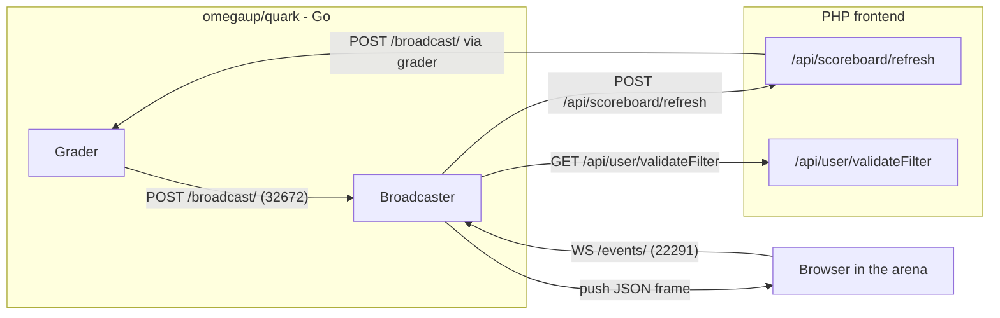
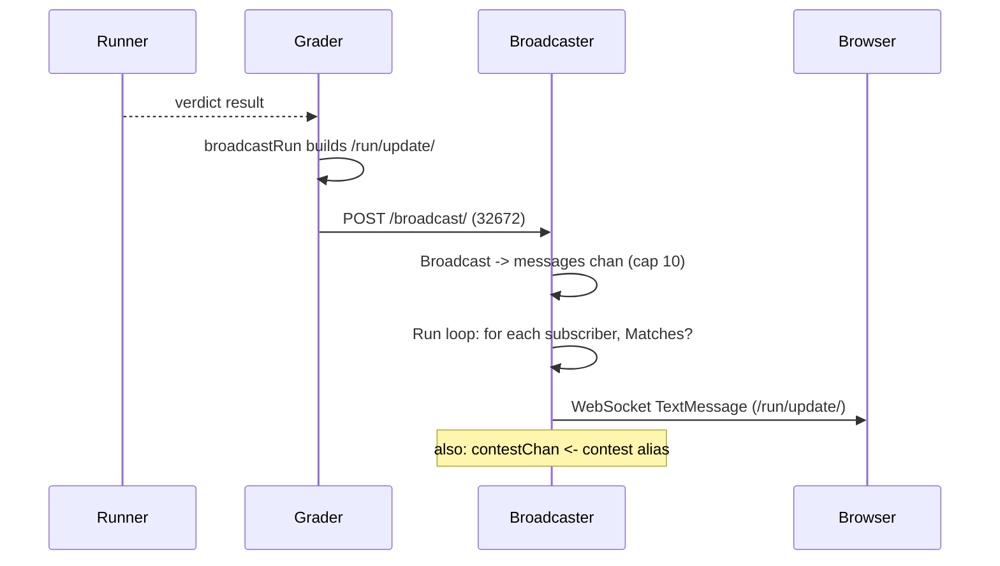
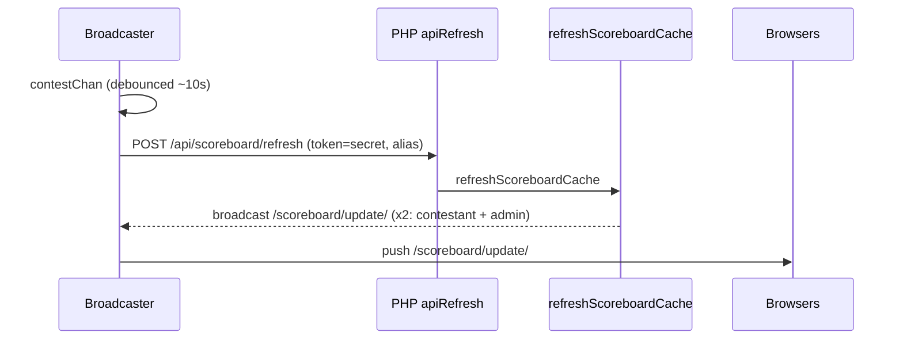

# Arquitectura de emisora {#broadcaster-architecture}

La emisora es el pequeño servicio Go que hace que el estadio se sienta vivo. Cuando estás participando en un concurso y tu envío cambia de "juzgar" a un **AC** verde, o el marcador se reorganiza porque un rival acaba de resolver el problema C, esa actualización no llegó porque tu navegador la sondeó; fue *enviada* a través de un WebSocket que la emisora ​​ha estado manteniendo abierta desde que abriste la página. Todo su trabajo es mantener una conexión duradera por participante y desplegar eventos casi en tiempo real (veredictos, cambios en el marcador, aclaraciones) exactamente para las personas a las que se les permite verlos.

Vive en el repositorio Go separado [`omegaup/quark`](https://github.com/omegaup/quark) (**no** en el monorepo de PHP), junto con el calificador y el corredor. La interfaz PHP nunca habla WebSocket; solo envía JSON simple al calificador, y el calificador lo reenvía aquí. Un modelo mental de una sola línea útil: **la emisora ​​es un tejido pub/sub en memoria sin estado cuyas suscripciones están autorizadas por la interfaz PHP y cuyos eventos son publicados por el evaluador.** No contiene ninguna base de datos, no almacena nada en caché, y si falla y se reinicia, cada cliente simplemente se vuelve a conectar y el mundo vuelve a estar completo; lo único que se pierde son unos segundos de "vida".

## Situándolo: quién habla con quién {#situating-it-who-talks-to-whom}

La emisora expone **dos** servidores HTTP en dos puertos diferentes, porque tiene dos audiencias completamente diferentes con dos niveles de confianza completamente diferentes.

- El **servidor de eventos** (`EventsPort`, actualmente **22291**) es el servidor público al que se conectan los navegadores en `/events/`. Habla WebSocket (subprotocolo `com.omegaup.events`) o, como alternativa, Eventos enviados por el servidor. Aquí es donde viven los suscriptores.
- El **servidor API interno** (`Port`, actualmente **32672**) expone `/broadcast/` y `/deauthenticate/`. Esta es la puerta trasera privada a la que se supone que solo debe acceder el evaluador, utilizada para *inyectar* mensajes y desalojar por la fuerza las conexiones de un usuario.

Un tercer mux sirve a Prometheus `/metrics` en `Metrics.Port`, que reside en la estructura hermana `MetricsConfig`, *no* `BroadcasterConfig`, porque las métricas son una preocupación entre servicios compartida con el clasificador y el corredor. Los valores predeterminados de los dos puertos de transmisión (`EventsPort` y `Port`) se encuentran en [`common/context.go`](https://github.com/omegaup/quark/blob/main/common/context.go) en la estructura `BroadcasterConfig`, y `docker-compose.yml` en el repositorio frontend expone exactamente `32672` y `22291` para el servicio `broadcaster`.

## Un suscriptor se conecta y PHP decide lo que puede escuchar {#a-subscriber-connects-and-php-decides-what-it-may-hear}

Todo comienza cuando un navegador abre la arena. El [`events_socket.ts`](https://github.com/omegaup/omegaup/blob/main/frontend/www/js/omegaup/arena/events_socket.ts) de la interfaz crea una URL como `wss://omegaup.com/events/?filter=/problemset/1234`, agregando el token del marcador cuando la página se abrió a través de un enlace de marcador público (`.../problemset/1234/<token>`) y llama a `new WebSocket(this.uri, 'com.omegaup.events')`. El parámetro de consulta `filter` es el corazón del protocolo: es una lista separada por comas de rutas de recursos en las que el cliente afirma estar interesado.

El mux de eventos en [`cmd/omegaup-broadcaster/main.go`](https://github.com/omegaup/quark/blob/main/cmd/omegaup-broadcaster/main.go) maneja esa solicitud. Primero extrae la identidad de la persona que llama desde donde pueda encontrarla, en un orden deliberado: la cookie `ouat` (una sesión normal de inicio de sesión), luego un encabezado `Authorization: token <APIToken>`, luego una cookie `api_token`. Ese último recurso existe por una razón muy específica detallada en un comentario en el código: *Los WebSockets no permiten que el cliente establezca encabezados de solicitud arbitrarios*, por lo que se debe pasar de contrabando un token API a través de una cookie en lugar del encabezado que usaría una llamada REST normal.

Luego viene el traspaso crucial: la emisora ​​**no decide por sí misma** si usted puede suscribirse a `/problemset/1234`. No puede: no tiene base de datos ni noción de quién es el administrador del concurso. En su lugar, `NewSubscriber` en [`broadcaster/subscriber.go`](https://github.com/omegaup/quark/blob/main/broadcaster/subscriber.go) crea un `GET` HTTP de servidor a servidor de regreso a la interfaz PHP en `FrontendURL + api/user/validateFilter/`, reenviando su cookie o token y su cadena de filtro solicitada. El lado PHP, `\OmegaUp\Controllers\User::apiValidateFilter` en [`User.php`](https://github.com/omegaup/omegaup/blob/main/frontend/server/src/Controllers/User.php), recorre cada token de filtro y lanza `ForbiddenAccessException` en el momento en que solicita algo a lo que no tiene derecho: un filtro `/user/<name>` que no es su propio nombre de usuario (a menos que sea administrador), un filtro `/all-events` cuando no es administrador, un `/contest/<alias>` que no puede ver. Tenga en cuenta que este punto final *deliberadamente no requiere autenticación*: un visitante anónimo que tenga un token de marcador válido aún puede rastrear un concurso público, que es exactamente la razón por la cual el token sigue la ruta del filtro.

Si la interfaz responde `200`, su cuerpo JSON, modelado por `ValidateFilterResponse`, le dice a la emisora ​​quién resultó ser usted: su `user`, si es un `admin` global y las listas de recursos `problem_admin`, `contest_admin` y `problemset_admin` que administra. La emisora ​​los guarda en mapas por suscriptor y los consultará en cada mensaje. Si la interfaz responde algo más, `NewSubscriber` devuelve un `UpstreamError` que contiene el código de estado y el cuerpo de la interfaz, y la emisora ​​transmite ese estado exacto directamente al navegador, por lo que un `403` de PHP se convierte en un `403` en la actualización de WebSocket y el cliente nunca se une. Esta es la puerta de autorización única; no hay que volver a comprobarlo más tarde, por lo que *la razón* la emisora ​​puede permitirse el lujo de ser un bucle rápido y tonto después.

## Filtros: cómo un mensaje encuentra su audiencia {#filters-how-one-message-finds-its-audience}

Un suscriptor no está suscrito a "canales" en ningún sentido con estado: lleva una lista de predicados `Filter` analizados a partir de esa cadena separada por comas por `NewFilter` en [`broadcaster/filter.go`](https://github.com/omegaup/quark/blob/main/broadcaster/filter.go). Cuando llega un mensaje, la emisora ​​​​pregunta a cada suscriptor "¿alguno de sus filtros coincide con esto?" y entrega sólo si la respuesta es sí. Actualmente hay cinco formas de filtro, cada una con una barra diagonal inicial:

- **`/all-events`**: coincide con todos los mensajes, pero *solo* si `subscriber.admin` es verdadero. Esta es la manguera contra incendios, reservada para los administradores del sitio.
- **`/user/<username>`**: coincide con un mensaje cuyo campo `User` es igual al nombre de usuario resuelto por el propio suscriptor. Así es como las actualizaciones de tu veredicto personal te llegan a ti y a nadie más.
- **`/problem/<alias>`**: coincide con los mensajes etiquetados con ese problema, cerrados para que un mensaje se entregue solo si el suscriptor es un administrador, o el mensaje es `Public`, o el mensaje es sobre la propia actividad del suscriptor, o el suscriptor está en el mapa de administración de ese problema.
- **`/problemset/<id>[/<token>]`**: la misma idea ingresada en una identificación numérica de un conjunto de problemas (un conjunto de problemas de un concurso), con un token de marcador opcional adjunto.
- **`/contest/<alias>[/<token>]`**: lo mismo, ingresado en un alias del concurso.

Vale la pena leer literalmente la lógica de la entrada, porque es la razón por la que un concursante nunca ve la carrera privada de otro concursante. `ContestFilter.Matches` devuelve verdadero solo cuando `msg.Contest == f.contest` **y** al menos uno de: `subscriber.admin`, `msg.Public`, `subscriber.user != "" && msg.User == subscriber.user`, o el concurso está en el `contestAdminMap` del suscriptor. Entonces, un no administrador que participa en un concurso recibe las transmisiones *públicas* del marcador y *sus propias* actualizaciones de ejecución, pero un evento privado por usuario dirigido a otra persona falla en todas las cláusulas y se omite silenciosamente. El filtro del navegador de la interfaz es deliberadamente tosco (`/problemset/<id>`); La verificación por mensaje de la emisora ​​es lo que hace que la entrega sea precisa.

## El camino real: una carrera se califica y el veredicto llega a tu navegador {#the-real-path-a-run-is-graded-and-the-verdict-lands-in-your-browser}

Ahora rastrea un envío hasta el final. Supongamos que presenta el problema C en el concurso `pizza-2024`, el corredor lo ejecuta y el calificador termina con un veredicto de `AC`.

**1. El clasificador publica un `/run/update/`.** En [`cmd/omegaup-grader/frontend_handler.go`](https://github.com/omegaup/quark/blob/main/cmd/omegaup-grader/frontend_handler.go), el `RunPostProcessor` notifica a un oyente por cada `RunInfo` terminado, que (cuando el `Grader.V1.SendBroadcast` está activado) llama al `broadcastRun`. Esa función construye un `broadcaster.Message` cuyos campos de nivel superior son los metadatos de *enrutamiento* (`Problem`, `Contest`, `Problemset`, `Public: false`) y cuyo campo `Message` es una *cadena* JSON de la carga útil real: `{"message":"/run/update/","run":{...}}`. Ese objeto `run` interno es el contrato de cable que consume el navegador: `username`, `contest_alias`, `alias`, `guid`, `runtime`, `memory`, `score`, `contest_score`, `status:"ready"`, `verdict`, `language`, etc. Aquí se presenta un caso extremo: si el modo de puntuación del problema es `all_or_nothing` y la puntuación no es un `1` perfecto, el calificador reescribe `score` y `contest_score` a `0` y `verdict` a `WA` antes de enviar, por lo que el crédito parcial nunca se filtra en una pantalla de todo o nada.

**2. Se envía a `/broadcast/`.** `broadcast` (mismo archivo) reúne el `Message` y el `client.Post` a `Grader.BroadcasterURL`, la API interna de la emisora ​​en el puerto **32672**. (Cuando el lado *PHP* quiere transmitir, en su lugar realiza un PUBLICACIÓN en `OMEGAUP_GRADER_URL + /broadcast/`, y el propio controlador `/broadcast/` del calificador simplemente lo reenvía aquí con la misma función `broadcast()`, por lo que hay exactamente una ruta de código hacia la emisora, y el clasificador es siempre el último salto).

**3. La emisora ​​lo pone en cola.** El controlador `/broadcast/` en `main.go` decodifica el JSON en un `broadcaster.Message` y llama a `b.Broadcast(&message)`. `Broadcast` lo envuelve en un `QueuedMessage` (marcando `time.Now()` para que la latencia pueda medirse más tarde) y realiza un envío *sin bloqueo* al canal `messages` almacenado en buffer. Si ese canal está lleno (su capacidad es `ChannelLength`, actualmente solo **10**), el mensaje se tira al suelo: registra `"Dropped broadcast message"`, aumenta el contador `channel_drop_total` y `Broadcast` devuelve `false`, lo que hace que el controlador responda `503 Service Unavailable`. Esta es una elección deliberada de desconexión de carga: una actualización en tiempo real que no se puede entregar rápidamente no tiene valor, por lo que la emisora ​​preferiría descartarla antes que bloquear al evaluador.

**4. El bucle principal se expande.** `Broadcaster.Run` en `subscriber.go` es una única gorutina `select` que se distribuye en cuatro canales (`subscribe`, `unsubscribe`, `deauth` y `messages`), lo que significa que toda la contabilidad de los suscriptores se realiza en una sola rutina y no necesita bloqueos. Cuando aparece un mensaje en `messages`, recorre cada suscriptor, omite aquellos en los que `s.Matches(m.message)` es falso y realiza *otro* envío sin bloqueo al canal personal `send` de ese suscriptor. Aquí el manejo de fallas es más agresivo: si el búfer `send` de un suscriptor individual está lleno (nuevamente `ChannelLength`), se supone que ese suscriptor es demasiado lento o está muerto, por lo que se registra, se cuenta y se **elimina por completo**; un cliente bloqueado no puede realizar una copia de seguridad de todo el despliegue. Después del bucle, llama a `m.Processed()` y registra la métrica de latencia del proceso.

**5. El suscriptor escribe el marco.** Cada `Subscriber.Run` programa los `select` en su propio canal `send` y entrega el mensaje a su `Transport.Send`. Para un WebSocket que es un `TextMessage` que lleva la cadena JSON sin formato `Message.Message`; El `socket.onmessage` del navegador en `events_socket.ts` lo analiza, ve `data.message == '/run/update/'` y confirma la ejecución actualizada en la tienda Vuex, y su fila de envío se vuelve verde. Ese mismo bucle `Subscriber.Run` también activa un `Ping` cada `PingPeriod` (actualmente **30s**) para evitar que el socket quede inactivo y regresa en el instante en que se cierra el lado de lectura de la conexión.

## El bucle del marcador: por qué un veredicto desencadena un segundo ida y vuelta {#the-scoreboard-loop-why-one-verdict-triggers-a-second-round-trip}

Un veredicto que actualice su propia disputa es sólo la mitad de la historia. Ese mismo `AC` podría cambiar el *marcador*, y el marcador se calcula en PHP, no en Go. La emisora ​​soluciona esto con un segundo paso inteligente escondido en el controlador `/broadcast/`.

Inmediatamente después de poner en cola el mensaje, el controlador verifica: `if len(message.Contest) > 0 && strings.Contains(message.Message, "\"message\":\"/run/update/\"")`, luego inserta `message.Contest` en un `contestChan` interno. (Hay un `TODO(lhchavez)` honesto en el código que admite que hacer coincidir cadenas con la carga útil es un truco). En otras palabras: *una actualización ejecutada dentro de un concurso es el desencadenante para pedirle a la interfaz que vuelva a calcular el marcador de ese concurso.*

`contestChan` alimenta a `updateScoreboardLoop`, y aquí es donde el diseño se gana la vida, porque una implementación ingenua dañaría la interfaz durante los últimos frenéticos minutos de un concurso. En su lugar, ejecuta un **antirrebote inicial y final** codificado por concurso, utilizando un montón mínimo de fechas límite y un mapa `eventSet`. La primera actualización de un concurso activa una actualización inmediata *y* programa un `ScoreboardUpdateTimeout` final (actualmente **10s**) más tarde; cualquier actualización adicional para ese mismo concurso dentro de la ventana simplemente gire `eventSet[alias] = true` para que se active exactamente una actualización final fusionada cuando expire el temporizador. El resultado: una competencia ocupada actualiza su marcador como máximo una vez cada 10 segundos en lugar de una vez por presentación, sin importar cuántas carreras caigan en esa ventana.

`updateScoreboardForContest` luego ENVÍA un formulario a `FrontendURL + api/scoreboard/refresh/`, enviando `token` = `ScoreboardUpdateSecret` y `alias` = el concurso. Del lado de PHP, `\OmegaUp\Controllers\Scoreboard::apiRefresh` en [`Scoreboard.php`](https://github.com/omegaup/omegaup/blob/main/frontend/server/src/Controllers/Scoreboard.php) se abre con el protector `if ($r['token'] !== OMEGAUP_GRADER_SECRET) throw new ForbiddenAccessException()`. El comentario allí explica todo el modelo de confianza: * esto nunca lo llaman los usuarios finales, solo el servicio de calificación; Las sesiones regulares no se pueden usar porque caducan, por lo que un secreto previamente compartido otorga privilegios de nivel de administrador solo para esta llamada.* Luego vuelve a calcular los marcadores de los concursantes y del administrador a través de `\OmegaUp\Scoreboard::refreshScoreboardCache`.

Y aquí la serpiente se come la cola. Al final de `refreshScoreboardCache` en [`Scoreboard.php`](https://github.com/omegaup/omegaup/blob/main/frontend/server/src/Scoreboard.php), PHP llama a `\OmegaUp\Grader::getInstance()->broadcast(...)` **dos veces**: una vez con una carga útil de `{"message":"/scoreboard/update/","scoreboard_type":"contestant",...}` enviada a `public: true`, y otra vez con `scoreboard_type: "admin"` enviada a `public: false`. Estos regresan a `OMEGAUP_GRADER_URL/broadcast/`, a través del clasificador, a la emisora, a través del mismo circuito de distribución, y aterrizan en cada navegador conectado cuyo filtro coincida. El `onmessage` del cliente ve el `/scoreboard/update/` y vuelve a representar la clasificación. Entonces, una sola ejecución calificada produce dos oleadas: un `/run/update/` personal inmediato y un `/scoreboard/update/` público, ligeramente posterior y sin rebotes, que hizo un viaje completo de ida y vuelta a PHP y viceversa.

## Dos transportes: WebSocket y el respaldo SSE {#two-transports-websocket-and-the-sse-fallback}

La interfaz `Transport` en [`broadcaster/transport.go`](https://github.com/omegaup/quark/blob/main/broadcaster/transport.go) resume *cómo* una trama llega a un suscriptor, y hay dos implementaciones. El valor predeterminado es `WebSocketTransport`, elegido actualizando la conexión HTTP con el subprotocolo `com.omegaup.events`; su `Send` escribe un `TextMessage` con una fecha límite de escritura de `WriteDeadline` (actualmente **5s**), y su `ReadLoop` lee y *descarta* todo lo que envía el cliente; el protocolo es unidireccional, el cliente nunca responde excepto para mantener caliente la tubería. `Ping` envía un ping de control WebSocket.

El segundo es `SSETransport`, seleccionado cuando el encabezado `Accept` de la solicitud solicita `text/event-stream`. Escribe cuadros `data: <json>\n\n` y configura `X-Accel-Buffering: no` para que nginx no almacene en búfer la transmisión. Debido a que un navegador no puede enviar nada a través de SSE, su `ReadLoop` simplemente se bloquea hasta que se notifica el cierre de la conexión, y su `Ping` escribe una línea de comentario simple de `:\n` para mantener la conexión abierta. Ambos transportes se canalizan hacia el mismo `Subscriber`, por lo que el resto de la emisora ​​no sabe cuál está utilizando.

La interfaz prefiere WebSocket y trata los fallos con elegancia. En `events_socket.ts`, si el socket nunca se abre o luego se cae, `connect()` lo detecta, informa un evento de telemetría `events-socket / fallback` y comienza a **sondear** la API REST en un temporizador (`setupPolls` llega a `api.Problemset.scoreboard` y al punto final de aclaraciones) para que el campo siga actualizándose, solo que con menos rapidez. Si el socket se vuelve a conectar más tarde, esos intervalos de sondeo se borran. Esta es la historia de la degradación elegante: un participante detrás de un proxy que asesina WebSockets todavía ve un marcador que funciona, aunque un poco más lento, en lugar de una página congelada.

## Desautenticación: expulsar a un usuario de {#deauthentication-kicking-a-user-off}

El otro punto final de la API interna, `/deauthenticate/<user>/`, existe en el momento en que un usuario cierra sesión o se revoca su sesión: la interfaz puede indicarle a la emisora que elimine *todas* las conexiones en vivo de ese usuario inmediatamente, en lugar de esperar a que se dé cuenta. Inserta el nombre de usuario en el canal `deauth`; El bucle principal `Run` luego itera a los suscriptores y llama a `remove` en cada uno cuyo `user` coincida, lo que cierra su canal `send` y permite que su rutina `Subscriber.Run` se desenrolle y cierre el socket. Sin esto, una sesión revocada podría seguir recibiendo eventos de concurso privados hasta que su WebSocket se caiga por sí solo.

## Configuración {#configuration}

El `BroadcasterConfig` completo y sus valores predeterminados se encuentran en [`common/context.go`](https://github.com/omegaup/quark/blob/main/common/context.go). Los valores que importan operativamente, todos los valores predeterminados actuales:

| Clave | Predeterminado | Qué controla |
|-----|---------|------------------|
| `EventsPort` | `22291` | Los navegadores de puerto público WebSocket/SSE se conectan en `/events/` |
| `Port` | `32672` | Puerto API privado para `/broadcast/` y `/deauthenticate/` |
| `FrontendURL` | `https://omegaup.com` | URL base para las devoluciones de llamada de `validateFilter` y `scoreboard/refresh` |
| `ChannelLength` | `10` | Tamaño del búfer tanto de la cola de mensajes global como de la cola de envío de cada suscriptor; desbordamiento significa que el mensaje (o el suscriptor lento) se descarta |
| `PingPeriod` | `30s` | Con qué frecuencia se hace ping a cada suscriptor para mantener viva la conexión |
| `WriteDeadline` | `5s` | Tiempo de espera de escritura de WebSocket por cuadro |
| `ScoreboardUpdateTimeout` | `10s` | Ventana antirrebote que fusiona una ráfaga de actualizaciones de ejecución en una actualización del marcador |
| `ScoreboardUpdateSecret` | `"secret"` | Token precompartido enviado como `token` a `/api/scoreboard/refresh`; debe ser igual al `OMEGAUP_GRADER_SECRET` del frontend |
| `Proxied` | `true` | Cuando es verdadero, TLS finaliza en sentido ascendente (mediante nginx) y el servidor de eventos ejecuta HTTP simple detrás de él; cuando es falso, proporciona su propio certificado/clave `TLS` |

El indicador `--insecure` deshabilita TLS en el servidor API interno por completo y, como efecto secundario, agrega encabezados CORS permisivos en `/broadcast/`, lo cual es útil para el desarrollo local, pero al igual que con el indicador curl `--insecure` del clasificador, es una verruga conocida que nunca querrás en producción.

## Métricas y observabilidad {#metrics-and-observability}

La emisora registra métricas de Prometheus en [`cmd/omegaup-broadcaster/metrics.go`](https://github.com/omegaup/quark/blob/main/cmd/omegaup-broadcaster/metrics.go), servidas en `/metrics`. Los que vale la pena ver, todos con el prefijo `broadcaster_`:

- **`websockets_count`** / **`sse_count`** — anchos de las conexiones actualmente abiertas de cada transporte; estos son el tamaño de su audiencia en vivo, y los mismos números aparecen en el campo `broadcaster_sockets` de la API de estado del calificador.
- **`messages_total`**: contador de mensajes que llegaron al ciclo de distribución.
- **`channel_drop_total`**: el contador se incrementa en *cada* caída, ya sea que la cola global estuviera llena, la cola de un suscriptor estuviera llena o se descartara una solicitud de suscripción/cancelación de suscripción. Un `channel_drop_total` en ascenso es el síntoma canónico de que `ChannelLength` es demasiado pequeño o que un downstream es demasiado lento: las actualizaciones en tiempo real se están descartando silenciosamente.
- **`process_latency_seconds`** / **`dispatch_latency_seconds`**: resúmenes que miden, respectivamente, cuánto tiempo esperó un mensaje antes de que el bucle de distribución lo pusiera en cola para todos los suscriptores y cuánto tiempo hasta que realmente se escribió en el cable. Estos están programados para el sello `QueuedMessage.time` establecido en el momento de la ingestión. El binario también monta `net/http/pprof`, por lo que los perfiles de rutina y montón en vivo están disponibles cuando se sospecha una fuga de conexión.

## Código fuente {#source-code}

Todo lo anterior se encuentra en [`omegaup/quark`](https://github.com/omegaup/quark):

- [`cmd/omegaup-broadcaster/main.go`](https://github.com/omegaup/quark/blob/main/cmd/omegaup-broadcaster/main.go): los dos servidores HTTP, los controladores `/broadcast/` y `/deauthenticate/` y el antirrebote `updateScoreboardLoop`.
- [`broadcaster/subscriber.go`](https://github.com/omegaup/quark/blob/main/broadcaster/subscriber.go): el bucle de distribución del `Broadcaster` y el `Subscriber` (incluida la llamada de autorización del `validateFilter`).
- [`broadcaster/filter.go`](https://github.com/omegaup/quark/blob/main/broadcaster/filter.go): los cinco tipos de filtros y sus reglas de coincidencia por mensaje.
- [`broadcaster/transport.go`](https://github.com/omegaup/quark/blob/main/broadcaster/transport.go): los transportes WebSocket y SSE.

## Documentación relacionada {#related-documentation}

- **[Grader Internals](grader-internals.md)**: donde nacen los eventos `/run/update/`.
- **[Infraestructura](infrastructure.md)**: cómo se implementa y representa el servicio.
