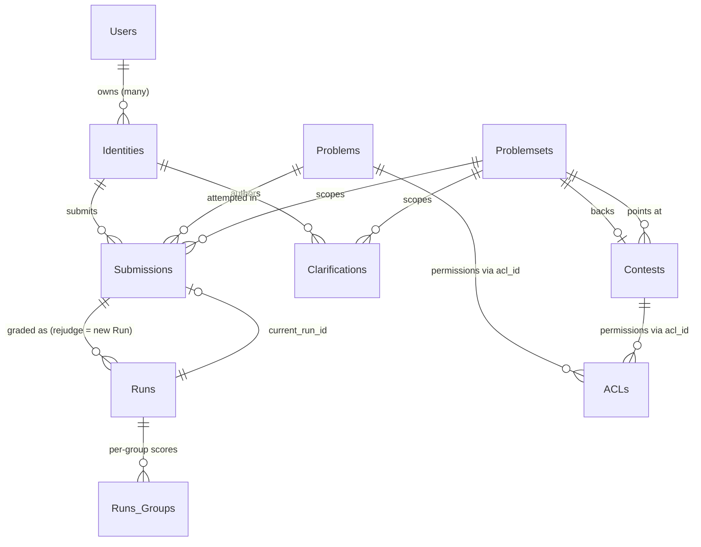

# Esquema de base de datos

Casi todo lo que omegaUp recuerda entre solicitudes reside en una única base de datos MySQL 8.0, a la que se accede a través del controlador `mysqli` en [`frontend/server/src/MySQLConnection.php`](https://github.com/omegaup/omegaup/blob/main/frontend/server/src/MySQLConnection.php). En desarrollo, la conexión predeterminada es el host `mysql:13306`, la base de datos `omegaup`, el usuario `omegaup` con una contraseña vacía; consulte `OMEGAUP_DB_HOST` / `OMEGAUP_DB_NAME` en [`frontend/server/config.default.php`](https://github.com/omegaup/omegaup/blob/main/frontend/server/config.default.php#L39). El puerto es `13306` en lugar del habitual `3306` a propósito, por lo que un MySQL en contenedor nunca choca con uno que ya se esté ejecutando en el host.

El esquema actualmente contiene **85 tablas** (todas `ENGINE=InnoDB`, `CHARSET=utf8mb4 COLLATE=utf8mb4_0900_ai_ci`, por lo que las comparaciones de cadenas son compatibles con Unicode y no distinguen entre mayúsculas y minúsculas de forma predeterminada). Casi nunca deberías tocar estas tablas a través de SQL sin formato. En cambio, cada tabla tiene un par de clases PHP coincidentes: un **DAO** (objeto de acceso a datos) y un **VO** (objeto de valor), y *esas clases se generan a partir del esquema mediante un script*, no escrito a mano. Ese paso generacional es el verdadero tema de esta página: entiéndelo una vez y las otras 84 tablas dejan de ser misteriosas.

## De dónde proviene realmente el esquema

Las tablas no están definidas en un archivo `CREATE TABLE` grande que usted edite. Son la *reproducción* de una pila de migraciones de solo anexos en [`frontend/database/`](https://github.com/omegaup/omegaup/tree/main/frontend/database), cada una denominada `NNNNN_description.sql` — `00001_initial_schema.sql`, `00002_timezone.sql`, `00003_roles.sql`, y así sucesivamente hasta `00270_*` (actualmente ~270 archivos, y el número no hace más que crecer). [`stuff/db-migrate.py`](https://github.com/omegaup/omegaup/blob/main/stuff/db-migrate.py) es el ejecutor: `_scripts()` escanea ese directorio, mantiene solo los archivos cuya primera parte delimitada por `_` tiene exactamente 5 dígitos, los clasifica por número de revisión y `migrate` aplica cada revisión más nueva que la que ya ha visto la base de datos.

Lo que "ya ha visto" se rastrea fuera de banda en una base de datos de metadatos separada, `_omegaup_metadata`, en una tabla llamada `Revision` — `id INTEGER PRIMARY KEY, applied TIMESTAMP DEFAULT CURRENT_TIMESTAMP, comment VARCHAR(50)` (creada por `ensure()` en [db-migrate.py#L381](https://github.com/omegaup/omegaup/blob/main/stuff/db-migrate.py#L381)). La columna `comment` es una pequeña pieza de memoria institucional que vale la pena conocer: es `migrate` para una revisión aplicada normalmente, `skipped` para una que no se ejecuta deliberadamente fuera de un entorno de desarrollo y `manual reset` cuando alguien forzó el puntero de revisión con el comando `reset` para recuperar una migración fallida. Debido a que los metadatos viven en su propia base de datos, eliminar y recrear `omegaup` para las pruebas nunca pierde el registro de qué migraciones se "aplican".

Entonces, ¿cómo puede ser honesto el plano [`frontend/database/schema.sql`](https://github.com/omegaup/omegaup/blob/main/frontend/database/schema.sql), el archivo de 1.468 líneas que esta página sigue citando? Se *genera*, nunca se edita. `db-migrate.py schema` activa una base de datos desechable `_omegaup_schema`, `purge` la reproduce, reproduce cada migración en ella con `update_metadata=False`, `mysqldump` envía el resultado a la salida estándar y descarta la base de datos temporal (consulte [db-migrate.py#L451](https://github.com/omegaup/omegaup/blob/main/stuff/db-migrate.py#L451)). Por lo tanto, `schema.sql` es una instantánea fiel de "todas las migraciones aplicadas en orden", razón por la cual es seguro leerlo como la fuente de verdad para las definiciones de columnas, aunque nadie escriba esas declaraciones `CREATE TABLE` a mano.

## De un `CREATE TABLE` a un par de clases PHP

Aquí está la cadena que convierte una tabla en código. [`stuff/update-dao.sh`](https://github.com/omegaup/omegaup/blob/main/stuff/update-dao.sh) copia `schema.sql` a `dao_schema.sql` (la copia es lo que diferencia el linter, por lo que una copia obsoleta no puede enmascarar silenciosamente la deriva) y ejecuta [`stuff/update-dao.py`](https://github.com/omegaup/omegaup/blob/main/stuff/update-dao.py), que lee el esquema y, para cada tabla, llama a `dao_utils.generate_dao()` en [`stuff/dao_utils.py`](https://github.com/omegaup/omegaup/blob/main/stuff/dao_utils.py). Esa función hace tres cosas en orden: *analiza* el SQL con una gramática `pyparsing` escrita a mano, envuelve cada tabla analizada en un objeto Python `Table` y representa dos plantillas Jinja2 en su contra.

El analizador no es una expresión regular, es una gramática real (`_parse()` en [dao_utils.py#L92](https://github.com/omegaup/omegaup/blob/main/stuff/dao_utils.py#L92)) que comprende `CREATE TABLE`, identificadores entre comillas invertidas, tipos de columnas con `(size)` y `UNSIGNED` opcionales. Cláusulas `NULL`/`NOT NULL`/`AUTO_INCREMENT`/`DEFAULT`/`COMMENT` y el zoológico de restricciones completo (`PRIMARY KEY`, `UNIQUE KEY`, `FULLTEXT KEY`, `KEY` y `CONSTRAINT ... FOREIGN KEY ... REFERENCES ... ON DELETE/ON UPDATE`). Cada columna se convierte en un objeto `Column` que decide su tipo de PHP a partir del tipo de MySQL, y este mapeo es la regla de mayor carga en todo el proceso:

| tipo MySQL | PHP primitivo | Por qué es importante |
|---|---|---|
| `tinyint` | `bool` | Un `tinyint(1)` como `verified` realiza viajes de ida y vuelta como un PHP `bool` real, no como `0`/`1`. |
| `timestamp`, `datetime` | `\OmegaUp\Timestamp` | Nunca una cadena sin formato: un objeto `\OmegaUp\Timestamp`, convertido mediante `DAO::fromMySQLTimestamp`/`toMySQLTimestamp` para que todo el tiempo sea seguro para UTC. |
| `int` | `int` | p.ej. `submit_delay`, `runtime`, `memory`. |
| `double` | `float` | p.ej. `score`, `points_decay_factor`, `difficulty`. |
| cualquier otra cosa | `string` | `varchar`, `char`, `text`, `enum`, `set` todos aterrizan aquí. |

Hay una segunda regla más sutil además de eso (`Column.php_type`, [dao_utils.py#L42](https://github.com/omegaup/omegaup/blob/main/stuff/dao_utils.py#L42)): el tipo PHP de una columna obtiene un prefijo `?` anulable **a menos** que tenga un `DEFAULT` o sea `AUTO_INCREMENT`. El razonamiento es que una columna que la base de datos completará por usted (una clave primaria de incremento automático o una columna con un valor predeterminado) es una que su código PHP puede dejar legítimamente sin configurar, por lo que el VO generado le da un valor inicial concreto en lugar de `null`. Esta es la razón por la que `run_id` se genera como `public $run_id = 0;`, mientras que una columna anulable sin valor predeterminado se genera como `public $whatever = null;`.

El *nombre de clase* de la tabla es solo su nombre SQL sin guiones bajos (`Table.class_name = tbl_name.replace('_', '')`), por lo que `Problem_Of_The_Week` se convierte en `ProblemOfTheWeek` y la tabla `Groups_` con un nombre extraño se convierte en `Groups`. Finalmente, `generate_dao()` procesa [`stuff/dao_templates/vo.php`](https://github.com/omegaup/omegaup/blob/main/stuff/dao_templates/vo.php) y [`stuff/dao_templates/dao.php`](https://github.com/omegaup/omegaup/blob/main/stuff/dao_templates/dao.php) una vez por tabla, escribiendo los resultados en `frontend/server/src/DAO/VO/{Class}.php` y `frontend/server/src/DAO/Base/{Class}.php` respectivamente. Ambos archivos generados se abren con un banner `!ATENCION!` ruidoso: *"Este código es generado automáticamente. Si lo modificas, tus cambios serán reemplazados"* — edítalos y tus cambios desaparecerán la próxima vez que alguien se regenere.

### El VO: una fila escrita

Un **Objeto de valor** es una fila, nada más. Para la tabla `Runs`, el generador emite [`frontend/server/src/DAO/VO/Runs.php`](https://github.com/omegaup/omegaup/blob/main/frontend/server/src/DAO/VO/Runs.php): una clase `Runs` que extiende `\OmegaUp\DAO\VO\VO`, con una matriz `const FIELD_NAMES` (`'run_id' => true, 'submission_id' => true, ...`) y una propiedad pública escrita por columna. Su constructor toma un `array $data` opcional, y lo primero que hace es `array_diff_key($data, self::FIELD_NAMES)` y **tira** `'Unknown columns: ...'` si le entregas una clave que no es una columna real, por lo que un error tipográfico como `new Runs(['verdcit' => 'AC'])` explota inmediatamente en lugar de no hacer nada silenciosamente. Por columna, fuerza el valor entrante exactamente a través del mapeo anterior (`intval` para ints, `boolval` para tinyints, `DAO::fromMySQLTimestamp` para marcas de tiempo) y, para un valor predeterminado de `CURRENT_TIMESTAMP`, llena el campo con `new \OmegaUp\Timestamp(\OmegaUp\Time::get())` cuando no proporciona uno.

### La base DAO: el CRUD que nunca escribes

La **DAO Base** es la capa de consulta y es deliberadamente abstracta. [`frontend/server/src/DAO/Base/Runs.php`](https://github.com/omegaup/omegaup/blob/main/frontend/server/src/DAO/Base/Runs.php) es un `abstract class Runs` cuyos métodos son todos `final public static`, cada uno de ellos construye una cadena SQL parametrizada y la ejecuta a través de `\OmegaUp\MySQLConnection::getInstance()`, nunca concatenando cadenas de un valor en SQL, que es la forma en que la capa generada es segura para inyección por construcción. Los métodos que obtenga dependen de la forma de la tabla, y la plantilla se ramifica en eso:

- **`getByPK(...)`** y **`existsByPK(...)`** se emiten siempre que la tabla tiene una clave principal. `existsByPK` ejecuta un `SELECT COUNT(*)` y está documentado como la opción más económica "cuando no necesita los campos"; úselo cuando solo le importe si hay una fila allí.
- **`update(...)`** se emite solo cuando hay una clave principal *y* al menos una columna que no es clave (de lo contrario, no hay nada para `SET`).
- **`replace(...)`** se emite solo para tablas que tienen una clave principal, tienen columnas sin clave y *no* se incrementan automáticamente, es decir, tablas en las que usted posee la clave, por lo que `REPLACE INTO` puede significar significativamente "insertar o sobrescribir esta fila exacta".
- **`create(...)`**, **`delete(...)`**, **`getAll(...)`** y **`countAll()`** completan el conjunto. `create()` ejecuta `INSERT` y, para una tabla de incremento automático, vuelve a escribir el `Insert_ID()` nuevo en el campo clave del VO dentro de la misma llamada, de modo que después de `Runs::create($run)` se completa el `run_id` del objeto. `getAll()` se envía con una advertencia contundente en su propio bloque de documentos: "consume memoria proporcional al número de filas, así que úsela solo cuando la tabla sea pequeña o pase parámetros de paginación" y refuerza su `ORDER BY` ejecutando el nombre de la columna a través de `escape()` y validando la dirección con la enumeración literal `['ASC', 'DESC']`.

### El DAO público: adónde van las consultas escritas a manoSi todo se generara, no habría ningún lugar donde realizar una consulta real. Ese es el tercer archivo: [`frontend/server/src/DAO/Runs.php`](https://github.com/omegaup/omegaup/blob/main/frontend/server/src/DAO/Runs.php) (no `Base`), un `class Runs extends \OmegaUp\DAO\Base\Runs`. Hereda todo el CRUD generado y *agrega* las consultas personalizadas, unidas y específicas de la aplicación que un generador de esquemas nunca podría adivinar; por ejemplo, un CTE `WITH ssff AS (...)` que agrega recuentos de comentarios y envíos en `Submissions` y `Submission_Feedback`. La división es el punto central: la regeneración del esquema reescribe `Base/Runs.php` y `VO/Runs.php` al por mayor y **nunca** toca su `Runs.php` escrito a mano, por lo que las consultas CRUD generadas y de informes ajustados a mano pueden evolucionar de forma independiente. Actualmente, son 85 clases `DAO/Base/`, 86 archivos `DAO/VO/` (las 85 tablas más la clase base `VO.php` compartida) y 77 contenedores públicos `DAO/`.

### Mantener sincronizado el código generado y confirmado

Nada impide que alguien edite manualmente un archivo generado o agregue una migración y se olvide de regenerar, excepto el linter. [`stuff/dao_linter.py`](https://github.com/omegaup/omegaup/blob/main/stuff/dao_linter.py) vuelve a importar `dao_utils`, regenera cada DAO/VO en la memoria desde `frontend/database/dao_schema.sql` y compara el resultado con lo que se ha confirmado en el disco. Si difieren, el lint falla, razón por la cual la regla práctica después de cualquier cambio de esquema es: ejecutar `./stuff/db-migrate.py schema > frontend/database/schema.sql`, luego `./stuff/update-dao.sh`, luego confirmar la migración, el esquema y los DAO regenerados juntos. Si no lo hace, CI lo notará.

## Las tablas centrales

Leer el esquema de arriba a abajo es abrumador; leer el puñado de tablas que realmente toca una presentación no lo es. Estos son los que soportan carga.

### Usuarios e identidades: por qué hay dos

Lo más sorprendente del esquema es que **un inicio de sesión no es un usuario**. Hay dos mesas. `Users` ([schema.sql#L1397](https://github.com/omegaup/omegaup/blob/main/frontend/database/schema.sql#L1397), comentado *"Usuarios registrados"*) es la persona: `user_id` (PK), `main_identity_id`, `main_email_id`, `facebook_user_id`, un `git_token` (varchar(128), Argon2i-hashed, usado para acceso a git a repositorios de problemas), `verified`, `birth_date`, una enumeración `preferred_language` que enumera todos los compiladores compatibles y, que refleja los requisitos reales del producto, un grupo de columnas de verificación parental (`parental_verification_token`, `parent_email_verification_deadline`) que existen específicamente para manejar registrantes menores de 13 años.

Pero las *credenciales* viven en `Identities` ([schema.sql#L551](https://github.com/omegaup/omegaup/blob/main/frontend/database/schema.sql#L551)): `identity_id` (PK), `username` (`UNIQUE`), `password` (varchar(128), comentado como Argon2i o Blowfish), `name`, `country_id`, `state_id`, `gender`, `current_identity_school_id` y un `user_id` anulable que apunta hacia `Users`. Las dos tablas hacen referencia entre sí (`Users.main_identity_id → Identities` y `Identities.user_id → Users`), lo cual es deliberado: una fila humana de `Users` puede poseer varios `Identities`. Eso es lo que hace posibles las "identidades" de grupo/curso, donde un profesor proporciona cuentas de inicio de sesión que son identidades sin ser usuarios completamente independientes. La consecuencia práctica la sentirá en todas partes: envíos, aclaraciones y marcadores claves para `identity_id`, **no** `user_id`, porque lo que envía el código es una identidad. Incluso hay un `FULLTEXT KEY ft_user_username (username, name)` en `Identities` para que la búsqueda del usuario llegue a un índice en lugar de escanear.

### Problemas: metadatos aquí, contenido en git

`Problems` ([schema.sql#L755](https://github.com/omegaup/omegaup/blob/main/frontend/database/schema.sql#L755)) es un buen ejemplo de cómo la base de datos *no* almacena deliberadamente los datos interesantes. La fila contiene `problem_id` (PK), `acl_id` (la lista de control de acceso; los permisos se tienen en cuenta en la tabla `ACLs` compartida en lugar de duplicarse por problema), `title`, un `alias` seguro para URL (`varchar(32)`, `UNIQUE`), un `visibility` int cuyo significado se detalla en línea en el comentario de esquema (**`-1` prohibido, `0` privado, `1` público, `2` recomendado**) además de contadores desnormalizados (`visits`, `submissions`, `accepted`) y dobles de calidad/dificultad utilizados para la clasificación. Lo que *no* contiene es el enunciado del problema, los casos de prueba o los validadores. Estos viven en un repositorio git (servido por un servidor git independiente, [github.com/omegaup/gitserver](https://github.com/omegaup/gitserver)), y la tabla almacena solo dos punteros SHA-1 de 40 caracteres: `commit` (la confirmación publicada en la rama `master` del problema, `'published'` predeterminado) y `current_version` (el hash de árbol del rama `private`). Es por eso que un envío tiene que registrar *qué* versión del problema se ejecutó: el contenido del problema puede avanzar independientemente de la fila de metadatos.

### Concursos y conjuntos de problemas: el contenedor polimórfico

Una fila `Contests` ([schema.sql#L242](https://github.com/omegaup/omegaup/blob/main/frontend/database/schema.sql#L242)) contiene todas las perillas que hacen que la puntuación del concurso sea lo que es, y los comentarios del esquema documentan cada uno para que no tenga que adivinar: `start_time`/`finish_time`; `window_length` (minutos que obtiene un concursante una vez que ingresa; `NULL` significa "todo el concurso"); `admission_mode enum('private','registration','public')`; `scoreboard` (un int 0–100, el *porcentaje de tiempo de competencia* el marcador permanece visible); `points_decay_factor` (a `double`, "predeterminado 0 = sin caída; TopCoder es 0,7"); `submissions_gap` (`60` predeterminado: el mínimo de segundos entre dos envíos al mismo problema); `penalty_type enum('contest_start','problem_open','runtime','none')`; `penalty_calc_policy enum('sum','max')`; y un `score_mode enum('partial','all_or_nothing','max_per_group')`.

Fundamentalmente, un Concurso **no** es propietario directo de su lista de problemas. Apunta a un `problemset_id`, y `Problemsets` ([schema.sql#L928](https://github.com/omegaup/omegaup/blob/main/frontend/database/schema.sql#L928)) es la bolsa polimórfica y compartida de problemas que un concurso, una tarea de curso o una entrevista reutilizan. Su `type enum('Contest','Assignment','Interview')` más tres back-pointers anulables (`contest_id`, `assignment_id`, `interview_id`) dicen de qué tipo es, y una restricción `CHECK` obliga a que *como máximo uno* de esos tres esté configurado (`cast(... is not null) + ... <= 1`). Esta es la pieza que une el modelo: debido a que las presentaciones y aclaraciones hacen referencia a `problemset_id` en lugar de `contest_id`, exactamente la misma maquinaria de calificación y preguntas y respuestas funciona ya sea que el problema se haya intentado dentro de un concurso, una tarea de clase o una entrevista de trabajo, sin carcasas especiales por superficie.

### Presentaciones y ejecuciones: el acto versus la evaluación

Esta es la segunda división que vale la pena internalizar y refleja la de Usuarios/Identidades. Una fila **`Submissions`** ([schema.sql#L1195](https://github.com/omegaup/omegaup/blob/main/frontend/database/schema.sql#L1195)) es el *acto* de enviar: `submission_id` (PK), un `guid` (`char(32)`, `UNIQUE`: el token de ejecución público), `identity_id`, `problem_id`, un valor anulable `problemset_id`, el `language` en el que fue escrito, `submit_delay` (documentado como los minutos desde que se abrió el problema hasta que se envió: la materia prima para la puntuación de penalizaciones), un `type enum('normal','test','disqualified')` y un `current_run_id` apuntando a cualquier evaluación que cuente actualmente. El código fuente enviado y el acto en sí son inmutables.

Una fila **`Runs`** ([schema.sql#L1049](https://github.com/omegaup/omegaup/blob/main/frontend/database/schema.sql#L1049)) es una *evaluación* de un envío: `run_id` (PK), `submission_id` (FK), los hash `version` y `commit` del problema con el que se calificó, un `status`, un `verdict` y los resultados medidos: `runtime` y `memory` (ints), `penalty`, `score` y `contest_score` (dobles) y `judged_by`. Un `UNIQUE KEY runs_versions (submission_id, version)` es lo que hace que el uno a muchos tenga sentido: **rejuzgar** un envío contra una nueva versión del problema produce una *nueva* fila `Runs` en lugar de sobrescribir la anterior, y `Submissions.current_run_id` cambia para señalar la última. Así es como omegaUp puede volver a calificar un concurso antiguo completo después de arreglar un caso de prueba roto sin perder los veredictos originales. Desgloses por grupo de prueba de una ejecución en vivo en `Runs_Groups` (`run_id`, `group_name`, `score`, `verdict`), una fila por grupo de prueba.

Dos enumeraciones se repiten en ambas tablas y vale la pena explicarlas en detalle. El ciclo de vida **`status`** pasa por: `new`, `waiting`, `compiling`, `running`, `ready`, `uploading`. El **`verdict`** es uno de: `AC` (aceptado), `PA` (parcialmente aceptado), `PE` (error de presentación), `WA` (respuesta incorrecta), `TLE` (límite de tiempo excedido), `OLE` (límite de salida excedido), `MLE` (límite de memoria excedido), `RTE` (error de tiempo de ejecución), `RFE` (error de función restringida), `CE` (error de compilación), `JE` (error de evaluación) y `VE` (error del validador). Una ejecución recién creada comienza como `verdict = 'JE'`, `status = 'uploading'`, un marcador de posición pesimista que solo se convierte en un veredicto real una vez que el evaluador informa.

### Aclaraciones

`Clarifications` ([schema.sql#L159](https://github.com/omegaup/omegaup/blob/main/frontend/database/schema.sql#L159)) es el canal de preguntas y respuestas del concurso: `clarification_id` (PK), `author_id` y un `receiver_id` anulable (ambos FK para `Identities`, nuevamente codificados según la identidad, no el usuario), el `message` y un `answer` opcional. un `problem_id` (anulable: una aclaración puede ser sobre el concurso en general en lugar de un problema; el comentario del esquema señala que idealmente debería dirigirse al creador del problema o al propietario del concurso cuando no está adjunto), el `problemset_id` al que pertenece y un indicador `public` cuyo valor predeterminado es `0`. Esa bandera codifica una regla real: *"solo las aclaraciones que el autor del problema marca como publicables aparecen en la lista que todos pueden ver"*, por lo que una respuesta privada a un concursante permanece privada a menos que se promueva explícitamente.

## Un envío, de principio a fin, en llamadas DAOPara ver la capa haciendo su trabajo, siga una ruta real: [`\OmegaUp\Controllers\Run::apiCreate`](https://github.com/omegaup/omegaup/blob/main/frontend/server/src/Controllers/Run.php#L415) (la clase es `Run`, no `RunController`; omegaUp elimina el sufijo `Controller`). Después de haber validado la solicitud, construye los dos VO manualmente: `new \OmegaUp\DAO\VO\Submissions([...])` y `new \OmegaUp\DAO\VO\Runs([... 'status' => 'uploading', 'verdict' => 'JE'])` ([Run.php#L533](https://github.com/omegaup/omegaup/blob/main/frontend/server/src/Controllers/Run.php#L533)) y luego, *dentro* de `\OmegaUp\TransactionHelper::executeWithRetry` (que reintenta en punto muerto), realiza exactamente cuatro llamadas DAO generadas en orden. ([Ejecutar.php#L564](https://github.com/omegaup/omegaup/blob/main/frontend/server/src/Controllers/Run.php#L564)):

```php
\OmegaUp\DAO\Submissions::create($submission);      // INSERT, back-fills $submission->submission_id
$run->submission_id = $submission->submission_id;   // wire the run to its submission
\OmegaUp\DAO\Runs::create($run);                     // INSERT, back-fills $run->run_id
$submission->current_run_id = $run->run_id;          // point the submission at its live evaluation
\OmegaUp\DAO\Submissions::update($submission);       // UPDATE to persist current_run_id
```
Cada método existe un `final public static` generado en `DAO/Base/`, ejecutando un `INSERT`/`UPDATE` parametrizado. Solo *después* de que se confirma esta transacción, el controlador entrega la ejecución al calificador Go externo con `\OmegaUp\Grader::getInstance()->grade($run, trim($source))` ([Run.php#L573](https://github.com/omegaup/omegaup/blob/main/frontend/server/src/Controllers/Run.php#L573)): la fila existe y es duradera antes de que se intente cualquier calificación, por lo que un problema con el calificador nunca puede perder un envío. El `verdict` permanece como `JE` y el `status` permanece como `uploading` en la base de datos hasta que el clasificador informa y la ejecución se actualiza en su lugar.

## Relaciones de un vistazo


## Documentación relacionada

- **[Patrones de base de datos](../development/database-patterns.md)**: cómo los controladores utilizan realmente la capa DAO/VO día a día
- **[Arquitectura de backend](backend.md)**: dónde se encuentra la capa DAO en el ciclo de vida de la solicitud
- **[Comandos útiles](../development/useful-commands.md)** — las invocaciones de `db-migrate.py` y `update-dao.sh` en un solo lugar
