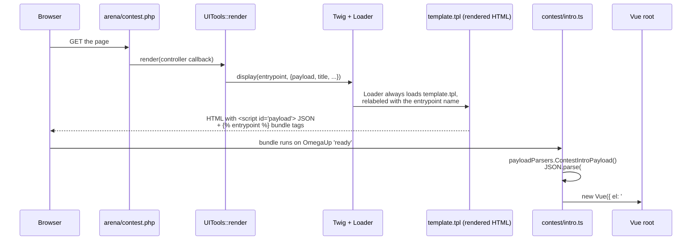

# Arquitectura frontal

Cada página de omegaUp que haya cargado es, en el fondo, exactamente el mismo archivo HTML. Hay precisamente **una** plantilla renderizada por el servidor en toda la aplicación, `frontend/templates/template.tpl`, y se renderiza para el campo del concurso, el editor de problemas, el marcador, los paneles de administración, todo. Lo que cambia de una página a otra no es el shell HTML, sino dos cosas que lleva el shell: un blob de JSON integrado en una etiqueta `<script>` y qué paquete de Vue compilado extrae la página. Ese shell pasa a Vue, Vue lee el JSON y, desde ese punto en la página, es una aplicación de una sola página. Esta es toda la arquitectura en una oración, y el resto de esta página explica por qué funciona de esa manera y cómo fluye una solicitud real a través de ella.

Si ha leído notas anteriores que describen una migración de Smarty a Vue en progreso, elimine ese modelo mental: esa migración está **realizada**. El código base actualmente contiene 257 componentes de un solo archivo `.vue` y 414 archivos `.ts` en exactamente una aplicación `.tpl`; la representación de la página es esencialmente 100% Vue. La única migración que todavía está realmente en fuga es **Vue 2 → Vue 3**; la aplicación se ejecuta hoy en Vue 2.7.16, y los directorios `vue-upgrade-tool/` y `vue-js-tutorial/` de nivel raíz son el andamiaje para ese eventual salto.

## Pila de tecnología

Fijamos deliberadamente cada uno de estos; Trate las versiones como actuales pero mutables y verifique `package.json` antes de asumir.

| Capa | Tecnología | Versión (actualmente) | Por qué está aquí |
|-------|-----------|--------------------|--------------|
| Plantillas de shell de servidor | ramita | 3 (`twig/twig ^3.0`) | Representa el shell HTML único e inyecta la carga útil JSON + etiquetas de punto de entrada. **No** Smarty: Smarty se ha ido. |
| Marco de interfaz de usuario | Vue.js | 2.7.16 | Componentes de un solo archivo, API de opciones a través de `vue-property-decorator` / `vuex-class`. |
| Idioma | Mecanografiado | 4.4.4 | Modo `strict` sobre todas las fuentes `.ts` y `.vue`. |
| Gestión estatal | Vuex | 3 | Tiendas por función (por ejemplo, la lista de ejecución de arena, el IDE de calificación). |
| Marco CSS | Bootstrap + bootstrap-vue | 4.6.0 + 2.21.2 | **Bootstrap 4**, no 5: `bootstrap-vue` solo admitió Bootstrap 4. |
| Herramienta de construcción | Paquete web | 5 | Un paquete por punto de entrada de página, más un fragmento de tiempo de ejecución compartido de `omegaup`. |
| Gráficos / editores | Highcharts, CodeMirror, Mónaco | — | Marcadores y editor de código. |
| Pruebas unitarias | Broma (ts-jest) | 26 | Pruebas de componentes y ayudantes con `shallowMount`. |
| Pruebas E2E | Ciprés | 15.7 | 10 archivos de especificaciones bajo `cypress/e2e/*.cy.ts`. |
| Taller de componentes | Libro de cuentos | 7.6 | `storybook dev -p 6006`; la cobertura es escasa (actualmente ~10 historias para 257 componentes). |

## Dónde vive el código

Cada archivo `.vue` propio se encuentra en `frontend/www/js/omegaup/`, y 248 de los 257 se encuentran específicamente en [`frontend/www/js/omegaup/components/`](https://github.com/omegaup/omegaup/tree/main/frontend/www/js/omegaup/components) organizados por función (`components/contest/`, `components/problem/`, `components/course/`, etc.). **No** hay un directorio `frontend/www/js/components`: si busca componentes en un nivel superior, no los encontrará.

Junto a los componentes se encuentran los módulos de **punto de entrada**: pequeños archivos `.ts` como [`frontend/www/js/omegaup/contest/intro.ts`](https://github.com/omegaup/omegaup/blob/main/frontend/www/js/omegaup/contest/intro.ts) o `arena/contest_contestant.ts` cuyo único trabajo es iniciar una página: leer la carga útil, conectar controladores de eventos, montar una instancia raíz de Vue. Estos son el pegamento entre el JSON del servidor y el árbol de componentes, y cada uno está registrado como un Webpack denominado `entry` en [`webpack.config-frontend.js`](https://github.com/omegaup/omegaup/blob/main/webpack.config-frontend.js) (`arena_contest_contestant`, `contest_intro`, `badge_details`,…, actualmente más de cien de ellos).

Dos archivos más en ese directorio son especiales porque **nunca debes editarlos a mano**:

- [`frontend/www/js/omegaup/api_types.ts`](https://github.com/omegaup/omegaup/blob/main/frontend/www/js/omegaup/api_types.ts) (~232 KB): cada forma de DAO, cada tipo de mensaje de solicitud/respuesta y el `payloadParsers` que decodifica las cargas útiles del servidor.
- [`frontend/www/js/omegaup/api.ts`](https://github.com/omegaup/omegaup/blob/main/frontend/www/js/omegaup/api.ts) (~77 KB): una función escrita para cada punto final de API.

Ambos se abren con la línea `// generated by frontend/server/cmd/APITool.php. DO NOT EDIT.`: se regeneran a partir de los controladores PHP y al final volveremos a explicar por qué es importante.

## Una solicitud, de principio a fin

Rastreemos una página real (la pantalla de introducción del concurso que ve un usuario antes de participar en un concurso) desde la URL hasta un componente Vue montado. Cada paso nombra el símbolo real que lo realiza.


### 1. El archivo PHP de la página es un código auxiliar de tres líneas

El navegador encuentra un archivo PHP físico, pero no hace casi nada. Aquí está [`frontend/www/arena/contest.php`](https://github.com/omegaup/omegaup/blob/main/frontend/www/arena/contest.php) en su totalidad:

```php
<?php
namespace OmegaUp;
require_once(dirname(__DIR__, 2) . '/server/bootstrap.php');

\OmegaUp\UITools::render(
    fn (\OmegaUp\Request $r) => \OmegaUp\Controllers\Contest::getContestDetailsForTypeScript($r)
);
```
Introduce `bootstrap.php` (el mismo arranque que usa la capa API) y luego llama a `\OmegaUp\UITools::render()`, entregándole un cierre que ejecuta un método de controlador. Ese método, `getContestDetailsForTypeScript`, es el que hace el trabajo real: valida al usuario, accede a la base de datos a través de los DAO y devuelve una matriz `RenderCallbackPayload`. Esa matriz tiene dos claves de carga: `entrypoint` (una cadena como `"arena_contest_contestant"`) y `templateProperties.payload` (el `array<string, mixed>` de datos que necesita la página). La convención de nomenclatura `...ForTypeScript` es la indicación: estos métodos de controlador existen específicamente para alimentar la interfaz de TypeScript.

### 2. `UITools::render` construye Twig e inyecta la carga útil

Dentro de [`frontend/server/src/UITools.php`](https://github.com/omegaup/omegaup/blob/main/frontend/server/src/UITools.php), `render()` construye un `\Twig\Environment` respaldado por nuestro `\OmegaUp\Template\Loader` personalizado, extrae el `entrypoint` y el `payload` del valor de retorno del controlador, pliega la carga útil junto con un `headerPayload` compartido (el estado de barra de navegación/inicio de sesión que cada página necesita), formatea la página localizada `title`, y finalmente llama a `$twig->display($entrypoint, $twigContext)`. El movimiento crucial: pasa el **nombre del punto de entrada** como nombre de la plantilla a mostrar.

### 3. El cargador es un cebo y cambio deliberado

Es de esperar que `$twig->display('arena_contest_contestant', ...)` busque un archivo llamado `arena_contest_contestant`. No es así, y este es el pivote inteligente de todo el diseño. Nuestro [`frontend/server/src/Template/Loader.php`](https://github.com/omegaup/omegaup/blob/main/frontend/server/src/Template/Loader.php) implementa `LoaderInterface` de modo que **sin importar el nombre solicitado, siempre lee el archivo físico `templates/template.tpl`**, pero vuelve a etiquetar el `\Twig\Source` devuelto con el nombre solicitado:

```php
public function getSourceContext(string $name): \Twig\Source {
    $originalSource = $this->_loader->getSourceContext('template.tpl');
    return new \Twig\Source(
        $originalSource->getCode(),
        $name,                        // relabel with the entrypoint name
        $originalSource->getPath(),
    );
}
```
Entonces, cada página muestra el mismo shell, y lo *único* que el shell aprende sobre "qué página soy" es ese nombre reetiquetado. Por eso hay un `.tpl` y no doscientos. (`isFresh()` también devuelve `false` cada vez que `OMEGAUP_ENVIRONMENT === 'development'`, por lo que el caché de la plantilla nunca se interpone en tu camino mientras estás pirateando; verás los cambios al actualizar sin borrar nada).

### 4. El shell serializa la carga útil y emite las etiquetas del paquete.

Ahora se procesa [`frontend/templates/template.tpl`](https://github.com/omegaup/omegaup/blob/main/frontend/templates/template.tpl). Dos líneas en su `<main>` son la transferencia completa al navegador:

```twig
<script type="text/json" id="payload">{{ payload|json_encode|raw }}</script>

<div id="main-container"></div>
```
La primera línea es el puente de PHP a JavaScript: la matriz `payload` del controlador es `json_encode`d y se coloca palabra por palabra en una etiqueta `<script type="text/json" id="payload">`. Son *datos*, no código: el navegador no los ejecuta, simplemente los estaciona en el DOM para que Vue los recoja. (El estado del encabezado/barra de navegación recibe el mismo tratamiento un nivel más arriba en el `<body>` que el `<script id="header-payload">`).

La segunda línea, ``, es una de nuestras tres etiquetas Twig personalizadas. Su compilador, [`EntrypointNode`](https://github.com/omegaup/omegaup/blob/main/frontend/server/src/Template/EntrypointNode.php), llama a `$sourceContext->getName()` para recuperar ese nombre de punto de entrada reetiquetado y emite las etiquetas `<script src=...>` para el paquete Webpack coincidente (leyendo la lista de dependencias que Webpack escribió en `www/js/dist/{entrypoint}.deps.json`). Es por eso que la nueva etiqueta en el paso 3 soportaba carga: es el único canal que le dice al shell qué JavaScript cargar. Finalmente, el `<div id="main-container">` vacío es el punto de montaje que Vue asumirá.

Vale la pena conocer las otras dos etiquetas personalizadas en el mismo shell porque resuelven el almacenamiento en caché. `` extrae el fragmento de tiempo de ejecución compartido y `` agrega una cadena de consulta de eliminación de caché: [`VersionHashNode`](https://github.com/omegaup/omegaup/blob/main/frontend/server/src/Template/VersionHashNode.php) calcula `substr(sha1(file_get_contents($path)), 0, 6)` y reescribe la URL en `/css/dist/omegaup_styles.css?ver=abc123`. El `?ver=` cambia solo cuando cambia el contenido del archivo, por lo que los navegadores almacenan en caché de manera agresiva pero nunca entregan un paquete obsoleto después de una implementación.

### 5. El punto de entrada lee la carga útil y monta Vue

El paquete llega y ahora se ejecuta [`contest/intro.ts`](https://github.com/omegaup/omegaup/blob/main/frontend/www/js/omegaup/contest/intro.ts). Espera `OmegaUp.on('ready', …)` (activado una vez que se ha inicializado el tiempo de ejecución heredado), decodifica el JSON incrustado en el shell y monta una instancia raíz de Vue cuyo único hijo es el componente de nivel superior de la página:

```ts
OmegaUp.on('ready', () => {
  const payload = types.payloadParsers.ContestIntroPayload();
  const headerPayload = types.payloadParsers.CommonPayload();

  new Vue({
    el: '#main-container',
    components: { 'omegaup-contest-intro': contest_Intro },
    render: (createElement) =>
      createElement('omegaup-contest-intro', {
        props: { contest: payload.contest, isLoggedIn: headerPayload.isLoggedIn, /* … */ },
        on: {
          'open-contest': (request) =>
            api.Contest.open(request).then(() => window.location.reload()).catch(ui.apiError),
        },
      }),
  });
});
```
`types.payloadParsers.ContestIntroPayload()` es la mitad decodificadora del puente, generada en `api_types.ts`. Hace `JSON.parse(document.getElementById('payload').innerText)` y luego, de manera crítica, recorre el objeto analizado arreglando tipos que el cable no puede transportar: cada marca de tiempo llega como un entero Unix, por lo que el analizador lo rehidrata con `new Date(x * 1000)`. Esta es la razón por la que el `JSON.parse` sin formato nunca se llama directamente en el código de la página; el analizador generado garantiza que un `contest.start_time` es un `Date` real, no un número. (`intro.ts` incluso reajusta desde `start_time` hasta `time.remoteDate(...)` después, por lo que un usuario cuyo reloj de computadora portátil esté sesgado aún verá la cuenta regresiva correcta).

A partir de aquí es un SPA normal: el componente `<omegaup-contest-intro>` se procesa, y cuando el usuario hace clic en "entrar", el controlador `open-contest` llama a `api.Contest.open(...)`, un contenedor escrito de `api.ts`, y lo recarga. No se realizan más navegaciones de página completa dentro de una función determinada; Vue posee el DOM bajo `#main-container`.

## El cliente API generado: por qué nunca escribes `fetch`

Mire nuevamente a `api.Contest.open(...)`. No encontrará llamadas `fetch` escritas a mano ni formas de respuesta escritas a mano en ninguna parte del código de la página propia, y eso es a propósito. Tanto `api.ts` como `api_types.ts` son generados por [`frontend/server/cmd/APITool.php`](https://github.com/omegaup/omegaup/blob/main/frontend/server/cmd/APITool.php), que lee los controladores PHP y sus anotaciones Psalm `@psalm-type` y emite TypeScript correspondiente. Cada punto final se convierte en una llamada como:

```ts
export const Admin = {
  setMaintenanceMode: apiCall<
    messages.AdminSetMaintenanceModeRequest,
    messages.AdminSetMaintenanceModeResponse
  >('/api/admin/setMaintenanceMode/'),
};
```
El asistente `apiCall<Request, Response>(url)` devuelve una función que envía los parámetros, desenvuelve el sobre `status`/`error` y lo rechaza con el error del servidor (enrutado a través de `addError`/`ui.apiError`) en caso de falla. La recompensa de generar en lugar de escribir a mano: las firmas del controlador PHP son la única fuente de verdad. Cambie el tipo de retorno de un controlador en PHP, regenere y el compilador de TypeScript marcará inmediatamente cada archivo `.vue` y `.ts` que ahora lee un campo que ya no existe: toda una clase de errores de deriva de front-end/back-end se convierte en un error de compilación antes de que pueda enviarse. Esa es exactamente la razón por la que el banner `DO NOT EDIT` está ahí: cualquier edición manual se revierte silenciosamente la próxima vez que alguien ejecuta `APITool.php`.

## La construcción

Webpack 5 convierte todo esto en activos que se pueden enviar. Cada entrada con nombre en [`webpack.config-frontend.js`](https://github.com/omegaup/omegaup/blob/main/webpack.config-frontend.js) se convierte en un paquete de salida, con el tiempo de ejecución compartido de `omegaup` (core-js polyfills, `regenerator-runtime`, el `omegaup-legacy.js` heredado) dividido para que las páginas no lo vuelvan a enviar. `vue-loader` compila los componentes de un solo archivo `.vue`, `ts-loader` maneja TypeScript y `fork-ts-checker-webpack-plugin` verifica el tipo en un proceso paralelo, por lo que un error de tipo falla en la compilación sin bloquear el paquete. Los scripts npm que realmente ejecutará son `yarn dev` / `yarn dev:watch` mientras desarrolla y `yarn build` para un paquete de producción; Los archivos `.deps.json` que Webpack escribe por entrada son lo que la etiqueta `` Twig lee más tarde para saber qué etiquetas `<script>` emitir para esa página.

El estado que sobrevive a un solo componente vive en las tiendas **Vuex 3** que se mantienen cerca de su función; por ejemplo, [`frontend/www/js/omegaup/arena/runsStore.ts`](https://github.com/omegaup/omegaup/blob/main/frontend/www/js/omegaup/arena/runsStore.ts) y `arena/problemStore.ts` regresan al campo del concurso, y el IDE de nivelación tiene su propio `grader/GraderStore.ts`. No existe una única tienda global; cada característica posee su estado y mutaciones, lo que mantiene la migración de Vue 2 → Vue 3 manejable, una característica a la vez.

## Pruebas y desarrollo de componentes.

Tres capas protegen la parte delantera, cada una con un alcance diferente. **Jest 26** (a través de `ts-jest`) ejecuta pruebas unitarias rápidas, generalmente montando un solo componente con `shallowMount` y afirmando su salida renderizada o eventos emitidos. **Cypress 15.7** impulsa un Chrome real contra una pila en ejecución para flujos de extremo a extremo: las 10 especificaciones de `cypress/e2e/` cubren los recorridos de carga (`contest`, `course`, `ide`, `problem_creator`, `navigation` y amigos) en lugar de cada pantalla. **Storybook 7.6** (`storybook dev -p 6006`) es donde se desarrolla un componente de forma aislada, aunque tenga en cuenta que la cobertura es actualmente escasa (aproximadamente 10 archivos `.stories` para 257 componentes), por lo que la mayoría de los componentes aún no tienen una historia, y agregar uno para cualquier cosa que toque es una contribución bienvenida.

## Documentación relacionada

- **[omegaUp Internals](internals.md)**: el recorrido completo del lado del servidor que realiza un envío después de que el front-end lo PUBLICA.
- **[Arquitectura de backend](backend.md)**: los controladores PHP, `ApiCaller` y la capa DAO/VO que producen las cargas útiles y las respuestas API que consume esta página.
- **[Guía de componentes](../development/components.md)**: cómo crear y estructurar componentes de un solo archivo de Vue.
- **[Pautas de codificación](../development/coding-guidelines.md)**: las reglas de estilo, TypeScript y Vue que aplicamos al front-end (incluido "¡No usar jQuery!").
