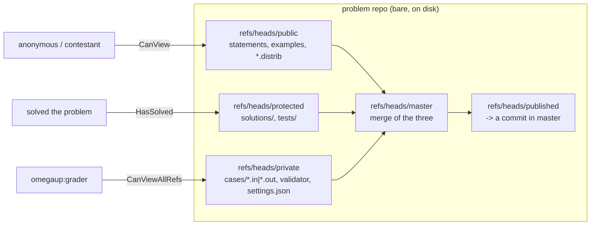
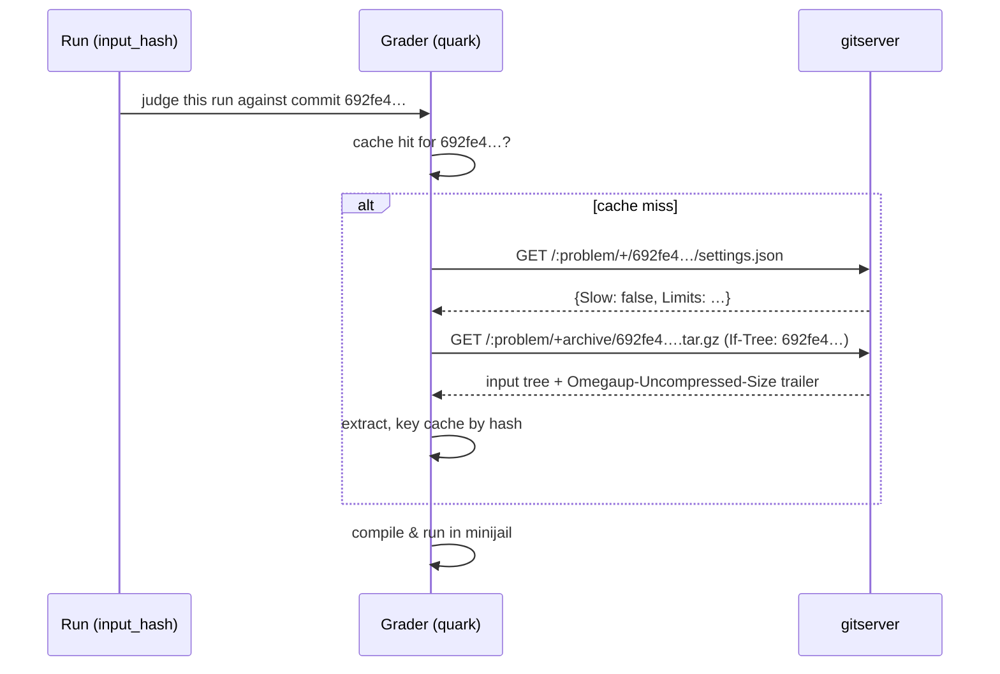

# Arquitectura de GitServer

Cada problema en omegaUp es un repositorio de git. No "respaldado por git", no "versionado con algo similar a git": un repositorio libgit2 simple y real ubicado en el disco bajo `/var/lib/omegaup/problems.git/<alias>`, con confirmaciones, referencias, árboles y blobs. `gitserver` es el pequeño servicio Go ([github.com/omegaup/gitserver](https://github.com/omegaup/gitserver)) que posee esos repositorios y distribuye su contenido a través de HTTP, una revisión a la vez. La interfaz PHP nunca toca los directorios `.git` directamente y tampoco lo hace el calificador; ambos pasan por gitserver, porque gitserver es el único proceso que sabe cómo hacer cumplir el diseño de la rama del problema, validar una carga y decidir quién puede ver los casos de prueba secretos.

El modelo mental de una línea: **gitserver es una interfaz HTTP con reconocimiento de permisos para un montón de repositorios de git básicos, un repositorio por problema.** Habla el protocolo git smart-HTTP (por lo que, literalmente, puedes `git clone` resolver un problema si tienes un token) a través de [omegaup/githttp](https://github.com/omegaup/githttp), además de dos comodidades superpuestas: una API de lectura "bonita" en `/+/…` para recuperar un solo blob o árbol por revisión, y una API de carga `.zip` en `/git-upload-zip` que convierte un archivo de problemas en una confirmación bien formada.

## ¿Por qué git?

La razón por la que omegaUp almacena problemas en git en lugar de en filas de MySQL o en un almacén de blobs se reduce a tres propiedades que un juez necesita y que git regala.

**Inmutabilidad y direccionamiento de contenido.** Una "versión" problemática es un hash de confirmación de git: un SHA-1 de 40 hexadecimales como `692fe483a2d61bff54cd52b9f9c959d977b1abe9`. Ese hash se deriva de los bytes exactos de cada caso de prueba, declaración, validador y `settings.json` en ese momento. Dos problemas con contenidos idénticos producen el hash idéntico; cambiar un solo byte de un único archivo `.out` produce un hash completamente diferente. Esto es lo que hace que la caché del clasificador sea correcta: el clasificador codifica su caché de entrada en el disco mediante ese hash (consulte [`grader/input.go`](https://github.com/omegaup/quark/blob/main/grader/input.go)), por lo que puede confiar en que `692fe4…` siempre significa los mismos datos de prueba para siempre y nunca tiene que preguntar "¿mi copia en caché está obsoleta?"

**Un historial completo y auditable de forma gratuita.** Debido a que cada edición es una confirmación, toda la evolución de un problema (cada solución de declaración, cada caso de prueba agregado, cada límite de tiempo reajustado) es un registro de Git transitable. Revertir una edición incorrecta es simplemente señalar una referencia a una confirmación anterior; no hay una "tabla de deshacer" que mantener.

**El rejuicio del cambio se convierte en una comparación hash.** Cuando se juzga un envío, omegaUp registra *con qué* confirmación se juzgó: las columnas `commit` y `version` en la fila `Runs`, configuradas desde `$problem->commit` / `$problem->current_version` en [`Run.php`](https://github.com/omegaup/omegaup/blob/main/frontend/server/src/Controllers/Run.php) alrededor de L534. Si el autor del problema posteriormente soluciona un caso de prueba roto, el hash publicado cambia y omegaUp puede volver a juzgar exactamente las ejecuciones cuyo hash almacenado ya no coincide con el actual. Sin versiones centradas en el contenido, habría que rejuzgar todo o adivinar.

## El diseño de la sucursal es el modelo de seguridad.

Aquí está la parte que la antigua wiki nunca hizo obvia y la parte que debes internalizar antes de que cualquier otra cosa tenga sentido: un repositorio de problemas **no** es un árbol con todo lo que contiene. Los archivos del problema se dividen deliberadamente en varias ramas según la sensibilidad, y la división se aplica mediante una tabla codificada de expresiones regulares de ruta, `DefaultCommitDescriptions`, en [`handler.go`](https://github.com/omegaup/gitserver/blob/main/handler.go#L122). Cuando subes un zip problemático, gitserver enruta cada archivo a una rama según lo que sea:

- **`refs/heads/public`**: todo lo que un concursante puede ver: `statements/…` (el `.md`/`.markdown` más imágenes), `examples/`, los resguardos interactivos *distribuibles* (`interactive/Main.distrib.*`), `validator.distrib.*` y `settings.distrib.json`. Esta es la rama que leen los usuarios anónimos.
- **`refs/heads/protected`** — `solutions/…` y el directorio `tests/`. Visible para alguien que ha *resuelto* el problema, pero no para un concursante en mitad del concurso.
- **`refs/heads/private`** — la salsa secreta: `cases/*.in` y `cases/*.out` (los datos reales de los jueces), los verdaderos `interactive/Main.*` y `.idl`, los verdaderos `validator.*` y los autorizados `settings.json`. Sólo el evaluador y los administradores leyeron esto.
- **`refs/heads/master`** — la combinación de los tres anteriores; el canónico "estado actual del problema" que aprueba la revisión.
- **`refs/heads/published`**: un puntero a la confirmación `master` específica que está activa actualmente. gitserver se niega a mover `published` a cualquier cosa que no sea ya una confirmación accesible en `master` (`ErrPublishedNotFromMaster`, "publicado-must-point-to-commit-in-master", [`handler.go#L52`](https://github.com/omegaup/gitserver/blob/main/handler.go#L52)). Este es el límite entre "borrador versus vivo": puedes impulsar nuevos compromisos para `master` todo el día y nada cambia para los concursantes hasta que `published` esté avanzado.

Dos espacios de nombres de referencia más lo completan: **`refs/meta/config`** contiene un único `config.json` que describe el comportamiento de publicación (`mirror` vs. `subdirectory`, [`handler.go#L1099`](https://github.com/omegaup/gitserver/blob/main/handler.go#L1099)), **`refs/meta/review`** contiene datos de revisión de código (comentarios, iteraciones, el libro mayor) y ediciones pendientes bajo revisión en vivo en **`refs/changes/*`**. Cualquier envío cuya referencia objetivo no sea ninguna de estas se rechaza directamente mediante la validación en [`handler.go#L1529`](https://github.com/omegaup/gitserver/blob/main/handler.go#L1529); no se puede inventar una rama.

La recompensa de este diseño es que el control de acceso se reduce a *"¿qué referencias puede ver esta persona que llama?"*, y esa decisión reside en una función, `referenceDiscovery` en [`cmd/omegaup-gitserver/main.go`](https://github.com/omegaup/gitserver/blob/main/cmd/omegaup-gitserver/main.go): una persona que llama que `CanViewAllRefs` ve todo; una persona que llama y que simplemente recibe `HasSolved` también obtiene `refs/heads/protected`; una persona que llama y tiene `CanView` (un problema público) obtiene `refs/heads/public`; todos los demás no ven nada. Un concursante literalmente no puede recuperar `cases/1.out` porque la rama en la que vive es invisible para ellos durante el descubrimiento de referencias: no se filtra después del hecho, simplemente nunca se publicita.


## Leer un problema por revisión: la ruta del frontend

Cuando la interfaz necesita un archivo para solucionar un problema (por ejemplo, la declaración en español para renderizar o `settings.json` para mostrar los límites), **no** abre el repositorio. Construye un `\OmegaUp\ProblemArtifacts` y solicita una ruta. La clase está en [`ProblemArtifacts.php`](https://github.com/omegaup/omegaup/blob/main/frontend/server/src/ProblemArtifacts.php), y su constructor toma las dos cosas que identifican completamente un rango de bytes en todo este sistema: el alias del problema y una revisión, que **por defecto es la cadena `'published'`** para que las lecturas ordinarias siempre vean la versión en vivo:

```php
$artifacts = new \OmegaUp\ProblemArtifacts($alias, /* revision */ 'published');
$statement = $artifacts->get('statements/es.markdown');
```
Debajo del capó, `ProblemArtifacts::get()` construye un `GitServerBrowser` y accede a la URL bastante leída, cuya forma vale la pena memorizar porque todo se lee a través de ella:

```
GET  {OMEGAUP_GITSERVER_URL}/{alias}/+/{revision}/{path}
```
construido por `GitServerBrowser::buildShowURL()` como `OMEGAUP_GITSERVER_URL . "/{$alias}/+/{$revision}/{$path}"`. `OMEGAUP_GITSERVER_URL` tiene como valor predeterminado `http://localhost:33861` (puerto `OMEGAUP_GITSERVER_PORT`, actualmente `33861`, de [`config.default.php#L62`](https://github.com/omegaup/omegaup/blob/main/frontend/server/config.default.php)). La revisión puede ser el literal `published`, el nombre de una rama o un hash de confirmación concreto; la ruta del clasificador siguiente utiliza el formato hash. Existen constructores complementarios para las otras formas de lectura: `/{alias}/+archive/{revision}.zip` para una descarga de árbol completo y `/{alias}/+log/{revision}` para el historial.

El manejo de errores está en línea y es deliberado: `get()` lee el estado HTTP de cURL, y cualquier cosa que no sea `200`, `403` o `404` genera un `ServiceUnavailableException` (gitserver probablemente esté inactivo), mientras que un `403`/`404` se convierte en un `NotFoundException('resourceNotFound')`. Esa es la disciplina 403-vs-404 que se ve en omegaUp: un árbitro privado responde como "no encontrado" en lugar de "prohibido", por lo que no se filtra la existencia misma de un archivo oculto. El navegador establece tiempos de espera estrictos (`CURLOPT_CONNECTTIMEOUT => 5`, `CURLOPT_TIMEOUT => 30`) para que un gitserver bloqueado no pueda bloquear el procesamiento de una página.

## Lectura de un problema por revisión: la ruta del calificador

El evaluador es el otro lector, y es la razón por la que existe todo el esquema de tratamiento del contenido. Cada ejecución lleva un `input_hash`: la confirmación del problema según la cual se juzga el envío (consulte `common.Run` en [`common/run.go#L30`](https://github.com/omegaup/quark/blob/main/common/run.go)). Antes de poder ejecutar el código, el evaluador necesita los datos de prueba de esa revisión exacta y los obtiene directamente de gitserver mediante hash. Dos solicitudes hacen el trabajo, ambas en [`grader/input.go`](https://github.com/omegaup/quark/blob/main/grader/input.go):

```
GET {gitserverURL}/{problemName}/+/{inputHash}/settings.json      # is this problem "slow"?
GET {gitserverURL}/{problemName}/+archive/{inputHash}.tar.gz       # the whole input tree
```
`IsProblemSlow()` extrae solo `settings.json` de ese hash y lee el booleano `Slow` para decidir a qué cola pertenece la ejecución; el resultado se memoriza en un caché global codificado por `problemName:inputHash`, por lo que se pregunta un problema candente como máximo una vez por versión. `CreateArchiveFromGit()` luego transmite `+archive/{inputHash}.tar.gz` a un archivo local y, de manera crucial, envía un encabezado `If-Tree: {inputHash}` para que gitserver pueda provocar un cortocircuito si el clasificador ya tiene ese árbol. La respuesta incluso lleva el tamaño sin comprimir en un remolque `Omegaup-Uncompressed-Size` para que la niveladora pueda realizar una verificación previa del espacio en disco. Debido a que la recuperación se realiza mediante hash inmutable, el calificador puede (y lo hace) almacenar en caché la entrada extraída codificada por ese hash y reutilizarla en cada envío a esa versión del problema, y ​​solo la recupera cuando llega un envío con un hash que nunca ha visto.


## Escribir un problema: git-upload-zip y estrategias de combinación

Los autores no impulsan git sin formato: la interfaz lo hace, en su nombre, a través del punto final de carga zip. `ProblemDeployer::commit()` en [`ProblemDeployer.php`](https://github.com/omegaup/omegaup/blob/main/frontend/server/src/ProblemDeployer.php) envía el archivo del problema a:

```
POST {OMEGAUP_GITSERVER_URL}/{alias}/git-upload-zip?message=…&acceptsSubmissions=…&updatePublished=…&mergeStrategy=…[&create=true][&settings=…]
```
con `Content-Type: application/zip` y el cuerpo de la cremallera transmitido a través de `CURLOPT_INFILE`. `ZipHandler` ([`ziphandler.go`](https://github.com/omegaup/gitserver/blob/main/ziphandler.go)) de gitserver descomprime el archivo, enruta cada archivo a su rama a través de la tabla `DefaultCommitDescriptions` anterior, crea las confirmaciones divididas y, si es `updatePublished=true`, avanza `published` al nuevo `master`. El frontend aplica un `ZIP_MAX_SIZE` de `100 * 1024 * 1024` (100 MiB) *antes* de enviar ([`ProblemDeployer.php#L13`](https://github.com/omegaup/omegaup/blob/main/frontend/server/src/ProblemDeployer.php)) y configura un `CURLOPT_TIMEOUT => 120`, que coincide en el servidor con un `writeTimeout` de `2 * time.Minute` en [`main.go`](https://github.com/omegaup/gitserver/blob/main/cmd/omegaup-gitserver/main.go) (con el comentario "El frontend tiene un 120 segundos de tiempo de espera"): los dos lados se mantienen sincronizados deliberadamente para que ninguno se dé por vencido mientras el otro todavía está trabajando.

El parámetro de consulta `mergeStrategy` selecciona cómo se combina el árbol cargado con lo que ya está allí y se asigna a los cuatro valores de `ZipMergeStrategy` en [`ziphandler.go#L47`](https://github.com/omegaup/gitserver/blob/main/ziphandler.go):

- **`ours`**: mantiene el árbol de confirmación principal tal como está; ignore la versión zip de los archivos. Se utiliza cuando solo tocas un subconjunto.
- **`theirs`** — compra el árbol del zip al por mayor; lo opuesto a `ours` (y, como señala el código, algo para lo que git simple no tiene un equivalente directo).
- **`statements-ours`**: lleva el zip a todas partes *excepto* `statements/`, que se conserva del padre (para que volver a cargar los datos de prueba no bloquee las declaraciones traducidas).
- **`recursive-theirs`**: fusiona los archivos zip en el árbol existente de forma recursiva, zip gana en los conflictos.

`ProblemDeployer::commit()` elige entre estos según el tipo de edición que se esté realizando. Una protección en línea que vale la pena conocer: una carga de `theirs` que llega sin declaraciones, o sin la declaración predeterminada en español, se rechaza (`ErrNoStatements` / `ErrNoEsStatement`, [`handler.go#L104`](https://github.com/omegaup/gitserver/blob/main/handler.go#L104)); cada problema debe incluir al menos una declaración `es`.

## Autenticación: tres esquemas, una decisión centrada en el problema

Cada solicitud a gitserver se autentica y luego se autoriza *por problema*, en `authorize()` en [`cmd/omegaup-gitserver/auth.go`](https://github.com/omegaup/gitserver/blob/main/cmd/omegaup-gitserver/auth.go). Hay tres formas de demostrar quién es usted, probadas en orden:

1. **Token portador de PASETO** (la ruta normal). La interfaz genera un PASETO público v2 con `SecurityTools::getGitserverAuthorizationHeader()` → `getGitserverAuthorizationToken()` en [`SecurityTools.php`](https://github.com/omegaup/omegaup/blob/main/frontend/server/src/SecurityTools.php): emisor `omegaUp frontend`, asunto = el nombre de usuario, un reclamo de `problem` que nombra el único problema para el que es bueno y una caducidad de **5 minutos** (`PT5M`). gitserver lo verifica con el ed25519 `PublicKey` de la interfaz desde la configuración y vuelve a leer el nombre de usuario y el problema (`parseBearerToken`). De corta duración y con un alcance problemático, un token filtrado es casi inútil.
2. **Token `OmegaUpSharedSecret`**: un secreto previamente compartido que solo se respeta cuando `AllowSecretTokenAuthentication` está activado. El encabezado es `Authorization: OmegaUpSharedSecret {token} {username}`. Así es como el clasificador se autentica como usuario especial `omegaup:grader` y cómo el frontend puede autenticarse como `omegaup:system` sin PKI.
3. **HTTP Básico** con el **token git** personal de un usuario: esto es lo que le permite a un humano `git clone` tener un problema. La contraseña se compara con el hash argon2id de `git_token` almacenado en la fila `Users` (`verifyArgon2idHash`, consultando `Users`/`Identities` por nombre de usuario). Si el nombre de usuario básico no coincide con el asunto del token, la autenticación falla por completo.

Cualquiera que sea el esquema que gane, el `username` resultante se asigna a privilegios. Las identidades especiales están codificadas y son las que hay que recordar: **`omegaup:system`** es la interfaz y es completamente confiable (`IsSystem`, `IsAdmin`, puede ver todas las referencias y editarlas); **`omegaup:grader`** obtiene acceso de solo lectura a *todas* las referencias de cada problema (para que siempre pueda acceder a `private`); **`omegaup:health`** es una identidad de solo host local utilizada por la sonda de preparación en el repositorio `:testproblem`. Todos los demás, un usuario real que ha iniciado sesión, activa una devolución de llamada: gitserver envía POST al `FrontendAuthorizationProblemRequestURL` del frontend (`https://omegaup.com/api/authorization/problem/` predeterminado) con el nombre de usuario y el alias del problema, y ​​el frontend responde con los booleanos `has_solved` / `is_admin` / `can_view` / `can_edit` que controlan el `referenceDiscovery`. gitserver, en otras palabras, delega la pregunta "¿Este usuario tiene derechos sobre este problema?" La pregunta vuelve al monorepo de PHP, porque ahí es donde realmente se encuentran las ACL, la membresía del concurso y la inscripción al curso. Una discrepancia entre el reclamo `problem` del token y el repositorio al que se dirige es un `403` ("Nombre de problema no coincidente"): un token para un problema nunca puede leer otro.

## Problemas lentos y el límite de tiempo estricto

gitserver no solo almacena problemas, también decide en el *momento de confirmación* si un problema es "lento" y aplica un límite absoluto. Dos constantes en [`ziphandler.go#L35`](https://github.com/omegaup/gitserver/blob/main/ziphandler.go) gobiernan esto: `slowQueueThresholdDuration = 30s` y `OverallWallTimeHardLimit = 60s`. Cuando se crea una confirmación, `isSlow()` en [`handler.go#L281`](https://github.com/omegaup/gitserver/blob/main/handler.go) estima el tiempo de ejecución total en el peor de los casos (número de casos veces (`TimeLimit + ExtraWallTime`, más los propios límites del validador si es un validador personalizado)) y señala el problema `Slow` en su `settings.json` si esa estimación alcanza el umbral de 30 segundos; ese booleano es exactamente lo que lee el calificador para enrutar la ejecución a una cola lenta. Y si el `OverallWallTimeLimit` configurado para un problema excede el límite estricto de 60 segundos *y* el tiempo de ejecución máximo estimado también lo haría, la carga se rechaza directamente con `ErrSlowRejected` ("rechazado lento"): no se puede cometer un problema que podría monopolizar a un corredor indefinidamente, porque el límite está integrado en el artefacto en lugar de ser confiable en el momento del juicio. También hay una protección plana `objectLimit = 10000` ([`handler.go#L34`](https://github.com/omegaup/gitserver/blob/main/handler.go)) / `ErrTooManyObjects` para que un archivo de paquete patológico no pueda hacer estallar el servidor.

## Superficie operativa

**Enrutamiento.** El `muxGitHandler.ServeHTTP` en [`main.go`](https://github.com/omegaup/gitserver/blob/main/cmd/omegaup-gitserver/main.go) es un despachador manual en la ruta URL: `/health/*` → controlador de salud, `/metrics` → Prometheus, cualquier cosa que termine en `git-upload-zip` o `rename-repository` → `ZipHandler`, todo lo demás → el controlador git smart-HTTP (que sirve para ambos las lecturas bonitas del `/+/…` y el protocolo sin formato `git-upload-pack`/`git-receive-pack`).

**Puertos y almacenamiento.** El servidor escucha en `Port` (`33861` predeterminado) y, si se configura `PprofPort` (`33862` predeterminado), expone el `net/http/pprof` de Go solo en el host local; ese segundo puerto es un punto final de creación de perfiles, **no** un puerto de protocolo git separado. `RootPath` tiene como valor predeterminado `/var/lib/omegaup/problems.git` y no debe estar vacío o el proceso se cerrará al inicio. Consulte los valores predeterminados en [`cmd/omegaup-gitserver/config.go`](https://github.com/omegaup/gitserver/blob/main/cmd/omegaup-gitserver/config.go).

```json
{
  "Gitserver": {
    "RootPath": "/var/lib/omegaup/problems.git",
    "PublicKey": "gKEg5JlIOA1BsIxETZYhjd+ZGchY/rZeQM0GheAWvXw=",
    "Port": 33861,
    "PprofPort": 33862,
    "LibinteractivePath": "/usr/share/java/libinteractive.jar",
    "AllowDirectPushToMaster": false,
    "FrontendAuthorizationProblemRequestURL": "https://omegaup.com/api/authorization/problem/",
    "UseS3": false
  }
}
```
**Durabilidad a través de S3 (opcional).** Cuando `UseS3` es verdadero, gitserver registra un `PostUpdateCallback` que, después de cualquier cambio de referencia o archivo de paquete, refleja los archivos actualizados hasta el depósito `omegaup-problems` S3 ([`main.go`](https://github.com/omegaup/gitserver/blob/main/cmd/omegaup-gitserver/main.go)). Omite deliberadamente los repositorios cuya ruta contiene `temp.`: son repositorios de trabajo previamente confirmados que se cargan solo una vez finalizados.

**Comprobación de estado.** La sonda de preparación (`/health/ready`, [`health.go`](https://github.com/omegaup/gitserver/blob/main/health.go)) es un ejercicio genuino de extremo a extremo, no un ping: si el repositorio especial de `:testproblem` aún no existe, lo crea PUBLICANDO un `testproblem.zip` integrado a través de `git-upload-zip`, luego crea un `GET /:testproblem/+/private/settings.json` real como `omegaup:health` y solo informa que está en buen estado. `200`. Entonces, una verificación de preparación verde significa que toda la ruta de lectura *y* escritura realmente funciona, incluido el disco y libgit2.

**libinteractive.** Para problemas interactivos, gitserver envía a `libinteractive.jar` (ruta desde `LibinteractivePath`) en el momento de la confirmación para compilar el `.idl` en códigos auxiliares por idioma; consulte [`libinteractive.go`](https://github.com/omegaup/gitserver/blob/main/libinteractive.go). Es por eso que la imagen de Docker instala un JRE.

## Mapa fuente

El servicio es lo suficientemente pequeño como para guardarlo en la cabeza. Leyendo [github.com/omegaup/gitserver](https://github.com/omegaup/gitserver):

- [`cmd/omegaup-gitserver/main.go`](https://github.com/omegaup/gitserver/blob/main/cmd/omegaup-gitserver/main.go): entrada de proceso, mezcla HTTP, `referenceDiscovery`, actualización posterior de S3, cierre ordenado.
- [`cmd/omegaup-gitserver/auth.go`](https://github.com/omegaup/gitserver/blob/main/cmd/omegaup-gitserver/auth.go): los tres esquemas de autenticación, la verificación PASETO/argon2, las identidades especiales y la devolución de llamada de autorización de interfaz.
- [`cmd/omegaup-gitserver/config.go`](https://github.com/omegaup/gitserver/blob/main/cmd/omegaup-gitserver/config.go): estructura de configuración y valores predeterminados.
- [`handler.go`](https://github.com/omegaup/gitserver/blob/main/handler.go): diseño de rama (`DefaultCommitDescriptions`), validación de confirmación, generación de `settings.json`, detección de problemas lentos, estructuras de revisión/libro mayor.
- [`ziphandler.go`](https://github.com/omegaup/gitserver/blob/main/ziphandler.go): carga zip, las cuatro estrategias de fusión, publicación.
- [`health.go`](https://github.com/omegaup/gitserver/blob/main/health.go), [`metrics.go`](https://github.com/omegaup/gitserver/blob/main/metrics.go), [`libinteractive.go`](https://github.com/omegaup/gitserver/blob/main/libinteractive.go), [`normalizer.go`](https://github.com/omegaup/gitserver/blob/main/normalizer.go) — las piezas de soporte.

Y del lado de las personas que llaman: [`ProblemArtifacts.php`](https://github.com/omegaup/omegaup/blob/main/frontend/server/src/ProblemArtifacts.php) + [`SecurityTools.php`](https://github.com/omegaup/omegaup/blob/main/frontend/server/src/SecurityTools.php) + [`ProblemDeployer.php`](https://github.com/omegaup/omegaup/blob/main/frontend/server/src/ProblemDeployer.php) en el monorepo PHP, y [`grader/input.go`](https://github.com/omegaup/quark/blob/main/grader/input.go) en quark.

## Documentación relacionada

- **[Grader Internals](grader-internals.md)**: cómo el calificador consume revisiones y almacena en caché las entradas mediante hash.
- **[API de problemas](../reference/api.md)**: los puntos finales de gestión de problemas que, en última instancia, impulsan `ProblemDeployer`.
- **[Problem Versioning](../features/problem-versioning.md)**: la vista de borradores, publicaciones e historial de cara al autor.
