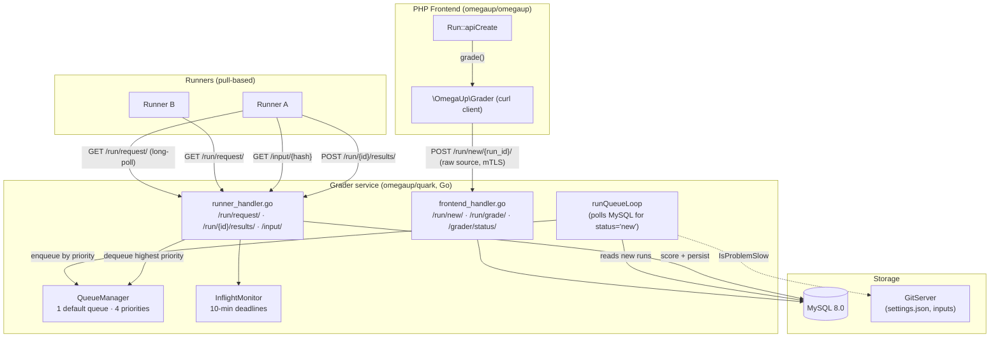

# Componentes internos del clasificador

El Calificador es la pieza que convierte "el usuario presionó Enviar" en un veredicto y un
puntuación. **No** es parte del PHP monorepo: es un servicio independiente escrito
en Go que vive en el [`omegaup/quark`](https://github.com/omegaup/quark)
repositorio, en [`cmd/omegaup-grader/`](https://github.com/omegaup/quark/tree/main/cmd/omegaup-grader)
(el servicio HTTP) y [`grader/`](https://github.com/omegaup/quark/tree/main/grader)
(la cola y el núcleo de puntuación). Todo lo que el backend de PHP sabe cabe en un
cliente HTTP ligero único, [`\OmegaUp\Grader`](https://github.com/omegaup/omegaup/blob/main/frontend/server/src/Grader.php),
que no hace nada más que `curl` JSON y bytes sin procesar al servicio Go y leer
las respuestas de vuelta. Si busca la cola, el despachador, el
validadores, o la zona de pruebas en el código PHP, no los encontrará, todos son
en el lado Ir. Esta página rastrea un envío real desde el momento en que PHP lo entrega
salir, a través de la cola, salir a un corredor y regresar a una puntuación, nombrando el
Funciones y constantes que realizan cada paso.

El modelo mental de una línea: **el Calificador es una cola de prioridad con un TLS mutuo
puerta de entrada, un despachador basado en extracción para corredores y un reductor de token/puntuación que
convierte los resultados por caso en una calificación final.** El trabajo pesado de
compilar y ejecutar código pertenece al [Runner](runner-internals.md); el
Grader organiza y "se lava las manos" de una carrera en el instante en que está segura.
en cola.

## El límite de confianza: TLS mutuo sobre HTTPS

Cada byte entre PHP y Grader cruza un código cifrado y mutuamente autenticado.
canal, y esto es más deliberado que decorativo, en una programación temprana
En el concurso alguien se sentó en el cable y olfateó el tráfico de sumisiones, por lo que la regla se convirtió en
que *toda* la comunicación con los subsistemas de omegaUp esté cifrada. El cliente PHP en
[`Grader::curlRequestSingle`](https://github.com/omegaup/omegaup/blob/main/frontend/server/src/Grader.php)
presenta un certificado de cliente (`/etc/omegaup/frontend/certificate.pem` con clave
`/etc/omegaup/frontend/key.pem`), pines `CURLOPT_SSL_VERIFYPEER => true` y
`CURLOPT_SSL_VERIFYHOST => 2`, fuerza a `CURL_SSLVERSION_TLSv1_2` y habla con
`OMEGAUP_GRADER_URL`: cuyo valor predeterminado es `https://localhost:21680`
([config.default.php L61](https://github.com/omegaup/omegaup/blob/main/frontend/server/config.default.php)).
En el lado Go, el oyente del evaluador que mira hacia el corredor establece
`ClientAuth: tls.RequireAndVerifyClientCert`, por lo que un Runner (o el frontend) que
no puede presentar un certificado válido se rechaza en el protocolo de enlace TLS, antes de cualquier
El controlador se ejecuta. El tiempo de espera de conexión es de 5 segundos y el tiempo de espera general de la solicitud es
30 segundos; un pequeño conjunto de fallas transitorias (`SSL connection timeout`,
`Connection timed out`, `HTTP/2 stream`, `INTERNAL_ERROR`, …) se reintentan hasta
3 veces con retroceso exponencial (1s, 2s, 4s con un límite de 5s), porque un momento
El evaluador ocupado no debe reprobar una entrega por completo.

!!! nota "Verruga histórica: `--insecure`"
    La receta original de la consola para pinchar la niveladora con la mano.
    `curl --url https://localhost:21680/grade/ -d '{"id": 12345}' -E frontend/omegaup.pem --cacert ssl/omegaup-ca.crt --insecure`.
    El `--insecure` estaba allí sólo porque el certificado de la niveladora no llevaba
    su nombre de host en la CN; dale `localhost` como CN y la bandera desaparece.
    El cliente PHP de producción no lo utiliza: verifica estrictamente al par.

## Descripción general de la arquitectura


## Recibir una carrera

El viaje comienza en el controlador PHP. Cuando un concursante se presenta, la solicitud
aterriza en [`\OmegaUp\Controllers\Run::apiCreate`](https://github.com/omegaup/omegaup/blob/main/frontend/server/src/Controllers/Run.php)
(la clase es `Run`, no `RunController`; omegaUp elimina el sufijo `Controller`),
alrededor de la línea 415. `apiCreate` hace toda la vigilancia que debe realizarse mientras todavía
tener la sesión del usuario: valida los campos requeridos, verifica el concurso
membresía y el límite de tiempo, aplica el límite de tasa de envío, inserta un
fila `Runs`, y solo entonces, alrededor de la línea 573, se desconecta con una sola llamada:

```php
\OmegaUp\Grader::getInstance()->grade($run, trim($source));
```
`grade()` es casi decepcionante. PUBLICA el **código fuente sin formato** (no JSON -
`REQUEST_MODE_RAW`, `Content-Type: application/octet-stream`) a
`OMEGAUP_GRADER_URL . "/run/new/{$run->run_id}/"`. Observe lo que *no* envía:
sin configuraciones de problemas, sin casos de prueba, sin metadatos de idioma en el cuerpo. la carrera
El entero `run_id` en la ruta URL es la transferencia completa. Todo lo demás, el
Grader buscará por sí mismo. Este es el momento del "estudiante se lava las manos" para
la interfaz: una vez que este curl devuelve 200, PHP está listo y la página del concursante
recurre a las encuestas para determinar el veredicto.

En el lado Ir, el [controlador `/run/new/`](https://github.com/omegaup/quark/blob/main/cmd/omegaup-grader/frontend_handler.go)
analiza el `run_id` fuera de la ruta y llama a `newRunInfoFromID`, que es donde
el Grader llega directamente al propio MySQL (tiene su propio
Conexión `go-sql-driver/mysql`: Grader es un cliente de base de datos de primera clase,
no simplemente un consumidor de tablas de PHP). Esa consulta se une a `Ejecuciones → Envíos →
Problemas`, and left-joins `Problemset_Problems → Concursos`, para armar un
`RunInfo`: el envío `guid`, el alias del concurso, la identificación del conjunto de problemas, el
`penalty_type`, el `score_mode`, el idioma, el alias del problema, el premio
puntos y el hash `version` de entrada del problema. Si el concurso no tiene `score_mode`
el valor predeterminado del clasificador es `"partial"`; si no hay puntos de concurso, establece un
`MaxScore` de `1/1`. Luego, el controlador escribe la fuente sin procesar en el artefacto.
almacenar a través de `artifacts.Submissions.PutSource(...)`, marca la ejecución `status = 'new'`
en la base de datos, y empuja un canal Go:

```go
select {
case newRuns <- struct{}{}:
default:
}
```
Ese envío sin bloqueo es todo el mecanismo de notificación: empuja al
bucle en segundo plano activado sin bloquear nunca el controlador HTTP, y si el bucle es
ya programado para ejecutarse, la rama `default` suelta el empujón redundante en el
piso. El controlador devuelve `200 OK` y el envío ahora es el del bucle de cola.
problema.

### Los jueces toman una puerta diferente

La nueva calificación de un conjunto de ejecuciones existente no pasa por `/run/new/`. El lado PHP
llama a [`Grader::rejudge`](https://github.com/omegaup/omegaup/blob/main/frontend/server/src/Grader.php),
que PUBLICA JSON - `{"run_ids": [...], "rejudge": true, "debug": false}` - a
`/run/grade/`. Ese controlador es aún más delgado: registra la solicitud y activa el
mismo empujón de canal `newRuns`, porque la interfaz ya ha invertido esas ejecuciones'
`status` vuelve a `'new'` en MySQL. El indicador `debug` está cableado a `false` con
a `TODO(lhchavez): Re-enable with ACLs` - reprocesamiento de depuración (que permiten
AddressSanitizer en C/C++ y necesitan un perfil de espacio aislado relajado) están cerrados hasta
Adecuado control de acceso a los terrenos.

## El modelo de cola

Aquí es donde la implementación actual difiere marcadamente de la antigua wiki, y
de todo lo que todavía habla de "ocho colas". **La niveladora Go moderna tiene un
cola única llamada `default` con cuatro niveles de prioridad, no ocho nombrados
colas.** Las cuatro prioridades se definen en
[`grader/queue.go`](https://github.com/omegaup/quark/blob/main/grader/queue.go)
como `QueueCount = 4`:

- **`QueuePriorityHigh`** (0) — reservado para *solicitudes*. Cuando una carrera tiene que ser
  reintentado (un Runner se quedó en silencio o devolvió un error transitorio), vuelve a saltar
  al frente para que no se quede detrás de un nuevo trabajo atrasado que ya ha esperado
  a través de una vez.
- **`QueuePriorityNormal`** (1): el valor predeterminado para una ejecución recién enviada en un
  problema de velocidad normal.
- **`QueuePriorityLow`** (2) — usado para problemas *lentos* y para *rejuicios*, por lo que
  que un replanteamiento masivo o un problema patológicamente lento no puede monopolizar el
  Corredores y concursantes vivos hambrientos.
- **`QueuePriorityEphemeral`** (3) — la prioridad más baja, para "ejecutar este código"
  patio de juegos (el recorrido efímero). Estas carreras también son especiales en que
  sus resultados **no** persisten en el sistema de archivos; ellos viven en un
  caché de tamaño fijo, último en entrar, primero en salir (`EphemeralRunManager`) que expulsa
  ejecución más antigua una vez que excede su límite de tamaño.

!!! info "Adónde fueron las 'ocho colas'"
    La arquitectura clásica omegaUp (backend v1) realmente modeló esto como ocho
    colas con nombre: `urgente`, `urgente lento`, `concurso`, `concurso lento`,
    `normal`, `normal lento`, `rejudge`, `rejudge lento` — donde está el "lento"
    Las colas (lentas) presentaban problemas que, en el peor de los casos, tardaban más de 30 segundos.
    para devolver un TLE, y solo una fracción de los corredores (en un momento el 50%) podría servir
    para que no acapararan la capacidad. La niveladora actual colapsa todo ese
    esquema en estos cuatro niveles de prioridad más un booleano `slow` por problema.
    **No** hay un límite del 50 % de los corredores en el código actual; "lento" simplemente degrada a un
    ejecutar de prioridad Normal a Baja. Si te encuentras necesitando lo viejo
    justicia fina, ahí es donde vivió y lo que hizo.

!!! info "Histórico: los evaluadores remotos y sus minúsculas listas de espera"
    En el backend v1, Grader no solo enviaba a los corredores locales, después
    Al examinar el registro de la base de datos de una ejecución, podría redirigirlo a la cola del
    *evaluador apropiado* (`local`, `uva`, `pku`, `tju`, `livearchive`, `spoj`),
    reenviar la presentación a un juez externo en línea y cambiar su estado a
    "esperando" antes de "lavarse las manos" y volver a esperar el siguiente
    notificación. Esos evaluadores remotos tenían listas de espera deliberadamente pequeñas: **UVa
    permitido ~10 espacios simultáneos y cada otro juez solo uno, porque ninguno de
    alguna vez anticiparon que los consumidores automatizados de su información
    existen **, por lo que omegaUp se esforzó mucho para evitar abusar de ellos. Una vez un control remoto
    El juez respondió con veredicto, que el evaluador era responsable de actualizar el
    registro de ejecución y configurando los campos correspondientes. La niveladora Go moderna en
    [`omegaup/quark`](https://github.com/omegaup/quark) se basa en local
    Corredores; Si se pregunta dónde vivía la ruta de juez remoto y por qué
    La concurrencia estaba limitada de manera tan agresiva, esto es todo, y el límite era externo,
    restricción no negociable, no una opción de omegaUp para optimizar.

### ¿Qué hace que un problema sea "lento"?

La degradación a prioridad baja es impulsada por `IsProblemSlow` en
[`grader/input.go`](https://github.com/omegaup/quark/blob/main/grader/input.go).
Recupera `settings.json` para el problema en su hash de entrada exacto del
GitServer (`GET {gitserver}/{problem}/+/{hash}/settings.json`, con 15 segundos
tiempo de espera) y lee el campo `Slow bool`. Porque preguntarle al GitServer por
el envío sería un desperdicio, la respuesta se memoriza en un caché LRU de 4 MiB
(`slowProblemCache`) con clave de `problemName:inputHash`: el hash está en la clave de
propósito, para que editar un problema (que produce un nuevo hash de entrada) correctamente
invalida la decisión lenta/rápida almacenada en caché.

### El ciclo de ejecución y cómo se asigna realmente la prioridad

El trabajador en segundo plano es `runQueueLoop`.
([frontend_handler.go](https://github.com/omegaup/quark/blob/main/cmd/omegaup-grader/frontend_handler.go)).
Lo primero que hace al iniciar es una recuperación de fallas `UPDATE`: cualquier ejecución cuyo
`status != 'ready'` se restablece a `'new'`, por lo que las carreras quedan atrapadas en el aire por una niveladora
reiniciar simplemente se vuelven a poner en cola en lugar de perderse. Luego registra el máximo actual.
`submission_id` y bloques en el canal `newRuns`.

Cada vez que se activa, drena *todo* el trabajo pendiente: ejecuta repetidamente `SELECT`s con
`status = 'new'` en lotes de `LIMIT 128` hasta que no quede nada nuevo. La consulta es
un `UNION` deliberado de dos mitades: nuevas presentaciones (`submission_id > max`) y
los antiguos (`submission_id <= max`), ambos ordenados por `submission_id ASC, run_id
ASC`. Este ordenamiento es la política de equidad en acción:

```go
priority := grader.QueuePriorityNormal
if maxSubmissionID >= dbRun.submissionID {
    priority = grader.QueuePriorityLow   // an old submission => rejudge => Low
} else {
    maxSubmissionID = dbRun.submissionID // a genuinely new submission
}
```
Un envío cuya identificación sea igual o inferior al máximo registrado solo puede ser una nueva evaluación de
algo que ya existía, por lo que se coloca en prioridad **baja**; un verdaderamente nuevo
el envío permanece en **Normal** (o `IsProblemSlow` lo eleva a Bajo antes).
Luego se vuelve a leer el código fuente de la ejecución desde el almacén de artefactos y el `RunContext` se
en cola a través de `injectRun`. Poner en cola es una operación de bloqueo para ejecuciones normales.
(`enqueueBlocking`): el bucle esperará si el canal de la cola está momentáneamente lleno,
entonces la contrapresión es real y nada se cae silenciosamente; carreras efímeras, por
Por el contrario, utilizan el `enqueue` sin bloqueo y se abandonan inmediatamente si su
El canal está lleno.

## Estado de la cola de lectura: `/grader/status/`

La única ventana que PHP tiene para todo esto es el punto final `/grader/status/`, que
el [`\OmegaUp\Controllers\Grader::apiStatus`](https://github.com/omegaup/omegaup/blob/main/frontend/server/src/Controllers/Grader.php)
El método emerge llamando a `\OmegaUp\Grader::getInstance()->status()`. El PHP
El cliente modela la respuesta con un tipo de Salmo que es el contrato autoritativo.
para los cinco campos que le interesan:

```php
/** @psalm-type GraderStatus=array{
 *   status: string,
 *   broadcaster_sockets: int,
 *   embedded_runner: bool,
 *   queue: array{
 *     running: list<array{name: string, id: int}>,
 *     run_queue_length: int,
 *     runner_queue_length: int,
 *     runners: list<string>
 *   }
 * } */
```
Leer cada campo en comparación con lo que realmente calcula el controlador Go:

- **`status`** — `"ok"` cuando la niveladora está sana. El cliente PHP trata cualquier cosa
  de lo contrario, se produce un error grave y se produce, por lo que un estado que no sea `ok` nunca llega a la persona que llama como
  datos.
- **`broadcaster_sockets`** (int) — cuántos clientes WebSocket hay actualmente
  conectado a la [Emisora](broadcaster.md) y por lo tanto escuchando en vivo
  actualizaciones de veredicto. Este es tu indicador de cuántas personas están mirando un marcador.
  ahora mismo.
- **`embedded_runner`** (bool): si este proceso de calificación también está ejecutando un
  Corredor en proceso. En implementaciones pequeñas o de desarrollo, el clasificador puede alojar su
  propio corredor, por lo que no es necesario levantar uno por separado; en producción esto es
  Normalmente, `false` y Runners son máquinas independientes.
- **`queue.run_queue_length`** (int) — el trabajo pendiente total: el controlador Go suma el
  longitudes de los cuatro niveles de prioridad en cada cola
  (`GetQueueInfo`) en este número. Este es el más útil "es el
  ¿El estudiante está detrás? métrico.
- **`queue.running`** (lista): las ejecuciones en vuelo, cada una como `{name, id}` donde
  `name` es el Runner que lo contiene y `id` es el ID de ejecución. esto viene directo
  del mapa en vivo del `InflightMonitor`, por lo que es exactamente el conjunto de carreras que
  han sido enviados pero aún no han informado de regreso.
- **`queue.runner_queue_length`** (int) y **`queue.runners`** (lista) — el
  Lado inactivo de la imagen del corredor: cuántos corredores están estacionados esperando trabajo
  y sus nombres.

!!! advertencia "Lea los campos de estado en comparación con la compilación en ejecución"
    El punto final de estado es una superficie de informes y qué campos tiene un clasificador determinado.
    La compilación completamente completa puede variar, en el controlador actual.
    ([frontend_handler.go](https://github.com/omegaup/quark/blob/main/cmd/omegaup-grader/frontend_handler.go))
    `run_queue_length` y `running` siempre están llenos, mientras que `runners` se emite
    como una lista vacía. Trate el tipo de Salmo como el contrato estable y el manejador.
    como fuente de verdad de lo que se vive en este momento; si estas construyendo
    alertas además de estas, confirme con la niveladora desplegada en lugar de
    asumiendo que todos los campos no están vacíos.

## Envío a corredores

Algo crucial que hay que internalizar: **el calificador no envía el trabajo a los corredores; el
Los corredores tiran.** Cada corredor encuestas largas `GET /run/request/`
([runner_handler.go](https://github.com/omegaup/quark/blob/main/cmd/omegaup-grader/runner_handler.go)),
y el controlador llama a `runs.GetRun(runnerName, InflightMonitor, closeNotifier)`,
que **bloquea** hasta que haya una ejecución disponible. Por eso no hay despacho.
afinidad para hablar: el corredor que pregunte a continuación obtiene la siguiente carrera, que es
round robin por construcción. (La afinidad existió en algún momento anterior en la historia de omegaUp.
historia y no sería complicado volver a agregarla, pero el modelo pull hace que
cosa simple por defecto.)

Cuando hay una ejecución disponible, `GetRun` escanea los cuatro canales prioritarios **en orden,
el más alto primero** (`for i := range queue.runs`), por lo que una cola de prioridad alta siempre
adelanta al Trabajo Normal, que adelanta al Bajo, que adelanta al Efímero. se retira de la cola
el `RunContext`, lo registra con el `InflightMonitor` a través de `monitor.Add`, y
transmite `runCtx.RunInfo.Run` de regreso al Runner como JSON: el idioma, el problema
nombre y el hash de entrada que el Runner necesita recuperar. La identidad del corredor viene
de `peerName`, que lee el CN del certificado TLS de su cliente (o un encabezado en
modo inseguro/dev), y el evaluador también registra la IP pública del Runner
(encabezado `OmegaUp-Runner-PublicIP`, puerto 6060) para que Prometheus pueda eliminarlo.

Luego, el Runner recupera las entradas de prueba que aún no tiene almacenadas en caché.
`GET /input/{problemName}/{hash}`: un SHA-1 de 40 caracteres hexadecimales del `.zip` de entrada:
y publica los resultados en `POST /run/{attemptID}/results/`.

### La fecha límite de 10 minutos y la lógica de cola

En el momento en que se entrega una tirada, el `InflightMonitor`
([grador/queue.go](https://github.com/omegaup/quark/blob/main/grader/queue.go))
comienza a observarlo, porque un Runner puede fallar, perder su red o bloquearse, y un
La carrera perdida no debe desaparecer silenciosamente. `NewInflightMonitor` establece tanto un
`connectTimeout` y un `readyTimeout` de **10 minutos**. Una gorutina los impone
en dos etapas: primero, el corredor tiene 10 minutos para *conectarse* (para regresar
y comenzar a buscar información/llegar al punto final de resultados), luego otros 10 minutos
para llegar *listo* (publicar sus resultados). Si cualquiera de los temporizadores se dispara antes del correspondiente
señal, `monitor.timeout` supone que el Runner está muerto y llama a `runCtx.Requeue(false)`.

`Requeue` es donde reside el presupuesto de reintento. Cada `RunContext` comienza con
`attemptsLeft = MaxGradeRetries`, cuyo valor predeterminado es **3**
([común/context.go](https://github.com/omegaup/quark/blob/main/common/context.go)).
Cada solicitud de cola lo disminuye y:

- Si quedan intentos, la ejecución se vuelve a poner en cola en **`QueuePriorityHigh`** para que
  salta la línea: ya esperó una vez y no debería ser castigado dos veces.
- Si `attemptsLeft` llega a 0, la ejecución se *abandona*: un `QueueEventTypeAbandoned`
  Se registra el evento y se cierra el contexto. Se produjo un error demasiadas veces, por lo que
  el evaluador se da por vencido en lugar de hacer un bucle para siempre.
- Incluso si la cola de alta prioridad está llena, el calificador se ha quedado sin opciones y
  También se da por vencido: es mejor abandonar una carrera en voz alta que bloquear toda la cola.

Hay un caso especial sutil. Cuando un Runner *con éxito* devuelve un `JE`
(Error del juez), en lugar de guardar silencio, el fallo *podría* ser
transitorio, por lo que se llama a `Requeue` con `lastAttempt = true`, que fija
`attemptsLeft = 1`: la ejecución se reintenta como máximo una vez más y no más. el
La distinción importa: un corredor que informó "lo intenté y se rompió" recibe un trato más
conservadoramente que un corredor que simplemente desapareció. El criterio de valoración de resultados en sí
está envuelto en un `http.TimeoutHandler` con un tiempo de espera de **5 minutos**, por lo que un solo
La carga de resultados que se bloquea no puede ocupar un controlador indefinidamente.

## Validadores: convertir el resultado en una puntuación por caso

Una vez que un Runner ha ejecutado el programa del concursante en un caso de prueba, algún componente
para decidir si la salida es *correcta*. Esa decisión es trabajo del validador, y
omegaUp ofrece cinco tipos de validadores, elegidos por problema a través del `Validator.Name`
campo en `settings.json`
([common/problemsettings.go](https://github.com/omegaup/quark/blob/main/common/problemsettings.go)):

- **`token`**: el valor predeterminado. Tanto los resultados esperados como los de los concursantes están divididos.
  en tokens separados por espacios en blanco y comparados **exactamente**, token por token
  (`a == b`). No importa una nueva línea final o un espacio adicional entre tokens
  porque el espacio en blanco es el delimitador, pero `Hello` y `hello` son diferentes y
  `42` y `42.0` son diferentes.
- **`token-caseless`** — idéntico a `token` pero la comparación por token utiliza
  `strings.EqualFold`, por lo que `YES`, `Yes` y `yes` coinciden. Úselo cuando el
  El enunciado del problema no distingue entre mayúsculas y minúsculas en la respuesta.
- **`token-numeric`** — los tokens se comparan como números de punto flotante dentro de un
  tolerancia, que es lo que se quiere para problemas cuya respuesta es un número real y
  donde `3.0000001` debería contar como `3`. La tolerancia predeterminada
  (`DefaultValidatorTolerance`) es **1e-6**, anulable por problema. el
  La comparación en `tokenNumericEquals` acepta un par si son exactamente iguales, o
  la diferencia absoluta es `<= 1.5 * tolerance`, o la diferencia *relativa* es
  `<= tolerance`: con una rama dedicada cercana a cero (utilizando el valor normal más pequeño)
  double, `2.2250738585072014e-308`) para que las comparaciones con 0 no exploten.
  Si exactamente uno de los dos tokens no se analiza como flotante, no son iguales; si
  *ambos* no se pueden analizar, se tratan como iguales (dos fragmentos de ruido no numérico
  en la misma posición no son una diferencia discriminatoria).
- **`custom`**: para problemas en los que la corrección no se puede reducir a un token
  coincidencia (múltiples respuestas válidas, evaluación especial, crédito parcial mediante una fórmula).
  Se compila y ejecuta un programa de validación que se entrega con el problema **en el
  sandbox, una vez por caso**, alimentó la producción del concursante más la entrada original
  y resultados esperados; cualquier número de punto flotante que imprima en la salida estándar se convierte en
  La puntuación de ese caso, sujeta a la gama `[0, 1]`. Si el archivo `.out` original es
  falta, el clasificador sustituye por `/dev/null` en lugar de reprobar; si el
  El propio programa validador falla, el veredicto del caso se convierte en `VE` (Error del validador).
- **`literal`** — un validador de propósito especial (utilizado principalmente por el efímero
  problemas de ejecución y de entrada literal) que lee la primera ficha del concursante
  directamente como la puntuación en `[0, 1]`, no se realizó comparación.

El motor de comparación es `CalculateScore` en
[corredor/validator.go](https://github.com/omegaup/quark/blob/main/runner/validator.go).
Para los validadores de tokens, recorre ambas salidas al mismo tiempo que un tokenizador.
(escaneo de tokens sin espacios en blanco o tokens numéricos para `token-numeric`): en el
primera posición en la que los dos no están de acuerdo, incluso cuando un producto se queda sin
tokens antes que el otro: produce un `TokenMismatch` que registra lo esperado y
fichas de concursante y el caso obtiene una puntuación de **0**. Si ambas corrientes llegan al final sin
Si no coincide, el caso obtiene **1** (`big.NewRat(1, 1)`). Las puntuaciones se mantienen exactas.
racionales (`math/big.Rat`) en todas partes, no flotantes, por lo que la aritmética de pesos nunca
acumula error de redondeo.

## Puntuación y agrupación

Una puntuación por caso de 0 o 1 (o una fracción, para validadores personalizados) es solo la cifra bruta
materia. La calificación final proviene de agregar casos en **grupos** y combinar
puntuaciones grupales con ponderaciones, en el ciclo de validación de `runner.go`
([agregación de corredores/validadores](https://github.com/omegaup/quark/blob/main/runner/runner.go)).**La pertenencia al grupo se deriva del nombre del caso: el grupo lo es todo antes
el primer `.`.** Esto es literalmente `strings.SplitN(caseName, ".", 2)[0]` en
`CaseWeightMapping.AddCaseName`
([common/problemsettings.go](https://github.com/omegaup/quark/blob/main/common/problemsettings.go)),
entonces un caso llamado `group1.case2` pertenece al grupo `group1` y `sample.0`,
`sample.1` ambos pertenecen a `sample`. No se requiere ningún archivo de mapeo separado: el
la convención de nomenclatura *es* la agrupación.

**Los pesos están normalizados para sumar 1.** Cada estuche lleva un `Weight` (un `big.Rat`);
el bucle primero calcula `totalWeightFactor = 1 / Σ(weights)`, y si los pesos
suma cero, vuelve a ser un factor de 1. La contribución de cada caso es entonces
`weight * totalWeightFactor`, por lo que todos los casos del problema siempre suman 1
independientemente de los pesos absolutos que escribiste. Un diseño estilo `/testplan` puede asignar
ponderaciones explícitas por grupo y por caso; En ausencia de uno, cada caso por defecto es un
peso de 1, lo que hace que la normalización degenere al familiar `1/N` para N
casos igualmente ponderados.

Dentro de un grupo la puntuación se rige por un **`GroupScorePolicy`**:

- **`sum-if-not-zero`** (el valor predeterminado, también escrito como una cadena vacía): el grupo
  La puntuación es la **suma** ponderada de las puntuaciones de sus casos. Caso de acumulación de crédito parcial
  por caso.
- **`min`**: la puntuación del grupo es la puntuación del caso **mínima** multiplicada por la ponderación del grupo;
  el caso más débil define a todo el grupo. Este es el "todo o nada dentro de un
  política de grupo" para problemas donde resolver 9 de 10 subcasos no debería ganar el 90% de
  el grupo.

Hay una barrera estricta además de la política: un grupo sólo gana puntos si **cada
caso en realidad se ejecutó limpiamente. ** El bucle rastrea un indicador `correct` que es
inicializado a `true` y volteado a `false` en el momento en que cualquier caso en el grupo tiene un
veredicto de sandbox que no sea `OK` (un TLE, un RTE, un bloqueo, cualquier cosa que signifique el
programa no produjo un resultado comparable). Si `correct` es falso al final de
el grupo, ese grupo contribuye **0**, sin importar cómo calificaron los otros casos.

Los veredictos por caso no se incluyen en la puntuación: un caso que obtuvo una puntuación completa de 1 se convierte en `AC`,
un caso con una puntuación de 0 se convierte en `WA` y cualquier valor intermedio se convierte en `PA` (parcial).
El veredicto general de la carrera es el **peor** veredicto en todos sus casos, donde
"peor" se define por la posición en `VerdictList`
([common/problemsettings.go](https://github.com/omegaup/quark/blob/main/common/problemsettings.go)):

```
JE, CE, RFE, VE, MLE, RTE, TLE, OLE, WA, PA, AC, OK
```
`worseVerdict(a, b)` simplemente devuelve lo que aparece antes en esa lista, por lo que
Un solo caso de `TLE` arrastra el veredicto de toda la ejecución a `TLE` incluso si todos los demás casos
era `AC`. Al final, una ejecución que salió `OK` en todas partes se promociona a `AC`.
con puntaje exactamente 1, y una carrera que se dirigía hacia `PA` pero terminó con un cero
La puntuación total se corrige hasta `WA`. La calificación numérica final es
`ContestScore = MaxScore * Score`, donde `MaxScore` es el valor en puntos del problema en
ese concurso (o 1 fuera de un concurso) y `Score` es el `[0, 1]` normalizado
agregado.

Si una carrera puede incluso ganar crédito parcial a nivel de concurso lo establece el
`score_mode` del concurso, que el clasificador volvió a leer en `newRunInfoFromID` y
El valor predeterminado es `"partial"`: un concurso configurado para cambios de puntuación de todo o nada.
cómo estos parciales por grupo se resumen en lo que finalmente se otorga al concursante.

## Devolver el veredicto y retransmitirlo.

Cuando un Runner publica en `/run/{attemptID}/results/` y el resultado es final (no un
reintentar), la niveladora cierra el `RunContext` (`runCtx.Close()`), que serializa el
`RunResult` a `details.json`, comprime los registros de ejecución a `logs.txt.gz` en el
almacén de artefactos, elimina la ejecución del `InflightMonitor` y activa el
postprocesador. El postprocesador actualiza la fila de ejecución en MySQL a `status =
'listo'` con el veredicto y la puntuación, y el [Locutor](broadcaster.md) empuja
el nuevo veredicto a cada cliente WebSocket conectado, que es precisamente el
población contada por `broadcaster_sockets` en el punto final de estado. PHP, que tiene
estado sondeando desde que regresó `apiCreate`, ve la fila `ready` y muestra el
concursante su resultado.

## Configuración

El clasificador se configura a través de la configuración JSON integrada en el
Servicio [`omegaup/quark`](https://github.com/omegaup/quark) (aparecido en
desarrollo a través de la imagen Docker `omegaup/backend`). Los ajustes que más le gustarán
toca a menudo:

| Configuración | Significado |
|---------|---------|
| `Grader.BroadcasterURL` | Donde los veredictos terminados se envían para actualizaciones en vivo. |
| `Grader.GitserverURL` | El GitServer desde el que el calificador lee `settings.json` y realiza entradas. |
| `Grader.GitserverAuthorization` | El encabezado `Authorization` de secreto compartido para solicitudes de GitServer. |
| `Grader.MaxGradeRetries` | Poner en cola el presupuesto por ejecución antes de abandonar (predeterminado **3**). |
| `Runner.PreserveFiles` | Guarde los archivos borrador por ejecución después de la calificación, solo para depurar. |

En el lado de PHP, las únicas perillas son `OMEGAUP_GRADER_URL` (predeterminado
`https://localhost:21680`) y `OMEGAUP_GRADER_FAKE`
([config.default.php](https://github.com/omegaup/omegaup/blob/main/frontend/server/config.default.php)),
este último cortocircuita `\OmegaUp\Grader` para escribir fuentes en `/tmp` y regresar
estado predefinido para que el conjunto de pruebas frontend pueda ejecutarse sin un evaluador en vivo.

## Código fuente

El clasificador vive en el [`omegaup/quark`](https://github.com/omegaup/quark)
repositorio:

- [`cmd/omegaup-grader/`](https://github.com/omegaup/quark/tree/main/cmd/omegaup-grader): el servicio HTTP: el controlador frontal (`/run/new/`, `/run/grade/`, `/grader/status/`), el controlador orientado al corredor (`/run/request/`, `/run/{id}/results/`, `/input/`) y el `runQueueLoop` que sondea MySQL.
- [`grader/`](https://github.com/omegaup/quark/tree/main/grader) — el núcleo de la cola: `QueueManager`, el `Queue` de cuatro prioridades, el `InflightMonitor` y sus plazos de 10 minutos, `IsProblemSlow`.
- [`runner/`](https://github.com/omegaup/quark/tree/main/runner) — `CalculateScore` y las implementaciones del validador.
- [`common/`](https://github.com/omegaup/quark/tree/main/common): los nombres de los validadores, las definiciones de `VerdictList` y `GroupScorePolicy`.

El cliente PHP es un único archivo,
[`frontend/server/src/Grader.php`](https://github.com/omegaup/omegaup/blob/main/frontend/server/src/Grader.php).

## Documentación relacionada

- **[Runner Internals](runner-internals.md)**: cómo un Runner compila, protege y ejecuta el código que envía Grader.
- **[Broadcaster](broadcaster.md)** — el despliegue de WebSocket contado por `broadcaster_sockets`.
- **[GitServer](gitserver.md)**: de donde provienen `settings.json`, pesos y entradas de prueba.
- **[System Internals](internals.md)**: el flujo de solicitud completo de `apiCreate → Grader → Runner → Broadcaster`.
- **[Esquema de base de datos](database-schema.md)**: las tablas `Runs` y `Submissions` que el calificador lee y escribe directamente.
