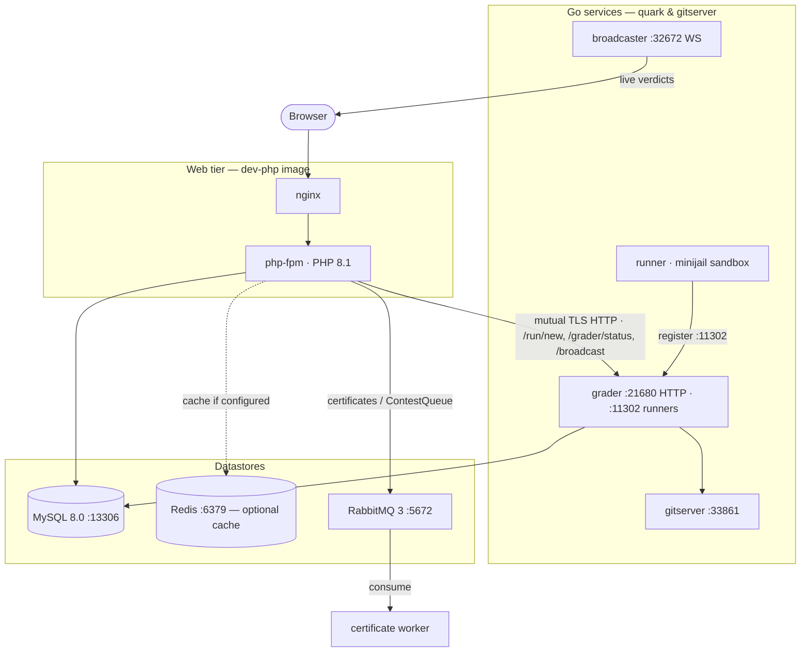

# Topología de infraestructura y despliegue

omegaUp no es un solo programa. Es una aplicación web PHP que habla con un pequeño
constelación de servicios Go a través de la red, respaldada por MySQL, Redis y
RabbitMQ y pegados mediante Docker Compose. Esta pagina recorre toda
topología la forma en que una solicitud realmente la experimenta: qué contenedor sirve al
HTML y la API, a los que llega el proceso PHP, y la parte
que sorprende a los recién llegados: cómo la mitad juez del sistema vive en un
conjunto completamente separado de repositorios a los que la interfaz solo llega mediante
HTTP. Si recuerdas una cosa, recuerda esto: **el clasificador, los corredores, los
la emisora y el entorno sandbox no están en el monorepo de PHP en absoluto.** Están en Go
binarios de [`omegaup/quark`](https://github.com/omegaup/quark) y
[`omegaup/gitserver`](https://github.com/omegaup/gitserver) y el lado PHP
los conoce sólo como URL.

## Los dos archivos que componen y por qué hay dos

Todo lo que ejecutas localmente surge de
[`docker-compose.yml`](https://github.com/omegaup/omegaup/blob/main/docker-compose.yml).
Ese archivo es la topología de desarrollo: una imagen por subsistema, fuente montada en enlace
en vivo desde su árbol de trabajo en `/opt/omegaup`, puertos publicados en su host para que pueda
puede pincharlos. La producción se describe por separado por
[`docker-compose.k8s.yml`](https://github.com/omegaup/omegaup/blob/main/docker-compose.k8s.yml),
y los dos no se parecen en nada **porque responden preguntas diferentes.**
El trabajo del archivo de desarrollo es "permitir que un colaborador edite PHP y lo vea inmediatamente"; los k8
El trabajo del archivo es "producir las imágenes inmutables que Kubernetes programará". entonces los k8
El archivo no ejecuta MySQL o Redis ni los calificadores en absoluto; esos se administran en otro lugar
en el clúster, solo *construye* las imágenes del frontend: `omegaup/frontend`,
`omegaup/php`, `omegaup/nginx`, `omegaup/frontend-sidecar` y
`omegaup/ai-editorial-worker`, cada una de las cuales es una etapa `target` separada de un solo
`Dockerfile.frontend`. La división en imágenes distintas de `php` y `nginx` es la
diga que en producción nginx y php-fpm son contenedores separados; en desarrollo son
fusionados en una imagen para mayor comodidad.

## nginx + php-fpm: lo que realmente sirve a una página

La interfaz de desarrollo ejecuta la imagen `omegaup/dev-php:20231008`, creada a partir de
[`stuff/docker/Dockerfile.dev-php`](https://github.com/omegaup/omegaup/blob/main/stuff/docker/Dockerfile.dev-php),
que es un `ubuntu:jammy` simple que instala `nginx` y `php8.1-fpm` (más
`php8.1-opcache` y `php8.1-apcu`) uno al lado del otro. Esa es toda la historia del tiempo de ejecución.
para el nivel web: ** PHP 8.1 estándar detrás de php-fpm detrás de nginx. ** No hay
HHVM en cualquier lugar: se eliminó hace años y `grep -ri hhvm` sobre el repositorio regresa
nada. Cuando un navegador accede a `/api/run/create/`, nginx lo dirige a php-fpm, que
ejecuta [`frontend/www/api/ApiEntryPoint.php`](https://github.com/omegaup/omegaup/blob/main/frontend/www/api/ApiEntryPoint.php);
ese archivo hace `require_once('../../server/bootstrap.php')` y luego
`echo \OmegaUp\ApiCaller::httpEntryPoint()`, que envía al correspondiente
método de controlador (para envíos, `\OmegaUp\Controllers\Run::apiCreate`, que
vive en [`Run.php` alrededor de L415](https://github.com/omegaup/omegaup/blob/main/frontend/server/src/Controllers/Run.php)).
El puerto del contenedor `EXPOSE` es `8001` y su inicio `CMD` es una puerta `wait-for-it`.
en `grader:36663`, `gitserver:33861`, `broadcaster:22291` y `mysql:13306`: el
La interfaz se niega deliberadamente a aparecer hasta que sus dependencias respondan, por lo que
nunca obtenga el confuso estado de medio arranque en el que se carga el sitio, pero cada juez
se agota el tiempo de llamada.

El shell renderizado por el servidor que emiten esas solicitudes es una plantilla Twig 3,
`frontend/templates/template.tpl`, ampliado con las extensiones Twig personalizadas en
[`frontend/server/src/Template/`](https://github.com/omegaup/omegaup/tree/main/frontend/server/src/Template)
(`EntrypointNode`, `JsIncludeNode`, `VersionHashNode`). Ese shell inyecta un JSON
carga útil y entrega la página a Vue 2.7; Smarty se ha ido. Crear plantillas es una
preocupación de frontend más que de infraestructura, por lo que solo se menciona aquí
para cerrar la pregunta "qué representa el HTML": el tratamiento profundo reside en el
Página de arquitectura front-end.

## Los almacenes de datos a los que llega el proceso PHP

**MySQL 8.0** (`mysql:8.0.34`, anclado a `linux/amd64` porque la imagen del frontend
asume que un amd64 mysqld) es la fuente de la verdad. En desarrollo escucha en el
puerto no estándar `13306`, no el `3306` habitual, razón por la cual la interfaz
El entorno establece `MYSQL_TCP_PORT: 13306` y los objetivos `wait-for-it` de cada servicio.
`mysql:13306`; el desplazamiento existe, por lo que un MySQL que ya ejecuta en su host no lo hace
chocar con el contenedor. El contenedor se inicia con
`--max_execution_time=30000 --lock_wait_timeout=10 --wait_timeout=20`, es decir, cualquier
una sola declaración se elimina después de 30 s, una transacción espera como máximo 10 s por fila
bloquear antes de darse por vencido y una conexión inactiva se interrumpe después de 20 s: barandillas
por lo que una consulta patológica no puede afectar a toda la base de datos. También solicita
`cap_add: SYS_NICE` para que mysqld pueda establecer prioridades de subprocesos. El lado PHP habla de ello.
a través del controlador `mysqli` sin formato en
[`frontend/server/src/MySQLConnection.php`](https://github.com/omegaup/omegaup/blob/main/frontend/server/src/MySQLConnection.php),
y todo el acceso a la tabla pasa a través de la capa DAO/VO generada automáticamente en
`frontend/server/src/DAO/`.

**Redis** (`redis`, `redis-server /etc/redis/redis.conf`, puerto `6379`) es el
caché compartido opcional. "Opcional" es la palabra de carga: el caché
La implementación es elegida por `OMEGAUP_CACHE_IMPLEMENTATION` en
[`config.default.php`](https://github.com/omegaup/omegaup/blob/main/frontend/server/config.default.php),
y el valor predeterminado es **`'apcu'`**, no `'redis'`. Entonces, en una sola caja vive el caché.
en la memoria compartida APCu del proceso php-fpm y Redis está inactivo; cambias a
`'redis'` solo cuando tienes más de una interfaz y necesitan compartir un caché
y tienda de sesiones. Cuando *se* utiliza Redis, los parámetros de conexión son los
`REDIS_HOST` / `REDIS_PORT` / `REDIS_PASS` define (en desarrollo, `redis`, `6379` y
la contraseña `redis`, que coincide con `REDIS_PASSWORD: "redis"` el contenedor frontend
se entrega).

**RabbitMQ 3** (`rabbitmq:3-management-alpine`, AMQP en `5672`, la interfaz de usuario de administración
en `15672`) transmite exactamente un tipo de mensaje hoy en día, y vale la pena serlo.
preciso porque el mapa de colas es pequeño y fácil de imaginar. El único productor
en el código base PHP es
[`Certificate.php`](https://github.com/omegaup/omegaup/blob/main/frontend/server/src/Controllers/Certificate.php),
que, cuando un administrador le pide a omegaUp que genere los certificados de finalización de un concurso,
publica un único mensaje JSON en el intercambio **`certificates`** con clave de enrutamiento
**`ContestQueue`**:

```php
// frontend/server/src/Controllers/Certificate.php (~L640)
$routingKey = 'ContestQueue';
$exchange   = 'certificates';
$channel = \OmegaUp\RabbitMQConnection::getInstance()->channel();
// ... build $messageArray = certificate_cutoff, alias, scoreboard_url,
//     contest_id, ranking ...
$message = new \PhpAmqpLib\Message\AMQPMessage($messageJSON);
$channel->basic_publish($message, $exchange, $routingKey);
$channel->close();
$contest->certificates_status = 'queued';
```
El proceso PHP publica y marca inmediatamente `certificates_status = 'queued'`;
un trabajador externo consume el mensaje y genera lentamente el PDF a partir de
banda, por lo que la solicitud del administrador regresa instantáneamente en lugar de bloquearse en el procesamiento
cientos de certificados. La conexión en sí es un singleton creado de forma diferida en
[`RabbitMQConnection.php`](https://github.com/omegaup/omegaup/blob/main/frontend/server/src/RabbitMQConnection.php)
que abre un `AMQPStreamConnection` a `OMEGAUP_RABBITMQ_HOST` (por defecto `rabbitmq`)
y, un bonito detalle, registra un `register_shutdown_function` para cerrar el enchufe.
cuando finaliza el script, por lo que una solicitud php-fpm nunca pierde una conexión AMQP. **Nota
que el calificador *no* consume de RabbitMQ.** Las presentaciones llegan al juez
HTTP, que se describe a continuación; RabbitMQ es solo para el canal lateral de certificados.

## Cruzando el límite: PHP al evaluador a través de HTTP

Aquí está la costura que define toda la arquitectura. cuando
`Run::apiCreate` ha validado un envío que llama
`\OmegaUp\Grader::getInstance()->grade($run, $source)` (alrededor
[`Run.php` L573](https://github.com/omegaup/omegaup/blob/main/frontend/server/src/Controllers/Run.php)),
y [`Grader.php`](https://github.com/omegaup/omegaup/blob/main/frontend/server/src/Grader.php)
No es más que un cliente cURL. *No* es la cola, *no* ejecuta código,
no sabe qué es minijail; simplemente realiza una PUBLICACIÓN en `OMEGAUP_GRADER_URL` (valor predeterminado).
`https://localhost:21680`). Cada método se asigna a un punto final en Go Grader:

- `grade()` → `POST /run/new/{run_id}/` con la fuente bruta como cuerpo: lo normal
  Llamada "por favor juzgue esta presentación".
- `rejudge()` → `POST /run/grade/` con una lista de identificadores de ejecución: se utiliza para reprocesamientos masivos.
- `status()` → `GET /grader/status/` — devuelve el `GraderStatus` en vivo:
  `run_queue_length`, `runner_queue_length`, la lista de `runners` conectados,
  `broadcaster_sockets` y `embedded_runner`. esto es lo que
  `\OmegaUp\Controllers\Grader::apiStatus` aparece en el panel de administración.
- `broadcast()` → `POST /broadcast/`: le pide al calificador que impulse un evento en vivo (un nuevo
  veredicto, una aclaración) a los navegadores suscritos.
- `getSource()` / `getGraderResource()` → `/submission/source/{guid}/` y
  `/run/resource/`: recupera la fuente almacenada o los artefactos por ejecución (registros,
  binario compilado) bajo demanda.

El transporte se endurece deliberadamente, porque de ello depende la integridad de una competición.
Cada llamada en
[`curlRequestSingle`](https://github.com/omegaup/omegaup/blob/main/frontend/server/src/Grader.php)
presenta un certificado de cliente y verifica el del servidor:

```php
CURLOPT_SSLKEY       => '/etc/omegaup/frontend/key.pem',
CURLOPT_SSLCERT      => '/etc/omegaup/frontend/certificate.pem',
CURLOPT_CAINFO       => '/etc/omegaup/frontend/certificate.pem',
CURLOPT_SSL_VERIFYPEER => true,
CURLOPT_SSL_VERIFYHOST => 2,
CURLOPT_SSLVERSION   => CURL_SSLVERSION_TLSv1_2,
CURLOPT_CONNECTTIMEOUT => 5,   // give up connecting after 5s
CURLOPT_TIMEOUT        => 30,  // give up on the whole call after 30s
```
Eso es **TLS mutuo**: el frontend demuestra quién es con `key.pem`, y
se niega a hablar con un evaluador cuyo certificado no está vinculado a la CA en
`certificate.pem` (`VERIFYPEER` activado, `VERIFYHOST` configurado en `2`), solo sobre TLS 1.2.
Alrededor de esa única llamada se encuentra un bucle de reintento: `curlRequest` reintentará hasta **3
veces** con retroceso exponencial (`1s`, `2s`, luego limitado a `5s`), pero *solo* para
errores que clasifica como reintentables (`'Connection timed out'`, `'conexión SSL
timeout'`, `'HTTP/2 stream'`, `'Operation timed out'', y algunos hermanos). un
El error que no se puede reintentar (digamos que el evaluador devolvió un 400) se vuelve a generar inmediatamente, por lo que
un error genuino no se soluciona con tres reintentos inútiles.

## The Go presta servicios a los fans de la niveladora

La URL `https://localhost:21680` se resuelve, en la redacción de desarrollo, en `grader`.
contenedor: imagen `omegaup/backend:v1.9.35`, punto de entrada `/usr/bin/omegaup-grader`.
Ese binario se construye a partir de [`grader/`](https://github.com/omegaup/quark/tree/main/grader)
paquete de `omegaup/quark`, y *es* posee todo el antiguo wiki de PHP incorrectamente
atribuido al backend: la cola de prioridad
([`grader/queue.go`](https://github.com/omegaup/quark/blob/main/grader/queue.go)),
el grupo de corredores y la lógica de despacho. El clasificador escucha en dos puertos durante dos
diferentes audiencias: **`21680`** es el punto final HTTPS al que llama la interfaz PHP, y
**`11302`** es donde los corredores se conectan para registrarse, razón por la cual el
El punto de entrada del servicio `runner` es `wait-for-it grader:11302 -- /usr/bin/omegaup-runner`:
un corredor no puede unirse al grupo hasta que finalice el puerto de registro del calificador.

El contenedor `runner` (imagen `omegaup/runner:v1.9.35`) es lo que realmente
compila y ejecuta un envío. Su caja de arena vive en
[`runner/sandbox.go`](https://github.com/omegaup/quark/blob/main/runner/sandbox.go);
En producción, ese sandbox es minijail, pero observe que el desarrollador inicia el corredor.
con el indicador `-noop-sandbox`, porque minijail necesita privilegios del kernel que un
El contenedor de desarrollo desechable no debería contenerse, la evaluación del desarrollo se ejecuta *sin* aislamiento real
([`runner/noop_sandbox.go`](https://github.com/omegaup/quark/blob/main/runner/noop_sandbox.go)).
Esta es una buena compensación para "¿analiza los datos de prueba de mi problema?", y una terrible
para cualquier cosa en la que confiarías en un concurso real, que es exactamente por qué es una bandera y
no es el valor predeterminado en la producción.

El `broadcaster` (también `omegaup/backend:v1.9.35`, punto de entrada
`/usr/bin/omegaup-broadcaster`, fuente en
[`broadcaster/`](https://github.com/omegaup/quark/tree/main/broadcaster)) es el
distribución de actualizaciones en vivo. Cuando la llamada PHP `broadcast()` llega al calificador, el
La emisora transmite el evento a través de WebSockets (expone `32672` y `22291`) a
cada navegador suscrito a ese concurso, que es como un marcador actualiza el
instante en que llega un veredicto en lugar de en la siguiente encuesta. El recuento de los abiertos.
sockets es el campo `broadcaster_sockets` que viste en `GraderStatus`.

Finalmente, `gitserver` (imagen `omegaup/gitserver:v1.9.13`, punto de entrada
`wait-for-it mysql:13306 -- /usr/bin/omegaup-gitserver`, fuente en
[`omegaup/gitserver`](https://github.com/omegaup/gitserver)) es donde surgen los problemas.
vivir físicamente. Cada problema es un **repositorio git**: declaraciones, casos de prueba,
validadores, configuraciones: servido a través del puerto `33861`, con los repositorios almacenados en
el volumen `omegaupdata` compartido montado en `/var/lib/omegaup` (el
El contenedor Alpine de un solo uso `init-omegaupdata` existe exclusivamente en `mkdir -p
/var/lib/omegaup/problems.git` and `chown` antes de que comience cualquier otra cosa). ambos
La parte frontal y la niveladora montan el mismo volumen, de modo que cuando la niveladora necesita un
El conjunto de entrada del problema lo lee directamente desde la tienda respaldada por git.

Una convención compartida entre los cuatro servicios Go: cada puerto `expose`
**`6060`**, el punto final de depuración `net/http/pprof` estándar de Go, para que un mantenedor pueda
adjunte un generador de perfiles a un evaluador o ejecutor en vivo sin volver a implementarlo.

## Observabilidad: métricas y registros

Dos canales independientes responden "¿es saludable?" y "¿qué pasó?".

Para **métricas**, omegaUp utiliza el
[`promphp/prometheus_client_php`](https://github.com/PromPHP/prometheus_client_php)
biblioteca (fijada `^2.4` en
[`composer.json`](https://github.com/omegaup/omegaup/blob/main/composer.json)),
envuelto por [`Metrics.php`](https://github.com/omegaup/omegaup/blob/main/frontend/server/src/Metrics.php).
El contenedor elige su backend de almacenamiento en el momento de la construcción: si APCu está disponible,
usa `\Prometheus\Storage\APC`; de lo contrario, `\Prometheus\Storage\InMemory`: el APC
La ruta es lo que permite que los contadores sobrevivan *a través* de solicitudes php-fpm dentro de un trabajador, ya que
una solicitud PHP simple no tiene estado y olvidaría cada métrica en el momento
termina. Los contadores registrados hoy son `frontend_api_request_status_count`
(etiquetado por `api` y `status`) y `frontend_api_request_total` (etiquetado por
`api`), incrementado en cada llamada API enviada. Están raspados en
[`frontend/www/metrics.php`](https://github.com/omegaup/omegaup/blob/main/frontend/www/metrics.php),
un punto final de cuatro líneas que inicia el arranque y llama
`\OmegaUp\Metrics::getInstance()->render()`, emitiendo el texto Prometheus
formato de exposición.

Para **registros**, [`bootstrap.php`](https://github.com/omegaup/omegaup/blob/main/frontend/server/bootstrap.php)
configura Monolog 2 (`monolog/monolog ^2.3`) una vez, al comienzo de cada
solicitud. Se construye un `\Monolog\Logger('omegaup')` escribiendo a través de un `StreamHandler`
a `OMEGAUP_LOG_FILE` (predeterminado `/var/log/omegaup/omegaup.log`) en el nivel en
`OMEGAUP_LOG_LEVEL` (`info` predeterminado), empuja un `WebProcessor` para que cada línea lleve
la URL de solicitud y el método, y luego lo registra globalmente con
`\Monolog\Registry::addLogger` y `\Monolog\ErrorHandler::register`: este último
enrutar errores y excepciones de PHP no detectados en el mismo registro. La nueva reliquia
La integración es completamente condicional y leer cómo se degrada es instructivo:

```php
if (class_exists('\NewRelic\Monolog\Enricher\Formatter')) {
    $logFormatter = new \NewRelic\Monolog\Enricher\Formatter();
} else {
    $logFormatter = new \Monolog\Formatter\LineFormatter();
}
// ...
if (class_exists('\NewRelic\Monolog\Enricher\Processor')) {
    $rootLogger->pushProcessor(new \NewRelic\Monolog\Enricher\Processor());
}
```
Cuando se instala el paquete `newrelic/monolog-enricher` (`^2.0`), los registros se obtienen
el formateador New Relic y un procesador que estampa cada línea con el formato actual
vínculo de seguimiento/entidad, por lo que una línea de registro se puede girar a su seguimiento de APM; cuando es
*no* instalado, como en una simple caja local, todo vuelve al ser humano
`LineFormatter` y nada se rompe. Esa guardia de `class_exists` es deliberada: Nuevo
Relic es un lujo de producción y un colaborador nunca debe necesitar una licencia de New Relic.
para ejecutar el sitio. El agente New Relic del lado del navegador se carga por separado, solo cuando
Se establecen los valores de configuración de `NEW_RELIC_SCRIPT` / `NEW_RELIC_SCRIPT_HASH`.

## Descripción general del sistema


## Documentación relacionada

- **[Configuración de Docker](../operations/docker-setup.md)**: la presentación local completa
- **[Implementación](../operations/deployment.md)** — implementación de producción
- **[Monitoreo](../operations/monitoring.md)**: paneles y alertas
- **[Seguridad](security.md)** — TLS mutuo, tokens PASETO, OAuth2
