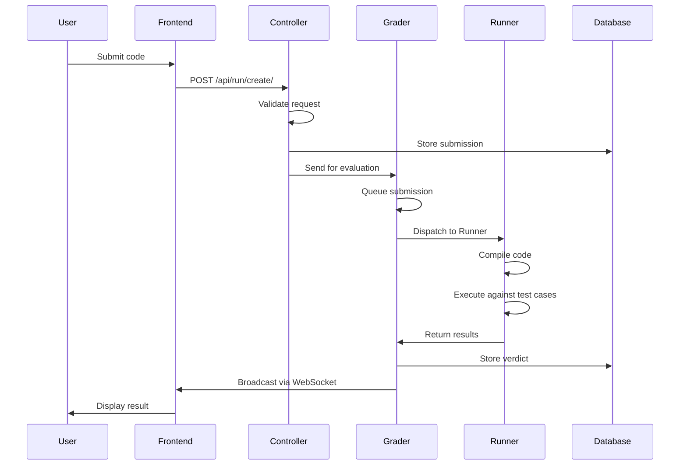

# Componentes internos del sistema

Todo lo que siempre quiso saber sobre cómo omegaUp ejecuta su código y tenía miedo de preguntar. Esta página sigue un único envío en todo su recorrido: desde el momento en que presiona "Enviar" en la arena, a través de la interfaz PHP, a través del cable hasta el evaluador Go, en un corredor de espacio aislado y de regreso al marcador que todos los demás están mirando. Lo narramos en orden de ejecución y nombramos el símbolo exacto que realiza cada paso, porque el *por qué* detrás de cada salto es la parte que no se puede reconstruir leyendo ningún archivo de forma aislada.

Dos cosas que vale la pena saber antes de comenzar. Primero, el frontend (el monorepo de PHP, [`omegaup/omegaup`](https://github.com/omegaup/omegaup)) y la pila de evaluación del backend (el evaluador, el corredor y el transmisor de Go, todos en [`omegaup/quark`](https://github.com/omegaup/quark), más [`omegaup/gitserver`](https://github.com/omegaup/gitserver)) son *repositorios y procesos separados*. La interfaz nunca compila ni ejecuta el código de nadie por sí misma: transfiere el trabajo a través de HTTP y espera a que el veredicto llegue de forma asincrónica. En segundo lugar, esa transferencia es deliberadamente el único punto de acoplamiento: la interfaz habla con el calificador a través de exactamente un cliente ligero, [`\OmegaUp\Grader`](https://github.com/omegaup/omegaup/blob/main/frontend/server/src/Grader.php), y nada más en el código PHP sabe que el calificador existe.

## El viaje en una foto

El diagrama aplana dos cosas que la prosa a continuación desaplanará: el clasificador *vuelve a ingresar* dos veces (una vez para hacer cola y despachar, otra vez después de que el corredor informa, para anotar), y las dos últimas flechas son en realidad un servicio separado (la emisora) que llama *de regreso* a la interfaz para reconstruir el marcador antes de que empuje algo sobre un enchufe.

## Frontend: el POST sale de tu navegador

Cuando envía, lo primero que sucede es que su código, junto con el alias del problema, el alias del concurso (o `problemset_id`) y el idioma, se PUBLICA en el punto final de API `/api/run/create/`. En el ámbito actual de Vue 2.7 + TypeScript, esto pasa por el cliente API generado: un punto de entrada del ámbito como [`frontend/www/js/omegaup/arena/contest_contestant.ts`](https://github.com/omegaup/omegaup/blob/main/frontend/www/js/omegaup/arena/contest_contestant.ts) llama a `api.Run.create({...})`, y `api.Run.create` es un contenedor escrito definido en [`frontend/www/js/omegaup/api.ts`](https://github.com/omegaup/omegaup/blob/main/frontend/www/js/omegaup/api.ts) que realiza PUBLICACIONES en `/api/run/create/`. Ese archivo es generado por una máquina (se abre con un banner `// generated by frontend/server/cmd/APITool.php. DO NOT EDIT.`), razón por la cual los tipos de TypeScript en la solicitud y los tipos de PHP en el controlador nunca pueden separarse: provienen de la misma fuente de verdad. (Si busca el antiguo `OmegaUp.submit` en `frontend/www/js/omegaup.js`, no lo haga: ese archivo ya no está. La migración a componentes Vue de un solo archivo está completa: el servidor ahora representa solo un shell HTML delgado (una plantilla Twig 3) que inicia la aplicación Vue, y todo el campo ahora está controlado por `api.ts`.)

Una vez que la solicitud llega al servidor, nginx la reenvía a PHP (php-fpm, ejecutando PHP simple 8.1). El punto de entrada es [`frontend/www/api/ApiEntryPoint.php`](https://github.com/omegaup/omegaup/blob/main/frontend/www/api/ApiEntryPoint.php), que hace `require_once('../../server/bootstrap.php')` y luego `echo \OmegaUp\ApiCaller::httpEntryPoint()`. [`frontend/server/bootstrap.php`](https://github.com/omegaup/omegaup/blob/main/frontend/server/bootstrap.php) es lo que tiene que ejecutarse primero: carga la configuración, extrae los módulos cargados automáticamente e inicializa la conexión MySQL, de modo que cuando se ejecuta cualquier controlador, el mundo ya está configurado.

Luego, `ApiCaller` crea un objeto `\OmegaUp\Request` (la representación en memoria de cada parámetro de la solicitud, incluida la cookie de autenticación) y tokeniza la ruta URL. Elimina el `/api` principal y divide el `/api/run/create/` en `['run', 'create']`. El primer token es el controlador, el segundo es el método. En [`frontend/server/src/ApiCaller.php`](https://github.com/omegaup/omegaup/blob/main/frontend/server/src/ApiCaller.php) puede ver cómo sucede: `$controllerName = ucfirst($args[2])` produce `Run`, `$apiMethodName = "api{$methodName}"` produce `apiCreate` y `$controllerFqdn = "\\OmegaUp\\Controllers\\{$controllerName}"` se resuelve en `\OmegaUp\Controllers\Run`. Tenga en cuenta que la clase es `Run`, **no** `RunController`: los controladores omegaUp eliminan deliberadamente el sufijo `Controller` (encontrará `Contest`, `Problem`, `Grader`, `Submission` y amigos bajo la misma regla). Cada token de ruta *después* del controlador y el método se trata como una serie de pares de nombre/valor de variable y se integra en el `Request`.

## `\OmegaUp\Controllers\Run::apiCreate`: el desafío del permiso

Ahora [`\OmegaUp\Controllers\Run::apiCreate`](https://github.com/omegaup/omegaup/blob/main/frontend/server/src/Controllers/Run.php) (alrededor de L415 de `Run.php`) toma el control, y aquí es donde un envío gana el derecho a existir. La primera línea, `$r->ensureIdentity()`, valida el token de autenticación que se configuró al iniciar sesión (normalmente se almacena como una cookie, pero la API también lo aceptará como un parámetro POST) y resuelve la identidad que realiza la solicitud.

Luego valida que este usuario realmente tiene permiso para realizar *este* envío, y vale la pena deletrear cada puerta en orden en lugar de colapsarla para "validar permisos", porque cualquiera que toque la autenticación necesita conocerlas todas. Dentro de `validateCreateRequest` verifica que todos los elementos requeridos estén presentes (alias del problema, concurso/conjunto de problemas, idioma y fuente); que el problema existe y no es `deprecated`; que no configuró `problemset_id` *y* `contest_alias` a la vez (son mutuamente excluyentes: un envío pertenece exactamente a un contenedor); que el problema en realidad es parte del concurso y ambos son válidos; y, para una presentación pública o de práctica sin concurso, que el problema es visible y que la fecha límite de práctica (si corresponde) no ha pasado. Incluso hay un rechazo codificado que es pura memoria institucional: la identidad llamada `omi` está completamente prohibida (`throw new \OmegaUp\Exceptions\ForbiddenAccessException()`), agregó un guardia para [problema #739](https://github.com/omegaup/omegaup/issues/739).

Dos de esas puertas llevan constantes que no debes generalizar. El límite de velocidad es **un envío por problema cada 60 segundos** — `Run::$defaultSubmissionGap = 60` (segundos), aplicado por `validateWithinSubmissionGap` a través de `\OmegaUp\DAO\Submissions::isInsideSubmissionGap`, y arroja `NotAllowedToSubmitException('runWaitGap')` si está demasiado ansioso (los administradores del sistema y del concurso están exentos, por lo que pueden enviar spam a los envíos de prueba durante la configuración). Y cuando la plataforma está en modo **Bloqueo**, se activan controles adicionales (por ahora, el único es que la carrera no se realiza en modo de práctica, impuesto por `\OmegaUp\Controllers\Controller::ensureNotInLockdown()` en la ruta de práctica) para que durante una ventana de competencia bloqueada nadie introduzca una presentación a través de la puerta de práctica.

Si pasan todas las puertas, `apiCreate` calcula la **penalización** según el `penalty_type` del concurso. Esta es una rama real, no una formalidad: `contest_start` mide `submit_delay` en minutos respecto al `start_time` del concurso; `problem_open` lo mide desde el momento en que el usuario abrió el problema por primera vez (buscado en `ProblemsetProblemOpened`, y si no hay ningún registro abierto, significa que está remitiendo a un problema que nunca abrió, lo que arroja `runNotEvenOpened`); y `none`/`runtime` omiten la penalización por completo (`submit_delay = 0`). El retraso se almacena como minutos completos: `intval((\OmegaUp\Time::get() - $start->time) / 60)`.

Luego, genera un **GUID** aleatorio, `md5(uniqid(strval(rand()), true))`, que es el identificador bajo el cual se almacenará el archivo de código y el identificador que se utiliza en cada etapa posterior para referirse a esta ejecución. Escribe las filas: una fila `Submissions` y una fila `Runs`, ambas creadas dentro de un bloque `\OmegaUp\TransactionHelper::executeWithRetry(...)` (el contenedor de reintento existe porque los envíos simultáneos pueden bloquearse en MySQL, y volver a ejecutar el cierre es más barato que fallarle al usuario). Ambas filas comienzan como `status = 'uploading'` con un marcador de posición `verdict = 'JE'` (Error de juez): una ejecución que nunca pasa de este punto *permanece* `JE`, que es su señal de que al clasificador nunca se le informó correctamente al respecto. Fundamentalmente, `validateWithinSubmissionGap` se vuelve a verificar *dentro* de la transacción, porque solo allí se verifica la brecha sin carrera contra un segundo envío en vuelo.

Finalmente, el frontend entrega la ejecución al calificador y se lava las manos del resto. `apiCreate` llama a `\OmegaUp\Grader::getInstance()->grade($run, trim($source))` (alrededor de L573). Debajo del capó, hay una única POST de `curl` a `OMEGAUP_GRADER_URL . "/run/new/{$run->run_id}/"` con la fuente como el cuerpo de la solicitud sin formato; tenga en cuenta que pasa el **id de ejecución**, no el código por valor, porque el calificador volverá a leer todo lo que necesita de la base de datos. `OMEGAUP_GRADER_URL` tiene como valor predeterminado `https://localhost:21680` ([`config.default.php`](https://github.com/omegaup/omegaup/blob/main/frontend/server/config.default.php) alrededor de L61). Esa llamada se autentica mutuamente con certificados de cliente TLS (`CURLOPT_SSLKEY`/`CURLOPT_SSLCERT` apuntando a `/etc/omegaup/frontend/*.pem`, `CURLOPT_SSL_VERIFYPEER => true`, `CURLOPT_SSLVERSION => CURL_SSLVERSION_TLSv1_2`), porque *toda* la comunicación entre los subsistemas omegaUp está cifrada; esta es una lección aprendida de la manera más difícil después de que alguien se sentó y olió el tráfico en un concurso de programación real. Si se produce la llamada de calificación, `apiCreate` no deja una fila pendiente: no puede revertir una transacción real (el proceso de calificación nunca vería una fila de `Runs` no confirmada), por lo que desvincula y elimina manualmente las filas de `Runs` y `Submissions` antes de volver a aumentar. Si todo tiene éxito, el GUID se devuelve al navegador como JSON, junto con un `nextSubmissionTimestamp` (para que la interfaz de usuario sepa cuándo se elimina la brecha de 60 segundos) y un `submission_deadline`, y su navegador comienza a sondear el veredicto.

## Grader, parte 1: colas y despacho

El clasificador es un servicio Go ([`omegaup/quark`](https://github.com/omegaup/quark)) con un servidor HTTPS integrado que escucha cuatro tipos de solicitudes: evaluar un envío (`/run/new/`, `/run/grade/`), registrar un nuevo corredor, cancelar el registro de uno y transmitir información a cada cliente conectado a WebSocket. Cuando llega la solicitud `/run/new/<run_id>/`, el evaluador busca la ejecución por identificación en la base de datos y *rehidrata* todo lo que necesita (el envío, el problema, el concurso y los metadatos del usuario) porque, nuevamente, la interfaz le envió una identificación, no una carga útil. Envuelve todo eso en un **`RunContext`** (definido en [`grader/queue.go`](https://github.com/omegaup/quark/blob/main/grader/queue.go)), que transporta los metadatos de la ejecución más los campos de seguimiento utilizados para medir cuánto tiempo lleva cada etapa descendente y se lo entrega al enrutador de la cola.

Hay **8 colas predeterminadas** y vale la pena nombrarlas en su totalidad porque las reglas de enrutamiento las excluyen:

- `urgente` (urgente)
- `urgente lento` (urgente, lento)
- `concurso` (concurso)
- `concurso lento` (concurso, lento)
-`normal`
- `normal lento` (normal, lento)
-`rejudge`
- `rejudge lento` (rejuzgar, lento)

De forma predeterminada, nada se enruta a las colas urgentes; usted opta por concursos específicos (por ejemplo, las olimpiadas nacionales de OMI o CONACUP) a través de la configuración del calificador para que sus presentaciones siempre salten la línea. De lo contrario, la regla es simple: un envío que no es de práctica va a `concurso`, uno de práctica va a `normal` y `rejudge` se usa *solo* cuando alguien presiona el botón "rejuzgar" en la interfaz o los casos de prueba de un problema cambian. Las variantes **lentas** son las interesantes: una cola es "lenta" si sus problemas, en el peor de los casos, tardarían **más de 30 segundos en devolver un TLE**. Las colas se procesan de izquierda a derecha (urgente antes de la competencia, antes de lo normal antes de volver a juzgar), pero solo un cierto porcentaje de corredores pueden atender colas lentas simultáneamente (**actualmente el 50 %**) específicamente para evitar que los problemas lentos monopolicen toda la flota mientras se realiza una competencia rápida.Una vez que un `RunContext` llega a su cola, espera allí hasta que un corredor esté libre. Cuando hay al menos una ejecución lista *y* al menos un corredor inactivo, el calificador extrae la ejecución de mayor prioridad que puede de todas las colas, anota la marca de tiempo en la que salió de la cola (esa marca de tiempo es la forma en que luego detectará un corredor muerto) y envía la tarea de calificación al corredor a través de HTTPS. La conexión con el corredor se ejecuta con un **plazo límite de 10 minutos**; puede verlo en el `InflightMonitor` de [`grader/queue.go`](https://github.com/omegaup/quark/blob/main/grader/queue.go), cuyos `connectTimeout` y `readyTimeout` son ambos `10 * time.Minute`. Si se excede ese plazo, o el corredor lanza durante el procesamiento, el calificador supone que el corredor está **muerto**; y si la falla no fue grave, *vuelve a poner en cola* la ejecución (`RunContext.Requeue`) con la teoría de que fue un problema transitorio de la red y que alguien sano lo solucionará la próxima vez.

## Runner: compila y ejecuta bajo Minijail

Los corredores viven en la nube en máquinas virtuales. Cada uno, cuando arranca, envía una solicitud de registro al evaluador, que lo agrega al grupo de corredores disponibles; el envío a través del grupo es **por turnos** sin afinidad, aunque la afinidad existió en algún momento en el pasado y no sería difícil volver a agregarla, si alguna vez necesita una ejecución para apegarse al corredor que ya tiene sus entradas almacenadas en caché. Después de cada minuto de inactividad, un corredor vuelve a enviar su registro como un latido de vida, de modo que si el evaluador reinicia o pierde la pista, vuelve a aparecer en la piscina. Cada corredor también tiene su propio servidor HTTPS incorporado, y aunque la cola del clasificador ya garantiza que un corredor maneja como máximo una ejecución a la vez, el corredor también mantiene su propio mutex, porque ocurren rarezas en la red, y una ejecución a la vez es una propiedad que desea aplicar en ambos extremos.

El modelo mental al que debemos aferrarnos: el corredor **sabe cómo compilar, ejecutar y alimentar información de lo que el usuario envió, y verificar si el resultado es correcto.** Es básicamente una interfaz bonita y distribuida para **Minijail**: el entorno limitado. (El propio Minijail desciende de Moeval, el sandbox utilizado en el IOI, y vive en el repositorio del corredor junto con su propio [`Dockerfile.minijail`](https://github.com/omegaup/quark/blob/main/Dockerfile.minijail); la interfaz PHP no tiene ningún conocimiento al respecto.)

Todo comienza con `compile` en [`runner/runner.go`](https://github.com/omegaup/quark/blob/main/runner/runner.go), que utiliza Minijail para resolver el complicado negocio de entregar los indicadores correctos tanto al compilador como al sandbox. Dependiendo de qué campos llevó la solicitud de compilación, puede compilar un archivo o varios (los problemas interactivos incluyen un `Main` más uno o más archivos de interfaz). No existe una configuración de compilación explícita: la convención *es* la configuración: la clase principal se llama `Main` y el ejecutable producido es `Main` (o `Main.class` en Java, o su equivalente en otros lugares). Si tiene éxito, el corredor devuelve un **token** al evaluador (la ruta del sistema de archivos donde se almacenan en caché los artefactos compilados) que el evaluador debe incluir en cada solicitud posterior para hacer referencia a esta misma compilación. Si la compilación falla, el ejecutor elimina todos los archivos temporales y devuelve el `stderr` del compilador como error de compilación (que es exactamente lo que le aparece como un veredicto `CE`). Si el problema tiene un validador, aparece en el mismo mensaje y también se compila aquí.

Para ejecutar realmente el programa con un conjunto de entrada fijo, el clasificador envía el token de compilación junto con el **hash SHA-1 de los casos de entrada** (los archivos `.zip` de `.in`, identificados por hash para que el corredor pueda saber si ya los tiene). El corredor verifica si ese conjunto de entradas está almacenado en caché en su sistema de archivos local; si no es así, devuelve un error para que el clasificador vuelva a enviar el `.zip` en una solicitud de seguimiento; este es el viaje de ida y vuelta de "entrada faltante" y es por eso que la primera ejecución de un problema nuevo en un corredor nuevo cuesta un salto adicional. Una vez que se confirma la presencia de las entradas, el ejecutor ejecuta el programa compilado en cada archivo `.in`. El mensaje de ejecución *también* puede contener casos independientes en línea como texto sin formato (usado para envíos efímeros/de ejecución rápida), y se califican exactamente como si hubieran llegado en el `.zip`. Para cada caso, el corredor guarda los metadatos del `.out` plus, los comprime con **bzip2** y los transmite de vuelta al clasificador *inmediatamente*; no espera a que termine todo el conjunto. Si hay un validador presente, se ejecuta contra el `.out` del usuario y el `.in` original, y sus resultados (nuevamente `.out` + metadatos) también se envían de vuelta. Todo lo demás (`stderr` y similares) solo se envía cuando se usa debug-rejuicio en la interfaz, para mantener pequeño el tráfico normal. Cuando finaliza el último caso, el corredor elimina sus archivos temporales y pasa al siguiente mensaje.

## Grader, parte 2: validadores y puntuación

Una vez que el evaluador tiene todos los resultados de una carrera, devuelve al corredor a la piscina (donde puede retomar la siguiente carrera inmediatamente) y, en paralelo, puntúa los resultados. Aquí es donde viven los diferentes tipos de validadores. **Todos los validadores tokenizan el flujo de salida en espacios en blanco**, luego difieren en cómo comparan los tokens (consulte [`runner/validator.go`](https://github.com/omegaup/quark/blob/main/runner/validator.go) y las constantes `ValidatorName` en [`common/problemsettings.go`](https://github.com/omegaup/quark/blob/main/common/problemsettings.go)):

- **`token`**: compara los tokens uno por uno, rindiéndote ante la primera diferencia (o en el momento en que una secuencia se queda sin tokens mientras que la otra todavía tiene algunos).
- **`token-caseless`**: lo mismo, pero no distingue entre mayúsculas y minúsculas.
- **`token-numeric`**: ignora todos los tokens no numéricos, analiza el resto como flotantes y compáralo con una tolerancia (`DefaultValidatorTolerance`, anulable por problema). Este es el que debe buscar cuando la respuesta es un número real y no desea que `0.999999` vs `1.0` sea una respuesta incorrecta.
- **`custom`** (literal): decide un programa validador proporcionado por el usuario.

Esto produce un **veredicto por caso**, extraído del conjunto fijo `AC`, `PA`, `PE`, `WA`, `TLE`, `OLE`, `MLE`, `RTE`, `RFE`, `CE`, `JE`. Una vez que cada caso tiene un veredicto, el evaluador asigna ponderaciones. Si el problema incluye un archivo `/testplan`, ese archivo se analiza y sus pesos se **normalizan para que sumen exactamente 1**; de lo contrario, cada caso vale `1 / number-of-cases`. Con las ponderaciones en la mano, los casos se agrupan: el **nombre del grupo es todo lo que está antes del primer `.`** en el nombre de archivo del caso, lo que significa que si un caso no tiene un grupo explícito, todo lo que está antes del `.in` se convierte en su nombre de grupo implícito. Un **grupo otorga sus puntos solo si cada caso en él obtuvo `AC` o `PA`**: un solo `WA` o `TLE` en cualquier parte del grupo pone a cero a todo el grupo, que es exactamente la subtarea de todo o nada en la que se basan los problemas competitivos. Finalmente, el calificador suma las puntuaciones del grupo y las multiplica por el valor en puntos que vale el problema *para ese concurso* (o 100% en el modo de práctica), escribe el veredicto final en la base de datos y pone en cola el `RunContext` para la emisora.

## Locutor: reconstruye el marcador, luego empuja

La emisora ([`broadcaster/`](https://github.com/omegaup/quark/tree/main/broadcaster) en quark) mantiene los marcadores del concurso y notifica, casi en tiempo real, a cada concursante que tiene WebSockets habilitados. Para cada carrera que llega a su cola y pertenece a un concurso, vuelve a llamar a la interfaz en **`/api/scoreboard/refresh`**, que vuelve a calcular el marcador de acuerdo con las políticas de ese concurso (marcadores congelados, reglas de penalización, etc.). Sólo *después* de que el marcador ha sido reconstruido y almacenado en caché en el servidor, la emisora ​​notifica a los suscriptores: envía el evento modificado al marcador a cada participante de ese concurso y el veredicto en sí al autor de la carrera. Los filtros en [`broadcaster/filter.go`](https://github.com/omegaup/quark/blob/main/broadcaster/filter.go) (`UserFilter`, `ContestFilter`, `ProblemsetFilter`, etc.) deciden qué concursantes reciben qué mensaje, por lo que el marcador de un concurso privado solo llega a las personas que están dentro de él. Cuando se hace esto, el `RunContext` registra cuánto tiempo pasó la ejecución en cada cola y cuánto tiempo tardó el corredor en responder (además de un poco más de metadatos de depuración) y se destruye. Esos datos de tiempo son la materia prima detrás de las métricas de Prometheus del clasificador, y es la razón por la que los campos de seguimiento se pasaron por el `RunContext` desde el principio.

Y ese es todo el viaje: su pulsación de tecla se convirtió en una POST HTTP, una fila en MySQL, un trabajo JSON en una cola, un proceso aislado en una VM en la nube, un veredicto por caso, una puntuación de grupo y, finalmente, un número en un marcador que todos los demás en el concurso acaban de ver cambiar.

## Documentación relacionada

- **[Descripción general de la arquitectura](index.md)**: cómo encajan el frontend, el evaluador, el ejecutor, la emisora y el gitserver.
- **[Grader](grader-internals.md)**: el enrutador de cola y el bucle de despacho en profundidad.
- **[Runner](runner-internals.md)**: la zona de pruebas, las convenciones de compilación y Minijail.
