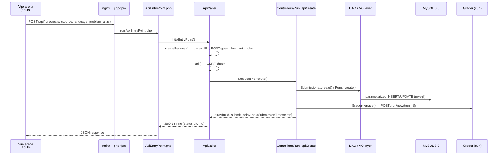

# Patrón MVC en omegaUp

omegaUp se basa en el patrón [Modelo-Vista-Controlador](https://en.wikipedia.org/wiki/Model%E2%80%93view%E2%80%93controller), pero la parte interesante no es el acrónimo de tres letras: es *cómo* una solicitud realmente fluye a través del código real. El modelo es una capa DAO + objeto de valor generada automáticamente que comunica `mysqli` a MySQL 8.0 y nunca filtra un `SELECT` escrito a mano en un controlador; el Controlador es una clase PHP 8.1 simple bajo `\OmegaUp\Controllers` cuyos métodos `apiXxx` devuelven matrices asociativas y nunca hacen eco de HTML; y la Vista es una bestia de dos partes: un único shell Twig 3 renderizado por un servidor que inicia la página y una aplicación de una sola página Vue 2.7 que posee cada píxel después de eso. Todo lo que aparece a continuación rastrea un envío real: un estudiante que hace clic en **Enviar** en un problema, de extremo a extremo, nombrando el archivo, el método y la constante exactos en cada salto, porque saber que "el controlador habla con el modelo" no le enseña nada sobre lo que pueda actuar, mientras que saber que `\OmegaUp\Controllers\Run::apiCreate` llama a `\OmegaUp\DAO\Submissions::create($submission)` dentro de un cierre `TransactionHelper::executeWithRetry` le indica exactamente dónde colocar un punto de interrupción.

## El modelo mental unifilar

La aplicación web es una API JSON delgada con una interfaz Vue atornillada en la parte superior. Nada representa HTML excepto una plantilla Twig; cada dos bytes que obtiene el navegador es un paquete `.js` o un blob JSON. Todo el trabajo de un controlador es: autenticar, validar, mutar el modelo a través de DAO y devolver una matriz. Si interiorizas eso, el resto de esta página son detalles.

## Canalización de solicitudes: después de un envío desde el navegador al calificador

Cuando el estudiante envía, Vue Arena no PUBLICA un formulario en una página; llama al cliente API generado, que `fetch`es `POST /api/run/create/` con el código fuente, el lenguaje y `problem_alias` en el cuerpo. Esa URL es la tabla de enrutamiento completa: omegaUp no tiene un archivo de configuración de ruta, porque la ruta URL *es* la instrucción de envío.

### nginx → php-fpm → el punto de entrada

Cada solicitud de `/api/*` es atendida por nginx traspasándola a php-fpm, que ejecuta exactamente un archivo de cuatro líneas, [`frontend/www/api/ApiEntryPoint.php`](https://github.com/omegaup/omegaup/blob/main/frontend/www/api/ApiEntryPoint.php). Utiliza `require_once` [`frontend/server/bootstrap.php`](https://github.com/omegaup/omegaup/blob/main/frontend/server/bootstrap.php) (que conecta el cargador automático, la configuración, el registro y la conexión de base de datos) y luego hace todo el trabajo en una sola declaración:

```php
require_once(__DIR__ . '/../../server/bootstrap.php');

echo \OmegaUp\ApiCaller::httpEntryPoint();
```
La API se encuentra bajo `/api/` en lugar de mezclarse deliberadamente con las URL de páginas normales: es la única superficie a la que deben poder llamar clientes que no sean navegadores (herramientas CLI, scripts de integración, el futuro móvil), por lo que se mantiene deliberadamente libre de cualquier problema de representación HTML. `httpEntryPoint` devuelve una *cadena de JSON* y `ApiEntryPoint.php` simplemente la repite.

### ApiCaller convierte una URL en un método de controlador

[`\OmegaUp\ApiCaller::httpEntryPoint()`](https://github.com/omegaup/omegaup/blob/main/frontend/server/src/ApiCaller.php) es donde una URL se convierte en una llamada a un método. Llama a `createRequest()`, que analiza `$_SERVER['REQUEST_URI']` con `preg_split('/[\/?]/', $apiAsUrl)`, dividiéndose en `/` *y* `?` para que `/api/run/create/?foo=1` y `/api/run/create?foo=1` se analicen de manera idéntica. Exige al menos cuatro segmentos (`['', 'api', 'run', 'create']`); cualquier cosa más corta arroja un `NotFoundException('apiNotFound')`, razón por la cual una URL de API con formato incorrecto regresa como un 404 limpio en lugar de un PHP fatal.

A partir de esos segmentos, construye el objetivo por convención, no por configuración: `$controllerName = ucfirst($args[2])` da `Run`, la clase totalmente calificada es `"\\OmegaUp\\Controllers\\{$controllerName}"` → `\OmegaUp\Controllers\Run` y el método es `"api{$methodName}"` → `apiCreate`. Tenga en cuenta la ley de nomenclatura aquí: la clase es **`Run`, no `RunController`**; omegaUp coloca el sufijo `Controller` en todas partes (`Contest`, `Problem`, `Submission`, `Grader`…), por lo que buscar `RunController` no encontrará nada. Si `class_exists` o `method_exists` falla, obtendrá `apiNotFound` nuevamente, por lo que un error tipográfico en la URL y un error tipográfico en el nombre de un método aparecen como el mismo 404.

Aquí viven dos guardias transversales, una vez, por lo que ningún controlador individual tiene que repetirlos:

- **La mutación requiere POST.** `createRequest()` ejecuta el nombre del método a través de `isMutatingMethod()`, que lo pone en minúsculas y compara subcadenas con una lista de verbos que cambian de estado (`add`, `create`, `delete`, `login`, `rejudge`, `update`, `verify` y ~25 más). Si un `GET` llega a un punto final mutante como `create`, arroja `MethodNotAllowedException`. Debido a que la coincidencia es por subcadena, los métodos genuinamente de solo lectura cuyos nombres contienen una palabra mutante (por ejemplo, `listAssociatedIdentities` contiene "asociado") son rescatados por un `$readOnlyAllowlist` explícito para que sigan aceptando `GET`.
- **La autenticación proviene de la cookie.** `createRequest()` llama a `\OmegaUp\Controllers\Session::getCurrentSession()` y, si existe una sesión `auth_token`, la inyecta en la solicitud. Los tokens de autenticación son tokens PASETO (a través de `paragonie/paseto`), por lo que la identidad de la persona que llama se establece antes de que se ejecute el controlador.

Luego, `httpEntryPoint` entrega el `\OmegaUp\Request` integrado a `ApiCaller::call()`, que es el corazón de prueba/captura de la API. Antes de ejecutar cualquier cosa, ejecuta `isCSRFAttempt()`: si la solicitud lleva un HTTP `Referer`, su host debe coincidir con el host de `OMEGAUP_URL` (o el dominio bloqueado, o un host CSRF incluido en la lista de permitidos), y una referencia faltante o con formato incorrecto *falla al cerrarse*: la verificación se equivoca al rechazar en lugar de permitir, porque un falso negativo aquí es una escritura entre sitios. Se permite una llamada sin referencia (un cliente API explícito sin origen en el navegador), ya que no puede ser un viaje CSRF en las cookies de alguien.

Si la verificación CSRF pasa, `call()` invoca `$request->execute()`, que finalmente se envía a `\OmegaUp\Controllers\Run::apiCreate($r)`, y luego normaliza el resultado: si el controlador devolvió una matriz asociativa sin una clave `status`, marca `'status' => 'ok'`. Cada excepción se canaliza en una forma. Un `\OmegaUp\Exceptions\ApiException` (la base para todas las excepciones de dominio como `NotFoundException`, `ForbiddenAccessException`, `InvalidParameterException`) se procesa a través de `asResponseArray()`; cualquier *otro* `\Exception` está empaquetado como `InternalServerErrorException('generalError', $e)`, por lo que un error inesperado aún devuelve un sobre de error bien formado en lugar de un seguimiento de la pila. También hay una trampilla de escape deliberada: un `ExitException` significa que el controlador quería explícitamente finalizar la respuesta (por ejemplo, una redirección), por lo que `call()` solo `exit`. En el camino, registra el resultado en Prometheus a través de `\OmegaUp\Metrics::getInstance()->apiStatus($methodName, $httpCode)`, que es cómo el equipo observa las tasas de éxito y error por punto final.

Finalmente `render()` serializa la matriz a JSON. Agrega un `_id` (la identificación de la solicitud, para correlacionar registros) solo a las respuestas asociativas (las respuestas planas/de lista se dejan como matrices puras para que su tipo JSON permanezca correcto) y honra a `?prettyprint=true` con `JSON_PRETTY_PRINT` para los humanos que exploran la API en un navegador. Si `json_encode` se atasca con un UTF-8 no válido (`JSON_ERROR_UTF8`; piense en un envío o una declaración de problema que contiene puntos de código ilegales), vuelve a intentar con `JSON_PARTIAL_OUTPUT_ON_ERROR` recuperar una respuesta utilizable en lugar de 500 toda la página, y solo si *eso* también falla, vuelve a caer en un sobre genérico de error interno.


## El Controlador: `apiCreate` hace lógica de negocios y nada más

[`\OmegaUp\Controllers\Run::apiCreate`](https://github.com/omegaup/omegaup/blob/main/frontend/server/src/Controllers/Run.php) (alrededor de L415 de `frontend/server/src/Controllers/Run.php`) es un controlador de libro de texto: autentica, valida, muta el modelo a través de DAO y devuelve una matriz. Nunca escribe SQL y nunca emite HTML.

Se abre con `$r->ensureIdentity()` (debe iniciar sesión para enviar), luego `$source = $r->ensureString('source')` y una sola llamada a `validateCreateRequest($r)`, que es donde ocurre el verdadero control de acceso. En una pasada, ese validador: confirma que el `language` solicitado está en la intersección del `SUPPORTED_LANGUAGES()` de la plataforma y la propia lista de `languages` permitidos del problema (y se vuelve a cruzar con las restricciones de idioma del concurso y del conjunto de problemas, si están presentes, por lo que un concurso puede prohibir un idioma que el problema de otra manera permite); rechaza que `problemset_id` y `contest_alias` se configuren junto con `incompatibleArgs`, ya que una ejecución pertenece exactamente a un contenedor; y refuerza la visibilidad. Esa última verificación tiene una forma de seguridad deliberada: un problema prohibido (`VISIBILITY_PUBLIC_BANNED` / `VISIBILITY_PRIVATE_BANNED`) arroja `NotFoundException('problemNotFound')` (un **404, no un 403**) porque la plataforma se niega a confirmar la existencia de un recurso que no tiene permiso para ver. Si no hay concurso ni conjunto de problemas, la ejecución se trata como *práctica*, permitida solo si el problema es visible para usted, es su administrador o su fecha límite de práctica ha pasado.

Una vez realizada la validación, el controlador calcula `submit_delay` (los minutos de penalización registrados contra la presentación) activando las medidas `penalty_type` del concurso: `contest_start` de `contest->start_time`; `problem_open` mide desde el momento en que abrió el problema por primera vez (lo buscó a través de `\OmegaUp\DAO\ProblemsetProblemOpened::getByPK`, y si nunca lo abrió, el código lo atrapa con las manos en la masa con `NotAllowedToSubmitException('runNotEvenOpened')`; no puede enviar un problema que nunca abrió); A `none` y `runtime` no les importa la hora de inicio. El retraso es entonces `intval((\OmegaUp\Time::get() - $start->time) / 60)`, es decir, minutos enteros desde que empezó el cronómetro, o `0` fuera de cualquier competición.

Ahora crea dos objetos de valor, un `\OmegaUp\DAO\VO\Submissions` y un `\OmegaUp\DAO\VO\Runs`, ambos creados con `status => 'uploading'` y `verdict => 'JE'` (error de evaluación), el marcador de posición honesto "aún no calificado" que se sobrescribirá una vez que el calificador informe. El `guid` es `md5(uniqid(strval(rand()), true))`, el mango opaco sobre el que se sondeará la parte frontal.

Las dos filas persisten juntas dentro de [`\OmegaUp\TransactionHelper::executeWithRetry`](https://github.com/omegaup/omegaup/blob/main/frontend/server/src/Controllers/Run.php), que reintenta el cierre en caso de interbloqueo; las ráfagas de envío son exactamente la carga de trabajo que produce interbloqueos en InnoDB, por lo que la escritura se ajusta en lugar de esperarse. *Dentro* de la transacción, y sólo allí, llama a `validateWithinSubmissionGap(...)`: la regla antispam. La brecha es de `Run::$defaultSubmissionGap = 60` segundos (un envío por problema cada 60 segundos; los administradores están exentos) y se verifica dentro de la transacción a propósito, por lo que dos envíos de carreras no pueden pasar una verificación realizada antes de que cualquiera de ellos se haya comprometido. Luego, `\OmegaUp\DAO\Submissions::create($submission)`, `\OmegaUp\DAO\Runs::create($run)` y un `update` para vincular el `submission.current_run_id` al tramo recién insertado.

Sólo después de que las filas se hayan confirmado de forma segura, el controlador cruza el límite del proceso hacia el juez: `\OmegaUp\Grader::getInstance()->grade($run, trim($source))` (alrededor de L573). Este orden es importante y los comentarios del código dicen por qué: el calificador se ejecuta en un *proceso separado* y lee la ejecución directamente desde MySQL, por lo que la fila debe estar visible allí antes de que se le informe al calificador. Eso también significa que no puede ser una transacción de base de datos real que abarque la llamada de calificación, por lo que el manejo de fallas se realiza manualmente: si `grade()` lanza, `catch` desvincula `current_run_id`, luego elimina la ejecución y el envío (en ese orden, para evitar una violación de clave externa), registra la falla y vuelve a lanzar. El estudiante ve un error en lugar de una ejecución fantasma atrapada en `uploading` para siempre.

En caso de éxito, `apiCreate` devuelve una pequeña matriz: `guid`, `submit_delay`, `submission_deadline` y `nextSubmissionTimestamp` (calculada a partir de `\OmegaUp\DAO\Runs::nextSubmissionTimestamp`, para que la interfaz de usuario sepa exactamente cuándo se vuelve a abrir la puerta de 60 segundos). Esa matriz es lo que `ApiCaller::render()` convierte en el JSON que recibe el navegador.

### Grader es un cliente HTTP ligero, no un juez

Algo crucial a tener en cuenta: [`\OmegaUp\Grader`](https://github.com/omegaup/omegaup/blob/main/frontend/server/src/Grader.php) en este repositorio de PHP es **solo un cliente curl**. El evaluador real, los corredores, la emisora ​​y el entorno limitado de Minijail son servicios de Go independientes que residen en [github.com/omegaup/quark](https://github.com/omegaup/quark): no hay una sola línea de Go y cero referencias a `minijail`, `quark` o la cola de ejecución, en ninguna parte del monorepo de PHP. La misma historia de "la parte interesante vive en otra parte" se aplica al almacenamiento de problemas: los problemas en sí (declaraciones, configuraciones y los casos de prueba `.zip`) no son filas en MySQL, son **repositorios git** atendidos por otro servicio externo de Go, [github.com/omegaup/gitserver](https://github.com/omegaup/gitserver), y los controladores llegan a él a través de HTTP de la misma manera que llegan al clasificador. Esa es la ventaja de `Controllers → GitServer` en el diagrama de arquitectura de alto nivel: MySQL contiene los datos relacionales (usuarios, ejecuciones, envíos, concursos), gitserver contiene el contenido del problema versionado y las columnas `version`/`commit` en una fila `Runs` son exactamente los identificadores SHA-1 que vinculan una ejecución calificada con el árbol de problemas con el que se ejecutó. `grade()` simplemente envía la fuente a `OMEGAUP_GRADER_URL . "/run/new/{$run->run_id}/"` (`https://localhost:21680` predeterminado, configurado en `frontend/server/config.default.php`). Los métodos hermanos llegan al mismo servicio: los POST de `rejudge()` ejecutan identificadores de `/run/grade/`, `getSource()` lee `/submission/source/{guid}/` y `status()` lee `/grader/status/` para exponer el estado de la cola (`run_queue_length`, `runner_queue_length`, `runners`, `broadcaster_sockets`, `embedded_runner`), que es lo que muestra el punto final `\OmegaUp\Controllers\Grader::apiStatus`. Para el desarrollo local, existe un modo `OMEGAUP_GRADER_FAKE` en el que `grade()` simplemente escribe el código fuente en `/tmp/{guid}` y regresa, por lo que puede ejecutar el front-end sin necesidad de tener que utilizar el nivelador Go.

## El modelo: una capa de acceso a datos DAO + VO generada automáticamente

El modelo de omegaUp se genera mediante código y ambas mitades llevan el mismo cartel de advertencia en español en la parte superior: *"Este código es generado automáticamente. Si lo modificas, tus cambios serán reemplazados"*, por lo que la regla de oro es: **nunca edites manualmente estos archivos; cambiar el esquema y regenerar.**

Las dos mitades se partieron limpiamente. Un **Objeto de valor (VO)** es una estructura tonta escrita que se asigna uno a uno a una tabla. [`\OmegaUp\DAO\VO\Runs`](https://github.com/omegaup/omegaup/blob/main/frontend/server/src/DAO/VO/Runs.php) declara una lista de permitidos `const FIELD_NAMES` de cada columna (`run_id`, `submission_id`, `version`, `commit`, `status`, `verdict`, `runtime`, `penalty`, `memory`, `score`, `contest_score`, `time`, `judged_by`) y una propiedad pública escrita para cada uno, y su constructor `array_diff_key` compara los datos entrantes con `FIELD_NAMES`: pasa una columna que no existe y arroja `'Unknown columns: ...'` inmediatamente, por lo que un error tipográfico en un nombre de campo falla ruidosamente en la construcción en lugar de desaparecer silenciosamente. Cada campo está obligado a su tipo declarado (`intval` para `run_id`, `floatval` para `score`, `\OmegaUp\DAO\DAO::fromMySQLTimestamp` para `time`), y el PHPDoc generado incluso conserva los comentarios de la columna del esquema (`version` está documentado como "el hash SHA1 del árbol de la rama privado"), que es donde muchos de los campos tribales el conocimiento sobre el esquema realmente vive.

El **DAO** es la lógica de persistencia. El generador emite una base abstracta en `frontend/server/src/DAO/Base/` que contiene el SQL y un contenedor público en `frontend/server/src/DAO/` que lo extiende (`\OmegaUp\DAO\Runs`); la división existe para que los métodos de consulta escritos a mano puedan vivir en la clase pública sin ser afectados cuando se regenera la base. [`\OmegaUp\DAO\Base\Runs`](https://github.com/omegaup/omegaup/blob/main/frontend/server/src/DAO/Base/Runs.php) es donde viven `create`, `update`, `getByPK` y sus amigos, y cada uno de ellos usa SQL parametrizado (nunca interpolación de cadenas) ejecutado a través de `mysqli`:

```php
$sql = 'UPDATE `Runs` SET `submission_id` = ?, ... `judged_by` = ? WHERE (`run_id` = ?);';
$params = [ /* one entry per ?, coerced to the right type */ ];
\OmegaUp\MySQLConnection::getInstance()->Execute($sql, $params);
return \OmegaUp\MySQLConnection::getInstance()->Affected_Rows();
```
Esta es la razón por la que los controladores tienen prohibido escribir SQL: la disciplina de marcador de posición `?` que hace que la plataforma sea resistente a la inyección vive completamente en el código DAO generado, y un `$conn->query("... WHERE email = '$email'")` enrollado a mano en un controlador lo evitaría. La regla general funcionó:

```php
// Good — go through the DAO, which parameterizes for you
$run = \OmegaUp\DAO\Runs::getByPK($runId);

// Bad — raw SQL in a controller: bypasses the generated safety and will be rejected in review
$run = $conn->query("SELECT * FROM Runs WHERE run_id = $runId");
```
La conexión de base de datos única es `\OmegaUp\MySQLConnection`, un singleton basado en `mysqli` (opciones `\mysqli_init()`, `real_connect()`, `MYSQLI_*`): MySQL 8.0, alcanzado en el puerto de desarrollo con la configuración de conexión de la aplicación desde config.

## La Vista: un shell Twig que entrega la página a Vue

La Visión es genuinamente de dos capas, y confundirlas es el modelo mental erróneo más común. **HHVM y Smarty ya no están**. No busques a ninguno de los dos; el servidor ya no ejecuta HipHop y no queda ninguna plantilla de Smarty. Lo que queda del lado del servidor es una plantilla *única* de Twig 3 que representa el esqueleto HTML externo y luego se quita del camino.

Esa plantilla es [`frontend/templates/template.tpl`](https://github.com/omegaup/omegaup/blob/main/frontend/templates/template.tpl), la única aplicación `.tpl` en todo el front-end (los otros 20 archivos `.tpl` en el repositorio son artefactos de proveedores externos, plantillas PHPUnit y pandas, no omegaUp). A pesar de la extensión `.tpl`, es la sintaxis Twig (`{{ }}`, ``), representada por un `\Twig\Environment` ensamblado en [`\OmegaUp\UITools::getTwigInstance`](https://github.com/omegaup/omegaup/blob/main/frontend/server/src/UITools.php), la que registra tres analizadores de tokens personalizados cuyas clases de nodos residen en `frontend/server/src/Template/`:

- `` ([`EntrypointNode`](https://github.com/omegaup/omegaup/blob/main/frontend/server/src/Template/EntrypointNode.php)) emite las etiquetas `<script>` para el paquete de entrada Webpack de la página actual.
- `` (`JsIncludeNode`) extrae un paquete compartido con nombre (el tiempo de ejecución básico de `omegaup`, la barra de navegación, el pie de página).
- `` (`VersionHashNode`) agrega un hash de contenido a una URL de activo estático para eliminar el caché, por lo que una implementación invalida los archivos modificados pero nada más.

El shell carga Bootstrap 4 (`third_party/bootstrap-4.5.0`), no Bootstrap 5, más jQuery y el `omegaup_styles.css` compilado y, lo que es más importante, inyecta los datos del servidor en la página como JSON, no como marcado renderizado:

```twig
<script type="text/json" id="payload">{{ payload|json_encode|raw }}</script>

<div id="main-container"></div>
```
Ese blob `#payload` y el `#main-container` vacío son el apretón de manos entre las dos capas. A partir de aquí, todo es Vue 2.7.16 con TypeScript 4.4: la migración Smarty→Vue está *completa* (257 componentes de un solo archivo `.vue` contra ese shell Twig; la única migración que aún está en proceso es Vue 2 → Vue 3). Todos los componentes se encuentran en `frontend/www/js/omegaup/`, la inmensa mayoría en `.../components/`, y el estado que debe compartirse se encuentra en Vuex 3.

El punto de entrada TypeScript de una página lee la carga útil del servidor y monta un componente en `#main-container`. Aquí está el patrón real, de [`frontend/www/js/omegaup/arena/contest_list.ts`](https://github.com/omegaup/omegaup/blob/main/frontend/www/js/omegaup/arena/contest_list.ts):

```ts
OmegaUp.on('ready', () => {
  const payload = types.payloadParsers.ContestListv2Payload();  // reads & type-checks #payload
  contestStore.commit('updateAll', payload.contests);           // seed Vuex from the server data
  new Vue({
    el: '#main-container',
    components: { 'omegaup-arena-contestlist': arena_ContestList },
    render: (h) => h('omegaup-arena-contestlist', { props: { /* ... */ } }),
  });
});
```
Entonces, el viaje de ida y vuelta es: el controlador devolvió una matriz `payload` → Twig la codificó en JSON en `#payload` → el `payloadParsers` generado por el punto de entrada lo leyó y lo verificó → Vue lo representa, no se necesita un viaje de ida y vuelta para la pintura inicial. Después de eso, el SPA habla con el servidor de la misma manera que lo hizo el envío: a través del cliente API escrito generado.

### El cliente API generado cierra el ciclo

Se genera el puente entre la vista TypeScript y los controladores PHP. [`frontend/www/js/omegaup/api.ts`](https://github.com/omegaup/omegaup/blob/main/frontend/www/js/omegaup/api.ts) y [`api_types.ts`](https://github.com/omegaup/omegaup/blob/main/frontend/www/js/omegaup/api_types.ts) comienzan con `// generated by frontend/server/cmd/APITool.php. DO NOT EDIT.`, la misma disciplina sin edición manual que las DAO, una fuente de verdad. `APITool.php` lee las anotaciones `@omegaup-request-param` de los controladores y los tipos de retorno y emite, para cada punto final, un contenedor fuertemente tipado:

```ts
export const Identity = {
  create: apiCall<messages.IdentityCreateRequest, messages.IdentityCreateResponse>(
    '/api/identity/create/',
  ),
  // ...
};
```
`apiCall<Req, Res>` devuelve una función que `fetch` aplica el punto final con `method: 'POST'`, descarta los parámetros `null`/`undefined` y resuelve la respuesta escrita, de modo que cuando el campo llama al punto final ejecutar-crear, las formas de solicitud y respuesta se verifican en tiempo de compilación con la misma firma del controlador PHP que las manejará. Cambie los parámetros de un controlador o el tipo de retorno, regenere y cualquier llamada de front-end que ya no coincida fallará en la compilación de TypeScript en lugar de hacerlo en tiempo de ejecución en el navegador de un usuario. Ese paso generacional es la razón por la que la "V" y la "C" no pueden separarse silenciosamente.

## Por qué la separación vale la ceremonia

- **El modelo se genera, por lo que es uniforme y seguro.** Cada tabla tiene la misma forma VO/DAO, cada consulta tiene como parámetro `mysqli` y los comentarios de las columnas viajan con el código. El costo es que usted edita el esquema y lo regenera en lugar de modificar un archivo, que es el punto.
- **El controlador devuelve matrices, por lo que no tiene idea de quién llama.** El mismo `apiCreate` sirve para Vue Arena, un script y cualquier otra cosa que pueda PUBLICAR JSON, porque nunca representa una página. Probarlo significa afirmar en una matriz, no raspar HTML.
- **La vista es de entrada JSON, salida de Vue.** El servidor envía datos como un blob `#payload` y permite que una aplicación Vue escrita los represente, por lo que la página inicial no necesita un viaje de ida y vuelta de API adicional, y el `api.ts` generado mantiene cada llamada posterior bloqueada en el controlador al que apunta.

## Documentación relacionada

- **[Arquitectura de backend](backend.md)**: las capas de controlador, DAO y calificador-cliente en profundidad.
- **[Arquitectura frontal](frontend.md)**: la capa de vista Vue 2.7 + TypeScript + Webpack.
- **[Esquema de base de datos](database-schema.md)**: las tablas a partir de las cuales se genera la capa VO/DAO.
