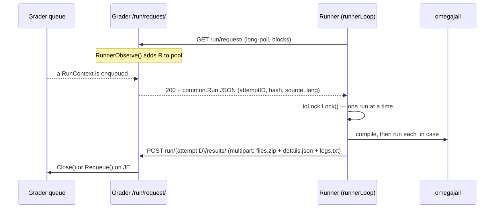

# Componentes internos del corredor

Runner es el servicio que realmente compila y ejecuta el código que envía un concursante, lo alimenta en cada caso `.in` y decide si el resultado es correcto. Es uno de los servicios Go que se encuentran en [`github.com/omegaup/quark`](https://github.com/omegaup/quark), el mismo repositorio que Grader y Broadcaster, y *no* es parte del monorepo de PHP. El lado PHP (`\OmegaUp\Grader` en [`frontend/server/src/Grader.php`](https://github.com/omegaup/omegaup/blob/main/frontend/server/src/Grader.php)) solo entrega un envío al Grader a través de HTTP; A partir de ahí, todo lo que aparece en esta página sucede dentro del quark. Si mantiene un modelo mental en su cabeza, conserve este: el Runner **sabe cómo compilar, ejecutar y canalizar la entrada a los programas que envía el usuario, y cómo comprobar si son correctos o no. Básicamente es una interfaz bastante distribuida para [omegajail](https://github.com/omegaup/omegajail)** (el sandbox basado en minijail de omegaUp). Todo lo que aparece a continuación es esa frase, desempaquetada.

## El Runner como servicio: llama al Grader, no al revés

Lo primero que hay que desaprender de cualquier diagrama que dibuje una flecha con la etiqueta "Grader → Runner" es la dirección. Un Runner es un cliente. Cuando arranca ([`cmd/omegaup-runner/main.go`](https://github.com/omegaup/quark/blob/main/cmd/omegaup-runner/main.go)), *no* abre un puerto y espera a ser llamado; inicia una gorutina `runnerLoop` ([`cmd/omegaup-runner/service.go`](https://github.com/omegaup/quark/blob/main/cmd/omegaup-runner/service.go)) que pasa toda su vida sondeando el Grader. Cada iteración emite un `GET run/request/` simple contra `Config.Runner.GraderURL` (`https://omegaup.com:11302` predeterminado), con dos encabezados que lo identifican: `OmegaUp-Runner-Name` (su nombre de host) y `OmegaUp-Runner-PublicIP`; este último se descubre al inicio llamando a `https://ifconfig.me/ip`, porque Grader necesita una dirección enrutable para extraer las métricas de Prometheus de Runner en el puerto `:6060`.

Esa encuesta *es* el registro. En el lado del calificador, el controlador `/run/request/` ([`cmd/omegaup-grader/runner_handler.go`](https://github.com/omegaup/quark/blob/main/cmd/omegaup-grader/runner_handler.go)) hace dos cosas con una encuesta entrante: llama a `m.RunnerObserve(runnerName, remoteAddr+":6060")` para agregar la persona que llama al grupo en vivo de corredores conocidos, y luego llama a `runs.GetRun(runnerName, ctx.InflightMonitor, …)`, que **bloquea hasta que realmente haya una carrera para repartir**. Entonces, aparece un nuevo Runner en el grupo en el momento en que solicita trabajo y permanece estacionado dentro de una única solicitud HTTP hasta que Grader tenga algo para él. No existe una llamada separada de "hola, existo" para desincronizarse con la realidad.


### Despacho por turnos en todo el grupo

El envío no es inteligente y eso es deliberado. Cada corredor en el grupo está bloqueado dentro de su propia llamada `GetRun` en la misma cola `default` compartida (`DefaultQueueName`, [`grader/queue.go`](https://github.com/omegaup/quark/blob/main/grader/queue.go)). Cuando llega una presentación, exactamente una de esas rutinas estacionadas se despierta, recibe la ejecución y la devuelve a su Runner como un cuerpo `common.Run` JSON. Cualquiera que sea el corredor que esté esperando obtiene la siguiente carrera: efectivamente, se realiza un round robin a través del grupo inactivo, sin rigidez. No hay **ninguna afinidad** entre un Runner y los problemas que ya ha almacenado en caché; hubo afinidad en algún momento en el pasado, y no sería complicado volver a agregarla, pero hoy en día a un Runner se le puede entregar un envío para un problema que nunca ha visto (en cuyo caso recupera el conjunto de entrada, ver más abajo).

La cola en sí está ordenada por prioridad en lugar de una única FIFO: `GetRun` escanea las bandas de prioridad `QueueCount = 4` de izquierda a derecha: `QueuePriorityHigh` (0), `QueuePriorityNormal` (1), `QueuePriorityLow` (2) y `QueuePriorityEphemeral` (3, usado para el clasificador efímero/"pruébelo ahora") - y devuelve la primera ejecución que encuentra, por lo que nunca se vuelve a juzgar con prioridad alta. espera detrás de una acumulación de presentaciones normales.

Una vez que se entrega una ejecución, el `InflightMonitor` la rastrea. Esta es la red de seguridad para un Runner que comienza a trabajar y luego muere a mitad de camino: el monitor arma un `connectTimeout` y un `readyTimeout`, ambos actualmente `10 * time.Minute`. Si el corredor no vuelve a conectarse o no termina dentro de esas ventanas, se presume que la carrera está abandonada y se vuelve a poner en cola. La puesta en cola también es la forma en que se recuperan las fallas transitorias: el controlador de resultados en `/run/{attemptID}/results/` pone en cola un veredicto de `JE` (Error de juez), y una ejecución solo recibe intentos de `Config.Grader.MaxGradeRetries` (actualmente `3`) antes de abandonarla. Todo el controlador `/run/` está envuelto en un `http.TimeoutHandler(…, 5*time.Minute, "Request timed out")`, por lo que una sola carga bloqueada no puede fijar una rutina Grader para siempre.

### El mutex por ejecución: una ejecución a la vez, sin superposición de E/S

Un único proceso Runner califica exactamente **un envío a la vez**. Esto lo aplica un `sync.Mutex` de proceso global llamado `ioLock` ([`cmd/omegaup-runner/service.go`](https://github.com/omegaup/quark/blob/main/cmd/omegaup-runner/service.go)). En el momento en que comienza `gradeRun`, ejecuta `ioLock.Lock()` con el comentario *"Asegúrese de que no se realicen otras E/S mientras calificamos esta ejecución".* La razón es la fidelidad de la medición, no la seguridad de los subprocesos: el Runner también ejecuta un `benchmarkLoop` en segundo plano (cada minuto, a menos que el entorno limitado no operativo esté en uso) para informar qué tan rápido es actualmente este host, y los números de tiempo de CPU y tiempo de pared que produce una calificación solo son confiables si no hay nada más en la caja compite por E/S y ciclos mientras se ejecuta el programa de espacio aislado. La simultaneidad en toda la flota proviene de la ejecución de *muchos* procesos/hosts Runner, no del paralelismo dentro de uno. Para escalar, agregue corredores.

## Lo que llega: el `common.Run` y su conjunto de entradas

El JSON que regresa de `run/request/` es un `common.Run`: un `AttemptID`, un `Language`, un `Source`, un `MaxScore`, un `ProblemName` y, fundamentalmente, un `InputHash`. Ese hash es el **SHA-1 de la entrada del problema `.zip`, una cadena de 40 caracteres hexadecimales** como `d41d8cd98f00b204e9800998ecf8427e…`; La ruta `/input/` del Grader incluso la valida con la expresión regular `[a-f0-9]{40}`. El Corredor nunca confía en tener los casos; le pide a su `InputManager` ese hash a través de `runner.NewInputFactory(...)`, y solo si falla el caché local transmite la entrada configurada desde el Grader.

Esa descarga está comprimida en el cable y en el disco. `persistFromTarStream` ([`runner/input.go`](https://github.com/omegaup/quark/blob/main/runner/input.go)) acepta una secuencia tar en una de tres formas (`gzip`, `bzip2` o sin comprimir), la descomprime a través de un `common.NewHashReader(r, sha1.New())` y rechaza todo si el SHA-1 recalculado no coincide con el `streamHash` (`"hash mismatch: expected %s got %s"`) esperado. A medida que se descomprime, escribe un manifiesto `.sha1` complementario para que cada archivo de caso individual pueda verificarse su integridad más adelante. Históricamente, Grader enviaba estos conjuntos como archivos tar bzip2, razón por la cual `compress/bzip2` todavía está conectado; El transmisor `/input/` propio de la niveladora actualmente les sirve el `Content-Type: application/x-gzip`. De cualquier manera, una vez que el conjunto es local, el mismo hash lo hace reutilizable para cada envío futuro a ese problema, por lo que la costosa recuperación ocurre una vez por Runner y por versión del problema.

Si se le pide al corredor que califique un conjunto de entradas que no tiene y que no puede recuperar, no adivina: devuelve un error para que el calificador sepa que debe (re)enviar el conjunto. Este es el mismo contrato "supongamos que el Runner lo tiene, recupérelo si no lo tiene" de la antigua API de Runner documentada para su llamada `/run/`, conservada intacta.

## Compilación: la convención `Main` y banderas a través de omegajail

La calificación comienza en `runner.Grade` ([`runner/runner.go`](https://github.com/omegaup/quark/blob/main/runner/runner.go)), y lo primero que verifica es `sandbox.Supported()`: si omegajail no está instalado (no hay `bin/omegajail` en `OmegajailRoot`, `/var/lib/omegajail` predeterminado), toda la ejecución vuelve a ser `JE` inmediatamente, porque no existe una forma segura de ejecutar código que no es de confianza. Suponiendo que el entorno de pruebas esté presente, `Grade` establece un directorio de ejecución en `RuntimePath/grade/{AttemptID}` y, a menos que se configure `PreserveFiles`, `defer os.RemoveAll(runRoot)` garantiza que todos los artefactos temporales (fuente, binario, salidas, metadatos) se eliminen en el momento en que se devuelva la calificación, gane o pierda.

El código enviado se escribe en una ubicación fija e independiente del nombre: `runRoot/Main/bin/Main.<ext>` (por ejemplo, `Main.cpp`, `Main.py`, `Main.java`), y el destino de la compilación es literalmente la cadena `Main`. Esta es la **convención principal**, y existe para simplificar la vida del sandbox: no se permite que nada dependa de la elección del nombre de archivo del *usuario*. En Java específicamente, esta es la razón por la que su clase debe ser `Main` y estar fuera de cualquier paquete: si omegajail se compila limpiamente pero no se produce ningún `Main.class`, el Runner reescribe el veredicto en `CE` con el mensaje *"Clase \`Main\` no encontrada. Asegúrese de que su clase se llame \`Main\` y esté fuera de todos los paquetes".* Los problemas interactivos y los validadores personalizados siguen la misma forma, cada uno con su propio Subárbol `bin/`, pero el programa del concursante siempre es `Main`.

La compilación está en sí misma en un espacio aislado. `OmegajailSandbox.Compile` ([`runner/sandbox.go`](https://github.com/omegaup/quark/blob/main/runner/sandbox.go)) no desembolsa directamente a `g++`: crea un vector de argumentos para el binario `omegajail` y permite que minijail envuelva el compilador. La invocación se parece a:

```
omegajail
  --homedir <binPath> --homedir-writable
  -1 compile.out   # compiler stdout
  -2 compile.err   # compiler stderr
  -M compile.meta  # time/memory/exit metadata
  -t 30000         # CompileTimeLimit: 30s, in ms
  -O 10485760      # CompileOutputLimit: 10 MiB, in bytes
  --root /var/lib/omegajail
  --compile <lang> --compile-target Main
  --compile-source Main.<ext>
  [ -- <extraFlags> ]
```
Las banderas específicas del idioma viven *dentro* de los perfiles de omegajail codificados por `<lang>`, que es la diferencia entre un `--compile cpp17` y un `--compile c11`; Runner solo agrega `extraFlags` después de un separador `--` para los casos en los que necesita influir directamente. El ejemplo más claro es **ejecuciones de depuración/AddressSanitizer**: cuando `run.Debug` está configurado en un envío C/C++, el Runner agrega `-static-libasan -fsanitize=address` (estático porque la biblioteca dinámica ASan no se incluye en el entorno de pruebas), luego *porque ASan consume memoria y tiempo* deshabilita el límite de memoria (`MemoryLimit = -1`), duplica el límite de tiempo y agrega un segundo (`TimeLimit*2 + 1s`), y aumenta el límite de salida en 16 KiB para que realmente se pueda emitir el informe del desinfectante. Esa es la regla del POR QUÉ con cada QUÉ hecha literal: cada cambio de bandera se combina con la consecuencia del recurso que lo obliga.

Si la compilación falla (un veredicto que no es `OK` de `compile.meta`), `Grade` establece el veredicto de ejecución en `CE`, lee el texto de error del propio compilador (de `compile.err`, excepto Pascal/Lazarus y C#/dotnet que lo escriben en `compile.out`), le antepone el nombre binario y lo devuelve como `CompileError`. El árbol temporal todavía lo limpia el `RemoveAll` diferido. El concursante ve el diagnóstico real del compilador, no un "error de compilación" genérico.

### Idiomas admitidos

Los lenguajes que omegajail sabe compilar y ejecutar, tal como aparecen en los perfiles y en la ruta de Calificación:

| Idioma | Notas |
|----------|-------|
| C/C++ (`c`, `cpp`, `cpp11`, `cpp17`, `cpp20`) | cadena de herramientas del CCG; `cpp` se actualiza automáticamente a `cpp11` para validadores y padres interactivos, de modo que los solucionadores de problemas no se vean obligados a seguir estándares antiguos |
| Java (`java`) | La clase debe ser `Main`, fuera de todos los paquetes; run obtiene un `1000ms` adicional porque el inicio de JVM es lento |
| Pitón (`py`, `py2`, `py3`) | El sufijo del nombre de destino `_entry` se aplica a los idiomas interpretados |
| Rubí (`rb`), Pascal (`pas`), C# (`cs`), Lua (`lua`), Haskell (`hs`) | C# necesita un enlace simbólico `Main.runtimeconfig.json` junto al objetivo antes de compilar |
| Karel (`kj`, `kp`) | El estado de salida `1` (el modo de falla `INSTRUCTION`) está asignado a `TLE` |
| `cat` | "Problemas" de sólo salida donde la "fuente" es una URL de datos de archivos `.out`; sin compilación, los archivos se descomprimen y verifican directamente |

## Ejecución: alimentar cada caso `.in` a través del sandbox

Con los binarios compilados, `Grade` recorre los grupos y casos del problema en orden. Para cada caso, ejecuta el binario concursante contra `input.Path()/cases/<name>.in`, capturando la salida estándar para `<name>.out`, la stderr para `<name>.err` y los metadatos del sandbox para `<name>.meta`. La llamada por caso es `OmegajailSandbox.Run`, y su vector de argumento omegajail es donde afectan los límites de recursos reales:

```
omegajail
  -0 <name>.in     # stdin = the test case input
  -1 <name>.out    # stdout capture
  -2 <name>.err    # stderr capture
  -M <name>.meta   # metadata
  -m <hardLimit>   # min(HardMemoryLimit=640MiB, problem MemoryLimit), in bytes
  -t <timeLimit>   # problem time limit (+1000ms for java), in ms
  -w <extraWallTime>
  -O <outputLimit> # problem output limit, in bytes
  --root /var/lib/omegajail
  --run <lang> --run-target Main
```
Dos pequeñas realidades que vale la pena conocer. En primer lugar, el límite de memoria entregado al núcleo es `min(HardMemoryLimit, problem.MemoryLimit)` (un límite global de `640 MiB` que los comentarios del código justifican alegremente como *"640 MB deberían ser suficientes para cualquiera"*), por lo que un problema puede pedir menos, pero nunca más de lo que el host está dispuesto a dar. En segundo lugar, el Runner nunca pasa el `/dev/null` *real* a la cárcel; cuando un binario no debería recibir ninguna entrada, se le entrega `omegajailRoot/root/dev/null`, un archivo vacío normal dentro del chroot, porque no se puede acceder al nodo del dispositivo real desde dentro del espacio de nombres.

Antes de cada ejecución, el Runner calienta el caché de la página con un `inputPreloader` ([`runner/sandbox.go`](https://github.com/omegaup/quark/blob/main/runner/sandbox.go)): `mmap` procesa el archivo `.in` `PROT_READ`/`MAP_SHARED` y toca un byte por página (volviendo a una lectura completa simple si falla `mmap`), por lo que el programa del concursante dedica su tiempo medido a calcular, no bloqueo en el disco. Los problemas interactivos obtienen más maquinaria: `libinteractive` configura FIFO con nombre (`syscall.Mkfifo`) entre un padre "principal" que plantea el problema y el niño concursante, ambos encarcelados, y un paso `mergeVerdict` decide la falla cuando un lado muere (un `SIGPIPE` o uno de los estados de salida 239-242 significa que el *compañero* se portó mal, lo que se convierte en `VE`, la culpa del validador, por lo que se le dice al que plantea el problema que lo arregle en lugar de penalizar al concursante).

### El sandbox en sí: desde ptrace syscall-mangling hasta seccomp SIGSYS

omegajail desciende de una larga línea de entornos sandbox de programación competitiva. El linaje importa porque la *técnica* cambió. El omegaUp Sandbox original era una bifurcación muy modificada de **Moeval, el sandbox utilizado en el IOI, escrito por Martin Mareš**, y aislaba programas con `ptrace`: interceptaría una llamada al sistema prohibida y **la reemplazaría con algo inofensivo (por ejemplo, intercambiar `setrlimit` por `getuid`, que es completamente inerte) y luego haría que el proceso creyera que la llamada original había fallado. Así es exactamente como se fingió la ausencia de una red: cada llamada a `socket` se hacía para devolver `-1`, por lo que un programa que intentaba llamar a casa simplemente vio errores en todas partes y se dio por vencido.** Funcionó, pero ptrace es lento y complicado.

La omegajail moderna reemplaza eso con el núcleo haciendo el trabajo. Está construido sobre **minijail**, la herramienta de aislamiento de procesos de Chrome OS de Google (el `Dockerfile.minijail` en quark literalmente `ADD` es el tarball `minijail-xenial-distrib`), y apila espacios de nombres PID/red/montaje, un chroot, rlimits y, en esencia, un filtro de llamada al sistema **seccomp-BPF**. En lugar de destrozar silenciosamente una mala llamada al sistema, el filtro hace que el núcleo genere `SIGSYS` en el instante en que el programa realiza una llamada fuera del conjunto permitido. El corredor lee eso del archivo `.meta` y lo convierte en el veredicto `RFE` (*Error de función restringida*). Esta es la razón por la que el aislamiento de la red "simplemente funciona" ahora: no hay ningún `socket` que falsificar porque la llamada al sistema es fatal en el límite del núcleo. En kernels anteriores a 5.13, omegajail puede recurrir a un detector SIGSYS más antiguo a través de `--allow-sigsys-fallback`, y hay un modo `--disable-sandboxing` que se usa solo cuando se ejecuta dentro de Docker para CI, donde los montajes vinculados se intercambian por enlaces simbólicos.

### De `.meta` a un veredicto

El puente entre "el programa se detuvo" y "el veredicto es X" es `parseMetaFile` ([`runner/sandbox.go`](https://github.com/omegaup/quark/blob/main/runner/sandbox.go)), que lee las líneas clave:valor que omegajail escribe (`status`, `time`, `time-wall`, `mem`, `signal`, `syscall`,…) y asigna la señal de terminación a un veredicto:

| Señal de la cárcel omega | Veredicto | Significado |
|----------------------|---------|---------|
| `SIGSYS` | `RFE` | El programa realizó una llamada al sistema prohibida: el filtro seccomp la eliminó |
| `SIGALRM`, `SIGXCPU` | `TLE` | Se quedó sin CPU/tiempo de pared |
| `SIGXFSZ` | `OLE` | Escribió más que el límite de producción |
| `SIGSEGV`, `SIGABRT`, `SIGFPE`, `SIGKILL`, `SIGILL`, `SIGBUS`, `SIGPIPE` | `RTE` | Error/bloqueo de tiempo de ejecución |
| ninguno, estado de salida `0` | `OK` | Salida limpia (pendiente de control de salida) |
| ninguno, salida distinta de cero | `RTE` | Salida distinta de cero (excepto `c`, donde se tolera una salida distinta de cero) |

Hay una verificación posterior de la memoria encima de la señal: si el `mem` medido excede el `MemoryLimit` del problema (o, para Java, si la salida fue distinta de cero *y* el stderr contiene `java.lang.OutOfMemoryError`), el veredicto se reescribe en `MLE`. Los veredictos se combinan en todos los casos con `worseVerdict`, que indexa en un único orden canónico de peor a mejor: **`JE, CE, RFE, VE, MLE, RTE, TLE, OLE, WA, PA, AC, OK`**. Un grupo es tan bueno como su peor caso, y toda la serie es tan buena como su peor grupo.

## Validación de salida: comparar lo que el programa imprimió con lo esperado

Un veredicto de `OK` de ejecución significa que el programa *se ejecutó*; no significa que fuera *correcto*. La corrección se decide en la fase de validación, que para cada caso de `OK` compara el `<name>.out` del concursante con el `cases/<name>.out` esperado utilizando uno de cinco tipos de validador (`common.ValidatorName`, [`common/problemsettings.go`](https://github.com/omegaup/quark/blob/main/common/problemsettings.go)):

- **`token`**: divide ambas salidas en tokens separados por espacios en blanco y requiere un token de igualdad exacto y que distinga entre mayúsculas y minúsculas por token. Este es el caballo de batalla predeterminado.
- **`token-caseless`**: igual, pero comparado con `strings.EqualFold`, por lo que `YES` y `yes` coinciden.
- **`token-numeric`**: tokeniza solo caracteres numéricos y compara cada par de números dentro de una tolerancia (tolerancia predeterminada si el problema no establece ninguna), usando un épsilon relativo o absoluto para que las respuestas de punto flotante no se rechacen en el último bit.
- **`literal`** — no comparar en absoluto; analiza la salida del concursante como un solo número en `[0.0, 1.0]` y *úsalo como puntuación*. Principalmente para problemas interactivos donde el interactor imprime la partitura.
- **`custom`**: ejecuta el propio programa de validación del solucionador de problemas (compilado como su propio binario en espacio aislado) con la salida del concursante, el `data.in` original, el `data.out` esperado y los metadatos de ejecución enlazados; imprime un número en `[0.0, 1.0]` que se convierte en la puntuación.

La comparación de tokens se encuentra en `CalculateScore` y `Tokenizer` ([`runner/validator.go`](https://github.com/omegaup/quark/blob/main/runner/validator.go), [`runner/tokenizer.go`](https://github.com/omegaup/quark/blob/main/runner/tokenizer.go)). El tokenizador es deliberadamente cuidadoso con lo que cuenta como espacio en blanco: trata no solo los espacios Unicode como separadores, sino también los cuatro caracteres de control de espacios en blanco de Java, pero no de espacios en blanco Unicode, `U+001C`–`U+001F` (ARCHIVO/GRUPO/REGISTRO/SEPARADOR DE UNIDAD), por lo que un `Scanner` de Java y el juez acuerdan los límites de los tokens. Un solo token tiene un límite de `MaxTokenLength = 4 MiB`; cualquier cosa más larga se trata como EOF. Las discrepancias transportan información de líneas y columnas para diagnóstico.

La ruta del validador personalizado tiene su propio manejo de fallas entretejido. Si el validador en sí no sale limpiamente, el corredor asume una salida de concursante vacía (`/dev/null`) en lugar de acreditar un validador roto. Y hay un buen toque para los casos de prueba negativos: si un caso no logra la máxima puntuación y el problema envía un archivo `<name>.expected-failure`, el corredor verifica que el stderr del validador *contenga* esa cadena esperada; si no es así, el caso se marca como `VE` (error del validador), porque el validador falló de una manera que el solucionador del problema no anticipó.

La puntuación es aritmética racional exacta (`math/big.Rat`, nunca flotante) para que los créditos parciales se sumen correctamente. Las ponderaciones de los casos se normalizan de modo que la suma de todas las ponderaciones sea igual a `1` (o `1/number-of-cases` si las ponderaciones no están establecidas o no son positivas), la puntuación de cada caso es `MaxScore × weight × runScore` y un grupo bajo la política de puntuación `min` toma la fracción del peor caso en lugar de la suma. Un grupo sólo aporta puntuación si *todos* los casos que contiene son correctos; un caso `WA` pone a cero el grupo.

## Enviar resultados de vuelta

Cuando finaliza la calificación, Runner no devuelve un blob JSON ordenado sobre la solicitud que estaba atendiendo: *carga* a un segundo punto final, `POST run/{AttemptID}/results/`, como un cuerpo `multipart` transmitido mientras la calificación aún está en proceso. Se suben tres tipos de piezas: el paquete de artefactos `files.zip` (un Zip de cada `compile.out/err/meta`, cada `<case>.out/err/meta` y cada salida del validador; aquí es donde las salidas de ejecución sin procesar y los metadatos se comprimen para su almacenamiento), un `details.json` con el `RunResult` estructurado (veredicto, puntuación, desglose por grupo/por caso, tiempo, tiempo de pared, memoria máxima) y una parte sin comprimir. `logs.txt`.

Debido a que una compilación lenta o un caso de ejecución prolongada podrían dejar la conexión en silencio el tiempo suficiente como para activar un tiempo de inactividad del `60s`, el escritor de carga (`filesZipWriter`, [`cmd/omegaup-runner/service.go`](https://github.com/omegaup/quark/blob/main/cmd/omegaup-runner/service.go)) emite una parte vacía de `.keepalive` cada `15 seconds` hasta que el primer byte real de `files.zip` esté listo. El controlador de resultados del clasificador ignora las piezas de `.keepalive`, decodifica `details.json` en la ejecución, estampa `JudgedBy` con el nombre del corredor y `Close()` registra la ejecución (terminada) o `Requeue()` (en `JE`, hasta `MaxGradeRetries`). Una vez enviada la respuesta, el `RemoveAll` diferido del Runner limpia el `runRoot`, y su `runnerLoop` regresa inmediatamente al `GET run/request/` para solicitar el siguiente.

## Configuración

El comportamiento del corredor está impulsado por el bloque `Runner` de su archivo de configuración (valor predeterminado en [`common/context.go`](https://github.com/omegaup/quark/blob/main/common/context.go)); las claves portantes, con sus valores predeterminados actuales:| Clave | Predeterminado | Propósito |
|-----|---------|---------|
| `GraderURL` | `https://omegaup.com:11302` | Donde `runnerLoop` busca trabajo y recupera conjuntos de entrada |
| `RuntimePath` | `/var/lib/omegaup/runner` | Root para caché `input/` y directorios reutilizables `grade/{AttemptID}` |
| `OmegajailRoot` | `/var/lib/omegajail` | Donde viven `bin/omegajail` y el chroot `root/` |
| `CompileTimeLimit` | `30s` | Pared dura en compilación |
| `CompileOutputLimit` | `10 MiB` | Límite en la salida del compilador |
| `HardMemoryLimit` | `640 MiB` | Techo absoluto; un problema puede pedir menos, nunca más |
| `OverallOutputLimit` | `100 MiB` | Salida total en todos los casos antes de que el resto se cortocircuite a `OLE` |
| `PreserveFiles` | `false` | Mantenga `runRoot` para depurarlo en lugar de eliminarlo |

Vale la pena conocer dos indicadores para el trabajo local: `-insecure` elimina la autenticación de certificado de cliente TLS mutuo que el corredor normalmente usa para hablar con el calificador (`tls.RequireAndVerifyClientCert`), y `-noop-sandbox` intercambia en el `NoopSandbox` ([`runner/noop_sandbox.go`](https://github.com/omegaup/quark/blob/main/runner/noop_sandbox.go)), que no compila nada y califica todo `AC`: útil para ejercitar el hacer cola y despachar plomería en una máquina que no tiene omegajail instalado. También hay un modo `-oneshot=run` que califica un problema único desde la línea de comando sin siquiera tocar el Calificador, que es la forma más rápida de reproducir un error de calificación de forma aislada.

## Documentación relacionada

- **[Grader Internals](grader-internals.md)**: la cola, las prioridades y cómo se envía un envío aquí
- **[Función Sandbox](../features/sandbox.md)** — descripción general de omegajail/minijail
- **[Veredictos](../features/verdicts.md)**: la enumeración completa del veredicto y lo que significa cada uno
