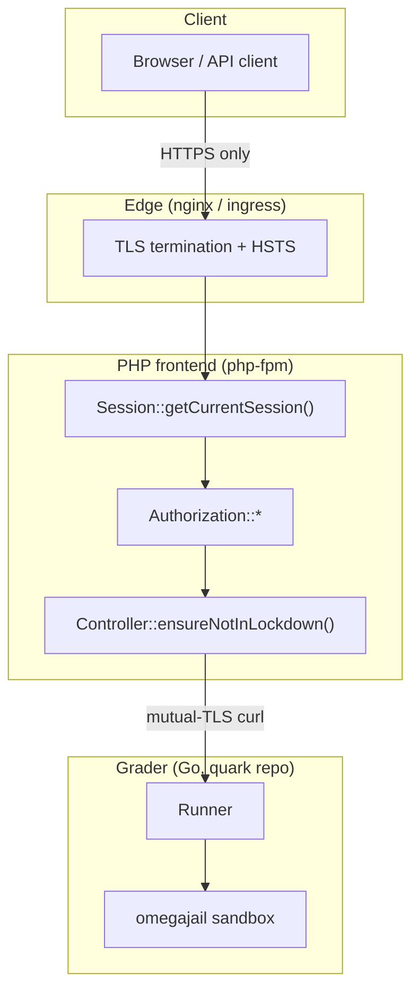

# Arquitectura de seguridad {#security-architecture}

omegaUp es, en esencia, un lugar donde extraños cargan código y nosotros lo ejecutamos en nuestro
máquinas, durante concursos donde el incentivo para hacer trampa es real. Ese solo hecho
da forma a casi todas las decisiones de seguridad en esta página: asumimos que la red está siendo
olfateado, asumimos que la sumisión es hostil y asumimos que al menos una persona
En todo concurso importante se trata de ver el tráfico de otra persona. (Esto no es
paranoia: en un concurso de programación alguien se sentó y olisqueó la LAN,
y con herramientas como Firesheep que hacen que el secuestro de sesiones sea un asunto de apuntar y hacer clic, el
La defensa barata es cifrar todo y no confiar en nada de lo que llega por cable).

Esta página guía la solicitud desde el navegador hacia adentro: TLS en el borde, el `ouat`
cookie de sesión y cómo se genera, tokens API y OAuth para la programática y
rutas de terceros, cómo se almacenan las contraseñas, qué hace el "bloqueo" durante una visita al sitio
concurso y, finalmente, la caja de arena omegajail que guarda el `system("rm -rf /")` del concursante.
de llegar alguna vez a un sistema de archivos real. La zona de pruebas vive en un **repositorio de Go separado**
([omegaup/quark](https://github.com/omegaup/quark)), no en este monorepo de PHP, y el
la distinción importa: la interfaz nunca toca la minicárcel; solo habla HTTP al
Grader, propietario del arenero.


## Todo viaja a través de HTTPS {#everything-travels-over-https}

Toda la plataforma es solo HTTPS y el motivo es el modelo de amenaza de trampa en concursos.
arriba: si alguna solicitud pudiera enviarse en texto plano, un token de sesión o una declaración de problema
podría leerse en el cable. TLS termina en el borde (nginx/entrada de k8s),
y la aplicación está escrita de manera que un token literalmente no se puede enviar a través de un sistema no cifrado
conexión. Esta garantía se aplica concretamente en
[`SessionManager::setCookie`](https://github.com/omegaup/omegaup/blob/main/frontend/server/src/SessionManager.php):
el indicador `secure` de la cookie está configurado en `!empty(\OmegaUp\Request::getServerVar('HTTPS'))`,
por lo que la cookie de sesión `ouat` solo se emite con el atributo `Secure` cuando
La solicitud llegó a través de TLS: un navegador se negará a enviarla de vuelta a través de HTTP simple.
La misma llamada marca cada cookie de sesión `httponly => true` (JavaScript no puede leerla,
que mitiga el robo de tokens basado en XSS) y `samesite => 'Lax'` (no funcionará en un
POST entre sitios, que es la defensa CSRF para la cookie en sí).

El origen configurado propio del frontend, `OMEGAUP_URL`, es una URL de `https://` en
producción, y el enlace de niveladora `OMEGAUP_GRADER_URL` por defecto es
`https://localhost:21680`: incluso el salto de backend interno es TLS. Ese salto interno es
no sólo cifrado sino **mutuamente autenticado**: en
[`Grader.php`](https://github.com/omegaup/omegaup/blob/main/frontend/server/src/Grader.php)
el identificador de rizo está fijado con una clave de cliente y un certificado
(`CURLOPT_SSLKEY => '/etc/omegaup/frontend/key.pem'`,
`CURLOPT_SSLCERT => '/etc/omegaup/frontend/certificate.pem'`), verifica el par
(`CURLOPT_SSL_VERIFYPEER => true`, `CURLOPT_SSL_VERIFYHOST => 2`) contra
`/etc/omegaup/frontend/certificate.pem` como su CA y obliga
`CURLOPT_SSLVERSION => CURL_SSLVERSION_TLSv1_2`. Entonces el clasificador solo aceptará ejecuciones
desde una interfaz que tenga el certificado correcto, y la interfaz solo se enviará a un
El evaluador presenta un certificado en el que confía; ninguno de los dos extremos habla con un extraño.

### Contenido-Seguridad-Política y marco {#content-security-policy-and-framing}

Antes de que se ejecute cualquier controlador,
[`bootstrap.php`](https://github.com/omegaup/omegaup/blob/main/frontend/server/bootstrap.php)
emite un encabezado `Content-Security-Policy` ensamblado a partir de una lista de permitidos explícita
(`connect-src`, `img-src`, `script-src`, `frame-src`) más un `report-uri` de
`/cspreport.php`, y lo sigue con `X-Frame-Options: DENY`. La lista `img-src` es
deliberadamente permisivo (`*`) con un comentario que explique por qué: las declaraciones de problemas pueden
incrustar imágenes desde cualquier lugar de Internet, por lo que no podemos bloquear los orígenes de las imágenes sin
resolver problemas legítimos, pero `script-src` es estricto y enumera exactamente los
puñado de terceros desde los que cargamos JS (Google/analytics, Facebook, Twitter,
Agente de New Relic). Las violaciones se PUBLICAN de nuevo en `/cspreport.php`, por lo que una novela
El intento de inyección aparece en nuestros registros en lugar de ejecutarse silenciosamente.

## La cookie de sesión `ouat` {#the-ouat-session-cookie}

Cuando un humano inicia sesión a través de un navegador, su sesión se realiza mediante una cookie llamada
`ouat`: abreviatura de **omegaUp Auth Token**, definido como
`OMEGAUP_AUTH_TOKEN_COOKIE_NAME` en
[`config.default.php`](https://github.com/omegaup/omegaup/blob/main/frontend/server/config.default.php)
(línea 9). El valor de esa cookie **no** es un token JWT o PASETO; es un valor opaco,
identificador respaldado por base de datos. Acuñarlo es tarea de `Session::registerSession()` en
[`Session.php`](https://github.com/omegaup/omegaup/blob/main/frontend/server/src/Controllers/Session.php),
y vale la pena leerlo en orden de ejecución porque cada paso es una decisión de seguridad.

Primero escribe una fila `IdentityLoginLog` que registra la identificación de identidad y la IP del cliente.
(`ip2long(REMOTE_ADDR)`), por lo que hay un seguimiento de auditoría de quién inició sesión y desde dónde.
Luego, y este es el movimiento anti-trampas, llama
`\OmegaUp\DAO\AuthTokens::expireAuthTokens($identity->identity_id)`, que en el
[Tokens de autenticación DAO](https://github.com/omegaup/omegaup/blob/main/frontend/server/src/DAO/AuthTokens.php)
Es un `DELETE FROM Auth_Tokens WHERE identity_id = ?` plano. En otras palabras, **iniciar sesión
destruye todas las sesiones anteriores para esa identidad**. Esto le da a omegaUp una manera efectiva
Modelo de sesión activa única: un concursante no puede entregar silenciosamente sus credenciales a un
compañero de equipo y ambos permanecen conectados, porque el segundo inicio de sesión registra silenciosamente el primero
fuera. Es un instrumento deliberadamente contundente y es la razón por la que un usuario que inicia sesión en
su teléfono se encuentra desconectado de su computadora portátil.

Sólo entonces se construye el nuevo token:

```php
// Session::registerSession(), Session.php
$entropy = bin2hex(random_bytes(self::AUTH_TOKEN_ENTROPY_SIZE)); // 15 bytes -> 30 hex chars
$hash = hash(
    'sha256',
    OMEGAUP_MD5_SALT . $identity->identity_id . $entropy
);
$token = "{$entropy}-{$identity->identity_id}-{$hash}";
```
Entonces, el valor de la cookie tiene tres partes separadas por guiones: `{entropy}-{identity_id}-{hash}`:

- **entropía** — `AUTH_TOKEN_ENTROPY_SIZE` (actualmente 15) bytes aleatorios de
  `random_bytes()`, codificado en hexadecimal a 30 caracteres. Esta es la parte indescifrable.
- **identity_id**: la identidad numérica a la que pertenece el token, escrita en claro para que
  se puede encontrar la fila y, por lo tanto, los usuarios con identidades múltiples (una "identidad de inicio de sesión" que actúa como
  "identidad en funciones") se puede resolver.
- **hash** — `sha256(OMEGAUP_MD5_SALT + identity_id + entropy)`, que une la entropía
  e identidad juntos bajo un salt del lado del servidor para que nadie pueda ensamblar un token
  quien no conoce la sal.

Luego, el token persiste con `AuthTokens::replace(...)` y se entrega a
`SessionManager::setCookie(OMEGAUP_AUTH_TOKEN_COOKIE_NAME, $token, 0, '/')` — caducidad `0`
significa una cookie de sesión que muere cuando se cierra el navegador, `Secure`/`HttpOnly`/`SameSite=Lax`
como se describe arriba.

```mermaid
sequenceDiagram
    participant U as Browser
    participant S as Session::nativeLogin
    participant D as MySQL (Auth_Tokens)
    U->>S: usernameOrEmail + password
    S->>S: testPassword (Argon2id verify)
    S->>D: expireAuthTokens(identity_id)  %% kill old sessions
    S->>D: replace(new token row)
    S-->>U: Set-Cookie: ouat={entropy}-{id}-{sha256}; Secure; HttpOnly; SameSite=Lax
```
### Cómo un token se convierte en una sesión en cada solicitud {#how-a-token-becomes-a-session-on-every-request}

En cada llamada API, `Session::getCurrentSession()` extrae el token, del
Parámetro de solicitud `auth_token` si está presente; de lo contrario, desde la cookie `ouat` a través de
`getAuthToken()` — y lo resuelve con
`\OmegaUp\DAO\AuthTokens::getIdentityByToken($authToken)`. Esa consulta es más sutil.
que una simple búsqueda: une `Auth_Tokens` con `Identities` en
`i.identity_id IN (aut.identity_id, aut.acting_identity_id)`, así es como omegaUp
admite un inicio de sesión que actúa como otra identidad (la cuenta de un entrenador que opera un equipo
identidad, por ejemplo): la fila lleva tanto la **identidad de inicio de sesión** como la **identidad de inicio de sesión
identidad**, y `ORDER BY is_main_identity DESC` los clasifica para que la persona que llama pueda saber cuál
es cual. Si el token no se resuelve, la sesión vuelve con `valid => false`,
`identity => null` y el nombre de clase `user-rank-unranked`; el usuario es simplemente tratado
como anónimo en lugar de recibir un error. Cerrar sesión
(`Session::unregisterSession()`) elimina la fila del token y sobrescribe la cookie con
`setcookie(OMEGAUP_AUTH_TOKEN_COOKIE_NAME, 'deleted', 1, '/')`.

## Tokens API para acceso programático {#api-tokens-for-programmatic-access}

Los humanos reciben la cookie `ouat`; Los scripts y los bots obtienen **tokens API**, que llegan en un
encabezado `Authorization` en lugar de una cookie, por lo que nunca dependen del estado del navegador.
`SessionManager::getTokenAuthorization()` busca el prefijo `token ` y lo elimina,
y `Session::getAPIToken()` acepta dos formas:

```
Authorization: token {api_token}
Authorization: token Credential={api_token},Username={identity}
```
La segunda forma existe porque un usuario con varias identidades asociadas necesita decir
*cuál* identidad debe actuar como el token; sin un `Username`, el token se asigna a su
identidad de propiedad única. Cualquier par mal formado (algo que no sea `key=value`, o un
`Credential`/`Username` que falta) arroja `UnauthorizedException` inmediatamente:
no hay ningún análisis de crédito parcial de un encabezado de autenticación.

Los tokens API tienen una tasa limitada y, a diferencia de la sesión del navegador, este límite se aplica en
la capa PHP en cada solicitud. Llamadas `getCurrentSession()`
`\OmegaUp\DAO\APITokens::updateUsage(...)`, luego marca la respuesta con tres encabezados
para que un cliente con buen comportamiento pueda retroceder antes de ser bloqueado:

| Encabezado | Significado |
|--------|---------|
| `X-RateLimit-Limit` | el techo — `OMEGAUP_SESSION_API_HOURLY_LIMIT`, actualmente **1000 solicitudes/hora** |
| `X-RateLimit-Remaining` | cuantas llamadas quedan en la ventana actual |
| `X-RateLimit-Reset` | la marca de tiempo cuando la ventana se reinicia |

Cuando `remaining` llega a `0`, omegaUp establece adicionalmente un encabezado `Retry-After` (los segundos
hasta que se reinicie) y lanza `RateLimitExceededException`, por lo que se le dice al cliente que no solo
que fue estrangulado pero exactamente cuánto tiempo esperar. Las sesiones se almacenan en caché en
`Cache::SESSION_PREFIX` codificado por el token, por lo que resolver un token no afecta a MySQL en
cada llamada.

## OAuth2 e inicio de sesión de terceros {#oauth2-and-third-party-login}

No todo el mundo se registra con una contraseña. Los federados de omegaUp inician sesión en Google, Facebook y
GitHub y los tres canalizan hacia el mismo asistente privado,
`Session::thirdPartyLogin($provider, $email, $name)`: busca el correo electrónico con
`Identities::findByEmail()`, y si nadie coincide, crea un nuevo usuario en el
punto (`User::createUser(..., ignorePassword: true, forceVerification: true)` — no
contraseña y verificada previamente porque el proveedor de identidad ya avaló el correo electrónico),
luego llama al mismo `registerSession()` que utiliza el inicio de sesión nativo. Así que no importa cómo
Cuando se autentica, sale con una cookie `ouat` normal.

Los flujos de Facebook y GitHub utilizan la biblioteca estándar **league/oauth2-client**, empaquetada
en dos pequeñas clases RAII en la parte superior de `Session.php`:

- **Facebook** — `ScopedFacebook` construye un
  `\League\OAuth2\Client\Provider\Facebook` con `OMEGAUP_FB_APPID` / `OMEGAUP_FB_SECRET`,
  `graphApiVersion 'v2.5'`, una redirección a `OMEGAUP_URL . '/login?fb'` y solicitudes
  Sólo el alcance `email`. `loginViaFacebook()` intercambia el `?code` por un token de acceso,
  busca al propietario del recurso y se niega a continuar si el perfil no tiene correo electrónico
  (`loginFacebookEmptyEmailError`): una cuenta sin correo electrónico no se puede conciliar con una
  identidad omegaUp.
- **GitHub** — `ScopedGitHub` construye un `\League\OAuth2\Client\Provider\Github` con
  `OMEGAUP_GITHUB_CLIENT_ID` / `OMEGAUP_GITHUB_CLIENT_SECRET` y una redirección de
  `OMEGAUP_URL . '/login?third_party_login=github'`. `loginViaGithub($code, $state, ...)`
  Primero verifica CSRF: compara el `state` devuelto por GitHub con el valor escondido.
  en la cookie `github_oauth_state` y lanza `loginGitHubInvalidCSRFToken` en un
  falta de coincidencia: esta es la defensa estándar de OAuth `state` contra una devolución de llamada falsificada. entonces
  intercambia el código, lee el perfil y extrae el correo electrónico principal **verificado** del usuario
  de `https://api.github.com/user/emails` (una cuenta de GitHub puede tener varios correos electrónicos; solo
  se confía en un `verified && primary`).

Google se maneja de manera ligeramente diferente porque utiliza los servicios de identidad de Google en lugar de
que un intercambio de código de redireccionamiento. Implementos `loginViaGoogle($idToken, $gCsrfToken, ...)`
Comprobación CSRF manual de **cookie de doble envío** de Google: lee la cookie `g_csrf_token`
y requiere que el `gCsrfToken` publicado coincida exactamente (registrar y rechazar con
`loginGoogleInvalidCSRFToken` de lo contrario), luego verifica el lado del servidor del token de ID con
`(new \Google_Client(['client_id' => OMEGAUP_GOOGLE_CLIENTID]))->verifyIdToken($idToken)`.
Solo después de pasar la verificación de firma de Google confiamos en el `email` en la carga útil y
entréguelo a `thirdPartyLogin('Google', ...)`.

> GitHub OAuth es opcional en producción pero comúnmente se configura para **desarrollador local**. conjunto
> `OMEGAUP_GITHUB_CLIENT_ID` / `OMEGAUP_GITHUB_CLIENT_SECRET` en
> `frontend/server/config.php`: consulte la sección GitHub OAuth en
> [Configuración de desarrollo](../getting-started/development-setup.md).

## Almacenamiento de contraseñas {#password-storage}

Las contraseñas que *están* almacenadas pertenecen a cuentas nativas y están codificadas con
**Argon2id**, el ganador del concurso de hash de contraseñas, en memoria de su memoria
[`SecurityTools.php`](https://github.com/omegaup/omegaup/blob/main/frontend/server/src/SecurityTools.php).
`hashString()` prefiere el `password_hash($string, PASSWORD_ARGON2ID, ...)` nativo de PHP con
un conjunto de opciones optimizadas: `memory_cost` de `ARGON2ID_MEMORY_COST` (actualmente **1024 KiB**),
`time_cost` de `SODIUM_CRYPTO_PWHASH_OPSLIMIT_MODERATE` y `threads => 1`, y cae
volver al `sodium_crypto_pwhash_str()` de libsodium (con la memoria expresada en bytes,
es decir, `1024 * 1024`) en compilaciones donde `PASSWORD_ARGON2ID` no está definido. Los dos caminos son
sintonizado para producir hashes `$argon2id$...` compatibles, razón por la cual `compareHashedStrings()`
comprueba el prefijo `$argon2id$` y enruta a `sodium_crypto_pwhash_str_verify()` cuando el
Falta la constante nativa; de lo contrario, `password_verify()`.

La longitud de la contraseña está limitada en ambos extremos por una razón. `testStrongPassword()` requiere
**8 a 72 caracteres**: 8 como límite mínimo para la entropía y 72 como límite máximo porque Argon2/bcrypt
El hashing es intencionalmente costoso, por lo que un atacante que pudiera PUBLICAR un mensaje de varios megabytes
"contraseña" en cada intento de inicio de sesión convertiría nuestro propio KDF en un amplificador de denegación de servicio.
Limitar la entrada mantiene cada hash lo suficientemente barato como para ser seguro bajo carga.

Las cuentas antiguas son anteriores a Argon2id (fueron codificadas con Blowfish) y actualizaciones de omegaUp
ellos de forma transparente. `isOldHash()` informa si un hash almacenado necesita repetirse (cualquier cosa
no comienza con `$argon2id$`, o que `password_needs_rehash` marca), y en un
`nativeLogin()` exitoso, el controlador se da cuenta de esto y vuelve a realizar el hash del recién verificado.
texto sin formato con `SecurityTools::hashString()` y lo vuelve a escribir con
`Identities::update()`. Entonces, una contraseña heredada se convierte silenciosamente en una contraseña de Argon2id.
la próxima vez que su propietario inicie sesión, no será necesario restablecer la contraseña.

## Tokens PASETO para servicios {#paseto-tokens-for-services}

Hay un segundo sistema de tokens, completamente independiente, y es fácil de combinar con el
Cookie `ouat`, para ser precisos: el token de sesión del navegador es opaco
manija `{entropy}-{identity_id}-{sha256}` arriba, mientras que **PASETO** (vía
[`paragonie/paseto`](https://github.com/paragonie/paseto)) se utiliza para corta duración,
Autorización de servicio a servicio *sin estado* que nunca toca la tabla de sesiones. ambos
vive en `SecurityTools.php`.

Cuando el frontend necesita autorizar a un usuario contra **omegaup-gitserver** (datos del problema
se almacena como repositorios de git en un archivo separado
[omegaup/gitserver](https://github.com/omegaup/gitserver) servicio),
`getGitserverAuthorizationToken($problem, $username)` acuña un **PASETO v2 `public`**
token: asimétrico, firmado con `OMEGAUP_GITSERVER_SECRET_KEY` para que gitserver pueda verificarlo
con solo la mitad pública, que vence en **5 minutos** (`new \DateInterval('PT5M')`),
lleva `issuer 'omegaUp frontend'`, `subject` el nombre de usuario y un único reclamo personalizado
nombrando el `problem`. El alcance limitado es intencional: un token de gitserver filtrado es bueno para
exactamente un problema, durante cinco minutos, y no se puede utilizar para iniciar sesión en el sitio. (Hay
también un respaldo más simple para `OmegaUpSharedSecret` cuando `OMEGAUP_GITSERVER_SECRET_TOKEN` está
configurado.)

La clonación de cursos utiliza un token **PASETO v2 `local`** en su lugar:
`getCourseCloneAuthorizationToken()` — que es *simétrico* (cifrado con
`OMEGAUP_COURSE_CLONE_SECRET_KEY`, por lo que la carga útil es opaca para el portador) y válida para
**7 días** (`P7D`). Al regresar, `getDecodedCloneCourseToken()` no solo decodifica
eso; hace cumplir los reclamos con `\OmegaUp\ClaimRule`, requiriendo `permissions == 'clone'`
y `course == $courseAlias`, y comprueba por separado que `ValidAt` haya caducado: arrojar
`TokenValidateException('token_invalid')` o `('token_expired')` respectivamente. una ficha
acuñado para clonar el curso A, por lo tanto, no se puede reproducir para clonar el curso B, incluso antes de que
caduca.

## Modo de bloqueo para concursos presenciales {#lockdown-mode-for-onsite-contests}

omegaUp organiza concursos oficiales en el sitio (piense en salas estilo ICPC llenas de concursantes en un
LAN bloqueada), y el "modo de bloqueo" es cómo el mismo código base sirve tanto a la red abierta
Internet y un lugar de competencia cerrado. El cambio es un nombre de host, no una edición de configuración:
[`bootstrap.php`](https://github.com/omegaup/omegaup/blob/main/frontend/server/bootstrap.php)
calcula

```php
define(
    'OMEGAUP_LOCKDOWN',
    isset($_SERVER['HTTP_HOST']) &&
    strpos($_SERVER['HTTP_HOST'], OMEGAUP_LOCKDOWN_DOMAIN) === 0
);
```
entonces `OMEGAUP_LOCKDOWN` es `true` siempre que el encabezado `Host` de la solicitud comience con
`OMEGAUP_LOCKDOWN_DOMAIN` (`localhost-lockdown` predeterminado). Atender el lugar desde el
bloquea el nombre de host y todo el sitio entra en modo reforzado; servir al sitio público desde
su nombre de host normal y nada cambia.

Lo que en realidad *hace* el confinamiento es bloquear las operaciones peligrosas. `Controller::ensureNotInLockdown()`
en
[`Controller.php`](https://github.com/omegaup/omegaup/blob/main/frontend/server/src/Controllers/Controller.php)
es una sola línea -

```php
public static function ensureNotInLockdown(): void {
    if (OMEGAUP_LOCKDOWN) {
        throw new \OmegaUp\Exceptions\ForbiddenAccessException('lockdown');
    }
}
```
- y se esparce a través de los controladores que podrían filtrar información fuera de
el recinto o dejar que un concursante llegue al mundo exterior: se convoca en todo momento
`Contest`, `Problem`, `Course`, `User`, `Admin`, `Certificate`, `QualityNomination` y
`Run`. Durante un concurso cerrado, los puntos finales que le permitirían, por ejemplo, editar su
perfil, explorar problemas no relacionados o extraer datos, simplemente ejecute `forbidden` mientras el
La ruta principal "leer los problemas de este concurso y enviarlos" sigue funcionando. el cheque es
colocados en línea en cada operación vigilada en lugar de como una única puerta global, precisamente para
que las operaciones seguras sigan disponibles mientras que las riesgosas no.

## La caja de arena de omegajail {#the-omegajail-sandbox}

Todo lo anterior protege la *frontend*. La última línea de defensa protege el
*máquinas que ejecutan código del concursante*, y reside completamente en el evaluador Go
([omegaup/quark](https://github.com/omegaup/quark)) — el monorepo de PHP no tiene referencias
a minijail o sandbox, porque nunca ejecuta código que no sea de confianza. Le entrega el
envío al calificador a través del canal mutuo TLS descrito anteriormente
(`\OmegaUp\Grader::grade()` → `/run/new`, `/run/grade/`) y el **corredor** de la niveladora
realiza la compilación y ejecución real dentro del sandbox. Si quieres la línea única
Modelo mental: el corredor es básicamente una bonita interfaz distribuida para el sandbox.

La caja de arena es **omegajail**
([omegaup/omegajail](https://github.com/omegaup/omegajail)), descendiente de omegaUp de
**minijail** de Google: un programa Rust (`RUST_LOG=debug`, `RUST_BACKTRACE=1` en su
entorno) invocado como un subproceso. El corredor todavía envía un `Dockerfile.minijail` heredado
en quark, pero el sistema en ejecución usa omegajail (actualmente v3.10.4, desempaquetado en
`/var/lib/omegajail`, el `OmegajailRoot` predeterminado en
[`common/context.go`](https://github.com/omegaup/quark/blob/main/common/context.go)). el
la integración está en
[`runner/sandbox.go`](https://github.com/omegaup/quark/blob/main/runner/sandbox.go):
`OmegajailSandbox` crea una línea de comando `bin/omegajail` y la envía a través de
`invokeOmegajail()`.

### ¿Qué restringe omegajail {#what-omegajail-restricts}

?

omegajail envuelve el proceso que no es de confianza en un **chroot** (`--root /var/lib/omegajail`) con
su propio `/dev` mínimo (un `/dev/null` real de `mknod`; el sandbox incluso sustituye a un
archivo vacío para `/dev/null` en lugar de exponer el host), lo ejecuta dentro de Linux
espacios de nombres para que no pueda ver los procesos del host o la red, y limita todas las escrituras a un
directorio de inicio por ejecución (`--homedir <chdir>`, se puede escribir solo durante la compilación con
`--homedir-writable`). Archivos que la ejecución necesita legítimamente: la entrada de prueba como `data.in`,
datos adicionales: se copian o se vinculan (`--bind source:target`) en esa cárcel; cuando
El sandboxing está deshabilitado para el desarrollo local (`--disable-sandboxing`), los montajes de enlace no están
posible, por lo que el código recurre a vincular simbólicamente los objetivos.

El filtrado de llamadas al sistema se aplica con **seccomp-BPF**: omegajail instala una política que
mata el proceso en una llamada al sistema no permitida y detecta esas muertes a través de un `SIGSYS`
manejador. En kernels anteriores a 5.13, ese detector necesita una implementación alternativa, que
es por eso que el sandbox expone `--allow-sigsys-fallback` (aparecido como
`OmegajailSandbox.AllowSigsysFallback`). El efecto práctico de la política es el que
asuntos para un juez: una presentación que intenta abrir un enchufe, bifurcar un enjambre de procesos,
o `execve` un shell se detiene en el límite del núcleo, nunca dentro de nuestro código.

### Límites de recursos y los veredictos que producen {#resource-limits-and-the-verdicts-they-produce}

Los límites se pasan a omegajail como indicadores explícitos y se aplican mediante el sandbox, no por el
Vaya al proceso preguntando cortésmente. De `OmegajailSandbox.Run()`:

| Bandera | Significado |
|------|---------|
| `-m <bytes>` | techo de memoria — `min(HardMemoryLimit, problem limit)`; el límite máximo es **640 MiB** (el comentario fuente dice *"640 MB debería ser suficiente para cualquiera"*) |
| `-t <ms>` | Límite de tiempo de CPU (Java obtiene **+1000 ms** agregados, porque el inicio de JVM no es culpa del concursante) |
| `-w <ms>` | tiempo adicional de reloj de pared además del límite de la CPU, para detectar un programa que duerme o se bloquea |
| `-O <bytes>` | límite de tamaño de salida, por lo que un programa no puede llenar el disco imprimiendo para siempre |
| `-M <file>` | el archivo de metadatos que omegajail escribe con el resultado |

La compilación se ejecuta con su propio presupuesto a través de `OmegajailSandbox.Compile()`.
`CompileTimeLimit` de **30 segundos** y `CompileOutputLimit` de **10 MiB** (ambos de
`common/context.go`). Después de cada invocación, el corredor lee el metaarchivo con
`parseMetaFile()` y convierte el estado de salida sin formato en un veredicto: `OK`, `CE` (error de compilación),
`JE` (error de evaluación; por ejemplo, se rechaza un archivo fuente que se resuelve fuera del chroot)
antes de que se ejecute, con `"file %q is not within the chroot"`), y los veredictos de tiempo de ejecución
la zona de pruebas se deriva de los límites que acaba de imponer. Incluso hay idiomas específicos.
manejo integrado: después de una compilación de Java, el ejecutor verifica que el resultado esperado
`<target>.class` realmente existe y reescribe un resultado que de otro modo sería `OK` en un `CE` con un
mensaje útil (*"Asegúrese de que su clase se llame `<target>` y esté fuera de todos los paquetes"*),
porque un archivo Java que se compila pero produce el nombre de clase incorrecto fallaría de otro modo
misteriosamente en tiempo de ejecución.

## Documentación relacionada {#related-documentation}

- **[Runner internals](runner-internals.md)**: el proceso de calificación que impulsa el sandbox
- **[API de autenticación](../reference/api.md)**: los puntos finales de inicio de sesión, token y OAuth
- **[Códigos de error](../reference/api.md)**: incluidos `lockdown`, `loginRequired` y los errores CSRF anteriores
