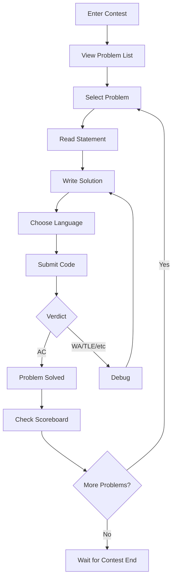

# Arena

Arena es el servicio web que Frontend debe solicitar para todo lo relacionado con el concurso, y también para un poco de administración del concurso, como editar los problemas adjuntos a un concurso. Históricamente, se planeó como su propio componente: parte del Frontend durante la versión 1 y luego se dividió como un servicio independiente a partir de la versión 2. En la práctica, lo que existe hoy en omegaUp es la forma v1: Arena es el conjunto de componentes de un solo archivo de Vue bajo `frontend/www/js/omegaup/components/arena/` (`Arena.vue`, `Contest.vue`, `ContestPractice.vue`, `Scoreboard.vue`, `Runs.vue`, `RunSubmitPopup.vue`, `Clarification.vue`, `Summary.vue`, `NavbarMiniranking.vue` y amigos), todos hablando con los mismos puntos finales de la API de PHP que se describen a continuación. La antigua división v2-independiente nunca ocurrió, pero el contrato API del que habla Arena es exactamente el que se redactó para él, por lo que esta página documenta ese contrato como aquello con lo que realmente se construye.

El objetivo de la Arena es ser la cara que los concursantes mirarán durante todo el concurso. Su trabajo, en palabras de la especificación UX original, es mostrar el entorno del concurso; mostrar, enviar y revisar envíos de problemas; mostrar aclaraciones; hacer una mini clasificación; renderizar el marcador completo; y dibujar la tabla de puntuación-progreso (puntos a lo largo del tiempo). Una decisión de diseño deliberada desde el primer día fue que esta capa se escribiría 100% en HTML/JavaScript para que la misma interfaz de usuario pudiera ser impulsada tanto por _Arena_ como por _Frontend_, que es exactamente la razón por la que la migración a los componentes de un solo archivo de Vue aterrizó de manera tan limpia: la capa de presentación siempre estuvo destinada a ser un cliente ligero sobre la API.

## Diseño de la arena

```
┌─────────────────────────────────────────────────────────────┐
│  Contest Title                              Timer: 01:30:00 │
├─────────┬───────────────────────────────────────────────────┤
│         │                                                   │
│ Problem │              Problem Statement                    │
│  List   │                                                   │
│         │  - Description                                    │
│  [A]    │  - Input/Output format                           │
│  [B]    │  - Constraints                                   │
│  [C]    │  - Examples                                      │
│         │                                                   │
│─────────┼───────────────────────────────────────────────────│
│         │                                                   │
│ Submit  │              Code Editor                          │
│ History │                                                   │
│         │  [Language: C++17 ▼]  [Submit]                   │
│         │                                                   │
├─────────┴───────────────────────────────────────────────────┤
│                    Scoreboard / Clarifications              │
└─────────────────────────────────────────────────────────────┘
```
El carril izquierdo es la lista de problemas (`NavbarProblems.vue`) más el historial de envío del usuario actual para el problema seleccionado (`Runs.vue`); el panel central cambia entre la declaración renderizada y el editor de código (`CodeView.vue` / `RunSubmitPopup.vue`); el cajón inferior se voltea entre el marcador (`Scoreboard.vue`) y las aclaraciones (`ClarificationList.vue`). El mini-ranking (`NavbarMiniranking.vue`) aparece en la barra de navegación para que siempre veas la cima de la clasificación sin salir del problema en el que te encuentras.

## El ciclo de envío


## Cómo se configura cada llamada API

Antes de cualquier punto final individual, se aplican cuatro convenciones en todas partes y se asumen para el resto de esta página.

Cada llamada reside en `https://omegaup.com/api/`, en `/api/` y no en la raíz del sitio, porque SSL solo existe en `omegaup.com`, y todo lo que toca un concurso tiene que estar encriptado (hubo un concurso de programación real en el que alguien se sentó y olió el tráfico; entre eso y los ataques estilo Firesheep, cifrar todo es el único valor predeterminado sensato).

La mayoría de las llamadas necesitan un `auth_token`, que se obtiene llamando a `/api/user/login/` o iniciando sesión a través de la página normal. El manejo de sesiones pasa por `POST`, pero las cookies también funcionan, por lo que las llamadas a `GET` pueden llevar autenticación sin pasar el token por la cadena de consulta. Los parámetros viajan como JSON y cualquier llamada que requiera autenticación debe llevar un `auth_token` válido.

Cada respuesta lleva un campo `status`. En caso de éxito, es la cadena literal `ok`. En caso de falla, es `error`, y el cuerpo también lleva una descripción de `error` legible por humanos **en cualquier idioma para el que esté configurada la cuenta**, además de un `errorcode` (numérico) y un `errorname` (texto) para que el código pueda bifurcarse en la falla sin analizar la prosa.

Además de ese sobre, el servidor establece el estado HTTP para que coincida. Las dos filas que más importan son la división 403/404, porque codifica una decisión de seguridad real:

| Código | Respuesta | Lo que significa |
| ---- | -------- | ------------- |
| 200 | Aceptar | La solicitud tuvo éxito. |
| 400 | MALA SOLICITUD | La solicitud (incluido el cuerpo JSON) tiene un formato incorrecto. |
| 401 | SE REQUIERE AUTENTICACIÓN | A la solicitud le falta `auth_token`, ya sea mediante cookie o mediante el cuerpo JSON. |
| 403 | PROHIBIDO | El recurso fue **encontrado**, pero no tienes los privilegios para leerlo o modificarlo: un usuario que intenta leer las carreras de otra persona o abrir el panel de administración de un concurso. |
| 404 | NO ENCONTRADO | No se encontró el recurso (un usuario, problema, concurso, ejecución…), **o** se encontró pero se oculta deliberadamente, como ocurre con los concursos privados. |
| 505 | ERROR DEL SERVIDOR INTERNO | La solicitud terminó inesperadamente. El cuerpo puede incluso estar vacío o la descripción ambigua. Esperemos que los registros tengan más que decir al respecto. |

!!! advertencia "La regla 403 contra 404 es intencional, no descuidada"
    Un concurso privado al que no estás invitado devuelve **404, no 403**, a propósito. Un 403 filtraría que el concurso existe; 404 mantiene un concurso privado invisible para cualquiera que no haya sido agregado explícitamente. Si está tocando el código de visibilidad, no lo "arregle" en un 403.

## Entrar a la arena

Tres rutas devuelven HTML en lugar de JSON: el shell de arena real:

- `GET /arena/` — el aterrizaje en la arena. Si no ha iniciado sesión, muestra la lista de concursos públicos actuales; si es así, muestra la lista de concursos a los que perteneces.
- `GET /arena/:contest_alias`: la introducción del concurso. Al cerrar sesión, obtienes los detalles del concurso más un botón *Iniciar sesión*; iniciado sesión, los mismos detalles pero el botón se convierte en *Iniciar el concurso*. Esa distinción es importante porque comenzar el concurso es lo que marca tu reloj personal cuando el `window_length` está en juego (ver más abajo).
- `GET /arena/:contest_alias/scoreboard`: si tiene permiso para verlo, el HTML que presenta gráficamente el contenido de `/api/problemset/scoreboard/`.

## Concursos de listado: `GET /api/contest/list`

Devuelve, de forma predeterminada, los últimos 20 concursos que el usuario "puede ver". Puede limitar la lista con cuatro filtros, cada uno de ellos una enumeración: `active` (`ACTIVE`, `FUTURE`, `PAST`), `recommended` (`RECOMMENDED`, `NOT_RECOMMENDED`), `participating` (`YES`, `NO`) y `public` (`YES`, `NO`: concursos públicos versus aquellos en los que estaba registrado).

Cada resultado lleva los campos de identidad habituales (`contest_id`, `problemset_id`, `alias`; el alias es lo que necesita para llegar al concurso: `title`, `description`), el cronograma como marcas de tiempo Unix (`start_time`, `finish_time`, `last_updated`) y tres campos que vale la pena mencionar:

- `admission_mode` es `enum['public', 'private', 'registration']`: público, privado o "requiere que el usuario se registre primero".
- `duration` es el lapso de tiempo en el que está abierto el concurso (solo `finish_time - start_time`).
- `window_length` es el tiempo que recibe cada usuario *una vez que abre personalmente el concurso* y **devuelve `null` si el concurso no se configuró con esa característica**, lo que significa que todos comparten la misma ventana global de `start_time` a `finish_time`.

## Creando un concurso — `POST /api/contest/create`

Si la persona que llama tiene un `auth_token` válido, esto crea un nuevo concurso sin problemas todavía. Se necesita el título/descripción/`start_time`/`finish_time`, un `alias` de hasta 32 caracteres y un montón de botones de puntuación. Los que llevan semántica real:

- `window_length` (int) — opcional; configúrelo si cada usuario debe tener la misma cantidad de tiempo independientemente de *cuándo* ingresen.
- `points_decay_factor` (doble en el rango `(0,1)`): qué tan rápido decaen los puntos de un problema a lo largo del concurso. **El valor predeterminado es 0 (los puntos no disminuyen). Como referencia, TopCoder usa 0.7**: ese es el ancla de cómo se siente un concurso de "alto deterioro".
- `submissions_gap` (int, en el rango `(0, finish_time - start_time)`): la cantidad mínima de segundos que un usuario debe esperar después de un envío antes de realizar otro.
- `penalty` (int, `(0, INF)`): minutos agregados como penalización por veredicto no aceptado.
- `penalty_type` (`none`, `problem_open`, `contest_start`, `runtime`): *cómo* se calcula la penalización por envío, es decir, desde qué momento comienza el reloj.
- `scoreboard` (int `(0,100)`): el porcentaje de la duración del concurso durante el cual el marcador permanece visible. `show_scoreboard_after` (bool) luego decide si el marcador completo se revela una vez que finaliza el concurso.
- `public` (bool): por defecto es **privado** y un concurso **no se puede hacer público hasta que tenga problemas**, por lo que lo creas vacío y lo volteas más tarde.
- `languages`: el conjunto de idiomas permitidos (`kp`, `kj`, `c11-gcc`, `c11-clang`,…), separados por comas para más de uno.
- `basic_information` (bool): si los usuarios deben haber completado su información básica (país, estado, escuela) antes de poder unirse.
- `requests_user_information` (`no`, `optional`, `required`): si el organizador solicita permiso para ver la información personal de los concursantes.

## Detalles del concurso público: `GET /api/contest/publicdetails/`

Si el usuario puede verlo, muestra los detalles del concurso `:contest_alias`: información mínima del problema, tiempo restante, miniclasificación. En palabras del autor original, es *"una pequeña consulta agradable, carismática y almacenable en caché".* Ese "almacenable en caché" es una señal de diseño, no algo descartable: este punto final está destinado a ser económico y servido desde la caché, así que trátelo como su vía rápida para cualquier cosa que vea un visitante público desconectado.

La carga útil refleja el cronograma y las mismas perillas de puntuación que crear, con el mismo comportamiento de borde: `window_length` (int) es el tiempo que el usuario tiene para enviar, y **si es `NULL` la ventana es todo el concurso**; `scoreboard` es el porcentaje de visibilidad de 0 a 100; `points_decay_factor` vuelve a tener el valor predeterminado **0 (sin caída), TopCoder es 0,7**; `partial_score` (bool) es verdadero si el usuario gana puntos parciales por problemas no resueltos en todos los casos; `penalty_calc_policy` es `enum('sum', 'max')`; y `penalty_time_start` dice si el tiempo de penalización comienza a contar desde que se abre el concurso o desde que se abre el problema.

## El marcador — `GET /api/problemset/scoreboard/`

Si el usuario tiene los permisos correctos, esto devuelve la clasificación completa del concurso con ese `problemset_id` (`auth_token` es opcional aquí; un marcador público se puede leer sin uno). Vuelve como una matriz `problems` (cada entrada es una `order` para clasificar y una `alias`) más una matriz `ranking`. Cada fila de clasificación es un concursante: `username`, display `name`, `country` y `classname`: el rango/nivel que el usuario ha obtenido a lo largo de su trayectoria en la plataforma, que es lo que impulsa el estilo de nombre de usuario en color. Es fácil pasar por alto una bandera: `is_invited` (bool) distingue a un usuario que fue **explícitamente invitado** de uno que simplemente participó en un concurso público. Luego, cada fila lleva un `total` de `points` y `penalty`, y un desglose por problema (`alias`, `points`, `penalty`, `percent` y `runs`: la cantidad de envíos que este usuario realizó sobre ese problema en este concurso).

### Eventos de progreso de puntuación — `GET /api/problemset/scoreboardevents/`

La misma puerta de permiso, pero en lugar de la clasificación actual, devuelve **cada evento que provocó que la puntuación de alguien cambiara**; de aquí se extrae el gráfico de puntuación y progreso. Cada evento tiene el concursante (`username`, `name`, `country`, `classname`, `is_invited`), un `delta` (el número de segundos *desde el inicio del concurso* en el que ocurrió el evento), el `total` en ejecución (`points`, `penalty`), y el `problem` que lo activó (`alias`, `points`, `penalty`). Trace `total.points` frente a `delta` por usuario y obtendrá el clásico gráfico de escalera ascendente.

## Leyendo un problema — `GET /api/problem/details/`Con los permisos adecuados, esto devuelve el contenido del problema más referencias a las soluciones que la persona que llama ya le envió. Además de la declaración en sí (`statement.markdown`, `statement.language` y cualquier `statement.images`), obtiene los metadatos que definen el contrato de evaluación: `time_limit` y `memory_limit`, `input_limit` y `validator` - `enum('remote','literal','token','token-caseless','token-numeric')`, que decide cómo se compara la salida (literal exacta, token por token, tokens que no distinguen entre mayúsculas y minúsculas o tokens numéricos dentro de una tolerancia). El bloque `settings` detalla los límites reales que impone la niveladora (`TimeLimit`, `OverallWallTimeLimit`, `ExtraWallTime`, `MemoryLimit`, `OutputLimit`) además del `cases`, donde cada caja de muestra lleva su `in`, `out` y `weight`.

La matriz `runs` es el historial de envío de la persona que llama para este problema, y ​​es donde las dos enumeraciones con las que compararás el patrón en vivo. `status` recorre `'new' → 'waiting' → 'compiling' → 'running' → 'ready'`: el ciclo de vida de un envío desde la cola hasta el juzgado. `veredict` (sí, el campo está escrito de esa manera) es la respuesta final, una de `'AC'` (aceptado), `'PA'` (parcial), `'PE'` (error de presentación), `'WA'` (respuesta incorrecta), `'TLE'` (límite de tiempo excedido), `'OLE'` (límite de salida excedido), `'MLE'` (límite de memoria excedido), `'RTE'` (error de tiempo de ejecución), `'RFE'` (error de función restringida), `'CE'` (error de compilación) o `'JE'` (error de evaluación). Cada ejecución también informa `runtime`, `memory`, `score`, `contest_score` y `submit_delay`: **el número de minutos desde que el usuario abrió el problema hasta que lo envió**, que es lo que desactiva el cálculo de penalización.

## Envío de una solución: `POST /api/run/create/`

Este es el punto final alrededor del cual gira toda la Arena. Cuando presionas *Enviar*, el JavaScript publica `{ auth_token, problem_alias, language, source, contest_alias? }` — `contest_alias` opcional, presente solo cuando el problema pertenece al conjunto de problemas de un concurso. La solicitud se ejecuta en la cadena estándar: `frontend/www/api/ApiEntryPoint.php` requiere `frontend/server/bootstrap.php`, que pasa a `\OmegaUp\ApiCaller::httpEntryPoint()`, que enruta `run/create` a `\OmegaUp\Controllers\Run::apiCreate` (tenga en cuenta que la clase es `Run`, no `RunController`; los controladores omegaUp eliminan el sufijo `Controller`). Puede leerlo en `frontend/server/src/Controllers/Run.php` (`apiCreate` comienza en la línea 415).

`apiCreate` primero autentica la identidad, luego valida: todos los campos obligatorios están presentes (`source`, idioma, problema y concurso, si corresponde), el problema está realmente en el concurso y ambos son válidos, el límite de tiempo del concurso no ha vencido, el usuario no excede la tasa de envío y el concurso es público o el usuario fue agregado explícitamente a él. El límite de velocidad es `submissions_gap`, cuyo valor predeterminado es **60 segundos** (`Run::$defaultSubmissionGap = 60` y `Run.php:26`), es decir, un envío por problema por minuto, a menos que el concurso lo anule. Sólo después de todo eso escribe las filas `Submissions` y `Runs` en MySQL y luego llama a `\OmegaUp\Grader::getInstance()->grade($run, trim($source))` en `Run.php:573`.

!!! nota "El clasificador es un servicio independiente al que se accede a través de HTTP"
    `\OmegaUp\Grader` es un cliente ligero de curl, no el clasificador en sí. PUBLICA la ejecución en `OMEGAUP_GRADER_URL` (`https://localhost:21680` predeterminado), y la calificación real (la cola, los corredores, el entorno limitado de la minicárcel) se encuentra en el repositorio Go [`omegaup/quark`](https://github.com/omegaup/quark) separado. Este punto final PHP nunca toca minijail; simplemente pasa el recorrido por el cable. Si `grade()` se lanza, `apiCreate` no puede revertir dentro de una transacción (el proceso Grader no vería la fila), por lo que desvincula y elimina las filas `Run`/`Submission` manualmente.

La respuesta es pequeña, pero cada campo tiene un caso límite integrado:

- `guid`: el identificador de la presentación, que utilizará para sondear el veredicto.
- `submission_deadline` (Marca de tiempo): la fecha límite para realizar presentaciones. **Es 0 cuando no estás dentro de un concurso** (`Run.php:617`/`635`); dentro de un concurso es el `end_time` del conjunto de problemas, o el `start_time + window_length` cuando se aplica una ventana por usuario.
- `nextSubmissionTimestamp` (marca de tiempo): el momento más temprano en que el usuario puede enviar este problema nuevamente, es decir, ahora más el `submissions_gap`. Esto es contra lo que cuenta el botón Enviar.

## Viendo el resultado regresar

Una presentación se juzga de forma asincrónica, por lo que la Arena realiza una encuesta. `GET /api/problem/runs/` devuelve referencias a las soluciones más recientes de la persona que llama a un problema con su `status` y veredicto; `GET /api/run/details/` (con clave de `run_alias`) devuelve la imagen completa para una ejecución: el `source`, un indicador `admin` y un bloque `details` con el `verdict`, `compile_meta` por fase (`time`, `sys_time`, `wall_time`, `memory`), el `score`/`contest_score`/`max_score`, la ejecución `time`, `wall_time`, `memory` y `judged_by` (qué corredor lo manejó). Mientras una ejecución está en `new`/`waiting`/`compiling`/`running`, la interfaz de usuario muestra una rueda giratoria; una vez que `run/details` informa a `ready` con un veredicto, deja de sondear y pinta el resultado.

!!! consejo "Veredictos, de un vistazo"
    `AC` todos los casos aprobados · `PA` parcial (algunos casos, cuando el `score_mode` del concurso permite crédito parcial) · `WA` respuesta incorrecta · `TLE` sobre el límite de tiempo · `MLE` sobre el límite de memoria · `OLE` sobre el límite de salida · `RTE` error de tiempo de ejecución · `RFE` error de función restringida (una llamada al sistema prohibida) · Error de presentación de `PE` · Error de compilación de `CE` (verifique `compile_meta`) · Error de evaluación de `JE` (culpa nuestra, no suya).

## Aclaraciones

Durante un concurso, un concursante estancado le hace una pregunta al autor del problema. `POST /api/clarification/create/` toma `{ auth_token, problem_alias, contest_alias?, message }` (el concurso es opcional si el problema no está en un concurso) y devuelve un `clarification_id` para rastrearlo. Para leerlos, `GET /api/problem/clarifications/` y `GET /api/contest/clarifications/` devuelven **todas** las aclaraciones que el usuario puede ver, que son exactamente las que envió personalmente, más todas las aclaraciones marcadas como públicas, paginadas con `offset` (predeterminado 0) y `rowcount` (predeterminado 20). Cada entrada lleva `author`, `message`, `answer` (`null` hasta que se responda), `time` y la bandera `public`; la variante del concurso también lleva `receiver` (`null` para una transmisión para todos). Solo el creador del problema o del concurso puede responder, a través de `POST /api/clarification/update/` con `{ auth_token, clarification_id, answer, public }`; cambie `public` a verdadero y la respuesta será visible para todo el concurso en lugar de solo para el autor de la pregunta.

## Modos de concurso

Los mismos componentes representan tres modos, determinados por el lugar donde cae "ahora" en relación con la ventana del concurso.

**Modo de práctica** (`ContestPractice.vue`) se ejecuta *fuera* del horario del concurso: sin cronómetro, detalles completos del veredicto visibles, presentaciones ilimitadas y nada toca el marcador. Es el modo "regresar y aprender el problema".

**Modo de concurso** (`Contest.vue`) se ejecuta *durante* la ventana: el cronómetro cuenta regresivamente contra `submission_deadline`, los detalles del veredicto pueden restringirse según la configuración de `feedback` del concurso, el marcador en vivo es visible para el porcentaje de duración de `scoreboard` configurado y se aplica el límite de tasa de `submissions_gap`.

**El concurso virtual** reproduce un concurso anterior con sus problemas y límites de tiempo originales, pero en un reloj personal, para que puedas compararte con la clasificación original después del hecho.

## Vista de administrador del concurso

Un director de concurso ve la misma Arena más la superficie administrativa: las presentaciones de cada participante (no solo las suyas propias, esa es la puerta 403 para el propietario), la capacidad de volver a juzgar presentaciones específicas, transmitir anuncios a todos los concursantes, responder aclaraciones y extender el tiempo del concurso. Estos reutilizan los mismos puntos finales; la diferencia está completamente en las comprobaciones de permisos que ejecutan los controladores, no en una interfaz de usuario separada.

## Documentación relacionada

- **[Concursos](contests/index.md)** — gestión y configuración del concurso
- **[Problems](problems/index.md)**: creación de problemas y configuración de evaluación a la que se hace referencia anteriormente
- **[Actualizaciones en tiempo real](realtime.md)**: cómo se actualizan los veredictos y los marcadores
- **[Veredictos](verdicts.md)**: se explica la enumeración completa del veredicto
- **[API de concursos](../reference/api.md)**: la referencia del punto final
