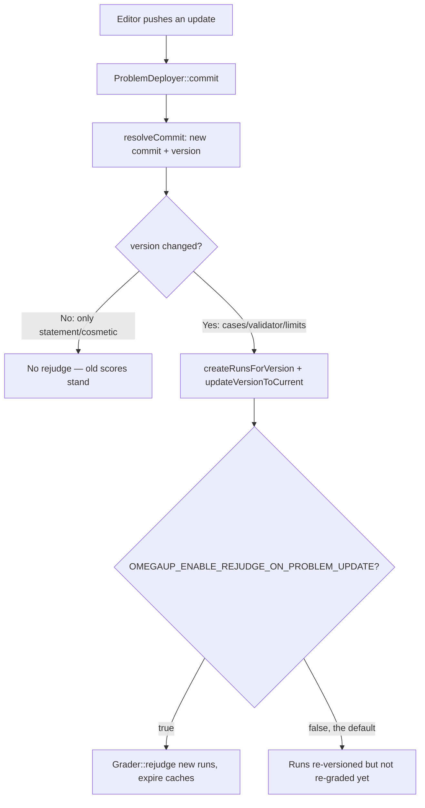

# Problema de control de versiones

Cada problema en omegaUp es un repositorio git real. No está "controlado por versiones" en algún sentido metafórico: un repositorio simple real, uno por problema, almacenado físicamente y servido por **gitserver**, un pequeño servicio Go (`github.com/omegaup/gitserver`, enviado como la imagen de Docker `omegaup/gitserver`, actualmente `v1.9.13`) construido sobre libgit2 (`git2go/v33`) y el transporte HTTP inteligente `githttp/v2`. La interfaz PHP nunca toca esos repositorios directamente; habla con gitserver a través de HTTP simple en `OMEGAUP_GITSERVER_URL` (`http://localhost:33861` predeterminado, donde `33861` es `OMEGAUP_GITSERVER_PORT` en `frontend/server/config.default.php`).

Lo hacemos de esta manera porque un problema de programación competitiva no es un solo documento: es un conjunto de declaraciones, casos de prueba, validadores, soluciones y configuraciones de calificación que diferentes personas editan de forma independiente en diferentes momentos, y donde un solo archivo `.out` incorrecto descubierto a mitad del concurso debe poder solucionarse *sin* volver a calificar silenciosamente a todos los que ya lo enviaron. Git ya resuelve el historial, las actualizaciones atómicas, las diferencias y "dame exactamente los bytes que estaban activos en el compromiso `abc123`". En lugar de reinventar eso en MySQL, omegaUp se apoya en git y gasta su propio código en las dos cosas que git *no* sabe: **quién tiene permiso para ver qué archivos** y **qué cambios son cosméticos versus relevantes para la calificación**.

## El diseño de la sucursal: contenido dividido por visibilidad

El modelo mental ingenuo (un `master` para la versión publicada, un `private` para el borrador) es incorrecto, y la diferencia importa en el momento en que intentas razonar sobre quién puede ver un caso de prueba oculto. gitserver divide el contenido de un problema en varias ramas *por sensibilidad*, y hace la división por usted: usted envía una confirmación con todos sus archivos y gitserver enruta cada archivo a la rama correcta usando las expresiones regulares de ruta en `DefaultCommitDescriptions` (`handler.go`).

| Árbitro | Sostiene | ¿Quién puede leerlo?
|-----|-------|-----------------|
| `refs/heads/public` | `.gitattributes`, `.gitignore`, `statements/`, `examples/`, `interactive/Main.distrib.*`, `interactive/examples/`, `validator.distrib.*`, `settings.distrib.json` | Cualquiera que pueda ver el problema |
| `refs/heads/protected` | `solutions/`, `tests/` | Editores de problemas y usuarios que ya lo han solucionado |
| `refs/heads/private` | `cases/*.in` + `cases/*.out`, `interactive/Main.*`, `*.idl`, `validator.*`, `settings.json` | Sólo editores de problemas |
| `refs/heads/master` | El compromiso de fusión que une `public` + `protected` + `private` (+ la revisión) juntos | Editores |
| `refs/heads/published` | Un puntero a una confirmación dentro de `master`: la versión *activa* | — |
| `refs/meta/config` | `config.json` (publicación/configuración espejo) | Sólo administradores |
| `refs/meta/review` | El libro de revisión de código y los hilos de comentarios | Editores y solucionadores |
| `refs/changes/*` | Confirmaciones pendientes de revisión en espera de fusión con `master` | — |

La razón por la que los datos de prueba *reales* (`cases/`, el `validator.*`, `settings.json` real) viven en `private` y los datos de muestra (`examples/`, `settings.distrib.json`, `validator.distrib.*`) viven en `public` es exactamente para que "mostrar al concursante los casos de muestra" y "dejar que el evaluador lea los casos secretos" son dos lecturas de git diferentes frente a dos diferentes ramas con dos comprobaciones de permisos diferentes: no se puede filtrar accidentalmente un caso oculto al representar una declaración, porque la rama de la declaración no lo contiene físicamente.

`public`, `protected` y `private` son **referencias de solo lectura**: cualquier intento de enviarlos directamente se rechaza con `ErrReadOnlyRef` (consulte `validateUpdate` en `handler.go`). Solo se mueven *implícitamente* cuando se fusiona un cambio. `refs/meta/config` requiere administrador (`IsAdmin`); `refs/meta/review` y `refs/changes/*` aceptan un empujón de cualquiera que `CanEdit` **o** `HasSolved` solucione el problema: esa cláusula `HasSolved` es deliberada, de modo que alguien que resolvió un problema pueda dejar comentarios de revisión sin ser un editor completo. Y eliminar cualquier referencia está totalmente prohibido (`ErrDeleteDisallowed`): el historial de problemas se puede agregar únicamente por diseño; no existe "forzar la eliminación de una confirmación incorrecta".

## Un compromiso, una versión y por qué no son lo mismo

Ésta es la distinción más importante de la página y la que un resumen simplificado siempre destruye. omegaUp rastrea **dos** identificadores para "qué versión del problema" y responden diferentes preguntas:

- **`commit`**: el SHA-1 de la confirmación de fusión en `refs/heads/master`. Una confirmación maestra siempre tiene **3 o 4 padres** (sus subconfirmaciones `public`, `protected`, `private` y, opcionalmente, la revisión). Si alguna vez ve una confirmación en el registro maestro con menos de 3 padres, es uno de los consejos de rama fusionada, no una versión con un problema real; el código los omite explícitamente (`if (count($logEntry['parents']) < 3) { continue; }` en `Problem::getVersions`).
- **`version`** — el hash del *árbol* de la rama `private` en esa confirmación. Debido a que la rama privada es **siempre el último padre** de la confirmación maestra, `Problem::resolveCommit` (`frontend/server/src/Controllers/Problem.php`) lee ese último padre, toma su árbol y devuelve el par `[masterCommit, privateTree]`.

¿Por qué llevar ambos? Porque dejaron que omegaUp respondiera *"¿realmente cambió el contenido calificado?"* en una comparación. Supongamos que corrige un error tipográfico en la declaración en inglés. Eso produce un compromiso `master` completamente nuevo (nuevo `commit`), pero el árbol `private` (los casos, el validador, `settings.json`) es byte por byte idéntico, por lo que el `version` no cambia. Un cambio en un caso de prueba, un límite de tiempo o el validador cambia el árbol `private`, por lo que el `version` también cambia. Cada ejecución registra ambos (`Run::apiCreate` almacena `'version' => $problem->current_version, 'commit' => $problem->commit`), por lo que la interfaz puede mostrar "este envío se juzgó según el compromiso X" y al mismo tiempo reserva costosas reevaluaciones para los casos en los que la *versión* se movió.

## Carga y actualización: cómo un envío se convierte en un compromiso

Cuando crea o edita un problema a través de la interfaz de usuario, el lado PHP es `\OmegaUp\ProblemDeployer` (`frontend/server/src/ProblemDeployer.php`). **No** habla el protocolo git wire caso por caso; PUBLICA su `.zip` completo en gitserver en `OMEGAUP_GITSERVER_URL/{alias}/git-upload-zip`, y el `ziphandler.go` de gitserver lo descomprime, lo divide en las ramas de contenido y crea la confirmación de fusión.

La parte interesante es la **estrategia de fusión**, porque "aplicar este zip encima de lo que ya está allí" significa cosas diferentes para diferentes ediciones. `ProblemDeployer::commit` elige uno según la operación:

| Operación (constante `ProblemDeployer`) | Estrategia de fusión enviada a gitserver | Significado |
|---|---|---|
| `CREATE` (3) | `theirs` | Tomemos como ejemplo el árbol postal al por mayor: no hay nada contra lo que fusionarse |
| `UPDATE_CASES` (1) | `theirs` | Reemplace los datos de prueba con lo que hay en el zip |
| `UPDATE_STATEMENTS` (2) | `recursive-theirs` | Fusión real de tres vías, pero el zip gana los conflictos |
| `UPDATE_SETTINGS` (0) | `ours` | Mantenga intacto el árbol existente (las configuraciones se aplican fuera de banda, no desde el zip) |

Esos nombres son la enumeración `ZipMergeStrategy` de gitserver (`ziphandler.go`): `ours` usa el árbol principal tal como está (exactamente `git merge -s ours`), `theirs` usa el árbol del zip y descarta el padre (para el cual git *no* tiene equivalente incorporado), `recursive-theirs` es `git merge -s recursive -X theirs`, y hay un cuarto, `statement-ours`, que mantiene solo el subárbol `statements/` del padre mientras toma todo lo demás del zip.

Cuando gitserver finaliza, responde con un listado JSON de `updated_refs` y `updated_files`, y `ProblemDeployer::processResult` extrae dos datos: el `to_tree` de `refs/heads/private` se convierte en `privateTreeHash` (esa es su nueva **versión**), y el `to` de `refs/heads/published` se convierte en `publishedCommit` (su nueva **comprometer**). También escanea `updated_files` en busca de rutas que coincidan con `statements/([a-z]{2})\.markdown` o `solutions/([a-z]{2})\.markdown` para saber qué idiomas de declaración cambiaron; esa lista luego impulsa la invalidación de la caché y la regeneración de la plantilla libinteractive.

### La puerta de revisión y el rechazo "lento"

Dos de las barreras de seguridad de gitserver se activan en el momento de la confirmación, antes de que una versión se vuelva real, y ambas son el tipo de cosas con las que te golpearás la cabeza si no sabes que existen.

Primero, **`master` no se puede enviar directamente desde una confirmación arbitraria**; debe provenir de una referencia de revisión de `refs/changes/*`. `validateUpdateMaster` itera cada referencia de `refs/changes/*` buscando una cuya punta sea igual al compromiso que estás fusionando; si no encuentra ninguno *y* el servidor no se inició con `allowDirectPushToMaster`, devuelve `ErrNotAReview` (`"not-a-review"`). Del mismo modo, `published` debe apuntar a una confirmación que realmente existe en `master`, o obtendrás `ErrPublishedNotFromMaster` (`"published-must-point-to-commit-in-master"`).

Segundo, y más sorprendente: un problema puede ser **rechazado por ser demasiado lento para juzgar**. El `isSlow` (`handler.go`) de gitserver calcula el tiempo de ejecución en el peor de los casos como `ceil(TimeLimit + ExtraWallTime) × (number of cases)`, más los propios límites del validador personalizado si `Validator.Name` es el validador personalizado, y lo compara con un límite máximo (`hardOverallWallTimeLimit`, una configuración de servidor). Si el `OverallWallTimeLimit` del problema excede ese límite *y* el peor caso calculado también lo excede, el envío se rechaza con `ErrSlowRejected` (`"slow-rejected"`) y la confirmación nunca llega. Por debajo de ese límite estricto, un problema cuyo peor caso es al menos **30 segundos** (`slowQueueThresholdDuration = 30 * time.Second` en `ziphandler.go`) simplemente se *marca* como `Slow`, que luego envía sus envíos a las colas lentas del calificador en lugar de rechazarlos. Entonces, "30" es la línea entre las colas rápidas y lentas, y el límite estricto configurable es la línea entre "permitido" y "debes dividir este problema". (Los archivos de paquete también están limitados a objetos `objectLimit = 10000`, devolviendo `ErrTooManyObjects`, una protección contra alguien que empuja un repositorio patológicamente enorme).Un detalle pequeño pero importante: gitserver escribe `cases/* -diff -delta -merge -text -crlf` en el `.gitattributes` (`GitAttributesContents`) del repositorio. Eso le dice a git que trate todo bajo `cases/` como binario opaco (sin normalización de final de línea, sin compresión delta, sin intentos de fusión) porque un caso de prueba es de bytes exactos y git "útilmente" reescribir una nueva línea al final corrompería la calificación.

## ¿Qué desencadena un nuevo juicio?

Un nuevo juicio es costoso: vuelve a ejecutar cada envío existente con los nuevos datos de prueba, por lo que omegaUp es deliberadamente tacaño a la hora de activar uno. La decisión vive en `Problem::apiUpdate`:


Concretamente: después de que `ProblemDeployer::commit` devuelve un `publishedCommit`, el controlador llama a `resolveCommit` para obtener el nuevo `[commit, version]` y luego configura `rejudged = ($oldVersion != $problem->current_version)`. La comparación se realiza en **versión**, no en confirmación; aquí es donde el diseño de dos identificadores vale la pena. Una edición de declaración pura deja a `version` intacto, `rejudged` permanece como `false` y la puntuación de nadie se mueve. Solo cuando el árbol privado cambia, `needsUpdate` se vuelve verdadero, momento en el cual ejecuta `Runs::createRunsForVersion` y `Runs::updateVersionToCurrent` para adjuntar los envíos existentes a la nueva versión, y `ProblemsetProblems::updateVersionToCurrent` para avanzar en los concursos (sujeto al alcance de `update_published`, a continuación).

La reclasificación real luego se activa en `OMEGAUP_ENABLE_REJUDGE_ON_PROBLEM_UPDATE`, cuyo valor predeterminado es `false`** (`config.default.php`). Cuando está activado, el controlador recupera las ejecuciones afectadas con `Runs::getNewRunsForVersion` y se las entrega a `\OmegaUp\Grader::getInstance()->rejudge($runs, false)` (mejor esfuerzo, envuelto en un intento/captura, por lo que un problema del clasificador registra un error pero no falla en toda la actualización del problema) y luego caduca los cachés de `RUN_ADMIN_DETAILS` y `PROBLEM_STATS` para que la interfaz de usuario refleje los nuevos veredictos.

### Revertir: saltar `published` hacia atrás

Revertir no es una confirmación de reversión de git: está moviendo el puntero `published` a una confirmación maestra *más antigua*, razón por la cual gitserver considera casos especiales `published` como la única rama donde **se permiten avances no rápidos** (`validateUpdate` omite la verificación de avance rápido solo para `refs/heads/published`). El punto final es `Problem::apiSelectVersion`: le entrega un `commit` (validado como una cadena hexadecimal de 1 a 40 caracteres), vuelve a ejecutar `resolveCommit` contra el registro maestro para confirmar que la confirmación es una versión real y luego llama a `ProblemDeployer::updatePublished`, que envía la referencia `published` movida a gitserver a través de `git-receive-pack`. A partir de ahí, las versiones se ejecutan exactamente como lo hace una actualización. Entonces, "volver a v2" y "publicar v5" son la misma operación dirigida a diferentes confirmaciones.

## `update_published`: hasta dónde se propaga una nueva versión

La publicación de una nueva versión plantea una pregunta incómoda: ¿debería perturbar los concursos y cursos que *actualmente utilizan* el problema? omegaUp responde con el parámetro `update_published`, cuyos cuatro valores son las constantes `UPDATE_PUBLISHED_*` en `\OmegaUp\ProblemParams`:

- **`none`**: confirma el cambio en el repositorio pero *no* mueve `published` en absoluto. Su edición permanece como borrador en `master`; la versión en vivo no ha cambiado. Así es como se escenifica el trabajo.
- **`non-problemset`**: mueve el puntero `published` del problema, pero toca **no** conjunto de problemas. Los concursos y cursos mantienen su versión fijada; sólo la página del problema independiente muestra la nueva.
- **`owned-problemsets`**: además, avanza los conjuntos de problemas *que posees* a la nueva versión.
- **`editable-problemsets`**: avanza adicionalmente *cada* conjunto de problemas que puedas editar. Este es el valor predeterminado para `apiSelectVersion`.

La escalada es deliberada y la razón por la que existe es la integridad del concurso: eliminar la versión de un problema nunca debe cambiar silenciosamente el problema de un concurso en ejecución que no controlas, por lo que la propagación es voluntaria y se limita a lo que posees o puedes editar.

## Fijación de versiones en concursos

Un concurso no hace referencia a un problema "por su nombre y espera que no cambie". Cuando se agrega un problema a un concurso, la versión exacta se **congela en la fila de unión**. `ProblemsetProblems` lleva columnas `commit`, `version` y `points`, y `Contest::apiAddProblem` las completa de esta manera:

```php
[$masterCommit, $currentVersion] = \OmegaUp\Controllers\Problem::resolveCommit(
    $problem,
    $r->ensureOptionalString('commit', required: false, /* 1–40 chars */)
);
\OmegaUp\Controllers\Problemset::addProblem(
    $contest->problemset_id, $problem, $masterCommit, $currentVersion, ...
);
```
Si el organizador proporciona un `commit`, esa versión maestra específica queda fijada; si lo omiten, `resolveCommit` vuelve al encabezado actual `published` del problema. De cualquier manera, el par `{commit, version}` resuelto aterriza en `ProblemsetProblems`, y desde ese momento el concurso se ve en una instantánea.

Esa instantánea gana en todos los lugares donde el problema se aborda en un contexto de conjunto de problemas. En `Problem::getProblemDetails`, el código comienza con el propio `commit`/`current_version` activo del problema y luego, si hay un conjunto de problemas, los **sobrescribe** desde la fila de unión:

```php
$commit  = $problem->commit;
$version = strval($problem->current_version);
if (!empty($problemset)) {
    $problemsetProblem = \OmegaUp\DAO\ProblemsetProblems::getByPK(...);
    $commit  = $problemsetProblem->commit;      // the pinned commit
    $version = strval($problemsetProblem->version);
}
```
Entonces, un concursante que abre el problema, el evaluador que busca casos de prueba y el marcador que calcula las puntuaciones se resuelven en la confirmación fijada, no en lo que el autor del problema impulsó hace cinco minutos. Cuando se envía el mismo problema dentro del concurso, los `version` y `commit` de la ejecución son los fijados, que es lo que permite al autor seguir mejorando el problema público mientras el concurso sigue siendo reproducible.

Cambiar un pin *después* de que existen envíos se maneja, no está prohibido: `Problemset::updateProblemsetProblem` compara el `version` antiguo y el nuevo, y si difieren, llama a `ProblemsetProblems::updateProblemsetProblemSubmissions` para volver a señalar los envíos existentes a la nueva versión; si solo cambió `points`, en su lugar llama a `Runs::recalculateScore`. Y `MAX_PROBLEMS_IN_CONTEST` limita la cantidad de problemas (y por lo tanto de pines) que puede contener un solo concurso.

## Inspeccionando versiones desde la API

`GET /api/problem/versions/?problem_alias=...` (`Problem::apiVersions` → `getVersions`) devuelve la confirmación publicada más el registro maestro completo, pero solo a alguien que `canEditProblem` o `canEditProblemset`: el historial de versiones expone los hashes del árbol privado, por lo que está cerrado. Su forma es del tipo salmo `ProblemVersion`:

```text
published: string                    // the commit hash currently live
log: list<{
  commit:    string,                 // master merge commit (3–4 parents)
  version:   string,                 // the private tree hash for this commit
  author:    Signature,              // { name, email, time }
  committer: Signature,
  message:   string,
  parents:   list<string>,           // last parent is always the private branch
  tree:      array<string, string>   // path -> blob id, from lsTreeRecursive
}>
```
Bajo el capó, `getVersions` recorre dos registros de `\OmegaUp\ProblemArtifacts`: el registro `private` para crear un mapa `commit → tree` y el registro `master` para enumerar versiones reales (omitiendo nuevamente cualquier entrada con los padres `< 3`), y une el `version` de cada confirmación maestra del árbol privado de sus padres. `ProblemArtifacts` es en sí mismo solo un cliente HTTP ligero sobre los puntos finales de lectura de gitserver: `OMEGAUP_GITSERVER_URL/{alias}/+log/{rev}` para el historial, `/+/{rev}` para una única confirmación o ruta, `/+archive/{rev}.zip` para extraer un árbol completo.

## Documentación relacionada

- **[Arquitectura GitServer](../architecture/gitserver.md)** — el servicio Go en sí
- **[API de problemas](../reference/api.md)**: referencia completa del punto final
- **[Creando problemas](problems/creating-problems.md)**: el flujo de trabajo de creación
