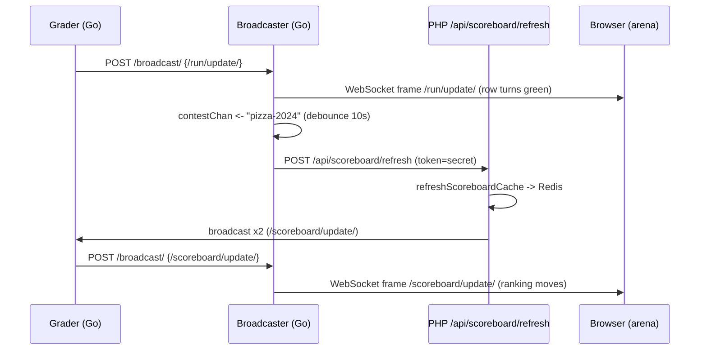

# Actualizaciones en tiempo real

Cuando estás sentado en la arena y tu presentación cambia de un "juzgar" giratorio a un **AC** verde, o el marcador se reorganiza en el instante en que un rival resuelve el problema C, nada de eso llegó porque tu navegador lo solicitó. Fue *enviado* a usted a través de un WebSocket que se mantuvo abierto desde que abrió la página del concurso. Eso es lo que significan "actualizaciones en tiempo real" en omegaUp: la arena es una vista en vivo de tres flujos de eventos: **ejecutar veredictos** (`/run/update/`), **cambios en el marcador** (`/scoreboard/update/`) y **aclaraciones** (`/clarification/update/`), entregados a medida que ocurren en lugar de hacerlo en un reloj de votación.

La maquinaria detrás de esto es el **broadcaster**, un pequeño servicio Go en el repositorio separado [`omegaup/quark`](https://github.com/omegaup/quark) (el mismo repositorio que el clasificador y el corredor, *no* el monorepo de PHP). Esta página es la vista de características y contratos: cómo se ven los eventos en el cable, cómo se comporta el cliente del navegador y cómo una sola carrera calificada se convierte en píxeles que se mueven en la pantalla de cada participante. Para conocer las entrañas del bucle de distribución, la coincidencia de filtros y el modelo de confianza de dos puertos, consulte [Arquitectura de emisora](../architecture/broadcaster.md): esta página se mantiene deliberadamente en el nivel de "qué obtengo y cómo lo consumo".

## El modelo mental de una frase

Una ejecución calificada en un concurso produce **dos** oleadas de actualizaciones y es útil tener ambas en la cabeza desde el principio:

1. Un **`/run/update/`** inmediato que el calificador publica en el momento en que termina de juzgar; esto es lo que hace que *tu propia* fila de envío se vuelva verde.
2. Un `/scoreboard/update/` **ligeramente posterior y antirrebote** que solo existe porque ese veredicto puede haber cambiado la *clasificación*, y la clasificación se calcula en PHP, no en Go, por lo que se necesita un viaje completo de ida y vuelta hasta el frontend y viceversa antes de llegar al navegador de todos.

Todo el flujo es `grader → /broadcast/ → (scoreboard? → /api/scoreboard/refresh → recompute → /broadcast/ again) → clients`. Todo lo que aparece a continuación completa ese arco.

## Los acontecimientos, tal como llegan realmente

El navegador abre exactamente un WebSocket y recibe todo tipo de eventos, distinguidos por un campo interno `message`. El marco que entrega el socket es una cadena JSON; el controlador del cliente en [`events_socket.ts`](https://github.com/omegaup/omegaup/blob/main/frontend/www/js/omegaup/arena/events_socket.ts) `JSON.parse` lo activa y se bifurca en `data.message`. Actualmente hay tres formas que sabe cómo manejar, y cualquier otra cosa se ignora silenciosamente.

### `/run/update/` — un veredicto cambiado

Nace en el clasificador ([`cmd/omegaup-grader/frontend_handler.go`](https://github.com/omegaup/quark/blob/main/cmd/omegaup-grader/frontend_handler.go), `broadcastRun`) en el instante en que una carrera termina de juzgar. El objeto `run` de la carga útil es el contrato de cable que consume la arena:

```json
{
  "message": "/run/update/",
  "run": {
    "username": "contestant1",
    "contest_alias": "pizza-2024",
    "problemset": 1234,
    "alias": "problem-c",       // the problem alias, NOT "problem_alias"
    "guid": "d41d8cd98f00b204e9800998ecf8427e",
    "status": "ready",           // always "ready" here; grading is finished
    "verdict": "AC",             // AC, PA, WA, TLE, OLE, MLE, RTE, RFE, CE, JE
    "score": 1.0,                // (0,1) fraction of cases passed
    "contest_score": 100.0,      // score scaled to the problem's contest points
    "runtime": 0.045,            // seconds
    "memory": 2048,              // bytes
    "penalty": -1,               // filled from the DB before sending
    "submit_delay": -1,          // minutes from problem-open to submit
    "language": "cpp17-gcc",
    "score_by_group": {}         // per-group scores, for group scoring modes
  }
}
```
Un caso extremo está integrado en la fuente y vale la pena conocerlo antes de confiar en `score`: si el modo de puntuación del problema es `all_or_nothing` y la puntuación es algo menor que un `1` perfecto, el calificador reescribe `score` y `contest_score` a `0` y `verdict` a `WA` *antes* de la transmisión, por lo que el crédito parcial nunca se filtra en una pantalla de todo o nada. El cliente, al ver `/run/update/`, convierte `run.time` de un conteo de segundos de Unix a la hora local y confirma la ejecución en la tienda Vuex a través de `updateRun`; ese enlace de tienda es lo que vuelve a pintar la fila.

### `/scoreboard/update/` — la clasificación cambió

Este *no* viene directamente del calificador. PHP lo emite al final de `\OmegaUp\Scoreboard::refreshScoreboardCache` ([`Scoreboard.php`](https://github.com/omegaup/omegaup/blob/main/frontend/server/src/Scoreboard.php)) después de volver a calcular la clasificación y se envía **dos veces** (una para los concursantes y otra para los administradores) porque las dos audiencias ven datos diferentes:

```json
{
  "message": "/scoreboard/update/",
  "scoreboard_type": "contestant",  // or "admin"
  "scoreboard": { /* the full types.Scoreboard object */ }
}
```
La copia `contestant` se transmite `public: true` para que todos los participantes del concurso la reciban; la copia de `admin` se transmite como `public: false`, por lo que solo los administradores lo hacen (el filtro por mensaje de la emisora ​​es lo que impone esa división; consulte la página de arquitectura). Al recibirlo, el cliente ejecuta `processRankings`, vuelve a derivar la clasificación y, debido a que la carga útil del marcador no incluye la serie histórica de puntos a lo largo del tiempo, activa una llamada de seguimiento a `api.Problemset.scoreboardEvents` para reconstruir el gráfico de clasificación. Entonces `/scoreboard/update/` es un *empujón que lleva las nuevas clasificaciones pero no el gráfico*; el gráfico se recupera perezosamente.

### `/clarification/update/` — una nueva pregunta o respuesta

Se entrega cuando se crea o responde una aclaración. El cliente marca `clarification.time` en la hora local y lo guarda en la tienda de aclaraciones, que lo muestra en la lista de aclaraciones de la arena:

```json
{
  "message": "/clarification/update/",
  "clarification": { /* the clarification object */ }
}
```
## El cliente del navegador: `EventsSocket`

Todo lo que hay en el lado del cliente reside en una clase, `EventsSocket` en [`events_socket.ts`](https://github.com/omegaup/omegaup/blob/main/frontend/www/js/omegaup/arena/events_socket.ts). Es Vue 2.7 + TypeScript (no hay un enlace API de composición `useEventStream`; la aplicación se ejecuta en Vue 2.7.16 y la migración a Vue 3 aún está en progreso). Comprender sus cuatro comportamientos es comprender toda la característica desde el lado del consumidor.

**Cómo se conecta.** La URL se construye a partir del propio protocolo y host de la página, más el *filtro* que dice lo que quieres escuchar:

```ts
const protocol = locationProtocol === 'https:' ? 'wss:' : 'ws:';
this.uri = `${protocol}//${host}/events/?filter=/problemset/${problemsetId}`;
if (this.scoreboardToken) {
  this.uri = this.uri.concat('/', this.scoreboardToken);  // public-scoreboard link
}
// ...
const socket = new WebSocket(this.uri, 'com.omegaup.events');
```
Dos cosas para notar. El subprotocolo siempre es `com.omegaup.events`: el `websocket.Upgrader` de la emisora ​​anuncia exactamente esa cadena, por lo que una discrepancia significa que no hay actualización. Y la "suscripción" *no* es un mensaje que envías después de conectarte; es el parámetro de consulta `filter`, resuelto una vez en el momento de la conexión. Un concursante registrado filtra en `/problemset/<id>`; alguien que sigue un enlace de marcador público agrega el token como `/problemset/<id>/<token>`, que es lo que permite a un visitante anónimo rastrear un concurso sin una sesión. No hay protocolo de enlace `{type:'auth', token}` ni protocolo `subscribe`/`unsubscribe` por canal: la autenticación se realiza en la cookie de sesión `ouat` (o un token API) ya adjunta a la conexión, y la autorización se decide una vez, por adelantado, mediante PHP.

**Cómo se mantiene vivo.** Una vez abierto, el cliente envía una cadena `"ping"` literal cada `intervalInMilliseconds` (predeterminado **5 minutos**, `5 * 60 * 1000`) como un keepalive. La emisora, por su parte, *descarta* todo lo que envía el cliente (su bucle de lectura existe solo para notar cuando se cierra el socket) y envía de forma independiente su propio marco de control WebSocket Ping cada `PingPeriod` (actualmente **30s**) para evitar que la conexión quede inactiva. Entonces, ambos extremos están pinchando el socket según sus propios temporizadores, por la misma razón: los servidores proxy eliminan los WebSockets inactivos.

**Cómo se recupera.** Si el socket se cierra mientras el cliente todavía lo quiere (`shouldRetry`), lo reintenta hasta `retries` veces (predeterminado **10**), cada intento se interrumpe hasta por `intervalInMilliseconds / 2` para que una reconexión masiva después de un reinicio de la emisora ​​no llegue como una manada atronadora. El estado aparece en la interfaz de usuario como uno de los tres glifos de la enumeración `SocketStatus`: `↻` en espera, `•` conectado, `✗` fallido, que es ese pequeño indicador vivo/muerto que quizás hayas visto en el encabezado de la arena.

**Cómo se degrada.** Este es el recurso de soporte de carga, y es por eso que la arena nunca simplemente *deja* de actualizarse. Si el socket no se puede establecer en absoluto, la promesa de `connect()` se rechaza y el cliente llama a `setupPolls()`, que cambia al sondeo HTTP simple: llama periódicamente a `api.Problemset.scoreboard` y `api.Problemset.scoreboardEvents` para obtener la clasificación y a `refreshContestClarifications` para obtener aclaraciones, todo en el mismo reloj `intervalInMilliseconds`. Cuando más tarde se vuelve a conectar un socket real, `onopen` borra esos intervalos de sondeo para que no esté haciendo ambas cosas. Dos casos omiten los sockets por completo y van directamente a este modo más silencioso: cuando se configura `disableSockets` y cuando `problemsetAlias === 'admin'`, el ámbito de administración no se controla deliberadamente por sockets.

## El modelo de suscripción es *filtros*, no canales

Es tentador pensar en `/problemset/1234` como un canal al que unirse. No lo es: no hay ningún estado del canal del lado del servidor. Su conexión incluye una lista de **predicados de filtro** y, para cada mensaje, el emisor pregunta "¿alguno de sus filtros coincide con este?" Las cinco formas de filtro son todas rutas de barra diagonal: `/all-events` (solo administradores: la manguera contra incendios), `/user/<username>` (sus eventos personales), `/problem/<alias>`, `/problemset/<id>[/<token>]` y `/contest/<alias>[/<token>]`.

La razón por la que el filtro del navegador puede ser burdo (`/problemset/<id>`) y aún así nunca ver la ejecución privada de otro concursante es que la coincidencia se realiza por mensaje en el servidor. Un mensaje de concurso te llega solo si es `Public`, o está dirigido a *tu* nombre de usuario, o si eres administrador de ese recurso. Entonces, un concursante sentado en `/problemset/1234` recibe las transmisiones públicas de `/scoreboard/update/` y su propio `/run/update/`, pero un evento privado dirigido a otra persona no cumple con todas las cláusulas y se omite. Los predicados coincidentes exactos se encuentran en la [página de arquitectura](../architecture/broadcaster.md#filters-how-one-message-finds-its-audience); lo que importa aquí es que el filtro que envías es una *solicitud*, y PHP decide si estás permitido.

!!! nota "La autorización se delega a la interfaz, a propósito"
    La emisora no tiene base de datos ni idea de quién es el administrador del concurso, por lo que no puede decidir por sí misma lo que usted puede escuchar. Cuando se conecta, `NewSubscriber` en la emisora ​​realiza una llamada de servidor a servidor a `/api/user/validateFilter/` (`\OmegaUp\Controllers\User::apiValidateFilter`), reenviando su cookie/token y su filtro solicitado. PHP devuelve quién es usted (su `user`, si es `admin` y sus alcances `problem_admin` / `contest_admin` / `problemset_admin`) o lanza `ForbiddenAccessException`, que la emisora ​​transmite como el *mismo* estado HTTP en la actualización para que el socket nunca se abra. Ese punto final intencionalmente **no** requiere autenticación, que es exactamente lo que permite que un poseedor anónimo de token de marcador lo siga.

## Seguimiento de un tramo graduado, de principio a fin

Supongamos que presenta el problema C en el concurso `pizza-2024`, el corredor lo ejecuta y el clasificador termina con `AC`. Aquí está todo el viaje, nombrando los saltos reales:

1. **El calificador publica un `/run/update/`.** `broadcastRun` crea un `broadcaster.Message` cuyos campos de nivel superior (`Contest`, `Problemset`, `User`, `Public`) son metadatos de enrutamiento y cuyo campo `Message` es la carga útil JSON *cadena* que se muestra arriba. Lo ENVÍA al punto final interno `/broadcast/` de la emisora ​​(puerto **32672**). Cuando el lado *PHP* quiere transmitir, en su lugar envía un PUBLICACIÓN a `OMEGAUP_GRADER_URL + /broadcast/` (`https://localhost:21680/broadcast/` predeterminado) y el clasificador lo reenvía, de modo que el clasificador siempre es el último salto hacia la emisora ​​y hay exactamente un ingreso.

2. **La emisora ​​lo distribuye.** El controlador `/broadcast/` pone en cola el mensaje en un canal almacenado en buffer (capacidad `ChannelLength`, actualmente solo **10**; si está lleno, el mensaje se *descarta* y la persona que llama recibe `503`, porque una actualización obsoleta en tiempo real no tiene valor), y el bucle único `Broadcaster.Run` lo entrega a cada suscriptor cuyo filtro coincida. El `onmessage` de su navegador analiza el `/run/update/` y vuelve a pintar su fila. Listo, para la actualización personal.

3. **Se activa el efecto secundario del marcador.** Inmediatamente después de ponerse en cola, el controlador se da cuenta de que se trata de un `/run/update/` para un concurso y coloca el alias del concurso en un `contestChan` interno. Eso alimenta un **antirrebote inicial y final** programado por concurso: la primera actualización activa una actualización inmediata *y* programa una actualización final `ScoreboardUpdateTimeout` (actualmente **10 segundos**) más tarde; cualquier ejecución adicional en esa ventana se fusiona en esa única actualización final. Por lo tanto, un último minuto frenético de una competencia actualiza el marcador como máximo una vez cada 10 segundos, no una vez por envío.

4. **La interfaz vuelve a calcular.** El bucle antirrebote se envía a `FrontendURL + api/scoreboard/refresh/` con `token = ScoreboardUpdateSecret` y `alias`. En el lado de PHP, `\OmegaUp\Controllers\Scoreboard::apiRefresh` ([`Scoreboard.php`](https://github.com/omegaup/omegaup/blob/main/frontend/server/src/Controllers/Scoreboard.php)) protege la primera línea: `if ($r['token'] !== OMEGAUP_GRADER_SECRET) throw new ForbiddenAccessException()`. El comentario allí es toda la historia de confianza: *esto nunca lo llaman los usuarios finales, sólo el servicio de calificación; Las sesiones regulares no se pueden usar porque caducan, por lo que un secreto previamente compartido otorga privilegios de nivel de administrador solo para esta llamada.* Maneja tanto los concursos (`ScoreboardParams::fromContest`) como las tareas del curso (`fromAssignment`), luego llama a `refreshScoreboardCache`.

5. **Se reconstruye el caché y el ciclo se cierra.** `refreshScoreboardCache` vuelve a calcular los marcadores de los concursantes y del administrador (más sus series de eventos) y los almacena en Redis a través de `\OmegaUp\Cache`, con la clave de `problemset_id`, con un tiempo de espera que expira cuando finaliza el concurso (`0` = se mantiene para siempre una vez finalizado el concurso). Luego llama a `\OmegaUp\Grader::getInstance()->broadcast(...)` dos veces (las cargas útiles de `/scoreboard/update/` descritas anteriormente) que viajan de regreso a través de `OMEGAUP_GRADER_URL/broadcast/`, a través del clasificador, al *mismo* despliegue de la emisora ​​y aterrizan en cada navegador coincidente. La serpiente se come la cola: una actualización de ejecución desencadenó un nuevo cálculo del marcador que produjo una transmisión del marcador.


!!! consejo "Si la emisora falla, no se pierde nada más que vitalidad"
    La emisora no tiene base de datos ni almacena nada en caché: es una distribución en memoria sin estado. Si se reinicia, cada `EventsSocket` simplemente se vuelve a conectar (con un retroceso nervioso) y la arena vuelve a estar completa. La única víctima son unos pocos segundos de actualizaciones automáticas, y el respaldo de las encuestas cubre incluso eso. Esta es la *por qué* el diseño puede darse el lujo de descartar mensajes bajo carga en lugar de bloquearlos: la corrección reside en MySQL y el caché del marcador de Redis, y el socket es solo un acelerador sobre las API HTTP.

## Documentación relacionada

- **[Arquitectura de emisora](../architecture/broadcaster.md)**: el modelo de confianza de dos puertos, los predicados de coincidencia de filtros y los aspectos internos del bucle de distribución.
- **[Grader Internals](../architecture/grader-internals.md)**: donde nacen los eventos `/run/update/`.
- **[The Arena](arena.md)**: la interfaz de usuario del concurso que consume estas transmisiones y la enumeración del veredicto.
- **[Notificaciones](../development/notifications.md)**: el sistema de notificación persistente e independiente (no es lo mismo que estos eventos de socket efímeros).
