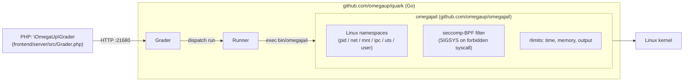

# Caja de arena

Cuando un concursante envía código, omegaUp tiene que compilarlo y ejecutarlo en cada caso de prueba en sus propias máquinas: el programa C, C++, Python, Java, C#, Rust o Karel de otra persona que no es de confianza, ejecutado a toda velocidad nativa. La zona de pruebas es lo que lo hace seguro: es la capa que permite al Runner ejecutar el `system("rm -rf /")` de un extraño y que no haga nada en absoluto.

El único hecho que debes arreglar en tu cabeza antes que nada: **nada de esto se encuentra en el monorepo de PHP.** Grep [`github.com/omegaup/omegaup`](https://github.com/omegaup/omegaup) para `minijail`, `sandbox` o `quark` y no obtendrás ningún resultado. El lado PHP (`\OmegaUp\Grader` en [`frontend/server/src/Grader.php`](https://github.com/omegaup/omegaup/blob/main/frontend/server/src/Grader.php)) solo PUBLICA un envío al Grader a través de HTTP en `OMEGAUP_GRADER_URL` (`https://localhost:21680` predeterminado) y luego se lava las manos. El sandbox es invocado por **Runner**, uno de los servicios de Go en [`github.com/omegaup/quark`](https://github.com/omegaup/quark), y Runner es, para reutilizar el modelo mental de la página [Runner internals](../architecture/runner-internals.md), **básicamente una bonita interfaz distribuida para Minijail.** Todo lo que aparece a continuación es la mitad del sandboxing de esa oración, desempaquetado.

## De dónde vino el sandbox: Moeval, Martin Mareš y ptrace

El sandbox original de omegaUp era *una versión muy modificada de Moeval*: el sandbox utilizado en el [IOI](https://ioinformatics.org/), escrito por Martin Mareš. En su primera encarnación, el sandbox era, en esencia, **un depurador**: usaba la llamada al sistema `ptrace` de Linux para detener el proceso del concursante cada vez que intentaba una llamada al sistema, inspeccionaba esa llamada al sistema para decidir si era inofensiva o peligrosa, y luego hacía una de tres cosas.

1. **Permita** que la llamada al sistema se realice normalmente: el caso común para `read`, `write`, `mmap` y el resto de la maquinaria aburrida que un programa necesita para realizar un trabajo útil.
2. **Reemplace** la llamada al sistema por una inofensiva y luego haga que el proceso *crea que la llamada falló*. El truco canónico consiste en cambiar la llamada al sistema solicitada por `getuid` (que es completamente inerte) y devolver un error a la persona que llama. Así es exactamente como el sandbox finge la ausencia de una red: **cada llamada a `socket` devuelve `-1`**, por lo que se le dice al programa, de manera plausible, que simplemente no tiene red, en lugar de ser eliminado y filtrar el hecho de que estaba siendo observado.
3. **Elimine** el proceso de plano, si la llamada al sistema es *MUY malvada*: algo sin ninguna razón legítima para aparecer en el programa de un concursante.

Vale la pena preservar como memoria institucional las modificaciones que convirtieron a Moeval en el Sandbox de omegaUp, las que *no* fueron upstream, porque cada una fue un requisito real que alguien cumplió:

- **Mangling de llamadas al sistema** (el comportamiento de reemplazar y fingir un error anterior).
- **Soporte multiproceso**, para que los envíos multiproceso se puedan rastrear correctamente.
- **Un modo detallado** para examinar exactamente qué llamadas al sistema realizó un programa: indispensable cuando el tiempo de ejecución de un nuevo lenguaje activa el filtro y necesitas ver qué le pidió realmente al núcleo.
- **Normalización de ruta**, por lo que el sandbox podría decir, por ejemplo, que `./` también se puede escribir, en lugar de reconocer solo una única ortografía canónica de una ruta.
- **Lectura de parámetros de un archivo**, para poder crear un *perfil por compilador/intérprete* en lugar de codificar límites en el propio entorno sandbox. Este es el antepasado de la configuración por idioma actual.
- Muchas, muchas, *muchas* pequeñas mejoras.
- Una versión de Moeval **que no usa `ptrace`**: genuinamente multiplataforma, pero mucho más débil en cuanto a seguridad y, por lo tanto, solo es una alternativa.

!!! nota "¿Por qué mantener la historia de ptrace si el mecanismo ha avanzado?"
    El diseño de interposición `ptrace` es el *linaje*, no la ruta activa actual (ver más abajo). Está documentado aquí a propósito: el truco de manipulación `setrlimit`-by-`getuid` y el comportamiento de "los sockets devuelven `-1`" son la explicación más clara posible de *lo que realmente está haciendo un sandbox de llamada al sistema*, y la implementación moderna resuelve los mismos problemas por diferentes medios. Si elimina esto a "intercepta llamadas al sistema", habrá eliminado el único párrafo que le dice a un nuevo mantenedor para qué sirve *la zona de pruebas.

## Lo que funciona hoy: omegajail encima de minijail

La zona de pruebas actual es [**omegajail**](https://github.com/omegaup/omegajail), el contenedor propio de omegaUp alrededor de la [minijail](https://google.github.io/minijail/) de Google, la misma minijail que se creó para los procesos de zona de pruebas en Chrome OS. En lugar de realizar un solo paso en el proceso con `ptrace`, omegajail se apoya en las primitivas de aislamiento del propio kernel: **espacios de nombres** de Linux (un PID privado, red, montaje, IPC, UTS y espacio de nombres de usuario, por lo que el programa no puede ver otros procesos, no tiene interfaz de red y obtiene una vista simplificada del sistema de archivos) más un filtro **seccomp-BPF** que el kernel aplica directamente, sin ningún rastreador en el bucle. Es por eso que todo es lo suficientemente rápido como para ejecutar miles de envíos.

El Corredor nunca habla directamente con la minicárcel. Se descompone en el binario `omegajail`, que está empaquetado con un sistema de archivos raíz autónomo y se envía como su propio artefacto; consulte [`Dockerfile.minijail`](https://github.com/omegaup/quark/blob/de2cea4456201a264060761acda4694cc79b45ca/Dockerfile.minijail), que es literalmente `FROM scratch` más `ADD bin/minijail-xenial-distrib-x86_64.tar.bz2 /`. En el lado Go, el contrato que todo sandbox debe cumplir es la interfaz `Sandbox` en [`runner/sandbox.go`](https://github.com/omegaup/quark/blob/de2cea4456201a264060761acda4694cc79b45ca/runner/sandbox.go#L108-L133) (tres métodos, `Supported()`, `Compile(...)` y `Run(...)`) y la implementación de producción es `OmegajailSandbox` ([sandbox.go#L135](https://github.com/omegaup/quark/blob/de2cea4456201a264060761acda4694cc79b45ca/runner/sandbox.go#L135)).

`OmegajailSandbox.Supported()` es un resumen que simplemente verifica si `bin/omegajail` existe bajo la *omegajail root*, que por defecto es `/var/lib/omegajail` ([`common/context.go#L210`](https://github.com/omegaup/quark/blob/de2cea4456201a264060761acda4694cc79b45ca/common/context.go#L210)) y se convierte en una ruta absoluta y se entrega a `NewOmegajailSandbox(omegajailRoot)` cuando se inicia Runner ([`cmd/omegaup-runner/main.go#L753`](https://github.com/omegaup/quark/blob/de2cea4456201a264060761acda4694cc79b45ca/cmd/omegaup-runner/main.go#L753)). Si omegajail no está instalado, `Supported()` devuelve false y Runner vuelve a la zona de pruebas no operativa descrita al final de esta página.


## Cómo el corredor invoca omegajail

Tanto `Compile` como `Run` crean un vector de argumentos y se lo entregan al asistente privado `invokeOmegajail` ([sandbox.go#L413](https://github.com/omegaup/quark/blob/de2cea4456201a264060761acda4694cc79b45ca/runner/sandbox.go#L413)), que antepone la ruta a `bin/omegajail`, configura `RUST_BACKTRACE=1` y `RUST_LOG=debug` en el entorno del niño (omegajail en sí está escrito en Rust) y captura el propio stderr del sandbox en un sidecar. archivo llamado `<errorFile>.omegajail` para que un fallo *en el carcelero* pueda diferenciarse de un fallo *en el código del concursante*.

Para una **ejecución**, las banderas se ensamblan en [`Run`](https://github.com/omegaup/quark/blob/de2cea4456201a264060761acda4694cc79b45ca/runner/sandbox.go#L321-L334) y se leen casi como un resumen del trabajo del sandbox:

```text
--homedir <chdir>            # the jailed working directory
-0 <inputFile>               # stdin  ← the test case's .in
-1 <outputFile>              # stdout → what we'll compare against .out
-2 <errorFile>               # stderr
-M <metaFile>                # where omegajail writes the .meta result (see below)
-m <bytes>                   # hard memory limit, in bytes
-t <ms>                      # CPU time limit, in milliseconds
-w <ms>                      # extra wall-clock time on top of the CPU limit
-O <bytes>                   # output limit, in bytes
--root <omegajailRoot>       # /var/lib/omegajail
--run <lang>                 # the language profile to load
--run-target <target>        # the compiled artifact to execute
```
Algunos de estos llevan reglas no obvias que se encuentran en el código, no en los nombres de las banderas:

- **El límite de memoria pasado a omegajail no es el límite de memoria del problema.** Es `base.Min(ctx.Config.Runner.HardMemoryLimit, limits.MemoryLimit)` ([sandbox.go#L319](https://github.com/omegaup/quark/blob/de2cea4456201a264060761acda4694cc79b45ca/runner/sandbox.go#L319)) — el límite estricto actualmente es **640 MiB** ([context.go#L208](https://github.com/omegaup/quark/blob/de2cea4456201a264060761acda4694cc79b45ca/common/context.go#L208), comentado en la fuente como *"640 MB deberían ser suficientes para cualquiera"*). La zona de pruebas aplica el menor de los dos, por lo que el autor de un problema no puede otorgar accidentalmente a un envío más RAM de la que la máquina está dispuesta a entregar.
- **Java obtiene un período de gracia.** Antes de calcular el límite de tiempo, `Run` hace `if lang == "java" { timeLimit += 1000 }`: un **+1000 ms** fijo para absorber el inicio de JVM, porque de lo contrario cada envío de Java consumiría todo su presupuesto para hacer despegar al intérprete.
- **`/dev/null` se intercambia silenciosamente.** Si el archivo de entrada fuera el `/dev/null` real, Runner sustituye un archivo vacío bajo la raíz omegajail (`root/dev/null`), porque el proceso encarcelado no tiene por qué tocar los nodos del dispositivo del host.
- **Los puntos de montaje adicionales se convierten en `--bind source:target`**, a menos que la zona de pruebas esté deshabilitada, en cuyo caso se convierten en enlaces simbólicos, porque no se puede vincular el montaje sin la zona de pruebas (esa rama es el manejo de `DisableSandboxing` en [sandbox.go#L335-L381](https://github.com/omegaup/quark/blob/de2cea4456201a264060761acda4694cc79b45ca/runner/sandbox.go#L335)).

Justo antes de invocar omegajail, `Run` calienta el caché de la página con un **precargador de entrada** ([sandbox.go#L23](https://github.com/omegaup/quark/blob/de2cea4456201a264060761acda4694cc79b45ca/runner/sandbox.go#L23)): `mmap` procesa el archivo de entrada y lo recorre una página a la vez, de modo que el programa del concursante pasa menos de su precioso límite de tiempo bloqueado en lecturas de disco para entradas que está garantizado tocar. Esta es una optimización de latencia pura: si el `mmap` falla, vuelve a leer el archivo completo en el `/dev/null` y continúa.

**Compilación** usa la misma maquinaria con un verbo diferente: `Compile` ([sandbox.go#L162](https://github.com/omegaup/quark/blob/de2cea4456201a264060761acda4694cc79b45ca/runner/sandbox.go#L162)) pasa `--compile <lang>`, `--compile-target` y un `--compile-source` por archivo de entrada, con el directorio de trabajo hecho escribible a través de `--homedir-writable`, y usa el presupuesto *compilar* en lugar del presupuesto *ejecutar*: **30 s** `CompileTimeLimit` y un `CompileOutputLimit` de **10 MiB** ([context.go#L206-L207](https://github.com/omegaup/quark/blob/de2cea4456201a264060761acda4694cc79b45ca/common/context.go#L206)). Aquí se manejan dos errores específicos del lenguaje en línea en lugar de en un paso de error separado: C# necesita un `*.runtimeconfig.json` vinculado simbólicamente al lado del código fuente antes de compilar, y para Java, si la compilación "tiene éxito" pero no aparece ningún archivo `<Target>.class`, el Runner reescribe el veredicto en `CE` y agrega la sugerencia legible por humanos *"Asegúrese de que su clase se llame `X` y esté fuera de todos paquetes"* — porque el error más común de Java es una clase empaquetada o con un nombre incorrecto.

## El archivo `.meta`: cómo una señal se convierte en veredicto

omegajail no emite un veredicto. Ejecuta el programa, impone los límites y escribe un pequeño **archivo `.meta`** delimitado por dos puntos que Runner analiza nuevamente en `parseMetaFile` ([sandbox.go#L504](https://github.com/omegaup/quark/blob/de2cea4456201a264060761acda4694cc79b45ca/runner/sandbox.go#L504)). Los campos reconocidos son `status` (código de salida), `time`, `time-sys`, `time-wall` (todos en microsegundos, divididos por `1e6` en segundos al entrar), `mem` (bytes) y, los interesantes, `signal` / `signal_number` y `syscall` / `syscall_number`.

Traducir esos metadatos sin procesar a uno de los [veredictos] de omegaUp (verdicts.md) es donde todo el modelo de seguridad del sandbox emerge como algo que un concursante ve:

| Lo que informó omegajail | Veredicto | Significado |
|---|---|---|
| `signal: SIGSYS` | **RFE** | *Error de función restringida*: el programa realizó una llamada al sistema prohibida y seccomp la descartó. Este es el equivalente moderno del antiguo camino de "matar" de ptrace. |
| `SIGILL`, `SIGABRT`, `SIGFPE`, `SIGKILL`, `SIGPIPE`, `SIGBUS`, `SIGSEGV` | **RTE** | Error de tiempo de ejecución: fallado, abortado, dividido por cero, segmentado. |
| `SIGALRM`, `SIGXCPU` | **TLE** | Se excedió el límite de tiempo: se activó la alarma de tiempo de CPU o la alarma del reloj de pared. |
| `SIGXFSZ` | **OLE** | Se excedió el límite de salida: el programa superó `-O`. |
| sin señal, `status == 0` | **OK** | Corrió hasta el final limpiamente (aún tiene que producir la respuesta correcta para convertirse en AC). |
| sin señal, estado distinto de cero | **RTE** | Salió con un código de falla. |

Además del mapeo de señales, `parseMetaFile` aplica dos correcciones que una tabla simple ocultaría. Si la memoria reportada excede el `MemoryLimit` del problema, el veredicto se anula a **MLE** y la memoria reportada se limita al límite, y para Java específicamente, una salida distinta de cero cuyo stderr contiene `java.lang.OutOfMemoryError` *también* se trata como MLE (`isJavaMLE`, [sandbox.go#L611](https://github.com/omegaup/quark/blob/de2cea4456201a264060761acda4694cc79b45ca/runner/sandbox.go#L611)), porque la JVM detecta el error de asignación y sale con gracia en lugar de obtener `SIGKILL`ed, por lo que la ruta basada en señal lo perdería. Y los programas Karel (`kj` / `kp`) asignan el estado de salida `1` (el modo de falla `INSTRUCTION` del intérprete) a **TLE**, ya que un programa Karel que alcanza su límite de instrucciones es moralmente un tiempo de espera.

## Límites de recursos: los números y dónde están predeterminados

Los límites que impone omegajail son el `LimitsSettings` del problema, sujeto por los duros techos del Runner. Los valores predeterminados enviados actualmente (todos mutables por problema, así que trátelos como *valores predeterminados*, no como leyes):

| Límite | Predeterminado | Fuente |
|---|---|---|
| Tiempo de CPU por caso | **1000 ms** | [`problemsettings.go#L191`](https://github.com/omegaup/quark/blob/de2cea4456201a264060761acda4694cc79b45ca/common/problemsettings.go#L191) |
| Memoria | **256 MB** | [`problemsettings.go#L188`](https://github.com/omegaup/quark/blob/de2cea4456201a264060761acda4694cc79b45ca/common/problemsettings.go#L188) |
| Salida | **10 KiB** | [`problemsettings.go#L189`](https://github.com/omegaup/quark/blob/de2cea4456201a264060761acda4694cc79b45ca/common/problemsettings.go#L189) |
| Tiempo total en la pared | **5 sexos** | [`problemsettings.go#L190`](https://github.com/omegaup/quark/blob/de2cea4456201a264060761acda4694cc79b45ca/common/problemsettings.go#L190) |
| Tiempo extra en la pared | **0** | [`problemsettings.go#L187`](https://github.com/omegaup/quark/blob/de2cea4456201a264060761acda4694cc79b45ca/common/problemsettings.go#L187) |
| Techo de memoria dura | **640 MB** | [`context.go#L208`](https://github.com/omegaup/quark/blob/de2cea4456201a264060761acda4694cc79b45ca/common/context.go#L208) |
| Tiempo de compilación | **30 segundos** | [`context.go#L206`](https://github.com/omegaup/quark/blob/de2cea4456201a264060761acda4694cc79b45ca/common/context.go#L206) |
| Compilar salida | **10 MB** | [`context.go#L206`](https://github.com/omegaup/quark/blob/de2cea4456201a264060761acda4694cc79b45ca/common/context.go#L206) |
| Producción global | **100 MB** | [`context.go#L209`](https://github.com/omegaup/quark/blob/de2cea4456201a264060761acda4694cc79b45ca/common/context.go#L209) |

Los valores predeterminados de nivel de corredor (`common/context.go`, alrededor de [L186](https://github.com/omegaup/quark/blob/de2cea4456201a264060761acda4694cc79b45ca/common/context.go#L186)) son más flexibles (un límite de tiempo de caso de **10 s** y un límite de memoria de **1 GiB**) porque son el sobre externo; las configuraciones por problema son las que realmente llegan a omegajail, siempre tomando el *mínimo* de los dos para que ningún problema pueda escalar más allá del techo de la máquina.

## La versión del kernel importa: el respaldo de SIGSYS

La detección de llamadas al sistema prohibidas de omegajail se basa en una característica del kernel que solo se volvió confiable en **Linux 5.13**. Para kernels más antiguos, `OmegajailSandbox` lleva un indicador `AllowSigsysFallback` ([sandbox.go#L140-L142](https://github.com/omegaup/quark/blob/de2cea4456201a264060761acda4694cc79b45ca/runner/sandbox.go#L140)) que, cuando se establece, agrega `--allow-sigsys-fallback` a la invocación para que omegajail vuelva a *la implementación anterior del detector sigsys*. Si está ejecutando Runner en un host anterior a 5.13 y los envíos de llamadas al sistema prohibidas están siendo mal evaluados, este es el interruptor que debe buscar, pero el respaldo existe precisamente porque es *peor* que el mecanismo actual, por lo que la solución correcta a largo plazo es un kernel más nuevo, no la bandera.

## Ejecutar sin una zona de pruebas: CI, cajas de desarrollo y no operación

No siempre se puede hacer una zona de pruebas. Los contenedores de integración continua, las computadoras portátiles de los desarrolladores y cualquier lugar donde los espacios de nombres de usuarios sin privilegios estén bloqueados simplemente no pueden ejecutar minijail. omegaUp maneja esto con dos trampillas de escape y vale la pena entender la diferencia:

- **`DisableSandboxing`** mantiene el `OmegajailSandbox` *real* (aún así compilas y ejecutas el código del concursante y obtienes veredictos honestos), pero le dice a omegajail que se ejecute sin jail (`--disable-sandboxing`) y cambia los montajes de enlace por enlaces simbólicos, ya que el montaje de enlace necesita la zona de pruebas. Esto es para cuando desea una calificación real pero el anfitrión no puede aislarlo.
- **`NoopSandbox`** ([`runner/noop_sandbox.go`](https://github.com/omegaup/quark/blob/de2cea4456201a264060761acda4694cc79b45ca/runner/noop_sandbox.go)) no hace *nada en absoluto*: crea archivos de salida/error/meta vacíos y devuelve `Verdict: "OK"`, y `NoopSandboxFixupResult` luego reescribe toda la ejecución en **AC** con una puntuación completa. Esto es estrictamente para probar la plomería *alrededor* de la ejecución (puesta en cola, envío, informe de resultados) sin ejecutar nada; nunca apunte a envíos reales, porque califica a todos como perfectos.

## Documentación relacionada

- [Runner Internals](../architecture/runner-internals.md): cómo un envío llega al entorno sandbox y el ciclo de compilación/ejecución/validación a su alrededor.
- [Grader Internals](../architecture/grader-internals.md): la cola y el despacho que alimentan al Runner.
- [Veredictos](verdicts.md): la enumeración completa del veredicto que produce el mapeo `.meta` (AC, PA, WA, TLE, MLE, OLE, RTE, RFE, CE, JE,…).
- [Seguridad](../architecture/security.md): donde se encuentra el sandbox en la defensa general de omegaUp en profundidad.
