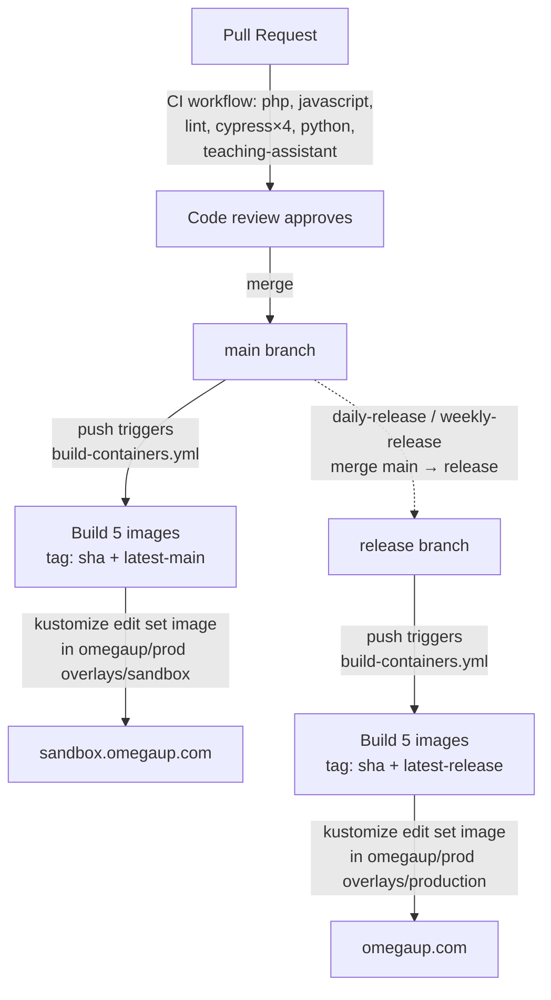

# Lanzamiento e implementación

Esta página rastrea la ruta exacta que toma un cambio desde una solicitud de extracción fusionada hasta su ejecución en [omegaup.com](https://omegaup.com): los flujos de trabajo de GitHub Actions que lo controlan y lo crean, las cinco imágenes de Docker que enviamos, las dos ramas de larga duración (`main` y `release`) que reemplazan a nuestros dos entornos y la transferencia de GitOps que finalmente transfiere las nuevas imágenes al clúster de Kubernetes. Todo aquí se encuentra en [`.github/workflows/`](https://github.com/omegaup/omegaup/tree/main/.github/workflows) y [`stuff/docker/`](https://github.com/omegaup/omegaup/tree/main/stuff/docker) en el repositorio [`omegaup/omegaup`](https://github.com/omegaup/omegaup); en caso de duda, lea el YAML, porque esa es la fuente de la verdad y esta página es solo el mapa.

!!! resumen "El modelo mental de un párrafo"
    Dos sucursales, dos ambientes. Al fusionar un PR en `main` se crean imágenes nuevas y se envían a **sandbox** ([sandbox.omegaup.com](https://sandbox.omegaup.com)). Luego, un trabajo programado avanza rápidamente esas mismas confirmaciones de `main` a `release`, lo que genera las imágenes idénticas nuevamente y las envía a **producción**. Nada se implementa copiando archivos en un servidor: un flujo de trabajo reescribe una etiqueta de imagen en el repositorio de manifiestos privado [`omegaup/prod`](https://github.com/omegaup/prod) y el clúster se reconcilia para coincidir. Entonces, "implementar" es en realidad "confirmar una nueva etiqueta de imagen" y una reversión es "confirmar la etiqueta anterior".

## Dos ramas son los dos entornos.

No etiquetamos versiones semánticas de la interfaz y se las entregamos a un equipo de operaciones. En cambio, dos ramas en el repositorio *son* la superficie de implementación, y todo su trabajo es reflejar lo que está activo actualmente:

- **`main`** contiene los últimos cambios aprobados por el equipo de revisión. Cada PR fusionado aterriza aquí, y cada aterrizaje se reconstruye y se vuelve a implementar **sandbox**. Sandbox está deliberadamente un paso por delante de la producción para que detectemos un cambio incorrecto en `sandbox.omegaup.com` antes de que los usuarios reales en `omegaup.com` lo vean; la frase del wiki es que sandbox "nos brinda un búfer en caso de errores en los últimos cambios", y ese búfer es precisamente la ventana en la que podemos revertir una confirmación en `main` antes de que se promocione.
- **`release`** refleja lo que se ejecuta en **producción**. Nunca fusionas un PR en `release` a mano; un flujo de trabajo programado fusiona `main` en él por usted (consulte [Promoción programada](#scheduled-promotion-to-production) a continuación). Debido a que `release` solo avanza absorbiendo confirmaciones ya revisadas y que ya están en el sandbox de `main`, la producción es, en esencia, un subconjunto estricto de lo que el sandbox ya ha sobrevivido.

Esta es la razón por la que nunca debes comprometerte directamente con `release`, y por qué el trabajo de promoción utiliza una fusión en lugar de un impulso forzado: `release` siempre debe ser un verdadero antepasado plus de `main`, nunca una historia divergente.

## Todo el camino, de principio a fin.

Aquí está el recorrido completo de una confirmación, que el resto de la página descomprime etapa por etapa:

## Etapa 1: la CI debe aprobarse antes de fusionarse

Antes de que un PR pueda fusionarse con `main`, debe estar verde en el flujo de trabajo [`CI`](https://github.com/omegaup/omegaup/blob/main/.github/workflows/ci.yml), que se ejecuta en cada `pull_request` y en cada `push` a `main` (y también se expone como un `workflow_call` reutilizable). Un grupo `concurrency` ingresado en el número PR cancela cualquier ejecución en vuelo cuando presiona una nueva confirmación, `cancel-in-progress: true`, para que nunca queme a los corredores al realizar una doble prueba de una revisión obsoleta.

CI no es una verificación sino una distribución de trabajos, y la puerta antes de todos ellos es `verify-action-hashes`: ejecuta [`./hack/gha-reversemap.sh verify-mapusage`](https://github.com/omegaup/omegaup/blob/main/hack/gha-reversemap.sh) para confirmar que cada acción de GitHub de terceros está anclada a un SHA de confirmación completa en lugar de una etiqueta mutable como `@v4`. Esa es una defensa de la cadena de suministro: una etiqueta puede redirigir al código malicioso que se encuentra debajo de usted, un SHA de 40 caracteres no puede, y es por eso que verá `actions/checkout@34e114876b0b11c390a56381ad16ebd13914f8d5` en todas partes en lugar de `@v4` en nuestros flujos de trabajo.

Los trabajos de prueba reales se ejecutan entonces en paralelo:

| Trabajo | Qué hace realmente | Pines y tiempos de espera notables |
|-----|-----------------------|--------------------------|
| **php** | Pruebas de controlador/lib de PHPUnit a través de [`./stuff/mysql_types.sh`](https://github.com/omegaup/omegaup/blob/main/stuff/mysql_types.sh), luego análisis estático de Psalm, luego carga de Codecov | Activa los contenedores de servicio `mysql:8.0.34` en el puerto **13306**, `redis` y `rabbitmq:3-management-alpine`; se ejecuta en **PHP 8.1** con cobertura APCu y XDebug habilitada; `timeout-minutes: 20` |
| **javascript** | `yarn test:coverage` (pruebas unitarias de Jest sobre los componentes de Vue/TS), luego carga de Codecov | **Nodo 20** con caché de hilo; `timeout-minutes: 10` |
| **pelusa** | `./stuff/lint.sh validate --all` dentro del contenedor `omegaup/hook_tools:v1.0.9`, más Psalm sobre el árbol PHP, más `./stuff/unused_translation_strings.py`, más una verificación de que `APITool.php --file api.py` todavía emite Python | Reutiliza la imagen fijada de hook_tools para que el linting local y CI coincidan byte por byte |
| **ciprés** | Pruebas de navegador de un extremo a otro, `cypress run --browser chrome`, fragmentadas en una matriz de 4 vías | `timeout-minutes: 25`; espera en `grader:21680` antes de comenzar (ver más abajo) |
| **pitón** | `pytest` sobre `stuff/` (los cronjobs, las herramientas de migración y los scripts de ayuda) dentro del contenedor `frontend` | `--timeout=20` por prueba |
| **asistente de enseñanza** | Ejercita al trabajador editorial de IA de un extremo a otro en modo curso y modo envío | Ejecuta el `teaching_assistant.py` real contra un campo preclasificado |

Vale la pena internalizar dos detalles en el trabajo de **php** porque son exactamente lo que se rompe cuando un PR toca el esquema. Primero, antes de ejecutar cualquier prueba, CI descarga el binario **Go gitserver** — `omegaup-gitserver.tar.xz` de [`omegaup/gitserver` lanzamiento `v1.9.13`](https://github.com/omegaup/gitserver/releases/tag/v1.9.13) — más `libinteractive.jar` `v2.0.27`, porque las pruebas PHP necesitan un gitserver activo para almacenar los repositorios git problemáticos. Este es un recordatorio concreto de que la pila de calificadores reside en *otros* repositorios ([`omegaup/quark`](https://github.com/omegaup/quark) para el calificador/corredor/locutor, [`omegaup/gitserver`](https://github.com/omegaup/gitserver) para el almacenamiento de problemas) y se consume aquí como artefactos de lanzamiento fijados, nunca creados a partir de este monorepo.

En segundo lugar, CI valida las migraciones de bases de datos *como migraciones*, no solo ejecutándolas: [`stuff/db-migrate.py validate`](https://github.com/omegaup/omegaup/blob/main/stuff/db-migrate.py) verifica los scripts en [`frontend/database/`](https://github.com/omegaup/omegaup/tree/main/frontend/database), luego `db-migrate.py migrate --databases=omegaup-test` los aplica a un MySQL nuevo y, finalmente, `stuff/policy-tool.py validate` y `stuff/database_schema.py validate` afirman que el esquema resultante coincide con la política registrada. Si agrega una columna pero olvida regenerar el esquema, este es el trabajo que falla, mucho antes de la producción.

!!! nota "Por qué Cypress espera en `grader:21680`"
    El paso e2e ejecuta `wait-for-it -t 30 grader:21680` antes de iniciar Chrome. El puerto **21680** es el punto final HTTP del clasificador (el mismo `OMEGAUP_GRADER_URL` predeterminado de `https://localhost:21680` que el cliente PHP `\OmegaUp\Grader` marca en producción). Una prueba de flujo de envío que comienza antes de que el evaluador esté escuchando fallaría, por lo que todo el fragmento de Cypress se bloqueará en ese puerto.

### Cypress se ejecuta en cuatro fragmentos

La suite Cypress se divide deliberadamente en una matriz `fail-fast: false` de cuatro fragmentos para que el costo del reloj de pared de ~25 minutos se pague en paralelo en lugar de en serie, y así una especificación inestable no cancela las demás:

| Fragmento | Nombre | Especificaciones |
|-------|------|-------|
| 1 | `contest-group` | `contest.cy.ts`, `problem_collection.cy.ts`, `group.cy.ts` |
| 2 | `courses` | `course_2Part.cy.ts`, `course.cy.ts`, `certificate.cy.ts`, `navigation.cy.ts` |
| 3 | `ide-basics` | `ide.cy.ts`, `basic_commands.cy.ts` |
| 4 | `problem-creator` | `problem_creator.cy.ts` |

En caso de falla, cada fragmento carga sus capturas de pantalla y videos como artefactos de ejecución (protegidos por `if: always() && hashFiles(...)`) y descarga `docker logs` para cada contenedor en ejecución en `frontend/tests/runfiles/containers/`, de modo que cuando una ejecución se vuelve roja, la evidencia ya está adjunta a la ejecución del flujo de trabajo y no es necesario reproducir localmente para ver lo que vio el navegador.

## Etapa 2: fusionar con `main` compila e implementa sandbox

En el momento en que su PR revisado se fusiona, el envío a `main` activa [`build-containers.yml`](https://github.com/omegaup/omegaup/blob/main/.github/workflows/build-containers.yml). Este es el flujo de trabajo que convierte el origen en artefactos que se pueden enviar. Se activa al presionar **tanto** `main` como `release`, y la rama en la que se activa decide a qué entorno se dirige: los mismos pasos de construcción, un objetivo de implementación diferente al final.

### Las cinco imágenes que construimos

El paso de compilación ejecuta `docker compose --file=docker-compose.k8s.yml build` con `DOCKER_BUILDKIT=1` y `TAG=${{ github.sha }}`, creando cinco servicios declarados en [`docker-compose.k8s.yml`](https://github.com/omegaup/omegaup/blob/main/docker-compose.k8s.yml). Cuatro de ellos son objetivos de etapa de una única etapa múltiple [`Dockerfile.frontend`](https://github.com/omegaup/omegaup/blob/main/stuff/docker/Dockerfile.frontend); el quinto tiene su propio Dockerfile:

| Imagen | Objetivo de construcción | Qué hay dentro y por qué |
|-------|--------------|------------------------|
| **`omegaup/php`** | Etapa `php`, `ubuntu:jammy` | El tiempo de ejecución de la aplicación: `php8.1-fpm` más `php8.1-{apcu,curl,gmp,mbstring,mysql,opcache,redis,xml,zip}`, el agente PHP New Relic, `openjdk-18-jre-headless` y `libinteractive.jar` (necesarios para problemas interactivos). Ejecuta `php-fpm8.1 --nodaemonize --force-stderr` en el puerto **9001**; `STOPSIGNAL SIGQUIT` para que php-fpm se drene correctamente en lugar de descartar las solicitudes en curso |
| **`omegaup/nginx`** | Etapa `nginx`, `ubuntu:jammy` | El servidor web que termina HTTP en el puerto **8001** y entrega solicitudes PHP al contenedor php-fpm |
| **`omegaup/frontend`** | Etapa `frontend`, `alpine:latest` | No es un servicio en ejecución: una imagen de datos delgada que lleva el `/opt/omegaup` *construido* (paquetes de paquetes web compilados, árbol de proveedores del `composer install --no-dev`, plantillas Twig precompiladas) y los `rsync` en su lugar para que los demás los sirvan |
| **`omegaup/frontend-sidecar`** | Etapa `frontend-sidecar`, `ubuntu:jammy` | Incluye `mysql-client-core-8.0`, `git` y los requisitos de Python: este es el módulo que ejecuta las migraciones de bases de datos y el mantenimiento junto con la aplicación |
| **`omegaup/ai-editorial-worker`** | [`Dockerfile.ai-editorial-worker`](https://github.com/omegaup/omegaup/blob/main/stuff/docker/Dockerfile.ai-editorial-worker) | El trabajador de Python que genera editoriales/comentarios de IA (el mismo código que ejercita el trabajo de CI `teaching-assistant`) |

El trabajo pesado ocurre en el escenario compartido `build`. Clona el repositorio en `--branch=${BRANCH}` (`release` predeterminado, anulado por ejecución por el `--build-arg BRANCH=<branch>`, el flujo de trabajo pasa), luego: construye el paquete reKarel (`npm install && npx gulp && npm run build` bajo `frontend/www/rekarel`), ejecuta `yarn build` para producir los activos de Webpack 5, ejecuta `composer install --no-dev --classmap-authoritative` para un cargador automático optimizado, escribe una producción `config.php` (`OMEGAUP_ENVIRONMENT = 'production'`, implementación de caché `none`, `TEMPLATE_CACHE_DIR = /var/lib/omegaup/templates`) y finalmente ejecuta [`CompileTemplatesCmd.php`](https://github.com/omegaup/omegaup/blob/main/frontend/server/cmd/CompileTemplatesCmd.php) para precompilar las plantillas Twig en `/var/lib/omegaup/templates`. La compilación de plantillas en el momento de la compilación es la razón por la que la producción nunca paga el costo de compilación de Twig en la primera solicitud después de una implementación.

### Cada imagen se etiqueta dos veces y se envía a dos registros

Después de la compilación, el flujo de trabajo inicia sesión en **ambos** registros y coloca cada una de las cinco imágenes bajo **dos** etiquetas:

- **`${{ github.sha }}`**: la etiqueta de confirmación exacta e inmutable. Este es el que realmente fijan las implementaciones, por lo que una implementación de producción determinada se puede rastrear hasta una confirmación específica y nunca puede desviarse silenciosamente.
- **`latest-<branch>`**: un puntero móvil (`latest-main` o `latest-release`) para humanos y herramientas que solo quieren "la versión más nueva de sandbox/prod".

Ambos conjuntos de etiquetas van a GitHub Container Registry (`ghcr.io/omegaup/...`, autenticado con el `github.token` de la ejecución) *y* a Docker Hub (`omegaup/...`, autenticado con los secretos `DOCKER_USERNAME` / `DOCKER_PASSWORD`). La publicación en dos registros es una redundancia intencionada: si uno está inactivo o tiene una velocidad limitada durante una implementación, el clúster aún puede extraer información del otro.

### GitOps: la implementación es una confirmación de `omegaup/prod`

Este es el paso que sorprende a la gente la primera vez: nada en este flujo de trabajo se conecta mediante SSH a un servidor ni reinicia un servicio. En cambio, en un `main`, el paso final (protegido por `if: github.ref == 'refs/heads/main'`) clona el repositorio de manifiestos privado [`omegaup/prod`](https://github.com/omegaup/prod), `cd` en `k8s/omegaup/overlays/sandbox/frontend` y ejecuta `kustomize edit set image` para reescribir las cinco referencias de imágenes a la nueva etiqueta `${{ github.sha }}`, parchea la Etiqueta `app.kubernetes.io/version` al mismo SHA, luego `git commit` + `git push` como `omegaup-bot`.

Ese compromiso es el despliegue. Un reconciliador de GitOps que observa `omegaup/prod` nota que el manifiesto cambió y realiza la implementación del espacio aislado a las nuevas imágenes. Para realizar el envío a producción, el paso *idéntico* se ejecuta detrás de `if: github.ref == 'refs/heads/release'` y edita `overlays/production/frontend` en lugar de `overlays/sandbox/frontend`. Las mismas cinco líneas `kustomize edit set image`, la misma fijación SHA, directorio de superposición diferente: ese único condicional es la diferencia completa entre "implementar en sandbox" e "implementar en producción".

## Promoción programada a producción

La producción no la implementa un ser humano haciendo clic en un botón. Dos flujos de trabajo programados promueven `main` a `release` y, una vez que `release` se mueve, [Stage 2](#stage-2-merge-to-main-builds-and-deploys-sandbox) hace el resto automáticamente:- [`daily-release.yml`](https://github.com/omegaup/omegaup/blob/main/.github/workflows/daily-release.yml) — `cron: '0 3 * * 0'`, es decir, **domingos a las 03:00 UTC (20:00 PT)**. A pesar del nombre, actualmente funciona semanalmente, no diariamente; el archivo incluso lleva un `TODO(#1624): Make this daily once we have better coverage of the frontend`, lo cual es una nota sincera de que todavía no confiamos lo suficiente en la suite automatizada como para promocionarla todos los días.
- [`weekly-release.yml`](https://github.com/omegaup/omegaup/blob/main/.github/workflows/weekly-release.yml) — `cron: '0 3 * * 1'`, es decir, **lunes a las 03:00 UTC (domingo a las 20:00 PT)**.

Ambos hacen lo mismo: conectan `POST` a la API GitHub `/repos/omegaup/omegaup/merges` con `{"base":"release","head":"main"}`, autenticados con el secreto `OMEGAUPBOT_RELEASE_TOKEN`, para fusionar `main` en `release`. Analizan la respuesta JSON y fallan si falta una confirmación `sha` o devuelve `merged: false`, por lo que una promoción fallida silenciosamente no puede hacerse pasar por un éxito. Ambos también pueden iniciarse fuera de banda a través de un `repository_dispatch` de tipo `daily-release` / `weekly-release` cuando alguien necesita cortar un lanzamiento fuera de lo programado.

Los dos flujos de trabajo difieren exactamente en una barrera, y es importante.

!!! advertencia "La publicación diaria se niega a enviar cambios de esquema"
    Antes de fusionarse, `daily-release.yml` ejecuta `git diff --quiet origin/release:frontend/database origin/main:frontend/database` y **anula la versión** si hay alguna diferencia. En términos sencillos: la ruta de lanzamiento rápida y frecuente no llevará a una migración de la base de datos a producción por sí sola. Los cambios de esquema se mantienen para la ruta `weekly-release` (que no tiene tal verificación), de modo que una migración llegue a producción con una cadencia predecible con humanos observando, en lugar de deslizarse en un cron diario automatizado. Esta es la razón por la que su PR que toca el esquema puede permanecer en la zona de pruebas durante varios días antes de llegar a `omegaup.com`.

!!! nota "Pausar todos los lanzamientos con `.pause-release`"
    Ambos flujos de trabajo primero verifican `git cat-file -e origin/main:.pause-release` y omiten la versión si ese archivo existe en `main`. Entonces, el interruptor de apagado para "no promocionar nada a producción en este momento" (durante un incidente, una congelación o una ventana defectuosa conocida) es simplemente confirmar un archivo llamado [`.pause-release`](https://github.com/omegaup/omegaup) en la raíz del repositorio. Bórralo para continuar. Sin ediciones de flujo de trabajo, sin rotación secreta, solo un archivo cuya mera presencia detiene el cron.

## Los servicios backend se lanzan según su propia cadencia

Todo lo anterior incluye la **interfaz** (la aplicación PHP/nginx/Vue). La pila de calificación es un código independiente con versiones independientes y puede leer sus versiones fijadas actuales directamente desde [`docker-compose.yml`](https://github.com/omegaup/omegaup/blob/main/docker-compose.yml):

| Servicio | Imagen (actualmente) | Repositorio fuente |
|---------|-------------------|-------------|
| Calificador | `omegaup/backend:v1.9.35` | [`omegaup/quark`](https://github.com/omegaup/quark) |
| Locutor | `omegaup/backend:v1.9.35` | [`omegaup/quark`](https://github.com/omegaup/quark) |
| Corredor | `omegaup/runner:v1.9.35` | [`omegaup/quark`](https://github.com/omegaup/quark) |
| Servidor Git | `omegaup/gitserver:v1.9.13` | [`omegaup/gitserver`](https://github.com/omegaup/gitserver) |

Estas son etiquetas de versión semántica fijadas, eliminadas deliberadamente cuando se corta una nueva versión de calificador/corredor en `omegaup/quark`; no se reconstruyen en cada combinación de interfaz como lo son las cinco imágenes de la aplicación. La interfaz llega al evaluador a través de HTTP en `OMEGAUP_GRADER_URL` (`https://localhost:21680` predeterminado), por lo que una implementación de la interfaz y una implementación del clasificador son eventos genuinamente independientes. Cuando se diagnostica un problema de producción, esta separación es importante: un veredicto de envío roto es muy probable que sea un problema de backend de `v1.9.35` en `omegaup/quark`, mientras que una representación de página rota es un problema de imagen de frontend en este repositorio.

## Retroceder

Debido a que una implementación es solo una confirmación que fija una imagen SHA en `omegaup/prod`, una reversión es el mismo movimiento a la inversa: apunte el manifiesto a la etiqueta `${{ github.sha }}` anterior en buen estado y deje que el clúster se reconcilie. Cada compilación histórica todavía se encuentra en ambos registros bajo su SHA de confirmación inmutable, por lo que siempre hay una etiqueta concreta a la que retroceder *a*: nunca se reconstruye para recuperar, solo se vuelve a fijar.

Esto es exactamente lo que el "buffer" del sandbox nos ofrece en la práctica. Debido a que `main`/sandbox siempre se ejecuta por delante de `release`/producción, una regresión generalmente aparece primero en `sandbox.omegaup.com`, y revertir el compromiso infractor en `main` (que reconstruye el sandbox) evita que se promueva a `release` en la siguiente ventana programada. La reversión más barata es aquella en la que el cambio incorrecto nunca llega a producción porque el sandbox lo detectó y `.pause-release` ganó tiempo.

!!! peligro "Las migraciones de bases de datos son lo único que no se puede revertir trivialmente"
    Las reversiones de imágenes son económicas y totales; los cambios de esquema no lo son. Esta es la única razón por la que `daily-release.yml` separa a `frontend/database` del camino automatizado. Escriba las migraciones para que sean compatibles con versiones anteriores (la imagen anterior debe poder ejecutarse con el nuevo esquema), de modo que revertir la *imagen* no requiera revertir el *esquema*. Si alguna vez necesita revertir una migración, se trata de una operación deliberada realizada por humanos contra la base de datos, no algo que una reversión manifiesta haga por usted.

## Documentación relacionada

- **[Monitoreo](monitoring.md)**: New Relic, Prometheus y las métricas que se deben observar después de una implementación
- **[Solución de problemas](troubleshooting.md)**: fallos comunes y cómo leer los registros
- **[Configuración de Docker](docker-setup.md)**: la pila `docker-compose.yml` local refleja estas imágenes
- **[Pruebas](../development/testing.md)**: los conjuntos de pruebas que controlan cada fusión en la Etapa 1
