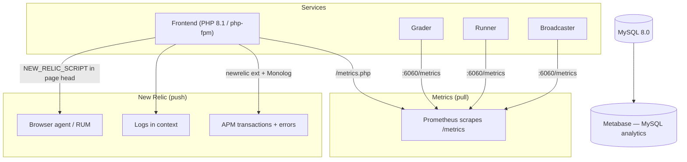

# Monitoreo

omegaUp no es un programa, sino una flota de ellos: la interfaz PHP detrás de nginx, el evaluador Go, sus ejecutores, el transmisor y gitserver, todos hablando con MySQL, Redis y RabbitMQ. Cuando se realiza un concurso y unos cuantos miles de personas se enfrentan a los mismos tres problemas, "¿está bien el sitio?" deja de ser una pregunta de sí/no y se convierte en "¿la cola se está agotando, los corredores están vivos y algún método API arroja de repente 500?" Esa es la pregunta que la pila de observabilidad debe responder, y la responde con un pequeño y deliberadamente aburrido conjunto de herramientas: **Prometheus** para los números, **New Relic** para seguimientos, errores y registros en contexto, y **Metabase** para análisis de datos y productos posteriores a los hechos. Las implementaciones en sí son supervisadas por **Argo CD**, que concilia lo que realmente se está ejecutando en el clúster de Kubernetes con lo que Git dice que debería estar ejecutándose.

Nada aquí es exótico a propósito. Cada servicio publica texto plano de Prometheus en un punto final `/metrics`, cada solicitud PHP enriquece una transacción New Relic si el agente está presente y silenciosamente no hace nada si no lo está, y todo se degrada a "todavía funciona, simplemente a ciegas" en un contenedor de desarrollo donde ninguno de los agentes está instalado.

## Descripción general

La división importante que debes tener en cuenta: **Prometheus tira, New Relic empuja.** Prometheus extiende la mano y raspa un punto final que expones; El agente PHP de New Relic y el enriquecedor Monolog envían datos desde el interior de la solicitud. Es por eso que una caja con firewall o sin agente todavía produce métricas de Prometheus (siempre que el raspador pueda alcanzarlas) pero no produce ningún dato de New Relic.

## Prometeo: los números

### La interfaz PHP

La integración de Prometheus en la interfaz es un único contenedor pequeño, `\OmegaUp\Metrics` en `frontend/server/src/Metrics.php`, construido en el cliente `promphp/prometheus_client_php` (actualmente anclado a `^v2.4.0` en `composer.json`). En la construcción, elige un adaptador de almacenamiento en función de si APCu está disponible: `\Prometheus\Storage\APC` en producción (para que los contadores sobrevivan a través de las solicitudes en la memoria compartida del grupo de trabajadores php-fpm) y `\Prometheus\Storage\InMemory` como respaldo, que restablece cada solicitud y en realidad solo es útil en las pruebas. Esa elección es importante: si falta APCu, sus contadores se reinician silenciosamente con cada solicitud y sus tarifas parecen ruido.

Hay exactamente un lugar donde se escriben las métricas de las aplicaciones hoy en día, y es el propio embudo de solicitudes. `\OmegaUp\ApiCaller::call()` (`frontend/server/src/ApiCaller.php`) llama a `\OmegaUp\Metrics::getInstance()->apiStatus($methodName, $status)` dos veces: una vez en la ruta de éxito con el estado `200` y otra en la ruta de error con el código HTTP de excepción de API real. Cada llamada hace saltar dos contadores:

- `frontend_api_request_status_count{api, status}`: un contador codificado por el nombre del método API (por ejemplo, `/api/run/create/` aparece como método) **y** el código de estado resultante, por lo que puede preguntar "cuántos 401 lanzó `run.create` en los últimos cinco minutos" con un solo `rate()`.
- `frontend_api_request_total{api}`: lo mismo sin la etiqueta de estado, es decir, el total de llamadas por método, que es el denominador cuando desea una *proporción* de error en lugar de un *recuento* de error.

Esos dos son suficientes para calcular las dos señales que realmente predicen una interrupción: la tasa de solicitudes por punto final y la fracción de ellas que no son `200`. Hoy en día, no existe un histograma de latencia por punto final en el lado de PHP: la latencia reside en New Relic (ver más abajo), porque ahí es donde también se obtiene el gráfico de llamas para explicar *por qué* una llamada fue lenta, algo que un simple número de Prometheus no puede brindarle.

Prometheus raspa la interfaz en `frontend/www/metrics.php`, que es tan delgada como una página: requiere `bootstrap.php` y llama a `\OmegaUp\Metrics::getInstance()->render()`. `render()` configura `Content-type: text/plain` (a través de `\Prometheus\RenderTextFormat::MIME_TYPE`) y repite el formato de exposición. Apunte un trabajo de raspado a ese camino y listo.

### El calificador

El evaluador es el componente que realmente miras fijamente durante un concurso y es el más instrumentado. Sus métricas se encuentran en el repositorio Go `omegaup/quark` en `cmd/omegaup-grader/metrics.go`, servido por `promhttp.Handler()` en un puerto dedicado: `Metrics.Port`, cuyo valor predeterminado es `6060` (consulte `MetricsConfig` en `common/context.go`). Todo tiene el espacio de nombres `quark` con el subsistema `grader`, por lo que los nombres de los cables dicen `quark_grader_*`.

Los medidores de colas son el corazón de esto, y hay uno por nivel de prioridad porque el calificador mantiene colas separadas en lugar de una grande:

| Métrica | Lo que te dice |
|--------|-------------------|
| `quark_grader_queue_total_length` | Todo esperando, en todas las colas. El número único para alertar. |
| `quark_grader_queue_high_length` | Trabajo pendiente de alta prioridad: presentaciones interactivas/de concursos que la gente está mirando. |
| `quark_grader_queue_normal_length` | Atrasos de prioridad normal. |
| `quark_grader_queue_low_length` | Trabajos pendientes de baja prioridad (rejuicios y otros trabajos masivos que no deben privar a las colas en vivo). |
| `quark_grader_queue_ephemeral_length` | La cola efímera, utilizada por las ejecuciones scratch de "ejecutar esto en la arena" que nunca tocan la base de datos. |

Junto con cada cola hay un resumen, `quark_grader_queue_delay_seconds` (y el `quark_grader_queue_{high,normal,low,ephemeral}_delay_seconds` por nivel), que mide cuánto tiempo permaneció una carrera en una cola antes de que un corredor la retomara. Estos se exportan con objetivos cuantiles `0.5`, `0.9` y `0.99` (los objetivos `{0.5: 0.05, 0.9: 0.01, 0.99: 0.001}` en el código), por lo que `quark_grader_queue_delay_seconds{quantile="0.99"}` es su espera p99: el número honesto de "qué tan malo es para el remitente más desafortunado en este momento", que es exactamente el que importa cuando la longitud de una cola se ve bien en promedio, pero algunos envíos están atrapados detrás de un problema lento.

El rendimiento y el estado provienen de contadores y un vector de calibre:

- `quark_grader_runs_total`: cada ejecución calificada. Su `rate()` son sus envíos por segundo.
- `quark_grader_ephemeral_runs_total`, `quark_grader_ci_jobs_total`: las variantes de ejecución temporal y de CI problemático, contadas por separado para que la actividad de CI masiva no se haga pasar por una carga de concurso.
- `quark_grader_runs_retry`, `quark_grader_runs_abandoned`: se vuelve a intentar una carrera cuando su corredor desaparece a mitad de camino; se *abandona* cuando volver a intentarlo no ayuda. Un `runs_abandoned` en aumento es la métrica que dice que "las ejecuciones se están eliminando silenciosamente", lo cual es mucho peor que una cola lenta.
- `quark_grader_runs_je`: ejecuciones que terminaron en un veredicto `JE` (error de juez). Esto debería ser fijo en cero; cualquier pendiente significa que el nivelador en sí está roto, no el código enviado.
- `quark_grader_runner_up{runner_hostname, runner_public_ip}`: un indicador configurado en `1` para cada corredor del que la niveladora ha tenido noticias recientemente. El evaluador considera que un corredor está vivo sólo si se ha registrado dentro de los últimos 3 minutos (el límite de `-3 * time.Minute` en `gaugesUpdate`); una vez que un corredor se vuelve obsoleto, todo el vector es `Reset()` y se vuelve a llenar, por lo que un corredor que muere simplemente desaparece de la serie. Sumar este indicador te da el conteo de corredores en vivo, y verlo caer es cómo atrapas a un corredor anfitrión cayendo antes de que la cola retroceda visiblemente.

La clasificadora también exporta datos vitales del host como `os_cpu_load1` / `os_cpu_load5` / `os_cpu_load15`, `os_mem_total` / `os_mem_used` y `os_disk_total` / `os_disk_used`, actualizados una vez por minuto mediante un ticker en `gaugesUpdate()` (a través de `load`, `mem` y `load` de `gopsutil` y ayudantes de `disk`). `disk_used` ascendiendo hacia `disk_total` es el clásico asesino silencioso de niveladoras: la caja se llena con entradas de problemas y paradas de nivelación, por lo que gana su propio indicador.

Un punto final adicional que vale la pena conocer: junto con `/metrics`, el clasificador sirve `/metrics/runners`, que devuelve una lista JSON de los corredores actualmente vivos en forma de **descubrimiento de servicio de archivos** de Prometheus (`targets` + `labels`, nuevamente usando el límite de frescura de 3 minutos). Así es como Prometheus aprende qué cajas de corredores eliminar sin que nadie edite manualmente una lista de objetivos cada vez que la flota de corredores aumenta o disminuye.

### El corredor y el locutor

Cada corredor expone su propio `/metrics` (mismo espacio de nombres `quark`, subsistema `runner`). Las series que soportan carga son `quark_runner_validator_errors` (un conteo creciente aquí significa que los validadores personalizados están fallando, lo que silenciosamente convierte los envíos correctos en veredictos incorrectos) además de una familia de medidores `quark_benchmark_*` (`io_time`, `cpu_time`, `memory_time` y sus compañeros `_wall_time` / `_memory`) que registran cómo se desempeña la caja frente a un punto de referencia conocido, para que pueda distinguir un verdadero corredor sobrecargado de uno que acaba de tener un problema grave. También informa los mismos signos vitales del host `os_*` que el clasificador.

La emisora, el servicio que los fanáticos transmiten eventos a los navegadores a través de SSE y WebSockets, exporta (subsistema `broadcaster`): `broadcaster_websockets_count` y `broadcaster_sse_count` (conexiones actualmente abiertas de cada tipo), `broadcaster_messages_total` (mensajes enviados) y `broadcaster_channel_drop_total`. Esta última es la alarma: una escritura de canal caída significa que un cliente fue demasiado lento para mantener el ritmo y se cortó, por lo que el `channel_drop_total` que sube durante un concurso significa que las personas se están perdiendo las actualizaciones del marcador en vivo. La latencia de envío y procesamiento provienen de los resúmenes `broadcaster_dispatch_latency_seconds` y `broadcaster_process_latency_seconds`.

Cada servicio Go también emite un contador `build_info` que lleva etiquetas constantes `version` y `go_version`, que existe únicamente para que pueda confirmar desde Prometheus qué versión binaria se está ejecutando realmente en cada host después de una implementación, lo cual es útil cuando una implementación se aplica a medias y la mitad de los corredores están en la versión anterior.

## El estado de la cola de aplicaciones

Prometheus es la visión del operador. Hay una segunda ruta de estado separada destinada a la propia aplicación. `\OmegaUp\Grader::status()` en `frontend/server/src/Grader.php` emite una solicitud `curl` a `OMEGAUP_GRADER_URL . '/grader/status/'` (con `OMEGAUP_GRADER_URL` predeterminado en `https://localhost:21680`) y recupera un pequeño blob JSON: `run_queue_length`, `runner_queue_length`, `runners`, `broadcaster_sockets` y `embedded_runner`. emergió a través de `\OmegaUp\Controllers\Grader::apiStatus()`. Esto es lo que muestra el pequeño indicador de cola dentro del sitio, no lo que Prometheus raspa. En un entorno de desarrollo donde está configurado `OMEGAUP_GRADER_FAKE`, `status()` hace un cortocircuito y devuelve una estructura de todos ceros para que la interfaz de usuario no genere errores cuando no hay un calificador real detrás. No utilice esto para crear paneles: es una instantánea de un momento determinado sin historial; para eso está el raspado `/metrics`.

## New Relic: rastros, errores y registros en contexto

Donde Prometeo te dice *que* algo va lento o falla, New Relic te dice *qué línea* y *para quién*. La integración tiene tres puntas, y las tres están escritas para no funcionar cuando el agente no está instalado, porque los contenedores de desarrollo no incluyen la extensión PHP `newrelic` y nadie quiere que la aplicación se rompa allí.

**Nombramiento de transacciones.** `\OmegaUp\Request` llama a `\OmegaUp\NewRelicHelper::nameTransaction("/api/{$this->methodName}")` para que cada llamada API aparezca en New Relic con su propio nombre (`run.create`, `contest.details`, etc.) en lugar de que todo colapse en una transacción `index.php` anónima. Sin esto, la latencia de APM es inútil porque no se puede saber qué punto final es el lento.**Informe de errores.** Cuando `ApiCaller::call()` detecta una excepción que de otro modo no habría manejado, la enruta a través de `\OmegaUp\NewRelicHelper::noticeError()`, que la reenvía a `newrelic_notice_error()`, pero solo después de que `isAvailable()` confirme que la extensión está cargada y que las funciones existen. `NewRelicHelper` (`frontend/server/src/NewRelicHelper.php`) es la costura completa: `noticeError`, `nameTransaction`, `addCustomAttribute` y un `getStatus()` al que puede llamar para depurar si el agente está conectado. Cada método protege primero el `extension_loaded('newrelic')`, razón por la cual el mismo código funciona bien en una computadora portátil sin agente.

**Registra en contexto.** El registrador raíz se configura una vez en `frontend/server/bootstrap.php`. Construye un Monolog `Logger` llamado `omegaup` escribiendo en `OMEGAUP_LOG_FILE` (`/var/log/omegaup/omegaup.log` predeterminado) en el nivel `OMEGAUP_LOG_LEVEL` (`info` predeterminado), y aquí está la parte inteligente: si `\NewRelic\Monolog\Enricher\Formatter` existe (del paquete `newrelic/monolog-enricher`), usa ese formateador e inserta un `\NewRelic\Monolog\Enricher\Processor` en el maderero; de lo contrario, vuelve a ser un `\Monolog\Formatter\LineFormatter` simple. El enriquecedor sella cada línea de registro con los ID de entidad/rastreo de New Relic, que es lo que le permite pasar de una transacción lenta directamente a las líneas de registro exactas que emitió la solicitud. Siempre se agrega un `\Monolog\Processor\WebProcessor` (URL de solicitud, método, IP) y `\Monolog\ErrorHandler::register()` conecta los propios errores de PHP al mismo registrador para que un fatal no escape sin registrarse.

**Agente de navegador (RUM).** La interfaz también puede inyectar el script del navegador de New Relic en el encabezado de la página. El Twig shell `frontend/templates/template.tpl` emite `{{ NEW_RELIC_SCRIPT|raw }}` dentro de ``, por lo que el monitoreo de usuario real solo se activa cuando se establece el valor de configuración de `NEW_RELIC_SCRIPT` (el valor predeterminado es `null`, es decir, desactivado, en `config.default.php`, junto con `NEW_RELIC_SCRIPT_HASH`, que existe para que el script en línea pueda incluirse en la lista de permitidos en el Contenido-Seguridad-Política sin debilitarla). Esto es lo que captura el tiempo real de carga de la página desde navegadores reales en lugar de solo el tiempo del lado del servidor.

## Metabase y CD Argo

Dos herramientas más completan el panorama, y ambas se nombran en las notas operativas de omegaUp en lugar de en el código base, porque observan el sistema desde el exterior.

**Metabase** es la capa de informes y análisis de datos. Se conecta al MySQL de producción y permite a las personas crear consultas y paneles de control sin tener que escribir SQL a mano; las preguntas que responde son preguntas sobre productos ("cuántos usuarios resolvieron al menos un problema este mes") en lugar de preguntas operativas ("¿se está agotando la cola?"). Históricamente ha sido el más inestable del grupo; si muestra un error de conexión, es que el enlace de Metabase a la base de datos está inactivo, no el sitio en sí, y el sitio está completamente bien sin él.

**Argo CD** observa las implementaciones en lugar del tráfico. Es el controlador de entrega continua para el clúster de Kubernetes y trata a Git como la única fuente de verdad: compara continuamente el estado deseado declarado en el repositorio de implementación con lo que realmente se está ejecutando en el clúster y marca (o concilia) cualquier desviación. Cuando quiera saber "si mi cambio realmente se implementó y si cada réplica está en la nueva versión", el estado de sincronización de Argo CD es el primer lugar para buscar, y se combina naturalmente con la métrica `build_info` anterior, que confirma lo mismo de la propia boca del binario en ejecución.

## Un ejemplo resuelto: "los envíos se sienten lentos"

El objetivo de tener estas herramientas es que un informe vago se resuelve en una causa específica en un par de consultas. Cuando alguien dice que los envíos son lentos durante un concurso, recorra la cadena en orden de dependencia:

1. **¿La cola realmente tiene una copia de seguridad?** Mire el `quark_grader_queue_total_length` y el `quark_grader_queue_high_length` por nivel. Si el total es bajo y estable, el evaluador se mantiene al día y el problema está en otra parte (frontend, red). Si está subiendo, continúa.
2. **¿Están desapareciendo corredores?** Suma `quark_grader_runner_up`. Una caída aquí (un host corredor que dejó de registrarse dentro de su ventana de 3 minutos) significa menos capacidad de calificación y la cola crecerá sin importar qué tan saludable esté el evaluador. Verifique con Argo CD para ver si un mal lanzamiento derribó a los corredores.
3. **¿Es un solo problema el culpable?** Compare `quark_grader_queue_delay_seconds{quantile="0.99"}` con la mediana. Un p99 enorme con un p50 normal significa que la mayoría de las ejecuciones están bien, pero algunas están atrapadas detrás de un problema costoso, no una escasez general de capacidad.
4. **¿La propia niveladora tiene errores en lugar de ser simplemente lenta?** Mire `quark_grader_runs_retry` y especialmente `quark_grader_runs_abandoned` y `quark_grader_runs_je`. Cualquier pendiente en abandono o JE significa que las carreras se están abandonando o que el juez está infringido: un incidente de corrección, no de rendimiento.
5. **¿O es la interfaz, no el calificador en absoluto?** De vuelta en el lado de PHP, `rate(frontend_api_request_status_count{api="run.create", status!="200"}[5m])` sobre `rate(frontend_api_request_total{api="run.create"}[5m])` proporciona la proporción de errores para los envíos, y la transacción `run.create` de New Relic (llamada así exactamente por esta razón) muestra si el tiempo está entrando en MySQL, la llamada HTTP del calificador o el propio PHP, con las líneas de registro enriquecidas de esa solicitud a un clic de distancia.

## Una nota sobre los nombres de host

Los paneles, la cuenta de New Relic, la instancia de Metabase y la consola de Argo CD se encuentran detrás de URL privadas y autenticadas que no se publican aquí a propósito. Si necesita acceso, se trata de una conversación sobre credenciales y permisos con el equipo de mantenimiento, no de un enlace que se pega en un navegador.

## Documentación relacionada

- **[Solución de problemas](troubleshooting.md)**: convertir un síntoma en una solución
- **[Infraestructura](../architecture/infrastructure.md)**: cómo encajan los servicios
- **[Implementación](deployment.md)** — con qué se está reconciliando Argo CD
