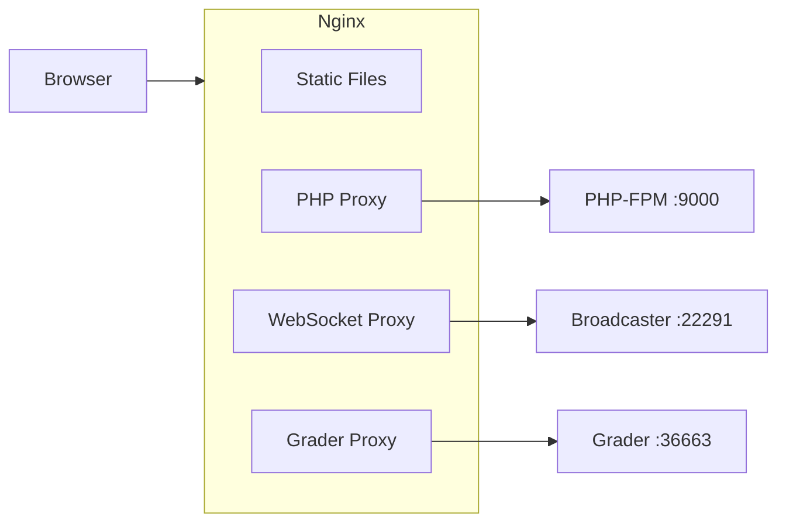

# Configuración de Nginx

nginx es la única puerta de entrada a omegaUp. Cada solicitud que realiza un navegador: una página
carga, llega una llamada `/api/`, un WebSocket para eventos del marcador en vivo, una imagen problemática
primero en nginx, y nginx decide una de tres cosas: entregar el archivo directamente desde el disco,
entréguelo a php-fpm a través de FastCGI, o realice un proxy inverso a uno de los servicios backend de Go.
Aquí no hay ninguna lógica de aplicación; nginx es deliberadamente tonto. Todo su trabajo es enrutar
y almacenamiento en caché, y la parte interesante es _por qué existe cada ruta_, porque la mayoría de ellas
Codifica una decisión tomada hace años que es fácil de romper si no sabes el motivo.

Los dos archivos que importan son `stuff/docker/etc/nginx/nginx.conf` (el bloque del servidor, el
php-fpm upstream, los dos proxies) y `frontend/server/nginx.rewrites` (el `/api/`
embudo, cada URL bonita y los encabezados de caché). El `.conf` `include`s el `.rewrites`
archivo en la parte inferior del bloque `server`, así que léalos como un solo documento.

## Los tres tipos de tráfico


Archivos estáticos (los paquetes Webpack en `/dist/`, `/third_party/`, `/css`, `/js/`,
imágenes) nunca toque PHP: nginx las lee en `/opt/omegaup/frontend/www` y devuelve
ellos directamente, que es el objetivo de poner nginx delante de un interpretado
idioma. Todo lo que termine en `.php` y todo lo que esté bajo `/api/` (que se _reescribe_
a un archivo `.php`, ver más abajo), va a php-fpm en `127.0.0.1:9000`. Los dos longevos,
cosas con estado: la transmisión WebSocket en `/events/` y la red efímera del calificador
interfaz en `/grader/`: obtenga proxy a los servicios backend de Go separados, porque PHP
detrás de FastCGI no tiene por qué mantener un socket abierto durante la duración de un concurso.

## El bloque del servidor de desarrollo

La configuración de desarrollo reside en `stuff/docker/etc/nginx/nginx.conf` y es lo que se ejecuta
dentro del contenedor `frontend`. Es intencionalmente mínimo: un trabajador, inicia sesión en
stderr para que `docker-compose logs` los recoja y todo se limite a un solo
Bloque `server`:

```nginx
daemon off;
pid /tmp/nginx.pid;
worker_processes 1;

error_log /dev/stderr error;

events {
  worker_connections 1024;
}

http {
  client_body_temp_path /tmp/client_body;
  fastcgi_temp_path /tmp/fastcgi_temp;
  proxy_temp_path /tmp/proxy_temp;
  scgi_temp_path /tmp/scgi_temp;
  uwsgi_temp_path /tmp/uwsgi_temp;
  access_log /dev/stderr;

  proxy_busy_buffers_size 512k;
  proxy_buffers 4 512k;
  proxy_buffer_size 256k;

  include /etc/nginx/mime.types;

  upstream php {
    server 127.0.0.1:9000;
  }

  server {
    listen 8001 default_server;
    listen [::]:8001 default_server ipv6only=on;
    port_in_redirect off;
    absolute_redirect off;

    root /opt/omegaup/frontend/www;
    index index.php index.html;
    # ...
  }
}
```
Algunas de estas líneas parecen repetitivas pero soportan carga. Cada camino temporal es
apuntado a `/tmp` (`client_body_temp_path`, `fastcgi_temp_path`, `proxy_temp_path`,
y los scgi/uwsgi que nginx insiste en crear aunque nunca los usamos) porque
el contenedor ejecuta nginx como un usuario **no root** que no puede escribir en el valor predeterminado de nginx
Carrete `/var/lib/nginx`. Si suelta estas líneas, nginx no se inicia la primera vez
necesita almacenar en búfer una carga grande o una respuesta FastCGI grande, no en el momento del análisis de configuración,
pero en el momento de la solicitud, lo que hace que la depuración sea confusa.

`port_in_redirect off` y `absolute_redirect off` existen porque el servidor de desarrollo escucha
en **8001**, no 80. Sin ellos, cuando nginx emite una redirección (por ejemplo, agregando un final
barra diagonal a una URL bonita) emitiría un `Location: http://host:8001/...` absoluto que
pierde el puerto interno y se rompe una vez que la solicitud ha sido enviada a través del
Mapeo de puertos exteriores. Desactivar ambos hace que nginx envíe redirecciones **relativas** y nunca
nombre el puerto, para que el navegador permanezca en cualquier host y esquema en el que entró.

## Entregar PHP a php-fpm

El `php` ascendente es `127.0.0.1:9000`: php-fpm escuchando en un puerto TCP dentro del mismo.
contenedor. Todo lo que tenga un `.php` en la ruta coincide con esta ubicación y se pasa
a través de FastCGI:

```nginx
location ~* "\.php(/|$)" {
  fastcgi_index index.php;
  fastcgi_keep_conn on;

  fastcgi_buffer_size 64k;
  fastcgi_buffers 16 32k;
  fastcgi_busy_buffers_size 64k;

  fastcgi_param SCRIPT_FILENAME $request_filename;
  fastcgi_param SCRIPT_NAME $fastcgi_script_name;
  fastcgi_param REQUEST_URI $request_uri;
  # ... QUERY_STRING, REQUEST_METHOD, CONTENT_TYPE, CONTENT_LENGTH,
  #     DOCUMENT_URI, DOCUMENT_ROOT, SERVER_PROTOCOL, REMOTE_ADDR, etc.
  fastcgi_param HTTPS $https;
  fastcgi_param REDIRECT_STATUS 200;

  fastcgi_pass 127.0.0.1:9000;
}
```
La expresión regular es `\.php(/|$)` en lugar de la más común `\.php$` a propósito: coincide
URL de estilo `index.php` y de información de ruta como `foo.php/extra`, por lo que un nombre de script
seguido de una barra diagonal aún enruta a PHP en lugar de 404ing. `SCRIPT_FILENAME` está configurado en
`$request_filename` (la ruta resuelta en el disco): este es el único parámetro php-fpm
utiliza para decidir _qué archivo ejecutar_, por lo que hacerlo mal es como terminas sirviendo el
guión incorrecto o una página en blanco. `fastcgi_param HTTPS $https` reenvía si el original
La solicitud fue cifrada, que PHP lee para crear URL absolutas correctas y cookies seguras.
banderas; detrás de un proxy de terminación TLS en producción, así es como la aplicación sabe que está activada
HTTPS aunque el salto FastCGI en sí sea texto sin formato.

Los buffers FastCGI (`fastcgi_buffers 16 32k`, es decir, hasta 512k) y el proxy más grande
Los buffers en el bloque `http` (`proxy_buffers 4 512k`) están dimensionados para la realidad de omegaUp:
Las respuestas API, como un marcador completo o una lista de problemas, son documentos JSON grandes y, si
la respuesta no cabe en los buffers de nginx y se derrama en esos archivos temporales `/tmp`,
que es más lento y, nuevamente, necesita rutas temporales no raíz para funcionar.

## Por qué la API se encuentra bajo `/api/`

Todo lo que hay en `/api/` se canaliza en un archivo PHP. Esta es la primera regla en
`frontend/server/nginx.rewrites`:

```nginx
location /api/ {
	rewrite ^/api/(.*)$ /api/ApiEntryPoint.php last;
}
```
Entonces `/api/run/create/`, `/api/contest/list/`, `/api/user/login/`: cada punto final del
llamadas frontend: se reescribe internamente en `/api/ApiEntryPoint.php` y el original
La ruta (`run/create`) sobrevive en `REQUEST_URI` para que PHP la analice. Ese único punto de entrada,
`frontend/www/api/ApiEntryPoint.php`, son cuatro líneas: `require_once`s
`frontend/server/bootstrap.php` y luego `echo`s `\OmegaUp\ApiCaller::httpEntryPoint()`,
cuál es el código que lee la ruta y se envía al método del controlador correspondiente
(para un envío, `\OmegaUp\Controllers\Run::apiCreate`) y serializa el resultado como
JSON. Nginx no conoce ninguno de los cientos de puntos finales; sólo sabe "cualquier cosa
bajo `/api/` está ese archivo PHP".

La razón por la que la API tiene un espacio de nombres bajo una ruta `/api/` en el sitio principal, en lugar de
sentado en su propio host como `api.omegaup.com`, es una pieza de memoria institucional que vale la pena
preservando: **sólo tenemos un certificado SSL para `omegaup.com`.** Porque todos
La comunicación con omegaUp debe estar cifrada (esta regla se escribió después de que alguien
literalmente se sentaba a olfatear el tráfico en un concurso de programación, y en la era Firesheep haciendo
era trivial), la API también debe entregarse a través de TLS. En lugar de pagar y administrar un
segundo certificado para un subdominio API, la API se dobló bajo `omegaup.com/api/`, por lo que
reutiliza el único certificado que ya tiene el sitio. Es una decisión de costo/operacional.
congelado en el diseño de la URL, no estético, que es exactamente la razón por la que no debería
"límpielo" moviendo la API a un subdominio sin resolver primero el certificado
pregunta.

## URL bonitas: la capa de reescritura

La mayor parte de `nginx.rewrites` es una larga lista de reglas de `rewrite ... last;` que convierten el
URL limpias que los usuarios ven en los scripts `.php` reales en `frontend/www`, pasando el
segmentos de ruta capturados como parámetros de cadena de consulta. Una porción representativa:

```nginx
rewrite ^/arena/([a-zA-Z0-9_+-]+)/?$ /arena/contest.php?contest_alias=$1 last;
rewrite ^/arena/([a-zA-Z0-9_+-]+)/scoreboard/([a-zA-Z0-9]+)/?$ /arena/scoreboard.php?contest_alias=$1&scoreboard_token=$2 last;
rewrite ^/problem/([a-zA-Z0-9_+-]+)/edit/?$ /problems/edit.php?problem=$1 last;
rewrite ^/course/([a-zA-Z0-9_+-]+)/assignment/([a-zA-Z0-9_+-]+)/?$ /course/assignment.php?course_alias=$1&assignment_alias=$2 last;
rewrite ^/profile/([a-zA-Z0-9_+.-]+)/?$ /profile/index.php?username=$1 last;
```
Las clases de caracteres en cada patrón son el contrato de seguridad de URL para alias: un concurso
o el alias del problema coincide con `[a-zA-Z0-9_+-]+`, un nombre de usuario permite además `.`
(`[a-zA-Z0-9_+.-]+`), un alias de grupo también permite `:` (`[a-zA-Z0-9_+:-]+` — así es como
alias con ámbito de grupo de equipo, como la ruta `group:subgroup`), y se incluye un token de marcador.
restringido a `[a-zA-Z0-9]+` porque es un secreto opaco sin puntuación. el
El `/?$` final hace que la barra final sea opcional, por lo que `/profile/foo` y `/profile/foo/`
ambos resuelven.

Algunas reescrituras son `permanent` (HTTP 301) en lugar de internas, por ejemplo
`rewrite ^/contest/([a-zA-Z0-9_+-]+)/?$ /arena/$1/ permanent;` y
`rewrite ^/schools/?$ /course/ permanent;`. Estas son redirecciones visibles que mueven el
navegador a la URL canónica, utilizada cuando se cambió el nombre de un esquema de URL (los concursos ahora se encuentran en
`/arena/`) y los enlaces antiguos deben seguir funcionando. Las reescrituras del `last`, por el contrario, son
invisible: la barra de direcciones del navegador mantiene la bonita URL mientras nginx sirve el `.php`
debajo.

## Activos problemáticos abordados por contenido

Los enunciados de problemas, sus imágenes y sus archivos de entrada se almacenan en git (por el
servicio `gitserver` separado), por lo que se abordan mediante hash de contenido en lugar de mediante un
camino mutable. Tres bloques `location` se encargan de esto, cada uno de ellos codificado en un SHA-1 de 40 hexágonos:

```nginx
# libinteractive templates
location ~ '^/templates/([a-zA-Z0-9_-]+)/([0-9a-f]{40})/([a-zA-Z0-9_.-]+)$' {
  try_files $uri /problems/template.php?problem_alias=$1&commit=$2&filename=$3;
}

# output-only inputs.
location ~ '^/probleminput/([a-zA-Z0-9_-]+)/([0-9a-f]{40})/([a-zA-Z0-9_.-]+)$' {
  try_files $uri /problems/input.php?problem_alias=$1&commit=$2&filename=$3;
}

# problem images
location ~ '^/img/([a-zA-Z0-9_-]+)/([0-9a-f]{40})\.([a-zA-Z0-9._-]+)$' {
  add_header  Cache-Control "max-age=31557600";
  try_files $uri /problems/image.php?problem_alias=$1&object_id=$2&extension=$3;
}
```
El `[0-9a-f]{40}` en cada patrón es el hash de confirmación (u objeto) de git: cada nombre de URL
una versión inmutable específica del activo. El patrón `try_files $uri ...` dice: si el
El archivo ya existe en el disco (fue extraído y almacenado en caché desde git), sírvalo directamente y
omita PHP por completo; sólo si falta, la solicitud pasa al script PHP,
que recupera el blob en esa confirmación del repositorio de git y lo materializa. esto
es por eso que la ubicación de la imagen lleva `Cache-Control "max-age=31557600"` (365,25 días, es decir, un
año en segundos): debido a que el hash está integrado en la URL, los bytes de una URL determinada nunca pueden
cambiar, por lo que es seguro almacenar en caché de manera efectiva para siempre.

## Almacenamiento en caché de activos estáticos

La última regla en `nginx.rewrites` es un comodín para el resultado de la compilación y los proveedores.
activos, y el comentario sobre él (`# This should go last.`) es una restricción de orden real:

```nginx
# Cache control. This should go last.
location ~ (/dist/|^/third_party/|^/media/|^/css|^/js/|^/img/) {
  add_header  Cache-Control "max-age=31557600";
}
```
Todo lo que hay debajo de `/dist/` es salida de Webpack 5 y Webpack escribe **contenido hash**
nombres de archivos (el nombre del paquete cambia cada vez que cambia su contenido), por lo que el mismo inmutable
Se aplica el argumento de las imágenes problemáticas: un caché de un año es seguro porque un archivo modificado es un
URL diferente. Tiene que ir al final para que las reescrituras más específicas que se encuentran encima de él, que
`/problem/...` en un script: obtenga el primer crack; si esta expresión regular amplia se ejecutara antes, sería
tragar caminos que no debería. Si se encuentra agregando nuevas reescrituras, agréguelas _arriba_
este bloque, no debajo.

## WebSockets: eventos de concurso en vivo

Las actualizaciones en tiempo real durante un concurso (nuevas aclaraciones, cambios en el marcador) llegan a través de un
WebSocket y WebSockets no pueden pasar por FastCGI; necesitan que la conexión se mantenga abierta.
Ese tráfico se envía directamente al servicio de transmisión backend:

```nginx
# Backendv2 WebSockets endpoint.
location ^~ /events/ {
   rewrite ^/events/(.*) /$1 break;
   proxy_pass            http://broadcaster:22291;
   proxy_read_timeout    90;
   proxy_connect_timeout 90;
   proxy_redirect        off;
   proxy_set_header      Upgrade $http_upgrade;
   proxy_set_header      Connection "upgrade";
   proxy_set_header      Host $host;
   proxy_http_version 1.1;
}
```
La emisora es un servicio Go (parte del proyecto `omegaup/quark`, que se ejecuta desde
Imagen `omegaup/backend`) escuchando en el puerto **22291**. El `Upgrade`/`Connection "upgrade"`
Los encabezados más `proxy_http_version 1.1` son el encantamiento obligatorio que permite pasar a nginx.
el protocolo de enlace HTTP a WebSocket en lugar de tratarlo como una solicitud normal: elimine
cualquiera de ellos y la conexión se abre como HTTP simple y luego muere. El prefijo `^~` en
la ubicación hace que nginx la prefiera a cualquier ubicación de expresiones regulares, por lo que el tráfico de `/events/` nunca
cae accidentalmente en el controlador `.php`. El `proxy_read_timeout` de 90 segundos es
generoso por diseño: un WebSocket sin parloteo durante un tiempo no debe considerarse muerto.

## La interfaz web del calificador

El evaluador también expone una pequeña interfaz de usuario web (el corredor efímero/consola de prueba de problemas),
proxy de manera similar pero a través de una **ubicación con nombre** para que pueda retroceder:

```nginx
# Backendv2 grader web interface.
location /grader/ {
  try_files $uri $uri/ @grader;
}
location @grader {
   rewrite    ^/grader/(.*) /$1 break;
   proxy_pass http://grader:36663;
}
```
`try_files $uri $uri/ @grader` primero busca un archivo o directorio real en el disco y solo
representa al clasificador (en el puerto **36663**) si no hay uno, por lo que los activos estáticos que pertenecen
a esa interfaz se sirve localmente.

No confunda este proxy con la **API de calificación** que utiliza el backend de PHP. cuando
`\OmegaUp\Controllers\Run::apiCreate` acepta un envío, se lo entrega a
`\OmegaUp\Grader` (`frontend/server/src/Grader.php`), que realiza una llamada HTTP **directamente**
a `OMEGAUP_GRADER_URL`: `https://localhost:21680` predeterminado por
`frontend/server/config.default.php`: no a través de nginx en absoluto. Proxy `/grader/` de Nginx
(puerto 36663) es sólo la interfaz web orientada a humanos; la ruta de clasificación de máquina a máquina
(puerto 21680) omite nginx por completo. Son dos puertos diferentes en el mismo servicio y
es fácil confundir uno con el otro.

## Producción y HTTPS

En producción, la misma lógica de bloque `server` se encuentra detrás de la terminación TLS para
`omegaup.com`. El certificado único que cubre `omegaup.com` (el mismo que el `/api/`
alrededor de la cual se construyó la decisión de espacio de nombres) termina HTTPS, y dentro de eso el mismo
Se aplican reglas de reescritura y FastCGI: `fastcgi_param HTTPS $https` es lo que lleva el mensaje "this
fue una solicitud segura" bit a PHP después del salto TLS. HTTP simple se redirige hasta
HTTPS y HSTS (`Strict-Transport-Security`) se envían para que los navegadores se nieguen a degradar
visitas posteriores. La limitación de velocidad que la gente suele esperar ver en nginx **no** está aquí:
omegaUp impone su límite de envío (actualmente 1 envío por problema cada 60 segundos)
dentro de `\OmegaUp\Controllers\Run::apiCreate` en PHP, donde tiene el usuario y el problema
context nginx no lo hace, así que no busque un `limit_req_zone` para explicarlo.

## Solución de problemas

**502 Bad Gateway** significa que nginx alcanzó su flujo ascendente y el flujo ascendente murió o no
allí. Para una solicitud `.php` que es php-fpm en `127.0.0.1:9000`; para `/events/` o
`/grader/` es el contenedor esparcidor o clasificador. Compruebe que php-fpm esté realmente activo
dentro del contenedor frontend:

```bash
docker-compose logs frontend | grep -i fpm
```
**504 Gateway Timeout** en una página normal significa que PHP tardó más que la lectura FastCGI de nginx
tiempo de espera: generalmente una consulta lenta en lugar de un problema de configuración, así que mire PHP/MySQL
lado primero antes de levantar `fastcgi_read_timeout`.

**La conexión WebSocket falló/vuelve al sondeo** casi siempre significa la actualización
Los encabezados no sobrevivieron. Confirme que la solicitud realmente coincidió con `location ^~ /events/` y
que `Upgrade`, `Connection "upgrade"` y `proxy_http_version 1.1` están todos presentes; si un
El proxy inverso o el equilibrador de carga se encuentran frente a nginx, tiene que reenviar esos encabezados
también.

**nginx no se inicia, quejándose de que no puede escribir un archivo temporal** significa uno de los
Faltan anulaciones de `*_temp_path` o apuntan a algún lugar que el usuario nginx no root no puede
escribir. Todos ellos deben residir en `/tmp` (u otro directorio grabable) en el contenedor.

Después de cualquier cambio, valide antes de recargar: un error de sintaxis al recargar hace que el sitio
abajo:

```bash
nginx -t          # parse and test the config
nginx -s reload   # apply it only if -t passed
```
## Documentación relacionada

- **[Configuración de Docker](docker-setup.md)**: cómo encajan los contenedores `frontend`, `grader` y `broadcaster`
- **[Implementación](deployment.md)** — implementación de producción
- **[Seguridad](../architecture/security.md)**: la regla de cifrar todo y por qué existe
- **[Infraestructura](../architecture/infrastructure.md)** — el backend de servicios Go para servidores proxy nginx
