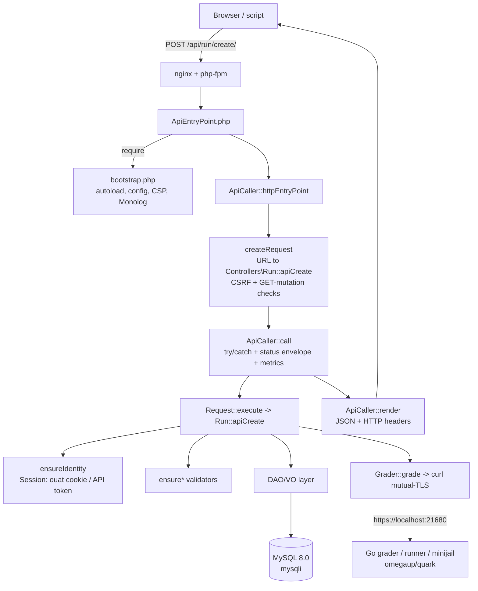

# Arquitetura de back-end

O backend omegaUp é simples **PHP 8.1** servido por **php-fpm por trás do nginx** (o HHVM já se foi há muito tempo - não há uma única referência a ele na árvore). Tudo vive sob `frontend/server/src` no namespace PSR-4 `\OmegaUp\...`, e tudo depende de uma ideia: cada chamada que o navegador ou script faz é uma *chamada de API*. Não há PHP por página; uma página é apenas o shell Twig `frontend/templates/template.tpl` que inicializa um aplicativo Vue, e esse aplicativo se comunica com o servidor exclusivamente por meio de endpoints `/api/...`. Portanto, para entender o back-end, você realmente só precisa seguir uma solicitação da conexão até o MySQL e vice-versa, que é o que esta página faz - usando um envio de código (`POST /api/run/create/`) como exemplo trabalhado, porque ele toca todas as camadas: expedição, o objeto `Request`, autenticação, a camada de dados DAO/VO e o avaliador externo.

Um modelo mental de uma linha para se manter: o back-end do PHP é um **despachante de solicitação fino e sem estado sobre MySQL** que entrega o trabalho genuinamente árduo (compilação, sandbox e execução de envios) para um serviço Go separado por HTTP. Ele nunca executa código não confiável.

## O ponto de entrada: uma URL, um método de controlador

Cada chamada de API HTTP chega ao mesmo arquivo minúsculo, [`frontend/www/api/ApiEntryPoint.php`](https://github.com/omegaup/omegaup/blob/main/frontend/www/api/ApiEntryPoint.php), que tem cinco linhas:

```php
<?php
require_once(__DIR__ . '/../../server/bootstrap.php');
echo \OmegaUp\ApiCaller::httpEntryPoint();
```
O `require` puxa [`frontend/server/bootstrap.php`](https://github.com/omegaup/omegaup/blob/main/frontend/server/bootstrap.php), que é a configuração única do processo: ele carrega o autoloader do Composer, força o fuso horário para `UTC` (para que cada registro de data e hora no sistema seja inequívoco, independentemente de onde o servidor é executado), se recusa a iniciar e imprime o conteúdo de `config.default.php` se você esqueceu de criar um `config.php` (uma falha deliberadamente alta para que um novo checkout diga exatamente o que fazer), calcula `OMEGAUP_LOCKDOWN` verificando se o cabeçalho `Host` começa com `OMEGAUP_LOCKDOWN_DOMAIN` (lockdown é o modo de competição reforçado que desativa tudo que não é estritamente necessário durante uma competição ao vivo), emite os cabeçalhos `Content-Security-Policy` e `X-Frame-Options: DENY` e conecta o registrador raiz **Monolog 2** — enriquecido com um processador New Relic *somente se* essa classe existir, para que o mesmo código seja executado de forma idêntica no desenvolvimento sem o New Relic instalado. Tudo após este ponto pode assumir que a configuração, o registro e o autoloader estão ativos.

Então `\OmegaUp\ApiCaller::httpEntryPoint()` em [`frontend/server/src/ApiCaller.php`](https://github.com/omegaup/omegaup/blob/main/frontend/server/src/ApiCaller.php) executa a solicitação real. Ele faz três coisas em ordem: cria um `Request` a partir da URL (`createRequest()`), executa-o (`call()`) e serializa o resultado em JSON (`render()`).

### Resolvendo a URL para `Controller::apiXxx`

`createRequest()` é onde um URL se torna chamável. Ele divide `$_SERVER['REQUEST_URI']` em `/` **e** `?` — o `?` é incluído propositalmente para que `/api/problem/list/?page=1` e `/api/problem/list?page=1` sejam analisados ​​de forma idêntica, com ou sem a barra final. A partir do caminho `/api/{controller}/{method}/`, ele utiliza o segmento 2 como controlador e o segmento 3 como método e, em seguida, constrói o nome de classe totalmente qualificado `\OmegaUp\Controllers\{Ucfirst(controller)}` e o nome do método `api{Method}`. Os bytes NUL são removidos de ambos primeiro, porque são um truque clássico para contrabandear uma verificação `class_exists`.

Duas importantes convenções de nomenclatura resultam disso. Primeiro, **as classes do controlador omegaUp eliminam o sufixo `Controller`**: a classe que lida com as execuções é `\OmegaUp\Controllers\Run` (em [`frontend/server/src/Controllers/Run.php`](https://github.com/omegaup/omegaup/blob/main/frontend/server/src/Controllers/Run.php)), *não* `RunController`. O mesmo vale para `Contest`, `Problem`, `Submission`, `Grader` e o resto. Em segundo lugar, **a superfície da API pública é exatamente o conjunto de métodos `public static function apiXxx`** — o prefixo `api` é adicionado pelo despachante, portanto, um método chamado `apiCreate` pode ser acessado como `.../create/` e um método simples sem prefixo `api` é inacessível na web por construção. Portanto, `POST /api/run/create/` resolve para `\OmegaUp\Controllers\Run::apiCreate`. Se a classe ou o método `apiXxx` não existir, o resolvedor registra exatamente o símbolo ausente e lança `\OmegaUp\Exceptions\NotFoundException('apiNotFound')` – que, como você verá abaixo, o navegador é mostrado como um 404 simples.

Antes de entregar a solicitação, `createRequest()` impõe uma regra transversal: ** endpoints mutantes rejeitam `GET`. ** `isMutatingMethod()` coloca o nome do método em minúsculas e combina-o por substring com uma lista de verbos de mudança de estado (`add`, `create`, `delete`, `update`, `login`, `logout`, `rejudge`, `refresh`, `verify` e cerca de duas dúzias mais); se um `GET` atingir um deles, ele lançará o `MethodNotAllowedException` em vez de executá-lo. Como a correspondência é por substring, um método genuinamente somente leitura cujo nome contém um verbo mutante (por exemplo, `listAssociatedIdentities` contém "associar") seria capturado por engano, portanto, há um `$readOnlyAllowlist` explícito (`execute`, `executeForIDE`, `listAssociatedIdentities`, `statusVerified`) que permite que eles voltem a permitir `GET`. É isso que força toda gravação real a passar pelo `POST`.

Há uma segunda porta no método irmão `isCSRFAttempt()`, executada na parte superior de `call()`: se a solicitação transportar um cabeçalho `Referer`, seu host deve corresponder ao host de `OMEGAUP_URL`, ao domínio de bloqueio ou a um dos `OMEGAUP_CSRF_HOSTS` - caso contrário, toda a chamada será rejeitada como CSRF. **falha ao fechar**: um referenciador malformado ou um `OMEGAUP_URL` malformado é tratado como um ataque, e não rejeitado. Uma chamada de API com *não* `Referer` é permitida, porque é assim que um script legitimamente criado à mão ou o cliente móvel chama a API; a verificação existe apenas para impedir que um navegador conectado seja enganado por uma página de terceiros.

## O objeto `Request` e autenticação

O despachante empacota os parâmetros recebidos em um [`\OmegaUp\Request`](https://github.com/omegaup/omegaup/blob/main/frontend/server/src/Request.php), que estende `\ArrayObject` - então um controlador lê um parâmetro como `$r['problem_alias']`, e uma chave ausente retorna `null` em vez de gerar um aviso (essa é a razão pela qual `offsetGet` é substituído). `createRequest()` o propaga a partir de `$_REQUEST`, em seguida, sobrepõe os parâmetros de estilo de caminho (os pares `/key/value/` que alguns endpoints usam) e, finalmente, carimba dois campos que o executor precisa: `$request->methodName` (por exemplo, `run.create`, usado para nomear a transação para New Relic e Prometheus) e `$request->method` (o `callable-string` `\OmegaUp\Controllers\Run::apiCreate`).

Os controladores nunca confiam em valores brutos de solicitação. A classe `Request` carrega uma família de **validadores `ensure*`** em que cada um lê uma chave, afirma seu tipo e intervalo, força o valor armazenado no local e retorna o resultado digitado - lançando `InvalidParameterException('parameterEmpty', $key)` quando uma chave necessária está faltando:

- `ensureString($key, $validator?)` / `ensureOptionalString(...)` — uma string, opcionalmente verificada por um retorno de chamada (usado para aliases, nomes de usuários e similares).
- `ensureInt($key, $lowerBound?, $upperBound?)` / `ensureOptionalInt(...)` — um número inteiro, verificado por intervalo via `\OmegaUp\Validators::validateNumberInRange`.
- `ensureFloat(...)`, `ensureBool(...)`, `ensureTimestamp(...)` e seus gêmeos `ensureOptional*` — com `ensureTimestamp` retornando um objeto `\OmegaUp\Timestamp` de primeira classe em vez de um int simples.
- `ensureEnum($key, $enumValues)` / `ensureOptionalEnum(...)` — rejeita qualquer coisa fora do conjunto permitido e relata tanto o valor incorreto quanto o conjunto esperado no erro, para que o cliente veja *por que* foi rejeitado.

As variantes `Optional` retornam `null` quando a chave está ausente e só a exigem quando você passa `required: true`. Isso não é apenas ergonomia: cada parâmetro anulável adicional duplica aproximadamente o número de combinações de entrada que uma função pode receber, de modo que a base de código trata uma grande distribuição de parâmetros opcionais como um cheiro de código para mantê-lo bem sob controle, em vez de uma conveniência gratuita.

### Quem está ligando: sessões, token `ouat` e tokens API

A primeira linha de quase todos os métodos `apiXxx` é uma declaração de autorização na solicitação. `$r->ensureIdentity()` requer *alguma* identidade de login e lança `UnauthorizedException` (→ HTTP 401) caso contrário; `$r->ensureMainUserIdentity()` requer adicionalmente que a identidade logada seja a identidade *principal* de seu usuário (jogando `ForbiddenAccessException` → 403 para uma identidade secundária/de equipe); e camadas `$r->ensureIdentityIsOver13()` em um limite de idade que bloqueia contas menores de 13 anos de ações que elas não têm permissão para realizar. Eles preenchem `$r->identity`, `$r->user` e `$r->loginIdentity` para o restante do método a ser usado.

Todos eles resolvem o chamador por meio do `\OmegaUp\Controllers\Session::getCurrentSession()`, que oferece suporte a **dois** estilos de credenciais. O de uso diário é o cookie de sessão do navegador, cujo nome é `ouat` (`OMEGAUP_AUTH_TOKEN_COOKIE_NAME`, definido em [`config.default.php`](https://github.com/omegaup/omegaup/blob/main/frontend/server/config.default.php)). O valor `ouat` *não* é um token PASETO — é uma string opaca de três partes cunhada no login como `"{entropy}-{identity_id}-{hash}"`, onde `entropy` é `bin2hex(random_bytes(15))` (30 caracteres hexadecimais, `AUTH_TOKEN_ENTROPY_SIZE = 15`) e `hash` é `sha256(OMEGAUP_MD5_SALT . identity_id . entropy)`. Em cada solicitação, o token é consultado no servidor na tabela `AuthTokens` via `\OmegaUp\DAO\AuthTokens::getIdentityByToken()`; se não estiver lá, a sessão é simplesmente `valid => false` e você fica anônimo. Os tokens antigos são removidos quando um novo é criado, e o mesmo token é excluído do cache da sessão no mint para que uma entrada de cache obsoleta não sobreviva a um novo login. O despachante copia esse cookie em `$request['auth_token']` em `createRequest()`, e é por isso que um controlador também pode aceitar um parâmetro `auth_token` explícito e se comportar de forma idêntica, independentemente de ter vindo de um cookie ou da string de consulta.

O segundo estilo é um **token de API** portador no cabeçalho `Authorization`, usado por scripts e integrações. Esse caminho (`getCurrentSessionImplForAPIToken`) procura a credencial na tabela `APITokens` e, ao contrário do caminho do cookie, é **com taxa limitada**: ele emite cabeçalhos `X-RateLimit-Limit` / `X-RateLimit-Remaining` / `X-RateLimit-Reset` em cada chamada e lança `RateLimitExceededException` com um `Retry-After` assim que a contagem restante atingir `0`. Onde **PASETO** (`paragonie/paseto`) genuíno *aparece* é em [`frontend/server/src/SecurityTools.php`](https://github.com/omegaup/omegaup/blob/main/frontend/server/src/SecurityTools.php), que assina tokens v2 de curta duração para comunicação com o **gitserver** externo (assinado com chave pública) e para operações de clone de curso (local/simétrico) — confiança de subsistema para subsistema, distinta da sessão do usuário `ouat`.

## Executando a chamada

Com um `Request` totalmente construído, o `ApiCaller::call()` o executa dentro de um grande `try/catch`. `$request->execute()` (em `Request.php`) apenas faz `call_user_func($this->method, $this)` - ou seja, invoca `Run::apiCreate($r)` - e insiste que o resultado é um array, lançando `InternalServerErrorException` se um controlador retornar um não array. Em caso de sucesso, `call()` aplica a convenção de resposta da plataforma: se o controlador retornou uma matriz associativa sem chave `status` própria, ele injeta `'status' => 'ok'`. Cada resposta da API omegaUp, portanto, carrega um `status`, e as respostas de erro carregam o envelope `{status: 'error', error, errorcode, errorname}` produzido por `ApiException::asResponseArray()`, com a mensagem `error` legível por humanos localizada no idioma configurado da conta.A escada de captura é ordenada deliberadamente. Um `ExitException` significa um controlador solicitado explicitamente para encerrar a solicitação (por exemplo, após transmitir um arquivo) e simplesmente `exit`s. Um `ApiException` — a classe base para cada falha "esperada" como `NotFound`, `Unauthorized`, `Forbidden`, `InvalidParameter` — é mantido como está. **Qualquer outra coisa** (um `\Exception` bruto, ou seja, um bug) é agrupado em `InternalServerErrorException('generalError')` para que um rastreamento de pilha inesperado nunca vaze para o cliente. De qualquer forma, a exceção é registrada (5xx vai para o nível `error` *e* `NewRelicHelper::noticeError`; todo o resto é `info`), o resultado é registrado no Prometheus via `\OmegaUp\Metrics::getInstance()->apiStatus(methodName, httpCode)` e o envelope é retornado. É por isso que você pode executar grep nas métricas de produção por nome de método e status HTTP: a instrumentação é centralizada aqui, uma vez, em vez de espalhada pelos controladores.

## A camada de dados DAO/VO sobre MySQL

Os controladores não escrevem SQL manualmente. Toda persistência passa por uma camada de duas partes, em sua maioria **gerada automaticamente**, situada sobre o driver **mysqli**.

Um **VO (Value Object)** é uma linha digitada idiota. `\OmegaUp\DAO\VO\Runs` ([`frontend/server/src/DAO/VO/Runs.php`](https://github.com/omegaup/omegaup/blob/main/frontend/server/src/DAO/VO/Runs.php)) tem uma propriedade pública por coluna (`run_id`, `submission_id`, `version`, `commit`, `status`, `verdict`, `runtime`, `penalty`, `memory`, `score`, `contest_score`, `time`, `judged_by`) e um mapa `FIELD_NAMES`. Seu construtor pega um array associativo e **joga em qualquer coluna desconhecida** - então um nome de campo digitado falha ruidosamente na construção em vez de desaparecer silenciosamente - coagindo cada valor ao tipo PHP real da coluna (ints via `intval`, a coluna `time` em um `\OmegaUp\Timestamp`).

Um **DAO (Data Access Object)** é onde reside o SQL, dividido em dois arquivos propositalmente. A classe base gerada `\OmegaUp\DAO\Base\Runs` ([`frontend/server/src/DAO/Base/Runs.php`](https://github.com/omegaup/omegaup/blob/main/frontend/server/src/DAO/Base/Runs.php)) - cada um desses arquivos carrega o banner `!ATENCION! Este codigo es generado automáticamente` avisando que as edições manuais serão substituídas na próxima vez que o gerador for executado - fornece as primitivas CRUD por chave primária: `create()`, `update()`, `getByPK()`, `existsByPK()`, `delete()`, `getAll()`. Estas são instruções `INSERT` / `UPDATE` / `SELECT ... WHERE run_id = ?` parametrizadas literais que listam cada coluna por nome. A subclasse pública `\OmegaUp\DAO\Runs` (em [`frontend/server/src/DAO/Runs.php`](https://github.com/omegaup/omegaup/blob/main/frontend/server/src/DAO/Runs.php)) `extends` é a base e é onde os humanos adicionam as consultas escritas à mão e com muitas junções que uma tabela realmente precisa (por exemplo, `getBestSolvingRunsForProblem`). A divisão significa que você regenera o clichê enfadonho com segurança, sem nunca superar as consultas interessantes.

Abaixo de ambos está [`\OmegaUp\MySQLConnection`](https://github.com/omegaup/omegaup/blob/main/frontend/server/src/MySQLConnection.php), um wrapper fino compatível com ADOdb em torno de uma única conexão mysqli. Algumas de suas opções são resistentes:

- **A vinculação de parâmetros é feita em PHP, não pelo driver.** `BindQueryParams()` divide o SQL em `?` e substitui cada parâmetro pelo escape correto: `NULL` para nulo, `FROM_UNIXTIME(...)` para um `\OmegaUp\Timestamp`, dígitos brutos para ints/floats, `1`/`0` para bools e aspas agrupadas em `real_escape_string` para strings. Uma incompatibilidade de contagem entre os espaços reservados `?` e os parâmetros fornecidos é lançada imediatamente, o que transforma toda uma classe de bugs em forma de injeção em um erro grave.
- **As linhas de resultados são digitadas novamente para corresponder ao esquema.** mysqli devolve strings; `MapFieldTypes`/`MapValue` inspeciona os metadados do campo e força cada coluna para `int`/`float`/`bool`/`string`/`\OmegaUp\Timestamp` para que o VO sempre veja tipos PHP reais. (Definir `DUMP_MYSQL_QUERY_RESULT_TYPES` faz com que ele registre um tipo `array{...}` em forma de Salmo para cada consulta - é assim que as anotações `@psalm-type` geradas que mantêm toda a base de código digitada estaticamente são produzidas.)
- **`autocommit` está desligado** e a conexão registra uma função de desligamento que libera qualquer transação pendente no final da solicitação. `StartTrans`/`CompleteTrans`/`FailTrans` são **contados por referência**, portanto, aninhar uma transação dentro de outra apenas incrementa um contador e apenas o `CompleteTrans` mais externo é realmente `COMMIT`s (ou `ROLLBACK`s, se alguém chamar `FailTrans`). Isso permite que funções auxiliares independentes abram uma "transação" sem brigar pelos limites de commit.
- **Uma conexão interrompida é tentada novamente uma vez, mas somente quando segura.** Se uma consulta falhar com um erro "O servidor MySQL foi embora" *e* nada não confirmado estiver em andamento (`_needsFlushing === false`), ele se reconectará e tentará novamente exatamente uma vez; se houver gravações pendentes, ele recusará, porque uma nova tentativa cega poderia aplicá-las duas vezes.

O destino de conexão padrão é `OMEGAUP_DB_HOST = 'mysql:13306'`, banco de dados `omegaup`, no **MySQL 8.0**, com o conjunto de caracteres fixado em `utf8mb4`/`utf8mb4_unicode_ci` para que os emojis e toda a gama de nomes façam a viagem de ida e volta corretamente.

### Juntando tudo: `Run::apiCreate`

Agora as camadas se conectam. `\OmegaUp\Controllers\Run::apiCreate` (em torno de L415) é executado, na ordem: `ensureIdentity()`; `ensureString('source')`; `validateCreateRequest()` (que resolve o problema e o concurso, verifica os campos obrigatórios e garante que o problema está realmente naquele concurso); calcula `submit_delay` - cujo ponto principal é que é o número de minutos desde o início das penalidades (o início da competição, ou quando o usuário abriu o problema pela primeira vez, dependendo do `penalty_type` da competição) até o envio, e é `0` para treinos fora de qualquer competição. Em seguida, ele cria um `Submissions` VO (com um novo `guid`, `status => 'uploading'`, `verdict => 'JE'`) e um `Runs` VO, e dentro do `TransactionHelper::executeWithRetry(...)` — um wrapper que tenta novamente em caso de deadlock — ele verifica novamente a **lacuna de envio** (atualmente um envio por problema por resfriamento configurado, verificado *dentro* da transação para que dois as submissões de corrida não podem escapar), insere a submissão e a corrida e os vincula.

Somente depois que as linhas são confirmadas ele chama `\OmegaUp\Grader::getInstance()->grade($run, trim($source))` (por volta de L573) para realmente agendar o julgamento. A ordem é importante e o tratamento de falhas é explícito: a chamada de nota **não pode** fazer parte da transação do banco de dados, porque o avaliador é um processo separado que consulta a linha `Runs` pela rede e não veria uma linha não confirmada. Portanto, se `grade()` for lançado, `apiCreate` será desenrolado manualmente - anula `current_run_id` e, em seguida, excluirá a execução e o envio (nessa ordem, para evitar uma violação de chave estrangeira) - e será relançado, deixando o banco de dados como se o envio nunca tivesse acontecido.

## Os serviços externos com os quais conversa

O back-end tem estado apenas no MySQL; tudo o mais que precisa, ele chega pela rede.

### O avaliador, por HTTP

O avaliador/corredor/transmissor e a sandbox **minijail** **não estão neste repositório** — eles são serviços **Go** separados em [github.com/omegaup/quark](https://github.com/omegaup/quark) (a árvore tem `grader/`, `runner/`, `broadcaster/`, `cmd/omegaup-grader`, `cmd/omegaup-runner`, `cmd/omegaup-broadcaster` e `Dockerfile.minijail`), com problemas de armazenamento resolvidos por [github.com/omegaup/gitserver](https://github.com/omegaup/gitserver). Todo o conhecimento do lado do PHP sobre esse mundo é [`\OmegaUp\Grader`](https://github.com/omegaup/omegaup/blob/main/frontend/server/src/Grader.php), um **cliente curl fino** — ele não implementa a fila de julgamento, o pool de executores ou a sandbox; apenas faz um POST para eles e lê o status. Ele se comunica com `OMEGAUP_GRADER_URL` (padrão `https://localhost:21680`) em um conjunto pequeno e fixo de endpoints:

- `POST /run/new/{run_id}/` — `grade()`, agende um único novo envio (a fonte é enviada raw no corpo).
- `POST /run/grade/` — `rejudge()`, reavalie um lote de execuções por ID.
- `GET /submission/source/{guid}/` — `getSource()`, recupera a fonte de um envio.
- `POST /broadcast/` — `broadcast()`, envia um evento ao vivo (novo esclarecimento, alteração no placar) para clientes de concurso conectados por meio da emissora.
- `GET /run/resource/` — `getGraderResource()`, recupera um artefato por execução, como saída do compilador ou o registro detalhado do juiz.
- `GET /grader/status/` — `status()`, a integridade da fila, modelada pelo tipo de salmo `GraderStatus` como `{status, broadcaster_sockets, embedded_runner, queue: {running, run_queue_length, runner_queue_length, runners}}`; é isso que o `\OmegaUp\Controllers\Grader::apiStatus` revela.

Vale a pena lembrar dois detalhes operacionais. Primeiro, o transporte é **TLS mútuo**: `curlRequestSingle()` fixa uma chave de cliente e um certificado (`/etc/omegaup/frontend/key.pem`, `certificate.pem`) e requer TLS 1.2 com verificação peer + host, com um tempo limite de conexão de 5 segundos e um tempo limite geral de 30 segundos — o avaliador confia no frontend *por causa* desse certificado, não por causa de qualquer token de usuário. Em segundo lugar, as falhas transitórias são **repetidas até 3 vezes com espera exponencial** (1s, 2s, limitado a 5s), mas apenas para uma lista de permissões específica de erros repetíveis (tempo limite de SSL/conexão/operação, `HTTP/2 stream`, `INTERNAL_ERROR`); um não-200 limpo ou um 404 não é tentado novamente, e um 404 com `missingOk` definido simplesmente retorna `null` (é assim que um artefato que ainda não existe legitimamente é diferenciado de uma falha real). Para desenvolvimento e testes locais, `OMEGAUP_GRADER_FAKE` causa um curto-circuito em tudo isso: `grade()` apenas grava a fonte em `/tmp/{guid}` e `status()` retorna uma fila vazia predefinida, para que você possa executar todo o back-end sem a presença de um avaliador.

### Redis e RabbitMQAlém da motoniveladora, o backend conta com mais duas peças de infraestrutura declaradas no `config.default.php`. **Redis** (`REDIS_HOST = 'redis'`, porta `6379`) oferece suporte ao cache compartilhado. **RabbitMQ 3** (`OMEGAUP_RABBITMQ_HOST = 'rabbitmq'`, porta `5672`, via **php-amqplib**) é o barramento de mensagens para trabalho assíncrono que não deve bloquear uma resposta da API — o tipo de trabalho em que o usuário não precisa esperar pelo resultado in-line. Ambos são opcionais no sentido de que o caminho principal de solicitação/resposta do aplicativo é MySQL + grader; eles fazem a plataforma escalar em vez de funcionar.

## Todo o caminho, de relance


## Como a resposta retorna ao navegador

Finalmente, `ApiCaller::render()` transforma o array em JSON. Ele anexa um `_id` por solicitação (um `uniqid` gerado uma vez em `Request.php`, para que cada resposta seja rastreável nos logs), imprime apenas quando a solicitação é explicitamente solicitada com `prettyprint=true` e defende contra dados não codificáveis: se `json_encode` falhar em UTF-8 ilegal, ele tenta novamente com `JSON_PARTIAL_OUTPUT_ON_ERROR` para salvar uma resposta utilizável em vez de quebrar a página completamente - o caso motivador é uma declaração de problema contendo bytes perdidos. `setHttpHeaders()` envia cabeçalhos agressivos sem cache (com um comentário `// Scumbag IE y su cache agresivo` explicando o porquê) e `X-Robots-Tag: noindex` em cada resposta da API.

A única parte da política de segurança que vale a pena internalizar reside no `handleException()`, que mapeia os códigos de exceção para o que o navegador realmente mostra: **um 403 `ForbiddenAccessException` é servido como um 404**. Isso é deliberado - para um recurso que você não tem permissão para ver (um concurso privado, um problema não publicado), o omegaUp finge que ele não existe em vez de confirmar que existe e simplesmente recusar você, portanto, investigar recursos ocultos não vaza nada. Um 401 redireciona para `/login/` com o URL original preservado em `?redirect=`; um 400 serve `www/400.html`; qualquer outra coisa é 500. Lembre-se da regra 403 → 404 sempre que tocar na autorização: "proibido" e "não encontrado" são intencionalmente indistinguíveis do lado de fora.

## Documentação Relacionada

- **[Padrões de banco de dados](../development/database-patterns.md)** — a camada DAO/VO em profundidade
- **[Padrão MVC](mvc-pattern.md)** — como controladores, DAOs e VOs se encaixam
- **[Referência da API](../reference/api.md)** — o catálogo de endpoints
