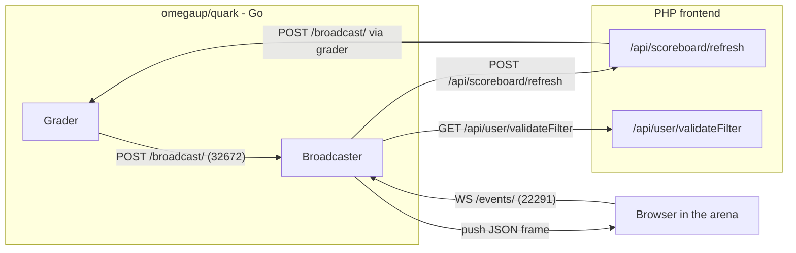
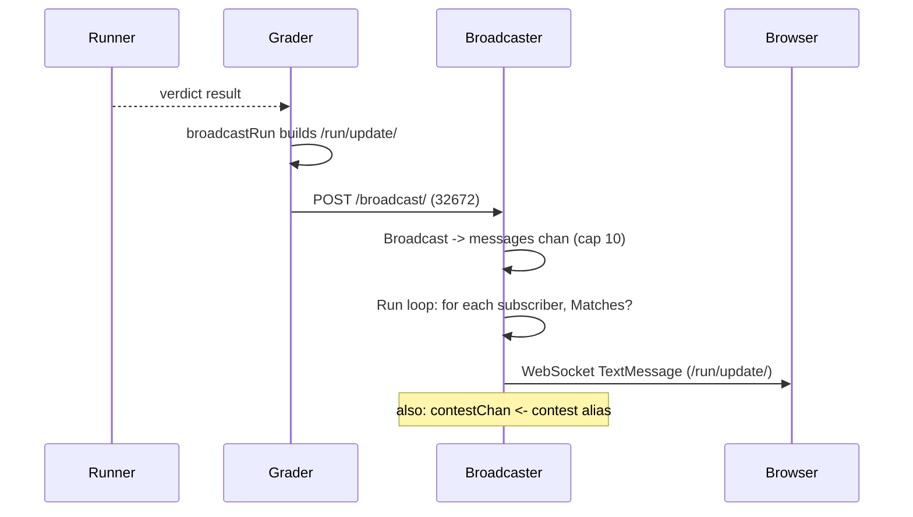
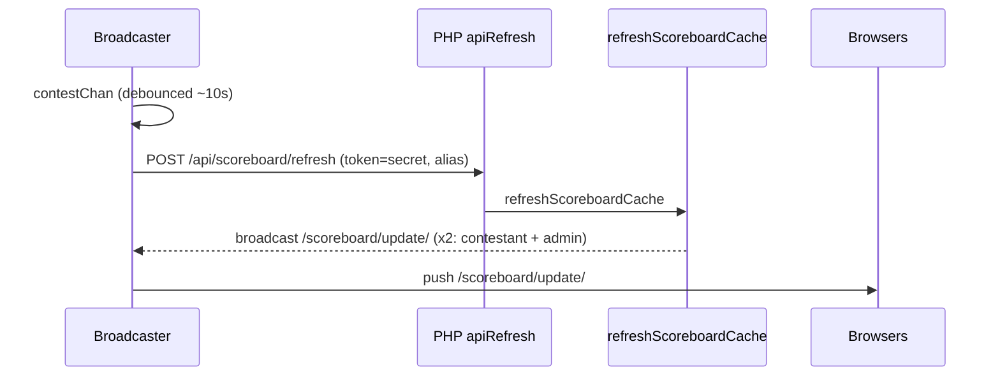

# Arquitetura de emissora

A emissora é o pequeno serviço Go que dá vida à arena. Quando você está participando de um concurso e sua inscrição muda de "julgamento" para **AC** verde, ou o placar é reorganizado porque um rival acabou de resolver o problema C, essa atualização não chegou porque seu navegador a pesquisou - ela foi *enviada* para você por meio de um WebSocket que a emissora está mantendo aberto desde que você abriu a página. Todo o seu trabalho é manter uma conexão duradoura por participante e espalhar eventos quase em tempo real (veredictos, mudanças no placar, esclarecimentos) exatamente para as pessoas que têm permissão para vê-los.

Ele fica no repositório Go [`omegaup/quark`](https://github.com/omegaup/quark) separado (**não** no monorepo PHP), junto com o avaliador e o executor. O frontend do PHP nunca fala o próprio WebSocket; ele apenas envia JSON simples para o avaliador, e o avaliador o encaminha aqui. Um modelo mental útil de uma linha: **o transmissor é uma estrutura pub/sub sem estado na memória cujas assinaturas são autorizadas pelo frontend PHP e cujos eventos são publicados pelo avaliador.** Ele não contém banco de dados, não armazena nada em cache e, se travar e reiniciar, cada cliente simplesmente se reconecta e o mundo está inteiro novamente — a única coisa perdida são alguns segundos de "vivaidade".

## Situando: quem fala com quem

A emissora expõe **dois** servidores HTTP em duas portas diferentes, porque tem dois públicos completamente diferentes com dois níveis de confiança completamente diferentes.

- O **servidor de eventos** (`EventsPort`, atualmente **22291**) é o servidor público ao qual os navegadores se conectam em `/events/`. Ele fala WebSocket (subprotocolo `com.omegaup.events`) ou, como alternativa, eventos enviados pelo servidor. É aqui que os assinantes moram.
- O **servidor API interno** (`Port`, atualmente **32672**) expõe `/broadcast/` e `/deauthenticate/`. Esta é a porta dos fundos privada que apenas o avaliador deve alcançar, usada para *injetar* mensagens e expulsar à força as conexões de um usuário.

Um terceiro mux atende Prometheus `/metrics` em `Metrics.Port` - que reside na estrutura irmã `MetricsConfig`, *não* `BroadcasterConfig`, porque as métricas são uma preocupação de serviço cruzado compartilhada com o avaliador e o executor. Os padrões das duas portas de transmissão (`EventsPort` e `Port`) residem em [`common/context.go`](https://github.com/omegaup/quark/blob/main/common/context.go) na estrutura `BroadcasterConfig`, e `docker-compose.yml` no repositório frontend expõe exatamente `32672` e `22291` para o serviço `broadcaster`.

## Um assinante se conecta e o PHP decide o que pode ouvir

Tudo começa quando um navegador abre a arena. O [`events_socket.ts`](https://github.com/omegaup/omegaup/blob/main/frontend/www/js/omegaup/arena/events_socket.ts) do frontend cria uma URL como `wss://omegaup.com/events/?filter=/problemset/1234`, anexando o token do placar quando a página foi aberta por meio de um link de placar público (`.../problemset/1234/<token>`) e chama `new WebSocket(this.uri, 'com.omegaup.events')`. O parâmetro de consulta `filter` é o coração do protocolo: é uma lista separada por vírgulas de caminhos de recursos nos quais o cliente afirma estar interessado.

O mux de eventos em [`cmd/omegaup-broadcaster/main.go`](https://github.com/omegaup/quark/blob/main/cmd/omegaup-broadcaster/main.go) trata dessa solicitação. Primeiro, ele extrai a identidade do chamador de onde quer que possa encontrá-la, em uma ordem deliberada: o cookie `ouat` (uma sessão normal de login), depois um cabeçalho `Authorization: token <APIToken>` e, em seguida, um cookie `api_token`. Esse último substituto existe por um motivo muito específico explicado em um comentário no código - *WebSockets não permitem que o cliente defina cabeçalhos de solicitação arbitrários*, portanto, um token de API deve ser contrabandeado por meio de um cookie em vez do cabeçalho que uma chamada REST normal usaria.

Depois vem a transferência crucial: a emissora **não decide por si mesma** se você pode assinar o `/problemset/1234`. Não pode - não tem banco de dados e nenhuma noção de quem é o administrador do concurso. Em vez disso, `NewSubscriber` em [`broadcaster/subscriber.go`](https://github.com/omegaup/quark/blob/main/broadcaster/subscriber.go) faz um HTTP `GET` servidor para servidor de volta ao frontend PHP em `FrontendURL + api/user/validateFilter/`, encaminhando seu cookie ou token e sua string de filtro solicitada. O lado PHP, `\OmegaUp\Controllers\User::apiValidateFilter` em [`User.php`](https://github.com/omegaup/omegaup/blob/main/frontend/server/src/Controllers/User.php), percorre cada token de filtro e lança `ForbiddenAccessException` no momento em que você pede algo que não tem direito - um filtro `/user/<name>` que não é seu próprio nome de usuário (a menos que você seja um administrador), um filtro `/all-events` quando você não é um administrador, um `/contest/<alias>` você não consigo ver. Observe que esse endpoint *deliberadamente não requer autenticação*: um visitante anônimo que possui um token de placar válido ainda pode acompanhar um concurso público, e é exatamente por isso que o token segue o caminho do filtro.

Se o frontend responder `200`, seu corpo JSON — modelado por `ValidateFilterResponse` — informa ao transmissor quem você é: seu `user`, se você é um `admin` global e as listas de recursos `problem_admin`, `contest_admin` e `problemset_admin` que você administra. A emissora os armazena em mapas por assinante e os consulta em cada mensagem. Se o frontend responder a qualquer outra coisa, `NewSubscriber` retorna um `UpstreamError` carregando o código de status e o corpo do frontend, e o transmissor retransmite esse status exato diretamente para o navegador - então um `403` do PHP se torna um `403` na atualização do WebSocket, e o cliente nunca se junta. Este é o portão de autorização único; não há nova verificação posteriormente, e é por isso que a emissora pode se dar ao luxo de ser um loop de fan-out rápido e idiota depois.

## Filtros: como uma mensagem encontra seu público

Um assinante não está inscrito em "canais" em nenhum sentido com estado - ele carrega uma lista de predicados `Filter` analisados daquela string separada por vírgula por `NewFilter` em [`broadcaster/filter.go`](https://github.com/omegaup/quark/blob/main/broadcaster/filter.go). Quando chega uma mensagem, a emissora pergunta a cada assinante "algum dos seus filtros corresponde a este?" e entrega somente se a resposta for sim. Existem atualmente cinco formatos de filtro, cada um com um caminho de barra inicial:

- **`/all-events`** — corresponde a todas as mensagens, mas *somente* se `subscriber.admin` for verdadeiro. Esta é a mangueira de incêndio, reservada aos administradores do site.
- **`/user/<username>`** — corresponde a uma mensagem cujo campo `User` é igual ao nome de usuário resolvido do próprio assinante. É assim que as atualizações do seu veredicto pessoal chegam a você e a mais ninguém.
- **`/problem/<alias>`** — corresponde às mensagens marcadas com esse problema, bloqueadas para que uma mensagem seja entregue apenas se o assinante for um administrador, ou a mensagem for `Public`, ou a mensagem for sobre a atividade do próprio assinante, ou o assinante estiver no mapa administrativo desse problema.
- **`/problemset/<id>[/<token>]`** — a mesma ideia digitada em um ID numérico de conjunto de problemas (um conjunto de problemas de concurso), com um token de placar opcional anexado.
- **`/contest/<alias>[/<token>]`** — o mesmo, digitado em um alias de concurso.

Vale a pena ler literalmente a lógica do portão, porque é a razão pela qual um competidor nunca vê a corrida privada de outro competidor. `ContestFilter.Matches` retorna verdadeiro somente quando `msg.Contest == f.contest` **e** pelo menos um de: `subscriber.admin`, `msg.Public`, `subscriber.user != "" && msg.User == subscriber.user` ou o concurso está no `contestAdminMap` do assinante. Portanto, um não-administrador participando de um concurso recebe as transmissões do placar *público* e as atualizações de execução *suas próprias*, mas um evento privado por usuário endereçado a outra pessoa falha em todas as cláusulas e é ignorado silenciosamente. O filtro do navegador do frontend é deliberadamente grosseiro (`/problemset/<id>`); a verificação por mensagem da emissora é o que torna a entrega precisa.

## O verdadeiro caminho: uma corrida é avaliada e o veredicto chega ao seu navegador

Agora trace um envio até o fim. Suponha que você submeta o problema C no concurso `pizza-2024`, o corredor o execute e o avaliador termine com um veredicto de `AC`.

**1. O avaliador publica um `/run/update/`.** Em [`cmd/omegaup-grader/frontend_handler.go`](https://github.com/omegaup/quark/blob/main/cmd/omegaup-grader/frontend_handler.go), o `RunPostProcessor` notifica um ouvinte para cada `RunInfo` concluído, que (quando `Grader.V1.SendBroadcast` está ativado) chama `broadcastRun`. Essa função cria um `broadcaster.Message` cujos campos de nível superior são os metadados de *roteamento* — `Problem`, `Contest`, `Problemset`, `Public: false` — e cujo campo `Message` é uma *string* JSON da carga útil real: `{"message":"/run/update/","run":{...}}`. Esse objeto `run` interno é o contrato de fio que o navegador consome: `username`, `contest_alias`, `alias`, `guid`, `runtime`, `memory`, `score`, `contest_score`, `status:"ready"`, `verdict`, `language` e assim por diante. Um caso extremo é apresentado aqui: se o modo de pontuação do problema for `all_or_nothing` e a pontuação não for um `1` perfeito, o avaliador reescreve `score` e `contest_score` para `0` e o `verdict` para `WA` antes de enviar, para que o crédito parcial nunca vaze para uma exibição de tudo ou nada.

**2. Ele faz POST para `/broadcast/`.** `broadcast` (mesmo arquivo) empacota o `Message` e `client.Post` para `Grader.BroadcasterURL` — a API interna do transmissor na porta **32672**. (Quando o lado *PHP* deseja transmitir, ele faz um POST para `OMEGAUP_GRADER_URL + /broadcast/`, e o manipulador `/broadcast/` do próprio avaliador simplesmente o encaminha aqui com a mesma função `broadcast()` - portanto, há exatamente um caminho de código para o transmissor, e o avaliador é sempre o último salto.)

**3. O transmissor o coloca na fila.** O manipulador `/broadcast/` em `main.go` decodifica o JSON em um `broadcaster.Message` e chama `b.Broadcast(&message)`. `Broadcast` o envolve em um `QueuedMessage` (carimbando `time.Now()` para que a latência possa ser medida posteriormente) e faz um envio *sem bloqueio* para o canal `messages` em buffer. Se esse canal estiver cheio - sua capacidade é `ChannelLength`, atualmente apenas **10** - a mensagem é descartada: ele registra `"Dropped broadcast message"`, bate no contador `channel_drop_total` e `Broadcast` retorna `false`, o que faz o manipulador responder `503 Service Unavailable`. Esta é uma escolha deliberada de redução de carga: uma atualização em tempo real que não pode ser entregue prontamente é inútil, então a emissora prefere abandoná-la a bloquear o avaliador.

**4. O loop principal se espalha.** `Broadcaster.Run` em `subscriber.go` é uma única goroutine `select` em quatro canais - `subscribe`, `unsubscribe`, `deauth` e `messages` - o que significa que toda a contabilidade do assinante acontece em uma goroutine e não precisa de bloqueios. Quando uma mensagem sai do `messages`, ela percorre todos os assinantes, ignora aqueles em que `s.Matches(m.message)` é falso e faz *outro* envio sem bloqueio para o canal `send` pessoal desse assinante. Aqui, o tratamento de falhas é mais agressivo: se o buffer `send` de um assinante individual estiver cheio (novamente `ChannelLength`), esse assinante é considerado muito lento ou morto, então ele é registrado, contado e **removido totalmente** - um cliente preso não pode fazer backup de todo o fan-out. Após o loop ele chama `m.Processed()`, registrando a métrica de latência do processo.

**5. O assinante grava o quadro.** Cada `Subscriber.Run` goroutine `select`s em seu próprio canal `send` e entrega a mensagem para seu `Transport.Send`. Para um WebSocket que é um `TextMessage` carregando a string JSON `Message.Message` bruta; o `socket.onmessage` do navegador em `events_socket.ts` o analisa, vê `data.message == '/run/update/'` e confirma a execução atualizada na loja Vuex - e sua linha de envio fica verde. Esse mesmo loop `Subscriber.Run` também dispara um `Ping` a cada `PingPeriod` (atualmente **30s**) para evitar que o soquete seja coletado por inatividade e retorna no instante em que o lado de leitura da conexão é fechado.

## O ciclo do placar: por que um veredicto desencadeia uma segunda viagem de ida e volta

Um veredicto atualizando sua própria linha é apenas metade da história. Esse mesmo `AC` pode alterar o *placar*, e o placar é calculado em PHP, não em Go. A emissora preenche isso com uma segunda etapa inteligente escondida no manipulador `/broadcast/`.

Logo após enfileirar a mensagem, o manipulador verifica: `if len(message.Contest) > 0 && strings.Contains(message.Message, "\"message\":\"/run/update/\"")` e, em seguida, envia `message.Contest` para um `contestChan` interno. (Há um `TODO(lhchavez)` honesto no código admitindo que a correspondência de string com a carga útil é um hack.) Em outras palavras: *uma atualização de execução dentro de um concurso é o gatilho para pedir ao frontend para recalcular o placar desse concurso.*

`contestChan` alimenta `updateScoreboardLoop`, e é aqui que o design ganha seu sustento, porque uma implementação ingênua prejudicaria o frontend durante os últimos minutos frenéticos de um concurso. Em vez disso, ele executa um **debounce inicial mais final** digitado por concurso, usando uma pilha mínima de prazos e um mapa `eventSet`. A primeira atualização de um concurso dispara uma atualização imediata *e* agenda uma atualização `ScoreboardUpdateTimeout` (atualmente **10s**) mais tarde; quaisquer atualizações adicionais para o mesmo concurso dentro da janela, basta virar `eventSet[alias] = true` para que exatamente uma atualização final unida seja acionada quando o cronômetro expirar. O resultado: um concurso movimentado tem seu placar atualizado no máximo uma vez a cada 10 segundos, em vez de uma vez por envio, não importa quantas corridas apareçam naquela janela.

`updateScoreboardForContest` então envia um formulário para `FrontendURL + api/scoreboard/refresh/`, enviando `token` = `ScoreboardUpdateSecret` e `alias` = o concurso. No lado do PHP, `\OmegaUp\Controllers\Scoreboard::apiRefresh` em [`Scoreboard.php`](https://github.com/omegaup/omegaup/blob/main/frontend/server/src/Controllers/Scoreboard.php) abre com a proteção `if ($r['token'] !== OMEGAUP_GRADER_SECRET) throw new ForbiddenAccessException()`. O comentário explica todo o modelo de confiança: *isso nunca é chamado pelos usuários finais, apenas pelo serviço de avaliação; sessões regulares não podem ser usadas porque expiram, portanto, um segredo pré-compartilhado concede privilégios de nível de administrador apenas para esta chamada.* Em seguida, ele recalcula os placares do concorrente e do administrador via `\OmegaUp\Scoreboard::refreshScoreboardCache`.

E aqui a cobra come o rabo. No final de `refreshScoreboardCache` em [`Scoreboard.php`](https://github.com/omegaup/omegaup/blob/main/frontend/server/src/Scoreboard.php), o PHP chama `\OmegaUp\Grader::getInstance()->broadcast(...)` **duas vezes** — uma vez com uma carga útil `{"message":"/scoreboard/update/","scoreboard_type":"contestant",...}` enviada para `public: true`, e uma vez com `scoreboard_type: "admin"` enviada para `public: false`. Eles voltam para `OMEGAUP_GRADER_URL/broadcast/`, através do classificador, para o transmissor, através exatamente do mesmo loop de distribuição, e chegam a todos os navegadores conectados cujo filtro corresponde. O `onmessage` do cliente vê `/scoreboard/update/` e renderiza novamente a classificação. Portanto, uma única execução graduada produz duas ondas: um `/run/update/` pessoal imediato e um `/scoreboard/update/` público, um pouco mais tarde, rejeitado, que fez uma viagem completa de ida e volta para PHP e vice-versa.

## Dois transportes: WebSocket e o substituto SSE

A interface `Transport` em [`broadcaster/transport.go`](https://github.com/omegaup/quark/blob/main/broadcaster/transport.go) abstrai *como* um quadro chega a um assinante e há duas implementações. O padrão é `WebSocketTransport`, escolhido atualizando a conexão HTTP com o subprotocolo `com.omegaup.events`; seu `Send` grava um `TextMessage` sob um prazo de gravação de `WriteDeadline` (atualmente **5s**), e seu `ReadLoop` lê e *descarta* tudo o que o cliente envia — o protocolo é unidirecional, o cliente nunca responde, exceto para manter o tubo aquecido. `Ping` envia um ping de controle WebSocket.

O segundo é `SSETransport`, selecionado quando o cabeçalho `Accept` da solicitação solicita `text/event-stream`. Ele grava quadros `data: <json>\n\n` e define `X-Accel-Buffering: no` para que o nginx não armazene em buffer o fluxo. Como um navegador não pode enviar nada por SSE, seu `ReadLoop` apenas bloqueia até que o fechamento da conexão seja notificado e seu `Ping` grava uma linha de comentário `:\n` simples para manter a conexão aberta. Ambos os transportes são canalizados para o mesmo `Subscriber`, de modo que o restante da emissora não sabe qual deles você está usando.

O frontend prefere o WebSocket e trata as falhas com elegância. No `events_socket.ts`, se o soquete nunca abrir ou cair posteriormente, o `connect()` o captura, relata um evento de telemetria `events-socket / fallback` e começa a **pesquisar** a API REST em um temporizador (`setupPolls` atinge `api.Problemset.scoreboard` e o endpoint de esclarecimentos) para que a arena continue atualizando - apenas com menos rapidez. Se o soquete for reconectado posteriormente, esses intervalos de pesquisa serão apagados. Esta é a história da degradação graciosa: um participante por trás de um proxy que mata WebSockets ainda vê um placar funcional, embora um pouco mais lento, em vez de uma página congelada.

## Desautenticação: expulsando um usuário

O outro endpoint da API interna, `/deauthenticate/<user>/`, existe no momento em que um usuário efetua logout ou tem sua sessão revogada: o frontend pode dizer ao transmissor para interromper *todas* as conexões ao vivo desse usuário imediatamente, em vez de esperar que eles percebam. Ele envia o nome de usuário para o canal `deauth`; o loop `Run` principal então itera os assinantes e chama `remove` em cada um cujo `user` corresponde, o que fecha seu canal `send` e permite que sua goroutine `Subscriber.Run` se desenrole e feche o soquete. Sem isso, uma sessão revogada poderia continuar recebendo eventos de concursos privados até que seu WebSocket caísse sozinho.

## Configuração

O `BroadcasterConfig` completo e seus padrões estão em [`common/context.go`](https://github.com/omegaup/quark/blob/main/common/context.go). Os valores que importam operacionalmente, todos os padrões atuais:

| Chave | Padrão | O que controla |
|-----|---------|------------------|
| `EventsPort` | `22291` | Navegadores de porta WebSocket/SSE públicos se conectam em `/events/` |
| `Port` | `32672` | Porta API privada para `/broadcast/` e `/deauthenticate/` |
| `FrontendURL` | `https://omegaup.com` | URL base para retornos de chamada `validateFilter` e `scoreboard/refresh` |
| `ChannelLength` | `10` | Tamanho do buffer da fila de mensagens global e da fila de envio de cada assinante; overflow significa que a mensagem (ou o assinante lento) foi descartada |
| `PingPeriod` | `30s` | Com que frequência cada assinante recebe um ping para manter a conexão ativa |
| `WriteDeadline` | `5s` | Tempo limite de gravação do WebSocket por quadro |
| `ScoreboardUpdateTimeout` | `10s` | Janela de depuração que reúne uma série de atualizações de execução em uma atualização do placar |
| `ScoreboardUpdateSecret` | `"secret"` | Token pré-compartilhado enviado como `token` para `/api/scoreboard/refresh`; deve ser igual ao `OMEGAUP_GRADER_SECRET` do frontend |
| `Proxied` | `true` | Quando verdadeiro, o TLS é encerrado no upstream (pelo nginx) e o servidor de eventos executa HTTP simples por trás dele; quando falso, ele exibe seu próprio certificado/chave `TLS` |

O sinalizador `--insecure` desativa totalmente o TLS no servidor API interno e, como efeito colateral, adiciona cabeçalhos CORS permissivos no `/broadcast/` - útil para desenvolvimento local, mas como acontece com o sinalizador curl `--insecure` do aluno, é uma verruga conhecida que você nunca deseja na produção.

## Métricas e observabilidade

A emissora registra métricas do Prometheus em [`cmd/omegaup-broadcaster/metrics.go`](https://github.com/omegaup/quark/blob/main/cmd/omegaup-broadcaster/metrics.go), veiculado em `/metrics`. Os que valem a pena assistir, todos com prefixo `broadcaster_`:

- **`websockets_count`** / **`sse_count`** — bitolas das conexões atualmente abertas de cada transporte; esse é o tamanho do seu público ao vivo, e os mesmos números aparecem no campo `broadcaster_sockets` da API de status do avaliador.
- **`messages_total`** — contador de mensagens que entraram no loop de distribuição.
- **`channel_drop_total`** — contador incrementado a *cada* queda, independentemente de a fila global estar cheia, a fila de um assinante estar cheia ou uma solicitação de assinatura/cancelamento de assinatura ter sido descartada. Um `channel_drop_total` crescente é o sintoma canônico de que o `ChannelLength` é muito pequeno ou que o downstream é muito lento – as atualizações em tempo real estão sendo descartadas silenciosamente.
- **`process_latency_seconds`** / **`dispatch_latency_seconds`** — resumos que medem, respectivamente, quanto tempo uma mensagem esperou antes que o loop de distribuição a colocasse na fila para todos os assinantes e quanto tempo até que ela fosse realmente gravada na transmissão. Eles são cronometrados pelo carimbo `QueuedMessage.time` definido na ingestão. O binário também monta `net/http/pprof`, portanto, perfis goroutine e heap ativos estão disponíveis quando há suspeita de vazamento de conexão.

## Código Fonte

Tudo acima reside em [`omegaup/quark`](https://github.com/omegaup/quark):

- [`cmd/omegaup-broadcaster/main.go`](https://github.com/omegaup/quark/blob/main/cmd/omegaup-broadcaster/main.go) — os dois servidores HTTP, os manipuladores `/broadcast/` e `/deauthenticate/` e o debouncer `updateScoreboardLoop`.
- [`broadcaster/subscriber.go`](https://github.com/omegaup/quark/blob/main/broadcaster/subscriber.go) — o loop de fan-out do `Broadcaster` e o `Subscriber` (incluindo a chamada de autorização do `validateFilter`).
- [`broadcaster/filter.go`](https://github.com/omegaup/quark/blob/main/broadcaster/filter.go) — os cinco tipos de filtro e suas regras de correspondência por mensagem.
- [`broadcaster/transport.go`](https://github.com/omegaup/quark/blob/main/broadcaster/transport.go) — os transportes WebSocket e SSE.

## Documentação Relacionada

- **[Grader Internals](grader-internals.md)** — onde nascem os eventos `/run/update/`.
- **[Infraestrutura](infrastructure.md)** — como o serviço é implantado e proxy.
