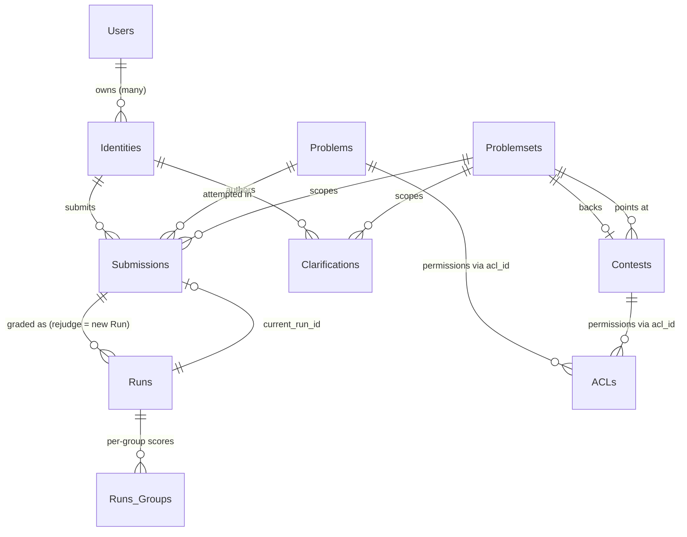

# Esquema de banco de dados

Quase tudo o que o omegaUp lembra entre as solicitações reside em um único banco de dados MySQL 8.0, acessado através do driver `mysqli` em [`frontend/server/src/MySQLConnection.php`](https://github.com/omegaup/omegaup/blob/main/frontend/server/src/MySQLConnection.php). No desenvolvimento, a conexão é padronizada para host `mysql:13306`, banco de dados `omegaup`, usuário `omegaup` com uma senha vazia — consulte `OMEGAUP_DB_HOST` / `OMEGAUP_DB_NAME` em [`frontend/server/config.default.php`](https://github.com/omegaup/omegaup/blob/main/frontend/server/config.default.php#L39). A porta é `13306` em vez do `3306` usual propositalmente, então um MySQL em contêiner nunca colide com um que você já pode executar no host.

O esquema atualmente contém **85 tabelas** (todas `ENGINE=InnoDB`, `CHARSET=utf8mb4 COLLATE=utf8mb4_0900_ai_ci`, portanto, as comparações de strings reconhecem Unicode e não diferenciam maiúsculas e minúsculas por padrão). Você quase nunca deve mexer nessas tabelas por meio de SQL bruto. Em vez disso, cada tabela tem um par correspondente de classes PHP — um **DAO** (Data Access Object) e um **VO** (Value Object) — e *essas classes são geradas a partir do esquema por um script*, não escrito à mão. Essa etapa de geração é o verdadeiro assunto desta página: entenda-a uma vez e as outras 84 tabelas deixam de ser misteriosas.

## De onde realmente vem o esquema

As tabelas não são definidas em um grande arquivo `CREATE TABLE` que você edita. Eles são a *repetição* de uma pilha de migrações somente anexadas em [`frontend/database/`](https://github.com/omegaup/omegaup/tree/main/frontend/database), cada uma chamada `NNNNN_description.sql` — `00001_initial_schema.sql`, `00002_timezone.sql`, `00003_roles.sql` e assim por diante até `00270_*` (atualmente cerca de 270 arquivos, e o número só aumenta). [`stuff/db-migrate.py`](https://github.com/omegaup/omegaup/blob/main/stuff/db-migrate.py) é o executor: `_scripts()` verifica esse diretório, mantém apenas os arquivos cuja primeira parte delimitada por `_` tem exatamente 5 dígitos, classifica-os por número de revisão e `migrate` aplica cada revisão mais recente do que a que o banco de dados já viu.

O que "já foi visto" é rastreado fora da banda em um banco de dados de metadados separado, `_omegaup_metadata`, em uma tabela chamada `Revision` — `id INTEGER PRIMARY KEY, applied TIMESTAMP DEFAULT CURRENT_TIMESTAMP, comment VARCHAR(50)` (criada por `ensure()` em [db-migrate.py#L381](https://github.com/omegaup/omegaup/blob/main/stuff/db-migrate.py#L381)). A coluna `comment` é um pequeno pedaço de memória institucional que vale a pena conhecer: é `migrate` para uma revisão aplicada normalmente, `skipped` para uma revisão deliberadamente não executada fora de um ambiente de desenvolvimento e `manual reset` quando alguém forçou o ponteiro de revisão com o comando `reset` para recuperar uma migração malfeita. Como os metadados residem em seu próprio banco de dados, explodir e recriar `omegaup` para testes nunca perde o registro de quais migrações são "aplicadas".

Então, como o plano [`frontend/database/schema.sql`](https://github.com/omegaup/omegaup/blob/main/frontend/database/schema.sql) — o arquivo de 1.468 linhas que esta página continua citando — permanece honesto? É *gerado*, nunca editado. `db-migrate.py schema` gera um banco de dados descartável `_omegaup_schema`, `purge` o reproduz, reproduz cada migração para ele com `update_metadata=False`, `mysqldump` transfere o resultado para stdout e descarta o banco de dados temporário (consulte [db-migrate.py#L451](https://github.com/omegaup/omegaup/blob/main/stuff/db-migrate.py#L451)). `schema.sql` é, portanto, um instantâneo fiel de "todas as migrações aplicadas em ordem", e é exatamente por isso que é seguro lê-lo como a fonte da verdade para definições de colunas, mesmo que ninguém digite essas instruções `CREATE TABLE` manualmente.

## De um `CREATE TABLE` para um par de classes PHP

Aqui está a cadeia que transforma uma tabela em código. [`stuff/update-dao.sh`](https://github.com/omegaup/omegaup/blob/main/stuff/update-dao.sh) copia `schema.sql` para `dao_schema.sql` (a cópia é a diferença entre o linter, portanto, uma cópia obsoleta não pode mascarar silenciosamente o desvio) e executa [`stuff/update-dao.py`](https://github.com/omegaup/omegaup/blob/main/stuff/update-dao.py), que lê o esquema e, para cada tabela, chama `dao_utils.generate_dao()` em [`stuff/dao_utils.py`](https://github.com/omegaup/omegaup/blob/main/stuff/dao_utils.py). Essa função faz três coisas em ordem: *analisa* o SQL com uma gramática `pyparsing` escrita à mão, agrupa cada tabela analisada em um objeto Python `Table` e renderiza dois modelos Jinja2 nela.

O analisador não é um regex - é uma gramática real (`_parse()` em [dao_utils.py#L92](https://github.com/omegaup/omegaup/blob/main/stuff/dao_utils.py#L92)) que entende `CREATE TABLE`, identificadores entre aspas crases, tipos de coluna com `(size)` e `UNSIGNED` opcionais, Cláusulas `NULL`/`NOT NULL`/`AUTO_INCREMENT`/`DEFAULT`/`COMMENT` e o zoológico de restrição completo (`PRIMARY KEY`, `UNIQUE KEY`, `FULLTEXT KEY`, `KEY` e `CONSTRAINT ... FOREIGN KEY ... REFERENCES ... ON DELETE/ON UPDATE`). Cada coluna se torna um objeto `Column` que decide seu tipo PHP a partir do tipo MySQL, e esse mapeamento é a regra de maior suporte em todo o pipeline:

| Tipo MySQL | PHP primitivo | Por que é importante |
|---|---|---|
| `tinyint` | `bool` | Um `tinyint(1)` como `verified` faz ida e volta como um PHP `bool` real, não `0`/`1`. |
| `timestamp`, `datetime` | `\OmegaUp\Timestamp` | Nunca uma string bruta - um objeto `\OmegaUp\Timestamp`, convertido via `DAO::fromMySQLTimestamp` / `toMySQLTimestamp`, portanto, todo o tempo é seguro para UTC. |
| `int` | `int` | por exemplo `submit_delay`, `runtime`, `memory`. |
| `double` | `float` | por exemplo `score`, `points_decay_factor`, `difficulty`. |
| qualquer outra coisa | `string` | `varchar`, `char`, `text`, `enum`, `set` pousam aqui. |

Há uma segunda regra mais sutil além disso (`Column.php_type`, [dao_utils.py#L42](https://github.com/omegaup/omegaup/blob/main/stuff/dao_utils.py#L42)): o tipo PHP de uma coluna recebe um prefixo `?` anulável **a menos** que tenha um `DEFAULT` ou seja `AUTO_INCREMENT`. O raciocínio é que uma coluna que o banco de dados irá preencher para você - uma chave primária de incremento automático ou uma coluna com um padrão - é aquela que seu código PHP pode legitimamente deixar sem definição, então o VO gerado fornece um valor inicial concreto em vez de `null`. É por isso que `run_id` é gerado como `public $run_id = 0;`, enquanto uma coluna anulável sem padrão é gerada como `public $whatever = null;`.

O *nome da classe* da tabela é apenas seu nome SQL com sublinhados removidos (`Table.class_name = tbl_name.replace('_', '')`), então `Problem_Of_The_Week` se torna `ProblemOfTheWeek` e a tabela `Groups_` com nome estranho se torna `Groups`. Finalmente, `generate_dao()` renderiza [`stuff/dao_templates/vo.php`](https://github.com/omegaup/omegaup/blob/main/stuff/dao_templates/vo.php) e [`stuff/dao_templates/dao.php`](https://github.com/omegaup/omegaup/blob/main/stuff/dao_templates/dao.php) uma vez por tabela, gravando os resultados em `frontend/server/src/DAO/VO/{Class}.php` e `frontend/server/src/DAO/Base/{Class}.php` respectivamente. Ambos os arquivos gerados abrem com um banner `!ATENCION!` alto: *"Este código é gerado automaticamente. Si lo modificado, tus cambios serão reemplazados"* - edite-os e suas alterações desaparecerão na próxima vez que alguém regenerar.

### O VO: uma linha digitada

Um **Value Object** é uma linha, nada mais. Para a tabela `Runs` o gerador emite [`frontend/server/src/DAO/VO/Runs.php`](https://github.com/omegaup/omegaup/blob/main/frontend/server/src/DAO/VO/Runs.php): uma classe `Runs` estendendo `\OmegaUp\DAO\VO\VO`, com um array `const FIELD_NAMES` (`'run_id' => true, 'submission_id' => true, ...`) e uma propriedade pública digitada por coluna. Seu construtor usa um `array $data` opcional, e a primeira coisa que ele faz é `array_diff_key($data, self::FIELD_NAMES)` e **joga** `'Unknown columns: ...'` se você entregar a ele uma chave que não é uma coluna real - então um erro de digitação como `new Runs(['verdcit' => 'AC'])` explode imediatamente em vez de silenciosamente não fazer nada. Por coluna, ele força o valor recebido exatamente pelo mapeamento acima (`intval` para ints, `boolval` para tinyints, `DAO::fromMySQLTimestamp` para carimbos de data e hora) e, para um padrão `CURRENT_TIMESTAMP`, ele preenche o campo com `new \OmegaUp\Timestamp(\OmegaUp\Time::get())` quando você não fornece um.

### A Base DAO: o CRUD que você nunca escreve

A **DAO Base** é a camada de consulta e é deliberadamente abstrata. [`frontend/server/src/DAO/Base/Runs.php`](https://github.com/omegaup/omegaup/blob/main/frontend/server/src/DAO/Base/Runs.php) é um `abstract class Runs` cujos métodos são todos `final public static`, cada um deles construindo uma string SQL parametrizada e executando-a por meio de `\OmegaUp\MySQLConnection::getInstance()` - nunca concatenando uma string de um valor em SQL, que é como a camada gerada é segura para injeção por construção. Quais métodos você obtém dependem do formato da tabela, e o modelo se ramifica nisso:

- **`getByPK(...)`** e **`existsByPK(...)`** são emitidos sempre que a tabela possui uma chave primária. `existsByPK` executa um `SELECT COUNT(*)` e está documentado como a opção mais barata "quando você não precisa dos campos" - procure-o quando você só se importa se há uma linha lá.
- **`update(...)`** é emitido somente quando há uma chave primária *e* pelo menos uma coluna sem chave (caso contrário, não há nada para `SET`).
- **`replace(...)`** é emitido apenas para tabelas que possuem uma chave primária, possuem colunas não-chave e *não* são de incremento automático - ou seja, tabelas nas quais você possui a chave, portanto, um `REPLACE INTO` pode significar significativamente "inserir ou substituir esta linha exata".
- **`create(...)`**, **`delete(...)`**, **`getAll(...)`** e **`countAll()`** completam o conjunto. `create()` executa o `INSERT` e, para uma tabela de incremento automático, grava o `Insert_ID()` novo de volta no campo-chave do VO dentro da mesma chamada, portanto, após `Runs::create($run)`, o `run_id` do objeto é preenchido. `getAll()` vem com um aviso contundente em seu próprio docblock - ele "consome memória proporcional ao número de linhas, então use-o apenas quando a tabela for pequena ou você passar parâmetros de paginação" - e fortalece seu `ORDER BY` executando o nome da coluna por meio de `escape()` e validando a direção em relação ao enum literal `['ASC', 'DESC']`.

### O DAO público: para onde vão as consultas escritas à mãoSe tudo fosse gerado, não haveria lugar para colocar uma consulta real. Esse é o terceiro arquivo: [`frontend/server/src/DAO/Runs.php`](https://github.com/omegaup/omegaup/blob/main/frontend/server/src/DAO/Runs.php) (sem `Base`), um `class Runs extends \OmegaUp\DAO\Base\Runs`. Ele herda todo o CRUD gerado e *adiciona* as consultas personalizadas, unidas e específicas do aplicativo que um gerador de esquema nunca poderia adivinhar - por exemplo, um CTE `WITH ssff AS (...)` que agrega contagens de feedback de envio entre `Submissions` e `Submission_Feedback`. A divisão é o ponto principal: regenerar o esquema reescreve `Base/Runs.php` e `VO/Runs.php` no atacado e **nunca** toca em seu `Runs.php` escrito à mão, para que o CRUD gerado e as consultas de relatórios ajustadas manualmente possam evoluir de forma independente. Atualmente são 85 classes `DAO/Base/`, 86 arquivos `DAO/VO/` (as 85 tabelas mais a classe base `VO.php` compartilhada) e 77 wrappers `DAO/` públicos.

### Mantendo o código gerado e confirmado em sincronia

Nada impede alguém de editar manualmente um arquivo gerado ou de adicionar uma migração e esquecer de regenerar – exceto o linter. [`stuff/dao_linter.py`](https://github.com/omegaup/omegaup/blob/main/stuff/dao_linter.py) reimporta `dao_utils`, regenera cada DAO/VO na memória de `frontend/database/dao_schema.sql` e compara o resultado com o que foi confirmado no disco. Se eles forem diferentes, o lint falhará – e é por isso que a regra prática após qualquer alteração de esquema é: execute `./stuff/db-migrate.py schema > frontend/database/schema.sql`, depois `./stuff/update-dao.sh` e, em seguida, confirme a migração, o esquema e os DAOs regenerados juntos. Caso contrário, a CI notará.

## As tabelas principais

Ler o esquema de cima a baixo é opressor; ler o punhado de tabelas que um envio realmente toca não é. Estes são os que suportam carga.

### Usuários e Identidades — por que existem dois

A coisa mais surpreendente sobre o esquema é que **um login não é um usuário**. Existem duas tabelas. `Users` ([schema.sql#L1397](https://github.com/omegaup/omegaup/blob/main/frontend/database/schema.sql#L1397), comentado *"Usuarios registrados"*) é a pessoa: `user_id` (PK), `main_identity_id`, `main_email_id`, `facebook_user_id`, a `git_token` (varchar(128), Argon2i-hashed, usado para acesso git a repositórios de problemas), `verified`, `birth_date`, um enum `preferred_language` listando todos os compiladores suportados e - refletindo os requisitos reais do produto - um cluster de colunas de verificação parental (`parental_verification_token`, `parent_email_verification_deadline`) que existem especificamente para lidar com registrantes menores de 13 anos.

Mas as *credenciais* residem em `Identities` ([schema.sql#L551](https://github.com/omegaup/omegaup/blob/main/frontend/database/schema.sql#L551)): `identity_id` (PK), `username` (`UNIQUE`), `password` (varchar(128), comentado como Argon2i ou Blowfish), `name`, `country_id`, `state_id`, `gender`, `current_identity_school_id` e um `user_id` anulável apontando para `Users`. As duas tabelas fazem referência uma à outra — `Users.main_identity_id → Identities` e `Identities.user_id → Users` — o que é deliberado: uma linha `Users` humana pode possuir vários `Identities`. É isso que torna possíveis as "identidades" de grupos/cursos, onde um professor fornece contas de login que são identidades sem serem usuários totalmente autônomos. A consequência prática você sentirá em todos os lugares a jusante: envios, esclarecimentos e placares são retirados do `identity_id`, **não** do `user_id`, porque aquilo que envia o código é uma identidade. Existe até um `FULLTEXT KEY ft_user_username (username, name)` no `Identities` para que a pesquisa do usuário atinja um índice em vez de digitalizar.

### Problemas — metadados aqui, conteúdo no git

`Problems` ([schema.sql#L755](https://github.com/omegaup/omegaup/blob/main/frontend/database/schema.sql#L755)) é um bom exemplo de banco de dados que deliberadamente *não* armazena os dados interessantes. A linha contém `problem_id` (PK), `acl_id` (a lista de controle de acesso - as permissões são fatoradas na tabela `ACLs` compartilhada em vez de duplicadas por problema), `title`, um `alias` seguro para URL (`varchar(32)`, `UNIQUE`), um int `visibility` cujo significado é escrito inline no comentário do esquema - **`-1` banido, `0` privado, `1` público, `2` recomendado** - além de contadores desnormalizados (`visits`, `submissions`, `accepted`) e duplicações de qualidade/dificuldade usadas para classificação. O que ele *não* contém é a declaração do problema, os casos de teste ou os validadores. Eles vivem em um repositório git (servido pelo gitserver separado, [github.com/omegaup/gitserver](https://github.com/omegaup/gitserver)), e a tabela armazena apenas dois ponteiros SHA-1 de 40 caracteres: `commit` (o commit publicado na ramificação `master` do problema, padrão `'published'`) e `current_version` (o hash da árvore do Ramo `private`). É por isso que um envio deve registrar *qual* versão do problema em que foi executado — o conteúdo do problema pode avançar independentemente da linha de metadados.

### Concursos e conjuntos de problemas — o contêiner polimórfico

Uma linha `Contests` ([schema.sql#L242](https://github.com/omegaup/omegaup/blob/main/frontend/database/schema.sql#L242)) carrega todos os botões que tornam a pontuação do concurso o que é, e os comentários do esquema documentam cada um para que você não precise adivinhar: `start_time`/`finish_time`; `window_length` (minutos que um competidor recebe ao entrar - `NULL` significa "toda a competição"); `admission_mode enum('private','registration','public')`; `scoreboard` (um int 0–100, a *porcentagem de tempo de competição* que o placar permanece visível); `points_decay_factor` (um `double`, "padrão 0 = sem decaimento; TopCoder é 0,7"); `submissions_gap` (padrão `60` — o mínimo de segundos entre dois envios para o mesmo problema); `penalty_type enum('contest_start','problem_open','runtime','none')`; `penalty_calc_policy enum('sum','max')`; e um `score_mode enum('partial','all_or_nothing','max_per_group')`.

Crucialmente, um Concurso **não** possui sua lista de problemas diretamente. Ele aponta para um `problemset_id`, e `Problemsets` ([schema.sql#L928](https://github.com/omegaup/omegaup/blob/main/frontend/database/schema.sql#L928)) é o conjunto polimórfico e compartilhado de problemas que um concurso, uma tarefa de curso ou uma entrevista reutilizam. Seu `type enum('Contest','Assignment','Interview')` mais três back-pointers anuláveis ​​(`contest_id`, `assignment_id`, `interview_id`) dizem que tipo é, e uma restrição `CHECK` impõe que *no máximo um* desses três esteja definido (`cast(... is not null) + ... <= 1`). Esta é a peça que une o modelo: como os envios e esclarecimentos fazem referência a `problemset_id` em vez de `contest_id`, exatamente o mesmo sistema de classificação e perguntas e respostas funciona independentemente de o problema ter sido tentado em um concurso, uma tarefa de classe ou uma entrevista de emprego - sem revestimento especial por superfície.

### Inscrições e execuções — o ato versus a avaliação

Esta é a segunda divisão que vale a pena internalizar e reflete a divisão Usuários/Identidades. Uma linha **`Submissions`** ([schema.sql#L1195](https://github.com/omegaup/omegaup/blob/main/frontend/database/schema.sql#L1195)) é o *ato* de enviar: `submission_id` (PK), um `guid` (`char(32)`, `UNIQUE` — o token de execução voltado para o público), `identity_id`, `problem_id`, um `problemset_id` anulável, o `language` em que foi escrito, `submit_delay` (documentado como os minutos desde o momento em que o problema foi aberto até o momento em que foi enviado - a matéria-prima para pontuação de penalidade), um `type enum('normal','test','disqualified')` e um `current_run_id` apontando para qualquer avaliação que conta atualmente. O código-fonte enviado e o ato em si são imutáveis.

Uma linha **`Runs`** ([schema.sql#L1049](https://github.com/omegaup/omegaup/blob/main/frontend/database/schema.sql#L1049)) é uma *avaliação* de um envio: `run_id` (PK), `submission_id` (FK), os hashes `version` e `commit` do problema contra o qual foi avaliado, um `status`, um `verdict` e os resultados medidos — `runtime` e `memory` (ints), `penalty`, `score` e `contest_score` (duplos) e `judged_by`. Um `UNIQUE KEY runs_versions (submission_id, version)` é o que torna o um para muitos significativo: **rejulgar** um envio em relação a uma nova versão do problema produz uma *nova* linha `Runs` em vez de substituir a antiga, e `Submissions.current_run_id` oscila para apontar o mais tardar. É assim que o omegaUp pode reavaliar um concurso antigo inteiro depois de consertar um caso de teste quebrado sem perder os veredictos originais. Detalhamentos por grupo de teste de uma execução ativa em `Runs_Groups` (`run_id`, `group_name`, `score`, `verdict`), uma linha por grupo de teste.

Duas enums são recorrentes em ambas as tabelas e vale a pena serem explicadas por completo. O ciclo de vida **`status`** passa por: `new`, `waiting`, `compiling`, `running`, `ready`, `uploading`. O **`verdict`** é um dos seguintes: `AC` (aceito), `PA` (parcialmente aceito), `PE` (erro de apresentação), `WA` (resposta errada), `TLE` (limite de tempo excedido), `OLE` (limite de saída excedido), `MLE` (limite de memória excedido), `RTE` (erro de tempo de execução), `RFE` (erro de função restrita), `CE` (erro de compilação), `JE` (erro de juiz) e `VE` (erro do validador). Uma execução recém-criada começa como `verdict = 'JE'`, `status = 'uploading'` — um espaço reservado pessimista que só se torna um veredicto real quando o avaliador apresenta um relatório.

### Esclarecimentos

`Clarifications` ([schema.sql#L159](https://github.com/omegaup/omegaup/blob/main/frontend/database/schema.sql#L159)) é o canal de perguntas e respostas do concurso: `clarification_id` (PK), `author_id` e um `receiver_id` anulável (ambos FKs para `Identities`, novamente digitados na identidade e não no usuário), o `message` e um opcional `answer`, um `problem_id` (anulável - um esclarecimento pode ser sobre o concurso em geral, em vez de um problema; o comentário do esquema observa que ele deve idealmente ser roteado para o criador do problema ou para o proprietário do concurso quando não vinculado), o `problemset_id` ao qual pertence e um sinalizador `public` cujo padrão é `0`. Esse sinalizador codifica uma regra real: *"apenas os esclarecimentos que o solucionador de problemas marca como publicáveis ​​aparecem na lista que todos podem ver"* - portanto, uma resposta privada a um concorrente permanece privada, a menos que seja explicitamente promovida.

## Um envio, de ponta a ponta, em chamadas DAOPara ver a camada fazendo seu trabalho, siga um caminho real: [`\OmegaUp\Controllers\Run::apiCreate`](https://github.com/omegaup/omegaup/blob/main/frontend/server/src/Controllers/Run.php#L415) (a classe é `Run`, não `RunController` — omegaUp descarta o sufixo `Controller`). Depois de validar a solicitação, ele constrói os dois VOs manualmente - `new \OmegaUp\DAO\VO\Submissions([...])` e `new \OmegaUp\DAO\VO\Runs([... 'status' => 'uploading', 'verdict' => 'JE'])` ([Run.php#L533](https://github.com/omegaup/omegaup/blob/main/frontend/server/src/Controllers/Run.php#L533)) - e então, *dentro* de `\OmegaUp\TransactionHelper::executeWithRetry` (que tenta novamente em caso de impasse), ele faz exatamente quatro chamadas DAO geradas em ordem ([Run.php#L564](https://github.com/omegaup/omegaup/blob/main/frontend/server/src/Controllers/Run.php#L564)):

```php
\OmegaUp\DAO\Submissions::create($submission);      // INSERT, back-fills $submission->submission_id
$run->submission_id = $submission->submission_id;   // wire the run to its submission
\OmegaUp\DAO\Runs::create($run);                     // INSERT, back-fills $run->run_id
$submission->current_run_id = $run->run_id;          // point the submission at its live evaluation
\OmegaUp\DAO\Submissions::update($submission);       // UPDATE to persist current_run_id
```
Em cada método existe um `final public static` gerado em `DAO/Base/`, executando um `INSERT`/`UPDATE` parametrizado. Somente *após* a confirmação desta transação o controlador entrega a execução ao avaliador Go externo com `\OmegaUp\Grader::getInstance()->grade($run, trim($source))` ([Run.php#L573](https://github.com/omegaup/omegaup/blob/main/frontend/server/src/Controllers/Run.php#L573)) - a linha existe e é durável antes de qualquer tentativa de avaliação, portanto, um soluço do avaliador nunca pode perder um envio. O `verdict` permanece `JE` e `status` permanece `uploading` no banco de dados até que o avaliador reporte e a execução seja atualizada no local.

## Relacionamentos em resumo


## Documentação Relacionada

- **[Padrões de banco de dados](../development/database-patterns.md)** — como os controladores realmente usam a camada DAO/VO no dia a dia
- **[Arquitetura de back-end](backend.md)** — onde a camada DAO fica no ciclo de vida da solicitação
- **[Comandos úteis](../development/useful-commands.md)** — as invocações `db-migrate.py` e `update-dao.sh` em um só lugar
