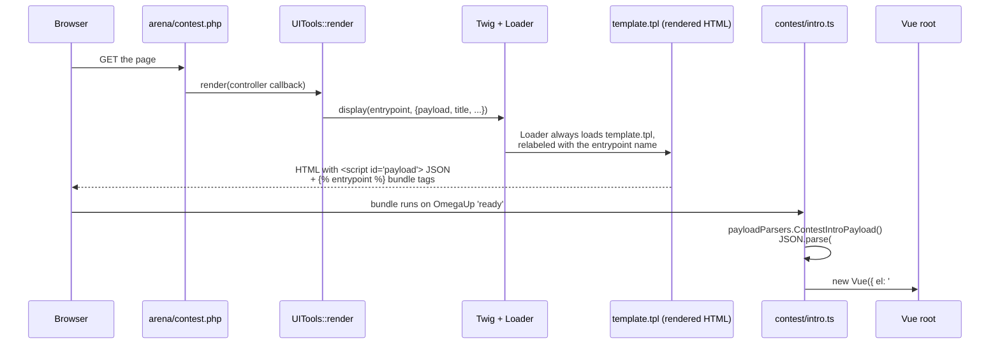

# Arquitetura de front-end

Cada página omegaUp que você já carregou é, nos bastidores, exatamente o mesmo arquivo HTML. Existe precisamente **um** modelo renderizado pelo servidor em todo o aplicativo — `frontend/templates/template.tpl` — e ele é renderizado para a arena do concurso, o editor de problemas, o placar, os painéis de administração, tudo. O que muda de página para página não é o shell HTML, mas duas coisas que o shell carrega: um blob de JSON inserido em uma tag `<script>` e qual pacote compilado do Vue a página puxa. Esse shell passa para o Vue, o Vue lê o JSON e, a partir desse ponto, a página é um aplicativo de página única. Esta é toda a arquitetura em uma frase, e o restante desta página explica por que ela funciona dessa maneira e como uma solicitação real flui por ela.

Se você leu notas mais antigas que descrevem uma migração do Smarty para Vue em andamento, exclua esse modelo mental: essa migração está **concluída**. A base de código atualmente contém 257 componentes de arquivo único `.vue` e 414 arquivos `.ts` em exatamente um aplicativo `.tpl` – a renderização da página é essencialmente 100% Vue. A única migração que ainda está genuinamente em andamento é **Vue 2 → Vue 3**; o aplicativo é executado no Vue 2.7.16 hoje, e os diretórios `vue-upgrade-tool/` e `vue-js-tutorial/` de nível raiz são a estrutura para esse eventual salto.

## Pilha de tecnologia

Fixamos deliberadamente cada um deles; trate as versões como atuais, mas mutáveis ​​e verifique `package.json` antes de assumir.

| Camada | Tecnologia | Versão (atualmente) | Por que está aqui |
|-------|-----------|--------------------|-------------|
| Modelagem de shell de servidor | Galho | 3 (`twig/twig ^3.0`) | Renderiza o shell HTML único e injeta a carga útil JSON + tags de ponto de entrada. **Não** Smarty – Smarty se foi. |
| Estrutura de IU | Vue.js | 2.7.16 | Componentes de arquivo único, API de opções via `vue-property-decorator` / `vuex-class`. |
| Idioma | Datilografado | 4.4.4 | Modo `strict` em todas as fontes `.ts` e `.vue`. |
| Gestão do Estado | Vuex | 3 | Armazenamentos por recurso (por exemplo, a lista de execução da arena, o IDE do avaliador). |
| Estrutura CSS | Bootstrap + bootstrap-vue | 4.6.0 + 2.21.2 | **Bootstrap 4**, não 5 — `bootstrap-vue` suporta apenas Bootstrap 4. |
| Ferramenta de construção | Webpack | 5 | Um pacote por ponto de entrada de página, além de um bloco de tempo de execução `omegaup` compartilhado. |
| Gráficos / editores | Highcharts, CodeMirror, Mônaco | — | Placares e o editor de código. |
| Testes unitários | Brincadeira (ts-brincadeira) | 26 | Testes de componentes e auxiliares com `shallowMount`. |
| Testes E2E | Cipreste | 15,7 | 10 arquivos de especificações em `cypress/e2e/*.cy.ts`. |
| Oficina de componentes | Livro de histórias | 7.6 | `storybook dev -p 6006`; a cobertura é escassa (atualmente cerca de 10 histórias para 257 componentes). |

## Onde fica o código

Cada arquivo `.vue` primário reside em `frontend/www/js/omegaup/`, e 248 dos 257 deles ficam especificamente em [`frontend/www/js/omegaup/components/`](https://github.com/omegaup/omegaup/tree/main/frontend/www/js/omegaup/components) organizado por recurso (`components/contest/`, `components/problem/`, `components/course/` e assim por diante). **Não** diretório `frontend/www/js/components` — se você procurar componentes um nível acima, não os encontrará.

Junto com os componentes estão os módulos **entrypoint**: pequenos arquivos `.ts` como [`frontend/www/js/omegaup/contest/intro.ts`](https://github.com/omegaup/omegaup/blob/main/frontend/www/js/omegaup/contest/intro.ts) ou `arena/contest_contestant.ts` cujo único trabalho é inicializar uma página - ler a carga útil, conectar manipuladores de eventos, montar uma instância raiz do Vue. Eles são a cola entre o JSON do servidor e a árvore de componentes, e cada um é registrado como um Webpack nomeado `entry` em [`webpack.config-frontend.js`](https://github.com/omegaup/omegaup/blob/main/webpack.config-frontend.js) (`arena_contest_contestant`, `contest_intro`, `badge_details`,…, atualmente bem mais de uma centena deles).

Mais dois arquivos nesse diretório são especiais porque **você nunca deve editá-los manualmente**:

- [`frontend/www/js/omegaup/api_types.ts`](https://github.com/omegaup/omegaup/blob/main/frontend/www/js/omegaup/api_types.ts) (~232 KB) — cada formato DAO, cada tipo de mensagem de solicitação/resposta e o `payloadParsers` que decodifica as cargas úteis do servidor.
- [`frontend/www/js/omegaup/api.ts`](https://github.com/omegaup/omegaup/blob/main/frontend/www/js/omegaup/api.ts) (~77 KB) — uma função digitada para cada endpoint de API.

Ambos abrem com a linha `// generated by frontend/server/cmd/APITool.php. DO NOT EDIT.` — eles são regenerados a partir dos controladores PHP, e voltaremos ao motivo pelo qual isso é importante no final.

## Um pedido, de ponta a ponta

Vamos rastrear uma página real – a tela de introdução do concurso que um usuário vê antes de entrar em um concurso – desde a URL até um componente Vue montado. Cada etapa nomeia o símbolo real que a executa.


### 1. O arquivo PHP da página é um esboço de três linhas

O navegador acessa um arquivo PHP físico, mas não faz quase nada. Aqui está [`frontend/www/arena/contest.php`](https://github.com/omegaup/omegaup/blob/main/frontend/www/arena/contest.php) na íntegra:

```php
<?php
namespace OmegaUp;
require_once(dirname(__DIR__, 2) . '/server/bootstrap.php');

\OmegaUp\UITools::render(
    fn (\OmegaUp\Request $r) => \OmegaUp\Controllers\Contest::getContestDetailsForTypeScript($r)
);
```
Ele extrai `bootstrap.php` (o mesmo bootstrap que a camada API usa) e depois chama `\OmegaUp\UITools::render()`, entregando a ele um encerramento que executa um método de controlador. Esse método — `getContestDetailsForTypeScript` — é aquele que faz o verdadeiro trabalho: valida o usuário, acessa o banco de dados por meio dos DAOs e retorna um array `RenderCallbackPayload`. Essa matriz possui duas chaves de suporte de carga: `entrypoint` (uma string como `"arena_contest_contestant"`) e `templateProperties.payload` (o `array<string, mixed>` de dados que a página precisa). A convenção de nomenclatura `...ForTypeScript` é a indicação: esses métodos de controlador existem especificamente para alimentar o front end TypeScript.

### 2. `UITools::render` constrói Twig e injeta a carga útil

Dentro de [`frontend/server/src/UITools.php`](https://github.com/omegaup/omegaup/blob/main/frontend/server/src/UITools.php), `render()` constrói um `\Twig\Environment` apoiado por nosso `\OmegaUp\Template\Loader` personalizado, extrai `entrypoint` e `payload` do valor de retorno do controlador, dobra a carga útil junto com um `headerPayload` compartilhado (o estado da barra de navegação/login que toda página precisa), formata a página localizada `title` e finalmente chama `$twig->display($entrypoint, $twigContext)`. A jogada crucial: passa o **nome do ponto de entrada** como o nome do modelo a ser exibido.

### 3. O Loader é uma isca e troca deliberada

Você esperaria que `$twig->display('arena_contest_contestant', ...)` procurasse um arquivo chamado `arena_contest_contestant`. Isso não acontece, e este é o pivô inteligente de todo o design. Nosso [`frontend/server/src/Template/Loader.php`](https://github.com/omegaup/omegaup/blob/main/frontend/server/src/Template/Loader.php) implementa `LoaderInterface` para que **não importa o nome solicitado, ele sempre lê o arquivo físico `templates/template.tpl`** — mas renomeia o `\Twig\Source` retornado com o nome solicitado:

```php
public function getSourceContext(string $name): \Twig\Source {
    $originalSource = $this->_loader->getSourceContext('template.tpl');
    return new \Twig\Source(
        $originalSource->getCode(),
        $name,                        // relabel with the entrypoint name
        $originalSource->getPath(),
    );
}
```
Assim, cada página renderiza o mesmo shell, e a *única* coisa que o shell aprende sobre "qual página sou eu" é esse nome renomeado. É por isso que existe um `.tpl` e não duzentos. (`isFresh()` também retorna `false` sempre que `OMEGAUP_ENVIRONMENT === 'development'`, para que o cache do modelo nunca atrapalhe enquanto você está hackeando - você verá suas alterações na atualização sem limpar nada.)

### 4. O shell serializa a carga útil e emite as tags do pacote

Agora [`frontend/templates/template.tpl`](https://github.com/omegaup/omegaup/blob/main/frontend/templates/template.tpl) é renderizado. Duas linhas em seu `<main>` são a transferência completa para o navegador:

```twig
<script type="text/json" id="payload">{{ payload|json_encode|raw }}</script>

<div id="main-container"></div>
```
A primeira linha é a ponte do PHP para o JavaScript: o array `payload` do controlador é `json_encode`d e é colocado literalmente em uma tag `<script type="text/json" id="payload">`. São *dados*, não código — o navegador não os executa, apenas os armazena no DOM para que o Vue os pegue. (O estado do cabeçalho/barra de navegação recebe o mesmo tratamento um nível acima no `<body>`, como `<script id="header-payload">`.)

A segunda linha, ``, é uma de nossas três tags Twig personalizadas. Seu compilador, [`EntrypointNode`](https://github.com/omegaup/omegaup/blob/main/frontend/server/src/Template/EntrypointNode.php), chama `$sourceContext->getName()` para recuperar o nome do ponto de entrada renomeado e emite as tags `<script src=...>` para o pacote Webpack correspondente (lendo a lista de dependências que o Webpack gravou em `www/js/dist/{entrypoint}.deps.json`). É por isso que o reetiquetagem na etapa 3 foi de suporte de carga: é o único canal que informa ao shell qual JavaScript carregar. Finalmente, o `<div id="main-container">` vazio é o ponto de montagem que o Vue assumirá.

Vale a pena conhecer as outras duas tags personalizadas no mesmo shell porque resolvem o cache. `` extrai o pedaço de tempo de execução compartilhado e `` anexa uma string de consulta que impede o cache: [`VersionHashNode`](https://github.com/omegaup/omegaup/blob/main/frontend/server/src/Template/VersionHashNode.php) calcula `substr(sha1(file_get_contents($path)), 0, 6)` e reescreve a URL para `/css/dist/omegaup_styles.css?ver=abc123`. O `?ver=` muda apenas quando o conteúdo do arquivo muda, portanto, os navegadores armazenam em cache agressivamente, mas nunca fornecem um pacote obsoleto após uma implantação.

### 5. O ponto de entrada lê a carga útil e monta o Vue

O pacote chega e agora [`contest/intro.ts`](https://github.com/omegaup/omegaup/blob/main/frontend/www/js/omegaup/contest/intro.ts) é executado. Ele espera por `OmegaUp.on('ready', …)` (disparado assim que o tempo de execução legado foi inicializado), decodifica o JSON no shell incorporado e monta uma instância raiz do Vue cujo único filho é o componente de nível superior da página:

```ts
OmegaUp.on('ready', () => {
  const payload = types.payloadParsers.ContestIntroPayload();
  const headerPayload = types.payloadParsers.CommonPayload();

  new Vue({
    el: '#main-container',
    components: { 'omegaup-contest-intro': contest_Intro },
    render: (createElement) =>
      createElement('omegaup-contest-intro', {
        props: { contest: payload.contest, isLoggedIn: headerPayload.isLoggedIn, /* … */ },
        on: {
          'open-contest': (request) =>
            api.Contest.open(request).then(() => window.location.reload()).catch(ui.apiError),
        },
      }),
  });
});
```
`types.payloadParsers.ContestIntroPayload()` é a metade decodificadora da ponte, gerada em `api_types.ts`. Ele faz `JSON.parse(document.getElementById('payload').innerText)` e então - criticamente - percorre o objeto analisado corrigindo os tipos que o fio não pode transportar: cada carimbo de data / hora chega como um número inteiro Unix, então o analisador o reidrata com `new Date(x * 1000)`. É por isso que o `JSON.parse` bruto nunca é chamado diretamente no código da página; o analisador gerado garante que um `contest.start_time` é um `Date` real, não um número. (`intro.ts` até reajusta `start_time` por meio de `time.remoteDate(...)` posteriormente, para que um usuário cujo relógio do laptop esteja distorcido ainda veja a contagem regressiva correta.)

A partir daqui é um SPA comum: o componente `<omegaup-contest-intro>` é renderizado e quando o usuário clica em "enter", o manipulador `open-contest` chama `api.Contest.open(...)` — um wrapper digitado de `api.ts` — e recarrega. Não há mais navegações de página inteira dentro de um determinado recurso; Vue possui o DOM sob `#main-container`.

## O cliente API gerado: por que você nunca escreve `fetch`

Olhe novamente para `api.Contest.open(...)`. Você não encontrará chamadas `fetch` escritas à mão ou formas de resposta digitadas à mão em nenhum lugar do código da página original, e isso é proposital. Tanto `api.ts` quanto `api_types.ts` são gerados por [`frontend/server/cmd/APITool.php`](https://github.com/omegaup/omegaup/blob/main/frontend/server/cmd/APITool.php), que lê os controladores PHP e suas anotações Psalm `@psalm-type` e emite TypeScript correspondente. Cada endpoint se torna uma chamada como:

```ts
export const Admin = {
  setMaintenanceMode: apiCall<
    messages.AdminSetMaintenanceModeRequest,
    messages.AdminSetMaintenanceModeResponse
  >('/api/admin/setMaintenanceMode/'),
};
```
O auxiliar `apiCall<Request, Response>(url)` retorna uma função que faz POST dos parâmetros, desembrulha o envelope `status`/`error` e rejeita com o erro do servidor (roteado por meio de `addError`/`ui.apiError`) em caso de falha. A recompensa de gerar em vez de escrever à mão: as assinaturas do controlador PHP são a única fonte da verdade. Altere o tipo de retorno de um controlador em PHP, gere novamente e o compilador TypeScript sinalizará imediatamente cada arquivo `.vue` e `.ts` que agora lê um campo que não existe mais - uma classe inteira de bugs de desvio de front-end/back-end se transforma em um erro de compilação antes que possa ser enviado. É exatamente por isso que o banner `DO NOT EDIT` está lá: qualquer edição manual é revertida silenciosamente na próxima vez que alguém executar o `APITool.php`.

## A construção

O Webpack 5 transforma tudo isso em ativos entregáveis. Cada entrada nomeada em [`webpack.config-frontend.js`](https://github.com/omegaup/omegaup/blob/main/webpack.config-frontend.js) se torna um pacote de saída, com o tempo de execução `omegaup` compartilhado (polyfills core-js, `regenerator-runtime`, o `omegaup-legacy.js` herdado) dividido para que cada página não o reenvie. `vue-loader` compila os componentes de arquivo único `.vue`, `ts-loader` lida com TypeScript e verificações de tipo `fork-ts-checker-webpack-plugin` em um processo paralelo para que um erro de tipo falhe na construção sem bloquear o pacote. Os scripts npm que você realmente executará são `yarn dev`/`yarn dev:watch` durante o desenvolvimento e `yarn build` para um pacote de produção; os arquivos `.deps.json` que o Webpack grava por entrada são o que a tag `` Twig lê posteriormente para saber quais tags `<script>` emitir para aquela página.

O estado que sobrevive a um único componente reside em lojas **Vuex 3** mantidas próximas de seus recursos - por exemplo, [`frontend/www/js/omegaup/arena/runsStore.ts`](https://github.com/omegaup/omegaup/blob/main/frontend/www/js/omegaup/arena/runsStore.ts) e `arena/problemStore.ts` na arena do concurso, e o IDE do avaliador tem seu próprio `grader/GraderStore.ts`. Não existe uma loja global única; cada recurso possui seu estado e mutações, o que mantém a migração Vue 2 → Vue 3 tratável, um recurso de cada vez.

## Teste e desenvolvimento de componentes

Três camadas protegem a parte frontal, cada uma com um alcance diferente. **Jest 26** (via `ts-jest`) executa testes de unidade rápidos, normalmente montando um único componente com `shallowMount` e afirmando sua saída renderizada ou eventos emitidos. **Cypress 15.7** utiliza um Chrome real contra uma pilha em execução para fluxos de ponta a ponta — as 10 especificações do `cypress/e2e/` cobrem as jornadas de suporte de carga (`contest`, `course`, `ide`, `problem_creator`, `navigation` e amigos) em vez de todas as telas. **Storybook 7.6** (`storybook dev -p 6006`) é onde você desenvolve um componente isoladamente, mas esteja avisado que a cobertura é atualmente escassa – cerca de 10 arquivos `.stories` para 257 componentes – então a maioria dos componentes ainda não tem história, e adicionar uma para qualquer coisa que você tocar é uma contribuição bem-vinda.

## Documentação Relacionada

- **[omegaUp Internals](internals.md)** — a jornada completa do lado do servidor que um envio leva após o front-end fazer o POST dele.
- **[Arquitetura de back-end](backend.md)** — os controladores PHP, `ApiCaller` e camada DAO/VO que produzem as cargas úteis e respostas de API que esta página consome.
- **[Guia de Componentes](../development/components.md)** — como construir e estruturar componentes de arquivo único Vue.
- **[Diretrizes de codificação](../development/coding-guidelines.md)** — as regras de TypeScript, Vue e estilo que aplicamos ao front-end (incluindo "Não use jQuery!").
