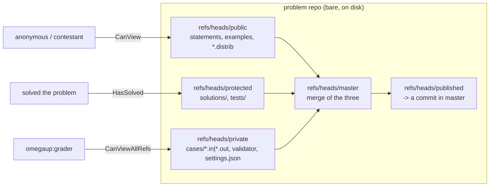
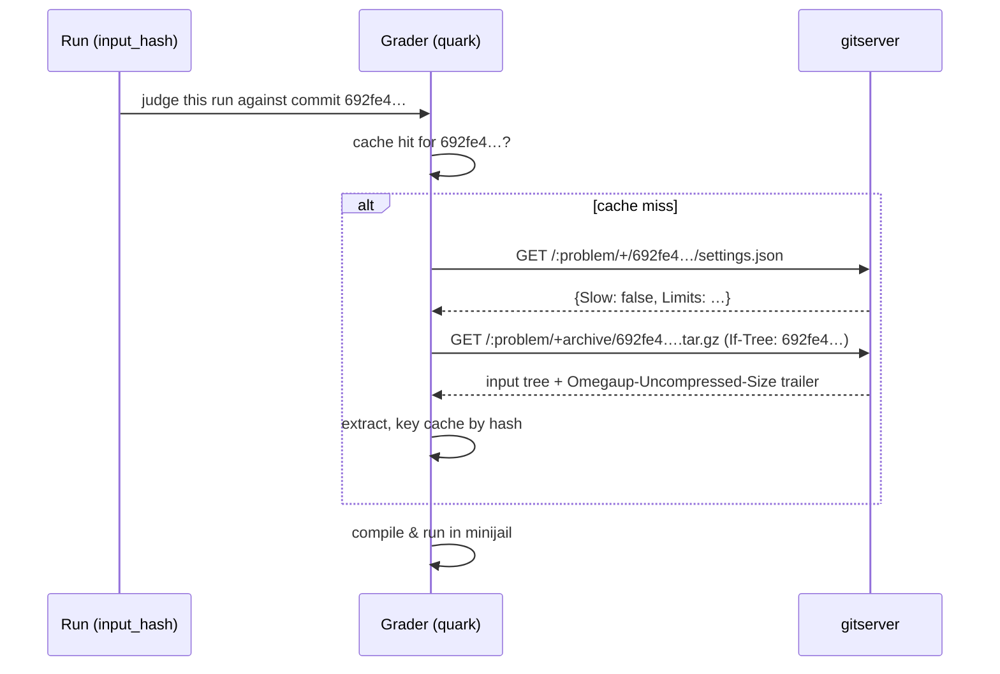

# Arquitetura GitServer

Cada problema no omegaUp é um repositório git. Não "apoiado por git", não "versionado com algo parecido com git" - um repositório libgit2 vazio real colocado em disco sob `/var/lib/omegaup/problems.git/<alias>`, com commits, refs, árvores e blobs. `gitserver` é o pequeno serviço Go ([github.com/omegaup/gitserver](https://github.com/omegaup/gitserver)) que possui esses repositórios e distribui seu conteúdo por HTTP, uma revisão por vez. O frontend PHP nunca toca diretamente nos diretórios `.git` e nem o avaliador; ambos passam pelo gitserver, porque o gitserver é o único processo que sabe como impor o layout da ramificação do problema, validar um upload e decidir quem tem permissão para ver os casos de teste secretos.

O modelo mental de uma linha: **gitserver é um front-end HTTP com reconhecimento de permissão para uma pilha de repositórios git simples, um repositório por problema.** Ele fala o protocolo git smart-HTTP (para que você possa literalmente `git clone` um problema se tiver um token) via [omegaup/githttp](https://github.com/omegaup/githttp), além de duas conveniências em camadas no topo - uma API de leitura "bonita" em `/+/…` para buscar um único blob ou árvore por revisão e uma API de upload `.zip` em `/git-upload-zip` que transforma um arquivo de problema em um commit bem formado.

## Por que git afinal

A razão pela qual o omegaUp armazena problemas no git em vez de em linhas do MySQL ou em um armazenamento de blobs se resume a três propriedades que um juiz precisa e que o git distribui gratuitamente.

**Imutabilidade e endereçamento de conteúdo.** Uma "versão" problemática é um hash de commit do git - um SHA-1 de 40 hexadecimais como `692fe483a2d61bff54cd52b9f9c959d977b1abe9`. Esse hash é derivado dos bytes exatos de cada caso de teste, instrução, validador e `settings.json` naquele momento. Dois problemas com conteúdos idênticos produzem o hash idêntico; alterar um único byte de um único arquivo `.out` produz um hash completamente diferente. Isso é o que torna o cache do avaliador correto: o avaliador codifica seu cache de entrada no disco por esse hash (consulte [`grader/input.go`](https://github.com/omegaup/quark/blob/main/grader/input.go)), para que possa confiar que `692fe4…` sempre significa os mesmos dados de teste para sempre e nunca precisa perguntar "minha cópia em cache está obsoleta?"

**Um histórico completo e auditável gratuitamente.** Como cada edição é um commit, toda a evolução de um problema — cada correção de instrução, cada caso de teste adicionado, cada limite de tempo reajustado — é um log git que pode ser percorrido. Reverter uma edição incorreta é apenas apontar uma referência para um commit mais antigo; não há "tabela de desfazer" para manter.

**Rejudge-on-change torna-se uma comparação de hash.** Quando um envio é julgado, omegaUp registra *cujo* commit ele foi julgado — as colunas `commit` e `version` na linha `Runs`, definidas de `$problem->commit` / `$problem->current_version` em [`Run.php`](https://github.com/omegaup/omegaup/blob/main/frontend/server/src/Controllers/Run.php) por volta de L534. Se o autor do problema corrigir posteriormente um caso de teste quebrado, o hash publicado muda e o omegaUp pode reavaliar exatamente as execuções cujo hash armazenado não corresponde mais ao atual. Sem versões endereçadas ao conteúdo, você teria que reavaliar tudo ou adivinhar.

## O layout da filial é o modelo de segurança

Aqui está a parte que o antigo wiki nunca deixou óbvio e a parte que você deve internalizar antes de qualquer coisa faz sentido: um repositório de problemas **não** é uma árvore com tudo dentro dela. Os arquivos do problema são deliberadamente divididos em várias ramificações por sensibilidade, e a divisão é imposta por uma tabela codificada de regexps de caminho, `DefaultCommitDescriptions`, em [`handler.go`](https://github.com/omegaup/gitserver/blob/main/handler.go#L122). Quando você carrega um zip problemático, o gitserver roteia cada arquivo para um branch de acordo com o que ele é:

- **`refs/heads/public`** — tudo o que um competidor pode ver: `statements/…` (o `.md`/`.markdown` mais imagens), `examples/`, os stubs interativos *distribuíveis* (`interactive/Main.distrib.*`), `validator.distrib.*` e `settings.distrib.json`. Este é o ramo que os usuários anônimos leem.
- **`refs/heads/protected`** — `solutions/…` e o diretório `tests/`. Visível para alguém que *resolveu* o problema, mas não para um competidor no meio da competição.
- **`refs/heads/private`** — o ingrediente secreto: `cases/*.in` e `cases/*.out` (os dados reais do juiz), o `interactive/Main.*` e `.idl` reais, o `validator.*` real e o `settings.json` oficial. Somente o avaliador e os administradores leram isso.
- **`refs/heads/master`** — a fusão dos três acima; o "estado atual do problema" canônico que a revisão aprova.
- **`refs/heads/published`** — um ponteiro para o commit específico do `master` que está atualmente ativo. gitserver se recusa a mover `published` para qualquer coisa que ainda não seja um commit acessível em `master` (`ErrPublishedNotFromMaster`, "published-must-point-to-commit-in-master", [`handler.go#L52`](https://github.com/omegaup/gitserver/blob/main/handler.go#L52)). Este é o limite "rascunho vs. ao vivo": você pode enviar novos commits para `master` o dia todo e nada muda para os concorrentes até que `published` seja avançado.

Mais dois namespaces de referência completam: **`refs/meta/config`** contém um único `config.json` que descreve o comportamento de publicação (`mirror` vs. `subdirectory`, [`handler.go#L1099`](https://github.com/omegaup/gitserver/blob/main/handler.go#L1099)), **`refs/meta/review`** contém dados de revisão de código (comentários, iterações, o razão) e edições pendentes sob revisão ao vivo em **`refs/changes/*`**. Qualquer push cuja referência de destino não seja nenhuma dessas é rejeitada imediatamente pela validação em [`handler.go#L1529`](https://github.com/omegaup/gitserver/blob/main/handler.go#L1529) — você não pode inventar uma ramificação.

A recompensa desse design é que o controle de acesso se reduz a *"quais referências esse chamador pode ver?"*, e essa decisão reside em uma função, `referenceDiscovery` em [`cmd/omegaup-gitserver/main.go`](https://github.com/omegaup/gitserver/blob/main/cmd/omegaup-gitserver/main.go): um chamador que `CanViewAllRefs` vê tudo; um chamador que apenas `HasSolved` também recebe `refs/heads/protected`; um chamador que `CanView` (um problema público) obtém `refs/heads/public`; todo mundo não vê nada. Um concorrente literalmente não pode buscar `cases/1.out` porque o ramo em que ele vive é invisível para ele durante a descoberta de referência – não é filtrado após o fato, apenas nunca é anunciado.


## Lendo um problema por revisão: o caminho do frontend

Quando o frontend precisa de um arquivo para resolver um problema - digamos, a instrução em espanhol para renderizar ou `settings.json` para mostrar os limites - ele **não** abre o repositório. Ele constrói um `\OmegaUp\ProblemArtifacts` e pede um caminho. A classe está em [`ProblemArtifacts.php`](https://github.com/omegaup/omegaup/blob/main/frontend/server/src/ProblemArtifacts.php), e seu construtor usa as duas coisas que identificam completamente um intervalo de bytes em todo esse sistema: o alias do problema e uma revisão, cujo **padrão é a string `'published'`** para que leituras comuns sempre vejam a versão ativa:

```php
$artifacts = new \OmegaUp\ProblemArtifacts($alias, /* revision */ 'published');
$statement = $artifacts->get('statements/es.markdown');
```
Nos bastidores, `ProblemArtifacts::get()` constrói um `GitServerBrowser` e atinge o URL bem lido, cujo formato vale a pena memorizar porque tudo é lido através dele:

```
GET  {OMEGAUP_GITSERVER_URL}/{alias}/+/{revision}/{path}
```
construído por `GitServerBrowser::buildShowURL()` como `OMEGAUP_GITSERVER_URL . "/{$alias}/+/{$revision}/{$path}"`. O padrão `OMEGAUP_GITSERVER_URL` é `http://localhost:33861` (porta `OMEGAUP_GITSERVER_PORT`, atualmente `33861`, de [`config.default.php#L62`](https://github.com/omegaup/omegaup/blob/main/frontend/server/config.default.php)). A revisão pode ser o `published` literal, um nome de ramificação ou um hash de commit concreto — o caminho do avaliador abaixo usa o formato hash. Existem construtores complementares para outras formas de leitura: `/{alias}/+archive/{revision}.zip` para download de árvore inteira e `/{alias}/+log/{revision}` para histórico.

O tratamento de erros é embutido e deliberado: `get()` lê o status HTTP cURL e qualquer coisa diferente de `200`, `403` ou `404` gera um `ServiceUnavailableException` (o gitserver provavelmente está inativo), enquanto um `403`/`404` se torna um `NotFoundException('resourceNotFound')`. Essa é a disciplina 403 versus 404 que você vê no omegaUp – uma referência privada responde como “não encontrado” em vez de “proibido”, então a própria existência de um arquivo oculto não é vazada. O navegador define tempos limite apertados (`CURLOPT_CONNECTTIMEOUT => 5`, `CURLOPT_TIMEOUT => 30`) para que um gitserver bloqueado não possa travar a renderização de uma página.

## Lendo um problema por revisão: o caminho do avaliador

O avaliador é o outro leitor e é a razão pela qual todo o esquema de endereçamento de conteúdo existe. Cada execução carrega um `input_hash` — o commit do problema contra o qual o envio está sendo julgado (consulte `common.Run` em [`common/run.go#L30`](https://github.com/omegaup/quark/blob/main/common/run.go)). Antes de poder executar o código, o avaliador precisa dos dados de teste daquela revisão exata e os busca diretamente no gitserver por hash. Duas solicitações fazem o trabalho, ambas em [`grader/input.go`](https://github.com/omegaup/quark/blob/main/grader/input.go):

```
GET {gitserverURL}/{problemName}/+/{inputHash}/settings.json      # is this problem "slow"?
GET {gitserverURL}/{problemName}/+archive/{inputHash}.tar.gz       # the whole input tree
```
`IsProblemSlow()` extrai apenas `settings.json` desse hash e lê o booleano `Slow` para decidir a qual fila a execução pertence; o resultado é memorizado em um cache global codificado por `problemName:inputHash`, portanto, um problema importante é solicitado no máximo uma vez por versão. `CreateArchiveFromGit()` então transmite `+archive/{inputHash}.tar.gz` para um arquivo local e envia um cabeçalho `If-Tree: {inputHash}` para que o gitserver possa entrar em curto-circuito se o avaliador já tiver essa árvore. A resposta ainda carrega o tamanho não compactado em um trailer `Omegaup-Uncompressed-Size` para que a niveladora possa testar o espaço em disco. Como a busca é por hash imutável, o avaliador pode — e faz — armazenar em cache a entrada extraída codificada por esse hash e reutilizá-la em cada envio para aquela versão do problema, recuperando apenas quando chega um envio para um hash que ele nunca viu.


## Escrevendo um problema: git-upload-zip e estratégias de mesclagem

Os autores não enviam git bruto - o frontend faz isso, em nome deles, por meio do endpoint zip-upload. `ProblemDeployer::commit()` em [`ProblemDeployer.php`](https://github.com/omegaup/omegaup/blob/main/frontend/server/src/ProblemDeployer.php) envia o arquivo do problema para:

```
POST {OMEGAUP_GITSERVER_URL}/{alias}/git-upload-zip?message=…&acceptsSubmissions=…&updatePublished=…&mergeStrategy=…[&create=true][&settings=…]
```
com `Content-Type: application/zip` e o corpo do zip transmitido via `CURLOPT_INFILE`. O `ZipHandler` do gitserver ([`ziphandler.go`](https://github.com/omegaup/gitserver/blob/main/ziphandler.go)) descompacta o arquivo, roteia cada arquivo para sua ramificação por meio da tabela `DefaultCommitDescriptions` acima, cria os commits divididos e - se for `updatePublished=true` - avança `published` para o novo `master`. O frontend impõe um `ZIP_MAX_SIZE` de `100 * 1024 * 1024` (100 MiB) *antes* de enviar ([`ProblemDeployer.php#L13`](https://github.com/omegaup/omegaup/blob/main/frontend/server/src/ProblemDeployer.php)) e define `CURLOPT_TIMEOUT => 120`, correspondido no servidor por um `writeTimeout` de `2 * time.Minute` em [`main.go`](https://github.com/omegaup/gitserver/blob/main/cmd/omegaup-gitserver/main.go) (com o comentário "O front-end tem um tempo limite de 120 segundos") — os dois lados são deliberadamente mantidos em sincronia para que nenhum desista enquanto o outro ainda está funcionando.

O parâmetro de consulta `mergeStrategy` escolhe como a árvore carregada se combina com o que já está lá e mapeia para os quatro valores `ZipMergeStrategy` em [`ziphandler.go#L47`](https://github.com/omegaup/gitserver/blob/main/ziphandler.go):

- **`ours`** — mantém a árvore do commit pai como está; ignore a versão zip dos arquivos. Usado quando você está tocando apenas em um subconjunto.
- **`theirs`** — pegue a árvore do zip no atacado; o oposto de `ours` (e, como observa o código, algo simples para o qual o git não tem equivalente direto).
- **`statements-ours`** — leve o zip para qualquer lugar *exceto* `statements/`, que é preservado do pai (para que o reenvio dos dados de teste não atrapalhe as instruções traduzidas).
- **`recursive-theirs`** — mescla os arquivos zip na árvore existente recursivamente, o zip vence os conflitos.

`ProblemDeployer::commit()` escolhe entre eles com base no tipo de edição que está acontecendo. Uma proteção inline que vale a pena conhecer: um upload de `theirs` que chega sem instruções ou sem a instrução padrão em espanhol é rejeitado (`ErrNoStatements` / `ErrNoEsStatement`, [`handler.go#L104`](https://github.com/omegaup/gitserver/blob/main/handler.go#L104)) – cada problema deve enviar pelo menos uma instrução `es`.

## Autenticação: três esquemas, uma decisão no escopo do problema

Cada solicitação ao gitserver é autenticada e autorizada *por problema*, em `authorize()` em [`cmd/omegaup-gitserver/auth.go`](https://github.com/omegaup/gitserver/blob/main/cmd/omegaup-gitserver/auth.go). Existem três maneiras de provar quem você é, tentadas em ordem:

1. **Token Bearer PASETO** (o caminho normal). O frontend cria um PASETO público v2 com `SecurityTools::getGitserverAuthorizationHeader()` → `getGitserverAuthorizationToken()` em [`SecurityTools.php`](https://github.com/omegaup/omegaup/blob/main/frontend/server/src/SecurityTools.php): emissor `omegaUp frontend`, assunto = o nome de usuário, uma declaração `problem` nomeando o único problema para o qual é adequado e uma expiração de **5 minutos** (`PT5M`). gitserver verifica com o ed25519 `PublicKey` do frontend da configuração e lê de volta o nome de usuário e o problema (`parseBearerToken`). De curta duração e com escopo de problema, um token vazado é quase inútil.
2. **Token `OmegaUpSharedSecret`** — um segredo pré-compartilhado, respeitado apenas quando `AllowSecretTokenAuthentication` está ativado. O cabeçalho é `Authorization: OmegaUpSharedSecret {token} {username}`. É assim que o avaliador se autentica como usuário especial `omegaup:grader` e como o frontend pode se autenticar como `omegaup:system` sem PKI.
3. **HTTP Basic** com o **git token** pessoal do usuário — é isso que torna um `git clone` humano um problema. A senha é verificada em relação ao hash argon2id `git_token` armazenado na linha `Users` (`verifyArgon2idHash`, consultando `Users`/`Identities` por nome de usuário). Se o nome de usuário básico não corresponder ao assunto do token, a autenticação falhará gravemente.

Qualquer que seja o esquema vencedor, o `username` resultante é então mapeado para privilégios. As identidades especiais são codificadas e devem ser lembradas: **`omegaup:system`** é o frontend e é totalmente confiável (`IsSystem`, `IsAdmin`, pode visualizar todas as referências e editar); **`omegaup:grader`** obtém acesso somente leitura a *todas* as referências de cada problema (para que possa sempre alcançar `private`); **`omegaup:health`** é uma identidade somente localhost usada pela investigação de prontidão no repositório `:testproblem`. Todos os outros - um usuário realmente logado - acionam um retorno de chamada: gitserver POSTs para o `FrontendAuthorizationProblemRequestURL` do frontend (padrão `https://omegaup.com/api/authorization/problem/`) com o nome de usuário e o alias do problema, e o frontend responde com os booleanos `has_solved` / `is_admin` / `can_view` / `can_edit` que acionam o `referenceDiscovery`. gitserver, em outras palavras, delega a pergunta "este usuário tem direitos sobre este problema?" pergunta de volta ao monorepo do PHP, porque é onde realmente residem as ACLs, a associação ao concurso e a inscrição no curso. Uma incompatibilidade entre a declaração `problem` do token e o repositório que está sendo endereçado é um `403` ("Nome do problema incompatível") — um token para um problema nunca pode ler outro.

## Problemas lentos e o limite de tempo rígido

O gitserver não apenas armazena problemas, ele também decide no *momento do commit* se um problema é "lento" e impõe um teto absoluto. Duas constantes em [`ziphandler.go#L35`](https://github.com/omegaup/gitserver/blob/main/ziphandler.go) controlam isso: `slowQueueThresholdDuration = 30s` e `OverallWallTimeHardLimit = 60s`. Quando um commit é criado, `isSlow()` em [`handler.go#L281`](https://github.com/omegaup/gitserver/blob/main/handler.go) estima o tempo de execução total do pior caso — número de vezes de casos (`TimeLimit + ExtraWallTime`, mais os próprios limites do validador se for um validador personalizado) — e sinaliza o problema `Slow` em seu `settings.json` se essa estimativa atingir o limite de 30 segundos; esse booleano é exatamente o que o avaliador lê para encaminhar a corrida para uma fila lenta. E se o `OverallWallTimeLimit` configurado para um problema exceder o limite rígido de 60 segundos *e* o tempo de execução máximo estimado também excederia, o upload será rejeitado imediatamente com `ErrSlowRejected` ("rejeitado lentamente") - você não pode cometer um problema que possa monopolizar um executor indefinidamente, porque o limite é incorporado ao artefato em vez de confiável no momento do julgamento. Há também uma proteção `objectLimit = 10000` ([`handler.go#L34`](https://github.com/omegaup/gitserver/blob/main/handler.go)) / `ErrTooManyObjects` plana para que um packfile patológico não possa explodir o servidor.

## Superfície operacional

**Roteamento.** O `muxGitHandler.ServeHTTP` em [`main.go`](https://github.com/omegaup/gitserver/blob/main/cmd/omegaup-gitserver/main.go) é um despachante enrolado manualmente no caminho da URL: `/health/*` → manipulador de saúde, `/metrics` → Prometheus, qualquer coisa que termine em `git-upload-zip` ou `rename-repository` → o `ZipHandler`, todo o resto → o git manipulador smart-HTTP (que atende tanto às leituras bonitas do `/+/…` quanto ao protocolo bruto `git-upload-pack`/`git-receive-pack`).

**Portas e armazenamento.** O servidor escuta em `Port` (padrão `33861`) e, se `PprofPort` (padrão `33862`) estiver definido, expõe o `net/http/pprof` de Go apenas no host local — essa segunda porta é um endpoint de criação de perfil, **não** uma porta de protocolo git separada. `RootPath` é padronizado como `/var/lib/omegaup/problems.git` e não deve estar vazio ou o processo será encerrado na inicialização. Veja os padrões em [`cmd/omegaup-gitserver/config.go`](https://github.com/omegaup/gitserver/blob/main/cmd/omegaup-gitserver/config.go).

```json
{
  "Gitserver": {
    "RootPath": "/var/lib/omegaup/problems.git",
    "PublicKey": "gKEg5JlIOA1BsIxETZYhjd+ZGchY/rZeQM0GheAWvXw=",
    "Port": 33861,
    "PprofPort": 33862,
    "LibinteractivePath": "/usr/share/java/libinteractive.jar",
    "AllowDirectPushToMaster": false,
    "FrontendAuthorizationProblemRequestURL": "https://omegaup.com/api/authorization/problem/",
    "UseS3": false
  }
}
```
**Durabilidade via S3 (opcional).** Quando `UseS3` é verdadeiro, o gitserver registra um `PostUpdateCallback` que, após qualquer alteração de ref ou packfile, espelha os arquivos atualizados até o bucket `omegaup-problems` S3 ([`main.go`](https://github.com/omegaup/gitserver/blob/main/cmd/omegaup-gitserver/main.go)). Ele ignora deliberadamente os repositórios cujo caminho contém `temp.` - esses são repositórios de trabalho pré-comprometidos que são carregados apenas depois de finalizados.

**Verificação de integridade.** A sondagem de prontidão (`/health/ready`, [`health.go`](https://github.com/omegaup/gitserver/blob/main/health.go)) é um exercício genuíno de ponta a ponta, não um ping: se o repositório `:testproblem` especial ainda não existir, ele o cria POSTando um `testproblem.zip` incorporado via `git-upload-zip`, então faz um `GET /:testproblem/+/private/settings.json` real como `omegaup:health` e reporta apenas integridade em um `200`. Portanto, uma verificação de prontidão verde significa que todo o caminho de leitura * e * gravação realmente funciona, incluindo disco e libgit2.

**libinteractive.** Para problemas interativos, o gitserver desembolsa para `libinteractive.jar` (caminho de `LibinteractivePath`) no momento da confirmação para compilar o `.idl` em stubs por idioma — consulte [`libinteractive.go`](https://github.com/omegaup/gitserver/blob/main/libinteractive.go). É por isso que a imagem Docker instala um JRE.

## Mapa de origem

O serviço é pequeno o suficiente para caber na sua cabeça. Lendo [github.com/omegaup/gitserver](https://github.com/omegaup/gitserver):

- [`cmd/omegaup-gitserver/main.go`](https://github.com/omegaup/gitserver/blob/main/cmd/omegaup-gitserver/main.go) — entrada de processo, muxing HTTP, `referenceDiscovery`, pós-atualização S3, desligamento normal.
- [`cmd/omegaup-gitserver/auth.go`](https://github.com/omegaup/gitserver/blob/main/cmd/omegaup-gitserver/auth.go) — os três esquemas de autenticação, verificação PASETO/argon2, as identidades especiais e o retorno de chamada de autorização de frontend.
- [`cmd/omegaup-gitserver/config.go`](https://github.com/omegaup/gitserver/blob/main/cmd/omegaup-gitserver/config.go) — estrutura de configuração e padrões.
- [`handler.go`](https://github.com/omegaup/gitserver/blob/main/handler.go) — o layout da filial (`DefaultCommitDescriptions`), validação de commit, geração de `settings.json`, detecção de problemas lentos, estruturas de revisão/razão.
- [`ziphandler.go`](https://github.com/omegaup/gitserver/blob/main/ziphandler.go) — upload zip, as quatro estratégias de mesclagem, publicação.
- [`health.go`](https://github.com/omegaup/gitserver/blob/main/health.go), [`metrics.go`](https://github.com/omegaup/gitserver/blob/main/metrics.go), [`libinteractive.go`](https://github.com/omegaup/gitserver/blob/main/libinteractive.go), [`normalizer.go`](https://github.com/omegaup/gitserver/blob/main/normalizer.go) — as peças de suporte.

E do lado dos chamadores: [`ProblemArtifacts.php`](https://github.com/omegaup/omegaup/blob/main/frontend/server/src/ProblemArtifacts.php) + [`SecurityTools.php`](https://github.com/omegaup/omegaup/blob/main/frontend/server/src/SecurityTools.php) + [`ProblemDeployer.php`](https://github.com/omegaup/omegaup/blob/main/frontend/server/src/ProblemDeployer.php) no monorepo PHP e [`grader/input.go`](https://github.com/omegaup/quark/blob/main/grader/input.go) no quark.

## Documentação Relacionada

- **[Modern Internals](grader-internals.md)** — como o avaliador consome revisões e armazena em cache as entradas por hash.
- **[API de problemas](../reference/api.md)** — os endpoints de gerenciamento de problemas que impulsionam o `ProblemDeployer`.
- **[Controle de versões de problemas](../features/problem-versioning.md)** — a visão voltada para o autor de rascunhos, publicações e histórico.
