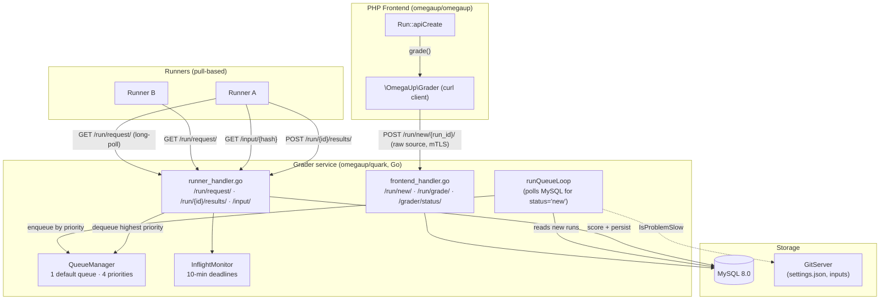

# Internos da niveladora

O Grader é a peça que transforma "o usuário pressionou Enviar" em um veredicto e um
pontuação. **não** faz parte do monorepo PHP: é um serviço independente escrito
em Go que reside no [`omegaup/quark`](https://github.com/omegaup/quark)
repositório, em [`cmd/omegaup-grader/`](https://github.com/omegaup/quark/tree/main/cmd/omegaup-grader)
(o serviço HTTP) e [`grader/`](https://github.com/omegaup/quark/tree/main/grader)
(a fila e o núcleo de pontuação). Tudo o que o backend do PHP sabe sobre ele cabe em um
cliente HTTP fino único, [`\OmegaUp\Grader`](https://github.com/omegaup/omegaup/blob/main/frontend/server/src/Grader.php),
que não faz nada além de `curl` JSON e bytes brutos para o serviço Go e lê
as respostas de volta. Se você está procurando a fila, o despachante, o
validadores, ou o sandbox no código PHP, você não os encontrará - eles são todos
no lado Go. Esta página rastreia um envio real a partir do momento em que o PHP o entrega
sair, passar pela fila, sair para um Corredor e voltar para uma pontuação, nomeando o exato
funções e constantes que executam cada etapa.

O modelo mental de uma linha: **o avaliador é uma fila de prioridade com um TLS mútuo
porta da frente, um despachante baseado em pull para Runners e um redutor de token/pontuação que
transforma os resultados por caso em uma nota final.** O trabalho pesado de realmente
compilar e executar código pertence ao [Runner](runner-internals.md); o
A motoniveladora orquestra e “lava as mãos” de uma corrida no instante em que ela é segura
na fila.

## O limite de confiança: TLS mútuo sobre HTTPS

Cada byte entre o PHP e o Grader atravessa um caminho criptografado e mutuamente autenticado.
canal, e isso é deliberado e não decorativo - em uma programação inicial
concurso, alguém sentou-se na rede e farejou o tráfego de envios, então a regra se tornou
que *toda* a comunicação com os subsistemas do omegaUp é criptografada. O cliente PHP em
[`Grader::curlRequestSingle`](https://github.com/omegaup/omegaup/blob/main/frontend/server/src/Grader.php)
apresenta um certificado de cliente (`/etc/omegaup/frontend/certificate.pem` com chave
`/etc/omegaup/frontend/key.pem`), pinos `CURLOPT_SSL_VERIFYPEER => true` e
`CURLOPT_SSL_VERIFYHOST => 2`, força `CURL_SSLVERSION_TLSv1_2` e fala com
`OMEGAUP_GRADER_URL` — cujo padrão é `https://localhost:21680`
([config.default.php L61](https://github.com/omegaup/omegaup/blob/main/frontend/server/config.default.php)).
No lado Go, os conjuntos de ouvintes voltados para o aluno
`ClientAuth: tls.RequireAndVerifyClientCert`, então um Runner (ou frontend) que
não pode apresentar um certificado válido é recusado no handshake TLS, antes de qualquer
manipulador é executado. O tempo limite de conexão é de 5 segundos e o tempo limite geral da solicitação é
30 segundos; um pequeno conjunto de falhas transitórias (`SSL connection timeout`,
`Connection timed out`, `HTTP/2 stream`, `INTERNAL_ERROR`, …) são repetidas até
3 vezes com espera exponencial (1s, 2s, 4s limitado a 5s), porque um momento
um aluno ocupado não deve ser reprovado imediatamente no envio.

!!! observe "Verruga histórica: `--insecure`"
    A receita original do console para cutucar a niveladora manualmente usada
    `curl --url https://localhost:21680/grade/ -d '{"id": 12345}' -E frontend/omegaup.pem --cacert ssl/omegaup-ca.crt --insecure`.
    O `--insecure` só estava lá porque o certificado do aluno não trazia
    seu nome de host no CN; dê `localhost` enquanto o CN e a bandeira desaparecem.
    O cliente PHP de produção não o utiliza — ele verifica estritamente o peer.

## Visão geral da arquitetura


## Recebendo uma corrida

A jornada começa no controlador PHP. Quando um concorrente se inscreve, a solicitação
pousa em [`\OmegaUp\Controllers\Run::apiCreate`](https://github.com/omegaup/omegaup/blob/main/frontend/server/src/Controllers/Run.php)
(a classe é `Run`, não `RunController` — omegaUp elimina o sufixo `Controller`),
por volta da linha 415. `apiCreate` faz toda a proteção que deve acontecer enquanto ainda
tem a sessão do usuário: valida os campos obrigatórios, verifica concurso
associação e o limite de tempo, impõe o limite de taxa de envio, insere um
Linha `Runs`, e só então - por volta da linha 573 - mãos livres com uma única chamada:

```php
\OmegaUp\Grader::getInstance()->grade($run, trim($source));
```
`grade()` é quase anticlimático. Ele faz POST do **código-fonte bruto** (não JSON —
`REQUEST_MODE_RAW`, `Content-Type: application/octet-stream`) para
`OMEGAUP_GRADER_URL . "/run/new/{$run->run_id}/"`. Observe o que ele *não* envia:
sem configurações de problemas, sem casos de teste, sem metadados de linguagem no corpo. A corrida
o número inteiro `run_id` no caminho da URL é a transferência completa. Todo o resto, o
O Grader procurará por si mesmo. Este é o momento do “aluno lava as mãos” para
o frontend - assim que esse curl retornar 200, o PHP estará pronto e a página do concorrente
recorre às pesquisas para obter o veredicto.

No lado Go, o [manipulador `/run/new/`](https://github.com/omegaup/quark/blob/main/cmd/omegaup-grader/frontend_handler.go)
analisa o `run_id` fora do caminho e chama `newRunInfoFromID`, que é onde
o Grader acessa diretamente o próprio MySQL (ele mantém seu próprio
Conexão `go-sql-driver/mysql` — o Grader é um cliente de banco de dados de primeira classe,
não apenas um consumidor de tabelas do PHP). Essa consulta se junta a `Execuções → Envios →
Problemas`, and left-joins `Problemset_Problems → Concursos`, para montar um
`RunInfo`: o envio `guid`, o alias do concurso, o ID do conjunto de problemas, o
`penalty_type`, o `score_mode`, o idioma, o alias do problema, o prêmio
pontos e o hash `version` de entrada do problema. Se o concurso não tiver `score_mode`
o padrão da niveladora é `"partial"`; se não houver pontos de competição, ele define um
`MaxScore` de `1/1`. O manipulador então grava a fonte bruta no artefato
armazenar via `artifacts.Submissions.PutSource(...)`, marca a execução `status = 'new'`
no banco de dados e abre um canal Go:

```go
select {
case newRuns <- struct{}{}:
default:
}
```
Esse envio sem bloqueio é todo o mecanismo de notificação: ele cutuca o
loop de fundo ativado sem nunca bloquear o manipulador HTTP, e se o loop for
já agendado para execução, a ramificação `default` descarta o empurrão redundante no
chão. O manipulador retorna `200 OK` e o envio agora é o loop da fila
problema.

### Os rejuízes tomam uma porta diferente

A reclassificação de um conjunto existente de execuções não passa pelo `/run/new/`. O lado do PHP
chama [`Grader::rejudge`](https://github.com/omegaup/omegaup/blob/main/frontend/server/src/Grader.php),
quais POSTs JSON — `{"run_ids": [...], "rejudge": true, "debug": false}` — para
`/run/grade/`. Esse manipulador é ainda mais fino: ele registra a solicitação e dispara o
mesmo empurrão do canal `newRuns`, porque o frontend já inverteu essas execuções '
`status` de volta para `'new'` no MySQL. O sinalizador `debug` está conectado ao `false` com
a `TODO(lhchavez): Re-enable with ACLs` — rejulgamentos de depuração (que permitem
AddressSanitizer em C/C++ e precisa de um perfil de sandbox relaxado) são bloqueados até
terras de controle de acesso adequadas.

## O modelo de fila

É aqui que a implementação atual diverge acentuadamente do antigo wiki, e
de tudo que ainda fala em “oito filas”. **A moderna niveladora Go tem um
fila única chamada `default` com quatro níveis de prioridade - não oito nomeados
filas.** As quatro prioridades são definidas em
[`grader/queue.go`](https://github.com/omegaup/quark/blob/main/grader/queue.go)
como `QueueCount = 4`:

- **`QueuePriorityHigh`** (0) — reservado para *reenfileiramentos*. Quando uma corrida tem que ser
  tentada novamente (um Runner ficou em silêncio ou retornou um erro transitório), ele volta
  na frente para não ficar atrás de uma nova lista de pendências que já esperou
  através de uma vez.
- **`QueuePriorityNormal`** (1) — o padrão para uma execução recém-enviada em um
  problema de velocidade normal.
- **`QueuePriorityLow`** (2) — usado para problemas *lentos* e para *rejulgamentos*, então
  que um rejulgamento em massa ou um problema patologicamente lento não pode monopolizar o
  Corredores e competidores ao vivo famintos.
- **`QueuePriorityEphemeral`** (3) — a prioridade mais baixa, para "executar este código"
  playground (a passagem efêmera). Essas corridas também são especiais porque
  seus resultados **não** persistem no sistema de arquivos; eles vivem em um
  cache de tamanho fixo, último a entrar, primeiro a sair (`EphemeralRunManager`) que despeja o
  execução mais antiga quando exceder seu limite de tamanho.

!!! info "Para onde foram as 'oito filas'"
    A arquitetura clássica omegaUp (backend v1) realmente modelou isso como oito
    filas nomeadas — `urgente`, `urgente lento`, `concurso`, `concurso lento`,
    `normal`, `normal lento`, `rejudge`, `rejudge lento` — onde o "lento"
    filas (lentas) continham problemas que, na pior das hipóteses, demoram mais de 30 segundos
    devolver um TLE, e apenas uma fração dos corredores (em um ponto, 50%) poderia servir
    para que não monopolizassem a capacidade. O aluno atual desmorona tudo
    esquema nesses quatro níveis de prioridade mais um booleano `slow` por problema.
    Atualmente, **não** limite de 50% de corredores no código; "lento" simplesmente rebaixa um
    executado de Normal para Baixa prioridade. Se você estiver precisando do antigo
    justiça refinada, é onde viveu e o que fez.

!!! info "Histórico: avaliadores remotos e suas pequenas listas de espera"
    No back-end v1, o Grader não despachava apenas para Runners locais - depois
    examinando o registro do banco de dados de uma execução, ele poderia redirecioná-lo para a fila do
    *avaliador apropriado* (`local`, `uva`, `pku`, `tju`, `livearchive`, `spoj`),
    encaminhando a inscrição para um juiz on-line externo e mudando seu status para
    "esperando" antes de "lavar as mãos" e voltar a esperar pelo próximo
    notificação. Esses avaliadores remotos tinham listas de espera deliberadamente pequenas: **UVa
    permitidos ~10 slots simultâneos e todos os outros julgam apenas um, porque nenhum deles
    eles já previram que os consumidores automatizados de suas informações
    existem ** - então o omegaUp se restringiu muito para evitar abusar deles. Uma vez remoto
    juiz respondeu com sentença, cabendo ao avaliador a atualização do
    registro da execução e configuração dos campos correspondentes. A moderna niveladora Go em
    [`omegaup/quark`](https://github.com/omegaup/quark) foi desenvolvido com base em locais
    Corredores; se você está se perguntando onde morava a rota do juiz remoto e por que é
    a simultaneidade foi limitada de forma tão agressiva, é isso - e o limite era externo,
    restrição inegociável, não uma escolha omegaUp para otimizar.

### O que torna um problema "lento"

O rebaixamento para prioridade baixa é impulsionado pelo `IsProblemSlow` em
[`grader/input.go`](https://github.com/omegaup/quark/blob/main/grader/input.go).
Ele busca `settings.json` para o problema em seu hash de entrada exato do
GitServer (`GET {gitserver}/{problem}/+/{hash}/settings.json`, com 15 segundos
timeout) e lê o campo `Slow bool`. Porque perguntar ao GitServer por
o envio seria um desperdício, a resposta é memorizada em um cache LRU de 4 MiB
(`slowProblemCache`) digitado por `problemName:inputHash` — o hash está na chave
propósito, para que a edição de um problema (que produz um novo hash de entrada) corretamente
invalida a decisão lenta/rápida armazenada em cache.

### O loop de execução e como a prioridade é realmente atribuída

O trabalhador em segundo plano é `runQueueLoop`
([frontend_handler.go](https://github.com/omegaup/quark/blob/main/cmd/omegaup-grader/frontend_handler.go)).
A primeira coisa que ele faz na inicialização é um `UPDATE` de recuperação de falhas: qualquer execução cujo
`status != 'ready'` é redefinido para `'new'`, de modo que as corridas capturadas em vôo por uma motoniveladora
restart são simplesmente recolocados na fila em vez de perdidos. Em seguida, ele registra o máximo atual
`submission_id` e blocos no canal `newRuns`.

Cada vez que ele é ativado, ele drena *todo* o trabalho pendente: ele executa repetidamente o `SELECT`s com
`status = 'new'` em lotes de `LIMIT 128` até que não reste nada de novo. A consulta é
um `UNION` deliberado de duas metades - novos envios (`submission_id > max`) e
antigos (`submission_id <= max`) — ambos ordenados por `submission_id ASC, run_id
ASC`. Esta ordem é a política de justiça em ação:

```go
priority := grader.QueuePriorityNormal
if maxSubmissionID >= dbRun.submissionID {
    priority = grader.QueuePriorityLow   // an old submission => rejudge => Low
} else {
    maxSubmissionID = dbRun.submissionID // a genuinely new submission
}
```
Uma submissão cujo id esteja igual ou abaixo do máximo registrado só poderá ser um rejulgamento de
algo que já existia, então é colocado em prioridade **Baixa**; um verdadeiramente novo
o envio permanece em **Normal** (ou é reduzido para Baixo anteriormente por `IsProblemSlow`).
A origem da execução é então lida no armazenamento de artefatos e o `RunContext` é
enfileirado via `injectRun`. Enfileirar é uma operação de bloqueio para execuções normais
(`enqueueBlocking`) — o loop irá esperar se o canal da fila estiver momentaneamente cheio,
então a contrapressão é real e nada é eliminado silenciosamente; corridas efêmeras, por
Em contraste, use o `enqueue` sem bloqueio e desista imediatamente se seu
canal está cheio.

## Leitura da integridade da fila: `/grader/status/`

A única janela que o PHP tem para tudo isso é o endpoint `/grader/status/`, que
o [`\OmegaUp\Controllers\Grader::apiStatus`](https://github.com/omegaup/omegaup/blob/main/frontend/server/src/Controllers/Grader.php)
método surge chamando `\OmegaUp\Grader::getInstance()->status()`. O PHP
o cliente modela a resposta com um tipo de Salmo que é o contrato oficial
para os cinco campos de seu interesse:

```php
/** @psalm-type GraderStatus=array{
 *   status: string,
 *   broadcaster_sockets: int,
 *   embedded_runner: bool,
 *   queue: array{
 *     running: list<array{name: string, id: int}>,
 *     run_queue_length: int,
 *     runner_queue_length: int,
 *     runners: list<string>
 *   }
 * } */
```
Lendo cada campo em relação ao que o manipulador Go realmente calcula:

- **`status`** — `"ok"` quando a niveladora está saudável. O cliente PHP trata qualquer coisa
  caso contrário, como um erro grave e lançado, portanto, um status não `ok` nunca atinge um chamador como
  dados.
- **`broadcaster_sockets`** (int) — quantos clientes WebSocket existem atualmente
  conectado à [Emissora](broadcaster.md) e, portanto, ouvindo ao vivo
  atualizações do veredicto. Este é o seu indicador de quantas pessoas estão assistindo a um placar
  agora mesmo.
- **`embedded_runner`** (bool) — se este processo de avaliação também está executando um
  Corredor em processo. Em implantações pequenas ou de desenvolvimento, o avaliador pode hospedar seu
  próprio Runner para que você não precise levantar um separado; na produção isso é
  normalmente `false` e Runners são máquinas separadas.
- **`queue.run_queue_length`** (int) — o backlog total: o manipulador Go soma o
  comprimentos de todos os quatro níveis de prioridade em cada fila
  (`GetQueueInfo`) neste número. Este é o mais útil "é o
  aluno atrás?" métrica.
- **`queue.running`** (lista) — as execuções em voo, cada uma como `{name, id}` onde
  `name` é o Runner que o contém e `id` é o ID da execução. Isso vem direto
  do mapa ao vivo do `InflightMonitor`, então é exatamente o conjunto de execuções que
  foram despachados, mas ainda não foram relatados.
- **`queue.runner_queue_length`** (int) e **`queue.runners`** (lista) — o
  Lado ocioso da imagem: quantos corredores estão estacionados esperando pelo trabalho
  e seus nomes.

!!! aviso "Leia os campos de status na compilação em execução"
    O ponto final de status é uma superfície de relatório e quais campos um determinado avaliador
    build totalmente preenchido pode desviar - no manipulador atual
    ([frontend_handler.go](https://github.com/omegaup/quark/blob/main/cmd/omegaup-grader/frontend_handler.go))
    `run_queue_length` e `running` são sempre preenchidos, enquanto `runners` é emitido
    como uma lista vazia. Trate o tipo de Salmo como o contrato estável e o manipulador
    como a fonte da verdade para o que está acontecendo agora; se você está construindo
    alertando além disso, confirme com o avaliador implantado em vez de
    assumindo que todos os campos não estão vazios.

## Envio para corredores

Uma coisa crucial a ser internalizada: **o avaliador não empurra o trabalho para os corredores; o
Os corredores puxam. ** Cada corredor faz pesquisas longas `GET /run/request/`
([runner_handler.go](https://github.com/omegaup/quark/blob/main/cmd/omegaup-grader/runner_handler.go)),
e o manipulador chama `runs.GetRun(runnerName, InflightMonitor, closeNotifier)`,
que **bloqueia** até que uma execução esteja disponível. É por isso que não há despacho
afinidade digna de nota - o corredor que perguntar em seguida terá a próxima corrida, que é
round-robin por construção. (A afinidade existia em algum momento anterior no omegaUp
história e não seria complicado adicionar de volta, mas o modelo pull faz com que o
coisa simples é o padrão.)

Quando uma execução está disponível, o `GetRun` verifica os quatro canais prioritários **em ordem,
o mais alto primeiro** (`for i := range queue.runs`), portanto, um reenfileiramento de alta prioridade sempre
ultrapassa o Trabalho Normal, que ultrapassa o Baixo, que ultrapassa o Efêmero. Ele retira da fila
o `RunContext`, registra-o no `InflightMonitor` via `monitor.Add` e
transmite `runCtx.RunInfo.Run` de volta ao Runner como JSON - a linguagem, o problema
nome e o hash de entrada que o Runner precisa buscar. A identidade do Corredor vem
de `peerName`, que lê o CN de seu certificado TLS de cliente (ou um cabeçalho em
modo inseguro/dev), e o avaliador também registra o IP público do corredor
(cabeçalho `OmegaUp-Runner-PublicIP`, porta 6060) para que o Prometheus possa raspá-lo.

O Runner então busca as entradas de teste das quais ainda não foram armazenadas em cache
`GET /input/{problemName}/{hash}` — um SHA-1 de 40 caracteres hexadecimais da entrada `.zip` —
e publica os resultados de volta no `POST /run/{attemptID}/results/`.

### O prazo de 10 minutos e a lógica de reenfileiramento

No momento em que uma corrida é distribuída, o `InflightMonitor`
([avaliador/queue.go](https://github.com/omegaup/quark/blob/main/grader/queue.go))
começa a observá-lo, porque um Runner pode travar, perder sua rede ou ficar preso, e um
a corrida perdida não deve desaparecer silenciosamente. `NewInflightMonitor` define um
`connectTimeout` e um `readyTimeout` de **10 minutos**. Uma goroutine os impõe
em duas etapas: primeiro o Corredor tem 10 minutos para *conectar-se* (para realmente voltar
e comece a buscar a entrada/atingir o endpoint de resultados), depois mais 10 minutos
para chegar *pronto* (postar seus resultados). Se qualquer um dos temporizadores disparar antes do correspondente
sinal, `monitor.timeout` presume que o Runner está morto e chama `runCtx.Requeue(false)`.

`Requeue` é onde reside o orçamento de novas tentativas. Cada `RunContext` começa com
`attemptsLeft = MaxGradeRetries`, cujo padrão é **3**
([common/context.go](https://github.com/omegaup/quark/blob/main/common/context.go)).
Cada reenfileiramento o diminui e:

- Se as tentativas persistirem, a execução será colocada novamente na fila em **`QueuePriorityHigh`** para que
  pula a linha – já esperou uma vez e não deve ser punido duas vezes.
- Se `attemptsLeft` atingir 0, a execução será *abandonada*: um `QueueEventTypeAbandoned`
  o evento é registrado e o contexto é fechado. Ele errou muitas vezes, então
  o aluno desiste em vez de ficar repetindo para sempre.
- Se até mesmo a fila de alta prioridade estiver cheia, o avaliador ficará sem opções e
  também desiste - é melhor abandonar uma corrida ruidosamente do que ocupar toda a fila.

Há um caso especial sutil. Quando um Runner *com sucesso* retorna um `JE`
(Erro do Juiz) veredicto - em vez de ficar em silêncio - a falha *pode* ser
transitório, então `Requeue` é chamado com `lastAttempt = true`, que fixa
`attemptsLeft = 1`: a execução é repetida no máximo uma vez e nada mais. O
distinção é importante: um corredor que relatou “Eu tentei e quebrou” é tratado mais
conservadoramente do que um corredor que simplesmente desapareceu. O próprio endpoint de resultados
é embalado em um `http.TimeoutHandler` com um tempo limite de **5 minutos**, portanto, um único
o upload de resultados que trava não pode ocupar um manipulador indefinidamente.

## Validadores: transformando resultados em uma pontuação por caso

Depois que um Runner executa o programa do competidor em um caso de teste, algum componente é executado.
para decidir se a saída está *correta*. Essa decisão é trabalho do validador, e
omegaUp oferece cinco tipos de validadores, escolhidos por problema através do `Validator.Name`
campo em `settings.json`
([common/problemsettings.go](https://github.com/omegaup/quark/blob/main/common/problemsettings.go)):

- **`token`** — o padrão. Tanto os resultados esperados quanto os do concorrente são divididos
  em tokens separados por espaços em branco e comparados **exatamente**, token por token
  (`a == b`). Uma nova linha final ou um espaço extra entre os tokens não importa
  porque o espaço em branco é o delimitador, mas `Hello` e `hello` são diferentes e
  `42` e `42.0` são diferentes.
- **`token-caseless`** — idêntico a `token`, mas a comparação por token usa
  `strings.EqualFold`, então `YES`, `Yes` e `yes` combinam. Use-o quando o
  a declaração do problema não diferencia maiúsculas de minúsculas em relação à resposta.
- **`token-numeric`** — os tokens são comparados como números de ponto flutuante dentro de um
  tolerância, que é o que você deseja para problemas cuja resposta é um número real e
  onde `3.0000001` deve contar como `3`. A tolerância padrão
  (`DefaultValidatorTolerance`) é **1e-6**, substituível por problema. O
  comparação em `tokenNumericEquals` aceita um par se eles forem exatamente iguais, ou
  a diferença absoluta é `<= 1.5 * tolerance`, ou a diferença *relativa* é
  `<= tolerance` — com uma ramificação dedicada próxima de zero (usando o menor valor normal
  double, `2.2250738585072014e-308`) para que as comparações com 0 não explodam.
  Se exatamente um dos dois tokens não for analisado como float, eles serão desiguais; se
  *ambos* falham na análise, eles são tratados como iguais (duas peças de ruído não numérico
  na mesma posição não são uma diferença discriminatória).
- **`custom`** — para problemas onde a correção não pode ser reduzida a um token
  correspondência (múltiplas respostas válidas, julgamento especial, crédito parcial por fórmula).
  Um programa validador fornecido com o problema é compilado e executado **no
  sandbox, uma vez por caso **, alimentava a produção do competidor mais a entrada original
  e resultado esperado; qualquer número de ponto flutuante impresso em stdout se torna
  a pontuação desse case, fixada na faixa `[0, 1]`. Se o arquivo `.out` original for
  faltando, o avaliador substitui `/dev/null` em vez de reprovar; se o
  erros do próprio programa validador, o veredicto do caso se torna `VE` (Erro do Validador).
- **`literal`** — um validador de propósito especial (usado principalmente pelo efêmero
  problemas de execução e entrada literal) que lê o primeiro token do competidor
  diretamente como a pontuação no `[0, 1]`, nenhuma comparação foi realizada.

O mecanismo de comparação é `CalculateScore` em
[runner/validator.go](https://github.com/omegaup/quark/blob/main/runner/validator.go).
Para os validadores de token, ele percorre ambas as saídas em sincronia com um tokenizador
(verificação de tokens que não sejam espaços em branco ou tokens numéricos para `token-numeric`): no
primeira posição onde os dois discordam – inclusive quando um produto fica sem
tokens antes do outro - produz um `TokenMismatch` registrando o esperado e
tokens do competidor e a pontuação do caso **0**. Se ambos os fluxos chegarem ao final sem
incompatibilidade, o caso pontua **1** (`big.NewRat(1, 1)`). As pontuações são mantidas tão exatas
racionais (`math/big.Rat`) por toda parte, não flutuantes, então aritmética de peso nunca
acumula erro de arredondamento.

## Pontuação e agrupamento

Uma pontuação por caso de 0 ou 1 (ou uma fração, para validadores personalizados) é apenas o valor bruto
material. A nota final vem da agregação de casos em **grupos** e da combinação
pontuações de grupo com pesos, no loop de validação do `runner.go`
([agregação de executor/validador](https://github.com/omegaup/quark/blob/main/runner/runner.go)).**A associação ao grupo é derivada do nome do caso: o grupo é tudo antes
o primeiro `.`. ** Este é literalmente `strings.SplitN(caseName, ".", 2)[0]` em
`CaseWeightMapping.AddCaseName`
([common/problemsettings.go](https://github.com/omegaup/quark/blob/main/common/problemsettings.go)),
então um caso chamado `group1.case2` pertence ao grupo `group1` e `sample.0`,
`sample.1` ambos pertencem a `sample`. Nenhum arquivo de mapeamento separado é necessário — o
convenção de nomenclatura *é* o agrupamento.

**Os pesos são normalizados para somar 1.** Cada caixa carrega um `Weight` (um `big.Rat`);
o loop primeiro calcula `totalWeightFactor = 1 / Σ(weights)`, e se os pesos
soma a zero, ele volta para um fator de 1. A contribuição de cada caso é então
`weight * totalWeightFactor`, então todos os casos do problema sempre somam 1
independentemente dos pesos absolutos que você escreveu. Um layout estilo `/testplan` pode atribuir
pesos explícitos por grupo e por caso; ausente, cada caso assume como padrão um
peso de 1, o que faz com que a normalização degenere para o familiar `1/N` para N
casos com pesos iguais.

Dentro de um grupo, a pontuação é regida por um **`GroupScorePolicy`**:

- **`sum-if-not-zero`** (o padrão, também escrito como uma string vazia) — o grupo
  pontuação é a **soma** ponderada das pontuações de seus casos. Caso de acumulação de crédito parcial
  por caso.
- **`min`** — a pontuação do grupo é a pontuação **mínima** do caso vezes o peso do grupo;
  o caso mais fraco define todo o grupo. Este é o "tudo ou nada dentro de um
  política de grupo" para problemas em que a resolução de 9 de 10 subcasos não deveria render 90% do
  o grupo.

Há uma barreira rígida no topo da política: um grupo só ganha pontos se **cada
caso, ele realmente funcionou de forma limpa. ** O loop rastreia um sinalizador `correct` que é
inicializado para `true` e alterado para `false` no momento em que qualquer caso no grupo tiver um
veredicto de sandbox diferente de `OK` (um TLE, um RTE, uma falha - qualquer coisa que signifique o
programa não produziu uma saída comparável). Se `correct` for falso no final de
o grupo, esse grupo contribui com **0**, independentemente da pontuação dos outros casos.

Os veredictos por caso ficam fora da pontuação: um caso que obteve pontuação 1 torna-se `AC`,
um caso com pontuação 0 torna-se `WA` e qualquer coisa intermediária torna-se `PA` (parcial).
O veredicto geral da corrida é o **pior** veredicto em todos os seus casos, onde
"pior" é definido pela posição em `VerdictList`
([common/problemsettings.go](https://github.com/omegaup/quark/blob/main/common/problemsettings.go)):

```
JE, CE, RFE, VE, MLE, RTE, TLE, OLE, WA, PA, AC, OK
```
`worseVerdict(a, b)` simplesmente retorna o que aparecer primeiro na lista, então um
único caso `TLE` arrasta o veredicto de toda a execução para `TLE`, mesmo que todos os outros casos
era `AC`. No final, uma corrida que saiu `OK` em todos os lugares é promovida para `AC`
com pontuação exatamente 1, e uma corrida que se dirigia para `PA`, mas terminou com zero
a pontuação total é corrigida para `WA`. A nota numérica final é
`ContestScore = MaxScore * Score`, onde `MaxScore` é o valor do ponto do problema em
esse concurso (ou 1 fora de um concurso) e `Score` é o `[0, 1]` normalizado
agregado.

Se uma corrida pode ganhar crédito parcial no nível da competição é definido pelo
`score_mode` do concurso, que o aluno leu em `newRunInfoFromID` e
o padrão é `"partial"` — um concurso configurado para mudanças de pontuação do tipo tudo ou nada
como essas parciais por grupo se transformam no que o competidor finalmente recebe.

## Devolvendo o veredicto e transmitindo

Quando um Runner posta em `/run/{attemptID}/results/` e o resultado é final (não um
tentar novamente), a motoniveladora fecha o `RunContext` (`runCtx.Close()`), que serializa o
`RunResult` para `details.json`, compacta os logs da execução para `logs.txt.gz` no
armazenamento de artefato, remove a execução do `InflightMonitor` e dispara o
pós-processador. O pós-processador atualiza a linha da execução no MySQL para `status =
'pronto'` com o veredicto e pontuação, e a [Emissora](broadcaster.md) empurra
o novo veredicto para cada cliente WebSocket conectado - que é precisamente o
população contada por `broadcaster_sockets` no endpoint de status. PHP, que tem
pesquisado desde o retorno de `apiCreate`, vê a linha `ready` e mostra o
concorrente seu resultado.

## Configuração

O Grader é configurado por meio da configuração JSON incorporada ao
Serviço [`omegaup/quark`](https://github.com/omegaup/quark) (aparecido em
desenvolvimento através da imagem Docker `omegaup/backend`). As configurações que você mais
toque frequentemente:

| Configuração | Significado |
|--------|---------|
| `Grader.BroadcasterURL` | Onde os veredictos finalizados são enviados para atualizações ao vivo. |
| `Grader.GitserverURL` | O GitServer do qual o avaliador lê `settings.json` e insere. |
| `Grader.GitserverAuthorization` | O cabeçalho `Authorization` secreto compartilhado para solicitações GitServer. |
| `Grader.MaxGradeRetries` | Reenfileirar o orçamento por execução antes de abandonar (padrão **3**). |
| `Runner.PreserveFiles` | Mantenha os arquivos de trabalho por execução após a avaliação — apenas para depuração. |

No lado do PHP os únicos botões são `OMEGAUP_GRADER_URL` (padrão
`https://localhost:21680`) e `OMEGAUP_GRADER_FAKE`
([config.default.php](https://github.com/omegaup/omegaup/blob/main/frontend/server/config.default.php)),
o último curto-circuitando `\OmegaUp\Grader` para gravar fontes em `/tmp` e retornar
status predefinido para que o conjunto de testes de front-end possa ser executado sem um avaliador ao vivo.

## Código Fonte

A niveladora mora em [`omegaup/quark`](https://github.com/omegaup/quark)
repositório:

- [`cmd/omegaup-grader/`](https://github.com/omegaup/quark/tree/main/cmd/omegaup-grader) — o serviço HTTP: o manipulador voltado para o frontend (`/run/new/`, `/run/grade/`, `/grader/status/`), o manipulador voltado para o executor (`/run/request/`, `/run/{id}/results/`, `/input/`) e o `runQueueLoop` que pesquisa o MySQL.
- [`grader/`](https://github.com/omegaup/quark/tree/main/grader) — o núcleo da fila: `QueueManager`, o `Queue` de quatro prioridades, o `InflightMonitor` e seus prazos de 10 minutos, `IsProblemSlow`.
- [`runner/`](https://github.com/omegaup/quark/tree/main/runner) — `CalculateScore` e as implementações do validador.
- [`common/`](https://github.com/omegaup/quark/tree/main/common) — os nomes dos validadores, `VerdictList` e definições de `GroupScorePolicy`.

O cliente PHP é um único arquivo,
[`frontend/server/src/Grader.php`](https://github.com/omegaup/omegaup/blob/main/frontend/server/src/Grader.php).

## Documentação Relacionada

- **[Runner Internals](runner-internals.md)** — como um Runner compila, coloca em sandbox e executa o código que o Grader despacha.
- **[Broadcaster](broadcaster.md)** — o fan-out do WebSocket contado por `broadcaster_sockets`.
- **[GitServer](gitserver.md)** — de onde vêm `settings.json`, pesos e entradas de teste.
- **[System Internals](internals.md)** — o fluxo de solicitação completo do `apiCreate → Grader → Runner → Broadcaster`.
- **[Esquema de banco de dados](database-schema.md)** — as tabelas `Runs` e `Submissions` que o avaliador lê e grava diretamente.
