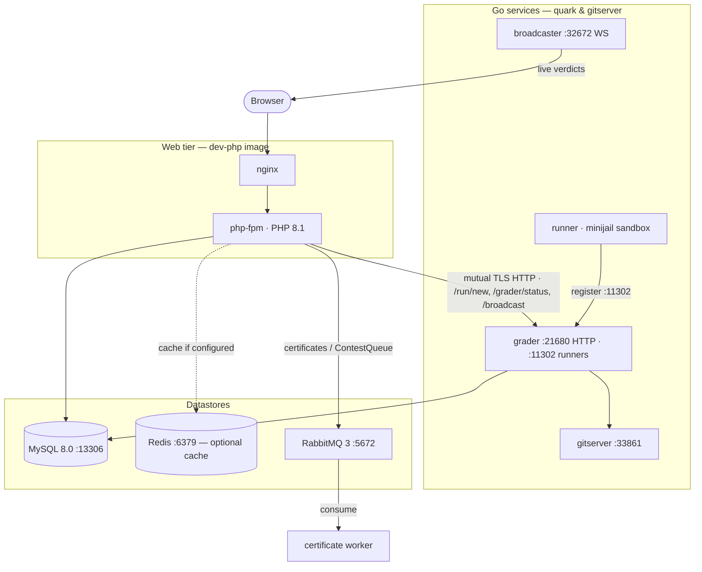

# Topologia de infraestrutura e implantação

omegaUp não é um programa. É uma aplicação web PHP que conversa com um pequeno
constelação de serviços Go na rede, apoiados por MySQL, Redis e
RabbitMQ e colados pelo Docker Compose. Esta página percorre todo
topologia da forma como uma solicitação realmente a experimenta: qual contêiner atende o
HTML e a API, que armazena dados que o processo PHP alcança, e - a parte
que surpreende os recém-chegados - como a metade julgadora do sistema vive em um
conjunto totalmente separado de repositórios que o frontend só alcança por
HTTP. Se você se lembrar de uma coisa, lembre-se disto: **o avaliador, os corredores, o
o transmissor e o sandbox não estão no monorepo PHP.** Eles são Go
binários de [`omegaup/quark`](https://github.com/omegaup/quark) e
[`omegaup/gitserver`](https://github.com/omegaup/gitserver) e o lado PHP
os conhece apenas como URLs.

## Os dois arquivos compostos e por que existem dois

Tudo o que você executa localmente vem
[`docker-compose.yml`](https://github.com/omegaup/omegaup/blob/main/docker-compose.yml).
Esse arquivo é a topologia de desenvolvimento: uma imagem por subsistema, fonte montada em ligação
live da sua árvore de trabalho para `/opt/omegaup`, portas publicadas em seu host para que você
pode cutucá-los. A produção é descrita separadamente por
[`docker-compose.k8s.yml`](https://github.com/omegaup/omegaup/blob/main/docker-compose.k8s.yml),
e os dois não se parecem quase em nada **porque respondem a perguntas diferentes.**
A tarefa do arquivo dev é "deixar um colaborador editar o PHP e vê-lo imediatamente"; os k8s
a tarefa do arquivo é "produzir as imagens imutáveis que o Kubernetes irá agendar". Então os k8s
arquivo não executa MySQL ou Redis ou os avaliadores - eles são gerenciados em outro lugar
no cluster — ele apenas *constrói* as imagens de frontend: `omegaup/frontend`,
`omegaup/php`, `omegaup/nginx`, `omegaup/frontend-sidecar` e
`omegaup/ai-editorial-worker`, cada um um estágio `target` separado de um único
`Dockerfile.frontend`. A divisão em imagens distintas `php` e `nginx` é o
diga que na produção o nginx e o php-fpm são contêineres separados; em dev eles são
fundidos em uma imagem por conveniência.

## nginx + php-fpm: o que realmente serve uma página

O frontend de desenvolvimento executa a imagem `omegaup/dev-php:20231008`, construída a partir de
[`stuff/docker/Dockerfile.dev-php`](https://github.com/omegaup/omegaup/blob/main/stuff/docker/Dockerfile.dev-php),
que é um `ubuntu:jammy` simples que instala `nginx` e `php8.1-fpm` (mais
`php8.1-opcache` e `php8.1-apcu`) lado a lado. Essa é toda a história do tempo de execução
para a camada web: **PHP padrão 8.1 atrás de php-fpm atrás de nginx.** Não há
HHVM em qualquer lugar – ele foi removido anos atrás e `grep -ri hhvm` sobre o repo retorna
nada. Quando um navegador acessa `/api/run/create/`, o nginx o encaminha para php-fpm, que
executa [`frontend/www/api/ApiEntryPoint.php`](https://github.com/omegaup/omegaup/blob/main/frontend/www/api/ApiEntryPoint.php);
esse arquivo faz `require_once('../../server/bootstrap.php')` e então
`echo \OmegaUp\ApiCaller::httpEntryPoint()`, que envia para o correspondente
método controlador (para envios, `\OmegaUp\Controllers\Run::apiCreate`, que
mora em [`Run.php` por volta de L415](https://github.com/omegaup/omegaup/blob/main/frontend/server/src/Controllers/Run.php)).
A porta `8001` do contêiner `EXPOSE` e sua inicialização `CMD` é uma porta `wait-for-it`
em `grader:36663`, `gitserver:33861`, `broadcaster:22291` e `mysql:13306` — o
frontend deliberadamente se recusa a aparecer até que suas dependências respondam, então você
nunca obtenha o estado confuso de meia inicialização em que o site carrega, mas cada juiz
a chamada expira.

O shell renderizado pelo servidor que essas solicitações emitem é um modelo Twig 3,
`frontend/templates/template.tpl`, expandido pelas extensões Twig personalizadas em
[`frontend/server/src/Template/`](https://github.com/omegaup/omegaup/tree/main/frontend/server/src/Template)
(`EntrypointNode`, `JsIncludeNode`, `VersionHashNode`). Esse shell injeta um JSON
carga útil e entrega a página para o Vue 2.7; Smarty se foi. A modelagem é um
preocupação de front-end e não de infraestrutura, por isso é mencionado apenas aqui
para encerrar a questão "o que renderiza o HTML" - o tratamento profundo reside no
página de arquitetura de front-end.

## Os datastores que o processo PHP alcança

**MySQL 8.0** (`mysql:8.0.34`, fixado em `linux/amd64` porque a imagem de frontend
assume um amd64 mysqld) é a fonte da verdade. Em dev ele escuta no
porta não padrão `13306` - não a `3306` usual - e é por isso que o frontend
ambiente define `MYSQL_TCP_PORT: 13306` e todos os alvos `wait-for-it` de serviço
`mysql:13306`; o deslocamento existe, então um MySQL que você já executa em seu host não
colidir com o recipiente. O contêiner é iniciado com
`--max_execution_time=30000 --lock_wait_timeout=10 --wait_timeout=20`, significando qualquer
única instrução é eliminada após 30 s, uma transação espera no máximo 10 s por uma linha
trava antes de desistir, e uma conexão inativa é interrompida após 20 s - guarda-corpos
portanto, uma consulta patológica não pode ocupar todo o banco de dados. Também solicita
`cap_add: SYS_NICE` para que o mysqld possa definir prioridades de thread. O lado PHP fala com isso
através do driver `mysqli` bruto em
[`frontend/server/src/MySQLConnection.php`](https://github.com/omegaup/omegaup/blob/main/frontend/server/src/MySQLConnection.php),
e todo o acesso à tabela passa pela camada DAO/VO gerada automaticamente em
`frontend/server/src/DAO/`.

**Redis** (`redis`, `redis-server /etc/redis/redis.conf`, porta `6379`) é o
cache compartilhado opcional. "Opcional" é a palavra de suporte: o cache
implementação é escolhida por `OMEGAUP_CACHE_IMPLEMENTATION` em
[`config.default.php`](https://github.com/omegaup/omegaup/blob/main/frontend/server/config.default.php),
e o padrão é **`'apcu'`**, não `'redis'`. Então, em uma única caixa o cache fica
na memória compartilhada APCu do próprio processo php-fpm e o Redis está ocioso; você muda para
`'redis'` somente quando você tem mais de um frontend e eles precisam compartilhar um cache
e armazenamento de sessão. Quando o Redis *é* usado, os parâmetros de conexão são os
`REDIS_HOST` / `REDIS_PORT` / `REDIS_PASS` define (em dev, `redis`, `6379` e
a senha `redis`, correspondendo ao `REDIS_PASSWORD: "redis"` do contêiner frontend
é entregue).

**RabbitMQ 3** (`rabbitmq:3-management-alpine`, AMQP em `5672`, a IU de gerenciamento
no `15672`) carrega exatamente um tipo de mensagem hoje, e vale a pena ser
preciso porque o mapa da fila é pequeno e fácil de imaginar. O único produtor
na base de código PHP é
[`Certificate.php`](https://github.com/omegaup/omegaup/blob/main/frontend/server/src/Controllers/Certificate.php),
que, quando um administrador pede ao omegaUp para gerar certificados de conclusão de um concurso,
publica uma única mensagem JSON na exchange **`certificates`** com chave de roteamento
**`ContestQueue`**:

```php
// frontend/server/src/Controllers/Certificate.php (~L640)
$routingKey = 'ContestQueue';
$exchange   = 'certificates';
$channel = \OmegaUp\RabbitMQConnection::getInstance()->channel();
// ... build $messageArray = certificate_cutoff, alias, scoreboard_url,
//     contest_id, ranking ...
$message = new \PhpAmqpLib\Message\AMQPMessage($messageJSON);
$channel->basic_publish($message, $exchange, $routingKey);
$channel->close();
$contest->certificates_status = 'queued';
```
O processo PHP publica e marca imediatamente `certificates_status = 'queued'`;
um trabalhador externo consome a mensagem e faz a geração lenta do PDF
banda, então a solicitação do administrador retorna instantaneamente em vez de bloquear a renderização
centenas de certificados. A conexão em si é um singleton criado preguiçosamente em
[`RabbitMQConnection.php`](https://github.com/omegaup/omegaup/blob/main/frontend/server/src/RabbitMQConnection.php)
que abre um `AMQPStreamConnection` para `OMEGAUP_RABBITMQ_HOST` (padrão `rabbitmq`)
e - um detalhe interessante - registra um `register_shutdown_function` para fechar o soquete
quando o script termina, então uma solicitação php-fpm nunca vaza uma conexão AMQP. **Nota
que o avaliador *não* consome do RabbitMQ.** As inscrições chegam ao juiz em
HTTP, descrito a seguir; RabbitMQ é apenas para o canal lateral do certificado.

## Cruzando a fronteira: PHP para o avaliador por HTTP

Aqui está a costura que define toda a arquitetura. Quando
`Run::apiCreate` validou um envio que chama
`\OmegaUp\Grader::getInstance()->grade($run, $source)` (cerca de
[`Run.php` L573](https://github.com/omegaup/omegaup/blob/main/frontend/server/src/Controllers/Run.php)),
e [`Grader.php`](https://github.com/omegaup/omegaup/blob/main/frontend/server/src/Grader.php)
nada mais é do que um cliente cURL. *Não* é a fila, *não* executa código,
ele não sabe o que é minijail - apenas faz um POST para `OMEGAUP_GRADER_URL` (padrão
`https://localhost:21680`). Cada método é mapeado para um ponto final no avaliador Go:

- `grade()` → `POST /run/new/{run_id}/` com a fonte bruta como corpo - o normal
  chamada "por favor, julgue esta submissão".
- `rejudge()` → `POST /run/grade/` com uma lista de IDs de execução — usado para rejulgamentos em massa.
- `status()` → `GET /grader/status/` — retorna o `GraderStatus` ativo:
  `run_queue_length`, `runner_queue_length`, a lista de `runners` conectados,
  `broadcaster_sockets` e `embedded_runner`. Isto é o que
  `\OmegaUp\Controllers\Grader::apiStatus` aparece no painel de administração.
- `broadcast()` → `POST /broadcast/` — pede ao avaliador para promover um evento ao vivo (um novo
  veredicto, um esclarecimento) aos navegadores inscritos.
- `getSource()` / `getGraderResource()` → `/submission/source/{guid}/` e
  `/run/resource/` — recupera a origem armazenada ou artefatos por execução (logs, o
  binário compilado) sob demanda.

O transporte é deliberadamente reforçado, porque disso depende a integridade de uma competição.
Cada chamada
[`curlRequestSingle`](https://github.com/omegaup/omegaup/blob/main/frontend/server/src/Grader.php)
apresenta um certificado de cliente e verifica o servidor:

```php
CURLOPT_SSLKEY       => '/etc/omegaup/frontend/key.pem',
CURLOPT_SSLCERT      => '/etc/omegaup/frontend/certificate.pem',
CURLOPT_CAINFO       => '/etc/omegaup/frontend/certificate.pem',
CURLOPT_SSL_VERIFYPEER => true,
CURLOPT_SSL_VERIFYHOST => 2,
CURLOPT_SSLVERSION   => CURL_SSLVERSION_TLSv1_2,
CURLOPT_CONNECTTIMEOUT => 5,   // give up connecting after 5s
CURLOPT_TIMEOUT        => 30,  // give up on the whole call after 30s
```
Isso é **TLS mútuo**: o frontend prova quem é com `key.pem`, e
se recusa a falar com um aluno cujo certificado não está vinculado à CA em
`certificate.pem` (`VERIFYPEER` ativado, `VERIFYHOST` definido como `2`), somente em TLS 1.2.
Em torno dessa única chamada existe um loop de nova tentativa - `curlRequest` tentará novamente até **3
vezes** com espera exponencial (`1s`, `2s`, então limitado a `5s`), mas *somente* para
erros que ele classifica como repetíveis (`'Connection timed out'`, `'conexão SSL
timeout'`, `'HTTP/2 stream'`, `'Operation timed out'` e alguns irmãos). Um
erro que não pode ser repetido - digamos que o aluno retornou 400 - é lançado novamente imediatamente, então
um bug genuíno não é encoberto por três tentativas inúteis.

## The Go atende os fãs da escola

A URL `https://localhost:21680` resolve, no dev compose, para `grader`
contêiner: imagem `omegaup/backend:v1.9.35`, ponto de entrada `/usr/bin/omegaup-grader`.
Esse binário é criado a partir do [`grader/`](https://github.com/omegaup/quark/tree/main/grader)
pacote de `omegaup/quark`, e *ele* possui tudo o que o antigo wiki PHP erroneamente
atribuído ao back-end: a fila de prioridade
([`grader/queue.go`](https://github.com/omegaup/quark/blob/main/grader/queue.go)),
o pool de executores e a lógica de despacho. A niveladora escuta em duas portas por dois
públicos diferentes — **`21680`** é o endpoint HTTPS que o frontend do PHP chama e
**`11302`** é onde os corredores se conectam para se registrar — e é por isso que o
O ponto de entrada do serviço `runner` é `wait-for-it grader:11302 -- /usr/bin/omegaup-runner`:
um corredor não pode entrar no grupo até que a porta de registro do aluno esteja ativa.

O contêiner `runner` (imagem `omegaup/runner:v1.9.35`) é o que realmente
compila e executa um envio. Sua caixa de areia vive em
[`runner/sandbox.go`](https://github.com/omegaup/quark/blob/main/runner/sandbox.go);
na produção, esse sandbox é minijail, mas observe que o dev compose inicia o executor
com o sinalizador `-noop-sandbox` - porque o minijail precisa de privilégios de kernel que um
o contêiner de desenvolvimento descartável não deve ser mantido, o julgamento do desenvolvedor é executado *sem* isolamento real
([`runner/noop_sandbox.go`](https://github.com/omegaup/quark/blob/main/runner/noop_sandbox.go)).
Essa é uma boa troca para "os dados de teste do meu problema analisam" e terrível
para qualquer coisa em que você confiaria em um concurso real, e é exatamente por isso que é uma bandeira e
não é o padrão na produção.

O `broadcaster` (também `omegaup/backend:v1.9.35`, ponto de entrada
`/usr/bin/omegaup-broadcaster`, fonte em
[`broadcaster/`](https://github.com/omegaup/quark/tree/main/broadcaster)) é o
fan-out de atualização ao vivo. Quando a chamada PHP `broadcast()` chega ao avaliador, o
emissora retransmite o evento através de WebSockets (expõe `32672` e `22291`) para
cada navegador inscrito nesse concurso, que é como um placar atualiza o
no instante em que um veredicto chega, em vez de na próxima votação. A contagem daqueles abertos
sockets é o campo `broadcaster_sockets` que você viu em `GraderStatus`.

Finalmente, `gitserver` (imagem `omegaup/gitserver:v1.9.13`, ponto de entrada
`wait-for-it mysql:13306 -- /usr/bin/omegaup-gitserver`, fonte em
[`omegaup/gitserver`](https://github.com/omegaup/gitserver)) é onde os problemas
viver fisicamente. Cada problema é um **repositório git** — instruções, casos de teste,
validadores, configurações - servidos pela porta `33861`, com os repositórios armazenados em
o volume `omegaupdata` compartilhado montado em `/var/lib/omegaup` (o
O contêiner Alpine one-shot `init-omegaupdata` existe exclusivamente para `mkdir -p
/var/lib/omegaup/problems.git` and `chown` antes de qualquer outra coisa começar). Ambos
o frontend e a niveladora montam o mesmo volume, então quando a niveladora precisar de um
conjunto de entrada do problema, ele o lê diretamente do armazenamento apoiado pelo git.

Uma convenção compartilhada entre todos os quatro serviços Go: cada porta `expose`
**`6060`**, endpoint de depuração `net/http/pprof` padrão do Go, para que um mantenedor possa
anexe um criador de perfil a um avaliador ou corredor ativo sem reimplantá-lo.

## Observabilidade: métricas e logs

Dois canais independentes respondem “é saudável?” e "o que aconteceu?".

Para **métricas**, omegaUp usa o
[`promphp/prometheus_client_php`](https://github.com/PromPHP/prometheus_client_php)
biblioteca (fixada `^2.4` em
[`composer.json`](https://github.com/omegaup/omegaup/blob/main/composer.json)),
envolvido por [`Metrics.php`](https://github.com/omegaup/omegaup/blob/main/frontend/server/src/Metrics.php).
O wrapper escolhe seu back-end de armazenamento no momento da construção: se o APCu estiver disponível, ele
usa `\Prometheus\Storage\APC`, caso contrário `\Prometheus\Storage\InMemory` — o APC
path é o que permite que os contadores sobrevivam *através* de solicitações php-fpm dentro de um trabalhador, já que
caso contrário, uma solicitação PHP simples não tem estado e esqueceria todas as métricas no momento
isso acaba. Os contadores registrados hoje são `frontend_api_request_status_count`
(rotulado por `api` e `status`) e `frontend_api_request_total` (rotulado por
`api`), incrementado em cada chamada de API despachada. Eles são raspados em
[`frontend/www/metrics.php`](https://github.com/omegaup/omegaup/blob/main/frontend/www/metrics.php),
um endpoint de quatro linhas que inicializa o bootstrap e chama
`\OmegaUp\Metrics::getInstance()->render()`, emitindo o texto Prometheus
formato de exposição.

Para **registros**, [`bootstrap.php`](https://github.com/omegaup/omegaup/blob/main/frontend/server/bootstrap.php)
configura o Monolog 2 (`monolog/monolog ^2.3`) uma vez, no início de cada
pedido. Ele constrói um `\Monolog\Logger('omegaup')` escrevendo através de um `StreamHandler`
para `OMEGAUP_LOG_FILE` (padrão `/var/log/omegaup/omegaup.log`) no nível em
`OMEGAUP_LOG_LEVEL` (padrão `info`), empurra um `WebProcessor` para que cada linha carregue
o URL e o método da solicitação e, em seguida, registra-o globalmente com
`\Monolog\Registry::addLogger` e `\Monolog\ErrorHandler::register` – o último
rotear erros e exceções de PHP não detectados no mesmo log. A Nova Relíquia
a integração é inteiramente condicional e ler como ela se degrada é instrutivo:

```php
if (class_exists('\NewRelic\Monolog\Enricher\Formatter')) {
    $logFormatter = new \NewRelic\Monolog\Enricher\Formatter();
} else {
    $logFormatter = new \Monolog\Formatter\LineFormatter();
}
// ...
if (class_exists('\NewRelic\Monolog\Enricher\Processor')) {
    $rootLogger->pushProcessor(new \NewRelic\Monolog\Enricher\Processor());
}
```
Quando o pacote `newrelic/monolog-enricher` (`^2.0`) é instalado, os registros de log são
o formatador New Relic e um processador que carimba cada linha com o atual
ligação de rastreamento/entidade, para que uma linha de log possa ser dinamizada para seu rastreamento de APM; quando é
*não* instalado – como em um checkout local simples – tudo depende do humano
`LineFormatter` e nada quebra. Essa proteção `class_exists` é deliberada: Novo
Relic é um luxo de produção e um contribuidor nunca deve precisar de uma licença New Relic
para administrar o site. O agente New Relic do lado do navegador é carregado separadamente, somente quando
os valores de configuração `NEW_RELIC_SCRIPT` / `NEW_RELIC_SCRIPT_HASH` são definidos.

## Visão geral do sistema


## Documentação Relacionada

- **[Configuração do Docker](../operations/docker-setup.md)** — a atualização local completa
- **[Implantação](../operations/deployment.md)** — implantação de produção
- **[Monitoramento](../operations/monitoring.md)** — painéis e alertas
- **[Segurança](security.md)** — TLS mútuo, tokens PASETO, OAuth2
