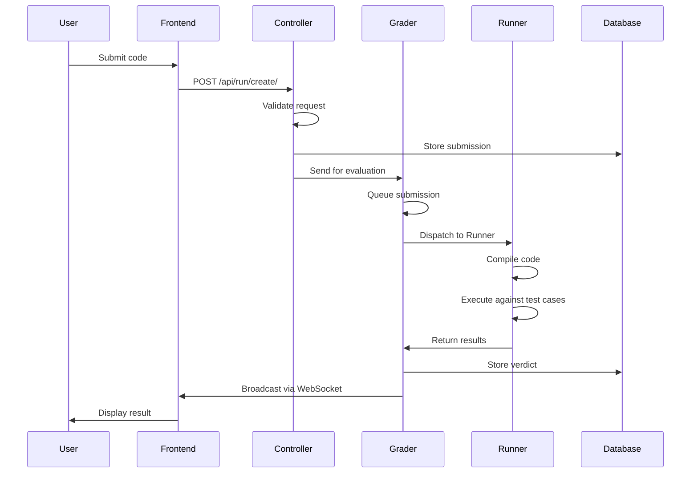

# Internos do sistema

Tudo o que você sempre quis saber sobre como o omegaUp executa seu código e tinha medo de perguntar. Esta página segue um único envio em todo o caminho - desde o momento em que você clica em "Enviar" na arena, através do frontend PHP, através do fio até o avaliador Go, em um corredor em sandbox e de volta ao placar que todos os outros estão assistindo. Nós o narramos em ordem de execução e nomeamos o símbolo exato que executa cada etapa, porque o *porquê* por trás de cada salto é a parte que você não pode reconstruir lendo qualquer arquivo isoladamente.

Duas coisas que vale a pena saber antes de começarmos. Primeiro, o frontend (o monorepo PHP, [`omegaup/omegaup`](https://github.com/omegaup/omegaup)) e a pilha de avaliação de backend (o classificador, executor e transmissor Go, todos em [`omegaup/quark`](https://github.com/omegaup/quark), mais [`omegaup/gitserver`](https://github.com/omegaup/gitserver)) são *repositórios separados e processos separados*. O frontend nunca compila ou executa o código de ninguém — ele transfere o trabalho por HTTP e aguarda o veredicto voltar de forma assíncrona. Segundo, essa transferência é deliberadamente o único ponto de acoplamento: o frontend se comunica com o avaliador por meio de exatamente um thin client, [`\OmegaUp\Grader`](https://github.com/omegaup/omegaup/blob/main/frontend/server/src/Grader.php), e nada mais no código PHP sabe que o avaliador existe.

## A viagem em uma foto

O diagrama nivela duas coisas que a prosa abaixo irá desnivelar: o avaliador é *reinserido* duas vezes (uma vez para enfileirar e despachar, mais uma vez depois que o corredor reporta de volta, para pontuar), e as duas últimas setas são na verdade um serviço separado - o transmissor - chamando *de volta* para o frontend para reconstruir o placar antes que ele empurre qualquer coisa através de um soquete.

## Frontend: o POST sai do seu navegador

Quando você envia, a primeira coisa que acontece é que seu código - junto com o alias do problema, o alias do concurso (ou `problemset_id`) e o idioma - é POSTado no endpoint da API `/api/run/create/`. Na arena Vue 2.7 + TypeScript atual, isso passa pelo cliente API gerado: um ponto de entrada da arena como [`frontend/www/js/omegaup/arena/contest_contestant.ts`](https://github.com/omegaup/omegaup/blob/main/frontend/www/js/omegaup/arena/contest_contestant.ts) chama `api.Run.create({...})`, e `api.Run.create` é um wrapper digitado definido em [`frontend/www/js/omegaup/api.ts`](https://github.com/omegaup/omegaup/blob/main/frontend/www/js/omegaup/api.ts) que faz POST para `/api/run/create/`. Esse arquivo é gerado por máquina (ele abre com um banner `// generated by frontend/server/cmd/APITool.php. DO NOT EDIT.`), e é por isso que os tipos TypeScript na solicitação e os tipos PHP no controlador nunca podem se separar – eles vêm da mesma fonte de verdade. (Se você for pesquisar o antigo `OmegaUp.submit` em `frontend/www/js/omegaup.js`, não faça isso: esse arquivo desapareceu. A migração para componentes Vue de arquivo único está completa - o servidor agora renderiza apenas um shell HTML fino (um modelo Twig 3) que inicializa o aplicativo Vue, e toda a arena é controlada por `api.ts` agora.)

Assim que a solicitação chega ao servidor, o nginx a encaminha para o PHP (php-fpm, executando o PHP 8.1 simples). O ponto de entrada é [`frontend/www/api/ApiEntryPoint.php`](https://github.com/omegaup/omegaup/blob/main/frontend/www/api/ApiEntryPoint.php), que faz `require_once('../../server/bootstrap.php')` e depois `echo \OmegaUp\ApiCaller::httpEntryPoint()`. [`frontend/server/bootstrap.php`](https://github.com/omegaup/omegaup/blob/main/frontend/server/bootstrap.php) é o que deve ser executado primeiro: ele carrega a configuração, extrai os módulos carregados automaticamente e inicializa a conexão MySQL, para que quando qualquer controlador for executado, o mundo já esteja configurado.

`ApiCaller` então cria um objeto `\OmegaUp\Request` – a representação na memória de cada parâmetro da solicitação, incluindo o cookie de autenticação – e tokeniza o caminho da URL. Ele retira o `/api` principal e divide `/api/run/create/` em `['run', 'create']`. O primeiro token é o controlador, o segundo é o método. Em [`frontend/server/src/ApiCaller.php`](https://github.com/omegaup/omegaup/blob/main/frontend/server/src/ApiCaller.php) você pode ver isso acontecer: `$controllerName = ucfirst($args[2])` gera `Run`, `$apiMethodName = "api{$methodName}"` gera `apiCreate` e `$controllerFqdn = "\\OmegaUp\\Controllers\\{$controllerName}"` resolve para `\OmegaUp\Controllers\Run`. Observe que a classe é `Run`, **não** `RunController` — os controladores omegaUp descartam deliberadamente o sufixo `Controller` (você encontrará `Contest`, `Problem`, `Grader`, `Submission` e amigos sob a mesma regra). Cada token de caminho *após* o controlador e o método é tratado como uma série de pares nome/valor de variável e dobrado no `Request`.

## `\OmegaUp\Controllers\Run::apiCreate`: o desafio de permissão

Agora [`\OmegaUp\Controllers\Run::apiCreate`](https://github.com/omegaup/omegaup/blob/main/frontend/server/src/Controllers/Run.php) (cerca de L415 de `Run.php`) assume o controle, e é aqui que um envio ganha o direito de existir. A primeira linha, `$r->ensureIdentity()`, valida o token de autenticação que foi definido no login — normalmente armazenado como um cookie, mas a API também o aceitará como parâmetro POST — e resolve a identidade que faz a solicitação.

Em seguida, ele valida que esse usuário realmente tem permissão para fazer *este* envio, e vale a pena soletrar cada portão em ordem, em vez de recolhê-lo para "validar permissões", porque qualquer pessoa que toque em autenticação precisa saber todas elas. Dentro do `validateCreateRequest` ele verifica se todos os elementos necessários estão presentes (alias do problema, concurso/conjunto de problemas, idioma e fonte); que o problema existe e não é `deprecated`; que você não configurou `problemset_id` *e* `contest_alias` de uma só vez (eles são mutuamente exclusivos — um envio pertence a exatamente um contêiner); que o problema faz realmente parte do concurso e ambos são válidos; e, para uma submissão pública ou prática sem concurso, que o problema está visível e o prazo final da prática (se houver) não expirou. Existe até uma recusa codificada que é pura memória institucional: a identidade chamada `omi` é totalmente proibida (`throw new \OmegaUp\Exceptions\ForbiddenAccessException()`), um guarda adicionado para [edição #739](https://github.com/omegaup/omegaup/issues/739).

Duas dessas portas carregam constantes que você não deve generalizar. O limite de taxa é **um envio por problema a cada 60 segundos** — `Run::$defaultSubmissionGap = 60` (segundos), aplicado por `validateWithinSubmissionGap` via `\OmegaUp\DAO\Submissions::isInsideSubmissionGap`, e lança `NotAllowedToSubmitException('runWaitGap')` se você estiver muito ansioso (os administradores do sistema e do concurso estão isentos, para que possam enviar spam para envios de testes durante a configuração). E quando a plataforma está no modo **Lockdown**, verificações extras entram em ação – por enquanto a única é que a corrida não está sendo feita no modo de treino, imposto pelo `\OmegaUp\Controllers\Controller::ensureNotInLockdown()` no caminho de treino – para que durante uma janela de competição bloqueada ninguém consiga entrar furtivamente pela porta de treino.

Se todos os portões passarem, `apiCreate` calcula a **penalidade** de acordo com o `penalty_type` da competição. Este é um ramo real, não uma formalidade: `contest_start` mede `submit_delay` em minutos a partir do `start_time` do concurso; `problem_open` mede isso a partir do momento em que o usuário abriu o problema pela primeira vez (procurou em `ProblemsetProblemOpened` — e se não houver nenhum registro aberto, significa que você está se submetendo a um problema que nunca abriu, o que gera `runNotEvenOpened`); e `none`/`runtime` ignoram totalmente a penalidade (`submit_delay = 0`). O atraso é armazenado em minutos inteiros: `intval((\OmegaUp\Time::get() - $start->time) / 60)`.

Em seguida, ele cria um **GUID** aleatório — `md5(uniqid(strval(rand()), true))` — que é o identificador sob o qual o arquivo de código será armazenado e o identificador que cada estágio posterior usa para se referir a essa execução. Ele grava as linhas: uma linha `Submissions` e uma linha `Runs`, ambas criadas dentro de um bloco `\OmegaUp\TransactionHelper::executeWithRetry(...)` (o wrapper de nova tentativa existe porque envios simultâneos podem travar no MySQL, e executar novamente o encerramento é mais barato do que falhar o usuário). Ambas as linhas começam como `status = 'uploading'` com um espaço reservado `verdict = 'JE'` (Erro do Juiz) - uma execução que nunca passa desse ponto *permanece* `JE`, que é o seu sinal de que o avaliador nunca foi informado sobre isso com sucesso. Crucialmente, `validateWithinSubmissionGap` é verificado novamente *dentro* da transação, porque somente há a verificação de lacunas sem corrida em relação a um segundo envio em andamento.

Finalmente, o frontend entrega a corrida para o aluno e lava as mãos do resto. `apiCreate` chama `\OmegaUp\Grader::getInstance()->grade($run, trim($source))` (por volta de L573). Nos bastidores, há um único `curl` POST para `OMEGAUP_GRADER_URL . "/run/new/{$run->run_id}/"` com a origem como o corpo da solicitação bruta - observe que ele passa o **run id**, não o código por valor, porque o avaliador relerá tudo o que precisa do próprio banco de dados. O padrão `OMEGAUP_GRADER_URL` é `https://localhost:21680` ([`config.default.php`](https://github.com/omegaup/omegaup/blob/main/frontend/server/config.default.php) em torno de L61). Essa chamada é mutuamente autenticada com certificados de cliente TLS (`CURLOPT_SSLKEY`/`CURLOPT_SSLCERT` apontando para `/etc/omegaup/frontend/*.pem`, `CURLOPT_SSL_VERIFYPEER => true`, `CURLOPT_SSLVERSION => CURL_SSLVERSION_TLSv1_2`), porque *toda* a comunicação entre os subsistemas omegaUp é criptografada – esta é uma lição aprendida da maneira mais difícil depois que alguém sentou e farejou o tráfego em um concurso de programação real. Se a chamada de nota for lançada, `apiCreate` não deixa uma linha pendente: ele não pode reverter uma transação real (o processo de avaliação nunca veria uma linha `Runs` não confirmada), portanto, ele desvincula e exclui manualmente as linhas `Runs` e `Submissions` antes de aumentar novamente. Se tudo der certo, o GUID será retornado ao navegador como JSON, junto com um `nextSubmissionTimestamp` (para que a IU saiba quando o intervalo de 60 segundos diminuir) e um `submission_deadline`, e seu navegador começará a pesquisar o veredicto.

## Grader, parte 1: filas e expedição

O avaliador é um serviço Go ([`omegaup/quark`](https://github.com/omegaup/quark)) com um servidor HTTPS integrado que escuta quatro tipos de solicitação: avaliar um envio (`/run/new/`, `/run/grade/`), registrar um novo executor, cancelar o registro de um e transmitir informações para cada cliente conectado ao WebSocket. Quando a solicitação `/run/new/<run_id>/` chega, o avaliador procura a execução por id no banco de dados e *reidrata* tudo o que precisa – o envio, o problema, o concurso e os metadados do usuário – porque, novamente, o frontend enviou a ele um id, não uma carga útil. Ele agrupa tudo isso em um **`RunContext`** (definido em [`grader/queue.go`](https://github.com/omegaup/quark/blob/main/grader/queue.go)), que carrega os metadados da execução mais os campos de rastreamento usados ​​para medir quanto tempo leva cada estágio downstream e os entrega ao roteador da fila.

Existem **8 filas padrão** e vale a pena nomeá-las por completo porque as regras de roteamento as desativam:

-`urgente` (urgente)
- `urgente lento` (urgente, lento)
- `concurso` (concurso)
- `concurso lento` (concurso, lento)
-`normal`
- `normal lento` (normal, lento)
-`rejudge`
- `rejudge lento` (rejulgar, lento)

Por padrão nada é roteado para as filas urgentes; você opta por concursos específicos (digamos, as olimpíadas nacionais da OMI ou CONACUP) por meio da configuração do avaliador para que suas inscrições sempre ultrapassem os limites. Caso contrário, a regra é simples: um envio não prático vai para `concurso`, um envio prático vai para `normal` e `rejudge` é usado *somente* quando alguém aperta o botão "rejulgar" no frontend ou os casos de teste de um problema são alterados. As variantes **lentas** são as interessantes: uma fila é "lenta" se seus problemas levarem, na pior das hipóteses, **mais de 30 segundos para retornar um TLE**. As filas são processadas da esquerda para a direita (urgente antes da competição, antes do normal, antes do rejulgamento), mas apenas uma certa porcentagem de corredores pode atender filas lentas simultaneamente — **atualmente 50%** — especificamente para evitar que problemas lentos monopolizem toda a frota enquanto uma competição rápida estiver ao vivo.Assim que um `RunContext` chega à fila, ele espera até que um runner esteja livre. Quando há pelo menos uma execução pronta *e* pelo menos um executor ocioso, o avaliador extrai a execução de maior prioridade possível de todas as filas, anota o carimbo de data/hora em que saiu da fila (esse carimbo de data/hora é como detectará posteriormente um executor morto) e despacha a tarefa de avaliação para o executor por HTTPS. A conexão com o executor ocorre em um prazo de **10 minutos** — você pode ver isso no `InflightMonitor` de [`grader/queue.go`](https://github.com/omegaup/quark/blob/main/grader/queue.go), cujos `connectTimeout` e `readyTimeout` são ambos `10 * time.Minute`. Se esse prazo for excedido, ou o corredor lançar durante o processamento, o avaliador presume que o corredor está **morto**; e se a falha não for grave, ele *reposiciona* a execução (`RunContext.Requeue`) com base na teoria de que foi um problema transitório de rede e alguém saudável irá buscá-lo na próxima vez.

## Runner: compila e executa no Minijail

Os corredores vivem na nuvem em máquinas virtuais. Cada um, ao inicializar, envia uma solicitação de cadastro ao avaliador, que o adiciona ao pool de corredores disponíveis; o envio pelo pool é **round-robin** sem afinidade - embora a afinidade existisse em algum momento no passado e não fosse difícil adicioná-la novamente, se você precisar de uma execução para manter o executor que já tem suas entradas armazenadas em cache. Após cada minuto de inatividade, um corredor reenvia seu registro como uma pulsação de atividade, de modo que, se o avaliador reiniciar ou perder o controle, ele reaparecerá no pool. Cada executor também tem seu próprio servidor HTTPS incorporado e, embora a fila do avaliador já garanta que um executor lide com no máximo uma execução por vez, o executor também mantém seu próprio mutex - porque a estranheza da rede acontece, e uma execução por vez é uma propriedade que você deseja aplicar em ambas as extremidades.

O modelo mental a ser mantido: o executor **sabe como compilar, executar e alimentar qualquer entrada enviada pelo usuário e verificar se a saída está correta.** É basicamente um frontend bonito e distribuído para o **Minijail** — o sandbox. (O próprio Minijail descende do Moeval, o sandbox usado no IOI, e vive no repositório do executor junto com seu próprio [`Dockerfile.minijail`](https://github.com/omegaup/quark/blob/main/Dockerfile.minijail); o frontend do PHP não tem conhecimento dele.)

Tudo começa com `compile` em [`runner/runner.go`](https://github.com/omegaup/quark/blob/main/runner/runner.go), que usa Minijail para resolver a complicada tarefa de entregar os sinalizadores corretos ao compilador e à sandbox. Dependendo de quais campos a solicitação de compilação carrega, ela pode compilar um arquivo ou vários (problemas interativos enviam um `Main` mais um ou mais arquivos de interface). Não há configuração de compilação explícita — a convenção *é* a configuração: a classe principal é chamada `Main` e o executável produzido é `Main` (ou `Main.class` em Java, ou equivalente em outro lugar). Em caso de sucesso, o executor retorna um **token** ao avaliador — o caminho do sistema de arquivos onde os artefatos compilados são armazenados em cache — que o avaliador deve incluir em cada solicitação posterior para se referir a esta mesma construção. Se a compilação falhar, o executor excluirá todos os arquivos temporários e retornará o `stderr` do compilador como o erro de compilação (que é exatamente o que aparece para você como um veredicto `CE`). Se o problema tiver um validador, ele acompanha a mesma mensagem e é compilado aqui também.

Para realmente executar o programa em um conjunto de entrada fixo, o avaliador envia o token de compilação junto com o **hash SHA-1 dos casos de entrada** (o `.zip` dos arquivos `.in`, identificados pelo hash para que o executor possa saber se já os possui). O executor verifica se esse conjunto de entradas está armazenado em cache em seu sistema de arquivos local; se não for, ele retorna um erro para que o avaliador reenvie o `.zip` em uma solicitação de acompanhamento - esta é a viagem de ida e volta de "entrada ausente" e é por isso que a primeira execução de um novo problema em um novo corredor custa um salto extra. Uma vez confirmada a presença das entradas, o executor executa o programa compilado em cada arquivo `.in`. A mensagem de execução *também* pode transportar casos independentes inline como texto simples (usado para envios efêmeros/de execução rápida), e eles são classificados exatamente como se tivessem chegado no `.zip`. Para cada caso, o executor salva o `.out` plus metadados, compacta-os com **bzip2** e os transmite de volta para a niveladora *imediatamente* — ele não espera que todo o conjunto termine. Se um validador estiver presente, ele será executado no `.out` do usuário e no `.in` original, e seus resultados (novamente `.out` + metadados) também serão enviados de volta. Todo o resto - `stderr` e similares - só é enviado quando você usa o debug-rejudge no frontend, para manter pequeno o tráfego normal. Quando o último caso for concluído, o executor exclui seus arquivos temporários e passa para a próxima mensagem.

## Grader, parte 2: validadores e pontuação

Assim que o avaliador tiver todos os resultados de uma corrida, ele libera o corredor de volta na piscina (onde pode iniciar a próxima corrida imediatamente) e, paralelamente, pontua os resultados. É aqui que residem os diferentes tipos de validadores. **Todos os validadores tokenizam o fluxo de saída em espaços em branco** e diferem na forma como comparam os tokens (consulte [`runner/validator.go`](https://github.com/omegaup/quark/blob/main/runner/validator.go) e as constantes `ValidatorName` em [`common/problemsettings.go`](https://github.com/omegaup/quark/blob/main/common/problemsettings.go)):

- **`token`** — compare os tokens um por um, desistindo na primeira diferença (ou no momento em que um stream fica sem tokens enquanto o outro ainda tem alguns).
- **`token-caseless`** — o mesmo, mas sem distinção entre maiúsculas e minúsculas.
- **`token-numeric`** — ignore todos os tokens não numéricos, analise o restante como flutuantes e compare com uma tolerância (`DefaultValidatorTolerance`, substituível por problema). Este é o que você deve procurar quando a resposta é um número real e você não quer que `0.999999` vs `1.0` seja uma resposta errada.
- **`custom`** (literal) — um programa validador fornecido pelo usuário decide.

Isso produz um **veredicto por caso**, extraído do conjunto fixo `AC`, `PA`, `PE`, `WA`, `TLE`, `OLE`, `MLE`, `RTE`, `RFE`, `CE`, `JE`. Depois que cada caso tiver um veredicto, o avaliador atribui pesos. Se o problema enviar um arquivo `/testplan`, esse arquivo será analisado e seus pesos serão **normalizados para que somam exatamente 1**; caso contrário, cada caso vale `1 / number-of-cases`. Com os pesos em mãos, os casos são agrupados: o **nome do grupo é tudo antes do primeiro `.`** no nome do arquivo do caso — o que significa que se um caso não tiver um grupo explícito, tudo antes do `.in` se torna seu nome de grupo implícito. Um **grupo concede seus pontos somente se todos os casos nele ganharem `AC` ou `PA`** — um único `WA` ou `TLE` em qualquer lugar do grupo zera todo o grupo, que é exatamente a subtarefa do tipo tudo ou nada em que os problemas competitivos dependem. Finalmente, o avaliador soma as pontuações do grupo e multiplica pelo valor de pontos que o problema vale *para aquela competição* (ou 100% no modo de prática), escreve o veredicto final no banco de dados e coloca o `RunContext` na fila para a emissora.

## Emissora: reconstrua o placar e empurre

A emissora ([`broadcaster/`](https://github.com/omegaup/quark/tree/main/broadcaster) em quark) mantém placares de concursos e notifica, quase em tempo real, todos os competidores que possuem WebSockets habilitados. Para cada corrida que chega à fila e pertence a um concurso, ele retorna ao frontend em **`/api/scoreboard/refresh`**, que recalcula o placar de acordo com as políticas do concurso (placares congelados, regras de penalidade e assim por diante). Somente *após* o placar ter sido reconstruído e armazenado em cache no servidor é que a emissora notifica os assinantes – ela envia o evento de alteração do placar para todos os participantes da competição e o próprio veredicto para o autor da corrida. Quais concorrentes recebem qual mensagem é decidida pelos filtros em [`broadcaster/filter.go`](https://github.com/omegaup/quark/blob/main/broadcaster/filter.go) (`UserFilter`, `ContestFilter`, `ProblemsetFilter` e assim por diante), portanto, o placar de um concurso privado só alcança as pessoas dentro dele. Quando isso é feito, o `RunContext` registra quanto tempo a execução passou em cada fila e quanto tempo o executor levou para responder – além de um pouco mais de metadados de depuração – e é destruído. Esses dados de tempo são a matéria-prima por trás das métricas do Prometheus da niveladora e é a razão pela qual os campos de rastreamento foram inseridos no `RunContext` desde o início.

E essa é a viagem toda: seu pressionamento de tecla se tornou um HTTP POST, uma linha no MySQL, um trabalho JSON em uma fila, um processo em área restrita em uma VM na nuvem, um veredicto por caso, uma pontuação de grupo e, finalmente, um número em um placar que todos os outros participantes do concurso acabaram de ver mudar.

## Documentação Relacionada

- **[Visão geral da arquitetura](index.md)** — como o frontend, o avaliador, o executor, o transmissor e o gitserver se encaixam.
- **[Grader](grader-internals.md)** — o roteador de fila e o loop de despacho em profundidade.
- **[Runner](runner-internals.md)** — sandbox, convenções de compilação e Minijail.
