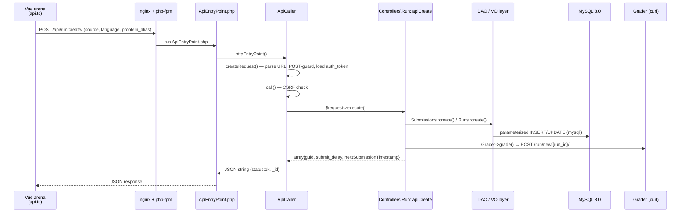

# Padrão MVC no omegaUp

omegaUp é construído no padrão [Model-View-Controller](https://en.wikipedia.org/wiki/Model%E2%80%93view%E2%80%93controller), mas a parte interessante não é o acrônimo de três letras — é *como* uma solicitação realmente flui através do código real. O Modelo é uma camada DAO + Value Object gerada automaticamente que fala `mysqli` com MySQL 8.0 e nunca vaza um `SELECT` escrito à mão em um controlador; o Controller é uma classe PHP 8.1 simples em `\OmegaUp\Controllers` cujos métodos `apiXxx` retornam arrays associativos e nunca ecoam HTML; e o View é uma fera de duas partes - um único shell Twig 3 renderizado pelo servidor que inicializa a página e um aplicativo Vue 2.7 de página única que possui cada pixel depois disso. Tudo abaixo rastreia um envio real - um aluno clicando em **Enviar** em um problema - de ponta a ponta, nomeando o arquivo, método e constante exatos em cada salto, porque saber que "o controlador fala com o modelo" não ensina nada sobre o qual você possa agir, enquanto saber que `\OmegaUp\Controllers\Run::apiCreate` chama `\OmegaUp\DAO\Submissions::create($submission)` dentro de um fechamento `TransactionHelper::executeWithRetry` informa exatamente onde colocar um ponto de interrupção.

## O modelo mental de uma linha

O aplicativo da web é uma API JSON fina com um front end Vue aparafusado na parte superior. Nada renderiza HTML exceto um modelo Twig; cada outro byte que o navegador obtém é um pacote `.js` ou um blob JSON. Todo o trabalho de um controlador é: autenticar, validar, modificar o modelo por meio de DAOs e devolver um array. Se você internalizar apenas isso, o resto desta página será detalhado.

## Pipeline de solicitação: após um envio do navegador para o avaliador

Quando o aluno envia, a arena Vue não POST um formulário em uma página - ele chama o cliente API gerado, que `fetch`es `POST /api/run/create/` com o código-fonte, idioma e `problem_alias` no corpo. Essa URL é toda a tabela de roteamento: omegaUp não possui arquivo de configuração de rota, porque o caminho da URL *é* a instrução de despacho.

### nginx → php-fpm → o ponto de entrada

Cada solicitação `/api/*` é atendida pela transferência do nginx para o php-fpm, que executa exatamente um arquivo de quatro linhas, [`frontend/www/api/ApiEntryPoint.php`](https://github.com/omegaup/omegaup/blob/main/frontend/www/api/ApiEntryPoint.php). Ele `require_once`s [`frontend/server/bootstrap.php`](https://github.com/omegaup/omegaup/blob/main/frontend/server/bootstrap.php) (que conecta o autoloader, a configuração, o registro e a conexão do banco de dados) e então faz todo o trabalho em uma instrução:

```php
require_once(__DIR__ . '/../../server/bootstrap.php');

echo \OmegaUp\ApiCaller::httpEntryPoint();
```
A API reside em `/api/`, em vez de ser misturada propositalmente em URLs de páginas normais: é a única superfície que deve ser chamada por clientes que não são navegadores (ferramentas CLI, scripts de integração, o futuro em formato móvel), por isso é deliberadamente mantida livre de qualquer preocupação de renderização de HTML. `httpEntryPoint` retorna uma *string de JSON* e `ApiEntryPoint.php` apenas a ecoa.

### ApiCaller transforma uma URL em um método controlador

[`\OmegaUp\ApiCaller::httpEntryPoint()`](https://github.com/omegaup/omegaup/blob/main/frontend/server/src/ApiCaller.php) é onde uma URL se torna uma chamada de método. Ele chama `createRequest()`, que analisa `$_SERVER['REQUEST_URI']` com `preg_split('/[\/?]/', $apiAsUrl)` - dividindo em `/` *e* `?` para que `/api/run/create/?foo=1` e `/api/run/create?foo=1` analisem de forma idêntica. Exige pelo menos quatro segmentos (`['', 'api', 'run', 'create']`); qualquer coisa menor gera um `NotFoundException('apiNotFound')`, e é por isso que um URL de API malformado retorna como um 404 limpo em vez de um PHP fatal.

A partir desses segmentos, ele constrói o destino por convenção, não por configuração: `$controllerName = ucfirst($args[2])` fornece `Run`, a classe totalmente qualificada é `"\\OmegaUp\\Controllers\\{$controllerName}"` → `\OmegaUp\Controllers\Run` e o método é `"api{$methodName}"` → `apiCreate`. Observe a lei de nomenclatura aqui — a classe é **`Run`, não `RunController`**; omegaUp descarta o sufixo `Controller` em todos os lugares (`Contest`, `Problem`, `Submission`, `Grader`…), então procurar por `RunController` não encontrará nada. Se `class_exists` ou `method_exists` falhar, você obterá `apiNotFound` novamente, portanto, um erro de digitação na URL e um erro de digitação no nome do método aparecem como o mesmo 404.

Dois guardas transversais moram aqui, uma vez, então nenhum controlador individual precisa repeti-los:

- **A mutação requer POST.** `createRequest()` executa o nome do método por meio de `isMutatingMethod()`, que o coloca em letras minúsculas e corresponde a substring em uma lista de verbos que alteram o estado (`add`, `create`, `delete`, `login`, `rejudge`, `update`, `verify` e ~25 mais). Se um `GET` atingir um endpoint mutante como `create`, ele lançará `MethodNotAllowedException`. Como a correspondência é por substring, métodos genuinamente somente leitura cujos nomes contêm uma palavra mutante (por exemplo, `listAssociatedIdentities` contém "associado") são resgatados por um `$readOnlyAllowlist` explícito para que continuem aceitando `GET`.
- **Auth vem do cookie.** `createRequest()` chama `\OmegaUp\Controllers\Session::getCurrentSession()` e, se existir uma sessão `auth_token`, a injeta na solicitação. Os tokens de autenticação são tokens PASETO (via `paragonie/paseto`), portanto, a identidade do chamador é estabelecida antes da execução do controlador.

`httpEntryPoint` então entrega o `\OmegaUp\Request` construído para `ApiCaller::call()`, que é o coração try/catch da API. Antes de executar qualquer coisa, ele executa `isCSRFAttempt()`: se a solicitação transportar um HTTP `Referer`, seu host deve corresponder ao host de `OMEGAUP_URL` (ou ao domínio de bloqueio, ou a um host CSRF listado como permitido) e um referenciador ausente ou malformado *falha ao fechar* — a verificação erra ao rejeitar em vez de permitir, porque um falso negativo aqui é uma gravação entre sites. Uma chamada sem referenciador (um cliente API explícito sem origem no navegador) é permitida, pois não pode ser um passeio CSRF nos cookies de alguém.

Se a verificação CSRF for aprovada, `call()` invoca `$request->execute()` – que finalmente despacha para `\OmegaUp\Controllers\Run::apiCreate($r)` – e então normaliza o resultado: se o controlador retornou uma matriz associativa sem uma chave `status`, ele carimba `'status' => 'ok'`. Cada exceção é canalizada para uma forma. Um `\OmegaUp\Exceptions\ApiException` (a base para todas as exceções de domínio como `NotFoundException`, `ForbiddenAccessException`, `InvalidParameterException`) é renderizado via `asResponseArray()`; qualquer *outro* `\Exception` é empacotado como um `InternalServerErrorException('generalError', $e)`, portanto, um bug inesperado ainda retorna um envelope de erro bem formado em vez de um rastreamento de pilha. Há também uma saída de emergência deliberada: um `ExitException` significa que o controlador queria explicitamente encerrar a resposta (por exemplo, um redirecionamento), então `call()` apenas `exit`s. Ao longo do caminho, ele registra o resultado para o Prometheus via `\OmegaUp\Metrics::getInstance()->apiStatus($methodName, $httpCode)`, que é como a equipe observa o sucesso e as taxas de erro por endpoint.

Finalmente, `render()` serializa o array para JSON. Ele anexa um `_id` (o ID da solicitação, para correlacionar logs) apenas às respostas associativas - as respostas simples/de lista são deixadas como matrizes puras para que seu tipo JSON permaneça correto - e homenageia `?prettyprint=true` com `JSON_PRETTY_PRINT` para humanos que acessam a API em um navegador. Se `json_encode` engasgar com UTF-8 inválido (`JSON_ERROR_UTF8` - pense em um envio ou declaração de problema contendo pontos de código ilegais), ele tenta novamente com `JSON_PARTIAL_OUTPUT_ON_ERROR` para salvar uma resposta utilizável em vez de 500 na página inteira, e somente se *isso* também falhar, ele volta para um envelope genérico de erro interno.


## O Controlador: `apiCreate` faz lógica de negócios e nada mais

[`\OmegaUp\Controllers\Run::apiCreate`](https://github.com/omegaup/omegaup/blob/main/frontend/server/src/Controllers/Run.php) (por volta de L415 de `frontend/server/src/Controllers/Run.php`) é um controlador de livro didático: ele autentica, valida, modifica o modelo por meio de DAOs e retorna um array. Ele nunca escreve SQL e nunca emite HTML.

Ele abre com `$r->ensureIdentity()` – você deve estar logado para enviar – depois `$source = $r->ensureString('source')` e uma única chamada para `validateCreateRequest($r)`, que é onde acontece o verdadeiro gatekeeping. Em uma passagem, esse validador: confirma que o `language` solicitado está na interseção do `SUPPORTED_LANGUAGES()` da plataforma e da própria lista `languages` permitida do problema (e cruza novamente com as restrições de idioma do concurso e do conjunto de problemas, se presentes, para que um concurso possa proibir um idioma que o problema de outra forma permite); rejeita `problemset_id` e `contest_alias` sendo configurados juntos com `incompatibleArgs`, pois uma execução pertence exatamente a um contêiner; e reforça a visibilidade. Essa última verificação tem um formato de segurança deliberado: um problema banido (`VISIBILITY_PUBLIC_BANNED` / `VISIBILITY_PRIVATE_BANNED`) lança `NotFoundException('problemNotFound')` – um **404, não um 403** – porque a plataforma se recusa a confirmar a existência de um recurso que você não tem permissão para ver. Se não houver contestação e nenhum conjunto de problemas, a execução será tratada como *prática*, permitida apenas se o problema estiver visível para você, se você for o administrador ou se o prazo de prática tiver passado.

Com a validação feita, o controlador calcula `submit_delay` — os minutos de penalidade registrados contra a finalização — ligando as medidas `penalty_type` do concurso: `contest_start` de `contest->start_time`; `problem_open` mede a partir de quando você abriu o problema pela primeira vez (pesquisou via `\OmegaUp\DAO\ProblemsetProblemOpened::getByPK`, e se você nunca o abriu, o código o pega em flagrante com `NotAllowedToSubmitException('runNotEvenOpened')` - você não pode enviar um problema que nunca abriu); `none` e `runtime` não se importam com a hora de início. O atraso é então `intval((\OmegaUp\Time::get() - $start->time) / 60)`, ou seja, minutos inteiros desde o início do relógio, ou `0` fora de qualquer competição.

Agora ele cria dois objetos de valor — um `\OmegaUp\DAO\VO\Submissions` e um `\OmegaUp\DAO\VO\Runs` — ambos criados com `status => 'uploading'` e `verdict => 'JE'` (Erro de juiz), o espaço reservado honesto "ainda não avaliado" que será substituído assim que o avaliador retornar. O `guid` é `md5(uniqid(strval(rand()), true))`, o identificador opaco no qual o front-end fará a pesquisa.

As duas linhas são persistidas juntas dentro de [`\OmegaUp\TransactionHelper::executeWithRetry`](https://github.com/omegaup/omegaup/blob/main/frontend/server/src/Controllers/Run.php), que tenta novamente o fechamento em caso de impasse - as rajadas de envio são exatamente a carga de trabalho que produz impasses no InnoDB, portanto, a gravação é encapsulada em vez de esperada. *Dentro* da transação, e somente ali, ele chama `validateWithinSubmissionGap(...)`: a regra anti-spam. A diferença é de `Run::$defaultSubmissionGap = 60` segundos (um envio por problema a cada 60 segundos; os administradores estão isentos) e é verificada dentro da transação propositalmente, portanto, dois envios de corrida não podem passar na verificação feita antes de qualquer um deles ser confirmado. Em seguida, `\OmegaUp\DAO\Submissions::create($submission)`, `\OmegaUp\DAO\Runs::create($run)` e um `update` para vincular `submission.current_run_id` de volta à execução recém-inserida.

Somente após as linhas serem confirmadas com segurança o controlador cruza o limite do processo até o juiz: `\OmegaUp\Grader::getInstance()->grade($run, trim($source))` (em torno de L573). Essa ordem é importante e os comentários do código dizem o porquê - o avaliador é executado em um *processo separado* e lê a execução diretamente do MySQL, portanto a linha deve estar visível lá antes que o avaliador seja informado sobre isso. Isso também significa que não pode ser uma transação de banco de dados real abrangendo a chamada de classificação, portanto, o tratamento de falhas é feito manualmente: se `grade()` for lançado, o `catch` desvincula `current_run_id`, exclui a execução e o envio (nessa ordem, para evitar uma violação de chave estrangeira), registra a falha e relança. O aluno vê um erro em vez de uma execução fantasma presa no `uploading` para sempre.

Em caso de sucesso, `apiCreate` retorna uma pequena matriz - `guid`, `submit_delay`, `submission_deadline` e `nextSubmissionTimestamp` (calculado a partir de `\OmegaUp\DAO\Runs::nextSubmissionTimestamp`, para que a IU saiba exatamente quando o portão de 60 segundos reabre). Esse array é o que `ApiCaller::render()` transforma no JSON que o navegador recebe.

### O Grader é um cliente HTTP fino, não o juiz

Uma coisa crucial para se manter: [`\OmegaUp\Grader`](https://github.com/omegaup/omegaup/blob/main/frontend/server/src/Grader.php) neste repositório PHP é **apenas um cliente curl**. O avaliador real, os corredores, o transmissor e a sandbox Minijail são serviços Go separados que residem em [github.com/omegaup/quark](https://github.com/omegaup/quark) - não há uma única linha de Go e nenhuma referência a `minijail`, `quark` ou à fila de execução, em qualquer lugar do monorepo PHP. A mesma história de "a parte interessante mora em outro lugar" se aplica ao armazenamento de problemas: os próprios problemas - instruções, configurações e os casos de teste `.zip`s - não são linhas no MySQL, eles são **repositórios git** servidos por outro serviço Go externo, [github.com/omegaup/gitserver](https://github.com/omegaup/gitserver), e os controladores alcançam-no por HTTP da mesma forma que alcançam o avaliador. Essa é a vantagem do `Controllers → GitServer` no diagrama de arquitetura de alto nível: o MySQL mantém os dados relacionais (usuários, execuções, envios, concursos), o gitserver contém o conteúdo do problema versionado e as colunas `version`/`commit` em uma linha `Runs` são exatamente os identificadores SHA-1 que vinculam uma execução graduada à árvore do problema na qual ela foi executada. `grade()` simplesmente envia a fonte para `OMEGAUP_GRADER_URL . "/run/new/{$run->run_id}/"` (padrão `https://localhost:21680`, configurado em `frontend/server/config.default.php`). Os métodos irmãos atingem o mesmo serviço: `rejudge()` POSTs executam ids para `/run/grade/`, `getSource()` lê `/submission/source/{guid}/` e `status()` lê `/grader/status/` para expor a integridade da fila (`run_queue_length`, `runner_queue_length`, `runners`, `broadcaster_sockets`, `embedded_runner`) — que é o que o endpoint `\OmegaUp\Controllers\Grader::apiStatus` apresenta. Para desenvolvimento local, há um modo `OMEGAUP_GRADER_FAKE` onde `grade()` apenas grava a fonte em `/tmp/{guid}` e retorna, para que você possa executar o front-end sem levantar a niveladora Go.

## O modelo: uma camada de acesso a dados DAO + VO gerada automaticamente

O modelo do omegaUp é gerado por código e ambas as metades carregam o mesmo banner de aviso em espanhol na parte superior — *"Este código é gerado automaticamente. Si lo modificado, tus cambios serão reemplazados"* — então a regra de ouro é: **nunca edite manualmente esses arquivos; altere o esquema e regenere.**

As duas metades se dividiram de forma limpa. Um **Value Object (VO)** é uma estrutura burra e digitada que mapeia um para um para uma tabela. [`\OmegaUp\DAO\VO\Runs`](https://github.com/omegaup/omegaup/blob/main/frontend/server/src/DAO/VO/Runs.php) declara uma lista de permissões `const FIELD_NAMES` de cada coluna (`run_id`, `submission_id`, `version`, `commit`, `status`, `verdict`, `runtime`, `penalty`, `memory`, `score`, `contest_score`, `time`, `judged_by`) e uma propriedade pública digitada para cada um, e seu construtor `array_diff_key`s os dados recebidos em `FIELD_NAMES` - passe uma coluna que não existe e lança `'Unknown columns: ...'` imediatamente, então um erro de digitação em um nome de campo falha ruidosamente na construção em vez de silenciosamente desaparecendo. Cada campo é forçado ao seu tipo declarado (`intval` para `run_id`, `floatval` para `score`, `\OmegaUp\DAO\DAO::fromMySQLTimestamp` para `time`), e o PHPDoc gerado ainda preserva os comentários da própria coluna do esquema (`version` está documentado como "el hash SHA1 del árbol de la rama private"), que é onde realmente reside grande parte do conhecimento tribal sobre o esquema.

O **DAO** é a lógica de persistência. O gerador emite uma base abstrata sob `frontend/server/src/DAO/Base/` contendo o SQL, e um wrapper público sob `frontend/server/src/DAO/` que o estende (`\OmegaUp\DAO\Runs`) — a divisão existe para que métodos de consulta escritos à mão possam viver na classe pública sem nunca serem derrotados quando a base é regenerada. [`\OmegaUp\DAO\Base\Runs`](https://github.com/omegaup/omegaup/blob/main/frontend/server/src/DAO/Base/Runs.php) é onde `create`, `update`, `getByPK` e amigos moram, e cada um deles usa SQL parametrizado - nunca interpolação de string - executado por meio de `mysqli`:

```php
$sql = 'UPDATE `Runs` SET `submission_id` = ?, ... `judged_by` = ? WHERE (`run_id` = ?);';
$params = [ /* one entry per ?, coerced to the right type */ ];
\OmegaUp\MySQLConnection::getInstance()->Execute($sql, $params);
return \OmegaUp\MySQLConnection::getInstance()->Affected_Rows();
```
É por isso que os controladores são proibidos de escrever SQL: a disciplina de espaço reservado `?` que torna a plataforma resistente à injeção vive inteiramente no código DAO gerado, e um `$conn->query("... WHERE email = '$email'")` enrolado manualmente em um controlador seria roteado em torno dele. A regra prática funcionou:

```php
// Good — go through the DAO, which parameterizes for you
$run = \OmegaUp\DAO\Runs::getByPK($runId);

// Bad — raw SQL in a controller: bypasses the generated safety and will be rejected in review
$run = $conn->query("SELECT * FROM Runs WHERE run_id = $runId");
```
A conexão de banco de dados única é `\OmegaUp\MySQLConnection`, um singleton baseado em `mysqli` (opções `\mysqli_init()`, `real_connect()`, `MYSQLI_*`) — MySQL 8.0, alcançado na porta de desenvolvimento com as configurações de conexão do aplicativo em config.

## The View: um shell Twig que entrega a página ao Vue

A Visão consiste genuinamente em duas camadas, e confundi-las é o modelo mental errado mais comum. **HHVM e Smarty desapareceram** – não procure nenhum deles; o servidor não executa mais o HipHop e não resta mais nenhum modelo do Smarty. O que resta do lado do servidor é um *único* modelo Twig 3 que renderiza o esqueleto HTML externo e depois sai do caminho.

Esse modelo é [`frontend/templates/template.tpl`](https://github.com/omegaup/omegaup/blob/main/frontend/templates/template.tpl) — o único aplicativo `.tpl` em todo o front-end (os outros 20 arquivos `.tpl` no repositório são artefatos de fornecedores de terceiros, modelos PHPUnit e pandas, não do omegaUp). Apesar da extensão `.tpl`, é a sintaxe Twig (`{{ }}`, ``), renderizada por um `\Twig\Environment` montado em [`\OmegaUp\UITools::getTwigInstance`](https://github.com/omegaup/omegaup/blob/main/frontend/server/src/UITools.php), que registra três analisadores de token personalizados cujas classes de nó residem em `frontend/server/src/Template/`:

- `` ([`EntrypointNode`](https://github.com/omegaup/omegaup/blob/main/frontend/server/src/Template/EntrypointNode.php)) emite as tags `<script>` para o pacote de entrada do Webpack da página atual.
- `` (`JsIncludeNode`) extrai um pacote compartilhado nomeado (o tempo de execução base do `omegaup`, a barra de navegação, o rodapé).
- `` (`VersionHashNode`) anexa um hash de conteúdo a um URL de ativo estático para impedir o cache, portanto, uma implantação invalida os arquivos alterados, mas nada mais.

O shell carrega o Bootstrap 4 (`third_party/bootstrap-4.5.0`), não o Bootstrap 5, além do jQuery e do `omegaup_styles.css` compilado, e - criticamente - injeta os dados do servidor na página como JSON, não como marcação renderizada:

```twig
<script type="text/json" id="payload">{{ payload|json_encode|raw }}</script>

<div id="main-container"></div>
```
Esse blob `#payload` e o `#main-container` vazio são o handshake entre as duas camadas. A partir daqui, tudo é Vue 2.7.16 com TypeScript 4.4 - a migração Smarty → Vue está *completa* (257 componentes de arquivo único `.vue` contra aquele shell Twig; a única migração ainda em andamento é Vue 2 → Vue 3). Cada componente reside no `frontend/www/js/omegaup/`, a esmagadora maioria no `.../components/`, e o estado que deve ser compartilhado é mantido no Vuex 3.

O ponto de entrada TypeScript de uma página lê a carga do servidor e monta um componente no `#main-container`. Aqui está o padrão real, de [`frontend/www/js/omegaup/arena/contest_list.ts`](https://github.com/omegaup/omegaup/blob/main/frontend/www/js/omegaup/arena/contest_list.ts):

```ts
OmegaUp.on('ready', () => {
  const payload = types.payloadParsers.ContestListv2Payload();  // reads & type-checks #payload
  contestStore.commit('updateAll', payload.contests);           // seed Vuex from the server data
  new Vue({
    el: '#main-container',
    components: { 'omegaup-arena-contestlist': arena_ContestList },
    render: (h) => h('omegaup-arena-contestlist', { props: { /* ... */ } }),
  });
});
```
Portanto, a viagem de ida e volta é: o controlador retornou um array `payload` → Twig codificou-o em JSON em `#payload` → o `payloadParsers` gerado pelo ponto de entrada leu e verificou o tipo → Vue o renderiza, nenhuma viagem de ida e volta necessária para a pintura inicial. Depois disso, o SPA se comunica com o servidor da mesma forma que o envio - através do cliente API digitado gerado.

### O cliente API gerado fecha o loop

A ponte entre a visualização TypeScript e os controladores PHP é gerada por si mesma. [`frontend/www/js/omegaup/api.ts`](https://github.com/omegaup/omegaup/blob/main/frontend/www/js/omegaup/api.ts) e [`api_types.ts`](https://github.com/omegaup/omegaup/blob/main/frontend/www/js/omegaup/api_types.ts) ambos começam com `// generated by frontend/server/cmd/APITool.php. DO NOT EDIT.` – a mesma disciplina de edição nunca manual que os DAOs, uma fonte de verdade. `APITool.php` lê as anotações `@omegaup-request-param` dos controladores e retorna tipos e emite, para cada endpoint, um wrapper fortemente tipado:

```ts
export const Identity = {
  create: apiCall<messages.IdentityCreateRequest, messages.IdentityCreateResponse>(
    '/api/identity/create/',
  ),
  // ...
};
```
`apiCall<Req, Res>` retorna uma função que `fetch`es o endpoint com `method: 'POST'`, descarta os parâmetros `null`/`undefined` e resolve para a resposta digitada - então, quando a arena chama o endpoint run-create, as formas de solicitação e resposta são verificadas em tempo de compilação em relação à própria assinatura do controlador PHP que irá lidar com eles. Altere os parâmetros ou tipo de retorno de um controlador, gere novamente e qualquer chamada de front-end que não corresponda mais falhará na construção do TypeScript em vez de no tempo de execução no navegador do usuário. Essa etapa de geração é a razão pela qual o “V” e o “C” não podem se separar silenciosamente.

## Por que a separação vale a cerimônia

- **O modelo é gerado, portanto é uniforme e seguro.** Cada tabela recebe o mesmo formato VO/DAO, cada consulta é parametrizada como `mysqli` e os comentários da coluna viajam com o código. O custo é que você edita o esquema e o regenera, em vez de ajustar um arquivo – esse é o ponto.
- **O Controlador retorna arrays, portanto não tem ideia de quem está chamando.** O mesmo `apiCreate` serve a arena Vue, um script e qualquer outra coisa que possa POST JSON, porque nunca renderiza uma página. Testá-lo significa fazer afirmações em um array, não copiar HTML.
- **A visualização é JSON-in, Vue-out.** O servidor envia dados como um blob `#payload` e permite que um aplicativo Vue digitado os renderize, de modo que a página inicial não precise de ida e volta de API extra, e o `api.ts` gerado mantém todas as chamadas subsequentes bloqueadas por tipo para o controlador que ele visa.

## Documentação relacionada

- **[Arquitetura de backend](backend.md)** — as camadas controlador, DAO e cliente avaliador em profundidade.
- **[Arquitetura Frontend](frontend.md)** — a camada de visualização Vue 2.7 + TypeScript + Webpack.
- **[Esquema de banco de dados](database-schema.md)** — as tabelas a partir das quais a camada VO/DAO é gerada.
