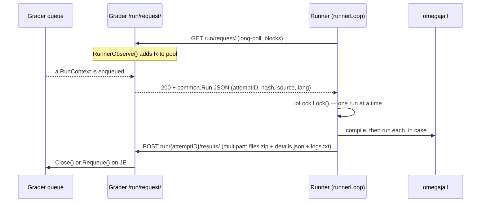

# Internos do corredor

O Runner é o serviço que realmente compila e executa o código enviado por um concorrente, alimenta-o em cada caso `.in` e decide se a saída está correta. É um dos serviços Go que residem em [`github.com/omegaup/quark`](https://github.com/omegaup/quark) — o mesmo repositório que o Grader e o Broadcaster — e *não* faz parte do monorepo PHP. O lado do PHP (`\OmegaUp\Grader` em [`frontend/server/src/Grader.php`](https://github.com/omegaup/omegaup/blob/main/frontend/server/src/Grader.php)) apenas entrega um envio ao avaliador por HTTP; a partir daí, tudo nesta página acontece dentro do quark. Se você mantém um modelo mental em sua cabeça, mantenha este: o Runner **sabe como compilar, executar e canalizar a entrada para os programas que o usuário envia e como verificar se eles estão corretos ou não. É basicamente um frontend bastante distribuído para [omegajail](https://github.com/omegaup/omegajail)** (sandbox baseado em minijail do omegaUp). Tudo abaixo é essa frase, descompactada.

## O Runner como serviço: ele liga para o Grader, e não o contrário

A primeira coisa a desaprender de qualquer diagrama que desenhe uma seta chamada "Grader → Runner" é a direção. Um Runner é um cliente. Quando inicializa ([`cmd/omegaup-runner/main.go`](https://github.com/omegaup/quark/blob/main/cmd/omegaup-runner/main.go)), ele *não* abre uma porta e espera ser chamado; ele inicia uma goroutine `runnerLoop` ([`cmd/omegaup-runner/service.go`](https://github.com/omegaup/quark/blob/main/cmd/omegaup-runner/service.go)) que passa a vida inteira pesquisando o Grader. Cada iteração emite um `GET run/request/` simples contra `Config.Runner.GraderURL` (padrão `https://omegaup.com:11302`), carregando dois cabeçalhos que o identificam: `OmegaUp-Runner-Name` (seu nome de host) e `OmegaUp-Runner-PublicIP` - o último descoberto na inicialização chamando `https://ifconfig.me/ip`, porque o Grader precisa de um endereço roteável para extrair as métricas do Runner's Prometheus na porta `:6060`.

Essa enquete *é* o registro. No lado do Grader, o manipulador `/run/request/` ([`cmd/omegaup-grader/runner_handler.go`](https://github.com/omegaup/quark/blob/main/cmd/omegaup-grader/runner_handler.go)) faz duas coisas com uma enquete recebida: chama `m.RunnerObserve(runnerName, remoteAddr+":6060")` para adicionar o chamador ao pool ativo de executores conhecidos e, em seguida, chama `runs.GetRun(runnerName, ctx.InflightMonitor, …)`, que **bloqueia até que haja realmente uma execução para distribuir**. Assim, um novo Runner aparece no pool no momento em que solicita trabalho e permanece estacionado dentro de uma única solicitação HTTP até que o Grader tenha algo para ele. Não existe uma chamada separada de “olá, eu existo” para sair de sincronia com a realidade.


### Envio round-robin através do pool

A expedição não é inteligente e isso é deliberado. Cada Runner no pool é bloqueado dentro de sua própria chamada `GetRun` na mesma fila `default` compartilhada (`DefaultQueueName`, [`grader/queue.go`](https://github.com/omegaup/quark/blob/main/grader/queue.go)). Quando um envio chega, exatamente um desses goroutines estacionados acorda, recebe a execução e a retorna ao seu Runner como um corpo JSON `common.Run`. Qualquer Runner que esteja esperando terá a próxima corrida - efetivamente um round-robin no pool ocioso, sem aderência. Não há **nenhuma afinidade** entre um Runner e os problemas que ele já armazenou em cache; houve afinidade em algum momento no passado e não seria complicado adicioná-la de volta, mas hoje um Runner pode receber uma submissão para um problema que nunca viu (nesse caso ele busca o conjunto de entrada, veja abaixo).

A fila em si é ordenada por prioridade em vez de um único FIFO: `GetRun` verifica as bandas de prioridade `QueueCount = 4` da esquerda para a direita - `QueuePriorityHigh` (0), `QueuePriorityNormal` (1), `QueuePriorityLow` (2) e `QueuePriorityEphemeral` (3, usado para o graduador efêmero/"experimente agora") - e retorna a primeira execução que encontra, então um o rejulgamento de alta prioridade nunca espera atrás de um acúmulo de envios normais.

Depois que uma corrida é distribuída, ela é rastreada pelo `InflightMonitor`. Esta é a rede de segurança para um corredor que começa a trabalhar e depois morre no meio da série: o monitor arma um `connectTimeout` e um `readyTimeout`, ambos atualmente `10 * time.Minute`. Se o Runner não se conectar novamente ou não terminar nessas janelas, a execução será considerada abandonada e recolocada na fila. O reenfileiramento também é a forma como as falhas transitórias são recuperadas - o manipulador de resultados em `/run/{attemptID}/results/` é reenfileirado em um veredicto `JE` (erro de juiz), e uma execução só obtém tentativas de `Config.Grader.MaxGradeRetries` (atualmente `3`) antes de ser abandonada. Todo o manipulador `/run/` é encapsulado em um `http.TimeoutHandler(…, 5*time.Minute, "Request timed out")`, portanto, um único upload travado não pode fixar uma goroutine do Grader para sempre.

### O mutex por execução: uma execução por vez, sem sobreposição de E/S

Um único processo Runner avalia exatamente **um envio por vez**. Isso é imposto por um `sync.Mutex` global de processo chamado `ioLock` ([`cmd/omegaup-runner/service.go`](https://github.com/omegaup/quark/blob/main/cmd/omegaup-runner/service.go)). No momento em que `gradeRun` começa, ele faz `ioLock.Lock()` com o comentário *"Certifique-se de que nenhuma outra E/S esteja sendo feita enquanto avaliamos esta execução."* O motivo é a fidelidade da medição, não a segurança do thread: o Runner também executa um `benchmarkLoop` em segundo plano (a cada minuto, a menos que a sandbox não operacional esteja em uso) para relatar o quão rápido este host é atualmente, e os números de tempo de CPU e tempo de parede que uma nota produz são apenas confiáveis se nada mais na caixa estiver competindo por E/S e ciclos enquanto o programa em área restrita é executado. A simultaneidade em toda a frota vem da execução de *muitos* processos/hosts do Runner, e não do paralelismo dentro de um. Para dimensionar, adicione Runners.

## O que chega: o `common.Run` e seu conjunto de entradas

O JSON que retorna do `run/request/` é um `common.Run`: um `AttemptID`, o `Language`, o `Source`, um `MaxScore`, o `ProblemName` e – crucialmente – um `InputHash`. Esse hash é o **SHA-1 da entrada do problema `.zip`, uma string de 40 caracteres hexadecimais** como `d41d8cd98f00b204e9800998ecf8427e…`; a rota `/input/` da Grader até a valida com a regex `[a-f0-9]{40}`. O Corredor nunca confia que tem as malas; ele solicita esse hash ao `InputManager` via `runner.NewInputFactory(...)`, e somente se o cache local falhar, ele transmite a entrada definida do nivelador.

Esse download é compactado na rede e no disco. `persistFromTarStream` ([`runner/input.go`](https://github.com/omegaup/quark/blob/main/runner/input.go)) aceita um fluxo tar em uma das três formas - `gzip`, `bzip2` ou descompactado - descompacta-o por meio de um `common.NewHashReader(r, sha1.New())` e recusa tudo se o SHA-1 recalculado não corresponder ao `streamHash` esperado (`"hash mismatch: expected %s got %s"`). À medida que é descompactado, ele grava um manifesto `.sha1` complementar para que a integridade de cada arquivo de caso individual possa ser verificada posteriormente. Historicamente, o Grader enviava esses conjuntos como tarballs bzip2, e é por isso que o `compress/bzip2` ainda está conectado; o transmissor `/input/` da própria motoniveladora atualmente atende a eles `Content-Type: application/x-gzip`. De qualquer forma, uma vez que o conjunto é local, o mesmo hash o torna reutilizável para cada envio futuro para esse problema, de modo que a busca cara acontece uma vez por Runner por versão do problema.

Se o Runner for solicitado a avaliar um conjunto de entrada que ele não possui e não pode buscar, ele não adivinha - ele retorna um erro para que o Avaliador saiba que deve (re)enviar o conjunto. Este é o mesmo "suponha que o Runner o tenha, recupere se não tiver" contrata a antiga API do Runner documentada para sua chamada `/run/`, preservada intacta.

## Compilação: a convenção `Main` e sinalizadores através do omegajail

A classificação começa em `runner.Grade` ([`runner/runner.go`](https://github.com/omegaup/quark/blob/main/runner/runner.go)), e a primeira coisa que verifica é `sandbox.Supported()` - se omegajail não estiver instalado (nenhum `bin/omegajail` em `OmegajailRoot`, padrão `/var/lib/omegajail`), toda a execução volta `JE` imediatamente, porque não há uma maneira segura de executar código não confiável. Supondo que a sandbox esteja presente, `Grade` estabelece um diretório de execução em `RuntimePath/grade/{AttemptID}` e, a menos que `PreserveFiles` esteja definido, `defer os.RemoveAll(runRoot)` garante que cada artefato temporário - fonte, binário, saídas, metadados - seja excluído e os retornos instantâneos da classificação, ganhos ou perdas.

O código enviado é gravado em um local fixo e independente de nome: `runRoot/Main/bin/Main.<ext>` (por exemplo, `Main.cpp`, `Main.py`, `Main.java`), e o destino de compilação é literalmente a string `Main`. Esta é a **Convenção principal** e existe para simplificar a vida do sandbox: nada pode depender da escolha do nome de arquivo do *usuário*. Especificamente em Java, é por isso que sua classe deve ser `Main` e estar fora de qualquer pacote - se omegajail compilar corretamente, mas nenhum `Main.class` for produzido, o Runner reescreverá o veredicto para `CE` com a mensagem *"Classe \`Main\` não encontrada. Certifique-se de que sua classe seja chamada \`Main\` e esteja fora de todos os pacotes."* Problemas interativos e validadores personalizados seguem o mesmo formato, cada um obtendo seu nome própria subárvore `bin/`, mas o programa do concorrente é sempre `Main`.

A compilação está em sandbox. `OmegajailSandbox.Compile` ([`runner/sandbox.go`](https://github.com/omegaup/quark/blob/main/runner/sandbox.go)) não desembolsa diretamente para `g++` - ele cria um vetor de argumento para o binário `omegajail` e permite que o minijail envolva o compilador. A invocação se parece com:

```
omegajail
  --homedir <binPath> --homedir-writable
  -1 compile.out   # compiler stdout
  -2 compile.err   # compiler stderr
  -M compile.meta  # time/memory/exit metadata
  -t 30000         # CompileTimeLimit: 30s, in ms
  -O 10485760      # CompileOutputLimit: 10 MiB, in bytes
  --root /var/lib/omegajail
  --compile <lang> --compile-target Main
  --compile-source Main.<ext>
  [ -- <extraFlags> ]
```
Os sinalizadores específicos do idioma residem *dentro* dos perfis do omegajail codificados por `<lang>`, que é como um `--compile cpp17` difere de `--compile c11`; o Runner apenas anexa `extraFlags` após um separador `--` para os casos que precisa influenciar diretamente. O exemplo mais nítido é **execuções de depuração/AddressSanitizer**: quando `run.Debug` é definido em um envio C/C++, o Runner anexa `-static-libasan -fsanitize=address` (estático porque a biblioteca dinâmica ASan não é enviada na sandbox), então *porque ASan consome memória e tempo* ele desativa o limite de memória (`MemoryLimit = -1`), dobra o limite de tempo e adiciona um segundo (`TimeLimit*2 + 1s`) e ultrapassa o limite de saída em 16 KiB para que o relatório do desinfetante possa realmente ser emitido. Essa é a regra POR QUE-com-tudo-O QUE tornada literal: cada mudança de sinalizador é combinada com a consequência do recurso que a força.

Se a compilação falhar - um veredicto não-`OK` de `compile.meta` - `Grade` define o veredicto de execução para `CE`, lê de volta o texto de erro do próprio compilador (de `compile.err`, exceto para Pascal/Lazarus e C#/dotnet que o gravam em `compile.out`), prefixa-o com o nome binário e o retorna como `CompileError`. A árvore temporária ainda é limpa pelo `RemoveAll` diferido. O competidor vê o diagnóstico real do compilador, não um "erro de compilação" genérico.

### Idiomas suportados

As linguagens que o omegajail sabe compilar e executar, conforme aparecem nos perfis e no caminho da nota:

| Idioma | Notas |
|----------|-------|
| C/C++ (`c`, `cpp`, `cpp11`, `cpp17`, `cpp20`) | Cadeia de ferramentas GCC; `cpp` é atualizado automaticamente para `cpp11` para validadores e pais interativos, para que os solucionadores de problemas não sejam forçados a adotar padrões antigos |
| Java (`java`) | A classe deve ser `Main`, fora de todos os pacotes; run obtém um `1000ms` extra porque a inicialização da JVM é lenta |
| Python (`py`, `py2`, `py3`) | O sufixo do nome de destino `_entry` se aplica a idiomas interpretados |
| Ruby (`rb`), Pascal (`pas`), C# (`cs`), Lua (`lua`), Haskell (`hs`) | C# precisa de um `Main.runtimeconfig.json` com link simbólico próximo ao destino antes de compilar |
| Carlos (`kj`, `kp`) | O status de saída `1` (modo de falha `INSTRUCTION`) é mapeado para `TLE` |
| `cat` | "Problemas" somente de saída onde a "fonte" é uma URL de dados de arquivos `.out`; sem compilação, os arquivos são descompactados e verificados diretamente |

## Execução: alimentando cada case `.in` através do sandbox

Com os binários compilados, o `Grade` percorre os grupos e casos do problema em ordem. Para cada caso, ele executa o binário concorrente em relação ao `input.Path()/cases/<name>.in`, capturando stdout para `<name>.out`, stderr para `<name>.err` e metadados de sandbox para `<name>.meta`. A chamada por caso é `OmegajailSandbox.Run`, e seu vetor de argumento omegajail é onde os limites reais de recursos atingem:

```
omegajail
  -0 <name>.in     # stdin = the test case input
  -1 <name>.out    # stdout capture
  -2 <name>.err    # stderr capture
  -M <name>.meta   # metadata
  -m <hardLimit>   # min(HardMemoryLimit=640MiB, problem MemoryLimit), in bytes
  -t <timeLimit>   # problem time limit (+1000ms for java), in ms
  -w <extraWallTime>
  -O <outputLimit> # problem output limit, in bytes
  --root /var/lib/omegajail
  --run <lang> --run-target Main
```
Duas pequenas realidades que vale a pena conhecer. Primeiro, o teto de memória entregue ao kernel é `min(HardMemoryLimit, problem.MemoryLimit)` — um limite global de `640 MiB` que os comentários do código justificam alegremente como *"640MB devem ser suficientes para qualquer um"* — então um problema pode pedir menos, mas nunca mais do que o host está disposto a dar. Em segundo lugar, o Runner nunca passa o `/dev/null` *real* para a prisão; quando um binário não deve receber nenhuma entrada, ele recebe `omegajailRoot/root/dev/null`, um arquivo vazio comum dentro do chroot, porque o nó do dispositivo real não pode ser acessado de dentro do namespace.

Antes de cada execução, o Runner aquece o cache da página com um `inputPreloader` ([`runner/sandbox.go`](https://github.com/omegaup/quark/blob/main/runner/sandbox.go)): ele `mmap`s o arquivo `.in` `PROT_READ`/`MAP_SHARED` e toca um byte por página (voltando para uma leitura completa simples se `mmap` falhar), então o programa do competidor gasta seu valor medido computação de tempo, não bloqueando no disco. Problemas interativos ganham mais máquinas - `libinteractive` configura FIFOs nomeados (`syscall.Mkfifo`) entre um pai "Principal" criador de problemas e o filho competidor, ambos presos, e uma etapa `mergeVerdict` decide a falha quando um lado morre (um `SIGPIPE` ou um dos status de saída 239-242 significa que o * par * se comportou mal, que se torna `VE`, o culpa do validador, então o solucionador de problemas é instruído a corrigi-lo, em vez de o competidor ser penalizado).

### O próprio sandbox: do ptrace syscall-mangling ao seccomp SIGSYS

omegajail descende de uma longa linha de sandboxes de programação competitiva. A linhagem é importante porque a *técnica* mudou. O omegaUp Sandbox original era um fork fortemente modificado de **Moeval, o sandbox usado no IOI, escrito por Martin Mareš**, e isolava programas com `ptrace`: interceptaria um syscall proibido e **substitui-lo-ia por algo inofensivo - por exemplo, troque `setrlimit` por `getuid`, que é totalmente inerte - e então faça o processo acreditar que a chamada original falhou. Foi exatamente assim que a ausência de rede foi falsificada: todas as chamadas para `socket` foram feitas para retornar `-1`, então um programa que tentava telefonar para casa simplesmente viu erros em todos os lugares e desistiu.** Funcionou, mas o ptrace é lento e complicado.

O omegajail moderno substitui isso pelo kernel fazendo o trabalho. Ele é construído em **minijail**, a ferramenta de isolamento de processos do Chrome OS do Google (o `Dockerfile.minijail` em quark literalmente `ADD`s o tarball `minijail-xenial-distrib`) e empilha namespaces PID/rede/montagem, um chroot, rlimits e - o coração disso - um filtro syscall **seccomp-BPF**. Em vez de alterar silenciosamente um syscall incorreto, o filtro faz com que o kernel aumente `SIGSYS` no instante em que o programa faz uma chamada fora do conjunto permitido. O Runner lê isso do arquivo `.meta` e o transforma no veredicto `RFE` (*Erro de função restrita*). É por isso que o isolamento de rede "simplesmente funciona" agora: não há `socket` para falsificar porque o syscall é fatal no limite do kernel. Em kernels anteriores à versão 5.13, omegajail pode recorrer a um detector SIGSYS mais antigo via `--allow-sigsys-fallback`, e há um modo `--disable-sandboxing` usado apenas ao executar dentro do Docker para CI, onde montagens de ligação são trocadas por links simbólicos.

### De `.meta` a um veredicto

A ponte entre "o programa parou" e "o veredicto é X" é `parseMetaFile` ([`runner/sandbox.go`](https://github.com/omegaup/quark/blob/main/runner/sandbox.go)), que lê as linhas chave:valor que omegajail escreve (`status`, `time`, `time-wall`, `mem`, `signal`, `syscall`,…) e mapeia o sinal final para um veredicto:

| Sinal do omegajail | Veredicto | Significado |
|-----------------------|---------|---------|
| `SIGSYS` | `RFE` | O programa fez um syscall proibido - o filtro seccomp o eliminou |
| `SIGALRM`, `SIGXCPU` | `TLE` | Acabou o tempo de CPU/parede |
| `SIGXFSZ` | `OLE` | Escreveu mais do que o limite de saída |
| `SIGSEGV`, `SIGABRT`, `SIGFPE`, `SIGKILL`, `SIGILL`, `SIGBUS`, `SIGPIPE` | `RTE` | Erro/travamento de tempo de execução |
| nenhum, status de saída `0` | `OK` | Saída limpa (verificação de saída pendente) |
| nenhuma, saída diferente de zero | `RTE` | Saída diferente de zero (exceto `c`, onde uma saída diferente de zero é tolerada) |

Há uma pós-verificação de memória no topo do sinal: se o `mem` medido exceder o `MemoryLimit` do problema - ou, para Java, se a saída for diferente de zero *e* o stderr contém `java.lang.OutOfMemoryError` - o veredicto é reescrito para `MLE`. Os veredictos são combinados entre casos com `worseVerdict`, que indexa em uma única ordem canônica do pior para o melhor: **`JE, CE, RFE, VE, MLE, RTE, TLE, OLE, WA, PA, AC, OK`**. Um grupo é tão bom quanto o seu pior caso, e toda a série é tão boa quanto o seu pior grupo.

## Validação de saída: comparando o que o programa imprimiu com o que era esperado

Um veredicto de `OK` de execução significa que o programa *executou*; isso não significa que estava *certo*. A correção é decidida na fase de validação, que para cada caso `OK` compara o `<name>.out` do competidor com o `cases/<name>.out` esperado usando um dos cinco tipos de validador (`common.ValidatorName`, [`common/problemsettings.go`](https://github.com/omegaup/quark/blob/main/common/problemsettings.go)):

- **`token`** — divide ambas as saídas em tokens separados por espaços em branco e exige um token de igualdade exato e que diferencia maiúsculas de minúsculas para o token. Este é o padrão burro de carga.
- **`token-caseless`** — o mesmo, mas comparado com `strings.EqualFold`, então `YES` e `yes` correspondem.
- **`token-numeric`** — tokenize apenas caracteres numéricos e compare cada par de números dentro de uma tolerância (tolerância padrão se o problema não definir uma), usando um épsilon relativo ou absoluto para que as respostas de ponto flutuante não sejam rejeitadas no último bit.
- **`literal`** — não compare nada; analise a saída do competidor como um único número em `[0.0, 1.0]` e *use-o como pontuação*. Principalmente para problemas interativos onde o interator imprime a partitura.
- **`custom`** — execute o próprio programa validador do criador de problemas (compilado como seu próprio binário em sandbox) com a saída do concorrente, o `data.in` original, o `data.out` esperado e os metadados de execução montados em bind; imprime um número em `[0.0, 1.0]` que se torna a pontuação.

A comparação de token reside em `CalculateScore` e `Tokenizer` ([`runner/validator.go`](https://github.com/omegaup/quark/blob/main/runner/validator.go), [`runner/tokenizer.go`](https://github.com/omegaup/quark/blob/main/runner/tokenizer.go)). O tokenizer é deliberadamente cuidadoso com o que conta como espaço em branco: ele trata não apenas os espaços Unicode como separadores, mas também os quatro caracteres de controle Java-espaço em branco, mas não-Unicode-espaço em branco `U+001C` – `U+001F` (FILE/GROUP/RECORD/UNIT SEPARATOR), então um Java `Scanner` e o juiz concordam com os limites do token. Um único token é limitado a `MaxTokenLength = 4 MiB`; qualquer coisa a mais é tratada como EOF. As incompatibilidades transportam informações de linha e coluna de volta para diagnóstico.

O caminho do validador personalizado tem seu próprio tratamento de falhas. Se o validador em si não sair corretamente, o Runner assume uma saída de concorrente vazia (`/dev/null`) em vez de creditar um validador quebrado. E há um toque legal para casos de teste negativos: se um caso não obtiver pontuação máxima e o problema enviar um arquivo `<name>.expected-failure`, o Runner verifica se o stderr do validador *contém* a string esperada - se não, o caso é marcado como `VE` (erro do validador), porque o validador falhou de uma forma que o solucionador de problemas não previu.

A pontuação é aritmética racional exata (`math/big.Rat`, nunca flutuante) para que o crédito parcial seja somado corretamente. Os pesos dos casos são normalizados para que a soma de todos os pesos seja igual a `1` (ou `1/number-of-cases` se os pesos não forem definidos/não positivos), a pontuação de cada caso for `MaxScore × weight × runScore` e um grupo sob a política de pontuação `min` considerar a fração do pior caso em vez da soma. Um grupo só contribui com pontuação se *todos* os casos nele contidos estiverem corretos; um caso `WA` zera o grupo.

## Enviando resultados de volta

Quando a avaliação termina, o Runner não retorna um blob JSON organizado sobre a solicitação que estava atendendo — ele *carrega* para um segundo endpoint, `POST run/{AttemptID}/results/`, como um corpo `multipart` transmitido enquanto a avaliação ainda está em andamento. Três tipos de peças sobem: o pacote de artefatos `files.zip` (um Zip de cada `compile.out/err/meta`, cada `<case>.out/err/meta` e cada saída do validador - é aqui que as saídas de execução brutas e os metadados são compactados para armazenamento), um `details.json` com o `RunResult` estruturado (veredicto, pontuação, divisão por grupo/por caso, tempo, tempo de parede, pico de memória) e um `logs.txt` descompactado.

Como uma compilação lenta ou um caso de longa execução pode deixar a conexão silenciosa por tempo suficiente para acionar um tempo limite de inatividade do `60s`, o gravador de upload (`filesZipWriter`, [`cmd/omegaup-runner/service.go`](https://github.com/omegaup/quark/blob/main/cmd/omegaup-runner/service.go)) emite uma parte `.keepalive` vazia a cada `15 seconds` até que o primeiro byte real de `files.zip` esteja pronto. O manipulador de resultados do avaliador ignora as partes `.keepalive`, decodifica `details.json` na execução, carimba `JudgedBy` com o nome do executor e `Close()`s a execução (concluída) ou `Requeue()`s (em `JE`, até `MaxGradeRetries`). Assim que a resposta for enviada, o `RemoveAll` adiado do Runner apaga `runRoot`, e seu `runnerLoop` volta imediatamente para `GET run/request/` para solicitar o próximo.

## Configuração

O comportamento do corredor é orientado pelo bloco `Runner` de seu arquivo de configuração (padrão em [`common/context.go`](https://github.com/omegaup/quark/blob/main/common/context.go)); as chaves de suporte, com seus padrões atuais:| Chave | Padrão | Finalidade |
|-----|---------|--------|
| `GraderURL` | `https://omegaup.com:11302` | Onde `runnerLoop` pesquisa trabalho e busca conjuntos de entrada |
| `RuntimePath` | `/var/lib/omegaup/runner` | Raiz para cache `input/` e diretórios de rascunho `grade/{AttemptID}` |
| `OmegajailRoot` | `/var/lib/omegajail` | Onde `bin/omegajail` e o chroot `root/` vivem |
| `CompileTimeLimit` | `30s` | Parede dura na compilação |
| `CompileOutputLimit` | `10 MiB` | Limite na saída do compilador |
| `HardMemoryLimit` | `640 MiB` | Teto absoluto; um problema pode pedir menos, nunca mais |
| `OverallOutputLimit` | `100 MiB` | Saída total em todos os casos antes que o restante entre em curto-circuito para `OLE` |
| `PreserveFiles` | `false` | Mantenha `runRoot` para depuração em vez de excluí-lo |

Vale a pena conhecer dois sinalizadores para trabalho local: `-insecure` descarta a autenticação de certificado de cliente TLS mútuo que o Runner normalmente usa para se comunicar com o avaliador (`tls.RequireAndVerifyClientCert`) e `-noop-sandbox` troca no `NoopSandbox` ([`runner/noop_sandbox.go`](https://github.com/omegaup/quark/blob/main/runner/noop_sandbox.go)), que não compila nada e avalia tudo `AC` - útil para exercitar a fila e despachar o encanamento em uma máquina que não possui o omegajail instalado. Há também um modo `-oneshot=run` que avalia a verificação de um único problema a partir da linha de comando, sem nunca tocar no nivelador, que é a maneira mais rápida de reproduzir um bug de avaliação isoladamente.

## Documentação Relacionada

- **[Grader Internals](grader-internals.md)** — a fila, as prioridades e como um envio é despachado aqui
- **[Recurso Sandbox](../features/sandbox.md)** — visão geral do omegajail/minijail
- **[Veredictos](../features/verdicts.md)** — a enumeração completa do veredicto e o que cada um significa
