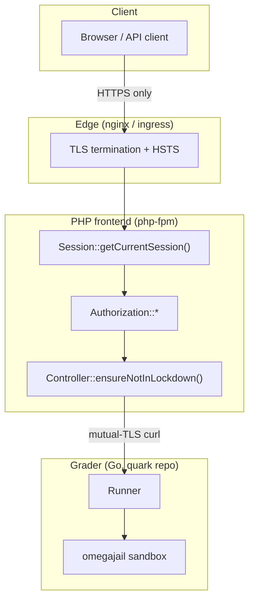

# Arquitetura de segurança

omegaUp é, em sua essência, um lugar onde estranhos fazem upload de código e nós o executamos em nosso
máquinas, durante competições onde o incentivo para trapacear é real. Esse único fato
molda quase todas as decisões de segurança nesta página: presumimos que a rede está sendo
cheirada, presumimos que a submissão é hostil e presumimos que pelo menos uma pessoa
em todo grande concurso está tentando ver o tráfego de outra pessoa. (Isso não é
paranóia – em um concurso de programação alguém sentou e cheirou a LAN,
e com ferramentas como Firesheep tornando o sequestro de sessão um caso de apontar e clicar, o
uma defesa barata é criptografar tudo e não confiar em nada que seja transmitido.)

Esta página direciona a solicitação do navegador para dentro: TLS na borda, o `ouat`
cookie de sessão e como ele é cunhado, tokens de API e OAuth para o programático e
caminhos de terceiros, como as senhas são armazenadas, o que o "bloqueio" faz durante um local
concurso e, finalmente, o sandbox omegajail que mantém o `system("rm -rf /")` do competidor
de chegar a um sistema de arquivos real. A sandbox fica em um **repositório Go separado**
([omegaup/quark](https://github.com/omegaup/quark)), não neste monorepo PHP, e o
a distinção é importante – o frontend nunca toca no minijail; ele só fala HTTP para o
motoniveladora, proprietária da sandbox.


## Tudo viaja por HTTPS

Toda a plataforma é apenas HTTPS, e o motivo é o modelo de ameaça de trapaça em concursos
acima: se alguma solicitação puder sair em texto simples, um token de sessão ou uma declaração de problema
poderia ser lido no fio. O TLS termina na borda (nginx/ingresso k8s),
e o aplicativo é escrito de forma que um token literalmente não possa ser enviado por um meio não criptografado
conexão. Essa garantia é aplicada concretamente em
[`SessionManager::setCookie`](https://github.com/omegaup/omegaup/blob/main/frontend/server/src/SessionManager.php):
o sinalizador `secure` do cookie está definido como `!empty(\OmegaUp\Request::getServerVar('HTTPS'))`,
portanto, o cookie de sessão `ouat` só é emitido com o atributo `Secure` quando o
a solicitação chegou por TLS - um navegador se recusará a enviá-la de volta por HTTP simples.
A mesma chamada marca cada cookie de sessão `httponly => true` (JavaScript não consegue lê-lo,
que atenua o roubo de token baseado em XSS) e `samesite => 'Lax'` (ele não vai andar em um
POST entre sites, que é a defesa CSRF para o próprio cookie).

A origem configurada do próprio frontend, `OMEGAUP_URL`, é uma URL `https://` em
produção, e o link da motoniveladora `OMEGAUP_GRADER_URL` é padronizado como
`https://localhost:21680` – até mesmo o salto de back-end interno é TLS. Esse salto interno é
não apenas criptografado, mas **autenticado mutuamente**: em
[`Grader.php`](https://github.com/omegaup/omegaup/blob/main/frontend/server/src/Grader.php)
o identificador curl é fixado com uma chave de cliente e um certificado
(`CURLOPT_SSLKEY => '/etc/omegaup/frontend/key.pem'`,
`CURLOPT_SSLCERT => '/etc/omegaup/frontend/certificate.pem'`), verifica o par
(`CURLOPT_SSL_VERIFYPEER => true`, `CURLOPT_SSL_VERIFYHOST => 2`) contra
`/etc/omegaup/frontend/certificate.pem` como seu CA e força
`CURLOPT_SSLVERSION => CURL_SSLVERSION_TLSv1_2`. Portanto, o avaliador só aceitará corridas
de um frontend que possui o certificado correto, e o frontend só se submeterá a um
aluno apresentando um certificado em que confia - nenhuma das pontas fala com um estranho.

### Política de segurança de conteúdo e enquadramento

Antes de qualquer controlador ser executado,
[`bootstrap.php`](https://github.com/omegaup/omegaup/blob/main/frontend/server/bootstrap.php)
emite um cabeçalho `Content-Security-Policy` montado a partir de uma lista de permissões explícita
(`connect-src`, `img-src`, `script-src`, `frame-src`) mais um `report-uri` de
`/cspreport.php`, e segue com `X-Frame-Options: DENY`. A lista `img-src` é
deliberadamente permissivo (`*`) com um comentário explicando o porquê - as declarações do problema podem
incorporar imagens de qualquer lugar da Internet, para que não possamos bloquear as origens das imagens sem
quebrando problemas legítimos - mas `script-src` é restrito, enumerando exatamente os
alguns terceiros dos quais carregamos JS (Google/analytics, Facebook, Twitter,
Agente da New Relic). Violações POST-se de volta para `/cspreport.php`, então um romance
tentativa de injeção aparece em nossos logs em vez de ser executada silenciosamente.

## O cookie de sessão `ouat`

Quando um humano faz login através de um navegador, sua sessão é transportada por um cookie chamado
`ouat` — abreviação de **omegaUp Auth Token**, definido como
`OMEGAUP_AUTH_TOKEN_COOKIE_NAME` em
[`config.default.php`](https://github.com/omegaup/omegaup/blob/main/frontend/server/config.default.php)
(linha 9). O valor nesse cookie **não** é um token JWT ou PASETO — é um token opaco,
identificador apoiado por banco de dados. Cunhar é tarefa do `Session::registerSession()` em
[`Session.php`](https://github.com/omegaup/omegaup/blob/main/frontend/server/src/Controllers/Session.php),
e vale a pena ler em ordem de execução porque cada etapa é uma decisão de segurança.

Primeiro ele grava uma linha `IdentityLoginLog` registrando o ID de identidade e o IP do cliente
(`ip2long(REMOTE_ADDR)`), para que haja uma trilha de auditoria de quem efetuou login e de onde.
Então – e este é o movimento anti-cheat – ele chama
`\OmegaUp\DAO\AuthTokens::expireAuthTokens($identity->identity_id)`, que no
[DAO de AuthTokens](https://github.com/omegaup/omegaup/blob/main/frontend/server/src/DAO/AuthTokens.php)
é um `DELETE FROM Auth_Tokens WHERE identity_id = ?` plano. Em outras palavras, **fazer login
destrói todas as sessões anteriores dessa identidade**. Isto dá ao omegaUp uma eficácia
modelo de sessão ativa única: um competidor não pode entregar silenciosamente suas credenciais a um
companheiro de equipe e ambos permanecem logados, porque o segundo login registra silenciosamente o primeiro
fora. É um instrumento deliberadamente contundente e é a razão pela qual um usuário que faz login no
o telefone deles fica desconectado do laptop.

Só então o novo token é construído:

```php
// Session::registerSession(), Session.php
$entropy = bin2hex(random_bytes(self::AUTH_TOKEN_ENTROPY_SIZE)); // 15 bytes -> 30 hex chars
$hash = hash(
    'sha256',
    OMEGAUP_MD5_SALT . $identity->identity_id . $entropy
);
$token = "{$entropy}-{$identity->identity_id}-{$hash}";
```
Portanto, o valor do cookie tem três partes separadas por traços — `{entropy}-{identity_id}-{hash}`:

- **entropia** — `AUTH_TOKEN_ENTROPY_SIZE` (atualmente 15) bytes aleatórios de
  `random_bytes()`, codificado em hexadecimal para 30 caracteres. Esta é a parte indescritível.
- **identity_id** — a identidade numérica à qual o token pertence, transportada de forma clara
  a linha pode ser encontrada e, portanto, usuários com múltiplas identidades (uma "identidade de login" atuando como um
  "identidade de atuação") pode ser resolvido.
- **hash** — `sha256(OMEGAUP_MD5_SALT + identity_id + entropy)`, que vincula a entropia
  e identidade juntos sob um salt do lado do servidor para que um token não possa ser montado por ninguém
  quem não conhece o sal.

O token é então persistido com `AuthTokens::replace(...)` e entregue a
`SessionManager::setCookie(OMEGAUP_AUTH_TOKEN_COOKIE_NAME, $token, 0, '/')` – expiração `0`
significa um cookie de sessão que morre quando o navegador fecha, `Secure`/`HttpOnly`/`SameSite=Lax`
conforme descrito acima.

```mermaid
sequenceDiagram
    participant U as Browser
    participant S as Session::nativeLogin
    participant D as MySQL (Auth_Tokens)
    U->>S: usernameOrEmail + password
    S->>S: testPassword (Argon2id verify)
    S->>D: expireAuthTokens(identity_id)  %% kill old sessions
    S->>D: replace(new token row)
    S-->>U: Set-Cookie: ouat={entropy}-{id}-{sha256}; Secure; HttpOnly; SameSite=Lax
```
### Como um token se torna uma sessão em cada solicitação

Em cada chamada de API, `Session::getCurrentSession()` extrai o token — do
Parâmetro de solicitação `auth_token`, se presente, caso contrário, do cookie `ouat` via
`getAuthToken()` — e resolve isso com
`\OmegaUp\DAO\AuthTokens::getIdentityByToken($authToken)`. Essa consulta é mais sutil
do que uma pesquisa simples: ele une `Auth_Tokens` a `Identities` em
`i.identity_id IN (aut.identity_id, aut.acting_identity_id)`, que é como omegaUp
suporta um login atuando como outra identidade (uma conta de treinador operando uma equipe
identidade, por exemplo) — a linha carrega tanto a **identidade de login** quanto a **identidade de atuação
identidade**, e `ORDER BY is_main_identity DESC` os classifica para que o chamador possa saber qual
é qual. Se o token não resolver, a sessão volta com `valid => false`,
`identity => null` e o nome de classe `user-rank-unranked`; o usuário é simplesmente tratado
como anônimo em vez de receber um erro. Saindo
(`Session::unregisterSession()`) exclui a linha do token e substitui o cookie por
`setcookie(OMEGAUP_AUTH_TOKEN_COOKIE_NAME, 'deleted', 1, '/')`.

## Tokens de API para acesso programático

Os humanos obtêm o cookie `ouat`; scripts e bots recebem **tokens de API**, que chegam em um
Cabeçalho `Authorization` em vez de um cookie para que nunca dependam do estado do navegador.
`SessionManager::getTokenAuthorization()` procura o prefixo `token ` e o remove,
e `Session::getAPIToken()` aceita dois formatos:

```
Authorization: token {api_token}
Authorization: token Credential={api_token},Username={identity}
```
A segunda forma existe porque um usuário com diversas identidades associadas precisa dizer
*qual* identidade o token deve atuar; sem um `Username`, o token mapeia para seu
identidade proprietária única. Qualquer par malformado (algo que não seja `key=value` ou um
`Credential`/`Username` que está faltando) lança `UnauthorizedException` imediatamente —
não há análise de crédito parcial de um cabeçalho de autenticação.

Os tokens de API têm taxa limitada e, diferentemente da sessão do navegador, esse limite é aplicado em
a camada PHP em cada solicitação. Chamadas `getCurrentSession()`
`\OmegaUp\DAO\APITokens::updateUsage(...)` e carimba a resposta com três cabeçalhos
para que um cliente bem comportado possa recuar antes de ser bloqueado:

| Cabeçalho | Significado |
|--------|---------|
| `X-RateLimit-Limit` | o teto — `OMEGAUP_SESSION_API_HOURLY_LIMIT`, atualmente **1.000 solicitações/hora** |
| `X-RateLimit-Remaining` | quantas chamadas restam na janela atual |
| `X-RateLimit-Reset` | o carimbo de data/hora quando a janela é reiniciada |

Quando `remaining` atinge `0`, omegaUp define adicionalmente um cabeçalho `Retry-After` (os segundos
até redefinir) e lança `RateLimitExceededException` - para que o cliente seja informado não apenas
que foi estrangulado, mas exatamente quanto tempo esperar. As sessões são armazenadas em cache em
`Cache::SESSION_PREFIX` codificado pelo token, portanto, a resolução de um token não atinge o MySQL em
cada chamada.

## OAuth2 e login de terceiros

Nem todo mundo se registra com uma senha. omegaUp federa login no Google, Facebook e
GitHub e todos os três canalizam para o mesmo ajudante privado,
`Session::thirdPartyLogin($provider, $email, $name)`: consulta o e-mail com
`Identities::findByEmail()`, e se ninguém corresponder, cria um novo usuário no
local (`User::createUser(..., ignorePassword: true, forceVerification: true)` — não
senha e pré-verificada porque o provedor de identidade já confirmou o e-mail),
em seguida, chama o mesmo `registerSession()` usado pelo login nativo. Então não importa como
você autentica, sai com um cookie `ouat` comum.

Os fluxos do Facebook e do GitHub usam a biblioteca padrão **league/oauth2-client**, empacotada
em duas pequenas classes RAII no topo do `Session.php`:

- **Facebook** — `ScopedFacebook` constrói um
  `\League\OAuth2\Client\Provider\Facebook` com `OMEGAUP_FB_APPID`/`OMEGAUP_FB_SECRET`,
  `graphApiVersion 'v2.5'`, um redirecionamento de volta para `OMEGAUP_URL . '/login?fb'` e solicitações
  apenas o osciloscópio `email`. `loginViaFacebook()` troca o `?code` por um token de acesso,
  busca o proprietário do recurso e se recusa a prosseguir se o perfil não tiver email
  (`loginFacebookEmptyEmailError`) — uma conta sem e-mail não pode ser reconciliada com um
  identidade omegaUp.
- **GitHub** — `ScopedGitHub` constrói um `\League\OAuth2\Client\Provider\Github` com
  `OMEGAUP_GITHUB_CLIENT_ID` / `OMEGAUP_GITHUB_CLIENT_SECRET` e um redirecionamento de
  `OMEGAUP_URL . '/login?third_party_login=github'`. `loginViaGithub($code, $state, ...)`
  primeiro verifica o CSRF: ele compara o `state` retornado pelo GitHub com o valor armazenado
  no cookie `github_oauth_state` e lança `loginGitHubInvalidCSRFToken` em um
  incompatibilidade — esta é a defesa padrão do OAuth `state` contra um retorno de chamada forjado. Então
  troca o código, lê o perfil e obtém o e-mail **verificado principal** do usuário
  de `https://api.github.com/user/emails` (uma conta GitHub pode ter vários e-mails; apenas
  um `verified && primary` é confiável).

O Google é tratado de maneira um pouco diferente porque usa os Serviços de Identidade do Google em vez
do que uma troca de código de redirecionamento. Implementos `loginViaGoogle($idToken, $gCsrfToken, ...)`
Verificação CSRF de **envio duplo de cookies** do Google manualmente: ele lê o cookie `g_csrf_token`
e requer que o `gCsrfToken` postado corresponda exatamente (registrando e rejeitando com
`loginGoogleInvalidCSRFToken` caso contrário), verifica o token de ID no lado do servidor com
`(new \Google_Client(['client_id' => OMEGAUP_GOOGLE_CLIENTID]))->verifyIdToken($idToken)`.
Somente depois que a verificação de assinatura do Google for aprovada é que confiamos no `email` na carga útil e
entregue-o para `thirdPartyLogin('Google', ...)`.

> GitHub OAuth é opcional na produção, mas normalmente configurado para **desenvolvimento local**. Definir
> `OMEGAUP_GITHUB_CLIENT_ID` / `OMEGAUP_GITHUB_CLIENT_SECRET` em
> `frontend/server/config.php` — consulte a seção GitHub OAuth em
> [Configuração de desenvolvimento](../getting-started/development-setup.md).

## Armazenamento de senha

As senhas *são* armazenadas pertencem a contas nativas e são criptografadas com
**Argon2id**, o vencedor da competição de hash de senha, em
[`SecurityTools.php`](https://github.com/omegaup/omegaup/blob/main/frontend/server/src/SecurityTools.php).
`hashString()` prefere o `password_hash($string, PASSWORD_ARGON2ID, ...)` nativo do PHP com
um conjunto de opções ajustado — `memory_cost` de `ARGON2ID_MEMORY_COST` (atualmente **1024 KiB**),
`time_cost` de `SODIUM_CRYPTO_PWHASH_OPSLIMIT_MODERATE` e `threads => 1` – e cai
de volta ao `sodium_crypto_pwhash_str()` da libsodium (com a memória expressa em bytes,
ou seja, `1024 * 1024`) em compilações onde `PASSWORD_ARGON2ID` não está definido. Os dois caminhos são
ajustado para produzir hashes `$argon2id$...` compatíveis, e é por isso que `compareHashedStrings()`
verifica o prefixo `$argon2id$` e roteia para `sodium_crypto_pwhash_str_verify()` quando o
constante nativa está faltando, caso contrário `password_verify()`.

O comprimento da senha é limitado em ambas as extremidades por um motivo. `testStrongPassword()` requer
**8 a 72 caracteres** — 8 como piso para entropia e 72 como teto porque Argon2/bcrypt
hashing é intencionalmente caro, então um invasor que poderia POSTAR um multi-megabyte
"senha" em cada tentativa de login transformaria nosso próprio KDF em um amplificador de negação de serviço.
Limitar a entrada mantém cada hash barato o suficiente para ser seguro sob carga.

Contas antigas são anteriores ao Argon2id – elas foram hashadas com Blowfish – e atualizações do omegaUp
eles de forma transparente. `isOldHash()` informa se um hash armazenado precisa de novo hash (qualquer coisa
não começando com `$argon2id$`, ou com sinalizadores `password_needs_rehash`), e em um
`nativeLogin()` bem-sucedido, o controlador percebe isso, refaz o hash do recém-verificado
texto simples com `SecurityTools::hashString()` e escreve de volta com
`Identities::update()`. Assim, uma senha herdada torna-se silenciosamente uma senha Argon2id, o
na próxima vez que seu proprietário fizer login, sem necessidade de redefinição de senha.

## Tokens PASETO para serviços

Existe um segundo sistema de tokens totalmente separado e é fácil de confundir com o
Cookie `ouat`, para ser mais preciso: o token de sessão do navegador é opaco
`{entropy}-{identity_id}-{sha256}` acima, enquanto **PASETO** (via
[`paragonie/paseto`](https://github.com/paragonie/paseto)) é usado para aplicações de curta duração,
Autorização serviço a serviço *stateless* que nunca toca na tabela de sessão. Ambos
viver em `SecurityTools.php`.

Quando o frontend precisa autorizar um usuário no **omegaup-gitserver** (dados do problema
é armazenado como repositórios git em separado
[omegaup/gitserver](https://github.com/omegaup/gitserver) serviço),
`getGitserverAuthorizationToken($problem, $username)` produz um **PASETO v2 `public`**
token — assimétrico, assinado com `OMEGAUP_GITSERVER_SECRET_KEY` para que o gitserver possa verificá-lo
apenas com a metade pública — que expira em **5 minutos** (`new \DateInterval('PT5M')`),
carrega `issuer 'omegaUp frontend'`, `subject` o nome de usuário e uma única declaração personalizada
nomeando o `problem`. O escopo restrito é intencional: um token gitserver vazado é bom para
exatamente um problema, por cinco minutos, e não pode ser usado para fazer login no site. (Há
também um substituto `OmegaUpSharedSecret` mais simples quando `OMEGAUP_GITSERVER_SECRET_TOKEN` é
configurado.)

A clonagem do curso usa um token **PASETO v2 `local`** —
`getCourseCloneAuthorizationToken()` — que é *simétrico* (criptografado com
`OMEGAUP_COURSE_CLONE_SECRET_KEY`, portanto a carga útil é opaca para o portador) e válida para
**7 dias** (`P7D`). No caminho de volta, `getDecodedCloneCourseToken()` não apenas decodifica
isso; ele faz cumprir as reivindicações com `\OmegaUp\ClaimRule`, exigindo `permissions == 'clone'`
e `course == $courseAlias`, e verifica separadamente `ValidAt` quanto à expiração - jogando
`TokenValidateException('token_invalid')` ou `('token_expired')` respectivamente. Um token
cunhado para clonar o curso A, portanto, não pode ser reproduzido para clonar o curso B, mesmo antes de
expira.

## Modo Lockdown para concursos no local

omegaUp realiza concursos oficiais no local (pense em salas estilo ICPC cheias de competidores em um
LAN bloqueada) e "modo de bloqueio" é como a mesma base de código atende tanto o aberto
internet e um local de competição lacrado. A opção é um nome de host, não uma edição de configuração:
[`bootstrap.php`](https://github.com/omegaup/omegaup/blob/main/frontend/server/bootstrap.php)
calcula

```php
define(
    'OMEGAUP_LOCKDOWN',
    isset($_SERVER['HTTP_HOST']) &&
    strpos($_SERVER['HTTP_HOST'], OMEGAUP_LOCKDOWN_DOMAIN) === 0
);
```
então `OMEGAUP_LOCKDOWN` é `true` sempre que o cabeçalho `Host` da solicitação começa com
`OMEGAUP_LOCKDOWN_DOMAIN` (padrão `localhost-lockdown`). Sirva o local desde o
bloqueie o nome do host e todo o site entre em um modo protegido; servir o site público de
seu nome de host normal e nada muda.

O que o bloqueio realmente *faz* é bloquear as operações perigosas. `Controller::ensureNotInLockdown()`
em
[`Controller.php`](https://github.com/omegaup/omegaup/blob/main/frontend/server/src/Controllers/Controller.php)
é uma linha -

```php
public static function ensureNotInLockdown(): void {
    if (OMEGAUP_LOCKDOWN) {
        throw new \OmegaUp\Exceptions\ForbiddenAccessException('lockdown');
    }
}
```
- e é espalhado pelos controladores que podem vazar informações
o local ou deixar um competidor alcançar o mundo exterior: é chamado em todo
`Contest`, `Problem`, `Course`, `User`, `Admin`, `Certificate`, `QualityNomination` e
`Run`. Durante um concurso bloqueado, os endpoints que permitiriam, por exemplo, editar seu
perfil, navegue por problemas não relacionados ou exfiltre dados simplesmente jogue `forbidden` enquanto o
O caminho principal "leia os problemas deste concurso e envie-os" continua funcionando. O cheque é
colocado em linha em cada operação protegida, em vez de como um único portão global, precisamente assim
que as operações seguras permaneçam disponíveis enquanto as arriscadas não.

## A caixa de areia omegajail

Tudo acima protege o *frontend*. A última linha de defesa protege o
*máquinas que executam o código do concorrente*, e ele reside inteiramente no Go Grader
([omegaup/quark](https://github.com/omegaup/quark)) — o monorepo PHP não tem nenhuma referência
para minijail ou sandbox, porque ele nunca executa código não confiável. Ele entrega o
envio ao avaliador pelo canal TLS mútuo descrito anteriormente
(`\OmegaUp\Grader::grade()` → `/run/new`, `/run/grade/`) e o **corredor** da niveladora
faz a compilação e execução reais dentro da sandbox. Se você quiser a linha única
modelo mental: o runner é basicamente um frontend bonito e distribuído para o sandbox.

A caixa de areia é **omegajail**
([omegaup/omegajail](https://github.com/omegaup/omegajail)), descendente de omegaUp de
**minijail** do Google — um programa Rust (`RUST_LOG=debug`, `RUST_BACKTRACE=1` em seu
ambiente) invocado como um subprocesso. O corredor ainda envia um `Dockerfile.minijail` legado
em quark, mas o sistema em execução usa omegajail (atualmente v3.10.4, descompactado para
`/var/lib/omegajail`, o `OmegajailRoot` padrão em
[`common/context.go`](https://github.com/omegaup/quark/blob/main/common/context.go)). O
a integração está em
[`runner/sandbox.go`](https://github.com/omegaup/quark/blob/main/runner/sandbox.go):
`OmegajailSandbox` cria uma linha de comando `bin/omegajail` e desembolsa para ela via
`invokeOmegajail()`.

### O que o Omegajail restringe

omegajail envolve o processo não confiável em um **chroot** (`--root /var/lib/omegajail`) com
seu próprio `/dev` mínimo (um `/dev/null` real do `mknod` - a sandbox até substitui um
arquivo vazio para `/dev/null` em vez de expor o host), executa-o dentro do Linux
namespaces para que não possa ver os processos do host ou a rede e confina todas as gravações a um
diretório inicial por execução (`--homedir <chdir>`, tornado gravável apenas durante a compilação com
`--homedir-writable`). Arquivos que a execução precisa legitimamente - a entrada de teste como `data.in`,
dados extras — são copiados ou montados em bind (`--bind source:target`) nessa prisão; quando
sandboxing está desabilitado para desenvolvimento local (`--disable-sandboxing`), montagens de ligação não são
possível, então o código volta a vincular simbolicamente os alvos.

A filtragem de chamadas do sistema é aplicada com **seccomp-BPF**: omegajail instala uma política que
mata o processo em um syscall não permitido e detecta essas mortes por meio de um `SIGSYS`
manipulador. Em kernels anteriores a 5.13, esse detector precisa de uma implementação alternativa, que
é por isso que a sandbox expõe `--allow-sigsys-fallback` (apareceu como
`OmegajailSandbox.AllowSigsysFallback`). O efeito prático da política é aquele que
assuntos para um juiz: uma submissão que tenta abrir uma tomada, bifurcar um enxame de processos,
ou `execve` um shell é interrompido no limite do kernel, nunca dentro do nosso código.

### Limites de recursos e os veredictos que eles produzem

Os limites são passados para omegajail como sinalizadores explícitos e aplicados pela sandbox, não pelo
Vá processar a pergunta educadamente. De `OmegajailSandbox.Run()`:

| Bandeira | Significado |
|------|---------|
| `-m <bytes>` | teto de memória — `min(HardMemoryLimit, problem limit)`; o hard cap é **640 MiB** (o comentário da fonte diz *"640MB deve ser suficiente para qualquer pessoa"*) |
| `-t <ms>` | Limite de tempo da CPU (Java recebe **+1000 ms** adicionados, porque a inicialização da JVM não é culpa do competidor) |
| `-w <ms>` | tempo extra de relógio além do limite da CPU, para capturar um programa que dorme ou bloqueia |
| `-O <bytes>` | limite de tamanho de saída, para que um programa não possa preencher o disco imprimindo para sempre |
| `-M <file>` | o arquivo de metadados omegajail grava com o resultado |

A compilação é executada com seu próprio orçamento via `OmegajailSandbox.Compile()` —
`CompileTimeLimit` de **30 segundos** e `CompileOutputLimit` de **10 MiB** (ambos de
`common/context.go`). Após cada invocação, o executor lê o meta-arquivo com
`parseMetaFile()` e transforma o estado de saída bruto em um veredicto: `OK`, `CE` (erro de compilação),
`JE` (erro de julgamento — por exemplo, um arquivo de origem que resolve fora do chroot é rejeitado
antes de ser executado, com `"file %q is not within the chroot"`), e os veredictos de tempo de execução
a sandbox deriva dos limites que acabou de impor. Há até mesmo específico de idioma
manipulação integrada - após uma compilação Java, o executor verifica se o esperado
`<target>.class` realmente existe e reescreve um resultado `OK` em um `CE` com um
mensagem útil (*"Certifique-se de que sua classe se chama `<target>` e está fora de todos os pacotes"*),
porque um arquivo Java que compila, mas produz o nome de classe errado, caso contrário, falharia
misteriosamente em tempo de execução.

## Documentação relacionada

- **[Runner internals](runner-internals.md)** — o pipeline de classificação que impulsiona o sandbox
- **[API de autenticação](../reference/api.md)** — os pontos de extremidade de login, token e OAuth
- **[Códigos de erro](../reference/api.md)** — incluindo `lockdown`, `loginRequired` e os erros CSRF acima
