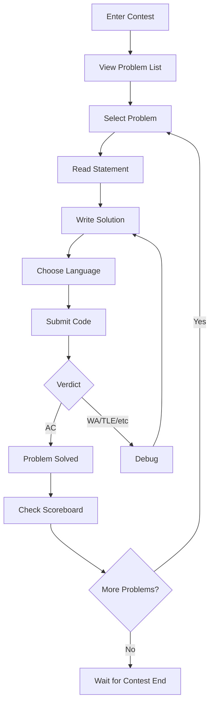

#Arena

Arena é o serviço web que o Frontend precisa chamar para tudo relacionado a concursos - e também para um pouco de administração de concursos, como editar os problemas anexados a um concurso. Historicamente, ele foi planejado como um componente próprio: parte do Frontend durante a v1 e depois dividido como um serviço independente a partir da v2. Na prática, o que existe no omegaUp hoje é a forma v1 - a Arena é o conjunto de componentes de arquivo único Vue em `frontend/www/js/omegaup/components/arena/` (`Arena.vue`, `Contest.vue`, `ContestPractice.vue`, `Scoreboard.vue`, `Runs.vue`, `RunSubmitPopup.vue`, `Clarification.vue`, `Summary.vue`, `NavbarMiniranking.vue` e amigos), todos conversando com o mesmo Endpoints da API PHP descritos abaixo. A antiga divisão v2-standalone nunca aconteceu, mas o contrato de API que a Arena fala é exatamente aquele elaborado para ela, então esta página documenta esse contrato como aquilo que você realmente constrói.

O objetivo da Arena é ser o rosto para o qual os competidores olham durante toda a competição. Sua função, nas palavras da especificação UX original, é mostrar o ambiente do concurso; exibir, enviar e revisar envios de problemas; apresentar esclarecimentos; renderizar uma mini-classificação; renderizar o placar completo; e desenhe o gráfico de progresso da pontuação (pontos ao longo do tempo). Uma decisão de design deliberada desde o primeiro dia foi que essa camada seria escrita 100% em HTML/JavaScript para que a mesma UI pudesse ser conduzida por _Arena_ e _Frontend_ – e é exatamente por isso que a migração para componentes de arquivo único Vue ocorreu de forma tão limpa: a camada de apresentação sempre foi concebida para ser um thin client sobre a API.

## Layout da arena

```
┌─────────────────────────────────────────────────────────────┐
│  Contest Title                              Timer: 01:30:00 │
├─────────┬───────────────────────────────────────────────────┤
│         │                                                   │
│ Problem │              Problem Statement                    │
│  List   │                                                   │
│         │  - Description                                    │
│  [A]    │  - Input/Output format                           │
│  [B]    │  - Constraints                                   │
│  [C]    │  - Examples                                      │
│         │                                                   │
│─────────┼───────────────────────────────────────────────────│
│         │                                                   │
│ Submit  │              Code Editor                          │
│ History │                                                   │
│         │  [Language: C++17 ▼]  [Submit]                   │
│         │                                                   │
├─────────┴───────────────────────────────────────────────────┤
│                    Scoreboard / Clarifications              │
└─────────────────────────────────────────────────────────────┘
```
O lado esquerdo é a lista de problemas (`NavbarProblems.vue`) mais o histórico de envio do usuário atual para o problema selecionado (`Runs.vue`); o painel central alterna entre a instrução renderizada e o editor de código (`CodeView.vue`/`RunSubmitPopup.vue`); a gaveta inferior alterna entre o placar (`Scoreboard.vue`) e os esclarecimentos (`ClarificationList.vue`). A mini-classificação (`NavbarMiniranking.vue`) acompanha a barra de navegação para que você sempre veja o topo da classificação sem sair do problema em que está.

## O ciclo de envio


## Como cada chamada de API é moldada

Antes de qualquer endpoint individual, quatro convenções são válidas em todos os lugares e são assumidas no restante desta página.

Cada chamada reside no `https://omegaup.com/api/` - no `/api/` e não na raiz do site - porque o SSL só existe no `omegaup.com`, e tudo o que diz respeito a um concurso tem que ser criptografado (houve um concurso de programação real onde alguém se sentou e farejou o tráfego; entre isso e os ataques do tipo Firesheep, criptografar tudo é o único padrão sensato).

A maioria das chamadas precisa de um `auth_token`, que você obtém ligando para `/api/user/login/` ou fazendo login na página normal. O tratamento da sessão passa pelo `POST`, mas os cookies também funcionam, portanto, as chamadas `GET` podem transportar autenticação sem passar o token pela string de consulta. Os parâmetros viajam como JSON e qualquer chamada que exija autenticação deve conter um `auth_token` válido.

Cada resposta carrega um campo `status`. Em caso de sucesso, é a string literal `ok`. Em caso de falha, é `error`, e o corpo também carrega uma descrição `error` legível por humanos **em qualquer idioma para o qual a conta esteja configurada**, além de um `errorcode` (numérico) e um `errorname` (texto) para que o código possa ramificar na falha sem analisar a prosa.

Além desse envelope, o servidor define o status HTTP para corresponder. As duas linhas que mais importam são a divisão 403/404, porque codifica uma decisão de segurança real:

| Código | Resposta | O que significa |
| ---- | -------- | ------------- |
| 200 | OK | A solicitação foi bem-sucedida. |
| 400 | PEDIDO RUIM | A solicitação (incluindo o corpo JSON) está malformada. |
| 401 | AUTENTICAÇÃO NECESSÁRIA | Falta `auth_token` na solicitação, seja por cookie ou por meio do corpo JSON. |
| 403 | PROIBIDO | O recurso foi **encontrado**, mas você não tem privilégios para lê-lo ou modificá-lo — um usuário tentando ler as corridas de outra pessoa ou abrir o painel de administração de um concurso. |
| 404 | NÃO ENCONTRADO | O recurso não foi encontrado (um usuário, problema, concurso, execução…), **ou** foi encontrado, mas está deliberadamente oculto — como acontece com concursos privados. |
| 505 | ERRO INTERNO DO SERVIDOR | A solicitação terminou inesperadamente. O corpo pode até estar vazio ou a descrição ambígua. Esperamos que os registros tenham mais a dizer sobre isso. |

!!! aviso "A regra 403-vs-404 é intencional, não desleixada"
    Um concurso privado para o qual você não foi convidado retorna **404, não 403** – de propósito. Um 403 vazaria que o concurso existe; 404 mantém um concurso privado invisível para qualquer pessoa que não tenha sido explicitamente adicionada. Se você estiver tocando no código de visibilidade, não "conserte" isso em um 403.

## Entrando na Arena

Três rotas retornam HTML em vez de JSON — o shell da arena real:

- `GET /arena/` — o pouso na arena. Se você não estiver logado, será exibida a lista dos concursos públicos atuais; se estiver, mostra a lista de concursos aos quais você pertence.
- `GET /arena/:contest_alias` — a introdução do concurso. Desconectado, você obtém os detalhes do concurso e um botão *Entrar*; logado, os mesmos detalhes, mas o botão passa a ser *Iniciar o concurso*. Essa distinção é importante porque o início da competição é o que marca seu relógio pessoal quando o `window_length` está em jogo (veja abaixo).
- `GET /arena/:contest_alias/scoreboard` — se você puder vê-lo, o HTML que apresenta o conteúdo do `/api/problemset/scoreboard/` graficamente.

## Listagem de concursos — `GET /api/contest/list`

Retorna, por padrão, os últimos 20 concursos que o usuário “pode ver”. Você restringe a lista com quatro filtros, cada um um enum: `active` (`ACTIVE`, `FUTURE`, `PAST`), `recommended` (`RECOMMENDED`, `NOT_RECOMMENDED`), `participating` (`YES`, `NO`) e `public` (`YES`, `NO` — concursos públicos versus aqueles em que você estava inscrito).

Cada resultado carrega os campos de identidade usuais (`contest_id`, `problemset_id`, `alias` - o alias é o que você precisa para realmente chegar ao concurso - `title`, `description`), a programação como carimbos de data / hora Unix (`start_time`, `finish_time`, `last_updated`) e três campos que vale a pena destacar:

- `admission_mode` é `enum['public', 'private', 'registration']` — público, privado ou "requer que o usuário se registre primeiro".
- `duration` é o intervalo de tempo em que o concurso está aberto (apenas `finish_time - start_time`).
- `window_length` é quanto tempo cada usuário recebe *depois de abrir pessoalmente o concurso* — e **retorna `null` se o concurso não foi configurado com esse recurso**, o que significa que todos compartilham a mesma janela global de `start_time` a `finish_time`.

## Criando um concurso — `POST /api/contest/create`

Se o chamador tiver um `auth_token` válido, isso criará um novo concurso sem problemas ainda. É necessário o título/descrição/`start_time`/`finish_time`, um `alias` de até 32 caracteres e uma pilha de botões de pontuação. Aqueles que carregam semântica real:

- `window_length` (int) — opcional; defina-o se todos os usuários receberem a mesma quantidade de tempo, independentemente de *quando* entrarem.
- `points_decay_factor` (o dobro na faixa `(0,1)`) — a rapidez com que os pontos de um problema diminuem durante a competição. **O padrão é 0 (os pontos não decaem). Para referência, o TopCoder usa 0,7 ** - essa é a âncora para a sensação de um concurso de "alta decadência".
- `submissions_gap` (int, no intervalo `(0, finish_time - start_time)`) — o número mínimo de segundos que um usuário deve esperar após um envio antes de fazer outro.
- `penalty` (int, `(0, INF)`) — minutos adicionados como penalidade por veredicto não aceito.
- `penalty_type` (`none`, `problem_open`, `contest_start`, `runtime`) — *como* a penalidade por envio é calculada, ou seja, em que momento o relógio começa.
- `scoreboard` (int `(0,100)`) — a porcentagem da duração da competição durante a qual o placar permanece visível. `show_scoreboard_after` (bool) então decide se o placar completo será revelado quando a competição terminar.
- `public` (bool) — o padrão é **privado**, e um concurso **não pode ser tornado público até que haja problemas**, e é por isso que você o cria vazio e o inverte mais tarde.
- `languages` — o conjunto de idiomas permitidos (`kp`, `kj`, `c11-gcc`, `c11-clang`, …), separados por vírgula para mais de um.
- `basic_information` (bool) — se os usuários devem preencher suas informações básicas (país, estado, escola) antes de poderem ingressar.
- `requests_user_information` (`no`, `optional`, `required`) — se o organizador pede permissão para visualizar as informações pessoais dos concorrentes.

## Detalhes do concurso público — `GET /api/contest/publicdetails/`

Se o usuário tiver permissão para vê-lo, serão exibidos os detalhes do concurso `:contest_alias` – informações mínimas sobre o problema, tempo restante, mini-classificação. Nas palavras do autor original, é *"uma pequena consulta agradável, carismática e armazenável em cache."* Esse "armazenável em cache" é um sinal de design, não um descarte: esse endpoint deve ser barato e servido a partir do cache, portanto, trate-o como seu caminho rápido para qualquer coisa que um visitante público e desconectado veja.

A carga ecoa o cronograma e os mesmos botões de pontuação da criação, com o mesmo comportamento de borda: `window_length` (int) é o tempo que o usuário tem para enviar e **se for `NULL` a janela é o concurso inteiro**; `scoreboard` é a porcentagem de visibilidade de 0–100; `points_decay_factor` novamente assume o padrão **0 (sem decaimento), TopCoder é 0,7**; `partial_score` (bool) é verdadeiro se o usuário ganha pontos parciais por problemas não resolvidos em todos os casos; `penalty_calc_policy` é `enum('sum', 'max')`; e `penalty_time_start` informa se o tempo de penalidade começa a contar a partir da abertura do concurso ou da abertura do problema.

## O placar — `GET /api/problemset/scoreboard/`

Se o usuário tiver as permissões corretas, isso retornará a classificação completa do concurso com aquele `problemset_id` (`auth_token` é opcional aqui — um placar público pode ser lido sem ele). Ele retorna como um array `problems` (cada entrada é um `order` para classificação e um `alias`) mais um array `ranking`. Cada linha de classificação é um concorrente: `username`, display `name`, `country` e `classname` – a classificação/nível que o usuário obteve em sua trajetória na plataforma, que é o que impulsiona o estilo colorido do nome de usuário. Um sinalizador é fácil de ignorar: `is_invited` (bool) distingue um usuário que foi **explicitamente convidado** de outro que simplesmente entrou em um concurso público. Cada linha carrega um `total` de `points` e `penalty` e um detalhamento por problema (`alias`, `points`, `penalty`, `percent` e `runs` - o número de envios que este usuário fez sobre esse problema neste concurso).

### Eventos de progresso de pontuação — `GET /api/problemset/scoreboardevents/`

O mesmo portão de permissão, mas em vez da classificação atual ele retorna **todos os eventos que fizeram com que a pontuação de alguém mudasse** — é daí que o gráfico de progresso da pontuação é extraído. Cada evento tem o competidor (`username`, `name`, `country`, `classname`, `is_invited`), um `delta` (o número de segundos *desde o início da competição* em que o evento aconteceu), o `total` em execução (`points`, `penalty`) e o `problem` que o acionou (`alias`, `points`, `penalty`). Plote `total.points` em relação a `delta` por usuário e você obterá o clássico gráfico de escada ascendente.

## Lendo um problema — `GET /api/problem/details/`Com as permissões corretas, isso retorna o conteúdo do problema, além de referências às soluções que o chamador já enviou. Juntamente com a própria declaração (`statement.markdown`, `statement.language` e qualquer `statement.images`), você obtém os metadados que definem o contrato de julgamento: `time_limit` e `memory_limit`, `input_limit` e `validator` - `enum('remote','literal','token','token-caseless','token-numeric')`, que decide como a saída é comparada (literal exato, token por token, tokens que não diferenciam maiúsculas de minúsculas ou tokens numéricos dentro de uma tolerância). O bloco `settings` explica os limites reais que a motoniveladora impõe - `TimeLimit`, `OverallWallTimeLimit`, `ExtraWallTime`, `MemoryLimit`, `OutputLimit` - mais o `cases`, onde cada caso de amostra carrega seu `in`, `out` e `weight`.

A matriz `runs` é o histórico de envio do próprio chamador para esse problema e é onde as duas enumerações serão comparadas ao vivo. `status` percorre `'new' → 'waiting' → 'compiling' → 'running' → 'ready'` – o ciclo de vida de um envio, desde a fila até o julgamento. `veredict` (sim, o campo está escrito dessa forma) é a resposta final, uma de `'AC'` (aceita), `'PA'` (parcial), `'PE'` (erro de apresentação), `'WA'` (resposta errada), `'TLE'` (limite de tempo excedido), `'OLE'` (limite de saída excedido), `'MLE'` (limite de memória excedido), `'RTE'` (erro de tempo de execução), `'RFE'` (erro de função restrita), `'CE'` (erro de compilação) ou `'JE'` (erro de juiz). Cada execução também relata `runtime`, `memory`, `score`, `contest_score` e `submit_delay` — **o número de minutos desde o momento em que o usuário abriu o problema até o momento em que o enviou**, que é o valor do cálculo da penalidade.

## Enviando uma solução — `POST /api/run/create/`

Este é o ponto final em torno do qual toda a Arena orbita. Quando você clica em *Enviar*, o JavaScript publica `{ auth_token, problem_alias, language, source, contest_alias? }` — `contest_alias` opcional, presente apenas quando o problema pertence ao conjunto de problemas de um concurso. A solicitação segue a cadeia padrão: `frontend/www/api/ApiEntryPoint.php` requer `frontend/server/bootstrap.php`, que passa para `\OmegaUp\ApiCaller::httpEntryPoint()`, que roteia `run/create` para `\OmegaUp\Controllers\Run::apiCreate` (observe que a classe é `Run`, não `RunController` - os controladores omegaUp eliminam o sufixo `Controller`). Você pode lê-lo em `frontend/server/src/Controllers/Run.php` (`apiCreate` começa na linha 415).

`apiCreate` primeiro autentica a identidade e depois valida: todos os campos obrigatórios estão presentes (`source`, idioma, problema e concurso, se houver), o problema está realmente no concurso e ambos são válidos, o limite de tempo do concurso não expirou, o usuário não está excedendo a taxa de envio e o concurso é público ou o usuário foi explicitamente adicionado a ele. O limite de taxa é `submissions_gap`, cujo padrão é **60 segundos** — `Run::$defaultSubmissionGap = 60` em `Run.php:26` — ou seja, um envio por problema por minuto, a menos que o concurso o substitua. Somente depois de tudo isso ele grava as linhas `Submissions` e `Runs` no MySQL e então chama `\OmegaUp\Grader::getInstance()->grade($run, trim($source))` em `Run.php:573`.

!!! note "O avaliador é um serviço separado, acessado por HTTP"
    `\OmegaUp\Grader` é um cliente thin curl, não a niveladora em si. Ele POSTiza a execução para `OMEGAUP_GRADER_URL` (padrão `https://localhost:21680`), e a classificação real - a fila, os corredores, a sandbox minijail - reside no repositório Go [`omegaup/quark`](https://github.com/omegaup/quark) separado. Este endpoint PHP nunca toca no minijail; apenas passa o fio. Se `grade()` for lançado, `apiCreate` não poderá reverter dentro de uma transação (o processo do Grader não veria a linha), então ele desvincula e exclui as linhas `Run`/`Submission` manualmente.

A resposta é pequena, mas cada campo tem um caso extremo incorporado:

- `guid` — o identificador do envio, que você usará para pesquisar o veredicto.
- `submission_deadline` (Timestamp) — prazo para envio de submissões. **É 0 quando você não está em um concurso** (`Run.php:617`/`635`); dentro de um concurso é o `end_time` do conjunto de problemas ou `start_time + window_length` quando uma janela por usuário se aplica.
- `nextSubmissionTimestamp` (Timestamp) — o primeiro momento em que o usuário poderá submeter este problema novamente, ou seja, agora mais o `submissions_gap`. É contra isso que o botão Enviar faz a contagem regressiva.

## Assistindo o resultado voltar

Uma inscrição é julgada de forma assíncrona, por isso as enquetes da Arena. `GET /api/problem/runs/` retorna referências às soluções mais recentes do chamador para um problema com seu `status` e veredicto; `GET /api/run/details/` (codificado por `run_alias`) retorna a imagem completa para uma execução - o `source`, um sinalizador `admin` e um bloco `details` com o `verdict`, `compile_meta` por fase (`time`, `sys_time`, `wall_time`, `memory`), o `score`/`contest_score`/`max_score`, execução `time`, `wall_time`, `memory` e `judged_by` (qual executor cuidou disso). Enquanto uma execução está em `new`/`waiting`/`compiling`/`running`, a IU mostra um controle giratório; uma vez que `run/details` relata `ready` com um veredicto, ele interrompe a pesquisa e pinta o resultado.

!!! dica "Veredictos, em resumo"
    `AC` todos os casos aprovados · `PA` parcial (alguns casos, quando o `score_mode` do concurso permite crédito parcial) · `WA` resposta errada · `TLE` acima do limite de tempo · `MLE` acima do limite de memória · `OLE` acima do limite de saída · Erro de tempo de execução `RTE` · Erro de função restrita `RFE` (um syscall banido) · Erro de apresentação `PE` · Erro de compilação `CE` (verifique `compile_meta`) · Erro de juiz `JE` (culpa nossa, não sua).

## Esclarecimentos

Durante um concurso, um competidor preso faz uma pergunta ao autor do problema. `POST /api/clarification/create/` pega `{ auth_token, problem_alias, contest_alias?, message }` (concurso opcional se o problema não estiver em um concurso) e retorna um `clarification_id` para rastreá-lo. Para lê-los, `GET /api/problem/clarifications/` e `GET /api/contest/clarifications/` retornam **todos** os esclarecimentos que o usuário tem permissão para ver - que são exatamente aqueles que ele enviou pessoalmente, mais todos os esclarecimentos marcados como públicos - paginados com `offset` (padrão 0) e `rowcount` (padrão 20). Cada entrada carrega `author`, `message`, `answer` (`null` até ser respondido), `time` e o sinalizador `public`; a variante do concurso também traz `receiver` (`null` para transmissão para todos). Somente o criador do problema ou do concurso pode responder, via `POST /api/clarification/update/` com `{ auth_token, clarification_id, answer, public }` — mude `public` para verdadeiro e a resposta se tornará visível para todo o concurso, em vez de apenas para quem fez a pergunta.

## Modos de concurso

Os mesmos componentes renderizam três modos, determinados por onde "agora" cai em relação à janela do concurso.

**Modo de treino** (`ContestPractice.vue`) funciona *fora* do horário do concurso: sem cronômetro, detalhes completos do veredicto visíveis, envios ilimitados e nada afeta o placar. É o modo “volte e realmente aprenda o problema”.

**Modo concurso** (`Contest.vue`) é executado *durante* a janela: o cronômetro faz a contagem regressiva em relação ao `submission_deadline`, os detalhes do veredicto podem ser restritos de acordo com a configuração `feedback` do concurso, o placar ao vivo fica visível para a porcentagem de duração configurada do `scoreboard` e o limite de taxa `submissions_gap` é aplicado.

**Concurso virtual** reproduz um concurso anterior em relação aos problemas e limites de tempo originais, mas em um relógio pessoal, para que você possa se avaliar em relação à classificação original após o fato.

## Visualização do administrador do concurso

Um diretor de concurso vê a mesma Arena mais a superfície administrativa: as inscrições de cada participante (não apenas as suas próprias - essa é a abertura do portão 403 para o proprietário), a capacidade de rejeitar inscrições específicas, transmitir anúncios a todos os competidores, responder esclarecimentos e estender o tempo do concurso. Eles reutilizam os mesmos endpoints; a diferença está inteiramente nas verificações de permissão que os controladores executam, não em uma interface de usuário separada.

## Documentação relacionada

- **[Concursos](contests/index.md)** — gerenciamento e configuração de concursos
- **[Problemas](problems/index.md)** — criação de problemas e configurações de julgamento mencionadas acima
- **[Atualizações em tempo real](realtime.md)** — como os veredictos e os placares são atualizados
- **[Veredictos](verdicts.md)** — a enumeração completa do veredicto explicada
- **[API de concursos](../reference/api.md)** — a referência do endpoint
