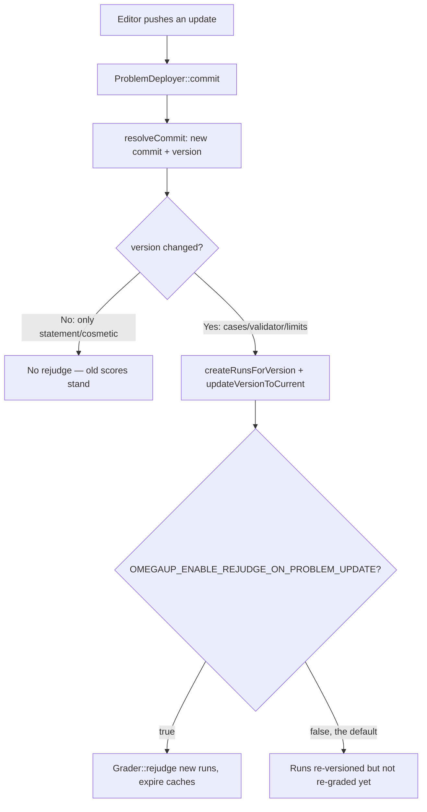

# Problema de versionamento

Cada problema no omegaUp é um verdadeiro repositório git. Não "controlado por versão" em algum sentido metafórico - um repositório simples, um por problema, armazenado fisicamente e servido por **gitserver**, um pequeno serviço Go (`github.com/omegaup/gitserver`, enviado como a imagem Docker `omegaup/gitserver`, atualmente `v1.9.13`) construído sobre libgit2 (`git2go/v33`) e o transporte HTTP inteligente `githttp/v2`. O frontend do PHP nunca toca diretamente nesses repositórios; ele se comunica com o gitserver por HTTP simples em `OMEGAUP_GITSERVER_URL` (padrão `http://localhost:33861`, onde `33861` é `OMEGAUP_GITSERVER_PORT` em `frontend/server/config.default.php`).

Fazemos isso dessa maneira porque um problema de programação competitiva não é um documento - é um conjunto de declarações, casos de teste, validadores, soluções e configurações de classificação que são editados independentemente por pessoas diferentes em momentos diferentes, e onde um único arquivo `.out` errado descoberto no meio do concurso deve ser corrigível *sem* remarcar silenciosamente todos os que já se inscreveram. O Git já resolve histórico, atualizações atômicas, diferenças e "me dá exatamente os bytes que estavam ativos no commit `abc123`". Em vez de reinventar isso no MySQL, o omegaUp se apoia no git e gasta seu próprio código em duas coisas que o git *não* sabe: **quem tem permissão para ver quais arquivos** e **quais alterações são cosméticas versus relevantes para a classificação**.

## O layout da filial: conteúdo dividido por visibilidade

O modelo mental ingênuo – um `master` para a versão publicada, um `private` para o rascunho – está errado, e a diferença importa no momento em que você tenta raciocinar sobre quem pode ver um caso de teste oculto. O gitserver divide o conteúdo de um problema em várias ramificações *por sensibilidade* e faz a divisão para você: você envia um commit com todos os seus arquivos e o gitserver roteia cada arquivo para a ramificação correta usando os regexps de caminho em `DefaultCommitDescriptions` (`handler.go`).

| Referência | Detém | Quem pode ler |
|-----|-------|-----------------|
| `refs/heads/public` | `.gitattributes`, `.gitignore`, `statements/`, `examples/`, `interactive/Main.distrib.*`, `interactive/examples/`, `validator.distrib.*`, `settings.distrib.json` | Qualquer pessoa que possa ver o problema |
| `refs/heads/protected` | `solutions/`, `tests/` | Editores de problemas e usuários que já o resolveram |
| `refs/heads/private` | `cases/*.in` + `cases/*.out`, `interactive/Main.*`, `*.idl`, `validator.*`, `settings.json` | Apenas editores problemáticos |
| `refs/heads/master` | O commit de mesclagem unindo `public` + `protected` + `private` (+ a revisão) | Editores |
| `refs/heads/published` | Um ponteiro para um commit dentro de `master` — a versão que é *live* | — |
| `refs/meta/config` | `config.json` (publicação/configuração de espelho) | Somente administradores |
| `refs/meta/review` | O livro-razão de revisão de código e os tópicos de comentários | Editores e solucionadores |
| `refs/changes/*` | Confirmações de revisão pendentes aguardando fusão em `master` | — |

A razão pela qual os dados de teste * reais * (`cases/`, o `validator.*`, `settings.json` real) residem no `private` e os dados de amostra (`examples/`, `settings.distrib.json`, `validator.distrib.*`) residem no `public` é exatamente para que "mostre ao competidor os casos de amostra" e "deixe o aluno ler os casos secretos" são dois diferentes git lê duas ramificações diferentes com duas verificações de permissão diferentes - você não pode vazar acidentalmente um caso oculto renderizando uma instrução, porque a ramificação da instrução fisicamente não o contém.

`public`, `protected` e `private` são **refs somente leitura**: qualquer tentativa de enviá-los diretamente é rejeitada com `ErrReadOnlyRef` (consulte `validateUpdate` em `handler.go`). Eles só se movem *implicitamente*, quando uma alteração é mesclada. `refs/meta/config` requer administrador (`IsAdmin`); `refs/meta/review` e `refs/changes/*` aceitam um empurrão de qualquer um que `CanEdit` **ou** `HasSolved` o problema - essa cláusula `HasSolved` é deliberada, para que alguém que resolveu um problema possa deixar comentários de revisão sobre ele sem ser um editor completo. E a exclusão de qualquer referência é totalmente proibida (`ErrDeleteDisallowed`) - o histórico de problemas é apenas anexado por design; não há "exclusão forçada de um commit incorreto".

## Um commit, uma versão e por que não são a mesma coisa

Esta é a distinção mais importante na página, e aquela que um resumo achatado sempre destrói. omegaUp rastreia **dois** identificadores para "qual versão do problema" e eles respondem a perguntas diferentes:

- **`commit`** — o SHA-1 do commit de mesclagem em `refs/heads/master`. Um commit mestre sempre tem **3 ou 4 pais** (seus sub-commits `public`, `protected`, `private`, além, opcionalmente, da revisão). Se você vir um commit no log mestre com menos de 3 pais, é uma das dicas de branch mesclado, não uma versão com problema real - o código os ignora explicitamente (`if (count($logEntry['parents']) < 3) { continue; }` em `Problem::getVersions`).
- **`version`** — o hash *tree* da ramificação `private` naquele commit. Como a ramificação privada é **sempre o último pai** do commit mestre, `Problem::resolveCommit` (`frontend/server/src/Controllers/Problem.php`) lê esse último pai, pega sua árvore e retorna o par `[masterCommit, privateTree]`.

Por que carregar os dois? Porque eles deixaram o omegaUp responder *"o conteúdo avaliado realmente mudou?"* em uma comparação. Suponha que você corrija um erro de digitação na declaração em inglês. Isso produz um commit `master` totalmente novo (novo `commit`), mas a árvore `private` - os casos, o validador, `settings.json` - é idêntica byte por byte, então o `version` permanece inalterado. Uma alteração em um caso de teste, um limite de tempo ou no validador altera a árvore `private`, portanto o `version` também muda. Cada execução registra ambos (`Run::apiCreate` armazena `'version' => $problem->current_version, 'commit' => $problem->commit`), para que o frontend possa mostrar "este envio foi julgado contra o commit X" enquanto reserva rejulgamentos caros para os casos em que a *versão* foi movida.

## Upload e atualização: como um push se torna um commit

Quando você cria ou edita um problema por meio da UI, o lado do PHP é `\OmegaUp\ProblemDeployer` (`frontend/server/src/ProblemDeployer.php`). Ele **não** fala o protocolo git wire caso a caso; ele envia todo o seu `.zip` para o gitserver em `OMEGAUP_GITSERVER_URL/{alias}/git-upload-zip`, e o `ziphandler.go` do gitserver o descompacta, divide-o nas ramificações de conteúdo e cria o commit de mesclagem.

A parte interessante é a **estratégia de mesclagem**, porque "aplicar esse zip em cima do que já está lá" significa coisas diferentes para edições diferentes. `ProblemDeployer::commit` escolhe um com base na operação:

| Operação (constante `ProblemDeployer`) | Estratégia de mesclagem enviada para gitserver | Significado |
|---|---|---|
| `CREATE` (3) | `theirs` | Pegue a árvore do zip no atacado - não há nada para fundir |
| `UPDATE_CASES` (1) | `theirs` | Substitua os dados de teste pelo que está no zip |
| `UPDATE_STATEMENTS` (2) | `recursive-theirs` | Real fusão de três vias, mas o zip vence conflitos |
| `UPDATE_SETTINGS` (0) | `ours` | Mantenha a árvore existente intacta (as configurações são aplicadas fora da banda, não do zip) |

Esses nomes são enum `ZipMergeStrategy` do gitserver (`ziphandler.go`): `ours` usa a árvore pai como está (exatamente `git merge -s ours`), `theirs` usa a árvore do zip e descarta o pai (para o qual o git * não * tem equivalente integrado), `recursive-theirs` é `git merge -s recursive -X theirs` e há uma quarta, `statement-ours`, que mantém apenas a subárvore `statements/` do pai enquanto retira todo o resto do zip.

Quando o gitserver termina, ele responde com a listagem JSON `updated_refs` e `updated_files`, e `ProblemDeployer::processResult` extrai dois fatos dele: o `to_tree` de `refs/heads/private` se torna `privateTreeHash` (essa é sua nova **versão**), e o `to` de `refs/heads/published` se torna `publishedCommit` (seu novo **commit**). Ele também verifica `updated_files` em busca de caminhos que correspondam a `statements/([a-z]{2})\.markdown` ou `solutions/([a-z]{2})\.markdown` para saber quais idiomas de instrução foram alterados - essa lista posteriormente leva à invalidação do cache e à regeneração do modelo libinteractive.

### A porta de revisão e a rejeição "lenta"

Dois dos guardrails do gitserver são acionados no momento do commit, antes que uma versão se torne real, e ambos são o tipo de coisa em que você vai bater a cabeça se não souber que eles existem.

Primeiro, **`master` não pode ser enviado diretamente de um commit arbitrário** — ele deve vir de uma referência de revisão do `refs/changes/*`. `validateUpdateMaster` itera cada referência `refs/changes/*` procurando por uma cuja dica seja igual ao commit que você está mesclando; se não encontrar nenhum *e* o servidor não foi iniciado com `allowDirectPushToMaster`, ele retornará `ErrNotAReview` (`"not-a-review"`). Da mesma forma, `published` deve apontar para um commit que realmente existe em `master`, ou você obterá `ErrPublishedNotFromMaster` (`"published-must-point-to-commit-in-master"`).

Em segundo lugar, e mais surpreendente: um problema pode ser **rejeitado por ser muito lento para julgar**. O `isSlow` (`handler.go`) do gitserver calcula um tempo de execução de pior caso como `ceil(TimeLimit + ExtraWallTime) × (number of cases)` - mais os próprios limites do validador personalizado se `Validator.Name` for o validador personalizado - e o compara com um teto rígido (`hardOverallWallTimeLimit`, uma configuração do servidor). Se o `OverallWallTimeLimit` do problema exceder esse limite *e* o pior caso calculado também o exceder, o push será recusado com `ErrSlowRejected` (`"slow-rejected"`) e o commit nunca será executado. Abaixo desse teto rígido, um problema cujo pior caso é de pelo menos **30 segundos** (`slowQueueThresholdDuration = 30 * time.Second` em `ziphandler.go`) é meramente *sinalizado* como `Slow`, que posteriormente encaminha seus envios para as filas lentas do avaliador em vez de rejeitá-los. Portanto, “30s” é a linha entre as filas rápidas e lentas, e o limite rígido configurável é a linha entre “permitido” e “você deve dividir este problema”. (Packfiles também são limitados a objetos `objectLimit = 10000`, retornando `ErrTooManyObjects` – uma proteção contra alguém empurrando um repositório patologicamente enorme.)Um detalhe pequeno, mas importante: o gitserver grava `cases/* -diff -delta -merge -text -crlf` no `.gitattributes` (`GitAttributesContents`) do repositório. Isso diz ao git para tratar tudo em `cases/` como binário opaco - sem normalização de final de linha, sem compactação delta, sem tentativas de mesclagem - porque um caso de teste contém bytes exatos e git "útil" reescrever uma nova linha final corromperia a classificação.

## O que desencadeia um rejulgamento

Um rejulgamento é caro – ele executa novamente todos os envios existentes em relação aos novos dados de teste – então o omegaUp é deliberadamente mesquinho ao acionar um. A decisão reside em `Problem::apiUpdate`:


Concretamente: depois que `ProblemDeployer::commit` retorna um `publishedCommit`, o controlador chama `resolveCommit` para obter o novo `[commit, version]` e, em seguida, define `rejudged = ($oldVersion != $problem->current_version)`. A comparação é na **versão**, não no commit — é aqui que o design de dois identificadores compensa. Uma edição pura de declaração deixa `version` intocado, `rejudged` permanece `false` e a pontuação de ninguém se move. Somente quando a árvore privada é alterada é que `needsUpdate` se torna verdadeiro, momento em que ele executa `Runs::createRunsForVersion` e `Runs::updateVersionToCurrent` para anexar os envios existentes à nova versão e `ProblemsetProblems::updateVersionToCurrent` para avançar nos concursos (sujeito ao escopo `update_published`, abaixo).

A reclassificação real é então controlada em `OMEGAUP_ENABLE_REJUDGE_ON_PROBLEM_UPDATE`, cujo **padrão é `false`** (`config.default.php`). Quando está ativado, o controlador busca as execuções afetadas com `Runs::getNewRunsForVersion` e as entrega ao `\OmegaUp\Grader::getInstance()->rejudge($runs, false)` - melhor esforço, envolvido em um try/catch, para que um soluço da motoniveladora registre um erro, mas não falhe na atualização completa do problema - e então expire os caches `RUN_ADMIN_DETAILS` e `PROBLEM_STATS` para que a IU reflita os novos veredictos.

### Revertendo: saltando `published` para trás

A reversão não é um commit git revert - é mover o ponteiro `published` para um commit mestre *mais antigo*, e é por isso que o gitserver usa casos especiais `published` como o único branch onde **pushs de avanço não rápido são permitidos** (`validateUpdate` ignora a verificação de avanço rápido apenas para `refs/heads/published`). O endpoint é `Problem::apiSelectVersion`: você entrega a ele um `commit` (validado como uma string hexadecimal de 1 a 40 caracteres), ele executa `resolveCommit` novamente no log mestre para confirmar que o commit é uma versão real e, em seguida, chama `ProblemDeployer::updatePublished`, que envia a referência `published` movida para gitserver via `git-receive-pack`. A partir daí, as re-versões são executadas exatamente como uma atualização. Portanto, "reverter para v2" e "publicar v5" são a mesma operação apontada para commits diferentes.

## `update_published`: até que ponto uma nova versão se propaga

Publicar uma nova versão levanta uma questão incômoda: deveria atrapalhar concursos e cursos que *atualmente* usam o problema? omegaUp responde com o parâmetro `update_published`, cujos quatro valores são as constantes `UPDATE_PUBLISHED_*` em `\OmegaUp\ProblemParams`:

- **`none`** — envie a alteração para o repositório, mas *não* mova `published`. Sua edição permanece como rascunho no `master`; a versão ao vivo permanece inalterada. É assim que você prepara o trabalho.
- **`non-problemset`** — mova o ponteiro `published` do próprio problema, mas toque em **no** conjunto de problemas. Os concursos e cursos mantêm a versão fixada; apenas a página do problema independente mostra a nova.
- **`owned-problemsets`** — avance adicionalmente os conjuntos de problemas *que você possui* para a nova versão.
- **`editable-problemsets`** — além disso, avance *todos* conjuntos de problemas que você tem permissão para editar. Este é o padrão para `apiSelectVersion`.

A escalada é deliberada e a razão pela qual existe é a integridade do concurso: eliminar a versão de um problema nunca deve mudar silenciosamente o problema de um concurso em andamento que você não controla, portanto, a propagação é opcional e tem como escopo o que você possui ou pode editar.

## Fixação de versão em concursos

Um concurso não faz referência a um problema “pelo nome e espero que não mude”. Quando um problema é adicionado a um concurso, a versão exata é **congelada na linha de adesão**. `ProblemsetProblems` carrega colunas `commit`, `version` e `points`, e `Contest::apiAddProblem` as preenche assim:

```php
[$masterCommit, $currentVersion] = \OmegaUp\Controllers\Problem::resolveCommit(
    $problem,
    $r->ensureOptionalString('commit', required: false, /* 1–40 chars */)
);
\OmegaUp\Controllers\Problemset::addProblem(
    $contest->problemset_id, $problem, $masterCommit, $currentVersion, ...
);
```
Se o organizador fornecer um `commit`, essa versão master específica será fixada; se eles o omitirem, `resolveCommit` retornará ao cabeçote `published` atual do problema. De qualquer forma, o par `{commit, version}` resolvido chega a `ProblemsetProblems` e, a partir desse momento, a disputa está olhando para um instantâneo.

Esse instantâneo vence em todos os lugares em que o problema é atendido em um contexto de conjunto de problemas. Em `Problem::getProblemDetails`, o código começa com o próprio `commit`/`current_version` ativo do problema e então, se houver um conjunto de problemas, **sobrescreve** eles da linha de junção:

```php
$commit  = $problem->commit;
$version = strval($problem->current_version);
if (!empty($problemset)) {
    $problemsetProblem = \OmegaUp\DAO\ProblemsetProblems::getByPK(...);
    $commit  = $problemsetProblem->commit;      // the pinned commit
    $version = strval($problemsetProblem->version);
}
```
Portanto, um competidor que abre o problema, o avaliador que busca os casos de teste e as pontuações do cálculo do placar resolvem o commit fixado - e não o que o autor do problema enviou há cinco minutos. Quando o mesmo problema é enviado dentro do concurso, os `version` e `commit` da execução são os fixados, o que permite ao autor continuar melhorando o problema público enquanto o concurso permanece reproduzível.

A alteração de um pin *após* a existência de envios é feita, não proibida: `Problemset::updateProblemsetProblem` compara o antigo e o novo `version`, e se eles diferirem, ele chama `ProblemsetProblems::updateProblemsetProblemSubmissions` para apontar novamente os envios existentes para a nova versão; se apenas `points` for alterado, ele chamará `Runs::recalculateScore`. E `MAX_PROBLEMS_IN_CONTEST` limita quantos problemas (e, portanto, pinos) um único concurso pode conter.

## Inspecionando versões da API

`GET /api/problem/versions/?problem_alias=...` (`Problem::apiVersions` → `getVersions`) retorna o commit publicado mais o log mestre completo, mas apenas para alguém que `canEditProblem` ou `canEditProblemset` — o histórico da versão expõe os hashes da árvore privada, portanto é bloqueado. Sua forma é do tipo salmo `ProblemVersion`:

```text
published: string                    // the commit hash currently live
log: list<{
  commit:    string,                 // master merge commit (3–4 parents)
  version:   string,                 // the private tree hash for this commit
  author:    Signature,              // { name, email, time }
  committer: Signature,
  message:   string,
  parents:   list<string>,           // last parent is always the private branch
  tree:      array<string, string>   // path -> blob id, from lsTreeRecursive
}>
```
Sob o capô, `getVersions` percorre dois logs de `\OmegaUp\ProblemArtifacts` - o log `private` para construir um mapa `commit → tree` e o log `master` para enumerar versões reais (novamente ignorando qualquer entrada com pais `< 3`) - e costura o `version` de cada commit mestre da árvore de seu pai privado. O próprio `ProblemArtifacts` é apenas um cliente HTTP fino sobre os endpoints de leitura do gitserver: `OMEGAUP_GITSERVER_URL/{alias}/+log/{rev}` para histórico, `/+/{rev}` para um único commit ou caminho, `/+archive/{rev}.zip` para extrair uma árvore inteira.

## Documentação Relacionada

- **[Arquitetura GitServer](../architecture/gitserver.md)** — o próprio serviço Go
- **[API de problemas](../reference/api.md)** — referência completa do endpoint
- **[Criando problemas](problems/creating-problems.md)** — o fluxo de trabalho de autoria
