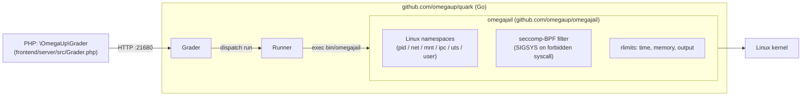

# Caixa de areia

Quando um concorrente envia o código, o omegaUp precisa compilá-lo e executá-lo em todos os casos de teste em suas próprias máquinas - programas C, C++, Python, Java, C#, Rust ou Karel não confiáveis de outra pessoa, executados em velocidade nativa total. A sandbox é o que torna isso seguro: é a camada que permite ao Runner executar o `system("rm -rf /")` de um estranho e não fazer nada.

O único fato a ser corrigido em sua cabeça antes de qualquer coisa: **nada disso reside no monorepo PHP.** Grep [`github.com/omegaup/omegaup`](https://github.com/omegaup/omegaup) para `minijail`, `sandbox` ou `quark` e você não obtém nenhum resultado. O lado PHP (`\OmegaUp\Grader` em [`frontend/server/src/Grader.php`](https://github.com/omegaup/omegaup/blob/main/frontend/server/src/Grader.php)) apenas envia um POST para o avaliador por HTTP em `OMEGAUP_GRADER_URL` (padrão `https://localhost:21680`) e depois lava as mãos. O sandbox é invocado pelo **Runner**, um dos serviços Go em [`github.com/omegaup/quark`](https://github.com/omegaup/quark), e o Runner é - para reutilizar o modelo mental da página [Runner internals](../architecture/runner-internals.md) - **basicamente um frontend bonito e distribuído para Minijail.** Tudo abaixo é a metade do sandbox dessa frase, descompactada.

## De onde veio o sandbox: Moeval, Martin Mareš e ptrace

O sandbox omegaUp original era *uma versão fortemente modificada do Moeval* — o sandbox usado no [IOI](https://ioinformatics.org/), escrito por Martin Mareš. Em sua primeira encarnação, o sandbox era, em essência, **um depurador**: ele usava a chamada de sistema `ptrace` do Linux para interromper o processo do concorrente toda vez que ele tentava um syscall, inspecionar esse syscall para decidir se era inofensivo ou perigoso e, em seguida, fazer uma das três coisas.

1. **Permitir** que o syscall prossiga normalmente - o caso comum para `read`, `write`, `mmap` e o restante do maquinário de perfuração que um programa precisa para realizar um trabalho útil.
2. **Substitua** o syscall por um inofensivo e então faça o processo *acreditar que a chamada falhou*. O truque canônico é trocar o syscall solicitado por `getuid` (que é completamente inerte) e retornar um erro ao chamador. É exatamente assim que o sandbox simula a ausência de uma rede: **cada chamada para `socket` retorna `-1`**, então o programa é informado, de forma plausível, de que ele simplesmente não tem rede - em vez de ser morto e vazar o fato de que estava sendo monitorado.
3. **Matar** o processo imediatamente, se o syscall for *MUY evil* — algo sem motivo legítimo para aparecer no programa de um concorrente.

As modificações que transformaram o Moeval no Sandbox do omegaUp — aquelas que *não* eram upstream — valem a pena preservar como memória institucional, porque cada uma foi um requisito real que alguém atingiu:

- **Mangling do Syscall** (o comportamento de substituir e falsificar um erro acima).
- **Suporte multithread**, para que os envios multithread possam ser rastreados corretamente.
- **Um modo detalhado** para examinar exatamente quais syscalls um programa fez - indispensável quando o tempo de execução de uma nova linguagem aciona o filtro e você precisa ver o que ele realmente pediu ao kernel.
- **Normalização de caminho**, para que o sandbox possa dizer, por exemplo, que `./` também é gravável, em vez de reconhecer apenas uma única grafia canônica de um caminho.
- **Lendo parâmetros de um arquivo**, para que você possa construir um *perfil por compilador/interpretador* em vez de limites de codificação na própria sandbox. Este é o ancestral da configuração atual por idioma.
- Muitas, muitas, *muitas* pequenas melhorias.
- Uma versão do Moeval **que não usa `ptrace`** — genuinamente multiplataforma, mas muito mais fraca em segurança e, portanto, apenas uma alternativa.

!!! note "Por que manter a história do ptrace se o mecanismo seguiu em frente?"
    O design de interposição `ptrace` é a *linhagem*, não o caminho ativo atual (veja abaixo). Está documentado aqui propositalmente: o truque de manipulação `setrlimit`-by-`getuid` e o comportamento "sockets return `-1`" são a explicação mais clara possível de *o que uma sandbox syscall está realmente fazendo*, e a implementação moderna resolve os mesmos problemas por meios diferentes. Se você remover isso para "ele intercepta syscalls", você excluiu o único parágrafo que informa ao novo mantenedor para que serve o sandbox *para*.

## O que funciona hoje: omegajail em cima do minijail

O sandbox atual é [**omegajail**](https://github.com/omegaup/omegajail), o próprio wrapper do omegaUp em torno do [minijail](https://google.github.io/minijail/) do Google — o mesmo minijail que foi criado para processos de sandbox no Chrome OS. Em vez de executar o processo em uma única etapa com `ptrace`, omegajail se baseia nas próprias primitivas de isolamento do kernel: Linux **namespaces** (um PID privado, rede, montagem, IPC, UTS e namespace de usuário, para que o programa não possa ver outros processos, não tem interface de rede e obtém uma visão simplificada do sistema de arquivos) mais um filtro **seccomp-BPF** que o kernel impõe diretamente, sem nenhum rastreador no loop. É por isso que tudo é rápido o suficiente para executar milhares de envios.

O Runner nunca fala diretamente com o minijail. Ele se destina ao binário `omegajail`, que é empacotado com um sistema de arquivos raiz independente e enviado como seu próprio artefato - consulte [`Dockerfile.minijail`](https://github.com/omegaup/quark/blob/de2cea4456201a264060761acda4694cc79b45ca/Dockerfile.minijail), que é literalmente `FROM scratch` mais `ADD bin/minijail-xenial-distrib-x86_64.tar.bz2 /`. No lado Go, o contrato que todo sandbox deve satisfazer é a interface `Sandbox` em [`runner/sandbox.go`](https://github.com/omegaup/quark/blob/de2cea4456201a264060761acda4694cc79b45ca/runner/sandbox.go#L108-L133) — três métodos, `Supported()`, `Compile(...)` e `Run(...)` — e a implementação de produção é `OmegajailSandbox` ([sandbox.go#L135](https://github.com/omegaup/quark/blob/de2cea4456201a264060761acda4694cc79b45ca/runner/sandbox.go#L135)).

`OmegajailSandbox.Supported()` é uma linha única que apenas verifica se `bin/omegajail` existe sob a *omegajail root* - cujo padrão é `/var/lib/omegajail` ([`common/context.go#L210`](https://github.com/omegaup/quark/blob/de2cea4456201a264060761acda4694cc79b45ca/common/context.go#L210)) e é transformado em um caminho absoluto e entregue a `NewOmegajailSandbox(omegajailRoot)` quando o Runner é inicializado ([`cmd/omegaup-runner/main.go#L753`](https://github.com/omegaup/quark/blob/de2cea4456201a264060761acda4694cc79b45ca/cmd/omegaup-runner/main.go#L753)). Se o omegajail não estiver instalado, `Supported()` retornará false e o Runner retornará à sandbox autônoma descrita no final desta página.


## Como o Runner invoca omegajail

Tanto `Compile` quanto `Run` constroem um vetor de argumento e o entregam ao auxiliar `invokeOmegajail` privado ([sandbox.go#L413](https://github.com/omegaup/quark/blob/de2cea4456201a264060761acda4694cc79b45ca/runner/sandbox.go#L413)), que precede o caminho para `bin/omegajail`, define `RUST_BACKTRACE=1` e `RUST_LOG=debug` no ambiente da criança (o próprio omegajail é escrito em Rust) e captura o próprio sandbox stderr em um arquivo secundário chamado `<errorFile>.omegajail` para que uma falha *no carcereiro* possa ser diferenciada de uma falha *no código do competidor*.

Para uma **execução**, os sinalizadores são montados em [`Run`](https://github.com/omegaup/quark/blob/de2cea4456201a264060761acda4694cc79b45ca/runner/sandbox.go#L321-L334) e lidos quase como um currículo do trabalho do sandbox:

```text
--homedir <chdir>            # the jailed working directory
-0 <inputFile>               # stdin  ← the test case's .in
-1 <outputFile>              # stdout → what we'll compare against .out
-2 <errorFile>               # stderr
-M <metaFile>                # where omegajail writes the .meta result (see below)
-m <bytes>                   # hard memory limit, in bytes
-t <ms>                      # CPU time limit, in milliseconds
-w <ms>                      # extra wall-clock time on top of the CPU limit
-O <bytes>                   # output limit, in bytes
--root <omegajailRoot>       # /var/lib/omegajail
--run <lang>                 # the language profile to load
--run-target <target>        # the compiled artifact to execute
```
Alguns deles carregam regras não óbvias que residem no código, não nos nomes dos sinalizadores:

- **O limite de memória passado para omegajail não é o limite de memória do problema.** É `base.Min(ctx.Config.Runner.HardMemoryLimit, limits.MemoryLimit)` ([sandbox.go#L319](https://github.com/omegaup/quark/blob/de2cea4456201a264060761acda4694cc79b45ca/runner/sandbox.go#L319)) — o limite rígido é atualmente **640 MiB** ([context.go#L208](https://github.com/omegaup/quark/blob/de2cea4456201a264060761acda4694cc79b45ca/common/context.go#L208), comentado na fonte como *"640MB deve ser suficiente para qualquer um"*). A sandbox impõe o menor dos dois, de modo que o autor do problema não pode conceder acidentalmente a um envio mais RAM do que a máquina está disposta a distribuir.
- **Java obtém um período de carência.** Antes de calcular o limite de tempo, `Run` faz `if lang == "java" { timeLimit += 1000 }` — um plano **+1000 ms** para absorver a inicialização da JVM, porque caso contrário, cada envio de Java consumiria todo o seu orçamento, fazendo o intérprete decolar.
- **`/dev/null` é trocado silenciosamente.** Se o arquivo de entrada for o `/dev/null` real, o Runner substitui um arquivo vazio na raiz do omegajail (`root/dev/null`), porque o processo preso não deve tocar nos nós do dispositivo do host.
- **Pontos de montagem extras tornam-se `--bind source:target`** — a menos que o sandbox esteja desativado, caso em que eles se tornam links simbólicos, porque você não pode vincular a montagem sem o sandbox (essa ramificação é o tratamento do `DisableSandboxing` em [sandbox.go#L335-L381](https://github.com/omegaup/quark/blob/de2cea4456201a264060761acda4694cc79b45ca/runner/sandbox.go#L335)).

Pouco antes de invocar omegajail, `Run` aquece o cache da página com um **pré-carregador de entrada** ([sandbox.go#L23](https://github.com/omegaup/quark/blob/de2cea4456201a264060761acda4694cc79b45ca/runner/sandbox.go#L23)): ele `mmap`s o arquivo de entrada e percorre uma página por vez, para que o programa do concorrente gaste menos de seu precioso limite de tempo bloqueado em leituras de disco para entrada que é garantido tocar. Esta é uma otimização de latência pura – se o `mmap` falhar, ele volta a ler o arquivo inteiro no `/dev/null` e segue em frente.

**Compilação** usa o mesmo mecanismo com um verbo diferente: `Compile` ([sandbox.go#L162](https://github.com/omegaup/quark/blob/de2cea4456201a264060761acda4694cc79b45ca/runner/sandbox.go#L162)) passa `--compile <lang>`, `--compile-target` e um `--compile-source` por arquivo de entrada, com o diretório de trabalho tornado gravável via `--homedir-writable`, e usa o orçamento *compilar* em vez do orçamento *executar*: **30 s** `CompileTimeLimit` e um **10 MiB** `CompileOutputLimit` ([context.go#L206-L207](https://github.com/omegaup/quark/blob/de2cea4456201a264060761acda4694cc79b45ca/common/context.go#L206)). Duas verrugas específicas da linguagem são tratadas in-line aqui, em vez de em uma passagem de erro separada: C # precisa de um `*.runtimeconfig.json` com link simbólico próximo à fonte antes de compilar, e para Java, se a compilação for bem-sucedida, mas nenhum arquivo `<Target>.class` aparecer, o Runner reescreverá o veredicto para `CE` e anexa a dica legível por humanos *"Certifique-se de que sua classe seja chamada `X` e fora todos os pacotes"* — porque o erro Java mais comum é uma classe com nome incorreto ou empacotada.

## O arquivo `.meta`: como um sinal se torna um veredicto

omegajail não retorna um veredicto. Ele executa o programa, impõe os limites e grava um pequeno arquivo **`.meta`** delimitado por dois pontos que o Runner analisa em `parseMetaFile` ([sandbox.go#L504](https://github.com/omegaup/quark/blob/de2cea4456201a264060761acda4694cc79b45ca/runner/sandbox.go#L504)). Os campos reconhecidos são `status` (código de saída), `time`, `time-sys`, `time-wall` (todos em microssegundos, divididos por `1e6` em segundos na entrada), `mem` (bytes) e - os interessantes - `signal` / `signal_number` e `syscall` / `syscall_number`.

Traduzir esses metadados brutos em um dos [veredictos](verdicts.md) do omegaUp é onde todo o modelo de segurança do sandbox surge como algo que um concorrente vê:

| O que omegajail relatou | Veredicto | Significado |
|---|---|---|
| `signal: SIGSYS` | **RFE** | *Erro de função restrita* — o programa fez uma syscall proibida e o seccomp a desativou. Este é o equivalente moderno do antigo caminho "kill" do ptrace. |
| `SIGILL`, `SIGABRT`, `SIGFPE`, `SIGKILL`, `SIGPIPE`, `SIGBUS`, `SIGSEGV` | **RTE** | Erro de tempo de execução – travado, abortado, dividido por zero, falha de segmentação. |
| `SIGALRM`, `SIGXCPU` | **TLE** | Limite de tempo excedido — o alarme de tempo de CPU ou o alarme do relógio de parede dispararam. |
| `SIGXFSZ` | **OLE** | Limite de saída excedido — o programa ultrapassou o `-O`. |
| sem sinal, `status == 0` | **OK** | Concluiu de forma limpa (ainda precisa produzir a resposta certa para se tornar AC). |
| sem sinal, status diferente de zero | **RTE** | Saiu com um código de falha. |

Além do mapeamento do sinal, `parseMetaFile` aplica duas correções que uma tabela vazia ocultaria. Se a memória relatada exceder o `MemoryLimit` do problema, o veredicto será substituído por **MLE** e a memória relatada será limitada ao limite - e para Java especificamente, uma saída diferente de zero cujo stderr contém `java.lang.OutOfMemoryError` é *também* tratada como MLE (`isJavaMLE`, [sandbox.go#L611](https://github.com/omegaup/quark/blob/de2cea4456201a264060761acda4694cc79b45ca/runner/sandbox.go#L611)), porque a própria JVM captura a falha de alocação e sai normalmente em vez de obter `SIGKILL`ed, então o caminho baseado em sinal não o alcançaria. E os programas Karel (`kj` / `kp`) mapeiam o status de saída `1` (o modo de falha `INSTRUCTION` do intérprete) para **TLE**, já que um programa Karel atingindo seu limite de instrução é moralmente um tempo limite.

## Limites de recursos: os números e onde eles são padrão

Os limites que o omegajail impõe são o `LimitsSettings` do problema, preso pelos tetos rígidos do Runner. Os padrões enviados atualmente (todos mutáveis por problema, então trate-os como *padrões*, não como leis):

| Limite | Padrão | Fonte |
|---|---|---|
| Tempo de CPU por caso | **1000ms** | [`problemsettings.go#L191`](https://github.com/omegaup/quark/blob/de2cea4456201a264060761acda4694cc79b45ca/common/problemsettings.go#L191) |
| Memória | **256 MiB** | [`problemsettings.go#L188`](https://github.com/omegaup/quark/blob/de2cea4456201a264060761acda4694cc79b45ca/common/problemsettings.go#L188) |
| Saída | **10 KiB** | [`problemsettings.go#L189`](https://github.com/omegaup/quark/blob/de2cea4456201a264060761acda4694cc79b45ca/common/problemsettings.go#L189) |
| Tempo total de parede | **5 sexo** | [`problemsettings.go#L190`](https://github.com/omegaup/quark/blob/de2cea4456201a264060761acda4694cc79b45ca/common/problemsettings.go#L190) |
| Tempo extra na parede | **0** | [`problemsettings.go#L187`](https://github.com/omegaup/quark/blob/de2cea4456201a264060761acda4694cc79b45ca/common/problemsettings.go#L187) |
| Teto de memória difícil | **640 MiB** | [`context.go#L208`](https://github.com/omegaup/quark/blob/de2cea4456201a264060761acda4694cc79b45ca/common/context.go#L208) |
| Tempo de compilação | **30 sexo** | [`context.go#L206`](https://github.com/omegaup/quark/blob/de2cea4456201a264060761acda4694cc79b45ca/common/context.go#L206) |
| Compilar saída | **10 MiB** | [`context.go#L206`](https://github.com/omegaup/quark/blob/de2cea4456201a264060761acda4694cc79b45ca/common/context.go#L206) |
| Produção global | **100 MiB** | [`context.go#L209`](https://github.com/omegaup/quark/blob/de2cea4456201a264060761acda4694cc79b45ca/common/context.go#L209) |

Os padrões de nível Runner (`common/context.go`, em torno de [L186](https://github.com/omegaup/quark/blob/de2cea4456201a264060761acda4694cc79b45ca/common/context.go#L186)) são mais flexíveis — um limite de tempo de caso de **10 s** e um limite de memória de **1 GiB** — porque são o envelope externo; as configurações por problema são o que realmente alcançam o ômegajail, sempre pegando o *mínimo* dos dois para que nenhum problema possa ultrapassar o teto da máquina.

## A versão do kernel é importante: o substituto do SIGSYS

A detecção de syscall proibido do omegajail depende de um recurso do kernel que só se tornou confiável no **Linux 5.13**. Para kernels mais antigos, `OmegajailSandbox` carrega um sinalizador `AllowSigsysFallback` ([sandbox.go#L140-L142](https://github.com/omegaup/quark/blob/de2cea4456201a264060761acda4694cc79b45ca/runner/sandbox.go#L140)) que, quando definido, anexa `--allow-sigsys-fallback` à invocação para que omegajail volte para *a implementação anterior do detector sigsys*. Se você estiver executando o Runner em um host anterior à 5.13 e os envios de syscalls proibidos estiverem sendo avaliados incorretamente, esta é a opção a ser alcançada - mas o substituto existe precisamente porque é *pior* que o mecanismo atual, então a correção certa a longo prazo é um kernel mais novo, não o sinalizador.

## Executando sem sandbox: CI, dev boxes e ambiente autônomo

Você nem sempre pode fazer sandbox. Contêineres de integração contínua, laptops de desenvolvedores e qualquer lugar onde namespaces de usuários sem privilégios estejam bloqueados simplesmente não podem executar o minijail. omegaUp lida com isso com duas saídas de emergência, e vale a pena entender a diferença:

- **`DisableSandboxing`** mantém o *real* `OmegajailSandbox` — você ainda compila e executa o código do competidor e obtém veredictos honestos — mas diz ao omegajail para rodar sem a prisão (`--disable-sandboxing`) e troca montagens de ligação por links simbólicos, já que a montagem de ligação precisa da sandbox. Isso é para quando você deseja uma classificação real, mas o host não consegue isolar.
- **`NoopSandbox`** ([`runner/noop_sandbox.go`](https://github.com/omegaup/quark/blob/de2cea4456201a264060761acda4694cc79b45ca/runner/noop_sandbox.go)) não faz *absolutamente*: ele cria arquivos de saída/erro/meta arquivos vazios e retorna `Verdict: "OK"`, e `NoopSandboxFixupResult` então reescreve toda a execução para **AC** com uma pontuação completa. Isso é estritamente para testar o encanamento *em torno* da execução (enfileiramento, envio, relatório de resultados) sem executar nada - nunca aponte para envios reais, porque isso classifica todos como perfeitos.

## Documentação relacionada

- [Runner Internals](../architecture/runner-internals.md) — como um envio chega à sandbox e o loop de compilação/execução/validação em torno dele.
- [Grader Internals](../architecture/grader-internals.md) — a fila e o despacho que alimentam o Runner.
- [Veredictos](verdicts.md) — a enumeração completa do veredicto que o mapeamento `.meta` produz (AC, PA, WA, TLE, MLE, OLE, RTE, RFE, CE, JE,…).
- [Segurança](../architecture/security.md) — onde o sandbox atua em profundidade na defesa geral do omegaUp.
